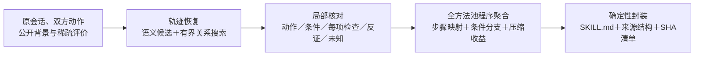

# 原始经历 → 轨迹恢复 → 工作流聚合 → 冻结技能库

本入口只做实验的生成侧。无需用户、个人采纳、数据库、网页、组织审批或后续自进化。`trace_to_skills.py` 默认运行本版；原十二阶段 Demo 和旧 `--algorithm legacy` 路径保留。

2026-10-05已完成416项免费检查、构造跨批聚合及真实τ² task50生成验收。真实交付2个查询候选技能，收益尚未测量；最终为保存真实关系回复＋1次新局部请求。失败、资源和限制见[验收报告](../../research/reports/2026-10-05_direct_experiment_pipeline_implementation.md)。

## 最短操作

在本项目 `enginering/demo` 目录运行，模型配置沿用本机 `.env`：

```powershell
python -X utf8 trace_to_skills.py --input examples/ecv_contract_mixed.json --output artifacts/my-library --preflight-only
python -X utf8 trace_to_skills.py --input examples/ecv_contract_mixed.json --output artifacts/my-library --max-calls 2
```

第一条不调用模型，先报告完整材料分成几批。第二条的预算至少覆盖预检给出的上限。每批通常 **两次请求**：关系恢复、局部经验抽取；聚合和封装不调用模型。没有任务的批次跳过第二次。冷启动预算不够时在调用前拒绝；不在运行中偷偷加预算或重试。

同一运行再次执行可使用 `--max-calls 0`。程序先核对输入、源码、配置和冻结文件SHA；完全相同才直接复用，不重新生成。要试新版本，请换新目录。显式 `--reuse-request-dir <旧目录>` 只复用请求、模型配置及响应均精确一致的成功记录，并重新验收；不会把不同请求的旧答案当新模型输出。

## 接入当前τ²实验

仅导入指定的演化会话，不读取评测金标：

```powershell
python -X utf8 import_experiment_traces.py --input ../../research/experiments/148_tau2_retail_autoskill/runs/collect/evolution.json --task-ids 0 50 96 --output artifacts/my-source/input.json
python -X utf8 trace_to_skills.py --input artifacts/my-source/input.json --output artifacts/my-tau-library --preflight-only
python -X utf8 trace_to_skills.py --input artifacts/my-source/input.json --output artifacts/my-tau-library --max-calls 4
```

导入生成 `input.json` 和旁边的来源清单，保留完整正文、原会话编号、原顺序、用户侧／助手侧工具调用及返回。整场 simulation ID 是会话编号，不能冒充每次响应的运行编号；这点已用实际电信用户操作验证。

如实验协议允许公开工具／政策及稀疏评价，用 `--context <C数组.json>`、`--evaluations <V数组.json>` 分别传入。默认 `C=[]，V=[]`，不自动猜政策，不读隐藏用户目标、正确动作、期望数据库终态或完整 `reward_info`。给本方法新增评价时，对照基线也应拿到同样信息。

成功运行后，现有消费器设置：

```powershell
$env:TAU2_RETAIL_SKILLS_DIR = 'D:\skillsgen-industry_track\enginering\demo\artifacts\my-tau-library\skills'
python -X utf8 -c "from skilldemo.library_export import verify_frozen; print(verify_frozen('artifacts/my-tau-library'))"
```

之后按原实验协议启动消费者。**挂载 `skills` 子目录**，不把原对话、请求日志等整个运行目录给消费者。此命令不自动执行benchmark，也不修改旧 AutoSkill 基线库。`READY_FOR_EXPERIMENT` 表示文件与契约可接入，技能效果须在独立任务上测量。

## 输入仍是X=(E,C,V)

- **E：发生过什么。** 原消息、真实调用和回执；不能用助手“已经完成”替代调用。
- **C：当时允许知道什么。** 公开工具、政策、业务说明及版本；没有就空。
- **V：真正核对了什么。** 原评价标准、目标消息／动作、评价范围、结果、来源及是否核验；没有就空。总体得分不会拆成每一步的成功或失败。

格式沿用 [E/C/V示例](examples/ecv_contract_mixed.json)。附件缺失、结果未知、关系未决都保留。超预算的单会话拒绝处理并说明原因，不截断最后的失败信息。默认每批最多4个完整会话、48000字符；可显式调 `--batch-sessions`、`--batch-chars`。独立会话的任务实例在恢复时分开，方法归组交给后续聚合。

## 两个算法实际做什么



**恢复**先接对任务、要求变更、对象、动作和反馈关系。随后模型提出局部方法，程序核对真实调用、行动方、检查目标与原标准、依赖及来源闭包。工具传输正常但明确返回错误，仍保留错误观察。编号检查只支持“编号”这项原标准；模型给它换个维度名也不能认证整步。TASK／ATTEMPT总体评价不会下放。未知和未分配材料保留，不能说成无价值噪音。

**聚合**比较局部目标、对象、作用效果和动作，显式计算步骤与依赖的对应，保留共同主干和每个来源的条件路径。只接受全体成员能被表示、且固定结构编码有正压缩收益的合并；不预设技能数。失败、未知、单例不因压缩被删除。同条件反例限制相关步骤，不能由多数成功覆盖。所有抽取批次先进入一个方法池，再统一聚合。

**封装**由程序直接写出已有方法和边界。已知失败、冲突、自述和计划进入单独说明，不能混成成功操作；前置依据失败时，依赖它的后继也暂不作为连续执行建议。只有计划／自述而没有实际方法的工作流保留在候选记录，不机械地生成空技能。正文按依赖排序，相同正文路径不重复列操作。来源文件保留全部原路径，不虚构跨路径组合已经执行成功。标准 YAML 元信息和 `SKILL.md` 可由 OpenClaw 读取，默认再用现有官方 skill-creator 脚本校验打包。

## 产物

| 路径 | 内容 |
|---|---|
| `input.json`、`normalized_input.json` | 原输入、统一格式、原编号映射 |
| `batches/*/01_collected.json` | 每批会话与回合整理 |
| `02_recovered.json` | 所有恢复任务、要求、尝试、未决关系 |
| `03_local_experience.json` | 局部方法、逐项核对、完整来源目录、未分配材料 |
| `04_workflows.json` | 步骤对应、条件路径、反例、每次合并及压缩量 |
| `05_deferred_workflows.json` | 没有实际方法而暂不封装的工作流及理由，完整内容仍在前述文件 |
| `skills/*/SKILL.md` | 实验Agent实际读取的技能正文 |
| `skills/*/references/workflow.json` | 该技能的结构和来源见证，包含失败记录 |
| `packaging/` | 官方校验的 `.skill` 包及回执 |
| `frozen_manifest.json` | 冻结技能文件SHA、算法与请求来源 |
| `run.json`、`requests/`、`invocations/` | 状态、预算、真实响应、用量和复入记录 |
| `source_snapshot/` | 本次代码快照，供定位及复算；模型配置在运行清单，密钥不复制 |

输出目录独占锁保护。不同输入或代码不能覆盖原运行；失败保留原始记录且不能通过冻结验真。模型响应不合法不会自动再次花费请求。`--structural-only` 可显式跳过官方包，只输出可读技能源码并如实标注。

## 已实现能力的边界

候选索引使用模型提出的统一语义标签和真实工具类型，不是向量聚类或全局最优图匹配；不同批次给同义方法取不同标签时可能漏合并。程序核对来源、范围、依赖和字段，不证明任意自然语言完全正确。上游漏识别的完成自述、未列全的隐含要求仍需用独立标注评估。公开规则与当时观察到的条件分开保留；未知方法可进入候选库，但不会被认证成黄金经验。

本版没有主动重跑修复、SFT或RL，没有自动采纳／组织发布。减少模型派发次数不等于总token或消费成本已下降；技能数量减少也不等于成功率提高。后续实验固定同一消费者和信息预算，分别比较库质量、任务得分与资源开销。
