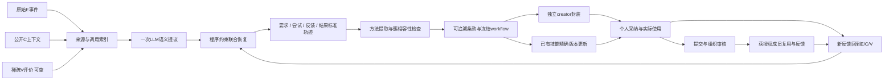

# 启发式算法实施与验收计划

本轮将已确认的科研算法变为独立Demo可调用的管道；不是模型训练任务，也不启动大规模评测。

| 路径 | 本轮改动 | 验收依据 |
|---|---|---|
| evidence / intake | 贯通原动作、工具结果、附件状态、公开上下文和稀疏评价 | callId失败、评价白名单、上下文指纹、缺失保留 |
| relational | 一次LLM联合提议，程序约束beam恢复、要求维度状态与反馈归属；按唯一调用编号补齐已绑定动作的回执 | A→B→A、迟到反馈、要求替换、未知歧义、同来源唯一调用/返回、业务未知保持 |
| front / core / runtime / cache | 接通heuristic分支、模型额度、持久化和旧来源失效 | 重启/缓存/元数据变化/跨成员与用途隔离 |
| relational_workflow / workflow | 恢复关系约束方法证据、聚类边界和最终条款 | 任务总评不下放、计划不变能力、簇相容性、来源依赖 |
| creator / learning / evolution | 复用公开SKILL.md封装和精确版本更新；宿主冻结来源、范围和新增正文，新契约用一次结构化LLM选择增量及唯一锚 | 本地实际打包、来源/正文不可改、冲突或位置不明延期、个人试用/反馈/v2、组织审批边界；legacy代理保持 |
| check_heuristic_pipeline | 新目录冻结输入/配置/代码摘要，fixture与live分开 | 可重跑案例、失败原attempt保留、无隐式重试 |

当前项目无Trellis规格目录或相关任务状态。本次规格依据是十二阶段契约与HEURISTIC_PIPELINE_SPEC，不安装全局框架、不创建会丢失未跟踪Demo源码的Git工作树、不处理无关改动。使用测试先行和独立审阅的开发纪律；已有研究方案及本轮用户确认作为实现授权，不重复要求批准同一方案。全量回归基线为92项通过（本轮改动前实际运行）。新增输入契约先验证缺模块失败，再实现并验证5项通过；该失败仅为功能缺失证据，不冒充算法性能测试。

判定完整：模型fixture必须实际产生合法技能包，并使反馈重新经过恢复与聚合，编译/打包/采纳同技能v2；它只证明宿主数据契约及状态通路。真实模型另验生成、消费和反馈，更新可能合法SUPPORT/DEFER，不能为获得v2强行选条款；未产生v2与程序失败分别记录。真实烟测不替代独立benchmark。最终验收同时披露未知项、源码摘要、请求数和是否有真实工具读取。有效率、净资源消耗和显著评分增益留在独立后续实验验证。
