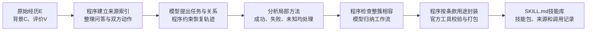

# 文件输入 → 轨迹恢复 → 技能库

> 本文保留第一版入口的说明。当前默认已升级为[直接实验管道](DIRECT_PIPELINE_README.md)：局部证据核对＋程序聚合，默认每批两次请求。复现本文旧路径时加 `--algorithm legacy --max-calls 3`；原验收历史保持。

这是本轮新增的轻量入口。只提供一份 `X=(E,C,V)` 文件即可运行；不需要注册成员、启动网页、连接数据库或完成组织审核。原十二阶段 Demo 仍保留，两个入口复用相同的恢复、聚类和封装算法。

## 怎样运行

本机模型配置沿用 `enginering/demo/.env`。不需要重新填写已配置的密钥。

```powershell
cd D:\skillsgen-industry_track\enginering\demo
python -X utf8 trace_to_skills.py --input examples/ecv_contract_mixed.json --output artifacts/light-pipeline/my-first-run --max-calls 3
```

示例是公开的人工构造材料：先审阅协议，中途起草通知，再回到协议纠正编号。两条评价只检查协议编号，不能证明审阅的法律质量。替换 `--input` 即可处理自己的材料。

`--output` 必须是新目录，或者完全相同输入、代码和模型配置的原运行目录。已成功的请求可复用；失败请求不会自动重发。失败后需要修复或另开尝试时用新目录，旧记录保留。相同输出目录不能同时运行。若进程异常退出留下 `.pipeline.lock`，先确认该进程已结束，再人工移除这一锁文件；程序不会自动抢占。

若只修改宿主算法，需要减少重复模型请求，可显式加 `--reuse-request-dir <旧运行目录>`。程序仅复用原请求、模型配置、完整输入和保存响应均精确一致的成功结果，并重新通过当前校验；其余阶段正常调用。账本标记“保存响应重验”，使用量属于原调用，不计成新请求。这类分段验收应与全新实时运行分开报告，原失败不会被追认为成功。

## 输入是什么

```json
{
  "E": [
    {"id": "u1", "sessionId": "s1", "role": "user", "order": 1, "content": "检查协议，保留条款2.1的编号。"},
    {"id": "a1", "sessionId": "s1", "role": "assistant", "order": 2, "content": "1. 建议明确交付期限。"},
    {"id": "u2", "sessionId": "s1", "role": "user", "order": 3, "content": "你把2.1改成1了，请保留原编号。"},
    {"id": "a2", "sessionId": "s1", "role": "assistant", "order": 4, "content": "2.1 建议明确交付期限。"}
  ],
  "C": [{"id": "policy1", "kind": "PUBLIC_CONTEXT", "text": "审阅时保留输入中的原条款编号。", "source": "公开交付规范"}],
  "V": [{"id": "check1", "source": "编号人工核对", "scope": "STEP", "targetIds": ["a1"], "criterion": "保留原编号2.1", "result": "FAILURE", "verified": true, "verificationBasis": "逐字比较输入2.1与输出1，仅检查编号"}]
}
```

- **E 是经历**：用户与 AI 原话、实际工具调用、工具回执。支持用户侧和助手侧的工具调用，包括只有动作、没有正文的消息。它们仍保留真实行动方，不能冒充用户提问。
- **C 是背景**：可见政策、工具说明、权限或普通公开上下文。没有就填 `[]`。
- **V 是评价**：谁评价、评价哪一条消息／动作／产物、按什么标准、范围多大、结果如何。没有就填 `[]`。任务整体失败不会传播成每一步失败；感谢也不自动证明完成。

也接受现有 `events/context/evaluations` 字段。没有会话编号或消息编号时生成导入编号；没有时间时用导出位置，不能据此宣称真实时间已核实。消息顺序冲突、来源引用不明或输入超长时明确报告，避免猜造完整轨迹。

调用者只提供学习阶段可见的信息。不要输入完整 `reward_info`、评测金标动作、期望数据库终态或隐藏任务答案；接口限制稀疏结果和溯源结构，但无法替调用者核实一段文字是否泄露了评测答案。

## 实际处理链路



**轨迹恢复**回答：哪些话属于同一任务，要求何时改变，哪个回复或动作被纠正，评价究竟检查了什么。模型提供语义候选，程序核对来源、时序、要求版本和关联约束；不把相邻问答自动当成同一任务。工具的原位置和模型推断的任务归属分别保存。

同一条用户消息可以拆成多个任务片段；属于同一任务的要求一起生效，再绑定该回合的助手交付。这样，“保留编号，同时改成表格”不会因拆片顺序而让回复只继承其中一项要求。以后回到旧任务时，未撤回的立场和编号要求继续保留。

**工作流聚类**比较局部方法的输入、输出、对象、条件和步骤。两个簇合并时，所有跨簇配对都要兼容，整个簇也不能出现要求冲突或依赖环。缺少相容依据就分开，不靠几个共同关键词强行合并。

**成功／失败处理**参考 Trace2Skill：从成功经历保留有依据的方法，从失败经历提炼边界与教训，有已验证修订时保留修订方法。我们的具体处理把恢复关系和评价范围传到条款上：推荐步骤、失败警示、待验证假设分开。已知失败原动作不进入推荐步骤；警示可能描述风险动作，也可能描述“避免擅自修改编号”这类防范规则，程序不会在防范规则前再加一个“不要”而反转含义。当前任务要求不会被写成所有未来任务的默认值。

未知结果的真实方法仍可生成候选，不要求用户说“满意”。只有承诺或未经尝试的新修复办法不能冒充成功经验。本入口不自动重跑环境、推断已证根因或执行 Trace2Skill 的主动修复验证。

## 输出在哪里

| 文件／目录 | 用人话解释 |
|---|---|
| `input.json`、`normalized_input.json` | 原输入、统一格式及原编号映射 |
| `01_collected.json` | 原事件、问答视图、未配对消息 |
| `02_03_recovered.json` | 恢复的任务轨迹、要求变化、尝试、反馈和未决关系 |
| `experience_routes.json` | 按可见结果区分分析路线；不是逐步成败标签 |
| `04_batches/` | 每批方法、聚类、工作流及保留／排除／延期理由 |
| `skills/index.json`、`skills/*/SKILL.md` | 可读取的候选技能库，推荐与警示分节 |
| `packaging/*/packages/*.skill` | 官方 OpenClaw bundled skill-creator 生成并核对的技能包 |
| `evidence/` | 每个技能的来源、条款用途和覆盖核对；独立于消费正文 |
| `requests/`、`invocations/`、`run.json` | 请求、完整响应、历史尝试和当前运行状态 |

技能遵循现有 `SKILL.md` 与 YAML 元信息规范，可复制到消费 Agent 的技能目录。生成库在这里是待使用候选，不自动个人采纳、组织发布，也没有执行新任务。只有警示的技能可以用于失败规避，但不会声称拥有已成功执行的流程。

## 模型调用与当前边界

有界小输入通常只需 **3 次结构化请求**：恢复一次、方法提取一次、工作流归纳一次。技能封装由程序完成，**不再额外启动 creator 模型**。没有可学方法时跳过归纳。沿用现有模型适配器的直接结构化接口，不启动长链工具 Agent。

超过 8 个恢复任务时按每批最多 8 个依次处理；预算上界为 `1 + 2 × 批数`，用 `--max-calls` 显式设置。预算达到即停止并保留全部已完成材料。批内有关系约束聚类；跨批不做未经模型比较的语义合并，完全相同的已编译技能合并条目并保留多份来源。因此大库的全局去重／跨批聚类仍是后续工作，不能把当前批处理称为全局最优聚类。

恢复来源投影和证据目录也有字符预算：超预算保留原输入并报错，不截断尾部；本版不提供超长会话跨窗口恢复。`run.json` 分开列本次新请求数与全运行已记录的请求数；缓存或保存响应回放不计为新模型请求。默认没有自动重试。

免费契约检查、官方打包和一个真实模型案例只证明入口可运行及限定的条款保护；关系语义准确率、库的复用效果、成本优势和 benchmark 得分需要后续独立评测。
