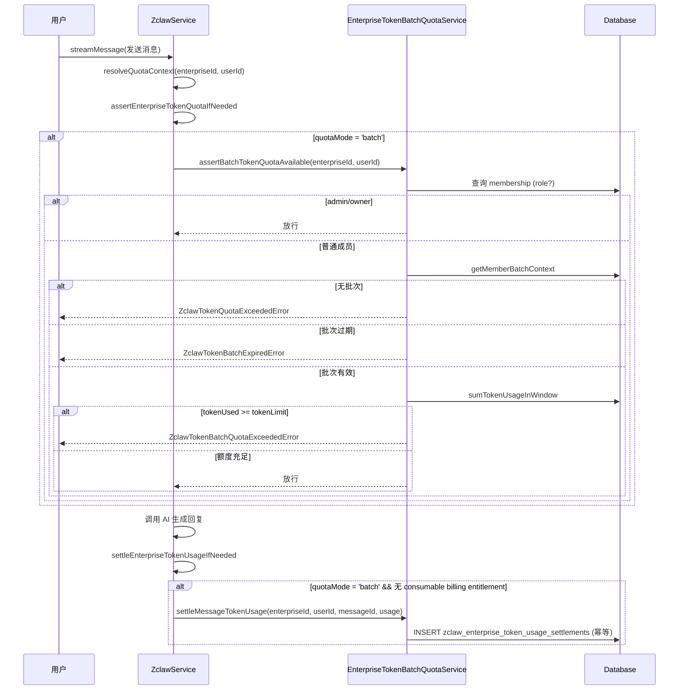

# Token 批次配额、批次管理与到期后购买模式 — 完整流程研究

> 研究日期：2026-07-21
> 分支：feat/quota-expiry-ui-optimization
> 目的：为人类审阅者提供完整的配额系统流程文档

---

## 一、数据模型

### 1.1 核心表关系

```
Enterprise (1) ──┬── (N) ZclawEnterpriseTokenQuotaBatch (批次)
                 │         └── (N) ZclawEnterpriseTokenQuotaMember (批次成员)
                 ├── (1) EnterpriseDefaultQuotaPolicy (默认配额策略开关)
                 ├── (1) EnterprisePostExpiryPurchaseConfig (到期后购买模式)
                 ├── (1) EnterpriseWorkspaceQuotaConfig (空间配额)
                 ├── (1) ZclawEnterpriseConversationQuotaConfig (配额模式: conversation/token/batch/unlimited)
                 └── (N) EntitlementBatch (权益批次 — 月包/补充包/分配)
                           └── (N) EntitlementLedger (权益流水)
```

### 1.2 ZclawEnterpriseTokenQuotaBatch（Token 配额批次）

> 来源：`packages/db/prisma/schema.prisma:738-758`

| 字段 | 类型 | 说明 |
|------|------|------|
| id | String (UUID) | 主键 |
| enterpriseId | String | 所属企业 |
| name | String | 批次名称 |
| tokenLimit | BigInt | Token 上限 |
| validFrom | DateTime | 生效开始 |
| validTo | DateTime | 生效结束 |
| isDefault | Boolean | 是否默认批次 |
| status | String | `active` / `cancelled` |
| note | String? | 备注 |
| createdBy | String? | 创建者 |

索引：`(enterpriseId, status)`、`(enterpriseId, isDefault)`

### 1.3 ZclawEnterpriseTokenQuotaMember（批次成员）

> 来源：`packages/db/prisma/schema.prisma:760-778`

| 字段 | 类型 | 说明 |
|------|------|------|
| id | String (UUID) | 主键 |
| batchId | String | 所属批次 |
| enterpriseId | String | 所属企业 |
| userId | String | 用户 |
| assignedAt | DateTime | 分配时间 |
| validFrom | DateTime? | 成员级有效期覆盖（覆盖批次的 validFrom） |
| validTo | DateTime? | 成员级有效期覆盖（覆盖批次的 validTo） |

唯一约束：`(enterpriseId, userId)` — 一个用户在一个企业只能属于一个批次。

### 1.4 EntitlementBatch（权益批次）

> 来源：`packages/db/prisma/schema.prisma:1014-1055`

| 字段 | 类型 | 说明 |
|------|------|------|
| id | String (UUID) | 主键 |
| enterpriseId | String | 所属企业 |
| userId | String? | 用户（null 表示企业级） |
| subjectType | String | `enterprise` / `enterprise_user` |
| entitlementType | String | `monthly_plan` / `token` / `storage` / `member` / `feature` |
| sourceType | String | 来源类型（如 `consumer_monthly_plan`、`enterprise_allocation`） |
| grantedAmount | BigInt | 授予总量 |
| remainingAmount | BigInt | 剩余量 |
| freezeAmount | BigInt | 冻结量 |
| validFrom | DateTime | 生效开始 |
| validUntil | DateTime? | 生效结束（null = 永久） |
| status | String | `active` / `scheduled` / `frozen` / `voided` / `expired` |
| dependencyPolicy | Json? | 依赖策略（如 `{requiresActiveMonthlyPlan: true}`） |
| metadata | Json? | 元数据 |

### 1.5 EntitlementLedger（权益流水）

> 来源：`packages/db/prisma/schema.prisma:1147-1180`

| 字段 | 类型 | 说明 |
|------|------|------|
| batchId | String | 关联批次 |
| changeType | String | `grant` / `freeze` / `capture` / `release` / `allocate` / `expire` / `void` |
| amount | BigInt | 变动量（正/负） |
| beforeAmount / afterAmount | BigInt | 变动前后余额 |
| beforeFreezeAmount / afterFreezeAmount | BigInt | 变动前后冻结量 |
| idempotencyKey | String (unique) | 幂等键 |
| refType / refId | String? | 引用类型/ID |

### 1.6 EnterpriseDefaultQuotaPolicy（默认配额策略）

> 来源：`packages/db/prisma/schema.prisma:1057-1073`

| 字段 | 类型 | 说明 |
|------|------|------|
| enterpriseId | String (unique) | 企业 |
| enabled | Boolean | 是否启用默认配额 |
| enabledBy / enabledAt | String? / DateTime? | 启用操作人/时间 |
| disabledBy / disabledAt | String? / DateTime? | 禁用操作人/时间 |
| disableReason | String? | 禁用原因 |

### 1.7 EnterprisePostExpiryPurchaseConfig（到期后购买模式）

> 来源：`packages/db/prisma/schema.prisma:1075-1087`

| 字段 | 类型 | 说明 |
|------|------|------|
| enterpriseId | String (unique) | 企业 |
| mode | String | `contact_admin`（默认）/ `admin_purchase` / `self_purchase` |
| enabledBy / enabledAt | String? / DateTime? | 操作人/时间 |

### 1.8 EnterpriseWorkspaceQuotaConfig（空间配额）

> 来源：`packages/db/prisma/schema.prisma:260-270`

| 字段 | 类型 | 说明 |
|------|------|------|
| enterpriseId | String (unique) | 企业 |
| memberDefaultWorkspaceQuotaBytes | BigInt | 成员默认空间配额（默认 10GB） |

---

## 二、Token 批次配额设置

### 2.1 配额模式切换

系统支持四种配额模式：`conversation`、`token`、`batch`、`unlimited`。

> 来源：`.trellis/spec/api/quota-mode-architecture.md:1-5`

模式存储在 `ZclawEnterpriseConversationQuotaConfig.quotaMode` 字段中。

**切换入口**：`DefaultQuotaPolicyService.updatePolicy()`
> 来源：`apps/api/src/billing/default-quota-policy.service.ts:50-115`

```
管理员启用默认配额 → enabled=true → quotaMode 切换为 'batch'
管理员禁用默认配额 → enabled=false → quotaMode 切换为 'unlimited'
```

关键逻辑（`default-quota-policy.service.ts:87-88`）：
```typescript
const quotaMode = input.enabled ? 'batch' : 'unlimited';
await this.switchQuotaMode(tx, input.enterpriseId, actorUserId, quotaMode);
```

**限制**：
- C 端企业（`consumer`/`evomind_consumer`）不支持默认配额（`default-quota-policy.service.ts:56-58`）
- `effectiveEnabled` 仅对 B2B 企业为 true（`default-quota-policy.service.ts:25-26`）

### 2.2 默认批次创建

> 来源：`apps/api/src/zclaw/enterprise-token-batch-quota.service.ts:107-151`

`ensureDefaultBatch(enterpriseId, {tokenLimit, validFrom, validTo, createdBy})`：
- 如果已存在 `isDefault=true` 的批次 → 更新其 tokenLimit/validFrom/validTo/status
- 如果不存在 → 创建名为"默认配额"的批次

### 2.3 成员分配到批次

| 方法 | 来源 | 说明 |
|------|------|------|
| `assignMemberToBatch` | `:153-182` | 将用户分配到指定批次（upsert） |
| `assignMemberToDefaultBatch` | `:184-193` | 将用户分配到默认批次 |
| `assignMemberToDefaultBatchWithDynamicValidity` | `:195-229` | 分配并设置成员级有效期（now → now+N月） |
| `syncActiveMembersToDefaultBatch` | `:231-276` | 批量同步所有活跃成员到默认批次（排除 admin/owner） |

### 2.4 空间配额

> 来源：`apps/api/src/zclaw/enterprise-token-batch-quota.service.ts:1076-1082`

`resolveBatchStorageBytes(enterpriseId)` 读取 `EnterpriseWorkspaceQuotaConfig.memberDefaultWorkspaceQuotaBytes`，作为批次模式下每个成员的空间配额。

---

## 三、批次管理（生命周期）

### 3.1 创建批次

> 来源：`apps/api/src/zclaw/enterprise-token-batch-quota.service.ts:534-589`

`createBatch(operatorUserId, {enterpriseId, name, tokenLimit, validFrom, validTo, userIds, note})`：
1. 校验 validFrom < validTo
2. 校验 userIds 非空
3. 验证所有用户是活跃成员且非 admin/owner
4. 创建批次记录（`isDefault=false, status='active'`）
5. 逐个将用户分配到该批次

### 3.2 更新批次

> 来源：`apps/api/src/zclaw/enterprise-token-batch-quota.service.ts:591-625`

`updateBatch(batchId, {name?, tokenLimit?, validFrom?, validTo?, note?})`：
- 不能更新已取消的批次
- 校验新的 validFrom < validTo

### 3.3 取消批次

> 来源：`apps/api/src/zclaw/enterprise-token-batch-quota.service.ts:627-670`

`cancelBatch(batchId)`：
1. 默认批次不可取消
2. 必须存在活跃的默认批次
3. 事务内：将该批次所有成员迁移到默认批次 → 标记批次为 `cancelled`

### 3.4 成员迁移

> 来源：`apps/api/src/zclaw/enterprise-token-batch-quota.service.ts:672-739`

`migrateMembers(sourceBatchId, targetBatchId, userIds)`：
- 源和目标不能相同
- 目标批次必须是 active
- 源和目标必须属于同一企业
- 验证用户确实在源批次中
- 批量更新 batchId

### 3.5 批次有效性判断

> 来源：`apps/api/src/zclaw/enterprise-token-batch-quota.service.ts:369-387`

```typescript
isBatchCurrentlyEffective(batch, now):
  status === 'active' && now >= validFrom && now <= validTo

isBatchExpired(batch, now):
  status === 'active' && now > validTo
```

### 3.6 EntitlementBatch 生命周期操作

> 来源：`apps/api/src/billing/entitlement.service.ts`

| 操作 | 方法 | 行号 | 说明 |
|------|------|------|------|
| 授予 | `grantPlan` | :423 | 根据 planType 分发到不同 grant 方法 |
| 分配 | `allocateEnterpriseEntitlement` | :2076 | 从企业池分配到用户（冻结父批次 → 创建子批次） |
| 回收 | `reclaimEnterpriseEntitlement` | :2211 | 从用户回收到企业池 |
| 冻结 | `freezeEntitlements` | :1638 | 消费前冻结 Token（batch 模式跳过） |
| 冻结账户包 | `freezeAccountPackages` | :1735 | 冻结用户所有活跃包 |
| 解冻账户包 | `unfreezeAccountPackages` | :1777 | 解冻 |
| 作废 | `voidActiveAutoAllocatedBatch` | :3070 | 作废自动分配的批次 |
| 作废计划批次 | `voidScheduledPoolBatch` | :3387 | 作废计划中的池批次 |
| 冻结池批次 | `freezeActivePoolBatch` | :3538 | 管理员冻结 |
| 解冻池批次 | `unfreezePoolBatch` | :3654 | 管理员解冻 |
| 过期 | `expireEntitlements` | :4873 | 批量过期所有 validUntil < now 的批次 |

### 3.7 过期处理

> 来源：`apps/api/src/billing/entitlement.service.ts:4873-4927`

`expireEntitlements(actorUserId, dto, idempotencyKey)`：
1. 查找所有 `status in [active, scheduled, paused, frozen]` 且 `validUntil < now` 的批次
2. 事务内逐个：`status → 'expired'`，`remainingAmount → 0`
3. 写入 `changeType='expire'` 的流水记录

### 3.8 effectiveStatus 计算

> 来源：`apps/api/src/billing/entitlement.service.ts:6686-6696`

```typescript
effectiveStatus(batch, now):
  if status in [voided, expired, frozen] → 返回原 status
  if validUntil && validUntil <= now → 'expired'
  if validFrom > now → 'scheduled'
  else → 'active'
```

---

## 四、运行时流程（用户发消息）

### 4.1 配额检查入口

> 来源：`apps/api/src/zclaw/zclaw.service.ts:2020-2043`

`assertEnterpriseTokenQuotaIfNeeded(enterpriseId, userId, ctx?)`：

```
quotaMode = ctx?.quotaMode ?? 从 DB 读取
├── 'unlimited' → 直接返回（不限制）
├── 'conversation' → assertConversationQuotaAvailable（检查剩余对话数）
├── 'batch' → enterpriseTokenBatchQuotaService.assertBatchTokenQuotaAvailable
└── 其他（'token'）→ enterpriseTokenQuotaService.assertTokenQuotaAvailable
```

### 4.2 Batch 模式配额断言

> 来源：`apps/api/src/zclaw/enterprise-token-batch-quota.service.ts:389-436`

`assertBatchTokenQuotaAvailable(enterpriseId, userId)`：

1. 查询 membership → admin/owner 直接放行
2. `getMemberBatchContext(enterpriseId, userId)` → 获取用户所在批次
3. 无批次 → 抛出 `ZclawTokenQuotaExceededError`
4. 批次不在有效期内：
   - 已过期 → 抛出 `ZclawTokenBatchExpiredError`
   - 未开始 → 抛出 `ZclawTokenQuotaExceededError`
5. 计算成员有效窗口：`effectiveFrom = member.validFrom ?? batch.validFrom`
6. 成员窗口已过期 → 抛出 `ZclawTokenBatchExpiredError`
7. 成员窗口未开始 → 抛出 `ZclawTokenQuotaExceededError`
8. 统计窗口内已用 Token：`sumTokenUsageInWindow`
9. `tokenUsed >= batch.tokenLimit` → 抛出 `ZclawTokenBatchQuotaExceededError`

### 4.3 Token 使用结算

> 来源：`apps/api/src/zclaw/zclaw.service.ts:2149-2227`

`settleEnterpriseTokenUsageIfNeeded(enterpriseId, userId, messageId, usage, toolBillingTokens, ctx?)`：

```
quotaMode:
├── 'conversation' → enterpriseTokenQuotaService.settleMessageTokenUsage（仅记录）
├── 'unlimited' → enterpriseTokenQuotaService.settleMessageTokenUsage（仅记录，含 toolBilling 调整）
├── 'token' → enterpriseTokenQuotaService.settleMessageTokenUsage（含 toolBilling 调整）
└── 其他:
    ├── hasConsumableBillingEntitlement=true → enterpriseTokenQuotaService.settleMessageTokenUsage
    ├── quotaMode='batch' → enterpriseTokenBatchQuotaService.settleMessageTokenUsage
    └── 兜底 → enterpriseTokenQuotaService.settleMessageTokenUsage
```

### 4.4 Batch 模式结算

> 来源：`apps/api/src/zclaw/enterprise-token-batch-quota.service.ts:438-501`

`settleMessageTokenUsage(enterpriseId, userId, messageId, usagePayload)`：
1. admin/owner 不记录
2. 无批次或批次不在有效期 → 不记录
3. 成员窗口外 → 不记录
4. 计算加权 Token：`estimateZclawWeightedTokens(usagePayload)`
5. 写入 `zclaw_enterprise_token_usage_settlements` 表（幂等：`zclaw-token-settle-{enterpriseId}-{userId}-{messageId}`）

### 4.5 用户时间窗口计算

> 来源：`apps/api/src/zclaw/enterprise-token-batch-quota.service.ts:863-987`

`calculateUserTimeWindow(enterpriseId, userId, now)`：
1. 查询 zclaw 批次成员关系
2. 查询 entitlement 批次（排除 monthly_plan 锚点）
3. 合并两个来源构建时间线
4. 按 effectiveFrom 排序
5. 返回 `{currentWindow, queue}`

### 4.6 账户有效期计算

> 来源：`apps/api/src/zclaw/enterprise-token-batch-quota.service.ts:989-1063`

`computeAccountValidity(enterpriseId, userId, now)`：
1. 优先查用户级 `monthly_plan` 锚点（active + 在有效期内）
2. 回退到 `calculateUserTimeWindow` 的 currentWindow
3. 再回退到冻结批次 → 返回 `status: 'expired'`
4. 都没有 → 返回 null

有效期状态（`:1065-1074`）：
- `remainingMs <= 0` → `expired`
- `remainingMs <= 7天` → `expiring_soon`
- 否则 → `active`

---

## 五、到期后三种购买模式

### 5.1 模式定义

> 来源：`packages/shared/src/enterprise-kind.ts:27-37`

```typescript
export const PURCHASE_MODE_CONTACT_ADMIN = 'contact_admin';   // 联系管理员
export const PURCHASE_MODE_ADMIN_PURCHASE = 'admin_purchase'; // 管理代购
export const PURCHASE_MODE_SELF_PURCHASE = 'self_purchase';   // 用户自购
export type PurchaseMode = 'contact_admin' | 'admin_purchase' | 'self_purchase';
```

### 5.2 模式解析

> 来源：`apps/api/src/billing/purchase-mode.ts:12-21`

```typescript
export async function resolvePurchaseMode(prisma, enterpriseId): Promise<PurchaseMode> {
  const config = await prisma.enterprisePostExpiryPurchaseConfig.findUnique({
    where: { enterpriseId },
    select: { mode: true },
  });
  return (config?.mode as PurchaseMode) ?? PURCHASE_MODE_CONTACT_ADMIN;
}
```

**默认值**：未配置时返回 `contact_admin`。

### 5.3 配置 CRUD

> 来源：`apps/api/src/enterprises/enterprise-post-expiry-config.service.ts:1-110`

**API 端点**：
- `GET /enterprises/:enterpriseId/post-expiry-purchase-config` — 任何活跃成员可读
- `PATCH /enterprises/:enterpriseId/post-expiry-purchase-config` — 仅 admin/owner/平台管理员可写

> 来源：`apps/api/src/enterprises/enterprise-post-expiry-config.controller.ts:11-23`

**更新逻辑**（`enterprise-post-expiry-config.service.ts:45-101`）：
1. 验证企业存在
2. 验证调用者权限（平台管理员 或 企业 admin/owner）
3. Upsert 配置
4. 写入审计日志

### 5.4 购买模式对套餐发放的约束

> 来源：`apps/api/src/billing/entitlement.service.ts:6470-6543`

`assertPlanGrantTarget(plan, enterpriseKind, dto)` 中的购买模式校验：

#### B2B 补充包（b2b_token_topup / b2b_storage_topup）：
```
mode = resolvePurchaseMode(enterpriseId)
├── contact_admin → 拒绝（"当前企业模式下不允许发放套餐"）
├── admin_purchase → 允许（subjectType 必须是 enterprise）
└── self_purchase → 拒绝（"当前企业模式下不允许发放B端套餐"）
```

#### B2B 企业套餐（b2b_enterprise_plan / b2b_monthly_seat_plan）：
```
mode = resolvePurchaseMode(enterpriseId)
├── contact_admin → 拒绝
├── admin_purchase → 允许（subjectType 必须是 enterprise）
└── self_purchase → 拒绝
```

#### C 端套餐（consumer_monthly_plan / consumer_token_topup / consumer_storage_topup）在 B2B 企业下：
```
mode = resolvePurchaseMode(enterpriseId)
├── contact_admin → 拒绝
├── admin_purchase → 拒绝（"当前企业模式下不允许发放C端套餐"）
└── self_purchase → 允许（subjectType 必须是 enterprise_user，且 isTrial 不允许）
```

### 5.5 前端购买权限判断

> 来源：`apps/web/src/components/zclaw/ZclawShell.tsx:1130-1140`

```typescript
const canPurchaseBillingPlan = useMemo(() => {
  if (!activeEnterpriseSummary || membershipStatus !== "active") return false;
  if (enterpriseKind === "b2b") {
    if (postExpiryPurchaseMode === 'self_purchase') return true;
    if (postExpiryPurchaseMode === 'admin_purchase') {
      return ["owner", "admin"].includes(membershipRole);
    }
    return false; // contact_admin → 不可购买
  }
  return ["consumer", "evomind_consumer"].includes(enterpriseKind);
}, [activeEnterpriseSummary, postExpiryPurchaseMode]);
```

### 5.6 前端有效购买模式

> 来源：`apps/web/src/components/zclaw/ZclawShell.tsx:372-376`

```typescript
// C 端企业默认可自购，忽略 postExpiryPurchaseMode 配置
const effectivePurchaseMode =
  (enterpriseKind && ["consumer", "evomind_consumer"].includes(enterpriseKind))
    ? "self_purchase"
    : (postExpiryPurchaseMode || "contact_admin");
```

### 5.7 数据来源（前端如何获取 postExpiryPurchaseMode）

> 来源：`apps/api/src/zclaw/zclaw.service.ts:1238-1278`

`getWorkspaceUsageSummary` 接口统一返回：
```typescript
const [quotaConfigCheck, postExpiryConfig] = await Promise.all([
  prisma.zclawEnterpriseConversationQuotaConfig.findUnique({ select: { quotaMode: true } }),
  prisma.enterprisePostExpiryPurchaseConfig.findUnique({ select: { mode: true } }),
]);
postExpiryPurchaseMode = postExpiryConfig?.mode ?? 'contact_admin';
```

前端通过 `workspaceUsage?.postExpiryPurchaseMode` 获取（`ZclawShell.tsx:954`）。

### 5.8 管理员配置 UI

> 来源：`apps/web/src/app/[locale]/(zclaw-shell)/admin/conversation-quota/PostExpiryBehaviorCard.tsx:1-61`

单选按钮组，三个选项：
- `contact_admin` → 联系管理员
- `admin_purchase` → 管理代购
- `self_purchase` → 用户自购

---

## 六、到期后购买模式流程图

```mermaid
flowchart TD
    A[用户账户/批次到期] --> B{企业类型?}
    
    B -->|C端 consumer/evomind_consumer| C[effectivePurchaseMode = self_purchase]
    C --> C1[用户可自行购买 C 端套餐]
    C1 --> C2[grantConsumerMonthlyPlan / grantConsumerTopup]
    
    B -->|B2B| D{resolvePurchaseMode}
    
    D -->|contact_admin 默认| E[用户不可购买]
    E --> E1[前端: canPurchaseBillingPlan = false]
    E1 --> E2[显示"联系管理员"提示]
    E --> E3[后端: 拒绝所有套餐发放]
    
    D -->|admin_purchase| F{用户角色?}
    F -->|admin/owner| F1[可购买 B2B 企业套餐]
    F1 --> F2[grantEnterprisePlan / grantB2BTopupInventory]
    F -->|普通成员| F3[不可购买]
    F3 --> F4[显示"联系管理员代购"提示]
    
    D -->|self_purchase| G[所有成员可购买 C 端套餐]
    G --> G1[grantConsumerMonthlyPlan / grantConsumerTopup]
    G --> G2[不允许 isTrial 试用套餐]
    G --> G3[不允许 B2B 套餐]
```

---

## 七、Batch 模式完整运行时流程



---

## 八、关键设计决策与注意事项

### 8.1 模式独立性原则

> 来源：`.trellis/spec/api/quota-mode-architecture.md:7-22`

每种配额模式只读取自己的数据，不跨模式读取。切换到 batch 模式不会读取 token 模式的 entitlement 数据。

### 8.2 Admin 角色：记录但不限制

> 来源：`.trellis/spec/api/quota-mode-architecture.md:62-79`

admin/owner 角色的使用量会被记录（用于分析），但永远不会被阻断。

### 8.3 Batch 模式下 freezeEntitlements 跳过

> 来源：`apps/api/src/billing/entitlement.service.ts:1651-1659`

当 quotaMode 为 `unlimited`/`token`/`conversation` 时，`freezeEntitlements` 直接返回空结果，不消费权益批次。Batch 模式走独立的 `assertBatchTokenQuotaAvailable` 路径。

### 8.4 成员级有效期覆盖

`ZclawEnterpriseTokenQuotaMember.validFrom/validTo` 可以覆盖批次级有效期。计算有效窗口时：
```typescript
effectiveFrom = member.validFrom ?? batch.validFrom
effectiveTo = member.validTo ?? batch.validTo
```
> 来源：`apps/api/src/zclaw/enterprise-token-batch-quota.service.ts:416-417`

### 8.5 月包与批次窗口的协调

> 来源：`apps/api/src/billing/entitlement.service.ts:4942-4964`

在 batch 模式下发放 C 端月包时，月包的 effectiveStart 会被推迟到当前批次窗口和排队批次窗口之后（R11/I3 规则）。

### 8.6 dependencyPolicy 与批次窗口

> 来源：`apps/api/src/billing/entitlement.service.ts:6644-6663`

`isUsableEntitlementBatch` 检查 `dependencyPolicy.requiresActiveMonthlyPlan`：
- 需要活跃月包 且 无月包 且 非管理员赠送 且 无活跃批次窗口 → 不可用
- R9 规则：有活跃批次窗口时，即使无月包也可用

### 8.7 已知问题

1. **settleEnterpriseTokenUsageIfNeeded 中的逻辑顺序**：当 `hasConsumableBillingEntitlement=true` 时会短路到 `enterpriseTokenQuotaService.settleMessageTokenUsage`，跳过 batch 结算。这在 unlimited 模式下可能导致分析数据缺失（已有 supermemory 记录此 bug）。

2. **批次过期无自动任务**：`ZclawEnterpriseTokenQuotaBatch` 的过期是通过 `isBatchExpired` 实时判断的，没有定时任务将 status 改为 expired。而 `EntitlementBatch` 有 `expireEntitlements` 批量过期方法。

---

## 九、前端展示

### 9.1 管理员配置页面

- **配额模式与到期行为**：`/admin/conversation-quota` → `PostExpiryBehaviorCard` 组件
- **批次管理**：`/admin/token-quota-batches` → 需要 batch 模式启用（否则显示 `BatchQuotaModeRequiredPanel`）

> 来源：`apps/web/src/app/[locale]/(zclaw-shell)/admin/token-quota-batches/_components/BatchQuotaModeRequiredPanel.tsx:20-67`

### 9.2 用户侧展示

- **ZclawShell**：从 `workspaceUsage.postExpiryPurchaseMode` 获取模式，计算 `canPurchaseBillingPlan`
- **ZclawWorkspaceSidebar**：同样从 `workspaceUsage` 获取并传递
- **BillingPurchaseDialog**：根据 `postExpiryPurchaseMode` 和 `enterpriseKind` 决定可购买的套餐类型

### 9.3 账户有效期展示

`ZclawShell` 中的 `accountValidity` 计算（`:395-399`）：
1. 优先使用 `entitlementSummary.accountValidity`
2. Token 模式回退到 legacyTokenQuota 的 windowStart

---

## 十、API 端点汇总

| 端点 | 方法 | 说明 | 来源 |
|------|------|------|------|
| `/enterprises/:id/post-expiry-purchase-config` | GET | 获取购买模式配置 | `enterprise-post-expiry-config.controller.ts:11` |
| `/enterprises/:id/post-expiry-purchase-config` | PATCH | 更新购买模式 | `enterprise-post-expiry-config.controller.ts:16` |
| `getWorkspaceUsageSummary` | GET | 统一返回 quotaMode + postExpiryPurchaseMode | `zclaw.service.ts:1238-1278` |
| 默认配额策略 | - | `DefaultQuotaPolicyService.updatePolicy` | `default-quota-policy.service.ts:50` |
| 批次 CRUD | - | `EnterpriseTokenBatchQuotaService` 各方法 | `enterprise-token-batch-quota.service.ts` |
| 权益授予/分配/冻结/过期 | - | `EntitlementService` 各方法 | `entitlement.service.ts` |
