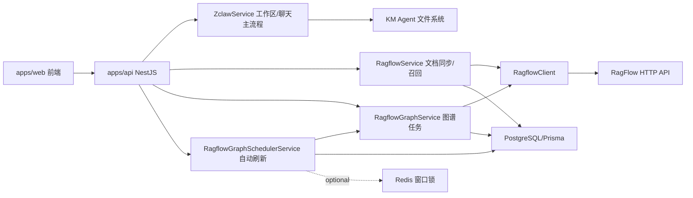
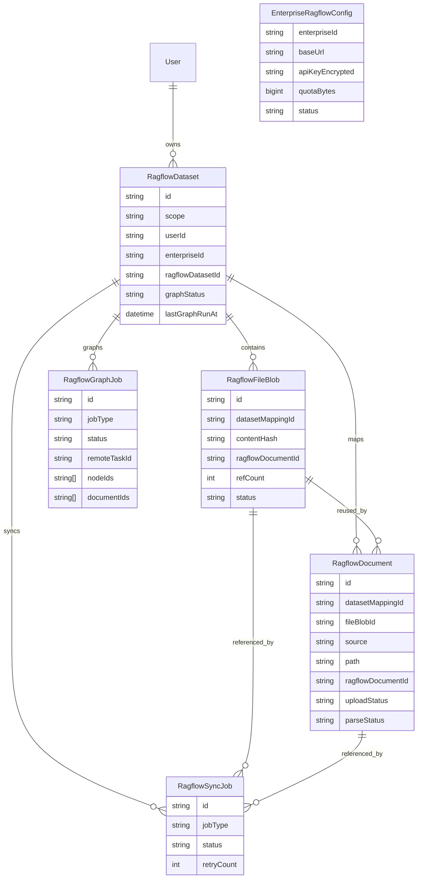
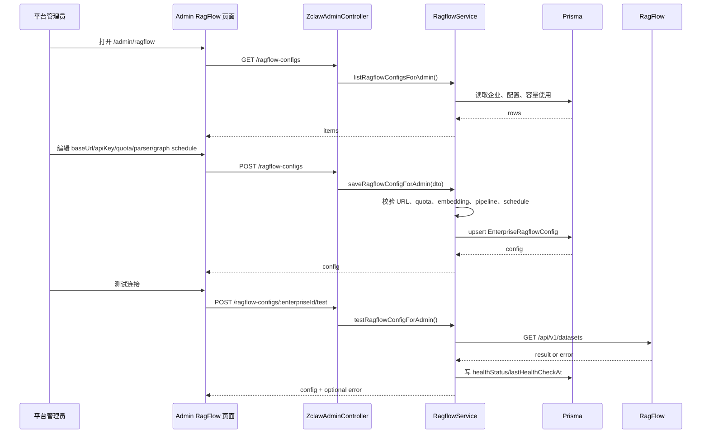
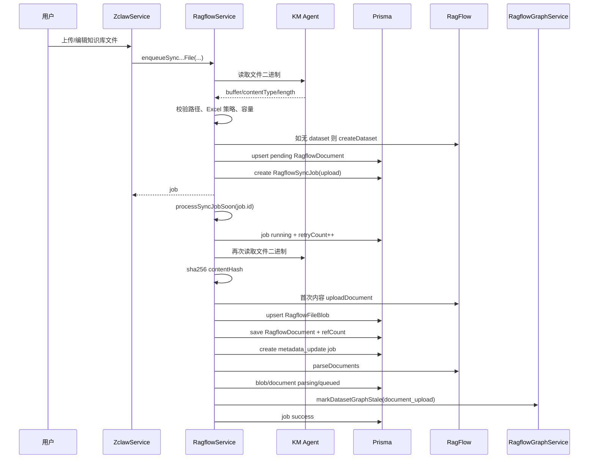
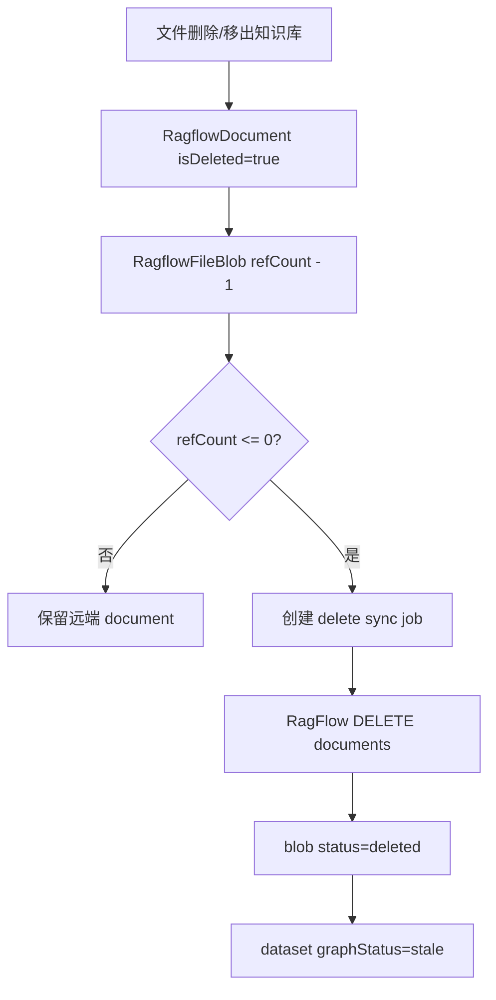
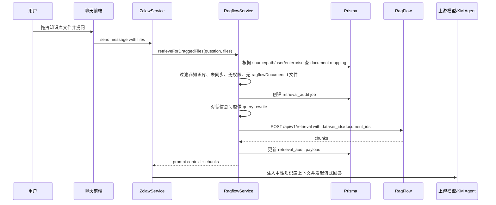
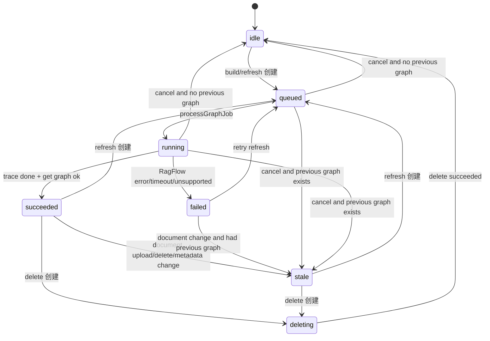
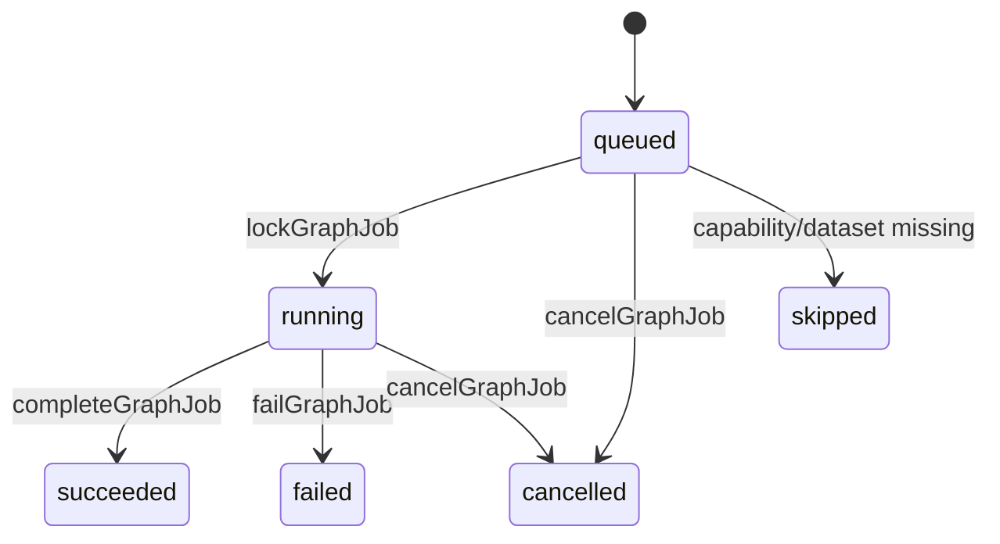
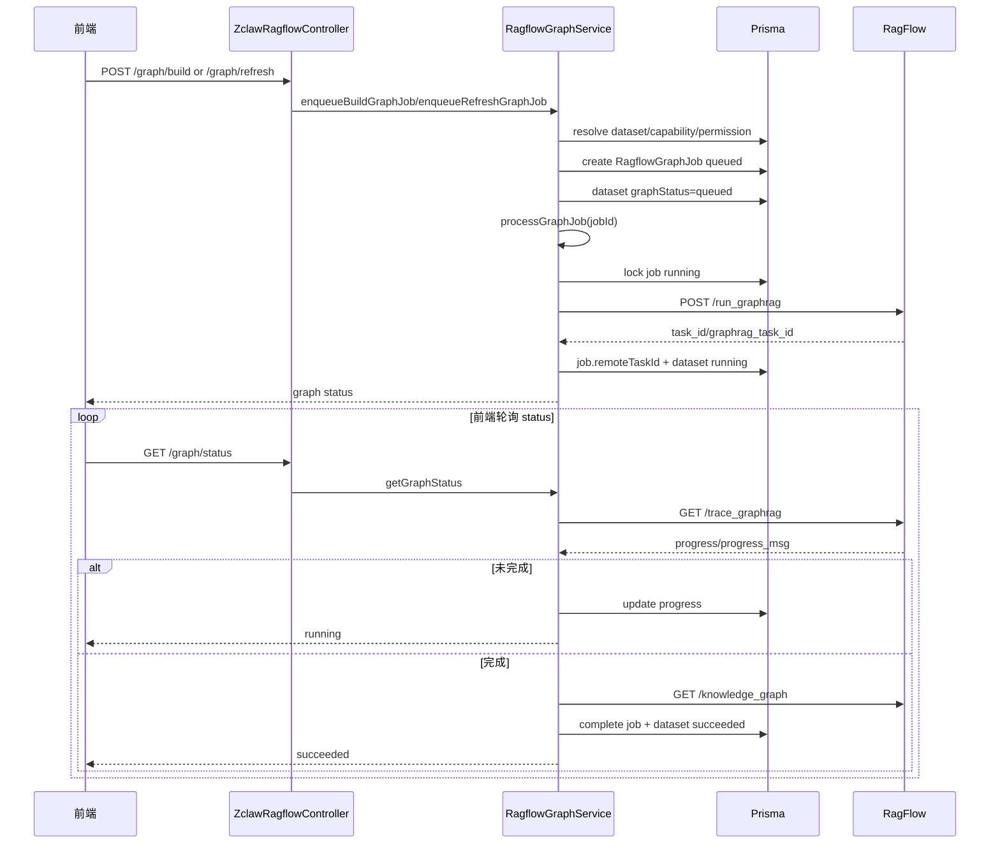
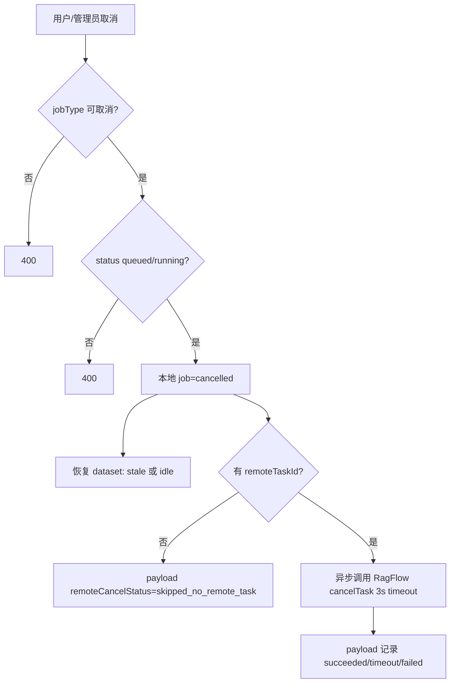

# InsightWeaver RagFlow 接入现状说明

本文档基于当前代码实现整理，重点说明本项目如何接入 RagFlow、前后端 API 如何对接、数据模型如何映射、文件同步和知识图谱任务如何流转，以及主要边界条件。对应代码主要位于：

- 后端模块：`apps/api/src/zclaw/ragflow/*`
- 后端控制器：`apps/api/src/zclaw/zclaw-ragflow.controller.ts`、`apps/api/src/zclaw/zclaw-admin.controller.ts`
- 工作区业务接入：`apps/api/src/zclaw/zclaw.service.ts`
- Prisma 模型：`packages/db/prisma/schema.prisma`
- 前端 API 封装：`apps/web/src/api/moudles/zclaw.ts`
- 前端工作区/知识图谱组件：`apps/web/src/components/super-lobster/*`
- 超级管理员 RagFlow 页面：`apps/web/src/app/[locale]/(zclaw-shell)/admin/ragflow/*`

## 1. 接入定位

RagFlow 在本项目中只承担知识引擎角色：

- 创建和维护 dataset。
- 上传、删除、解析 document。
- 执行定向 retrieval。
- 执行 GraphRAG / 知识图谱 build、refresh、trace、delete、cancel。

RagFlow 不承担以下职责：

- 用户身份认证。
- 企业成员、企业管理员、平台管理员权限。
- 工作区文件权限。
- 聊天会话存储。
- 文件业务生命周期。

所有 RagFlow 调用都由后端代理完成，前端不直接访问 RagFlow，也不持有 RagFlow API Key。

## 2. 总体架构



关键原则：

- 前端调用 EvoMind/InsightWeaver API。
- 后端先做企业、用户、文件、容量等校验。
- 只有通过校验后才调用 RagFlow。
- 本地数据库保存 RagFlow 远端 ID、同步状态、图谱状态和任务审计。

## 3. 模块职责

### 3.1 RagflowClient

文件：`apps/api/src/zclaw/ragflow/ragflow.client.ts`

这是最低层 HTTP 适配器，只封装 RagFlow 远端接口，不做业务权限判断。

| 方法 | RagFlow 远端路径 | 用途 |
|---|---|---|
| `createDataset` | `POST /api/v1/datasets` | 创建 dataset |
| `listDatasets` | `GET /api/v1/datasets` | 测试/健康检查时列出 dataset |
| `uploadDocument` | `POST /api/v1/datasets/:datasetId/documents` | 上传文件 |
| `deleteDocuments` | `DELETE /api/v1/datasets/:datasetId/documents` | 删除远端 document |
| `updateDocumentConfig` | `PUT /api/v1/datasets/:datasetId/documents/:documentId` | 更新 document 名称、metadata、解析配置 |
| `parseDocuments` | `POST /api/v1/datasets/:datasetId/chunks` | 触发解析 |
| `listDocuments` | `GET /api/v1/datasets/:datasetId/documents` | 查询解析状态 |
| `retrieve` | `POST /api/v1/retrieval` | 定向召回 |
| `runGraphRag` | `POST /api/v1/datasets/:datasetId/run_graphrag` | 启动知识图谱构建/刷新 |
| `traceGraphRag` | `GET /api/v1/datasets/:datasetId/trace_graphrag` | 查询图谱构建进度 |
| `getKnowledgeGraph` | `GET /api/v1/datasets/:datasetId/knowledge_graph` | 读取节点和边 |
| `deleteKnowledgeGraph` | `DELETE /api/v1/datasets/:datasetId/graph` | 删除知识图谱 |
| `cancelTask` | `POST /api/v1/tasks/:taskId/cancel` | 取消远端任务 |

客户端会做以下基础处理：

- `baseUrl` 会去掉末尾 `/`。
- API Key 通过 `Authorization: Bearer <apiKey>` 传递。
- JSON 请求会设置 `Content-Type: application/json`。
- 文件上传使用 `FormData`。
- HTTP 非 2xx 或 RagFlow envelope `code !== 0` 会转成 `BadGatewayException`。
- 远端返回有 `data` 字段时只返回 `data`。

### 3.2 RagflowService

文件：`apps/api/src/zclaw/ragflow/ragflow.service.ts`

职责：

- 企业 RagFlow 配置管理。
- personal / enterprise dataset 创建与复用。
- 工作区文件同步到 RagFlow。
- 本地 document、file blob、sync job 维护。
- 文件解析状态查询和刷新。
- 失败文档重试。
- 拖拽知识库文件时的定向召回。
- 内容变更后标记图谱 `stale`。

### 3.3 RagflowGraphService

文件：`apps/api/src/zclaw/ragflow/ragflow-graph.service.ts`

职责：

- 知识图谱状态读取。
- 图谱 build / refresh / delete 任务创建和执行。
- 图谱任务取消。
- 图谱运行记录查询。
- 图谱节点/边读取与安全字段归一化。
- 基于图谱节点的聊天上下文准备。
- 图谱任务审计。

### 3.4 RagflowGraphSchedulerService

文件：`apps/api/src/zclaw/ragflow/ragflow-graph-scheduler.service.ts`

职责：

- 每 60 秒检查一次是否到达整点。
- 只在整点扫描启用自动刷新的企业配置。
- 按企业配置筛选需要刷新的 dataset。
- 用 Redis 窗口锁避免多实例重复调度。
- Redis 不可用时降级为进程内锁。
- 分批提交 `scheduled` 类型图谱刷新任务。

注意：当前只有图谱自动刷新调度器。普通 RagFlow 文档同步 job 没有独立 worker，而是在创建 job 后立即通过 `processSyncJobSoon` 异步触发。

## 4. 配置模型

RagFlow 配置保存在数据库 `EnterpriseRagflowConfig`，而不是通过前端直传给 RagFlow。

模型：`EnterpriseRagflowConfig`

| 字段 | 说明 |
|---|---|
| `enterpriseId` | 企业空间 ID，唯一 |
| `baseUrl` | RagFlow 服务地址 |
| `apiKeyEncrypted` | 加密后的 API Key |
| `apiKeyMask` | 展示用掩码 |
| `status` | `active` 或 `disabled` |
| `quotaBytes` | 企业 RagFlow 容量上限，空表示不限 |
| `embeddingModel` | dataset embedding 模型，格式要求 `model_name@model_factory` |
| `chunkMethod` | RagFlow chunk method |
| `parserConfig` | parser config JSON |
| `permission` | RagFlow dataset permission，仅允许 `me` / `team` |
| `parseType` | pipeline 模式下的 parse type |
| `pipelineId` | pipeline 模式下的 pipeline id，要求 32 位小写十六进制 |
| `datasetDescription` | dataset 描述 |
| `datasetAvatarBase64` | dataset 头像 |
| `graphAutoRefreshEnabled` | 是否启用图谱自动刷新 |
| `graphRefreshScheduleType` | `daily` / `weekly` / `custom_hours` |
| `graphRefreshIntervalHours` | custom hours 间隔，1-720 |
| `graphRefreshDayOfWeek` | weekly 的星期，1-7 |
| `graphRefreshHour` | 自动刷新小时，0-23 |
| `graphRefreshBatchSize` | 每批 dataset 数，1-50 |
| `graphRefreshBatchIntervalMinutes` | 批间隔，当前固定默认 10 |
| `healthStatus` | 配置测试状态 |
| `lastHealthCheckAt` | 最近测试时间 |
| `lastUsageReconciledAt` | 最近容量核算时间 |

API Key 加密密钥来源按顺序回退：

1. `ZCLAW_ENTERPRISE_INSTANCE_SECRET`
2. `ZCLAW_MODEL_CONFIG_SECRET`
3. `JWT_SECRET`

配置能力判断：

- 无 active 配置、无 baseUrl、无 API Key：`ragflow_unavailable`。
- 容量已满：读能力通常保留，写能力关闭。
- 新写入会按 `usedBytes + newFileSize` 判断是否超过 `quotaBytes`。
- 如果相同内容 blob 已存在且未删除，则不会重复计算容量。

## 5. 数据模型关系



### 5.1 Dataset 划分

`RagflowDataset` 是本地 dataset 映射表。远端真实 ID 存在 `ragflowDatasetId`。

当前有两类 dataset：

| scope | 数据范围 | 定位规则 | dataset 名称 |
|---|---|---|---|
| `personal` | 当前用户在当前企业空间内的个人知识库 | `userId + enterpriseId` | `evomind-personal-${userId}-enterprise-${enterpriseId}` |
| `enterprise` | 企业共享知识库 | `enterpriseId` | `evomind-enterprise-${enterpriseId}` |

`enterpriseId` 规范化：

- 入参为空或旧默认值 `-1` 时，会映射到 `enterpriseService.getConsumerEnterpriseId()`。
- 真企业空间使用真实企业 ID。

### 5.2 Blob 去重

`RagflowFileBlob` 按 `datasetMappingId + contentHash` 唯一。

含义：

- 同一 dataset 内相同内容只上传一次 RagFlow。
- 多个业务路径可以映射到同一个 blob。
- `refCount` 记录有多少 `RagflowDocument` 引用它。
- 当最后一个引用释放后，会创建 `delete` sync job 删除远端 document。
- 去重不跨 dataset，因此不同用户、不同企业、personal 与 enterprise 之间不会共用 blob。

### 5.3 Document 映射

`RagflowDocument` 是业务文件路径到 RagFlow document 的本地映射。

关键字段：

- `source`: `workspace` 或 `shared-workspace`。
- `userId`: personal 文件所属用户。
- `enterpriseId`: 所属企业空间。
- `path`: 工作区路径。
- `ragflowDocumentId`: RagFlow 远端 document ID。
- `uploadStatus`: `pending` / `uploaded` / `failed`。
- `parseStatus`: `unstarted` / `queued` / `running` / `parsed` / `failed` 等。
- `metadataSyncStatus`: `pending` / `synced` / `local_only` / `unsupported` / `failed` 等。

### 5.4 Sync Job

`RagflowSyncJob` 承担文档生命周期同步。

当前 job type：

| jobType | 含义 |
|---|---|
| `upload` | 上传文件或复用 blob，并触发 parse |
| `delete` | 删除远端 RagFlow document |
| `metadata_update` | 更新远端 document 名称和 metadata |
| `retrieval_audit` | 召回审计记录，主要用于 payload 保存，不走 `processSyncJob` |

`processSyncJob` 支持的执行型 job 是 `upload`、`delete`、`metadata_update`。

### 5.5 Graph Job

`RagflowGraphJob` 承担知识图谱任务和审计。

当前 job type：

| jobType | 含义 | 是否改变 dataset 图谱状态 |
|---|---|---|
| `build` | 首次构建知识图谱 | 是 |
| `refresh` | 刷新/重建知识图谱 | 是 |
| `delete` | 删除知识图谱 | 是 |
| `status_refresh` | 读取图谱失败等状态审计 | 否 |
| `node_chat` | 基于图谱节点聊天审计 | 否 |

job status：

- `queued`
- `running`
- `succeeded`
- `failed`
- `cancelled`
- `skipped`

dataset 图谱状态：

- `idle`
- `queued`
- `running`
- `succeeded`
- `failed`
- `stale`
- `deleting`

## 6. 后端 API 对接

所有用户侧接口在 `ZclawRagflowController` 下：

基础前缀：`/api/zclaw/ragflow`

| 方法 | 路径 | 用途 |
|---|---|---|
| `GET` | `/capability` | 查询当前企业空间 RagFlow 能力和容量 |
| `GET` | `/documents` | 查询本地文档同步/解析状态 |
| `POST` | `/documents/:id/status/refresh` | 刷新单个文档远端解析状态 |
| `POST` | `/documents/status/refresh` | 批量刷新文档远端解析状态，最多 50 个 |
| `POST` | `/documents/:id/retry` | 对失败文档重新提交 upload sync job |
| `POST` | `/sync/path` | 手动按路径同步文件或目录到 RagFlow |
| `GET` | `/graph/status` | 查询图谱状态 |
| `POST` | `/graph/build` | 构建知识图谱 |
| `POST` | `/graph/refresh` | 刷新知识图谱 |
| `DELETE` | `/graph` | 删除知识图谱 |
| `POST` | `/graph/cancel` | 取消当前活跃图谱任务 |
| `GET` | `/graph/runs` | 查询当前 dataset 图谱运行记录 |
| `GET` | `/graph/nodes` | 查询图谱节点和边 |
| `POST` | `/retrieval` | 对拖拽知识库文件做定向召回 |

超级管理员接口在 `ZclawAdminController` 下：

基础前缀：`/api/zclaw/admin`

| 方法 | 路径 | 用途 |
|---|---|---|
| `GET` | `/ragflow-configs` | 查询所有企业 RagFlow 配置和容量 |
| `POST` | `/ragflow-configs` | 保存企业 RagFlow 配置 |
| `POST` | `/ragflow-configs/:enterpriseId/test` | 测试企业 RagFlow 配置 |
| `GET` | `/ragflow-graph-jobs` | 查询全局图谱任务 |
| `POST` | `/ragflow-graph-jobs/:jobId/cancel` | 管理员取消图谱任务 |

## 7. 管理端配置流程



配置校验边界：

- `enterpriseId` 不能为空。
- `baseUrl` 必须是带 protocol 的 URL。
- `quotaBytes` 必须是正整数字符串或空。
- `embeddingModel` 若填写，必须符合 `model_name@model_factory`。
- `permission` 只能是 `me` 或 `team`。
- pipeline 模式下 `pipelineId` 必须是 32 位小写十六进制，`parseType` 必须是正整数。
- 非 pipeline 模式下，`chunkMethod` 必须在后端白名单内。
- `graphRefreshScheduleType` 只能是 `daily`、`weekly`、`custom_hours`。
- `graphRefreshHour` 0-23。
- `graphRefreshBatchSize` 1-50。
- `graphRefreshIntervalHours` 1-720，仅 custom hours 生效。
- `graphRefreshDayOfWeek` 1-7，仅 weekly 生效。

## 8. 文件同步流程

### 8.1 自动同步入口

`ZclawService` 在文件生命周期操作中调用 `RagflowService`：

- 个人知识库文件创建/上传/更新。
- 企业共享知识库文件创建/上传/更新。
- 文件复制进入知识库。
- 文件移动到知识库。
- 文件从知识库移出。
- 文件重命名/移动。
- 文件删除。
- 目录删除。

个人知识库只同步 `isPersonalKnowledgeBasePath(path)` 命中的路径。非个人知识库路径会跳过。

企业共享知识库使用 `source=shared-workspace`，要求有效企业上下文和企业成员权限。

### 8.2 上传同步时序



关键点：

- enqueue 阶段会创建本地 pending document，避免远端 dataset 创建成功但本地无映射。
- 真正上传在 `processUploadJob` 中执行。
- 上传前后都会做 capability / quota 判断。
- 内容 hash 使用 `sha256(buffer)`。
- 新内容才上传 RagFlow；相同内容复用本地 blob 和远端 document。
- 新上传后触发 `parseDocuments`。
- 新上传或 metadata 更新会将图谱标记为 `stale`。

### 8.3 Excel 策略

自动同步默认跳过 Excel：

- 扩展名：`.xls`、`.xlsx`、`.xlsm`、`.xlsb`
- MIME：常见 Excel MIME 类型

跳过原因：`unsupported_excel_auto_sync`

手动路径同步可以通过内部参数选择允许 Excel，但用户侧默认行为是跳过自动同步。

### 8.4 删除同步

删除文件或移出知识库时：

1. 本地 `RagflowDocument` soft delete。
2. 对关联 `RagflowFileBlob.refCount` 递减。
3. 如果 refCount 降到 0 且 blob 未删除，创建 `delete` sync job。
4. `processDeleteJob` 调用 RagFlow `deleteDocuments`。
5. 成功后 blob 标记为 `deleted`。
6. 对应 dataset 图谱标记为 `stale`。



### 8.5 重命名/移动同步

重命名或移动不会重新上传文件：

- 更新本地 `RagflowDocument.path`、`filename`。
- 创建 `metadata_update` sync job。
- 调用 `updateDocumentConfig` 更新远端名称和 metadata。
- 如果当前 RagFlow 不支持 metadata update，标记 `metadataSyncStatus=unsupported`，主流程不中断。
- metadata 变化后图谱标记 `stale`。

### 8.6 文档状态刷新

前端会调用：

- `GET /documents` 读取本地状态。
- `POST /documents/status/refresh` 批量刷新远端状态。
- `POST /documents/:id/status/refresh` 刷新单个。

状态刷新逻辑：

- 先做可访问文档过滤。
- 批量最多 50 个。
- RagFlow 不可用时返回本地状态。
- 容量满但已有数据可读时仍允许刷新远端状态。
- 通过 `listDocuments(datasetId, { id })` 读取远端 document。
- 将 RagFlow `run` 状态映射为本地 `parseStatus`：
  - `UNSTART` -> `unstarted`
  - `RUNNING` -> `running`
  - `DONE` -> `parsed`
  - `FAIL` -> `failed`
  - 其他 -> `running`

## 9. 拖拽知识库文件召回

普通聊天不会默认触发 RagFlow。只有用户拖拽知识库文件并带着这些文件提问时，才会进行定向召回。

入口：

- 用户侧：`POST /api/zclaw/ragflow/retrieval`
- 聊天主流程：`ZclawService.streamMessage(...)` 内部前置调用



召回请求限制：

- 后端只使用本地校验通过的 `dataset_ids` 和 `document_ids`。
- 不会因为在企业上下文中就检索整个 enterprise dataset。
- 未同步、已删除、无 `ragflowDocumentId` 的文件会被忽略。
- 普通聊天附件、非知识库路径会被忽略。
- 没有可用文档时返回空召回结果，主聊天降级为普通聊天。
- RagFlow 召回失败时不终止主聊天，降级为普通聊天。

召回 chunk 数量：

- 默认下限：8。
- 多文档时：`max(8, documents.length * 3)`。

query rewrite：

- 用于“这个文件讲什么”等低信息问题。
- rewrite 失败时回退原始问题。

prompt 安全：

- 注入给模型的是中性“知识库文件内容”上下文。
- 不应暴露 `RagFlow`、`GraphRAG`、`score`、内部召回流程。
- 用户历史消息展示会剥离增强 prompt，只显示原始问题。
- 助手消息若出现“召回片段/定向召回”等内部话术，会做保守替换。

## 10. 知识图谱生命周期

### 10.1 状态机

Dataset 级状态：



Job 级状态：



### 10.2 构建/刷新流程

用户手动构建/刷新：

1. 前端调用 `POST /graph/build` 或 `POST /graph/refresh`。
2. `resolveGraphContext` 判断 source/scope、企业成员、写权限、dataset、capability。
3. capability 不可用或 dataset 缺失时创建 `skipped` graph job。
4. 同一 dataset 已有 active job 时直接返回现有状态，不重复提交。
5. 创建 `build` 或 `refresh` job。
6. `createGraphJob` 将 dataset 状态置为 `queued`。
7. `processGraphJob` 立即启动：
   - `lockGraphJob` 将 job 置为 `running`。
   - 调 RagFlow `run_graphrag`。
   - 记录 `remoteTaskId`。
   - dataset 状态置为 `running`。
8. 前端轮询 `GET /graph/status`。
9. 如果 latest job 仍 active，`syncActiveGraphStatus` 调 RagFlow `trace_graphrag` 推进进度。
10. trace 未完成：更新 job 和 dataset 的 progress/progressMsg。
11. trace 完成：调用 `getKnowledgeGraph` 读取节点/边摘要，`completeGraphJob` 写入 succeeded 和 `lastGraphRunAt`。



### 10.3 删除图谱

入口：`DELETE /api/zclaw/ragflow/graph`

流程：

- 创建 `delete` job。
- dataset 状态置为 `deleting`。
- `processGraphJob` 调用 RagFlow `DELETE /api/v1/datasets/:datasetId/graph`。
- 成功后：
  - job `succeeded`
  - dataset `graphStatus=idle`
  - `lastGraphRunAt=null`
  - 清空 progress/error

删除不会删除 dataset 和文档，只删除 RagFlow 知识图谱。

### 10.4 取消图谱任务

入口：

- 用户侧：`POST /api/zclaw/ragflow/graph/cancel`
- 管理端：`POST /api/zclaw/admin/ragflow-graph-jobs/:jobId/cancel`

取消规则：

- 只允许取消 `build` / `refresh` / `delete`。
- 只允许取消 `queued` / `running`。
- 本地先将 job 改为 `cancelled`，并写入 payload：
  - `cancelledBy`
  - `cancelReason`
  - `cancelledAt`
- 如果存在 `remoteTaskId`，异步调用 RagFlow `POST /api/v1/tasks/:taskId/cancel`。
- 远端取消超时时间 3000ms。
- 远端取消是 best effort，不影响本地 cancelled 状态。
- 取消后 dataset 状态恢复：
  - 有 `lastGraphRunAt`：`stale`，提示保留上一版。
  - 无历史图谱：`idle`。



### 10.5 自动刷新

自动刷新由 `RagflowGraphSchedulerService` 执行。

扫描条件：

- 每 60 秒 tick。
- 只有 `now.getMinutes() === 0` 时扫描。
- 配置必须满足：
  - `graphAutoRefreshEnabled=true`
  - `status=active`
  - `isDeleted=false`

调度窗口锁：

- Redis key：`ragflow:graph:auto-refresh:${enterpriseId}:${yyyy-mm-dd}:${hour}`
- TTL：1 小时。
- Redis 不可用时使用进程内 `Set`，只保证单进程不重复。

候选 dataset：

- `enterpriseId` 匹配配置。
- `status=active`、`isDeleted=false`。
- 至少有一个 `parseStatus=parsed` 且未删除文档。
- 没有 active 图谱 job：`build` / `refresh` / `delete` + `queued` / `running`。
- 满足以下任一：
  - `graphStatus=stale`
  - `lastGraphRunAt=null`
  - 超过配置周期。

排序：

1. `graphStatus desc`
2. `lastGraphRunAt asc`
3. `createdAt asc`

每次最多取 500 个 dataset。

批处理：

- `graphRefreshBatchSize` 1-50。
- 批间隔当前使用默认 10 分钟。
- 每个 dataset 调用 `enqueueScheduledRefreshGraphJob`。
- job payload 写入：
  - `triggerType=scheduled`
  - `triggeredBy=ragflow_graph_scheduler`
  - `scheduleType`
  - `scheduleHour`
  - `scheduledWindowKey`
  - `scheduledDate`
  - `batchIndex`
  - `batchIntervalMinutes`

## 11. 图谱节点读取和节点问答

### 11.1 节点读取

入口：`GET /api/zclaw/ragflow/graph/nodes`

参数：

- `source`: `workspace` / `shared-workspace`
- `scope`: `personal` / `enterprise`
- `enterpriseId`
- `keyword`
- `limit`

读取规则：

- 没有 dataset：返回空节点和 `dataset_missing`。
- 从未成功构建图谱：返回空节点和“节点暂不可用”提示。
- 配置不可读：返回空节点和原因。
- 成功时调用 RagFlow `knowledge_graph`。
- 只返回后端归一化后的安全字段：
  - node: `id`、`label`、`type`、`description`、`documentIds`、`documentCount`、`updatedAt`
  - edge: `id`、`source`、`target`、`label`、`weight`
- 支持按 `id/label/type/description` 做 keyword 过滤。
- 默认 limit 为 80，最小 1。
- 只返回两端节点都在返回节点集合里的边。
- 读取失败会创建 `status_refresh` failed graph job 审计。

### 11.2 节点问答

没有单独的 `/graph/chat` API。当前复用聊天接口，在 `send-zclaw-message.dto.ts` 的 `graphNodeContext` 中传递：

```json
{
  "graphNodeContext": {
    "source": "workspace",
    "scope": "personal",
    "enterpriseId": "enterprise-id",
    "datasetMappingId": "dataset-mapping-id",
    "nodeIds": ["node-id-1"]
  }
}
```

后端流程：

1. `ZclawService` 收到聊天请求。
2. 调用 `ragflowGraphService.prepareGraphNodeChatContext(...)`。
3. 验证：
   - `nodeIds` 必填，最多取前 10 个去重。
   - `question` 必填。
   - `datasetMappingId` 存在时优先按它定位 dataset。
   - `source/scope/enterpriseId` 必须与 dataset 匹配。
   - personal dataset 必须属于当前用户。
   - enterprise dataset 要求当前用户是企业成员。
   - 必须已有成功图谱版本。
4. 读取 RagFlow `knowledge_graph`。
5. 只接受当前图谱中存在的节点。
6. 收集与选中节点相关的边，最多 40 条。
7. 创建 `RagflowGraphJob(jobType=node_chat)` 审计记录。
8. 构造安全图谱上下文，最多 8000 字符。
9. 如果节点有 documentIds，再用这些 documentIds 做一次受限 retrieval。
10. 将图谱上下文和召回片段注入给上游聊天模型。

节点问答边界：

- 节点不存在：拒绝。
- 图谱未成功构建：拒绝。
- 上一版图谱可用但当前正在更新：允许使用上一版，并返回 warning。
- prompt 不暴露内部实现词。
- `node_chat` job 不改变 dataset 图谱状态。

## 12. 权限模型

### 12.1 personal

personal 图谱和文档：

- `scope=personal`
- dataset 必须 `userId === 当前用户`
- enterpriseId 使用当前企业空间规范化结果
- 当前用户可以读、构建、刷新、删除自己的 personal 图谱

### 12.2 enterprise

enterprise 图谱：

- `scope=enterprise`
- `source=shared-workspace`
- 必须有 `enterpriseId`
- 平台管理员可访问。
- 非平台管理员必须是 active enterprise member。
- 读状态、读节点：企业成员可访问。
- 构建、刷新、删除、取消：企业 `admin` / `owner` 或平台管理员。

### 12.3 能力字段

图谱状态接口返回：

- `canBuild`
- `canRefresh`
- `canDelete`
- `canCancel`
- `canChatWithNode`
- `reason`
- `message`
- `capability`

前端只按后端返回字段展示按钮，不自行推断企业角色。

## 13. 前端对接

### 13.1 API 封装

文件：`apps/web/src/api/moudles/zclaw.ts`

主要函数：

| 函数 | 后端接口 |
|---|---|
| `getZclawRagflowCapabilityApi` | `GET /api/zclaw/ragflow/capability` |
| `listZclawRagflowDocumentStatusesApi` | `GET /api/zclaw/ragflow/documents` |
| `refreshZclawRagflowDocumentStatusApi` | `POST /documents/:id/status/refresh` |
| `refreshZclawRagflowDocumentStatusesApi` | `POST /documents/status/refresh` |
| `retryZclawRagflowDocumentSyncApi` | `POST /documents/:id/retry` |
| `syncZclawRagflowPathApi` | `POST /sync/path` |
| `getZclawRagflowGraphStatusApi` | `GET /graph/status` |
| `buildZclawRagflowGraphApi` | `POST /graph/build` |
| `refreshZclawRagflowGraphApi` | `POST /graph/refresh` |
| `deleteZclawRagflowGraphApi` | `DELETE /graph` |
| `cancelZclawRagflowGraphApi` | `POST /graph/cancel` |
| `listZclawRagflowGraphRunsApi` | `GET /graph/runs` |
| `getZclawRagflowGraphNodesApi` | `GET /graph/nodes` |
| `listAdminEnterpriseRagflowConfigsApi` | `GET /admin/ragflow-configs` |
| `saveAdminEnterpriseRagflowConfigApi` | `POST /admin/ragflow-configs` |
| `testAdminEnterpriseRagflowConfigApi` | `POST /admin/ragflow-configs/:enterpriseId/test` |
| `listAdminRagflowGraphJobsApi` | `GET /admin/ragflow-graph-jobs` |
| `cancelAdminRagflowGraphJobApi` | `POST /admin/ragflow-graph-jobs/:jobId/cancel` |

### 13.2 工作区文件树

相关组件：

- `SuperLobsterPage.tsx`
- `KnowledgeBaseSidebarSection.tsx`
- `FileTree.tsx`
- `FileTreeNode.tsx`
- `RagflowDocumentStatusBadge`
- `ragflow-status-polling.ts`

行为：

- 文件树收集可展示 RagFlow 状态的文件 key。
- personal 只收集个人知识库路径。
- shared-workspace 文件全部按 shared source 参与状态展示。
- 有 pending / queued / running 等可刷新状态时，批量刷新远端状态。
- 批量刷新最多 50 个 ID。
- 上一次刷新未完成时不并发刷新。
- 页面隐藏、没有能力、没有状态时不轮询。
- 失败状态可点击重试。
- 路径可手动同步到知识图谱。

### 13.3 知识图谱状态和弹窗

相关组件：

- `KnowledgeGraphStatusPanel.tsx`
- `KnowledgeGraphExplorer.tsx`
- `knowledge-graph-status.ts`
- `knowledge-graph-explorer.ts`
- `knowledge-graph-errors.ts`

前端状态判断：

- active 状态：`queued` / `running` / `deleting`
- 图谱轮询间隔：`KNOWLEDGE_GRAPH_STATUS_POLL_INTERVAL_MS = 15000`
- 有 active 图谱状态时轮询。
- `lastGraphRunAt` 存在表示已有图谱版本。
- 没有版本且 `canBuild`：主按钮为构建。
- 有版本且 `succeeded/stale`：主按钮为刷新。
- 有版本且 `failed/canRefresh`：主按钮为重试。
- `canDelete` 且非 active 且有版本：允许删除。
- `canCancel` 且 latest job 是 active build/refresh/delete：允许取消。

### 13.4 管理页

页面：

- `/admin/ragflow`
- `/admin/ragflow/jobs`

`/admin/ragflow` 能力：

- 列出企业 RagFlow 配置。
- 编辑 baseUrl、apiKey、状态、容量、embedding、chunk/parser、pipeline。
- 配置图谱自动刷新。
- 测试连接。
- 展示 usedBytes / remainingBytes。

`/admin/ragflow/jobs` 能力：

- 分页查询图谱 job。
- 按 status、jobType、scope、enterpriseId、userId 过滤。
- 查看 payload。
- 对可取消任务发起取消。

## 14. 边界条件汇总

### 14.1 配置和容量

- 未配置 RagFlow：文件上传和普通聊天主流程不失败，只跳过 RagFlow。
- 配置 disabled：视为不可用。
- 容量满：
  - 新文件写入、图谱写操作受限。
  - 已有远端状态刷新和召回读能力尽量保留。
- API Key 不会返回给前端，只返回 mask。
- 测试连接失败会记录 healthStatus/error，但不直接删除配置。

### 14.2 文件同步

- 非个人知识库路径不自动同步 personal RagFlow。
- 自动同步默认跳过 Excel。
- 同一 dataset 内相同内容不重复上传。
- 不同 dataset 之间不共享 blob。
- 删除文件只在最后引用释放时删除远端 document。
- metadata update 不支持时标记 unsupported，不阻塞主同步。
- upload job 失败会将 document 标记 failed。
- delete job 失败会将 blob/document 记录错误。
- sync job `retryCount` 在进入 running 时递增，但当前没有定时扫描 `nextRetryAt` 的通用 worker。

### 14.3 召回

- 普通聊天不触发 RagFlow。
- 只有拖拽知识库文件才触发定向召回。
- 必须限制到选中文件对应的 `document_ids`。
- 无可用 mapping 或无权限时跳过对应文件。
- 没有任何可召回文档时降级普通聊天。
- RagFlow retrieve 失败时降级普通聊天。
- prompt 和展示层会清理内部实现词。

### 14.4 图谱

- 没有 dataset 不能构建图谱，会创建 skipped 或返回 dataset_missing。
- 同一 dataset 已有 active build/refresh/delete 时不重复提交。
- `status` 轮询会推动 active job 的 trace 进度。
- GraphRAG unsupported/404/405/method not allowed 会归类为 `unsupported`。
- trace done 判断：
  - `progress === 1`
  - 或 progress_msg 命中 `Knowledge Graph done` / `graph ready` / `KB merge done`
- 构建完成后才读取 `knowledge_graph` 并写 graph summary。
- 删除图谱会清空 `lastGraphRunAt`。
- 取消远端任务是 best effort，不影响本地取消结果。
- active 更新期间，如果已有上一版图谱，节点问答可继续使用上一版并提示 warning。

### 14.5 权限

- personal dataset 必须归当前用户。
- enterprise dataset 读要求企业成员或平台管理员。
- enterprise 图谱写要求企业 owner/admin 或平台管理员。
- 前端按钮不可替代后端权限校验。
- 图谱节点展示只返回归一化安全字段，不返回 RagFlow raw payload。

## 15. 运行和排查建议

常用检查点：

1. 企业配置是否存在且 active：查 `enterprise_ragflow_configs`。
2. dataset 是否已创建：查 `ragflow_datasets`。
3. 文件是否有本地映射：查 `ragflow_documents`。
4. 内容是否已上传：查 `ragflow_file_blobs`。
5. sync job 是否失败：查 `ragflow_sync_jobs`。
6. 图谱 job 是否 active/failed/skipped：查 `ragflow_graph_jobs`。
7. 图谱状态是否 stale/running/failed：查 `ragflow_datasets.graphStatus`。
8. 配置容量是否已满：比较 `EnterpriseRagflowConfig.quotaBytes` 和非 deleted blob 的 `sizeBytes` 汇总。

典型问题：

| 现象 | 优先检查 |
|---|---|
| 前端不显示同步按钮 | `/capability` 是否 `available/canWrite`，source/path 是否可同步 |
| 文件一直 pending | `ragflow_sync_jobs` 是否 failed，`processSyncJob` 是否抛错 |
| 文件解析状态不变 | RagFlow `listDocuments` 返回的 `run/progress`，前端是否触发 refresh |
| 召回无结果 | `ragflow_documents.ragflowDocumentId`、权限、拖拽文件 source/path |
| 图谱构建按钮不可用 | `graph/status` 的 `canBuild/canRefresh/reason/message` |
| 图谱一直 running | `trace_graphrag` 返回、`graph/status` 是否被轮询 |
| 图谱任务无法取消 | jobType/status 是否可取消，是否存在 latest active job |
| 自动刷新不执行 | 当前时间是否整点、配置是否启用、Redis 锁、candidate dataset 条件 |

## 16. 当前实现限制

- 文档同步没有独立后台 worker；创建 job 后立即异步执行，失败后主要依赖用户重试或业务再次触发。
- `RagflowSyncJob.nextRetryAt`、`lockedBy` 等字段已预留，但当前通用重试调度未完整落地。
- 图谱 build/refresh 不是长驻 worker 执行到底，而是先启动远端任务，再由 `graph/status` 轮询推进 trace。
- 自动刷新只覆盖 enterprise dataset，且只扫描企业配置下的 dataset。
- 图谱节点不落本地缓存，每次节点列表读取依赖 RagFlow `knowledge_graph`。
- 节点级权限过滤当前主要依赖后端返回安全字段和节点问答时的 documentIds 受限 retrieve；企业图谱节点/边本身仍可能包含聚合后的实体关系，需要后续继续收紧。
- 部分历史文档存在编码乱码，本文档以当前代码为准。

## 17. 关键代码索引

| 主题 | 文件 |
|---|---|
| RagFlow HTTP client | `apps/api/src/zclaw/ragflow/ragflow.client.ts` |
| 配置、dataset、文档同步、召回 | `apps/api/src/zclaw/ragflow/ragflow.service.ts` |
| 图谱状态、任务、节点、取消 | `apps/api/src/zclaw/ragflow/ragflow-graph.service.ts` |
| 图谱自动刷新 | `apps/api/src/zclaw/ragflow/ragflow-graph-scheduler.service.ts` |
| 用户侧 RagFlow API | `apps/api/src/zclaw/zclaw-ragflow.controller.ts` |
| 管理侧 RagFlow API | `apps/api/src/zclaw/zclaw-admin.controller.ts` |
| 工作区和聊天接入点 | `apps/api/src/zclaw/zclaw.service.ts` |
| 请求 DTO | `apps/api/src/zclaw/dto/save-enterprise-ragflow-config.dto.ts`、`apps/api/src/zclaw/dto/send-zclaw-message.dto.ts` |
| Prisma 模型 | `packages/db/prisma/schema.prisma` |
| 前端 API 封装 | `apps/web/src/api/moudles/zclaw.ts` |
| 前端图谱状态工具 | `apps/web/src/components/super-lobster/knowledge-graph-status.ts` |
| 前端图谱弹窗 | `apps/web/src/components/super-lobster/KnowledgeGraphExplorer.tsx` |
| 前端文档状态轮询 | `apps/web/src/components/super-lobster/ragflow-status-polling.ts` |
| 管理配置页 | `apps/web/src/app/[locale]/(zclaw-shell)/admin/ragflow/page.tsx` |
| 管理任务页 | `apps/web/src/app/[locale]/(zclaw-shell)/admin/ragflow/jobs/page.tsx` |
