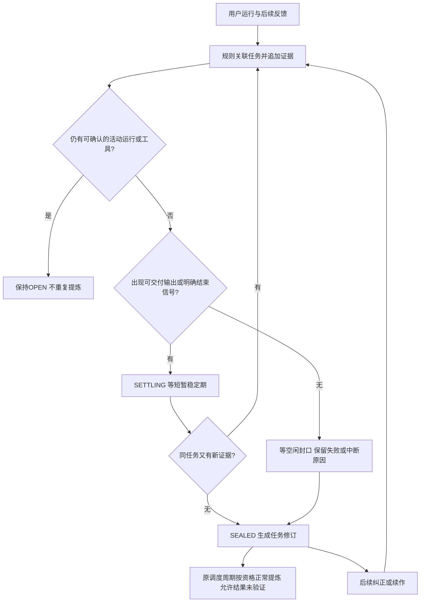

# Skills 链路升级规格

## 018当前实施契约

用户明确要求复用KM v1完成适配。[V1_ADAPTATION.md](V1_ADAPTATION.md)为当前有效实现契约：专用草稿key、完整包冻结、v1比对后写回和读回验证、一次外层请求及调用额度、原提交审核。以下S01—后续章节保留016设计目标；其远端CAS、底层tokens硬预算、独立运行沙箱、typed信号、方法拆分／合批尚非已实现保证，不再作为接通v1全链路的前置阻塞。冲突处以本节及V1_ADAPTATION为准。

日期：2026-09-20｜schemaVersion为2的首批采集代码已开始实施，详见[IMPLEMENTATION.md](IMPLEMENTATION.md)；本规格仍包含未实施部分。D01—D03已确认；预算基准D04、自动采纳D05待答。不将规划契约冒充现有远端接口。

## S01 范围与不可破坏的约束

1. 只修改本链路及运行／发布的直接适配接口；复用既有表、个人库、组织审核、版本能力和技能包协议。
2. 没有用户“满意／完成”也必须自动结束任务并正常提炼。`taskState`、`businessOutcome`、`userAcceptance`、`verification`分别记录；未验证不能作为唯一拒绝理由。
3. 不增加会话界面按钮、表单或任务标注操作。模型可在原对话中提出必要的任务澄清，后台依据用户反馈标记；不为学习单独发起模型回合或后台追问用户。
4. 本人会话学习；只有用户提交并经组织审核发布的skill包可跨成员复用。企业级聚类不是共享会话或方法的授权。
5. trace、索引、规则去噪、NEW／UPDATE路由不直接调用LLM。不为每条模糊消息新增模型请求。
6. NEW、UPDATE、批量提炼、修复、重试共用一份资源约束。模型请求减少不等于token／费用减少，三者分别记录。
7. 草稿不修改正式包；证据／基准变化必须重新检查；拒绝UPDATE不隐藏、删除或重写正式技能。

## S02 核心对象

| 对象 | 定义与最小字段 |
| --- | --- |
| Scope | `enterpriseId,userId`；服务端从身份与成员关系取得，不相信模型或前端传入的owner |
| RunEvidence | `requestEventId,runId,attemptKey,streamAttempt,sourceRevision,userMessageId?,assistantMessageId?,technicalStatus,toolRefs[],artifactRefs[],skillReceipts[],sourceKind` |
| TaskRevision | `taskId,revision,parentRevision?,goal,conditions,attempts[],evidenceRefs[],relations[],materialEvidenceHash,state,progress,completeness,closureReason,outcome,associationReason,ruleVersion,lastMaterialEvidenceAt,sealDueAt` |
| Proposal | `proposalId,assistantMessageId,taskIds[],kind(CONTINUE/NEW/CORRECT/EXTEND/ACCEPT),status,userReplyRef?`；模型提议不是用户同意 |
| MethodUnit | `unitId,action,applicability,procedure,avoidance?,evidenceRefs[],evidenceStrength,methodSignature`；一条可复用方法及其适用条件 |
| SkillRef | `enterpriseId,scope(personal/enterprise),ownerUserId?,skillKey,version?,bundleHash?,instanceId?`；组织沿用既有维护者权限 |
| LearningInput | `schemaVersion,scope,action,targetRef?,baseBundle?,taskRevisionRefs[],evidenceSetHash,methodUnits[],inputHash,budgetRef` |
| LearningOutput | `decision(CREATE/UPDATE/SUPPORT/DEFER),reason,workflow,methodUnits[],removedOrChangedUnits[],evidenceRefs[],usageReceipt` |
| CandidateDraft | `candidateId,revision,action,targetRef?,baseHash?,inputSnapshot,draftFilesSnapshot,draftHash,validationHash,publicationState` |

`selected`、`loaded`、`used-in-task`与`task-success`不是同一状态。仅勾选但加载失败不归为该技能执行失败；任务后续纠正不因该回合未再次勾选而丢失原关联。新独立任务不自动继承其参考任务的skill。

## S03 埋点与运行关联

| 事件／时机 | 保存内容 | 规则 |
| --- | --- | --- |
| 请求受理，进入耗时准备前 | 用户请求ID、独立runId、attemptKey、用户消息引用、sourceKind | 覆盖加载／准备阶段就失败且无助手消息的情况 |
| 当前运行工具开始／终态 | runId、toolCallId、tool消息ID、状态、必要错误引用 | 引用现有日志，避免复制全文；技术重试中的重名toolCallId不能混为一个 |
| skill解析与加载 | requestedRef、resolvedRef、加载状态、完整包hash／版本、实际实例 | 读取结果不明保留unknown，不能拿选择列表填实际版本 |
| 实际产物返回 | 稳定对象ID、版本、runId、来源 | session级manifest若无运行归属则不能强配给当前run |
| 流结束／失败／取消 | technicalStatus、输出引用、活动工具状态、结束时间 | completed仅技术状态；超时不证明远端已终止 |
| 用户后续回复 | 用户消息、可解析引用、确认／否定／扩展证据 | 回应模型提议时保存提议和答复；不单靠“好”字认定成功 |
| 内部creator／repair | sourceKind=SKILL_EMERGENCE或SKILL_EVOLUTION | 计入本链路资源，但不回流为用户学习材料 |

请求事件保留现有企业×request幂等；同请求的工具、终态聚合更新同一Observation。异步独立反馈用独立稳定来源ID，并引用原请求。来源字符串在服务端命名空间生成，防客户端请求ID与内部回调碰撞。重复事件不递增事实版本；有新事实才递增。

Observation是request的采集容器，`evidenceRefs.runs[]`必须保存同attempt下所有技术运行；每项有runId、streamAttempt、状态、工具与结果引用。标量runId最多作为primaryRunId兼容，不能用最后一次运行覆盖前次。工具事件唯一键至少含runId＋toolCallId；重试不会新增业务任务次数。

在脱敏前从可信上下文提取结构化对象ID。原Recorder会抹掉URL／路径，不能靠清洗后文本恢复对象。模型或文本里的路径只是提示，只有验证归属后才进入精确索引；不把企业原文、凭据复制到研究记忆。

## S04 零新表数据契约

| 既有表 | 拟增／调整字段 | 约束 |
| --- | --- | --- |
| SkillEmergenceObservation | `schemaVersion,processingVersion,sourceKind,sourceRevision,processedSourceRevision,runId,attemptKey,technicalStatus,evidenceRefs,associationState,associationReason,claimToken,claimedRevision,leaseUntil`；双消息引用允许必要空值 | 保留企业×request唯一；默认业务结果UNKNOWN；处理重试attempts不等于用户attempt |
| SkillEmergenceAnalysisSnapshot | `kind,enterpriseId,userId,sessionId,taskId,revision,parentRevision,operationKey,inputEvidenceHash,trace,taskState,taskFamilyKey,lastMaterialEvidenceAt,sealDueAt,referenceKeys[],sourceObservationIds[],schemaVersion,expiresAt,deletedAt?`；旧文本和observationId可空 | `legacy_sample`维持旧observation唯一；`task_revision`以企业×用户×task×revision唯一、operationKey作用域唯一；只追加 |
| SkillEmergenceTaskCluster | `contractVersion,ownerUserId?,evidenceRevision,modeledEvidenceHash` | v2的clusterKey包含用户与任务族签名命名空间，沿用企业×clusterKey唯一；owner必填并校验；legacy共享workflow不输入v2 |
| SkillEmergenceUserProgress | `processedEvidenceHash,rejectedEvidenceHash,publishedCoverageHash`及必要引用 | 原计数只兼容展示；已封装不等于已发布覆盖 |
| SkillEmergenceEvaluation | 扩展`evidenceSnapshot`保存action／理由／任务修订引用 | cluster尚未形成的NOISE／DEFER写Observation，不虚构cluster |
| SkillEmergenceCandidate | `action,revision,targetIdentityKey,targetRef,baseVersion,baseBundleHash,evidenceSetHash,inputSnapshot,dedupeKey,draftStorageKey,draftHash,validationHash,evidenceState,publicationState,publicationReceipt,submissionId` | 沿用draftFilesSnapshot；dedupeKey替换旧条数唯一键；旧行回填legacy:<id> |
| SkillEmergencePackagingJob | `kind(MODEL/PACKAGE/REPAIR),inputSnapshot,inputHash,budgetRef,usageState,callReceipts,leaseOwner,fencingToken,publicationOperationId?` | 复用candidate可空能力；模型作业只在已有真实cluster后创建；幂等键与冻结输入一致 |
| SkillEmergenceScheduleState | 预算策略引用与当期汇总／未结算预留 | 是否用企业×用户窗口由D04定；原调度时间不充当额度 |
| SkillUsageEvent／既有版本数据 | 保留现有统计语义，增加／关联加载收据 | Observation为精确运行证据主入口；不能重复计两次使用 |

索引至少包含Snapshot的scope＋taskId＋revision、scope＋session＋state；`referenceKeys`和`sourceObservationIds`采用PostgreSQL数组GIN索引，帮助精确引用查找和迟到纠正定位。所有查询先约束scope，不能JSON全库扫描后再做权限过滤。索引类型以迁移验证结果为准。

claim保存`claimToken+claimedRevision`。worker完成时只能确认它读到的sourceRevision；更晚到来的证据仍待处理。lease过期的旧worker不能覆盖新owner。首次任务创建需会话范围串行；显式跨会话续作需按固定顺序锁受影响task。使用事务锁／唯一约束和冲突重读，禁止裸`max(revision)+1`。

任务修订多对多引用Observation；一行Observation的clusterId只保留旧兼容语义，不能用于限制一个消息只能归一个任务。精确引用索引只检索每个task最新有效修订，其referenceKeys是累计投影，保留仍归属该task的旧稿、历史消息与产物。旧结论被推翻不等于旧稿引用作废；只有错误归属边被撤销后才不再命中。

旧Snapshot的级联删除需改成协调清理。引用失效影响候选可用性；留存期限不因复制快照无限延长。预算和发布未终结作业不能被业务证据清理意外级联删除；待终态确认后仅保留允许的操作摘要，已删除原文不再学习。

## S05 任务关联：确定性规则，不隐含语义模型

输入：当前RunEvidence／反馈、同scope的引用索引、有限的活跃与最近封口task摘要。输出：APPEND／NEW／PENDING／NOISE、目标task、命中规则和证据。

| 规则 | 条件 | 动作 |
| --- | --- | --- |
| R0 | 相同来源事件已处理 | 去重或补迟到事实，不新增任务频次 |
| R1 | 显式另一个独立交付目标 | 新task；参考旧结果则derivedFrom，不继承旧skill归因 |
| R2 | 有效消息／任务／产物引用，目标无冲突 | 追加／重开被引用task |
| R3 | 唯一相容task且明确继续、修改或补充 | 规则追加；可包含最近封口task，不因空闲封口丢失续接 |
| R4 | 相同可信对象lineage、目标相容、无新实例信号 | 追加版本或范围扩展 |
| R5 | 无可关联对象，有具体工作请求 | 新provisional task，不推定成功或价值 |
| R6 | 多候选、引用冲突或目标不足 | 保留pending；后续明确反馈可重新关联，不另开判别LLM |

动作词、字符相似、时间邻近仅召回候选，不能单独证明同一任务。金额单位、客户、期间、规则条件等不能在规范化中删去。一个请求明确列多项交付时可拆task，但工具／产物只分配给有归属依据的部分；不明部分pending。

task中的关系包括produced、corrects、revises、extends、accepts、derivedFrom、unresolved。用户说“增加同比”不自动判旧版失败；说“退款未扣”记录用户报告的纠错，不凭该句编造工具或平台根因。

## S06 自动结束、重开和对话内标记（Q1／Q2）

任务结束用于确定一个可学习的阶段性证据边界，不是宣告业务正确。每个task保存`state=OPEN/SETTLING/SEALED`、`progress=executing/awaiting_user/delivered/interrupted/unknown`、`closureReason`、`sealedRevision`、`lastMaterialEvidenceAt`、`sealDueAt`；结果另存。SEALED可被明确后续修订重新打开。

纯文本交付以持久化`assistantMessageId+contentRevision/hash`作为resultRef，不要求有artifact。非空文本只证明有输出，不证明达到目标。

确定性封口顺序：

1. 用户明确结束／接受且可定位对象时，记录该证据；没有未终止运行即可封口。关闭会话只代表停止继续，不推导接受。
2. 流已完成，有最终正文或可读取产物，且没有显式未完成工具步骤时，进入SETTLING；短暂稳定后自动封口，`closureReason=DELIVERY_STABLE`，verification仍可UNKNOWN。最终正文排除空白、纯进度、自言自语及单纯澄清问句；具体规则带版本，不把文字长度当完成证据。
3. 用户明确开始独立新任务时，旧任务无活动run且已有输出则封口；仍在执行的旧任务不被强行结束。
4. 用户离开、只留下澄清问题、失败／取消后不再续作：空闲到期可`IDLE_STOP`封口；仍按是否存在方法材料进入后续处理。没有方法的轨迹不提炼，理由不能写“用户没说满意”。原用户运行已经本地断流且无本地活动工具、远端终态无法确认时，宽限后可封口为`completeness=INCOMPLETE,executionUnresolved=true`，允许已收集材料一次进入正常提炼；不重放原业务执行，不推导远端已终止。晚到证据重开。此情况与后台学习job未终止不同：后者必须保持预算预留，禁止重复发学习请求。
5. 封口不立即调用LLM；沿用原调度周期合批、合并同task最新修订。后来纠正使未发布候选失效并重开任务，原taskId不变，业务次数仍为1；已有发布保留历史，生成新修改建议。

工程初值建议：`settleDelayMs=120000`、`idleSealMs=1800000`，配置化并以假时钟测试；它们只影响封口延迟，不作为成功标准、不增加模型定时任务，也不是已验证的最优参数。

复用现有Processor 60秒tick，按数据库中每task最新修订的sealDueAt调度；不创建逐task内存timer。锁task后重读事实版本与活动run再封口，重启可恢复。心跳、lease和普通updatedAt不推进静默窗口。增加scope＋sealDueAt索引；latest-per-task条件排除过期历史修订。封口／重开追加状态修订，但事实未变化时materialEvidenceHash不变。

对话提议约束：模型只在自然工作需要澄清任务归属／范围时提出一句明确问题，不能每次交付强行问“满意吗”。在当前响应中记录proposal与引用；用户答复在既有下一轮处理，唯一、明确同意或否定才改变标记。“好”若回应多问题不能自动匹配。模型提议、模型自述完成均为提示，用户反馈与系统事实分别留证。

优先扩展既有响应事件携带可选`taskSignals`（提议ID、目标引用、kind），不新增工具调用或独立模型请求，不在聊天正文展示JSON。该side-channel是运行时适配需求，不是假定已有能力；未支持时只识别可确定的单一提议／答复与原始引用，歧义保留pending，自动封口仍可工作。额外提示／元数据tokens纳入真实资源统计，不声称整个前台没有新增token。

## S07 资格、方法增量与直接分流

正常进入提炼的共同条件：存在具体目标；有方法／约束／纠错等可提炼材料；属于用户会话且来源可用；task已形成稳定修订；同输入无进行中作业；预算允许。UNKNOWN验证状态不阻止资格。问一句概念定义不自动判噪声，但如果仅有一次性事实答案、没有可复用方法则不生成skill。

频次按当前有效独立task计数，不按回合、attempt、工具调用数。原频次5等常量可暂作机会优先级，不再绕过共同资格直接封装。单次但有明确可复用过程或持续规范的任务也能进入；不能要求至少N次才处理所有任务。

| 条件 | 动作 | 说明 |
| --- | --- | --- |
| 明确噪声、内部生成、重复流事件 | NOISE／去重 | 原因与必要受控引用可查，不提炼 |
| 尚无具体归属、相互冲突、必要材料不足 | DEFER | 不把UNKNOWN结果单独当DEFER理由 |
| 未使用skill且材料合格 | NEW通道 | 同scope候选／已知方法签名本地去重；不全库语义检索 |
| 使用skill且经验明确归属 | UPDATE通道 | target须是实际用过的skill；无版本先保留归因不完整，不推定当前版本就是基准 |
| 同目标既有规则完全一致或没有方法增量 | SUPPORT | 补证，不封装、不改版本 |
| 多skill使用但无法归因 | DEFER归因部分 | 不把一次纠正广播给全部skill；已明确部分可继续 |

任务族签名只做候选分组。方法signature至少包含操作、对象类型、前置条件、约束、步骤／规避条件；确定同义规范化以显式词典为限。不得删除数值单位／适用条件后误合并。不同条件的有效分支作为不同MethodUnit保留，可在一个skill中表达。模糊等价在既有批量提炼请求中判断，不另开去重模型。

方法内容是经验描述而非原会话复制；来源不足时不得补造成功、工具结果或失败原因。没有实际执行验证也可形成过程建议，证据强度标明`USER_REQUIREMENT/OBSERVED_EXECUTION/USER_ACCEPTED/OBJECTIVE_CHECK/UNVERIFIED`等来源，不用单一模型分数冒充正确性。

UPDATE同目标、scope和基准包批量处理。其他版本的使用证据分组保存，不直接混并；若目标在等待中升级，明确CONFLICT／需重审，不盲目覆盖。

## S08 冻结提炼与缓存契约

`inputHash = hash(scope + action + targetIdentity + baseBundleHash + sorted(taskId,materialEvidenceHash) + ruleVersion + promptVersion + modelVersion + formatVersion)`。

materialEvidenceHash来自有效目标、条件、运行事实、源内容版本和证据关系。候选另保存实际task revision供追溯；纯封口、心跳、重开状态计数不能改变学习幂等键。语义关系或源事实真的改变才失效。

- LearningInput固定目标、输入输出条件、关键attempt、被否定部分、修订结果、证据与未知项。完整受控引用保留；正文只取必要片段，不截掉决定性失败或纠正后宣称完整。
- 允许LearningOutput=SUPPORT或DEFER，避免每次模型返回都被迫造skill。
- 同输入hash复用作业／结果，不重复发送；源证据更改、删除或基准变更使旧结果失效。
- normalize、canonical prompt和creator的白名单统一映射`inputContract→inputs`、`outputContract→completionCriteria`，保留失败规避／条件／证据强度。不能只给模型加字段又在下一层删掉。
- 验证报告绑定draftHash，草稿修改后重新做本地校验；不默认增加LLM审查。技能中不装全部原始会话或task JSON。
- 历史拒绝以相同证据hash抑制重复展示；新的明确纠正可重新进入，不因旧条数水位吞掉。

## S09 模型预算与真实外部依赖

**当前没有已核实的skills周期硬预算。D04确定基准后再配置scope、window、callsCap、rawTokensCap、costCap、modelPricingVersion。旧批大小20、尝试3次、计费预扣10000等均不能当原总额度。**

零新表实现建议：PackagingJob泛化为学习作业，保存有界callReceipts；ScheduleState协调相同scope的预算。若预算为企业级则企业现有行／一致的企业锁协调总分配，不给每用户重复全额。窗口切换不清除旧作业的未结算负债。最终实体设计随D04口径确定。

每次真实发送前，事务原子执行：锁预算协调行→检查`settled + outstanding + proposed <= cap`→写预留和callId→提交→发送。回执以callId幂等结算；手工重试不能清零累计。lease用fencingToken防旧worker修改作业控制状态；迟到真实usage仍应幂等结算到原call，不能因旧lease把消耗丢掉。

预留上界需包含输入tokens、输出上限和已知模型费率。SDK隐式重试要关闭或纳入同一发送前预算适配；远端creator每次底层请求也必须受子预算／共享预算控制，不能只靠提示词“少调用”。未知usage不记0。超时但未确认终止保持outstanding；真正取消后仅释放未消耗部分。跨窗口消费按预约窗口归账，并单独记录实际发生时间。

远端接口最低能力（均需实施验证，当前客户端不能证明已有）：

| ID | 能力 | 缺失时行为 |
| --- | --- | --- |
| EXT01 | 稳定executionId／请求幂等、底层calls与tokens限制、主运行及repair完整usage、可查询终态与取消确认 | 可开发本地采集和规则层；受硬预算保护的creator生成不能声明就绪 |
| EXT02 | 隔离草稿输出完整文件包，不自动安装到正式key | 不启用UPDATE封装；不能先写正式目录再隐藏 |
| EXT03 | UPDATE原子expectedRevision／expectedHash条件写；NEW原子expectedAbsent创建；操作幂等＋分实例版本回执 | 条件发布不可保证时停在待发布建议；API先读后PUT不算CAS |
| EXT04 | 按来源／版本读完整包，正文、脚本、文件树一致 | 标记归因不完整，不能伪造版本或自动针对未知基准更新 |

这些仅为skills运行时边界，不扩展到全平台计费规则。预算耗尽显示具体原因和待处理数；不能把停跑当收益，也不能隐瞒排队。新旧模型路径不得同数据并行付费运行。

## S10 草稿、格式与发布

最终文件仍为`SKILL.md`和按需`scripts/、references/、assets/`；保持现有key、frontmatter解析和市场五项：适合人群、核心亮点、典型输入/需求、输入预填模板、预期输出/成果。name允许现有slug规则，不新加强制中文约束。

完整包hash使用规范化相对路径排序＋文件内容及编码一致的确定性清单。拒绝越界路径、重复规范化路径、缺失引用；不靠仅SKILL.md成功导出冒充fullBundleHash。UPDATE保留未涉及的有效步骤和辅助文件；脚本变化、条件删除要在差异中可见。

生成结果保存到Candidate.draftFilesSnapshot或运行时隔离草稿空间；draftStorageKey与targetSkillKey分开。校验通过后AWAITING_CONFIRM，不提前推进publishedCoverage。

接受请求契约：`candidateId,expectedCandidateRevision,expectedDraftHash,idempotencyKey`，UPDATE包含基准，NEW要求expectedAbsent。服务端在同一DB事务内检查权限／当前可用证据／内容校验并CAS占用候选，固定publicationOperationId。发送前重新检查已知证据失效；然后远端条件写→保存每实例回执→校验完整包→完成状态。NEW目标key已存在或被并发创建必须冲突，不能覆盖。

远端请求已发出后才到的纠正不能被DB检查原子撤回。记录`evidenceChangedDuringPublish`和实际回执，发布结果标需复审／后续修订；不得伪报未发生写入或盲目覆盖回滚。未发送前检测到失效则不发送。租约和网络跨系统不能靠一个DB事务伪装原子。

| 操作／事件 | 状态及正式包效果 |
| --- | --- |
| UPDATE生成、拒绝、删除失败草稿 | 只影响候选，不改正式key、可见性或版本 |
| 接受开始 | publicationState=PUBLISHING，尚未INSTALLED |
| 目标基准变化／发送前待审证据已失效 | CONFLICT／STALE_EVIDENCE，不发送或由远端CAS拒绝覆盖 |
| 发出远端请求后新增否定证据 | 标evidenceChangedDuringPublish，保存真实结果并进入复审／修订，不承诺撤回在途请求 |
| 多实例部分成功 | PARTIAL，保存成功与失败回执，按操作恢复；不宣告全量成功 |
| 超时未知 | UNKNOWN，查询操作状态后恢复，不盲目新建版本 |
| 完整发布通过 | INSTALLED并记录实际版本，才推进覆盖 |
| 已发布UPDATE撤销 | 走现有版本恢复形成明确回执；不隐藏整个skill |
| 组织提审 | 绑定候选hash、实际submissionId；SUBMITTED不是已发布 |
| 组织审核期间基准改变 | 发布时再次条件检查；管理员同意不绕过基准冲突 |

组织继续现有本人提交／维护者／管理员审核流程。普通成员针对他人组织skill只形成个人更新建议；经用户提交交有权维护者处理，不借NEW覆盖他人key。审核发布的只有skill包和必要去标识说明；不默认把完整会话或私有任务证据随包开放给成员。

D05决定NEW／UPDATE是否沿用自动采纳。当前推荐NEW沿用原开关、UPDATE明确采纳，但尚未确认，不将推荐写成已生效配置。无论选择哪项，自动采纳都不能跳过权限、格式、证据失效与版本检查。

## S11 API与页面兼容

- 复用现有候选列表／详情和采纳／拒绝／提审入口，增加action、验证状态、publicationState、canAccept／canSubmit及原因。条件字段不是客户端权限依据。
- 详情只展示该候选冻结证据与草稿差异；不读取当前cluster.workflow替代。发布失败、预算等待、结果未验证分开呈现。
- prepare-submit返回候选／草稿hash／目标基准，提交服务从该受控快照提审；mark-org-submitted需核实真实submission，不能仅信客户端报成功。
- 批量采纳逐项返回结果；某项冲突不能让其他项重复发布。旧状态枚举的消费者同步扩展可选字段，新旧候选兼容。
- 会话界面无新操作。模型提议和用户反馈发生在普通聊天内容中；后台补采集，不插入机器JSON到正文。

## S12 关键源码锚点（本轮只读核实）

| 依据 | 说明 |
| --- | --- |
| [Schema](D:/skillsgen-industry_track/enginering/insightweaver/packages/db/prisma/schema.prisma:2340) | Cluster、Progress、Observation、Snapshot、ScheduleState、Candidate、Job真实结构 |
| [Recorder](D:/skillsgen-industry_track/enginering/insightweaver/apps/api/src/skill-analytics/skill-emergence-recorder.service.ts:47) | 默认SUCCESS、旧快照upsert与脱敏 |
| [Processor](D:/skillsgen-industry_track/enginering/insightweaver/apps/api/src/skill-analytics/skill-emergence-processor.service.ts:148) | claim、指纹、快照读取、任务完成与超时包装 |
| [运行入口](D:/skillsgen-industry_track/enginering/insightweaver/apps/api/src/zclaw/zclaw.service.ts:9847) | request标识、准备阶段、双消息及当前工具上下文 |
| [排除已选skill](D:/skillsgen-industry_track/enginering/insightweaver/apps/api/src/zclaw/zclaw.service.ts:10452) | 现采集排除条件 |
| [Gate](D:/skillsgen-industry_track/enginering/insightweaver/apps/api/src/skill-emergence/skill-emergence-gate.ts:108) | SUCCESS-only及频次独立放行 |
| [建模](D:/skillsgen-industry_track/enginering/insightweaver/apps/api/src/agent/agent-runtime.ts:654) | 内容返回、usage与限额缺口 |
| [封装](D:/skillsgen-industry_track/enginering/insightweaver/apps/api/src/skill-emergence/skill-emergence-packaging.service.ts:335) | 实时workflow、生成即覆盖、自动采纳 |
| [现accept](D:/skillsgen-industry_track/enginering/insightweaver/apps/api/src/skill-emergence/skill-emergence-evaluator.service.ts:582) | 改状态／可见性不足以发布隔离草稿 |
| [组织提审](D:/skillsgen-industry_track/enginering/insightweaver/apps/api/src/skills/skill-submission.service.ts:282) | 重新导出个人包；审核写包与DB非原子 |
| [KM包写入](D:/skillsgen-industry_track/enginering/insightweaver/apps/api/src/zclaw/zclaw-km-agent.client.ts:459) | 当前无expectedRevision条件写 |
| [KM执行](D:/skillsgen-industry_track/enginering/insightweaver/apps/api/src/zclaw/zclaw-km-agent.client.ts:611) | 当前无底层calls／tokens预算参数与运行幂等协议 |
| [加载](D:/skillsgen-industry_track/enginering/insightweaver/apps/api/src/zclaw/zclaw.service.ts:13059) | 正文与树读取，未显式返回实际来源版本 |
