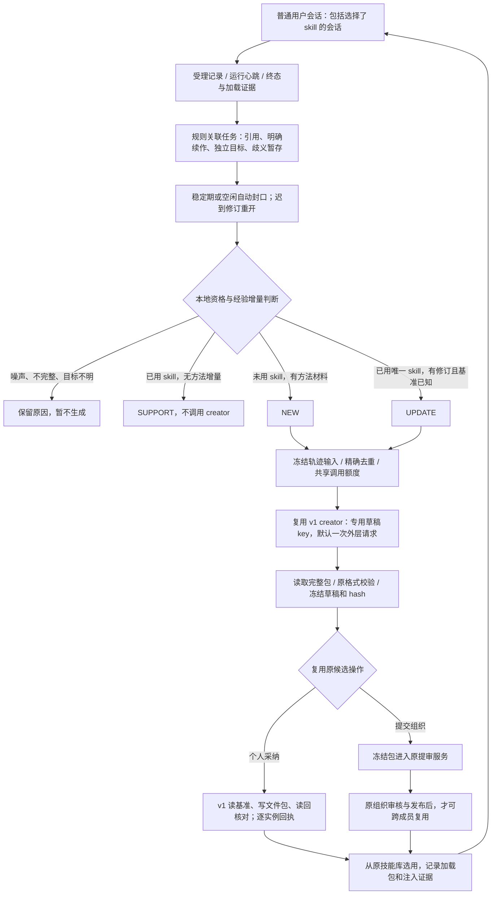

# KM v1 适配与当前闭环

2026-09-20，轮次018。用户要求继续完成全链路，优先复用现有 KM v1；本文件是当前实现契约，替代016—017文档中“必须先扩展远端才能接通生成”的阻塞判断。旧文档中的更强能力保留为后续目标，不冒充当前实现。

## 已接通的路径

技术完成与业务成功继续分开。未获“满意／完成”的任务可以正常封口并生成候选；不把它们冒充已验证经验。对话提议采用保守规则：上一回合存在单一明确问句、当前用户给出明确肯否反馈时记录关联，不新增界面控件，也不专门调用模型提问。

## 现有能力如何复用

| 环节 | 当前实现 | 保留的边界 |
| --- | --- | --- |
| 数据 | 扩展原 Observation、Snapshot、Cluster、Candidate、PackagingJob；零新表 | 两个增量迁移需先部署；不能只替换API代码 |
| 生成 | 原 hidden creator 调用；UPDATE先把完整旧包写入专用草稿key，正式目标不作为生成目录 | v1草稿在个人工作区，应用列表隐藏；不是远端文件系统沙箱，也不能阻止外部工具自行扫描目录 |
| 输入 | 本人、同企业的冻结任务修订和清洗后的样本；包包含脚本／资源 | 超长、截断、删除来源、目标归因不明保留DEFER，不静默截掉后生成 |
| 去重 | 精确方法签名包含目标、条件、方法文本、动作和版本基准 | 不等同于语义聚类；同目标不同方法不直接丢弃。复杂多任务消歧仍待增强 |
| NEW | 独立候选key，采纳后在原个人库可见 | 原NEW自动采纳配置沿用；不是新增全员自动入库策略 |
| 个人UPDATE | 采纳时对正式key检查旧包hash，写入完整候选包，再读回核对；撤销可按冻结旧包恢复 | GET→PUT→GET不是远端CAS；本地锁只约束本应用涌现写入，不能锁住KM外部编辑者 |
| 组织／共享UPDATE | 形成个人改进草稿，走原用户提交、组织审核 | 不自动覆盖组织原技能；当前提交是草稿key对应的提案，不承诺已实现组织原条目的自动版本替换 |
| 异常恢复 | 已发出请求不自动重发；失败操作可读取原草稿恢复；部分实例写入可重试核对或撤销 | 没有合格草稿时保持失败并保留材料；不通过无限重试换成功 |
| 来源变更 | 生成前、生成后、采纳前及写回后核查；写回过程中来源变化保存待复核回执 | 网络写入不受SQL回滚控制；整个过程不是跨服务事务 |
| 实际使用 | v1完整导出包用于构造本次注入正文并计算hash；收到上游事件后标记PROMPT_INJECTED | 表示已注入上下文，不表示任务成功，也不证明后来每次脚本执行仍是同一文件版本 |
| 组织提审 | 使用候选冻结文件与市场字段，校验真实submissionId及包hash，继续原审核 | 企业任务聚类不授予跨成员会话访问权 |

## 调用与输出控制

- v2规则采集、关联、封口、资格、路由、去重均不调用模型，不走旧逐问答指纹／工作流建模。
- 默认每轮每用户至多创建1个候选；其余保持待处理。无方法增量的使用记录为SUPPORT，精确重复材料不另建候选。限流造成的延期不能作为“质量提升”证据。
- 同一冻结输入至多派发一次外层creator；关闭本链路自动市场字段修复和流超时重发。恢复读取既有草稿，不新增模型请求。
- NEW与UPDATE共同使用每企业×用户×UTC日外层派发额度，原PackagingJob在数据库事务锁内记账；默认20，可配置。它是当前可调整的工程保护阈值，**不是历史预算、真实token上限或用户已确认的预算基准**。
- 沿用既有billing结果，不伪造KM内部usage。远端一次creator内部可能有多轮模型／工具执行；缺少远端预算协议时无法保证其tokens硬上限。
- 当前机制旨在减少噪声、重复和不必要的模型阶段；未测量真实会话上的无效skill比例、有效能力保留率或总费用，不能承诺这些效果已经成立。

## 开启与回退

1. 数据库先应用 `20260920090000_skill_task_trace_capture`、`20260920100000_skill_trace_v1_loop`。均复用原表；生产环境尚未执行。
2. 沿用原skills涌现访问开关、分析／调度开关和生成开关。设置 `SKILL_EMERGENCE_TRACE_MODE=active` 才启用完整v2路径；`capture`仅采集，未设置则不接入v2。
3. `SKILL_EMERGENCE_TRACE_CANDIDATES_PER_CYCLE`默认1；`SKILL_EMERGENCE_TRACE_DAILY_CREATOR_LIMIT`默认20；封口参数沿用017的稳定期120秒、空闲30分钟。运行心跳30秒，丢失120秒后记为DISCONNECTED。
4. UPDATE保持原“纳入个人”操作显式采纳，先保护已有技能。D04预算基准、D05自动更新产品策略仍待后续明确，当前默认不是用户已确认的业务政策。
5. 停止新采集可关闭trace模式；已排队生成由原 `SKILL_EMERGENCE_PACKAGING_ENABLED=false` 停止自动调度。不要把v2记录改回v1 pending，也不要自动重放业务会话。

## 测试与上线界限

临时PostgreSQL16从旧HEAD schema建库，顺序应用两项迁移，运行真实Prisma事务、并发封口／发现、生成额度竞争、候选发布／撤销及来源删除检查。数据库无生产数据，使用临时内存卷，测试后清理。

KM以v1接口替身提供两实例文件包存储；真实调用本地发布适配器，注入部分实例故障和基准冲突。覆盖NEW生成、个人入库、使用后SUPPORT、迟到修订UPDATE、脚本保留、分实例恢复、撤销恢复、冻结包组织提审入口、失败草稿恢复以及内部隐藏草稿校验。

这些是软件行为测试，不是实际KM联网验收或论文效果实验。完整组织管理员审批UI、真实creator产物质量和生产多实例写入仍需部署联调；原审核逻辑未改。API全量类型检查仍有范围外关系模块的既有错误，详见IMPLEMENTATION。

主要代码入口：`skill-task-trace.service.ts`（任务证据）、`skill-trace-learning.ts`（本地决策）、`skill-trace-learning.service.ts`（完整学习／采纳适配）、`skill-emergence-packaging.service.ts`（额度和恢复）、`zclaw.service.ts`（v1包读写与会话采集）、`skill-submission.service.ts`（冻结提审包）。
