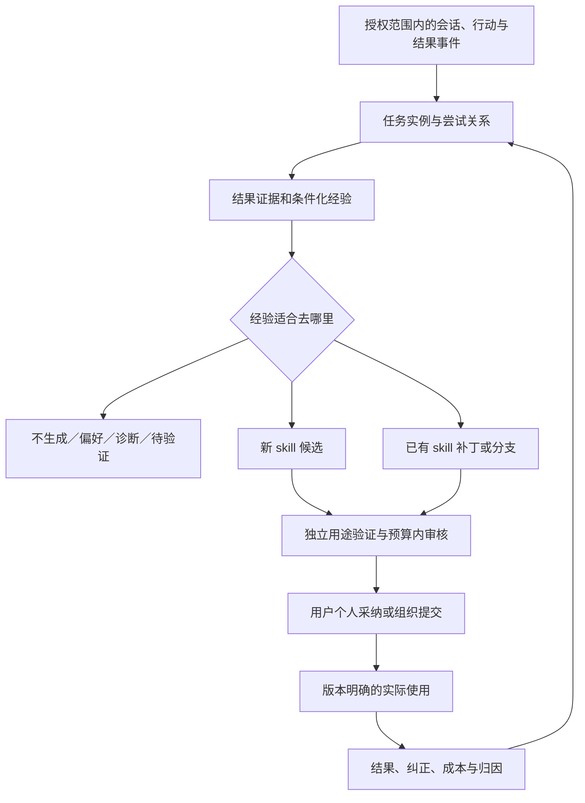

# 从企业会话到可验证 Skills：轨迹提炼、价值筛选与持续演化深度报告

> 历史研究分析稿，已由[团队系统说明与落地方向报告](004_team_system_and_landing_report.md)取代。用户在轮次 004 明确：本报告应帮助团队理解当前实现、不足与洞察，当前优先落地，不需要实验设计。本文保留用于追溯，其中实验与论文定位不作为当前工作安排。

**研究对象：InsightWeaver 技能涌现链路｜日期：2026-09-18｜版本：研究建议 v1.0**

**核心判断：当前最值得优先改变的是“什么算一条可学习证据”。将独立问答对升级为有目标、有修订关系、有结果证据的任务轨迹，再决定生成新 skill、更新已有 skill、保留待验证经验，还是不进入技能库。**

本报告整合现有链路、用户反馈、上一轮 WWW Industry 调研，并补充轨迹学习近邻研究。它是科研与系统方案分析，不是源码审计结果、开发任务清单或已经验证的方法贡献。

## 阅读导航

- 第 1–3 节：现状、核心问题与新增发现。
- 第 4–6 节：任务轨迹定义、噪声判别、证据提炼过程。
- 第 7–9 节：价值筛选、使用 skills 后的演化、完整案例。
- 第 10–12 节：优先建议、WWW 工程价值与量化协议。
- 第 13–15 节：近邻研究、可验证创新方向、后续研究问题。

## 1. 证据来源与判断边界

### 1.1 三类依据

| 标记 | 来源 | 本报告如何使用 |
| --- | --- | --- |
| U：用户现场反馈 | 本轮用户说明 | 有价值 skills 约十几个中一个；长链信息和失败经验丢失；半成品误作成功；使用 skills 的对话被忽略 |
| D：链路文档 | [原始 HTML 报告](C:/Users/39835/Doubao/chats/2026-09-18/new-chat/skill-emergence-report/index.html) | 已阅读全文；能确认“文档怎样描述系统”，尚未独立检查对应源码、日志或运行数据 |
| L：文献证据 | [上一轮报告](002_www_industry_research_landscape.md)及本轮新增作者原文 | 约束论文叙事与创新边界；不将他人效果移植为本系统预期 |
| H：研究推断或建议 | 从以上材料提出 | 需要真实轨迹和对照检验，不等同于已经发生的故障或已成立创新 |

“十几个中一个”是重要的用户观察，但没有给定抽样窗口、数量、评价者和“有价值”定义，不能直接换算成一个已测得的精确有效率。

原 HTML 自称基于全链路实现核验；本轮并未获得其背后的源码证据，因此不继承“全部实现已核验”的结论。以下现状均按 D 类说明。

### 1.2 本轮最重要的五条判断

1. **同一任务的多次修订是一个有内部结构的学习事件，不是多次独立成功。**
2. **业务结果与技术结束必须分开；最后回答、没有追问、产物落盘都不能独立证明成功。**
3. **失败不是统一噪声。能定位条件、错误和有效修正的失败，可能比一次直接成功更有沉淀价值。**
4. **使用 skill 的会话应进入演化通道；系统自己的封装活动仍须与真实用户证据分开。**
5. **减少产出量只是手段。目标是在固定审核与维护成本下，增加经未来任务验证的有效技能，而不是通过不生成来提高表面精度。**

## 2. 当前链路理解：已有基础与证据损失

### 2.1 原报告描述的处理过程

用户回合完成 → 埋点 → 提取用户问题与 assistant 最终回答 → 脱敏和截断 → 指纹归类 → 最近样本建模 → 四通道门禁 → 沙箱生成 SKILL.md → 用户纳入个人库或提交组织。

值得保留的基础包括：将分析与创建分开、独立封装环境、候选草稿与用户决策、评估留痕及部分版本/回滚能力。这些可以承载新研究，不必因改变证据口径就推翻整个系统。

| 原报告描述 | 原文位置 | 对研究的含义 |
| --- | --- | --- |
| 每回合仅取问题和最终回答；不读取工具过程及文件内容 | [§2.2](C:/Users/39835/Doubao/chats/2026-09-18/new-chat/skill-emergence-report/index.html:250) | 难以区分“说做了”与“实际完成”；无法直接验证产物修正 |
| 失败、取消、中断不采集；使用任何 skill 的回合跳过 | [§2.3](C:/Users/39835/Doubao/chats/2026-09-18/new-chat/skill-emergence-report/index.html:265) | 故障、恢复和使用后反馈形成观测盲区 |
| 基于任务/输入/输出描述形成确定性哈希；建模取最近 5 条样本 | [阶段②–③](C:/Users/39835/Doubao/chats/2026-09-18/new-chat/skill-emergence-report/index.html:335) | 对主题分类有帮助，但未保留尝试关系和适用条件 |
| 频次、深度、价值、长任务四通道 OR 命中即可 eligible | [阶段④](C:/Users/39835/Doubao/chats/2026-09-18/new-chat/skill-emergence-report/index.html:353) | 某个宽松通道可能绕开其他通道的质量条件 |
| 封装校验关注存在、可读及格式/质量问题码 | [阶段⑤](C:/Users/39835/Doubao/chats/2026-09-18/new-chat/skill-emergence-report/index.html:363) | 未见独立下游任务增益验证的证据，不能等同于技能有效性 |
| 同 key 可整体重生成，缺少使用后自动演化 | [§5.2](C:/Users/39835/Doubao/chats/2026-09-18/new-chat/skill-emergence-report/index.html:530) | 重写可能掩盖退化，且没有版本归因闭环 |

### 2.2 四种不同的统计单位

建议明确区分：

| 单位 | 定义 | 不能替代什么 |
| --- | --- | --- |
| 事件 | 一次用户反馈、可见响应、工具结果、产物变更 | 不等于独立任务 |
| 尝试 | 为同一目标采取的一条候选解决路径，可能被修订或放弃 | 不等于独立成功样本 |
| 任务实例 | 为明确目标和验收条件工作的一段经历，含一个或多个尝试 | 不必等于一次会话 |
| 任务族 | 多个目标结构、程序和适用条件兼容的任务实例 | 不等于同一个话题或相同输入/输出格式 |

一个任务可以跨会话继续；一个会话也可以包含多个任务。用户改了五次同一份报告，独立任务数仍可能为一；在同一会话分别完成三家客户的独立交付，则可能是三个任务实例。应保留父任务和子任务关系，避免两层重复计数。

## 3. 对三个已知问题的解释，以及补充发现

### 3.1 用户问题对应的候选机制

| 用户观察 | 与文档相符的可能机制 | 优先研究意见 |
| --- | --- | --- |
| 大量 skills，少量有用 | 重复回合计数、OR 门禁、泛化包装、缺少用途增益判断 | 先建立任务级证据和统一质量条件，再做预算内候选排序 |
| 长链与失败经验丢失 | 原子问答失去反馈指向、失败回合不进入、仅保留短工作流 | 显式保存尝试→批评→修正→验证关系，而不是平铺摘要 |
| 半成品成为成功经验 | run.completed 被用作成功口径，没有独立业务结果 | 分开执行状态、目标完成状态、验收证据和满意信号 |
| 使用 skills 的对话被忽略 | 已用 skill 回合被整体跳过 | 采集并关联 skill ID、版本、实际应用和结果，分流到演化 |

以上解释有文档支撑，但尚未证明哪一个因素贡献最大。需要对实际候选做归因抽样，不能用其中一个解释包揽全部低质问题。

### 3.2 新增的关键推断

| 推断/待核查问题 | 为什么重要 | 应查看的证据 |
| --- | --- | --- |
| **困难任务可能被反向奖励** | 反复纠错、工具循环和长篇自述增大轮数/长度，反而更容易触发“深度”或“长任务”通道 | 候选生成原因、同一目标的重试次数、有效独立任务数 |
| **频次存在伪重复** | 同一个目标的五次改稿可能刷满五次门槛；不同会话也可能只是同一任务续做 | 根任务关联、对象/产物版本、跨会话续接证据 |
| **压缩链可能优先丢掉失败条件** | 问答→泛化短语→最多若干步骤→技能正文，多次压缩会保留主流程而丢失“何时不适用” | 原始反馈与最终规则逐条对齐 |
| **确定性哈希不保证语义一致** | 哈希之前的任务名称仍由 LLM 提取；同义词可能拆分，同格式不同规则可能合并 | 相似任务不同 key，以及同 key 内冲突约束 |
| **最近 5 条可能被单个纠错长链占满** | 样本数量看似充足，独立性和角色覆盖不足；还可能抹掉较早的有效经验 | 样本来源分布、任务/用户数、时间与结果类型 |
| **生成步骤数与门禁可能形成自证** | 文档描述建模输出步骤有上限，同时以步骤数量触发长任务；若门禁使用模型生成的步骤，就可能受拆写风格控制 | 确认门禁字段来自真实事件还是生成 JSON，暂不认定已发生 |
| **形态校验不能发现语义空心** | 完整 SKILL.md 和市场介绍可能很像成品，却只有基础模型已知的通用建议 | 去掉包装后是否有条件化程序、新知识与可测增益 |
| **忽略不等于无用，安装不等于有效** | 用户可能因时机、重复、隐私、命名或审核负担拒绝，也可能安装后从未获得使用机会 | 曝光/接受/拒绝原因与后续适用机会 |
| **脱敏可能破坏轨迹对齐** | 所有路径都成 [path] 后，原文件、目标文件、参考文件被混淆；折叠格式会损伤表格/代码结构 | 去标识前后角色和关系是否保留 |
| **不观察已用 skills 会产生选择偏差** | 重度使用者、有效复用和退化事件缺失，库越成熟反而越少学习信号 | 有无 skill 的合格任务覆盖率 |
| **重生成可能覆盖人工有效修订** | 新证据不包含旧人工修改时，整体重写可能把已知约束抹掉 | 基础版、当前人工版、候选版及其差异 |
| **观测投递本身可能丢事件** | 文档称旁路异步写入；未见捕获覆盖率证据。低样本也可能来自遗漏而非低频 | 源事件数与学习记录数对账，不假定已有丢失 |
| **共享池可能造成范围污染** | 原报告称 C 端共用组织池；即使文本脱敏，任务计数、条件和路径仍可能跨客户混用 | 真正隔离域、样本授权、计数/建模/检索各自作用域 |

### 3.3 原报告中需校正或保留疑问的地方

- “会话内合并 + 最后产出”不足以恢复轨迹：会话可能多目标，最后消息可能只是致谢，也可能比先前版本更差。
- 闲置只能触发暂时封存；下载、保存只能证明产物存在或被取用。二者都不应直接标成功。
- “不对”“再来一次”是反馈信号，不自动证明旧方案错误。用户可能新增要求、改变目标或自身判断有误。
- 原文称只取本人样本可以解决跨客户问题。它能减少直接素材混用，但若门槛计数、共享工作流和指纹仍跨客户，仍需核查；不能把局部采样修正视作完整隔离证明。
- “从零到一建技能边际成本趋近于零”没有成本测量支撑。指纹、重复建模、封装、验证、人工审核及无用候选都有成本。
- 观察阶段快照生成时间在 §2.2 与阶段①存在表述差异；快照究竟在记录时还是分析时冻结，需要后续核查。
- 原报告的位置水位清理风险方向未被本轮证实：仅凭“列表位置 + 删除”不能确定是重复消费还是跳过新证据。稳健的研究建议是保留明确证据成员与处理版本，不据此宣布运行故障。

## 4. 什么才是可以学习的任务轨迹

### 4.1 任务轨迹的最小内容

建议将任务轨迹理解为：

> 在同一目标及其明确变更下，用户与系统针对某个对象进行尝试、得到可观察反馈、修正行动或产物，并留下结果证据的有序经历。

任务轨迹不要求必须多轮、不要求必须调用工具，也不要求最终成功。一个单轮专业操作可能有价值；一个百轮闲聊也可能没有可复用程序。完整性的重点是能否理解目标、行为、反馈和结果之间的联系。

| 轨迹要素 | 必须回答的问题 |
| --- | --- |
| 目标与对象 | 想完成什么？针对哪份资料/哪项业务/哪个交付物？ |
| 约束与验收 | 必须满足什么？哪些条件来自用户，何时加入或更改？ |
| 尝试及依赖 | 哪个行动产生哪个产物？哪些步骤依赖前序结果？ |
| 反馈指向 | 反馈针对哪次回答、哪个文件版本、哪条规则？ |
| 修订内容 | 究竟改了什么？纠错、补充偏好还是变更任务？ |
| 结果证据 | 可执行检查、业务审批、专家核验或用户接受分别说了什么？ |
| 未知与缺失 | 缺哪些消息、文件、工具结果？哪些解释尚未验证？ |
| 适用范围 | 结论限定于哪个角色、环境、任务类型或数据条件？ |
| skill 参与 | 使用了哪个 skill 版本？仅选择、实际加载还是确实执行？ |

不需要收集模型不可见的内部思维链。研究需要的是用户交互、可见行动、工具结果与产物证据。缺少这些信息时应降低结论强度，而不是让模型补写一条似乎合理的执行路径。

### 4.2 任务划分与续接原则

1. 先识别用户目标，再关联问题、回答、文件版本和工具结果。关联依据不能只有文本相似度。
2. “把刚才的图换颜色”通常是同一任务修订；“另外帮我查明天的天气”通常是新任务。
3. 同一任务被取消后重试，应保留尝试分支；不能把失败尝试删除再把成功片段当完整原始经历。
4. 跨会话续接优先依赖用户明确引用、产物/任务标识及上下文一致性；无法确定时保留待关联，不自动拼接。
5. 多人协作仅在允许的组织范围和明确任务关联下连接；不能因企业 ID 相同就拼接不同人的任务。
6. 目标变化保留前后版本。旧目标完成与否，应依照当时约束判断，不用新要求追溯制造“错误”。
7. 闲置可使任务从活跃变为暂存未知。后续纠正到来时可重开，并标记哪些候选或规则受到影响。
8. 任务内可标注有独立程序的子任务，但统计总体成功时不能将子任务数量当成独立任务重复数。

### 4.3 结果应是多维记录

| 维度 | 可用状态 | 不能据此单独推出 |
| --- | --- | --- |
| 运行 | 正常结束、超时、取消、工具失败 | 业务成功/失败 |
| 业务完成 | 完成、部分完成、失败、未知 | 用户满意 |
| 用户接受 | 明确接受、明确拒绝、未观测、存在冲突 | 客观正确 |
| 客观验证 | 通过、未通过、未检查、证据冲突 | 对所有新任务都有效 |
| 证据覆盖 | 充分、局部、缺关键产物/事件 | 缺失部分必然正确或错误 |

文字类任务未必有唯一正确答案，用户对其拥有判断权的风格/格式需求可以构成验收证据；事实准确性等仍需相应检查。用户说“可以了”应链接到被接受的具体版本，不应把整条轨迹中所有尝试标成功。

## 5. 哪些是噪声，哪些值得保留

“噪声”是相对于生成 skill 而言。不生成技能不等于删除原始会话，也不意味着内容对用户无价值。下表是建议路由，而非未经数据校准的硬编码规则。

| 会话/事件类型 | 建议去向 | 判断依据与例外 |
| --- | --- | --- |
| 寒暄、陪聊、无具体目标的泛泛讨论 | 不进入 skill 候选 | 后续若出现明确任务，只接入相关片段 |
| 一次性事实查询，如时间、天气、某术语释义 | 默认不生成 | 有目标但通常缺少新增可复用程序；不要把“问答”一律判无目标 |
| 专业问答中出现稳定诊断流程或组织规范 | 待验证的程序/知识证据 | 不能因形式是 Q&A 就过滤，应检查程序性与独特价值 |
| 单纯需求陈述，没有尝试和结果 | 需求机会或规范候选 | 可说明需要什么，不可标为已验证执行经验 |
| 反复“继续”“不对”“再改” | 关联到具体尝试 | 本身不生成“继续助手”“改稿助手”；必须解析指向 |
| assistant 道歉、空泛承诺、进度播报、无行动的自述 | 从技能证据中移除；保留必要顺序元数据 | “我已核验”不是外部核验结果；自述中若含可核查事实需单独验证 |
| 运行重试导致重复消息、重复工具返回 | 去重，保留一次及重复计数 | 不能增大独立支持样本数 |
| 平台崩溃、网络临时异常、服务偶发错误 | 运维/环境事件 | 不直接归因到业务 skill，不自动提炼“重复重试”规则 |
| 稳定工具限制及经验证的规避办法 | 条件化经验或已有 skill 补丁 | 必须带环境版本、前提、恢复验证；不能永久推广临时绕过 |
| 用户的真正任务就是排查故障 | 正常任务轨迹 | “谈到 Bug”与“被系统 Bug 打断”不同 |
| 失败但修正后成功 | 高优先级对比证据 | 记录失败条件、错误步骤、修正差异和结果，避免凭相关性编因果 |
| 失败且无已验证恢复 | 诊断线索/待验证反例 | 可以保留已证实不适用的条件，不能虚构成功规程 |
| 中断、无后续回应、结果未知 | 暂存未知，保留可信局部经验 | 不因闲置标失败或成功，不无限无目的等待 |
| 仅风格偏好，如“以后回答简洁” | 个人偏好层 | 通常不创建完整 skill；若形成复杂任务规范，可作为条件或覆盖层 |
| 现有 skill 已能覆盖的新实例 | 使用证据/覆盖统计 | 没有新增信息不重复建 skill |
| 使用 skill 后成功且无新发现 | 版本效果记录 | 有观测不一定有修订 |
| 使用 skill 后有明确纠正/缺口 | 归因后进入演化候选 | 先判断 skill 内容、选用、执行、数据和环境中的问题位置 |
| 系统自己的封装、改写、评分会话 | 单独记录生成/评估来源 | 不冒充自然用户需求频次；避免自身输出被重复当作外部支持 |
| 对话中引用的他人文本或指令 | 带来源的材料 | 不直接升级为组织规则或用户偏好 |
| 多主题混杂长会话 | 按目标拆分任务 | 长度不直接贡献可复用性或成功证据 |

## 6. 从会话提炼轨迹：建议流程

### 6.1 七个研究处理步骤

**步骤一：建立可观测事件底稿。** 在授权范围内保留事件时间、来源、角色、关联关系、产物版本和结果状态。若现有底稿只有问答对，先承认工具行为与文件结果不可观测；不使用生成模型补齐缺失事实。

**步骤二：识别任务目标与实例边界。** 形成目标—对象—约束—验收的简短任务卡，保留边界不确定性。同一目标下的重试保留为尝试，而不是增加任务频次。

**步骤三：构造尝试与修订关系。** 关联原方案、指向它的反馈、新方案及新结果，区别“纠错”“偏好”“范围扩展”“替代方案”。先按原始事件建立关系，再做摘要。

**步骤四：标注结果与证据等级。** 运行结束、用户接受和客观验证独立记录。允许未知和冲突。先区分哪些尝试被明确否定，再确定哪个产物版本被接受。

**步骤五：提取最小可复用经验。** 每条经验包含：触发条件 → 行动/检查 → 预期作用 → 反例或不适用条件 → 来源。直接成功提取必要程序；失败恢复提取条件化规避；仅偏好进入偏好层。

**步骤六：跨独立任务验证与归并。** 比较多条经验是否在条件上兼容，检查重复、冲突和个人特例。代表样本按独立任务、成功/失败、角色、边界和时间覆盖选择，不只取最近五条。

**步骤七：决定输出。** 允许不生成、暂缓、保留个人记忆、补丁修订、技能分支、形成新候选。通过证据与价值筛选后再付出完整封装成本。

### 6.2 轨迹摘要必须保留什么

| 不能压掉的信息 | 为什么 |
| --- | --- |
| 用户最后有效的目标与约束，以及变更时间 | 防止把需求变更错判为原方案失败 |
| 被接受产物的明确版本 | 防止将最新回复或半成品当作结果 |
| 被否定的做法与对应反馈 | 保留失败规避证据 |
| 真正改变结果的可观察差异 | 为可复用经验提供依据，而非只保留故事结尾 |
| 关键工具结果和产物检查引用 | 区分行动、声明和结果 |
| 支持证据、反证和缺失项 | 防止只保留有利样本 |
| 适用条件与实体关系 | 防止把特定路径/角色经验变成全局规则 |
| 来源 skill 及其版本、人工介入 | 防止把人工救场全部归功于原 skill |

可压缩重复的解释、礼貌、无变化重试和冗余工具输出。保持去标识对象的稳定关系，例如区分“源文件 A”“目标文件 B”“参考文件 C”，而不是全部替成同一个 [path]。映射只在允许的范围内使用，不据此跨租户识别人或对象。

### 6.3 提炼器可以拒绝下结论

对每条候选经验，应能回答四问：

- 原会话哪一段支持这条规则？
- 哪些条件一变，规则可能不成立？
- 相比已有 skill 或基础助手，它增加了什么？
- 哪个独立新任务可以检验它？

缺任一项不必删除观察，但应降为待验证材料，而非自信地生成一个宽泛技能。

## 7. 让“生成得少而有用”成为可验证目标

### 7.1 将触发、准入与排序分开

现有频次、深度、价值和长任务信号可以保留为**触发分析的理由**，不宜各自成为绕过质量要求的生成许可。

建议决策顺序：

1. **证据可用**：来源和作用域允许使用；能辨认任务、关键条件和证据缺口。
2. **程序可提炼**：存在可复用的行动、判断或约束，且没有将未完成内容伪装为成功方法。失败经验可走已证实反例/补丁路线。
3. **适用范围明确**：个人、角色、组织及环境边界至少有保守定义，冲突未被静默抹平。
4. **与存量比较**：优先补充或合并已有能力；不得仅换标题重复建技能。
5. **价值与审核预算排序**：在候选之间选择本期值得验证和展示的少数条目。
6. **小规模独立用途验证**：区分格式可用、行为可执行与实际增益；未验证候选明确标记。
7. **用户选择**：展示来源摘要、预计用途、边界及待确认内容，由用户决定个人纳入或组织提交。

这并不要求所有候选都先经历大量实验。可以先用低成本证据检查淘汰明显噪声，再把有限验证资源投入最有可能改变决策的候选。阈值需通过数据校准，不把当前“5 次”换成另一个拍脑袋数字。

### 7.2 价值需要分解，不宜只让模型打总分

| 价值因素 | 合理依据 | 不可靠的替代 |
| --- | --- | --- |
| 未来复用机会 | 独立任务重复、周期性需求、真实用户请求 | 消息数量、同一任务反复追问 |
| 可改善空间 | 现有助手失败/返工；有无候选的配对结果 | 文本很专业或很长 |
| 影响程度 | 任务重要性定义、返工时长、业务验收后果 | 模型凭空给“高价值” |
| 可迁移性 | 独立对象、任务、用户上的验证 | 在原问题重放通过 |
| 新增信息 | 企业特有约束、有效规避、精确程序 | 通用“认真分析、检查结果” |
| 总投入 | 提炼、验证、审核、运行和维护成本 | 只数封装调用次数 |

可把目标写为：在预算内最大化未来合格任务的验证收益，同时约束低价值曝光和退化。若要将成功、时间和货币合为一个总效用，必须先解释权重和单位；当前更推荐分开报告质量—人工时间—成本曲线，不先发明综合分数。

低频但有明确重大价值的任务应允许形成候选；但“一次长对话”只能触发分析，不能自动提供可复用性证明。

### 7.3 生成前先形成轻量“经验候选”

建议候选至少展示：

- 具体可复用的任务程序及触发条件；
- 来自哪些独立任务，哪些成功、失败或未知；
- 比原助手/已有 skill 多了什么；
- 准备新建、合并、分支还是修订；
- 待验证事项与预计审核负担；
- 用户可选择“没价值”“重复”“仅个人适用”“时机不对”“规则不准确”等拒绝原因。

先过滤经验，再封装技能包；市场介绍用于帮助理解，不应先于价值判断，更不能将文案完整度当成有用性。

## 8. 使用 skills 的会话：持续演化方案

### 8.1 不再整体跳过，而是标明来源与作用

将“有没有使用 skill”从采集排除条件改为分析路由条件，是本轮最明确的优化建议之一：

- 未用 skill：寻找新任务机会，或发现本应有 skill 却未选中的检索缺口。
- 已用 skill：观察当前能力、定位缺陷、提炼补丁；其中不受现有 skill 覆盖的子任务也可形成新候选。
- 系统封装/自动评估：保留为生成或实验来源，不能累计为真实需求频次。
- 正常成功且没有新增信息：只更新效果证据，不产生无意义新版本。

自然使用、模拟任务、人工修订和自动生成内容应明确区分。否则会形成“模型自己提出规则→重复自己的规则→把重复当支持”的循环。

### 8.2 需要知道 skill 是否真正起作用

至少区分：候选被推荐、用户选择、正文成功加载、相关行动被执行、最终结果。若没有行动或结果证据，只能记“已选/已加载”，不能记“有效使用”。

记录 skill ID 与不可变版本、依赖工具/模型版本、任务目标、关键执行结果、用户纠正以及人工接管。多 skill 联合执行时保留涉及的步骤，不能将总成功/总失败平均分给每个 skill。

### 8.3 先归因，再决定改什么

| 使用后观察 | 首先检查 | 可能处理 |
| --- | --- | --- |
| skill 根本不适合该任务 | 选择与适用范围 | 修正检索/触发/范围，未必改程序 |
| skill 写对，但没有遵循 | 加载与执行路径 | 检查执行条件，不自动补写一遍相同规则 |
| skill 漏掉必要条件/步骤 | 产物与反馈可定位的缺口 | 形成内容补丁，验证是否修复 |
| 用户新增个人风格 | 偏好与组织规则是否冲突 | 个人覆盖或个人分支，不直接改组织版 |
| 工具故障、权限不足、版本变化 | 环境依赖与返回结果 | 标记前提/兼容范围；偶发故障不学习为业务规则 |
| 结果改善来自人工改稿 | 人工改变了哪一步 | 提炼人工提供的新增经验，不把原 skill 记为自动成功 |
| 多项改动后结果才好 | 哪项改动有证据 | 保留复合修订及归因未知，不虚构单因果 |
| 没有反馈或结果缺失 | 观测是否充分 | 记录未知，不自动给正奖励 |
| 同一规则对不同用户冲突 | 角色、业务约束、目标版本 | 条件化、拆分或保留冲突，不按多数强行覆盖 |

### 8.4 演化候选应是一份可审核的变化

补丁需要交代：从哪个版本出发、改变哪些规则、触发原因、证据来源、预计影响范围、保留哪些人工约束、如何验证改善和退化。

当执行基于旧版本、当前库已经变化时，不能把旧反馈直接覆盖新版本；先检查相关规则是否已经改变。个人修改与组织标准冲突时，保留两者及适用范围，不能静默用“最新生成”替代人的决定。

### 8.5 验证与发布

建议验证包含三个不同集合：

1. **修复案例**：确认针对的问题已解决；它属于开发/诊断证据，不是最终泛化证据。
2. **历史能力与边界案例**：确认没有破坏旧能力，也没有扩张到不适用任务。
3. **未用于生成的新任务**：衡量能否复用到新对象、新表述或新用户。

评估新旧版本时保持执行环境、模型、输入和预算可比；明确随机性与不确定区间。通过有限验证只能说在所测范围内更好，不能保证未来永不退化。反复用于挑选版本的集合不再是最终独立测试集。

发布遵循用户已有的个人/组织决策边界：个人建议由用户选择，组织候选进入组织既有采纳流程；部署后继续观察并允许回退。这里是演化研究方案，不是本轮实际发布行为。

**每次使用都应产生可追踪的学习事件；只有存在新增可信信息且值得修改时，才产生新版本。**

## 9. 三个完整例子：如何从对话走向正确产物

以下均为说明方法而构造的示例，不是用户真实业务数据或实验结果。

### 9.1 多轮打磨：一份客户分析报告

| 事件 | 可观察内容 | 正确解释 |
| --- | --- | --- |
| E1 | 用户要求依据两份表生成客户分析，保留某业务分类 | 目标、对象、明确约束 |
| E2 | 系统交付 v1 | 一个候选产物，尚未证明通过 |
| E3 | 用户指出分类合并错误，并标出对应记录 | 否定 v1 的具体部分；不自动否定所有步骤 |
| E4 | 系统调整分类，交付 v2 | 修订；需验证关键记录 |
| E5 | 用户要求新增“面向管理层的简短摘要” | 新增交付偏好，不回溯认定 v1 的摘要缺失为错误 |
| E6 | 系统交付 v3，分类检查通过；用户接受 | 对 v3 有结果与接受证据 |

错误提炼：生成“客户分析”“数据清洗”“报告润色”等若干宽泛 skills，并把三次回答都计为成功。

建议提炼：一条任务轨迹、多个尝试；候选经验是“在某分类口径下保留原始类别映射，并在汇总前后核对”，同时保留 v1 的失败条件。管理层摘要可能是该任务的适用分支，不必独立生成新 skill。只有后续任务证明这项程序有用，才能宣称可复用收益。

### 9.2 Bug、自言自语与有效故障恢复

用户要求导出表格。系统先后说“正在处理”“马上完成”，中间遭遇一次网络超时，随后成功保存。

- 进度自述不提供程序知识。
- 偶发超时进入环境记录，不直接生成“网络重试 skill”。
- 成功保存不等于内容正确，仍需相应验收。
- 若查明某工具版本不支持特定格式，替换明确参数后输出正确，则“版本条件→格式选择→结果核对”可作为有条件的经验。
- 若故障无可靠原因且恢复后未核验，只保留诊断材料，不编造避免失败的万能规则。

### 9.3 使用现有 skill 后被用户修正

执行 skill S 的 v3 生成某周期汇总。用户指出“部分记录需要按另一口径处理”，人工核对后发现这是特定业务类别的真实规则，而 v3 无此条件。

建议链路：关联 S@v3 → 确认规则来源与范围 → 补丁加入条件分支 → 在修复例、历史普通例和新任务上比较 v3/候选 v4 → 用户或组织按范围采纳。

若规则只是某用户个人偏好，则进入个人分支；若已有 v4 已包含修正，则补充证据而不再写新版本；若发生的是工具权限错误，则不能通过重写业务规则来“修复”。

## 10. 建议的完整闭环与优先顺序

### 10.1 目标流程

图中为建议方案，原系统尚未被验证具有这些能力。

### 10.2 优先意见

| 优先顺序 | 关键意见 | 本轮提出的验收问题 |
| --- | --- | --- |
| 1：先纠正学习对象 | 按任务实例和尝试组织证据；技术完成与业务结果分离；失败/未知保留 | 能否避免把一次五轮改稿当五次成功？ |
| 2：降低无效候选 | 所有触发通道共享证据与价值条件；先比较存量，再封装 | 固定审核预算下，有效候选和未来收益是否增加？ |
| 3：补上使用反馈 | 记录已用 skill 的版本、实际应用、结果和人工介入 | 能否解释某次失败应改 skill、改范围还是不改？ |
| 4：从重写转为受控演化 | 可溯源补丁、保留人工修改、配对验证、回退 | 新问题得到修复时，旧能力是否保留？ |
| 5：组织推广 | 区分个人经验、角色条件和组织标准，验证新用户收益 | 是否出现平均提高但部分角色受损？ |
| 贯穿各步：数据作用域 | 对齐采集、计数、样本、工作流、检索、衍生产物的范围 | 是否有未被授权的跨客户证据混用？ |

这是研究优先级，不是已授权的代码修改排期。最初的判别性工作应是小规模人工标注真实轨迹和低质候选，先判断主要损失发生在采集、轨迹重建、提炼还是准入，不直接启动大规模生成。

### 10.3 不建议采用的捷径

- 只把频次阈值调高：可能减少数量，却不能恢复失败经验，也可能排除重要低频任务。
- 全会话直接总结：避免了一部分截断，但仍可能混合目标、忽略被否定版本。
- 默认取最后回答：不能识别目标变化、致谢消息、人工改稿和错误终稿。
- 给所有失败都生成规避条款：会把临时故障、猜测和无关异常写成永久规则。
- 每次使用强制改 skill：容易累积无信息改写、增加成本并污染人工约束。
- 仅凭 LLM 评分或市场文案放行：缺少对真实用途的验证。
- 先扩大模型或生成量：在证据口径错误时可能放大包装能力，而非改善有效率。

## 11. WWW Industry Track：如何说明工程价值

本节完整纳入上一轮用户指定的关键洞察，并将其与当前问题对应。外部论文的数字仅说明论证方式，不是本项目目标值或预期收益。

### 11.1 三个已发表案例

| 已发表案例 | 作者如何量化 | 对我们的启示 |
| --- | --- | --- |
| **When Rules Fall Short，WWW 2026 Industry** | 新问题视频观看占比相对下降 **14.9%**；发现到策略更新周期从 **25.8 天缩至 7.7 天**；同时报告 GPU 成本 | 自动发现的价值要追踪到后续业务结果，并计入人工审核与计算开销 |
| **Data-Driven Function Calling Improvements，WWW 2026 Industry** | 评估 **350 个端到端问答对**；报告工具执行、最终答案准确率，以及人工判断更好/更差的比例 | 中间工具调用正确不等于最终任务完成，两层都要测 |
| **GenMentor，WWW 2025 Industry** | 企业系统部署，**20 名员工**参与研究；报告易用性、满意度和偏好评估 | 用户采纳和体验有价值，主观“效率提高”不能直接换算成客观节省工时 |

来源：[When Rules Fall Short §6.2](https://arxiv.org/html/2601.11634v1)、[Function Calling §5](https://arxiv.org/html/2604.05387v1)、[GenMentor §6](https://arxiv.org/html/2501.15749v1)及[作者 Industry Track 说明](https://github.com/GeminiLight/gen-mentor)。前两项录用身份见 [WWW 2026 官方名单](https://www2026.thewebconf.org/accepted/industry.html)。相关章节已在上一轮核查，本轮沿用其有限摘要，不新增未经核验的效果主张。

**工程价值不一定要写成营收增加。任务质量、人工时间、服务成本、交付周期和组织复用效果都能构成证据。** 日历周期、主动人工工时和主观满意度必须区分，不可相互直接换算。

[WWW 2026 Industry CFP](https://www2026.thewebconf.org/calls/industry.html)强调实际问题、部署或发布及其持续时间、可衡量影响与现实取舍。我们的论文应呈现从企业会话中的错误证据到实际复用收益的链条，并说明具体的 Web/SaaS 工作场景。下一届规则须另行核验。

### 11.2 将现有问题转为工程价值主张

| 当前问题 | 可以争取证明的工程价值 | 不能用什么代替 |
| --- | --- | --- |
| 十几个里仅少量有用 | 相同审核时间内发现更多经过新任务验证的有效 skills | 只说生成数量下降 |
| 轨迹丢失、半成品污染 | 减少错误成功归因和错误规则入库，改善未来任务成功率 | 只说摘要更完整 |
| 不观察使用后对话 | 覆盖真实使用反馈，发现并修复重复失败 | 只说增加埋点或版本数 |
| 整体重写 | 降低修复后的历史能力退化及人工修订丢失 | 只说支持版本管理 |
| 个人到组织共享 | 新用户/角色也能受益，审核负担可控 | 只说提交或安装数上升 |

## 12. 量化体系与拟议实证协议

### 12.1 全闭环指标

| 环节 | 建议量化指标 |
| --- | --- |
| 发现重要／高频任务 | 前 K 个候选的有效比例；固定审核小时内发现的有效任务机会；重要任务覆盖率 |
| 生成 skills | 在独立新任务上验证有用的候选比例；重复率；审核和修改时间 |
| 用户选择入库 | 接受数／实际展示数；候选审核分钟数；有后续适用机会时的再次使用率 |
| 后续执行 | 通过业务验收的任务成功率；重复说明次数；人工干预、返工时间 |
| 组织共享 | 未参与生成的用户是否受益；哪些角色受益、哪些角色退化 |
| 持续演化 | 新旧版本配对收益；旧成功、新失败的比例；多轮成本和能力变化 |
| 系统运行 | P95 延迟、失败率、回退率，以及库规模增长后的表现 |

三个核心核算口径：

- **净节省人工时间**＝可比任务量和质量要求下的原流程人工时间－系统使用人工时间－额外审核与维护时间。避免在后两项重复计算同一工时。
- **每成功任务总成本**＝全部合格任务的执行、失败重试、生成、验证、演化及审核成本／成功任务数。历史建库投入另列并说明摊销方式；不能只保留成功运行的开销。成功数为零时不报有限成本。
- **版本退化率**＝旧版成功且新版失败的配对任务数／旧版成功任务数，同时报告反向改善和不确定区间。

“生成 1,000 个 skills”“调用率提高”“迭代 30 个版本”均为过程量。它们不能直接证明企业收益。

### 12.2 针对本轮问题新增的诊断指标

| 指标 | 建议定义 | 作用 |
| --- | --- | --- |
| 伪重复率 | 被当成独立支持但实际属于同一任务续做/重试的记录比例 | 检查频次虚高 |
| 任务关系正确率 | 在标注集上，修订/续接/新任务等关系被正确识别的比例 | 不只评价摘要语言 |
| 错误成功归因率 | 系统标成功的尝试中，经独立判定为部分、失败或未知的比例 | 将三类分别报告，未知不是已证实失败 |
| 关键反馈保留率 | 标注为影响程序/条件的反馈中，正确进入经验且保留指向的比例 | 检查压缩损失 |
| 无证据规则率 | 技能中的可检查规则里，找不到支持来源或超出来源范围的比例 | 检查模型补写 |
| 有效候选产出 | 固定审核小时/固定服务成本下，独立任务验证有用的候选数 | 避免只追求高精度低覆盖 |
| 演化观测覆盖率 | 有完整任务、skill 版本与结果/未知记录的使用事件数／全部合格使用事件数 | 检查原有盲区是否补上 |
| 负迁移 | 在原本不该受影响的用户/任务上，新版相对旧版的质量下降 | 检查组织泛化与误更新 |

“验证有用”应预先定义：例如在匹配任务质量条件下减少人工负担，或在相同预算下提高任务完成质量。不能只依赖候选作者自己的总体打分。

对于结果未知的任务，单独报告未知率和证据覆盖。若用“已确认成功／全部合格任务”展示总体产出，应明确它不是将未知判失败；另报结果可判定子集的表现，避免通过移除未知样本美化结果。

### 12.3 需要区分的四种评估

1. **未来任务复用**：用早期会话生成 skills，在之后的新任务中验证。时间切分不能让同一任务的早晚修订横跨训练/测试，形成泄漏。
2. **跨用户复用**：在没有参与生成的用户上验证组织价值；不能只测原作者。
3. **长期演化**：先执行、先评分，再使用可得反馈更新，与同一起点的冻结库比较；模型和工具变化单独标记。
4. **真实试点**：报告全部合格任务及曝光、采纳、拒绝和未知结果，不能只挑成功用 skill 的会话。

公开资源可作为补充：[SkillsBench v4](https://arxiv.org/abs/2602.12670v4)强调有无 skills 的匹配评估；[SkillFlow](https://arxiv.org/abs/2604.17308)提供序列式发现与修补场景，并显示使用频繁不等于增益高。它们不能替代企业会话与用户收益证据。

### 12.4 优先做的判别性研究，而非直接扩跑

以下只是建议，不是已执行的实验：

**问题一：低价值候选主要损失在哪一步？** 分层抽取实际候选及其完整关联会话，覆盖不同门禁、接受/拒绝、长短链、成功/失败/未知和是否用 skill。让评价者在不知道候选路线时区分错误聚类、缺证据、无新知识、个人特例、重复和真正有用。保留被过滤会话的审计样本，否则只能测精度，无法知道漏掉多少有价值任务。

**问题二：完整上下文本身是否已经足够？** 建议比较：

| 条件 | 输入与处理 | 可以解释什么 |
| --- | --- | --- |
| A：现有链路 | 当前过滤后的问答对与现有门禁 | 系统基线 |
| B：完整上下文摘要 | 同一完整事件池，直接按会话总结 | 是否只是多看上下文就解决 |
| C：目标与结果关联 | 与 B 相同事件池和可比预算，显式任务/尝试/结果关系 | 轨迹组织的独立价值 |
| D：加入纠错经验提炼 | 在 C 基础上显式保留失败条件与修正差异 | 对比经验的附加价值 |
| E：价值筛选 | 在固定候选池/审核预算上选择候选 | 筛选而非生成器本身的收益 |

A 与其他条件还改变了可观察信息量，差异只能先称系统总体收益；B/C、C/D 才更适合支持机制归因。必要时以人工正确划分的任务轨迹作诊断上限，但不能当可部署算法。

**问题三：演化是否真正改善？** 使用同一初始技能库，比较冻结、简单最新反馈改写、可信归因补丁及相关强方法。保证演化和验证预算透明；单独测试缺失反馈、错误反馈和环境变化。未来新任务与用来修复/选版的任务分开。

结果必须能改变决策：若完整会话摘要已经解决主要问题，不宣称复杂轨迹机制必要；若提高候选精度却减少总体净收益，说明筛选过严；若演化收益不抵成本或带来明显退化，应保留静态版并分析，不追求版本增长。

## 13. 相关工作与创新边界

### 13.1 用户要求保留的直接近邻

下表条目不是全部 WWW Industry 论文。未核实正式发表状态的按预印本看待；这里归纳机制重叠，不做跨基准分数排名。

| 工作 | 与我们重叠的部分 | 不能再单独作为创新的说法 |
| --- | --- | --- |
| [AutoSkill，2026，v2](https://arxiv.org/html/2603.01145v2) | 从用户会话提炼 skills、检索复用、版本合并演化，区分个人和共享存储 | “会话自动变成 skills，持续更新” |
| [SkillClaw，2026](https://arxiv.org/html/2604.08377v1) | 汇聚多用户轨迹，验证更新，再同步共享库 | “跨用户集体演化”“先验证再发布” |
| [FederatedSkill，2026](https://arxiv.org/html/2606.03143v1) | 共享 skill 修改片段，考虑客户端差异，产生个性化更新 | “共享经验，同时保留个性化” |
| [SkillEvo，2026](https://arxiv.org/html/2608.13120v1) | 多轮交互反馈驱动演化，控制事实退化和知识膨胀 | “多轮反馈＋防退化” |
| [EvoSkill，2026](https://arxiv.org/html/2603.02766v1) | 根据执行失败生成或修改 skills，用验证表现筛选 | “失败驱动 skills 自进化” |
| [SAPO，2026](https://arxiv.org/abs/2606.08755) | 通过匹配执行估计候选 skill 的边际效用，决定是否入库 | “测量收益再入库” |

更早的基础包括从经历归纳工作流的 [Agent Workflow Memory](https://arxiv.org/abs/2409.07429)、通过探索和练习生成 Web 技能的 [SkillWeaver](https://arxiv.org/abs/2504.07079)，以及持续整理经验 playbook 的 [ACE](https://arxiv.org/abs/2510.04618)。

**AutoSkill 是最直接的会话链路近邻；SkillClaw 与 FederatedSkill 使组织共享也不能被视为空白。** 针对本轮的“失败经验与轨迹”问题，还必须补看下列研究。

### 13.2 本轮新增的轨迹学习近邻

| 工作 | 本轮核查的机制 | 对本项目的影响 |
| --- | --- | --- |
| [ReasoningBank，2025/ICLR 2026](https://arxiv.org/abs/2509.25140) | 从自判成功和失败经历提炼经验，检索后用于后续任务并继续积累 | 不能把“成功与失败都学习”作为首创；仍应比较我们如何处理真实用户反馈与未知结果 |
| [Trace2Skill，arXiv:2603.25158](https://arxiv.org/html/2603.25158v1) | 本轮阅读 v1 §2：按轨迹提补丁，错误分析可检查产物及真实答案，再归并经验 | 是失败归因与补丁提炼的直接近邻；“保留失败、验证原因、合并补丁”也已有覆盖 |
| [ExpeL，AAAI 2024](https://arxiv.org/abs/2308.10144) | 从任务经历抽取自然语言知识，后续检索利用，无需参数更新 | 经验学习的概念已有明确前史 |

ReasoningBank 的发表信息另见[作者项目](https://github.com/google-research/reasoning-bank)。Trace2Skill 存在同名不同论文，本报告明确指 2603.25158，不与 EDA 方向的 2605.21810 混用。本轮未运行这些方法，也未审查全部最新源码。Trace2Skill 的本文阅读版本采用 v1，后续正式对比前需锁定更新版本。

区别候选：一些现有方法从已定义任务、可执行环境和可用结果标签出发；我们的实际痛点还包括开放企业会话中的任务边界、目标变更、半成品、环境噪声与缺失反馈。这个条件差异可以形成研究问题，但不能仅凭应用不同就宣布原创。

## 14. 基于现状更新研究定位

### 14.1 相比上一轮，优先级发生了什么变化

上一轮建议优先探索“审核预算下发现机会”和“个人经验向组织推广”。本轮拿到具体链路后，建议先处理它们的前提：**被计数、被提炼、被用来更新的证据，是否真的代表一个任务及其结果。**

这是研究建议的调整，不是用户已经选定最终论文贡献。预算和组织推广仍属主线，只是不能建立在错误任务单位和错误成功标签上。

### 14.2 更贴近当前问题的核心研究问题

> 在目标可能变化、反馈不完整、尝试有成有败的企业会话中，如何构建可追溯的任务经验，选择值得沉淀的程序知识，并让同一份证据同时支持新技能发现和已有技能演化？

可以拆成三个可证伪假设：

| 假设 | 需要观察到的证据 | 何时否定或降级 |
| --- | --- | --- |
| H1：任务与结果关联减少无效候选 | 比同预算完整会话摘要更少误计、更少半成品规则，并改善新任务收益 | 仅增加上下文就达到同等效果 |
| H2：纠错过程比单独最终答案提供额外可复用信息 | 固定其他条件，保留条件化失败与修正提高新任务成功或降低返工 | 只重放原题有效，或增益来自额外 token/验证预算 |
| H3：归因后修订优于盲目改写 | 相同初始库和预算下修复更多真实问题，退化与总成本更低 | 仅记录反馈或简单改写已同样有效 |

不把所有功能都称为创新。任务划分、事件记录、版本控制、隔离、回滚可能是必要系统能力；真正论文贡献应是一个能够解释上述差异的具体机制或重要工业发现。

### 14.3 可能的贡献结构

1. **工业问题证据**：量化当前回合采样与技术成功口径造成的伪重复、失败知识缺失和低价值候选。
2. **方法贡献候选**：提出保留目标变更、反馈指向与结果不确定性的经验提炼机制，明确它如何改变新建与修订决策。
3. **系统及实证贡献**：在既有系统中完成新生成和使用后演化的连接，证明未来任务、审核效率和总成本收益，报告组织推广边界。

这还不是可宣称首创的算法。下一步需要用实际案例和近邻方法判断机制差异是否足够，而不是先给方案取新名字再寻找证据。

## 15. 下一轮应补充的材料与可交付结果

### 15.1 能显著改变判断的材料

- 一小批“有价值”和“无价值”的生成 skills，以及与之关联的会话片段；需去标识并保留对象关系。
- 含“初稿不满意→多次修订→接受”的完整实例，以及只有失败/未知结尾的实例。
- 使用既有 skill 后被纠正的实例，及当时实际使用版本。
- 真实产物或最小验收结果；若不可提供，说明可核查的替代证据。
- 门禁理由、样本来源和用户接受/拒绝原因，帮助区分证据问题与筛选问题。

本轮没有要求接入整个企业数据源，也没有默认获得额外敏感数据权限。上述是后续研究所需材料类型，不是已经读取的数据。

### 15.2 建议的下一份研究产物

一份带来源的案例标注与误差归因报告：逐例明确任务边界、噪声、尝试链、已证实经验、可疑经验、正确输出去向及验证问题。先回答“主要损失在哪里”，再决定是否值得设计更复杂机制。

### 15.3 本轮完成状态

- 已阅读全文并理解用户提供的现有链路 HTML。
- 已整合用户三项实际问题，并补充可核查的候选问题。
- 已提出任务轨迹、噪声路由、价值筛选和使用后演化方案。
- 已纳入用户指定的工业论文案例、全部量化层次、评估分法与近邻工作。
- 已补充 ReasoningBank、Trace2Skill、ExpeL 对创新的约束。
- 本轮无独立新增实证发现；新增实际问题来自用户反馈。未检查系统源码、未运行实验、未修改系统或原始 HTML。
