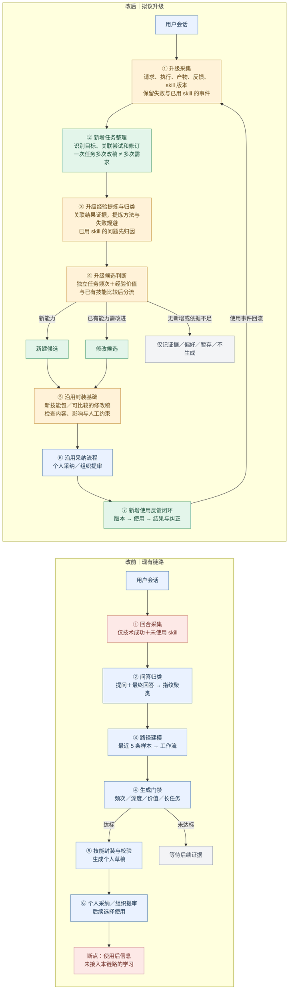
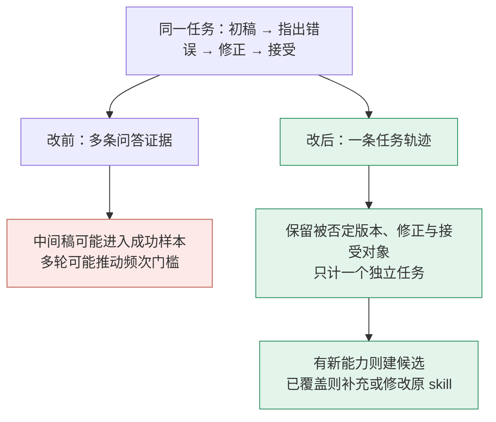

# 技能涌现链路升级：流程图对照

2026-09-20 · 团队沟通图 · 拟议方案，尚未实施

绿色为新增，橙色为调整，蓝色为沿用基础或原链路节点，红色为原采集限制与反馈断点。现状依据用户文档，升级依据 006/007 方案。图中省略授权、脱敏、调度及重试细节。

## 三处核心升级

| 升级 | 变化 | 目标效果 |
| --- | --- | --- |
| 任务整理 | 问答回合 → 任务及多次尝试 | 五次改稿不机械计成五次独立需求，保留反馈指向 |
| 经验筛选 | 门禁命中 → 经验判断与存量比较 | 可以新建、修改、暂存或不生成 |
| 使用反馈 | 使用后被跳过 → 版本明确的反馈回流 | 持续积累改进依据，无新信息不强制改版 |

旧系统有同名重生成和人工版本管理，红色断点仅指缺少使用结果驱动的学习回路。个人采纳和组织提审仍可拒绝，图展示采纳后的主路径。

“沿用封装基础”不表示原校验已涵盖新版要求：内容比较、人工约束保留及影响检查需要补齐。未知结果可暂存，后续证据可重新触发判断。

## 同一段会话的前后差异

案例为构造示例。旧链路不一定每轮生成一个技能；图强调统计与理解的变化。改后关联不明时仍需暂存，不能保证自动完全正确。有效率、时间与净成本收益尚未测量。

详细方案：[任务发现与埋点](006_task_discovery_and_instrumentation.md)、[改动效果对照](007_before_after_changes.md)。

