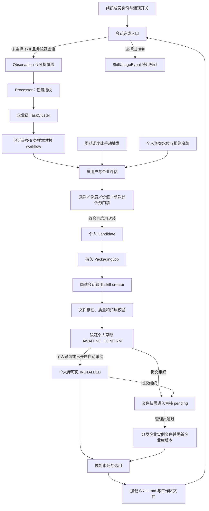
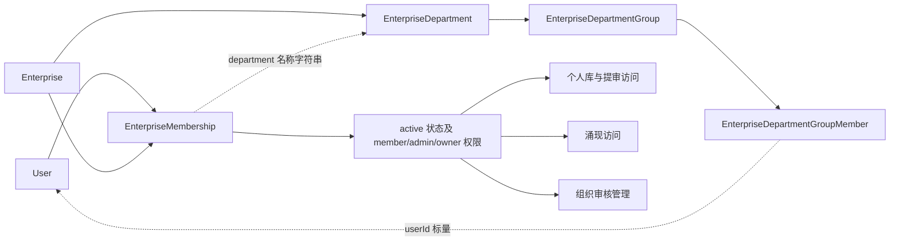

# 组织成员、个人／企业 Skills 库与涌现链路：源码图谱

日期：2026-09-20。代码根目录：`D:/skillsgen-industry_track/enginering/insightweaver`。

本轮首次对上述范围核验源码，建立 CodeGraphMCP 索引。以下描述是本地源码的静态行为，不代表生产环境已部署、已运行或效果已验证。没有启动业务服务、执行实验、连接企业数据库或修改业务源码。

## 1. 范围与索引入口

范围限定为组织成员关系、个人／企业技能库，以及会话观察→聚类→评估→封装→采纳／组织提审→选用的直接链路。计费、连接器、RAG、任务看板、数字大脑等只保留相关调用处的接口边界，不展开其内部功能。全局技能配置仅作为个人／企业市场合并时的依赖记录。

- [索引使用说明](../codegraph/README.md)：MCP 查询方法、刷新和边界。
- [当前快照指针](../codegraph/latest.json)：定位数据库、限定源码副本。
- [源码证据关系图 JSON](../codegraph/semantic-graph.json)：36 个业务节点、46 条经源码核对的关系；每条关系有文件与行号。
- [快照清单](../codegraph/runs/20260920T062102167459Z/manifest.json)：111 个源文件的哈希、原路径和摘录范围。
- [MCP 查询记录](../codegraph/runs/20260920T062102167459Z/queries/graph.json)：原始图谱；同目录保存符号、文件上下文和概览查询。
- [符号到原文件的映射](../codegraph/runs/20260920T062102167459Z/symbol-index.json)。

本次 CodeGraphMCP 数据库有 **520 个节点、796 条原始边**；其中 **409 条边的两端都存在节点**。原始边含无法解析的 import 目标，不应把 796 当成已验证调用关系数量。另有 1 份派生 Prisma Markdown 投影；它让模型名称可检索，但不是完整数据库关系解析。

混合职责文件 `zclaw.service.ts`、`agent-runtime.ts`、`enterprise.service.ts`、`enterprise.controller.ts`、`schema.prisma` 仅摘取相关部分，其他行置空，保留原行号。限定副本不可用于编译或修改；修改应回到 `manifest.json` 指向的原文件。

## 2. 主链路图

图中的业务箭头经源码核对，不是把 MCP 的 import 边当作调用链。

**图中没有从使用统计回到自动演化的实线。** 在已核验入口中，`conversationUsedSkill` 由 `options.skillIds` 是否非空判断；它不是对模型实际工具调用的判定。已选择 skill 的完成会话被涌现观察入口排除，但会写使用统计。参见 [使用标志](D:/skillsgen-industry_track/enginering/insightweaver/apps/api/src/zclaw/zclaw.service.ts:9846)、[完成分流](D:/skillsgen-industry_track/enginering/insightweaver/apps/api/src/zclaw/zclaw.service.ts:10401)。

## 3. 组织与成员：隔离边界从哪里来

| 对象／规则 | 源码事实 | 定位 |
| --- | --- | --- |
| 成员主关系 | `EnterpriseMembership` 同时关联 User 和 Enterprise；`role`、`status`、`isDeleted` 控制身份；唯一键为 `(enterpriseId,userId,isDeleted)` | [模型](D:/skillsgen-industry_track/enginering/insightweaver/packages/db/prisma/schema.prisma:251) |
| 部门关联 | membership 中保存 `department` 名称字符串，并非 `departmentId` 外键；部门下的小组另用实体关系建模 | [部门模型](D:/skillsgen-industry_track/enginering/insightweaver/packages/db/prisma/schema.prisma:202) |
| 小组成员 | `(groupId,userId)`、`(departmentId,userId)` 各自唯一；User 侧只有标量 userId，不能把图上虚线画成已声明 Prisma 外键 | [小组成员](D:/skillsgen-industry_track/enginering/insightweaver/packages/db/prisma/schema.prisma:236) |
| 库访问 | `assertActiveEnterpriseMember` 同时要求成员 active、未删除，企业 active、未删除 | [成员门槛](D:/skillsgen-industry_track/enginering/insightweaver/apps/api/src/enterprises/enterprise.service.ts:2016) |
| 企业管理 | `assertEnterpriseAdminOrOwner` 进一步检查成员角色；平台管理员是另外的授权路径 | [角色检查](D:/skillsgen-industry_track/enginering/insightweaver/apps/api/src/enterprises/enterprise.service.ts:1641) |
| 涌现开关 | 必须有有效成员。B2B 读 Enterprise 开关、周期、自动采纳；consumer 类型读 UserSkillEmergencePreference | [访问解析](D:/skillsgen-industry_track/enginering/insightweaver/apps/api/src/skill-emergence/skill-emergence-access.service.ts:18) |

涌现访问服务和通用企业成员校验的查询条件不完全相同，应保留为两个节点，不概括成一个全局通用授权函数。当前看到的库和涌现作用域以 `enterpriseId`、`userId` 为主，没有把部门／小组作为个人技能主键。

成员入口还包括加入、审批、停用、恢复、角色、资料、部门、小组、导入；索引只保留 [EnterpriseController](D:/skillsgen-industry_track/enginering/insightweaver/apps/api/src/enterprises/enterprise.controller.ts:33) 的相关区段，未展开额度与消费功能。

## 4. 个人／企业 Skills 库不是同一张表

| 对象 | 标识／内容 | 作用 |
| --- | --- | --- |
| PersonalSkillConfig | `(enterpriseId,userId,skillKey)`；展示信息、source、sourceRefId、isVisible、isDeleted | 个人技能元数据与可见性。个人技能仍带企业上下文，不是跨组织的纯 userId 库 |
| 运行时技能文件 | 经 Zclaw／KM 接口读写 `SKILL.md` 和文件包 | 技能实际执行材料；数据库展示配置不能替代文件是否存在 |
| SkillSubmission | `(enterpriseId,skillKey,submitterUserId)`；filesSnapshot、审核状态 | 个人向组织提交的审核单 |
| SkillSubmissionVersion | `(enterpriseId,submitterUserId,skillKey,version)` | 组织提审／发布历史快照，支持历史版本再次提审 |
| EnterpriseSkillConfig | `(enterpriseId,skillKey)`；type、分类、isVisible、publishedVersion | 企业目录配置与当前发布版本指针 |
| GlobalSkillConfig | skillKey 唯一 | 市场合并时的全局基底；本轮不展开全局管理业务 |

模型证据集中在 [schema.prisma](D:/skillsgen-industry_track/enginering/insightweaver/packages/db/prisma/schema.prisma:582)。

具体关系：

1. **生成草稿**：`runSkillEmergencePackaging` 在隐藏会话中指定 `skill-creator`，检查个人文件存在与 `SKILL.md` 质量；随后写 `PersonalSkillConfig(source=skill_emergence,isVisible=false)` 并核对组织、用户、来源。见 [封装桥接](D:/skillsgen-industry_track/enginering/insightweaver/apps/api/src/zclaw/zclaw.service.ts:8796)。
2. **个人采纳**：将候选置 `INSTALLED`、写 acceptedAt，并使个人配置可见；撤销采纳返回 `AWAITING_CONFIRM` 并软隐藏。启用自动采纳时可跳过手动确认。见 [采纳](D:/skillsgen-industry_track/enginering/insightweaver/apps/api/src/skill-emergence/skill-emergence-evaluator.service.ts:582)、[自动采纳](D:/skillsgen-industry_track/enginering/insightweaver/apps/api/src/skill-emergence/skill-emergence-packaging.service.ts:453)。
3. **提交组织**：前端依次调用 prepare-submit → skill-submissions → mark-org-submitted；prepare-submit 只返回可提审 skillKey。`SUBMITTED` 是候选标记，不是组织审核通过。见 [前端顺序](D:/skillsgen-industry_track/enginering/insightweaver/apps/web/src/components/my-emergence/MyEmergencePage.tsx:402)、[提审服务](D:/skillsgen-industry_track/enginering/insightweaver/apps/api/src/skills/skill-submission.service.ts:231)。
4. **组织发布**：审核通过先调用企业各实例的 managed skill 文件写入，再通过数据库事务更新版本、企业技能配置和审核状态。见 [approveForAdmin](D:/skillsgen-industry_track/enginering/insightweaver/apps/api/src/skills/skill-submission.service.ts:514)、[实例分发边界](D:/skillsgen-industry_track/enginering/insightweaver/apps/api/src/zclaw/zclaw.service.ts:7915)。未连接实例验证实际分发行为。
5. **展示与选用**：市场合并运行时技能、个人配置、企业配置和全局配置，允许个人／组织同 key 共存；企业 DB 条目若运行时未安装，会标记不可选。见 [getSkillMarket](D:/skillsgen-industry_track/enginering/insightweaver/apps/api/src/skills/skill.service.ts:1157)、[市场合并](D:/skillsgen-industry_track/enginering/insightweaver/apps/api/src/skills/skill.service.ts:1299)。
6. **使用与版本**：已选技能加载 `SKILL.md`；个人 revision 读写／恢复走运行时接口，组织版本走 SkillSubmissionVersion，二者应分别记录。见 [正文加载](D:/skillsgen-industry_track/enginering/insightweaver/apps/api/src/zclaw/zclaw.service.ts:13059)、[个人 revision](D:/skillsgen-industry_track/enginering/insightweaver/apps/api/src/zclaw/zclaw.service.ts:7992)。

## 5. 涌现链路的执行与数据索引

| 阶段 | 主要服务／函数 | 读写与作用域 |
| --- | --- | --- |
| 观察 | `SkillEmergenceRecorder.recordCompletedConversation` | Observation 按 `(enterpriseId,requestEventId)` 幂等；Snapshot 按 observationId 关联；单条输入是用户消息与助手回复 |
| 指纹 | `SkillEmergenceProcessor.processObservation` → `AgentRuntime.analyzeSkillEmergenceFingerprint` | 回查两条消息；以规范化 taskType/inputType/outputType 哈希产生 clusterKey；企业内 upsert Cluster |
| 路径建模 | `processEligibleClusters` → `modelClusterPath` → `analyzeSkillEmergenceWorkflow` | 达到前置频次或早期分析条件后，取同 cluster 最近最多 5 条样本；优先快照，缺失时回查消息；写 workflow 与 path_analyzed |
| 周期 | `SkillEmergenceScheduler` | 用户×企业 ScheduleState；上海午夜检查到期，启动时补处理；另有手动评估入口 |
| 评估 | `evaluateUserEnterprise` → `evaluateEmergenceGates` | 企业 cluster + 当前用户 observations + 当前用户 Progress；写 Evaluation 决策；合格时创建 Candidate 并自动入封装队列 |
| 封装 | `enqueueConfirmedCandidate`／`runJob` | PackagingJob 独立状态、幂等 key、租约与重试；调用隐藏 skill-creator 生成；成功推进个人水位 |
| 候选消费 | `markAccepted`／`markRejected`／`markOrgSubmitted` | 用户×企业候选；分别采纳、拒绝、组织提交。拒绝冷却等状态不等于修改企业 cluster 的生命周期 |

主要定位：[Recorder](D:/skillsgen-industry_track/enginering/insightweaver/apps/api/src/skill-analytics/skill-emergence-recorder.service.ts:35)、[Processor](D:/skillsgen-industry_track/enginering/insightweaver/apps/api/src/skill-analytics/skill-emergence-processor.service.ts:160)、[路径取样](D:/skillsgen-industry_track/enginering/insightweaver/apps/api/src/skill-analytics/skill-emergence-processor.service.ts:227)、[Scheduler](D:/skillsgen-industry_track/enginering/insightweaver/apps/api/src/skill-emergence/skill-emergence.scheduler.ts:175)、[Evaluator](D:/skillsgen-industry_track/enginering/insightweaver/apps/api/src/skill-emergence/skill-emergence-evaluator.service.ts:105)、[Packaging](D:/skillsgen-industry_track/enginering/insightweaver/apps/api/src/skill-emergence/skill-emergence-packaging.service.ts:285)。

**必须保留的作用域区分：** Cluster 和 workflow 是企业级共享；路径取样查询按 clusterId，没有追加 userId。候选评估的 observations、覆盖、拒绝冷却和水位则是个人级。数据库仍保留 cluster 上的旧覆盖字段，但当前门禁使用 `SkillEmergenceUserProgress`。这是源码层面的作用域事实，未据此断言发生跨用户泄露或污染。

门禁在 30 天 SUCCESS 观察窗口内运行；候选未完结、拒绝冷却、无新证据等先拦截，然后以 OR 方式看频次、深度、价值、单次长任务。当前常量含频次 5 次、深度／价值至少 2 次、单次长任务 8 步或 6 次工具信号或 8000 字且 5 步等条件。周期只负责唤醒，不是门禁。见 [门禁](D:/skillsgen-industry_track/enginering/insightweaver/apps/api/src/skill-emergence/skill-emergence-gate.ts:117)、[常量](D:/skillsgen-industry_track/enginering/insightweaver/apps/api/src/skill-emergence/skill-emergence.constants.ts:20)。

不能把这些条件直接当作真实运行覆盖：`normalizeWorkflow` 当前保留的是 title、goal、inputContract、outputContract、steps、toolCategories、confidence，没有保留门禁可读的所有分支／工具计数字段。图谱保留“建模输出→门禁输入”接口，后续若研究门禁效果，应沿此接口核对实际数据；本轮不作效果推断。见 [工作流规整](D:/skillsgen-industry_track/enginering/insightweaver/apps/api/src/skill-analytics/skill-emergence-processor.service.ts:437)。

候选主要状态为 `DISCOVERED → PACKAGING → AWAITING_CONFIRM → INSTALLED / SUBMITTED / REJECTED`；封装失败进入 FAILED，可重试；CONFIRMING 及部分直接 INSTALLED 跳转为兼容路径。候选、封装作业和组织审核各有状态，不能混用。完整约束见 [候选状态机](D:/skillsgen-industry_track/enginering/insightweaver/apps/api/src/skill-emergence/skill-emergence-state-machine.ts:14)。

## 6. 后续限定阅读入口

| 要理解或修改的行为 | 首先定位 | 紧邻依赖 |
| --- | --- | --- |
| 组织成员是否可访问 | EnterpriseService 权限函数 | Membership、企业状态；涌现再看 AccessService |
| 什么会话进入涌现 | ZclawService 完成分流（10401 起） | Recorder、Snapshot；不必阅读整个 ZclawService |
| 哪些记录归成一个任务类 | Processor.processObservation／normalizeFingerprint | AgentRuntime 的指纹接口、Cluster |
| 工作流怎么产生 | modelClusterPath／normalizeWorkflow | 最近样本、Snapshot、LLM 输出 |
| 什么时候产生候选 | Evaluator + Gate + Scheduler | Progress、水位、冷却、配置开关 |
| skill 怎么落地 | Packaging.runJob + runSkillEmergencePackaging | skill-creator 外部执行边界、质量校验、PersonalSkillConfig |
| 采纳和提交组织 | MyEmergencePage + EmergenceController | Evaluator + SkillSubmissionService |
| 企业库发布与版本 | SkillSubmissionService.approveForAdmin／resubmitVersion | 文件分发、SubmissionVersion、EnterpriseSkillConfig |
| 个人／企业技能为何可见或不可选 | SkillService.getSkillMarket／buildSkillMarketResponse | PersonalConfig、组织 override、运行时安装状态 |
| 使用后有什么记录 | SkillAnalyticsRecorder | SkillUsageEvent；本轮未发现与自动演化连接的调用 |

## 7. 与旧研究记录的关系和未知项

本轮把此前仅来自链路文档的若干描述提升为**限定源码范围内已核验的观察**：未选 skill 才入观察、企业聚类／个人水位分离、封装后隐藏草稿、个人采纳与组织审核分离。旧轮次的“未读源码”仍是当时真实状态，保留历史，不追改旧报告。

特别澄清：源码已有分析样本快照、个人进度表、个人 revision 接口及组织版本表；不能将先前关于证据缺失和演化断点的讨论理解成“完全没有快照或版本管理”。快照虽有 frozen 注释，Recorder 的 upsert update 仍可改写其文本，因此本图称“分析样本快照”，不称严格不可变事件存储。

未知仍包括：生产配置和部署版本、企业真实会话及候选质量、KM 实例文件实际内容、运行结果、采纳收益，以及其他未纳入范围的系统是否另有演化入口。本轮新增的是静态源码证据，**无新增运行实证发现**。使用统计中的 savedHours 为固定总量分摊逻辑，不能当作本轮测得节省时间，见 [使用统计](D:/skillsgen-industry_track/enginering/insightweaver/apps/api/src/skill-analytics/skill-analytics-recorder.service.ts:19)。
