# 基于源码核对的 Skills 涌现与演化升级方案

> 当前版本已由 [013 全面复核版](013_comprehensive_upgrade_plan.md)统一取代：优先零新表，并补齐失败入口、算法核心、资源核算、候选更新与文件／应用契约。本文保留历史，不作为独立最新方案。

日期：2026-09-20｜轮次 010｜受众：产品、后端、前端与研究团队。

> 轮次 011 补充更正：本文“三个新表”的物理落地建议已收敛为优先复用现有表，完整首版建议仅新增 TaskInstance；详见 [数据层复用方案](011_reuse_existing_tables.md)。本文原建议保留以供追溯，尚未实施。

**结论：源码补齐了关键实现信息。建议保留现有库、候选、调度和封装作业，在观察与聚类之间补上任务轨迹层；将候选决策改为“新建／更新／补证／不生成”，再把使用反馈接回这一层。** 当前方案是静态源码核对后的落地建议，尚未修改业务代码、接入生产或验证收益；不包含论文实验设计。

## 1. 源码补齐了什么，也纠正了什么

核对范围为本地 `enginering/insightweaver` 的涌现、个人／企业库、组织审核及直接会话接口。其他模块只看接口边界。行号以本轮源码为准。

| 已核验实现 | 对方案的影响 | 源码依据 |
| --- | --- | --- |
| 普通完成入口仅将未选择 skill 的回合送入涌现；未传 outcome，Recorder 默认 SUCCESS | 确实存在“运行完成→成功经验”的替代；失败、取消和使用 skill 的轨迹需要进入统一记录 | [完成分流](D:/skillsgen-industry_track/enginering/insightweaver/apps/api/src/zclaw/zclaw.service.ts:10433)、[默认结果](D:/skillsgen-industry_track/enginering/insightweaver/apps/api/src/skill-analytics/skill-emergence-recorder.service.ts:47) |
| Observation 是一对用户／助手消息；messageCount 却统计整个 session | 长度信号并不等于单个任务深度；同一目标反复改稿仍会贡献多个 observation | [记录入口](D:/skillsgen-industry_track/enginering/insightweaver/apps/api/src/zclaw/zclaw.service.ts:10459)、[数据模型](D:/skillsgen-industry_track/enginering/insightweaver/packages/db/prisma/schema.prisma:2403) |
| 工具活动已经通过 tool 消息和 rawPayload 持久化 | 无需重建整套工具日志，需补关联、取证和稳定引用；“涌现没利用工具轨迹”不等于“平台没有工具记录” | [工具消息写入](D:/skillsgen-industry_track/enginering/insightweaver/apps/api/src/zclaw/zclaw.service.ts:10130) |
| 有样本 Snapshot，但 upsert 可改写；指纹阶段仍回查原消息，路径阶段优先用 Snapshot | 现有快照可复用，但不构成完整、不可变的任务证据版本；原消息删除可能影响指纹处理 | [Recorder](D:/skillsgen-industry_track/enginering/insightweaver/apps/api/src/skill-analytics/skill-emergence-recorder.service.ts:35)、[Processor](D:/skillsgen-industry_track/enginering/insightweaver/apps/api/src/skill-analytics/skill-emergence-processor.service.ts:160) |
| Cluster／workflow 为企业级，路径取最近最多 5 条；候选门禁取当前用户 observations 和 Progress | 更正早期“统一共享计数触发个人候选”的笼统表述：路径建模和个人候选评估是不同作用域。共享 workflow 仍应保留个人偏好边界 | [路径取样](D:/skillsgen-industry_track/enginering/insightweaver/apps/api/src/skill-analytics/skill-emergence-processor.service.ts:227)、[个人评估](D:/skillsgen-industry_track/enginering/insightweaver/apps/api/src/skill-emergence/skill-emergence-evaluator.service.ts:132) |
| workflow 提示词与规整仅保留基本步骤等字段；门禁另读取 branches、failureBranches、meaningfulToolCallCount、structuredValueSignal 等 | 单改门槛无效，应一起改“建模输入→输出类型→规整→门禁”的完整契约；工具次数应来自事实，不能让模型编造 | [建模接口](D:/skillsgen-industry_track/enginering/insightweaver/apps/api/src/agent/agent-runtime.ts:654)、[规整](D:/skillsgen-industry_track/enginering/insightweaver/apps/api/src/skill-analytics/skill-emergence-processor.service.ts:437)、[门禁](D:/skillsgen-industry_track/enginering/insightweaver/apps/api/src/skill-emergence/skill-emergence-gate.ts:178) |
| 频次条件可单独命中；Evaluator 传 isDuplicate:false | 提高“5 次”不能解决低价值与重复。需要先做价值准入，再检索已有库决定新建还是更新 | [门禁](D:/skillsgen-industry_track/enginering/insightweaver/apps/api/src/skill-emergence/skill-emergence-gate.ts:200)、[评估调用](D:/skillsgen-industry_track/enginering/insightweaver/apps/api/src/skill-emergence/skill-emergence-evaluator.service.ts:177) |
| 新 observation 更新 cluster 指纹等字段，但不会使已 path_analyzed 的 workflow 重新建模 | 当前新增证据可能一直使用旧 workflow；要增加证据修订号、待刷新标记及去抖重建 | [聚类更新及建模筛选](D:/skillsgen-industry_track/enginering/insightweaver/apps/api/src/skill-analytics/skill-emergence-processor.service.ts:160) |
| 新证据用 30 天 SUCCESS 列表长度减历史 watermark，并用 slice 截取；候选唯一键含 evidenceToCount | 滚动窗口和累计数量不是稳定证据标识；任务纠正但数量不变也无法表达，须改为具体任务修订集合 | [数量水位](D:/skillsgen-industry_track/enginering/insightweaver/apps/api/src/skill-emergence/skill-emergence-gate.ts:125)、[候选模型](D:/skillsgen-industry_track/enginering/insightweaver/packages/db/prisma/schema.prisma:2494) |
| 已有 PackagingJob 幂等、租约、重试；生成后到 AWAITING_CONFIRM | 继续用现有作业机制，不引入新的外部消息队列作为首版前置条件 | [作业执行](D:/skillsgen-industry_track/enginering/insightweaver/apps/api/src/skill-emergence/skill-emergence-packaging.service.ts:285) |
| 封装先要求实际个人文件存在，再隐藏配置；采纳主要将配置可见。默认 skillKey 由 cluster 派生 | 隐藏不等于文件隔离；同 key 再生成存在先改文件、再确认的设计风险。不是已复现生产故障，但演化前必须改为独立草稿 | [实际生成](D:/skillsgen-industry_track/enginering/insightweaver/apps/api/src/zclaw/zclaw.service.ts:8796)、[默认 key](D:/skillsgen-industry_track/enginering/insightweaver/apps/api/src/skill-emergence/skill-emergence-packaging.service.ts:335)、[采纳](D:/skillsgen-industry_track/enginering/insightweaver/apps/api/src/skill-emergence/skill-emergence-evaluator.service.ts:582) |
| 已有个人 revision 与组织版本；选中技能正文加载结果只返回提示词；使用统计按选择列表记账，savedHours 固定分摊 0.5 | 复用版本能力，补实际加载版本与来源，区分选择、加载、执行。固定工时不是测得收益 | [个人 revision](D:/skillsgen-industry_track/enginering/insightweaver/apps/api/src/zclaw/zclaw.service.ts:7992)、[技能加载](D:/skillsgen-industry_track/enginering/insightweaver/apps/api/src/zclaw/zclaw.service.ts:13059)、[使用统计](D:/skillsgen-industry_track/enginering/insightweaver/apps/api/src/skill-analytics/skill-analytics-recorder.service.ts:19) |

另一个边界：组织发布先分发文件、后写数据库事务，前端提交组织为多次调用。因此升级不能假定已有发布是跨数据库与运行时的原子操作。见 [审核发布](D:/skillsgen-industry_track/enginering/insightweaver/apps/api/src/skills/skill-submission.service.ts:558)、[提交入口](D:/skillsgen-industry_track/enginering/insightweaver/apps/web/src/components/my-emergence/MyEmergencePage.tsx:402)。

## 2. 前后链路：保留骨架，替换学习单位

```mermaid
flowchart TB
  subgraph BEFORE["现有实现：按完成回合涌现"]
    A["用户与助手消息"] --> B{"运行完成且未选 skill"}
    B -->|是| C["一对问答 Observation<br/>默认 SUCCESS"]
    B -->|选了 skill| D["独立使用统计<br/>未接回演化"]
    C --> E["粗粒度指纹聚类"]
    E --> F["最近最多 5 条问答<br/>建模 workflow"]
    F --> G["个人数量水位与 OR 门禁"]
    G --> H["现有封装作业"]
    H --> I["实际个人文件已生成<br/>配置隐藏等待确认"]
    I --> J["个人采纳或组织提审"]
  end
  subgraph AFTER["拟议升级：按任务证据形成经验"]
    K["消息、工具、产物与反馈<br/>包含失败和 skill 使用"] --> L["稳定回合关联<br/>事实记录"]
    L --> M["任务整理<br/>目标、尝试、纠正、结果"]
    M --> N["可追溯任务修订<br/>未知结果保持未知"]
    N --> O["经验准入与已有库匹配"]
    O -->|新能力| P["NEW 新建"]
    O -->|已有能力需改进| Q["UPDATE 修改建议"]
    O -->|无新增规则| R["补证、偏好、诊断或暂存"]
    P --> S["复用封装作业<br/>独立草稿与证据版本"]
    Q --> S
    S --> T["用户采纳或组织审核<br/>确认后发布版本"]
    T --> U["后续使用<br/>绑定实际加载版本"]
    U --> L
  end
```

改后的主线是：**一次任务可以包含多个回合和失败尝试；一条可信经验可以用于新建、更新或补证，不强制生成新 skill。**

## 3. 先统一三个判断口径

- **有价值的任务**：有具体目标、处理对象、预期结果或判断标准，并有可说明的业务用途。高频与重要性是优先级证据；消息长、工具多、反复报错都不直接代表价值。
- **有价值的轨迹**：能够说明某个方法、约束、错误或修正是如何发生的，且其中有可复用经验。任务整体未知或失败，不妨碍保留有依据的局部经验。
- **值得生成新 skill**：经验可迁移到未来任务，证据足以支撑所写规则，且当前可用库没有合适能力。已有能力只需纠正步骤或适用条件时，走更新。

不要在第一版追求一个“综合价值分”决定一切。先保存可解释的判断：目标、结果证据、复用条件、方法增量、已有能力覆盖、拒绝原因。频次在通过准入后排序；单次重要任务也可成为候选，但不能凭长文本认定重要。

## 4. 如何在当前系统采集与识别任务

### 4.1 采集事实：复用已有消息与工具存储

在 Zclaw 对外会话入口生成或取得稳定 turnId，关联原 clientMessageId/requestEventId；在可能提前失败的上下文准备之前建立关联。一次技术执行单独有 runId，重试不得变成新的业务任务。不要把 billingTaskId 或可选 activeRun 当作业务 taskId。

下列事件名均为**拟议接口**，不是当前已有埋点：

| 触发位置 | 记录什么 | 当前改动位置 |
| --- | --- | --- |
| 用户消息持久化成功 | turn.started：企业、用户、session、turn、userMessageId、来源、时间 | Zclaw 创建用户消息附近，约 9860 行 |
| 技能正文加载结束 | skill.load：skillKey、scope、实际来源、revision／内容哈希、加载成功或失败 | buildSelectedSkillsExtraSystemPrompt，13059 行；返回文本与结构化加载凭据 |
| 工具消息写入／更新 | 引用 toolCallId、messageId、状态、输入输出摘要及摘要版本 | 现有 toolActivities／upsertLocalToolMessage；不复制所有原始输出 |
| 产物被关联到会话 | artifact.observed：产物 ID、版本／哈希、相关 turn | 现有 consumeConversationArtifactManifest 接口边界；只证明产物存在，不证明用户验收 |
| run.completed／error／aborted 与异常退出 | turn.terminal：技术状态、助手消息可空、错误类别、关联运行 | 原完成分流及异常分支；学习记录与使用统计分开 |
| 用户后续改稿或反馈 | feedback.observed：原消息引用、目标任务／产物（能确定时）、原始反馈类别 | 原对话入口；新增可选任务完成／仍需修改反馈接口与入口 |
| 候选接受、拒绝、组织提交 | candidate.feedback：候选、原因、用户与目标作用域 | 现有 Evaluator／Controller／MyEmergencePage |

选择 skill、成功加载正文和实际执行是不同事实。首版可可靠记录前两者；工具调用能绑定技能资源时再记录执行依据。对于纯文本指令 skill，不能仅凭回复相似就声称它被实际遵循。多个技能同时使用、缺少步骤归属时，保留归因未知。

采集不等待后台 taskId。失败可能没有 assistantMessageId，新记录不能沿用 Observation 的双消息必填限制。隐藏的 skill-creator 封装会话应标为内部生成并排除需求统计，避免系统学习自己生成的候选；普通用户使用 skill 的会话则要保留。

企业 ID 固定为当次请求有效上下文，不从用户后来切换的默认企业回推。采集与处理沿用涌现开关和权限；共享建模只输入允许复用的脱敏方法，不把个人偏好自动提升为组织规则。

记录先持久化再异步处理。优先同数据库事务写轻量事件或补偿标记；远程工具事件仍按幂等键补记、对账，不宣称跨系统事务。仅用当前 fire-and-forget 加日志不足以保证失败轨迹不丢失。

### 4.2 任务整理：先限定同用户、同企业、同会话

新增一个任务整理服务，放在 Recorder 与 Processor 之间。规则优先，模型只负责不确定的语义关联：

1. 读入新增回合，以及该会话少量未结束任务卡；引用已有工具和产物事实。
2. 优先按明确回复目标、同一产物版本、用户“继续修改”语句关联旧任务。
3. 同目标的补充输入、重试、修订归入同任务的不同 attempt。新交付目标另建任务；一条消息中多个独立目标允许拆分。
4. 用目标、处理对象、交付物和验收约束判断延续，不能只按时间间隔或关键词相似合并。
5. 无法判定时暂存待关联并保留置信度，不把低置信度合并结果直接送去自动生成。
6. 跨会话首版只支持明确任务／产物引用或用户主动续接；无依据的语义跨会话合并后置。

任务卡至少包含：目标、输入／输出约束、事件引用、尝试列表、被推翻的答案、修正关系、最新产物、技术终态、业务结果、用户接受证据、技能加载凭据。

业务结果为成功／部分完成／失败／未知，并附来源。用户明确接受、规则检查通过分别存储，二者冲突时保留冲突；“好的”必须能关联具体交付物，不能泛化。模型运行完成只设置技术终态。无反馈超时转为静默暂存，不能转成功。

后续“刚才数据口径错了”会产生新的任务修订，撤销相关成功判断。未发布候选重新待审；已发布版本保留历史并产生复查／修改建议。原始事件不被新推断覆盖。

### 4.3 噪声与失败如何分流

| 会话片段 | 应如何处理 |
| --- | --- |
| 无交付目标的闲聊、泛知识随问 | 不计独立工作任务，不生成 skill |
| 助手自言自语、重复流式片段、内部封装会话 | 按来源过滤／去重，不能当用户需求 |
| 同一任务连续改 5 次 | 一个任务、多个尝试；保留错误与修正，不算 5 次需求 |
| 平台超时、临时连接错误 | 保留技术诊断，不将“重试即可”泛化为业务方法 |
| 输入格式错误且用户提供了可验证修正 | 提炼“触发条件→失败表现→修正→结果证据” |
| 用户“以后都用万元” | 先保存个人／任务范围偏好；没有组织依据不改组织技能 |
| 使用 skill 后发现漏步骤 | 关联实际版本并诊断，形成该 skill 的修改候选 |
| 使用 skill 顺利完成但无新方法 | 补充覆盖证据，不强制新建或改版 |
| 没有最终确认，但中途明确纠正了字段映射 | 整体结果未知；局部映射规则可作为待审经验，不宣称整条路径成功 |

## 5. 如何减少低价值候选，并让旧 skill 真正演化

### 5.1 从一次 OR 门禁改成四步决策

**第一步：任务准入。** 排除纯噪声；要求有具体目标与可引用证据。频次以 distinct taskId 计数，需求次数与有可信方法的任务数分开存。

**第二步：经验准入。** 形成“适用条件、做法、避免事项、证据引用、未证实部分”。不以 LLM 自报 confidence 代替事实检查。没有可复用方法的高频任务进入需求机会列表，不自动封装。

**第三步：已有库匹配。** 限定当前用户有权使用的个人／组织库，先按目标、输入输出、适用条件召回，再比较内容。skillKey 或名称相同不等于能力相同。无法确定归属时待审。

**第四步：选择动作。**

| 动作 | 进入条件 | 产物 |
| --- | --- | --- |
| NEW | 有新方法，已有能力不覆盖 | 新技能草稿 |
| UPDATE | 已有能力明确关联，出现可信新增／纠正规则 | 指向原版本的差异草稿 |
| SUPPORT | 现有规则再次得到支持，没有内容增量 | 证据记录 |
| PREFERENCE | 仅个人偏好或单次特殊要求 | 带作用域的偏好建议 |
| DIAGNOSTIC／DEFER／IGNORE | 平台问题、证据不足或噪声 | 原因记录，不封装 |

NEW 与 UPDATE 继续进入现有 Candidate 和 PackagingJob。首版不必为所有分流新建前端工作台：其他结果保存在 Evaluation 并允许从任务详情查看。

### 5.2 修复工作流与水位的三个具体问题

- **工作流来源改成任务修订。** 不再只传 userRequest/finalResponse；传适用条件、尝试摘要、失败修正、结果依据和事件引用。提示词、返回类型、normalizeWorkflow、Gate 同步更新。工具数由记录计算，分支必须有证据引用。
- **新证据触发刷新。** Cluster 保存 evidenceRevision 与 modeledRevision；新增、纠正、撤回证据时标为待刷新，合并短时间更新后再建模。取样覆盖正常路径、纠正路径和重要边界，避免最近五条全来自同一用户改稿。
- **数量水位改成证据集合。** 保存候选实际使用的 taskId+revision 集合和 evidenceSetHash；数量保留作展示。幂等键包含用户／企业、动作、目标 skill、基准版本及证据集合。已覆盖、已拒绝、暂存证据分别记录。

例如先处理 5 条，窗口滑出 2 条再新增 2 条，总数还是 5，当前减数量可能认为没有新证据。集合差分能找出新增两条；同一任务 revision 从 1 变为 2 也能被识别。候选唯一键不再仅依赖 evidenceToCount。

### 5.3 更新必须经过独立草稿

现有 draftFilesSnapshot 字段可复用，但本轮在 API 源码中未找到主流程对它的写入，不能把“字段存在”当成草稿隔离已经完成。

拟议发布过程：

1. 将候选 evidenceSet、workflowRevision、baseSkillRevision 固定下来；作业不能只读取 cluster 当前可变 workflow。
2. 生成到独立 draft key／隔离工作目录；把最终文件快照写入候选。需要实际运行时文件能力时，先核实 KM 是否支持隔离目录；不支持则使用独立临时 key，绝不写原正式 key。
3. 检查文件完整性、格式、依赖、约束与差异。现有质量／可靠性报告继续使用，但不能替代实际任务效果证据。
4. 用户看到“为什么产生、解决什么、修改了哪些步骤、哪些证据支持、尚不确定什么”；选择个人采纳或提交组织审核。
5. 发布前比较当前版本与 baseSkillRevision；发生并发更新则重新合并、重新待审，不能覆盖后来版本。
6. 确认后安装／发布并记录结果；远程文件和数据库状态用可重试发布步骤及对账修复。发布失败仍保留旧版或标明部分分发状态，不能只显示已完成。

优先沿用个人 revision 与组织 SkillSubmissionVersion。内容哈希用于确认实际材料；若运行时提供完整文件清单，对全包计算哈希。只能读到 SKILL.md 时明确哈希覆盖范围，不能声称已锁定脚本版本。

首版 UPDATE 默认人工确认。已有 NEW 自动采纳设置可保留为独立策略，不自动扩展成“允许静默更新已有技能”。组织更新仍走原审核角色，个人反馈不直接覆盖组织版。

组织提交建议增加一个幂等的后端编排入口，复用现有 submission 服务，返回 submissionId 并关联候选，替代依赖前端三次请求保持一致。组织分发先核验现有接口能否返回每实例结果；缺少时补状态回执，再支持失败实例重试。

## 6. 最小数据与模块改动

**后续更正：以下三表方案为 010 原建议；当前优先采用 [011 的一张新表＋扩展现有表](011_reuse_existing_tables.md)，仅采集阶段可零新表。**

以下名称是建议，不是已建表。首版新增三个核心模型即可；暂不需要独立轨迹平台或全新技能市场。

| 数据 | 最小职责 | 复用／改动 |
| --- | --- | --- |
| 新增 LearningEvent | 企业、用户、turn/run、来源、事件类型、时间、幂等键、消息／工具／产物引用、必要脱敏快照 | 复用原消息和工具记录；同时保留足够证据，避免仅引用可删除原文 |
| 新增 TaskInstance | 目标、会话、状态、当前修订、关联置信度 | 一个业务目标一个实例；不要复用 BillingTask |
| 新增 TaskTrajectoryRevision | 不可变修订、事件关系、attempt 摘要、结果证据、技能版本、提炼规则 | 初版 attempts 可结构化 JSON；修改关联新增修订，不改原事实 |
| 扩展 Cluster／workflow | 当前证据版本、已建模版本、任务级指纹与有来源规则 | 原 cluster、调度保留；企业共性与个人约束分开 |
| 扩展 Evaluation／Progress／Candidate | 决策动作、证据集合／hash、目标 skill、基准版本、草稿快照、拒绝原因 | 原计数保留展示，停用其证据游标职责 |
| 扩展使用记录与作业上下文 | 关联 turn/task、实际加载来源与版本、加载结果；生成与发布阶段信息 | 复用 SkillUsageEvent 和现有作业基础；反馈持久化为 LearningEvent |
| 复用库与发布版本 | PersonalSkillConfig、EnterpriseSkillConfig、SkillSubmissionVersion、个人 revision | 补候选／证据关联、发布回执，不另建一套技能库 |

task 关系是派生结果，保存于修订；不要因模型重关联而改写原 LearningEvent。大型事件集合可通过引用清单分页存储，后续有容量证据再拆关联表。

## 7. 按依赖顺序交付，团队可以据此拆任务

| 阶段 | 具体改动位置与内容 | 完成后用户可见效果／功能检查 |
| --- | --- | --- |
| A：记录真实过程 | Zclaw 会话入口、完成／失败分支、技能加载；Recorder 与 schema 增加事件及关联；保留原链路但以 feature flag 控制新链路发布 | 正常、失败、取消、选 skill 都有记录；重复通知不重复计数；内部生成不计用户需求；旧 SUCCESS 标为历史推断 |
| B：任务成为学习单位 | 新任务整理服务；Processor 和 AgentRuntime 改任务修订输入；任务详情展示目标、尝试与结果 | 反复改稿只形成一个任务；最终否定能纠正旧结果；无确认保持未知；任务可拆分和重新关联 |
| C：提高候选质量并安全入库 | Gate／Evaluator 库匹配及动作分流；证据集合替换水位；Packaging 固定输入和独立草稿；MyEmergencePage／Detail 展示原因和差异 | 噪声与重复能力不再自动封装；已有方法走修改建议；拒绝草稿不会改正式技能；并发版本冲突不会静默覆盖 |
| D：接通使用后演化与组织发布 | 版本加载凭据进入任务；UPDATE 候选复用 C；个人 revision 和组织审核接入发布编排与回执 | 用旧 skill 后的真实纠正形成可审核补丁；无新增经验不改版；组织发布能区分提交、审核、分发完成与失败 |

**必须的依赖：A→B→C→D。** 候选文件隔离可在 A／B 期间并行准备，但在启用 UPDATE 之前必须完成。不能只移除“选 skill 不记录”的判断就宣布自进化上线。

这些是产品行为检查，不是研究实验设计。本轮没有执行它们，也没有承诺候选有效率提升到某个比例。

迁移建议：保留旧 Observation 作为 legacy 来源；可获得完整上下文的历史记录重新整理，缺失者保持证据不足。旧 SUCCESS 不回写伪造新验收。新旧链路同时观察时，只允许一个链路产生可发布候选，避免重复封装。按企业开关逐步启用；停用新链路不撤销已确认版本，未完成作业保留可恢复状态。

## 8. 同一个真实业务形态，升级前后会发生什么

示意会话：用户要求季度客户经营分析；第一稿口径错误，第二稿漏掉退款；用户补充扣除规则后认可终稿。下次使用已有 skill，又要求新增“大额退款单独披露”。

| 环节 | 当前实现可能发生的行为 | 方案目标行为 |
| --- | --- | --- |
| 第一次任务反复修改 | 多个完成回合各记 SUCCESS；可能把修改过程当高频 | 一个任务、多次尝试；错误稿被标为被推翻 |
| 经验提炼 | 抽取输入／输出及步骤，修正因果可能缺失 | 保存“净收入需扣退款”的适用条件、旧错误、修正和确认依据 |
| 候选生成 | 达到频次即可进入候选；重复判断固定 false | 先判断可复用性，再查库；已有覆盖则补证或更新 |
| 再次使用 skill | 写使用统计，跳过普通涌现 | 记录实际加载版本，将新增披露要求判断为个人偏好或通用规则 |
| 有可信通用改进 | 当前核验范围未见自动演化回路 | 原版本不动，产生带差异与证据的 UPDATE 候选 |
| 用户没有新反馈 | 不构成演化证据 | 记录使用结果未知或已有证据，不强制升级 |

这是预期行为示例，不是已执行案例。低价值候选是否减少、人工是否更省仍需落地后观察。

## 9. 仍需在开发启动时核实的接口条件

源码已经足够确定升级方向，剩下是局部落地条件：

- KM 的独立草稿写入、完整文件快照、revision 获取／恢复，以及企业实例分发回执的实际能力；本轮未连接实例。
- 正常会话各入口、断连继续执行、异常退出的事件覆盖，不能只修改一处 run.completed。
- 真实反馈与产物验收入口是否存在、可提供哪一级证据。没有就新增轻量入口，同时保留“未知”路径。
- 生产配置、历史数据完整性、当前 deployed commit 与本地源码是否一致。
- 数据保留期限和共享权限：现有观察有清理周期，任务证据、派生候选和删除请求应协调处理；跨用户共享应留可审计来源和权限边界。

当前只建议观察：独立任务数、结果未知比例、候选被拒原因、新建／更新／补证分布、候选审核负担及发布失败情况。现有固定 savedHours 应标明为估算，不能写成已证明的节省工时。

## 10. 本轮决定与证据边界

**建议以“任务证据层＋候选分流＋独立草稿更新”作为落地主线。** 不优先扩大生成量、调高频次阈值或重建技能库。已有库与作业骨架可复用，关键是让它们处理正确的学习对象。

本轮新增静态源码观察，无新增运行实证发现。早期 [006 埋点方案](006_task_discovery_and_instrumentation.md)、[007 改动对照](007_before_after_changes.md)、[008 流程图](008_flow_comparison.md) 保留历史；具体实现与落地顺序以本文及 [009 源码图谱](009_scoped_codegraph.md) 为当前依据。没有宣称科研创新已成立。
