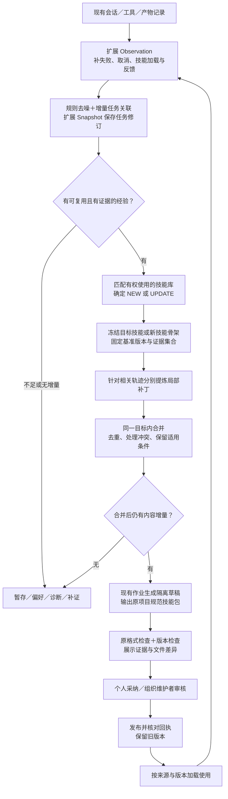

# Skills 涌现与演化升级方案：全面复核版

> 014用户新增约束后的修订：路由、trace算法和模型预算以[014规则轨迹与预算方案](014_rule_based_trace_and_budget.md)为准。取消全库语义匹配，默认零模型构建trace，NEW／UPDATE共享不扩大的总预算；不默认启用逐轨迹多agent。本报告的源码事实、零新表、技能格式和发布契约继续有效，其原成本增量与算法调用方案保留为历史。

2026-09-20｜轮次 013｜面向团队落地｜方案状态：未实施。

本文统一替代 010—012 的分散建议。历史稿保留；当前以本文为准。核查覆盖任务采集、数据复用、分析接口、调度与门禁、生成作业、候选操作、文件格式、个人／组织发布、加载使用和资源核算。依据为限定模块源码与 Trace2Skill 原论文／官方实现，不代表已完成生产验证。

## 1. 四个问题的直接结论

| 用户关心的问题 | 当前可支持的结论 | 本版对应调整 |
| --- | --- | --- |
| 能否说由 Trace2Skill 算法原型驱动？ | **旧方案不能这样称呼。** 本版明确采用其核心机制作为生成／演化引擎设计；落地后可称“基于 Trace2Skill 核心机制的企业适配原型”。目前尚无已接入、已运行的原型证据 | 固定基准技能→局部经验补丁→批量合并→隔离草稿；外围任务发现、权限、入库仍由现有系统承担 |
| 无效 skills 到底增还是减？ | **相同需求范围下，目标是减少无效新建和重复候选；不是已验证结果。全量绝对数量目前不能判定。** 扩大到失败和使用 skill 的会话后，输入规模可能抵消无效率下降 | 区分新技能、更新版本、补证和待判；在封装前筛选，并控制候选产出预算 |
| 大模型资源增还是减？ | **完整升级按“可能增加”规划预算，不能先承诺节省。** 少封装会节省，但轨迹整理、诊断、补丁合并、持续刷新会增加调用和上下文 | 用任务增量替代逐问答分析，规则先筛、按证据变化触发、合并更新、限额排队；单列生成和在线使用成本 |
| 存储与应用规范是否对齐？ | **最终技能包沿用原项目格式；内部轨迹和补丁不作为新技能格式。** 但旧方案没有补齐发布／加载接口，不能说天然兼容 | 保留 SKILL.md、辅助目录和市场信息；补齐最终 key、作用域、版本、草稿发布与组织维护权限 |

**数据库方向：优先零新表，扩展现有 Observation、AnalysisSnapshot 等对象。** 逻辑 taskId 不等于必须新增 TaskInstance 表；零新表仍需字段、约束、索引、读写与清理逻辑改动。本文不再把一张或三张新表列为前提。

## 2. 全面复核后必须补上的缺口

| 旧方案未完整覆盖的地方 | 源码核查结果 | 必须调整 |
| --- | --- | --- |
| 失败只需补采集就能学习 | Recorder 默认 SUCCESS，Processor 要求双消息；Scheduler、Evaluator、Gate 又筛 SUCCESS | 整条链改为“有可学习证据”的资格，任务整体结果另存。证据不足仍暂存，不能把所有失败当可学习 |
| 新字段到 workflow 就能生成 | 建模器、normalizeWorkflow 和封装 safe 对象各自白名单不一致；inputContract／outputContract 也未直接映射到封装 inputs／completionCriteria | 定义统一带 schemaVersion 的学习输入；逐层显式映射，覆盖失败、修正、适用边界、完成标准 |
| UPDATE 复用候选按钮即可 | 接受主要改可见性；拒绝、删除失败候选、撤销采纳可能隐藏个人 skill | action=NEW／UPDATE 分开处理；接受更新需实际发布；拒绝更新只弃草稿，不动正式技能 |
| 候选详情自然可追溯 | 当前详情读取 cluster 当前 workflow 与 SUCCESS 观察 | 详情读取候选冻结的 evidenceSet 与 workflow／patch 快照，避免后台变化导致说明漂移 |
| 任意组织成员可按原流程更新组织 skill | 现组织提审依赖个人导出包／本人历史快照，同 key 已由别人发布会被拦截 | 首版组织更新交原维护者／有权限管理员处理；普通成员提交建议，不能冒充所有者更新 |
| 草稿临时 key 可直接沿用原验证 | 包装校验要求指定 skillKey 在个人列表存在；采纳并不负责从草稿安装 | 区分 draftStorageKey 与 targetSkillKey；改封装验证和采纳发布，不把临时 key 当正式身份 |
| 选了某组织版就能记录其版本 | 加载函数只以 userId、key、name 取正文与文件树；没有显式 scope／revision 参数 | 选择引用与加载回执都携带实际来源与版本；无法解析时标未知，禁止把它用于确定性版本归因 |
| 多留快照就能复用表 | Snapshot 目前一对一关联 Observation 且级联删除 | 增加记录类型、任务修订与作用域，调整唯一约束、追加写、最新状态索引和清理规则 |
| 多加分析不影响成本口径 | 指纹、建模是真实模型调用；质量／可靠性评分多为本地规则；封装和修复是多步 agent run | 分阶段记录真实 tokens／费用；不能把一个 job 当一次模型请求，也不能把本地评分当模型消耗 |
| 超时重试总能限制开销 | 分析 timeout 只拒绝 Promise，未取消底层请求；人工重试可重置尝试次数 | 核查取消能力；同输入幂等复用已完成结果、限制重试预算，记录超时后仍完成的调用 |
| 修正了记录数就能控制长期积累 | workflow 刷新、证据撤回、已入库同 key 更新都涉及版本 | 证据集合哈希替代数量游标，固定基准版本；相同增量不重复生成，冲突重新待审 |
| 已封装就等于技能库已覆盖 | Packaging 在生成成功、等待确认时就推进 covered 与水位 | 已处理／已封装与已发布覆盖分开，待审或被拒草稿不算正式库已有能力 |

主要代码依据：

- [Recorder 默认结果及快照写入](D:/skillsgen-industry_track/enginering/insightweaver/apps/api/src/skill-analytics/skill-emergence-recorder.service.ts:47)、[Processor 双消息输入](D:/skillsgen-industry_track/enginering/insightweaver/apps/api/src/skill-analytics/skill-emergence-processor.service.ts:160)。
- [Scheduler SUCCESS 筛选](D:/skillsgen-industry_track/enginering/insightweaver/apps/api/src/skill-emergence/skill-emergence.scheduler.ts:139)、[另一个目标筛选](D:/skillsgen-industry_track/enginering/insightweaver/apps/api/src/skill-emergence/skill-emergence.scheduler.ts:317)、[Evaluator 选簇](D:/skillsgen-industry_track/enginering/insightweaver/apps/api/src/skill-emergence/skill-emergence-evaluator.service.ts:132)、[Gate](D:/skillsgen-industry_track/enginering/insightweaver/apps/api/src/skill-emergence/skill-emergence-gate.ts:108)。
- [建模契约](D:/skillsgen-industry_track/enginering/insightweaver/apps/api/src/agent/agent-runtime.ts:654)、[规整](D:/skillsgen-industry_track/enginering/insightweaver/apps/api/src/skill-analytics/skill-emergence-processor.service.ts:437)、[封装字段白名单](D:/skillsgen-industry_track/enginering/insightweaver/apps/api/src/skill-emergence/skill-emergence.constants.ts:92)。
- [候选拒绝／删除](D:/skillsgen-industry_track/enginering/insightweaver/apps/api/src/skill-emergence/skill-emergence-evaluator.service.ts:498)、[接受与撤销](D:/skillsgen-industry_track/enginering/insightweaver/apps/api/src/skill-emergence/skill-emergence-evaluator.service.ts:582)、[详情证据](D:/skillsgen-industry_track/enginering/insightweaver/apps/api/src/skill-emergence/skill-emergence.controller.ts:188)。
- [组织提审取文件](D:/skillsgen-industry_track/enginering/insightweaver/apps/api/src/skills/skill-submission.service.ts:282)、[同 key 所有者限制](D:/skillsgen-industry_track/enginering/insightweaver/apps/api/src/skills/skill-submission.service.ts:943)、[技能加载](D:/skillsgen-industry_track/enginering/insightweaver/apps/api/src/zclaw/zclaw.service.ts:13059)。

## 3. 更新后的完整链路



新增算法步骤的主要输出是补丁和一个合并候选，不是每条轨迹产出一个新 skill。没有新增可信信息时，使用次数增加也不触发改版。

### 3.1 任务与轨迹怎样形成

- 第一版限定同企业、同用户、同会话内关联；跨会话只接受明确任务／产物续接依据。
- 用目标、处理对象、交付物、验收约束关联任务；同目标的多次修订、重试、失败属于不同尝试，一条消息也可能包含多个任务。
- 技术完成、业务结果、用户接受、客观检查分别存。运行结束不是业务成功；失去反馈保持未知。
- 原始消息与工具事实复用既有存储；整理只传新增片段、必要前文与当前任务摘要，关键证据保留引用和必要脱敏快照。
- 并发回合、重复回调、后续否定均产生明确关联或新修订，不能静默覆盖候选用过的证据。
- 确定的空消息、重复流片段、内部封装、自言自语可规则排除；没有具体目标和方法增量的问答不生成。平台瞬态失败做诊断；有可验证、可复用规避方法的环境问题仍可成为限定范围经验，不能全部丢弃。
- 企业级 cluster 保存共性；个人偏好保留作用域。共享前处理权限和脱敏，不能把一个用户的偏好因高频升级为组织规范。

### 3.2 从事实到技能的接口必须贯通

内部学习对象至少包含：taskId／revision、目标、输入输出条件、尝试关系、被推翻内容、修正规则、结果依据、适用范围、技能来源与版本、证据引用、schemaVersion。

它依次经过“整理→指纹／匹配→提炼→补丁合并→封装”。每层明确接收和输出字段；工具计数来自事实，模型只解释语义。不能只修 AgentRuntime 或 normalizeWorkflow，漏掉 buildCanonicalWorkflowPrompt 的 safe 对象。

尚未识别任务的噪声／DEFER 原因留在 Observation 整理结果；已有任务但尚无 cluster 的判断留在任务 Snapshot。当前 Evaluation.clusterId 必填，因此不笼统要求所有前置分流都写 Evaluation，也不为噪声虚构任务；进入任务族后再复用现有评估记录。

## 4. Trace2Skill 在这里具体承担什么

Trace2Skill 原论文的关键是：固定基准技能，分别从成功／失败轨迹提出补丁，再分层合并到一个技能目录；不能解释的失败不直接成为修复规则。论文使用带正确性结果的轨迹，不能把企业对话的“模型已回复”代替这一条件。[原论文 v5，第 2 节](https://arxiv.org/html/2603.25158v5#S2)

官方实现包含冻结原技能的 MAP、层次 MERGE 与 APPLY；提供中间结果、缓存及合并参数。直接接入整个 runner 不等于完成企业适配。[官方核心实现](https://github.com/Qwen-Applications/Trace2Skill/blob/main/skill_evolver/parallel_evolving_agent.py)、[组合演化入口](https://github.com/Qwen-Applications/Trace2Skill/blob/main/skill_evolver/run_parallel_combined_skill_evolution.py)

**本项目采用以下适配设计，而不是直接声称复现论文：**

| 环节 | 本项目拟议行为 |
| --- | --- |
| 输入 | 真实用户任务修订与工具／产物证据；不为了有训练轨迹默认重复执行企业任务 |
| 基准 | UPDATE 固定实际版本的完整文件包；NEW 使用通过机会筛选后形成的简洁骨架，未证实步骤标为待补 |
| 局部提炼 | 成功路径提取稳定方法；失败路径必须能指出错误、修正依据及适用条件；未知整体结果只提炼有独立证据的局部经验 |
| 补丁 | 携带目标文件／段落、变更内容、适用条件、证据引用、基准哈希；可返回 no-op |
| 合并 | 同目标、同作用域、同基准的补丁批量合并；重复归一、冲突显式保留或待审，不把不同业务偏好硬合并 |
| 输出 | 一个待审差异及完整技能包；保护现有市场字段、路径和无关步骤 |
| 预算 | 少量补丁一轮合并，只有超过上下文预算才分层；不为“形式上多智能体”给每段对话都启动 agent |
| 发布 | 走本项目个人选择与组织审核；新证据和新基准进入下一批，不串行即时重写正式 skill |

核心算法可以由现有 AgentRuntime 增加局部提炼与合并接口承载；沿用作业队列的限额并发即可，首版不引入新的多智能体平台。

本轮在所检索本地工程中未检出 Trace2Skill 命名或直接接入，已核验调用链仍是指纹→workflow→skill-creator。若只实现任务归并与价值门禁，准确称呼应是“轨迹驱动的技能涌现”；实现上述固定基准、局部补丁与合并后，才适合称为“基于 Trace2Skill 核心机制的企业适配原型”。整个企业闭环不能归为 Trace2Skill 的现成能力，也不能借其论文结果承诺本项目效果。

## 5. 数据方案：复用已有表，零新表作为首版路线

| 现有对象 | 升级职责 | 字段／约束重点 |
| --- | --- | --- |
| ZclawMessage 与工具 rawPayload | 原始会话和工具事实 | 保留消息／toolCall 标识；补稳定请求关联，不复制整套工具日志 |
| SkillEmergenceObservation | 每回合的采集主记录 | 延续 enterprise＋requestEventId 幂等；双消息引用允许缺失；新增技术终态、运行引用、来源、事实修订号与已处理修订号 |
| SkillEmergenceAnalysisSnapshot | 旧问答样本＋任务修订，按 kind 区分 | taskId、revision、schemaVersion、enterpriseId、userId、结构化内容和证据清单；task_revision 追加写 |
| Cluster／UserProgress | 任务族与个人已处理证据 | evidenceRevision／modeledRevision；具体 task 修订集合和去重 hash，计数仅作展示 |
| Evaluation | 进入任务族后的决策 | NEW／UPDATE／SUPPORT 等动作与原因；不要把尚无 cluster 的噪声硬写进去 |
| Candidate | 新建或更新的待审对象 | targetSkillRef、baseVersion／bundleHash、evidenceSetHash、冻结工作流／补丁、draftFilesSnapshot、draftStorageKey |
| PackagingJob | 生成、合并及发布的可恢复阶段 | 冻结输入、分阶段结果与预算；幂等键包含动作、基准和证据，不能只依赖记录数 |
| SkillUsageEvent | 选择／加载的使用凭据 | 关联请求和任务修订，记录真实来源／版本；未确认的执行归因保持未知 |
| 个人／企业配置与版本 | 可用技能及发布历史 | 沿用现有格式、作用域和审核，补来源与发布回执 |

零新表要完成以下约束，不能只加一个 JSON：

1. Snapshot 保留旧样本的 observationId 唯一关系；任务修订的 observationId 可空，并以企业／用户／taskId／revision 唯一。两类数据必须在读写时显式区分，原 Processor 的 observationId→snapshot 映射不能混读。
2. 最新任务状态取该 taskId 最新修订，给作用域与 taskId／revision 建索引。修订分配使用事务内串行机制或锁和唯一冲突重试，不能裸用 max(revision)+1；冲突后重新读取并合并，不能重复插入过时 payload。用 operationKey／inputEvidenceHash 防同一输入重复追加。首次任务关联也按会话范围串行处理，避免两个 worker 同时创建同一任务。
3. 一个 task 修订可以引用多个 Observation，一条 Observation 可支持多个 task；证据清单表达多对多，不以单个 observation.taskId 限制整个设计。
4. Observation 的 status 仍是处理状态，attempts 仍是分析重试；业务结果与任务尝试另存。迟到反馈改变事实修订，重新处理；旧 worker 只能确认它读过的 sourceRevision，不得标记后来新增证据已处理。历史任务修订不覆盖。任务拆分／合并新增关系修订，计频只统计当前有效独立任务。
5. 每回合事件先汇入一个 Observation；需要独立记录的异步反馈必须有独立来源幂等键，不能同 requestId 随意插多行。细碎工具事件继续引用原日志。
6. 保留期间修订追加；用户删除和留存到期另按统一规则处理。现有 Observation 90 天清理不能意外级联删掉仍供候选解释的任务快照，也不能借快照永久保留本该删除的数据。
7. 历史 SUCCESS 标为旧完成推断，缺上下文不补造成功。新旧 writer／reader 按 kind 和版本渐进兼容；先处理新增记录，不默认全量回算历史。

模型依据：[Observation／Snapshot](D:/skillsgen-industry_track/enginering/insightweaver/packages/db/prisma/schema.prisma:2403)、[Evaluation／Candidate](D:/skillsgen-industry_track/enginering/insightweaver/packages/db/prisma/schema.prisma:2469)、[旧快照映射与清理](D:/skillsgen-industry_track/enginering/insightweaver/apps/api/src/skill-analytics/skill-emergence-processor.service.ts:319)。

如果后续任务列表、跨会话查询和并发代价表明独立主表更简单，再拆 TaskInstance；这是后续工程取舍，不是本版隐含前提。少建表不等于少存数据，新增轨迹修订与版本预计会增加存储量，需限制快照体积、去重及留存。

没有任务主表外键时，统一的任务存储接口必须检查企业／用户作用域、逻辑 taskId 和引用有效性。候选唯一约束、Evaluator 并发冲突后的查找、Packaging 幂等键必须同时替换，不能只改数据库索引。Progress 分开保存已处理、已拒绝、已发布覆盖；action 与生命周期 status 分开，证据失效／版本冲突影响 canAccept、canSubmit，并同步已有列表、详情和批量采纳。组织提审另关联 submissionId，SUBMITTED 不代表发布成功。依据：[旧幂等键](D:/skillsgen-industry_track/enginering/insightweaver/apps/api/src/skill-emergence/skill-emergence-packaging.service.ts:89)、[生成即推进覆盖](D:/skillsgen-industry_track/enginering/insightweaver/apps/api/src/skill-emergence/skill-emergence-packaging.service.ts:383)。

## 6. 无效 skills 的数量：明确分母后才能谈增减

“无效”首先拆开：噪声生成、重复已有能力、方法不成立、适用范围错误、格式不可用。用户暂未采纳、暂未使用、结果未知不自动等于无效。

| 观察对象 | 本版预期 | 不能保证的部分 |
| --- | --- | --- |
| 相同任务需求下的重复／噪声 NEW | 减少：按独立任务计频，规则去噪，库覆盖检查，重复经验走 SUPPORT | 模型可能误分任务、误检索；减少多少未测量 |
| 展示候选中的无效比例 | 预期下降：从半成品成功转为有来源经验，封装前准入 | 更严格门禁也可能漏掉有价值机会；不能只看比例忽略漏失 |
| 全量无效 NEW 绝对数 | **不能确定增减**：新增失败／使用技能会话扩大来源 | 比例下降不意味着数量下降 |
| 技能库的独立 key 数增长 | 同范围下预期放缓：能更新就不另建 | 新覆盖任务可能带来更多有价值新 skill；不会自动清理历史存量 |
| UPDATE 候选和历史版本数 | 接通演化后可能增加 | 更新过多也会增加审核与存储，因此要合并后再提审 |
| 待判、偏好、诊断记录数 | 可能增加，过去丢弃的过程被保留 | 这些不等于生成了更多无效 skills |

数量关系为：**无效候选数＝同一统计范围内完成判定的候选数 × 其中无效比例。** 待判数量另列。

示意而非预测：旧链路有 100 个已判候选、80% 无效，为 80 个；新链路扩覆盖到 300 个、无效率降至 30%，仍是 90 个。不能用“质量比例提升”声称“无效绝对数减少”。

本版的实际控制动作是：同目标同基准同证据只保留一份活跃候选，封装前去重，同批补丁合成一个更新，设置企业候选产出预算，超额待处理而非静默丢弃。预算能限制输出上界，不能保证输出有效；被拦截与待处理仍需可见，以免用少生成掩盖漏失。

因此当前最可靠表述是：**减少重复和噪声新建是明确设计目标；预期无效率下降；扩大覆盖后全量无效数量没有可证明方向。** 旧库无效存量若要下降，还需单独的归档／合并决策，不能把新版生成方案当成已完成清库。

## 7. 大模型资源：先把新增与节省分别算清

### 7.1 当前源码的消耗位置

| 位置 | 当前行为 | 升级影响 |
| --- | --- | --- |
| 每条观察指纹 | AgentRuntime 一次显式 chat 请求 | 合并为任务增量分析，可减少重复回合分析；首次关联与复杂歧义仍要成本 |
| 聚类路径建模 | 达条件后取最多 5 条；已分析通常不自动刷新 | 本版按证据变化刷新会新增开销，必须批处理与缓存 |
| Gate／Evaluator | 本地规则与数据库操作 | 规则筛选不花模型 tokens；新增语义库匹配若启用则单独计费 |
| hidden skill-creator | 一个生成 job 内可有多次模型和工具回合 | 候选少可节省；新增技能骨架和更新要计入 |
| 市场信息修复 | 条件触发第二个 hidden run | 优先生成时满足规范；确需修复时计全部开销 |
| quality／reliability | 本地文件／规则检查，performance 部分为文件等静态量 | 不能当成额外模型分析，也不能当实际 token／时延观测 |
| 在线使用 | 选中技能正文整体注入，另给文件树 | 规则无限追加会增加每次输入；减少返工是否抵消尚未知 |

依据：[指纹请求](D:/skillsgen-industry_track/enginering/insightweaver/apps/api/src/agent/agent-runtime.ts:565)、[工作流请求](D:/skillsgen-industry_track/enginering/insightweaver/apps/api/src/agent/agent-runtime.ts:654)、[生成／修复](D:/skillsgen-industry_track/enginering/insightweaver/apps/api/src/zclaw/zclaw.service.ts:8813)、[本地可靠性](D:/skillsgen-industry_track/enginering/insightweaver/apps/api/src/skill-emergence/skill-emergence-reliability.util.ts:331)、[超时包装](D:/skillsgen-industry_track/enginering/insightweaver/apps/api/src/skill-analytics/skill-emergence-processor.service.ts:524)。

指纹／workflow 当前只返回解析内容，未把模型 usage 带回；生成回报引用主 billingTask，不等于已汇总市场修复的独立账单。因此当前源码不足以直接算出整条链成本。

### 7.2 增减判断与落地控制

以同样时间段、流量范围和模型费用口径计算：

**离线增量＝新增任务整理＋失败诊断＋库匹配＋补丁合并＋增量更新／重试成本－节省的重复指纹／封装／修复成本。**

在线增量另算：skill 正文增长和加载开销，减去实际减少的执行重试。总成本还受流量和调用模型变化影响。调用次数、token 总量、费用、延迟与并发峰值分别记录；并行只是可能缩短等待，不等于减少 token 或费用。

**预算建议：完整首版先按可能增加规划，不把节省作为必然回报。** 若去重减少的封装很大，总量也可能下降；目前没有调用分布与真实 usage，不能判断抵消结果。

本版采用以下约束：

1. 无模型即可确定的内部生成、重复消息先排除；保存事实不等于立即调用分析模型。
2. 任务整理与指纹尽量合并为一次结构化分析，替换原回合分析，不在旧调用后机械再叠一套。
3. 输入只含新增片段、简洁任务卡与必要证据；不足时补取，不能为了省 token 截掉决定结论的修正。
4. 使用 evidenceSetHash＋baseBundleHash＋prompt／modelVersion 缓存，记录输入变化；迟到否定必须失效。
5. 稳定目标与已有库先走确定性匹配；少量模糊候选再语义判断，不把全库全文送给模型。
6. 收集证据与运行演化解耦：无新增经验只补证；有明确纠错优先处理，普通补丁合并到一个批次。
7. 限制每批轨迹数、上下文、修复轮数与并发；按企业记录分析／封装／修复预算，超限排队并显示积压。
8. 本地格式检查先行；失败检查能确定的字段用程序修复或回退，不为每个格式问题再次启动完整 agent。
9. 取消、超时和重试以实际服务端结果对账，避免超时后重试和旧请求同时继续消耗。
10. 根 SKILL.md 保持短且可执行，低频细节放已有辅助引用目录；不将所有任务证据或对话原文注入在线使用。

这是一套成本控制设计，不是已取得的资源下降结论。

## 8. 最终技能格式与原项目对齐

### 8.1 沿用的文件与元数据

最终产物仍是原项目认识的目录／文件包：

```text
<正式 skillKey>/
  SKILL.md
  scripts/       # 需要可执行脚本时
  references/    # 需要详细说明时
  assets/        # 需要模板或资源时
```

辅助目录按实际需要保留，不要求每个 skill 都有。算法内部的轨迹 JSON、补丁 JSON 和证据清单放学习／候选数据层，不另创 runtime 必须解释的“轨迹技能文件”。

| 契约 | 当前源码口径 | 本版要求 |
| --- | --- | --- |
| 目录 key | 原包工具有 key 校验；包装要求精确 expectedSkillKey | 保留原 key 校验，不用中文展示标题或临时 key 代替正式身份 |
| frontmatter 与标题 | 兼容 name 为 slug，中文显示名可来自正文标题或 description | 沿用现有解析；不新增“name 必须中文”等不兼容规则 |
| 市场信息 | 原生成与检查使用固定章节 | 保留五项，内容实质非空、非占位 |
| 正文 | 原工作方法与步骤 | 加入经过合并的适用条件、修正规则和边界；保护无关步骤及原依赖 |
| 辅助文件 | 现有导出／提交以文件包处理 | 更新必须保留需要的脚本／资源，相对路径有效；不能只更新 SKILL.md 忽略脚本版本 |
| 配置 | 个人按企业×用户×key，企业按企业×key | 原配置结构与展示流程沿用 |
| 发布版本 | 个人 revision 和组织版本已有能力 | 引用各自实际版本／完整包哈希；不能将两套版本号混为一条序列 |

五个市场小标题为：**适合人群、核心亮点、典型输入/需求、输入预填模板、预期输出/成果。**

依据：[原包装要求](D:/skillsgen-industry_track/enginering/insightweaver/apps/api/src/skill-emergence/skill-emergence.constants.ts:108)、[市场与标题解析](D:/skillsgen-industry_track/enginering/insightweaver/apps/api/src/skills/skill-market-md.util.ts:108)、[质量检查](D:/skillsgen-industry_track/enginering/insightweaver/apps/api/src/skill-emergence/skill-emergence-quality.util.ts:86)、[key 校验](D:/skillsgen-industry_track/enginering/insightweaver/apps/api/src/skills/skill-zip.util.ts:161)。

生成提示词要求执行 quick_validate.py --evomind，但已核验 API 未取得该命令的执行回执；本地工程中未定位到远端 skill-creator 与该验证脚本。因此目前可以核对 API 的实际检查，不能声称已核实远端规范全部细节。接入时应读取运行实例的实际模板与验证器版本，不能凭通用技能规范替换。

原项目已有完整文件包导出、个人实例写入和 revision 接口，优先复用；文件包延续 `{path, content}[]` 及原有允许类型、体积和数量限制。现 reliability 导出失败会退回仅 SKILL.md，因而已有 contentHash 不总是完整包哈希。发布更新应取得完整包或明确阻止依赖缺失的更新，不能把此回退当作全包一致。依据：[导出接口](D:/skillsgen-industry_track/enginering/insightweaver/apps/api/src/zclaw/zclaw.service.ts:7691)、[个人写入及 revision](D:/skillsgen-industry_track/enginering/insightweaver/apps/api/src/zclaw/zclaw.service.ts:7953)、[哈希输入回退](D:/skillsgen-industry_track/enginering/insightweaver/apps/api/src/zclaw/zclaw.service.ts:9033)。

### 8.2 发布与应用必须补齐的行为

- **身份**：SkillRef 包含企业、scope、来源／拥有者、正式 key 与版本；同 key 的个人／组织包不能仅凭名称归因。
- **草稿**：draftFilesSnapshot 保存完整待发布包与 hash。临时 key 仅是存储位置；发布前检查内部引用、frontmatter 和脚本路径，不直接将临时包当正式包。
- **NEW 接受**：从隔离草稿真正安装成功后，再更新可见性和候选状态。
- **UPDATE 接受**：检查目标当前版本仍等于基准，应用差异并核对新包；拒绝／删失败候选只清草稿；撤销已发布更新应走版本恢复或新版本处理，不隐藏整个技能。
- **组织更新**：首版普通成员产生的 UPDATE 交原维护者／被授权管理员处理。若需要成员直接提出 patch，则扩展 submission 接口并明确权限；沿用普通 create 接口当前不可达。
- **一致性**：远端写文件与数据库事务不是原子整体；保存发布阶段及每实例回执，失败可恢复，不只改 DB 状态宣布完成。
- **加载**：返回实际选中的来源、版本／hash及加载状态。正文、文件树与执行脚本要来自同一包；若远端不能绑定具体版本，标明归因不完整并补核验能力后再声称版本可追溯。
- **成本**：只注入最终技能说明和所需辅助材料，不注入历史轨迹、审核记录和所有版本。

因此“格式对齐”的答案是：**按此版实施可以对齐，最终包不换协议；生成、发布、加载还需适配，不能仅凭同为 Markdown 认定已经兼容。**

## 9. 拆分落地：每个阶段都有完整输入与输出

| 阶段 | 必须完成的实际范围 | 完成后能准确声称什么 |
| --- | --- | --- |
| A 数据与入口 | 扩展原表；完成／失败／取消／加载／反馈关联；来源去噪、幂等、迟到修订、读写兼容 | 关键轨迹能够保存，不再只收未选 skill 的完成问答 |
| B 任务与准入 | 任务关联；Processor、Scheduler、Evaluator、Gate、详情查询共同改造；经验资格、库匹配、证据水位 | 任务级发现与候选过滤；此时仍不能称 Trace2Skill 原型 |
| C 算法与草稿 | 固定基准；局部补丁；合并／no-op；贯通封装字段；完整包草稿与原格式检查 | 具备 Trace2Skill 核心机制的企业适配原型，效果仍待观察 |
| D 采纳与演化 | NEW／UPDATE 操作分离；维护者权限；实际发布／回执／版本冲突处理；加载真实版本；后续使用回到 A | 完整“使用—经验—修改建议—审核—新版本—再用”闭环 |

资源记录、预算和故障恢复从 A 开始贯穿，不能等全部上线后再补。延后项包括无明确依据的跨会话语义合并、全量历史回算、每次使用即时重写、自动跨用户推广和新建外部队列平台。

上线功能检查应覆盖：同目标反复改稿只计一个任务；失败但有局部证据可达学习；未知不伪造成功；无增量不生成；候选详情不漂移；拒绝更新不影响正式技能；并发版本变化阻止覆盖；个人／组织同 key 加载来源明确；辅助文件保持一致；超时重试与资源记录可对账。这些是方案的行为要求，本轮没有执行系统检查或研究实验。

## 10. 当前结论与仍待核实事项

本轮更正的不只是表数量，还包括失败入口、信息契约、候选操作、组织维护权、发布一致性和成本边界。论文算法只负责经验到补丁再到技能的一段，企业闭环需要上述配套才能成立。

尚需后续接入时核实：远端草稿写入及版本绑定、实际 skill-creator／验证脚本、文件分发回执、各会话入口覆盖、实际 usage 和生产数据量。静态源码足以给出本版改造边界，不足以保证无效数量或总费用下降。

当前没有新增业务代码、数据库迁移、系统运行或独立效果数据。研究记忆见 [013](../memory/013_2026-09-20_comprehensive_upgrade_audit.md)；此前 [010](010_source_verified_upgrade_plan.md)、[011](011_reuse_existing_tables.md) 和 [012 记忆](../memory/012_2026-09-20_table_reuse_clarification.md) 保留更正过程。
