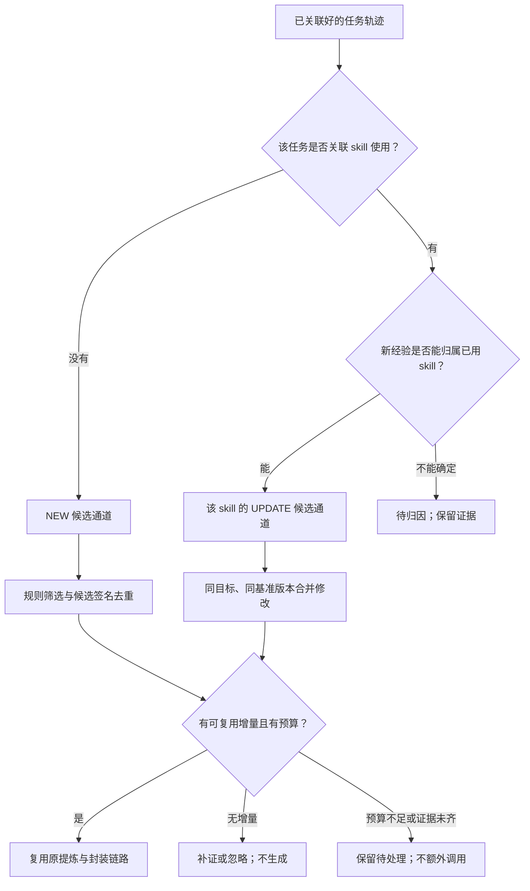
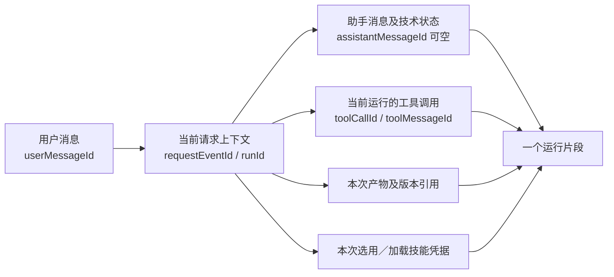
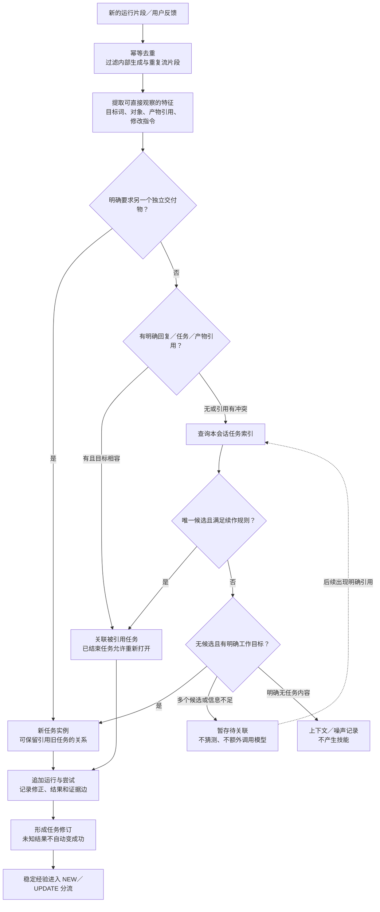
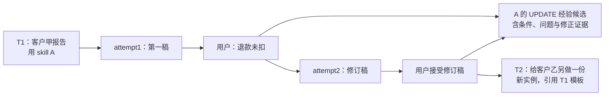

# 升级方案修订：规则构建任务轨迹，减少沉淀与模型调用

日期：2026-09-20｜轮次 014｜方案未实施。

本轮按用户新约束修订 013。**减少无效 skills、保留有效能力、每批沉淀更精简；模型调用尽可能减少且总预算不增加；优先索引与规则。** 这些是当前设计和交付目标，不能用未经验证的效果替代。本文明确 NEW／UPDATE 路由和 trace 小模块的算法。原技能格式、零新表、草稿隔离、发布权限与版本回执继续保留。

## 1. 先纠正上一版的两项设计

### 1.1 取消全库匹配来决定 NEW／UPDATE

用户的简化方向成立。任务已经带有使用过的 skill，更新目标不必再靠全库语义检索猜测。

- **该任务没有关联 skill：进入 NEW 候选通道。**
- **该任务使用过 skill：有与它相关的新经验时进入该 skill 的 UPDATE 候选通道。**
- 没有方法增量，只补证；无法确定技能归属，暂存；噪声不生成。
- 权限校验、读取已知目标技能及版本仍保留。这些是按 ID 查询，不是全库匹配。
- NEW 仍做同批／历史候选签名的本地去重，避免同一任务族不断产生重复草稿；这不会自动更新一个没有实际使用过的 skill。

**这里的“使用过”看整个任务轨迹。** 初稿使用 skill A，下一回合没再勾选但说“修改刚才的结果”，仍保留 A 的关联。另起独立目标则重新判断，不把整段 session 都贴上 A。



“进入 NEW 通道”不等于每段对话都生成新 skill。多个 skill 同时使用时，只把有依据的经验归给对应目标，不将一次纠正复制给所有技能。仅选择但加载失败时，先记录诊断，不将其当作该技能执行失败；版本不明时允许保留候选证据，正式发布前必须明确基准。

### 1.2 取消默认叠加的多次模型分析

013 的全库语义匹配、逐轨迹独立模型分析、常规多层合并会新增调用，不再作为默认方案。

首版默认：

1. trace 重建：本地索引与规则，0 次 LLM。
2. NEW／UPDATE 路由：按任务技能关联，0 次 LLM。
3. 去噪、候选召回、确定性去重：本地计算，0 次 LLM。
4. 经验提炼／工作流整理：只在必要时复用原有建模预算，按任务或目标 skill 批量处理。
5. 封装：沿用原 skill-creator 与规范检查，NEW／UPDATE 共用预算。
6. 不确定片段不自动追加“让模型判断一下”的调用；先暂存，或在已有的提炼请求内连同证据一起判断。

本版优先交付“规则构建轨迹＋受预算约束的技能提炼”。保留固定基准、局部经验和合并后更新的设计思想；不再承诺完整运行上一版逐轨迹多智能体 Trace2Skill 流程。具体执行与原方法存在差别时，按适配／受启发描述，不能只改名称。

## 2. trace 不是问答拼接：分两层构建

**运行片段**回答“一次用户请求实际经历了什么”；**任务轨迹**回答“为同一个目标，经过了哪些请求、尝试、失败和修正”。

原问答对仍保留，作为原始证据的一部分，不再直接等同一个任务。

### 2.1 先还原一次运行：按精确 ID 关联



当前源码的可用信息与最小补点：

| 信息 | 当前已经具备 | 需要补齐 |
| --- | --- | --- |
| 用户／助手消息 | Message 有 id、session、role、status、content | 将发送函数同时持有的消息 ID 与 requestEventId 一起保存 |
| 观察主记录 | Observation 有企业、用户、requestEventId、session、双消息 ID | 允许失败缺助手消息；增加运行证据引用、来源、sourceRevision |
| 工具 | 当前调用上下文有 toolActivities；toolActivity 中有 toolCallId、输入／输出／错误等 | 直接把当前上下文中的工具 ID 关联到本次请求，不用整 session 的时间范围猜 |
| 产物 | 有产物清单消费接口 | 保存其产物 ID／版本与运行关联；缺失关联时保持未知 |
| skill | 选择列表可得；加载函数能观察正文读取成功或失败 | 保存加载结果、实际来源／版本／哈希；选择与加载分开 |
| 回复／任务引用 | Message 模型没有通用 taskId／replyTo 外键 | 能取得明确引用时记录；没有就按下一层规则，不能假定字段已经存在 |

依据：[消息模型](D:/skillsgen-industry_track/enginering/insightweaver/packages/db/prisma/schema.prisma:1835)、[Observation](D:/skillsgen-industry_track/enginering/insightweaver/packages/db/prisma/schema.prisma:2403)、[请求与消息上下文](D:/skillsgen-industry_track/enginering/insightweaver/apps/api/src/zclaw/zclaw.service.ts:9847)、[当前运行工具容器](D:/skillsgen-industry_track/enginering/insightweaver/apps/api/src/zclaw/zclaw.service.ts:9979)、[工具写入](D:/skillsgen-industry_track/enginering/insightweaver/apps/api/src/zclaw/zclaw.service.ts:13506)。

关联事实优先放在扩展 Observation 中。不能只往 Message.rawPayload 填 trace 标签：当前更新／同步有整体替换 payload 的路径，新增标签可能被擦掉。若同步写入 rawPayload，需要统一保留命名空间。见 [消息更新](D:/skillsgen-industry_track/enginering/insightweaver/apps/api/src/zclaw/zclaw.service.ts:13443)、[历史同步](D:/skillsgen-industry_track/enginering/insightweaver/apps/api/src/zclaw/zclaw.service.ts:12979)。

以上精确运行关联针对新增采集；历史 Observation 的问答可以恢复，工具／产物若没有请求归属，只能保守关联或留空。本轮未验证 manifest 接口已具备可靠产物→请求映射，不能仅凭 session 一致就声称历史完整 trace 可恢复。

### 2.2 再关联业务任务：按明确规则归并

输入为新到运行片段和少量任务索引，不是每次把完整会话交给模型。



这里的任务边界是规则判断，不能把“词相似”当作已经理解目标。明确引用与目标仍冲突时暂存；不能图中走了索引分支就放松冲突检查。

## 3. 小模块算法：输入、索引、判定顺序与输出

以下规则与字段是拟议算法，不是当前源码已有能力。首版无需训练分类器或调用 embedding 服务。

### 3.1 建立四类轻量索引

| 索引 | key 示例 | 用途 |
| --- | --- | --- |
| 运行关联索引 | 企业、用户、requestEventId、runId | 去重消息回调、串工具和产物 |
| 精确引用索引 | messageId／artifactId → taskId | 找到用户正在修正的原任务，包含已结束任务 |
| 活跃任务索引 | 企业、用户、session → 未结束 task 摘要 | 限定候选范围，避免全库搜索 |
| 本地任务签名索引 | 动作词、对象标识、期间、交付物类型、约束词 | 召回可能相关任务；用于确定性重复检查的仅限高置信签名 |

结构化文件／产物标识优先于文件名；版本升级的同一产物共享对象标识，修改版另记版本。客户、月份和“万元／元”等改变含义的字段不能当噪声删除。

本地字典与规则只抽取可见特征。例如“汇总／分析／核对／生成”作为动作候选，“报告／表／邮件”作为交付物候选，显式文件引用作为对象。无法提取目标时保留原请求片段和“待判”，不能补造语义标签。

倒排索引或字符片段相似度可用于缩小候选，不单独决定任务合并。不能按 taskType＋inputType＋outputType 的粗签名将所有同类业务任务合并为一次发生。

### 3.2 规则按优先级执行，保存命中理由

| 优先级／规则 | 必要条件 | 动作 |
| --- | --- | --- |
| R0：运行去重 | 同一稳定来源／回调标识已处理 | 更新迟到状态或忽略重复，不新增业务次数 |
| R1：显式独立目标 | 用户明确“另做一份／单独生成”，且有独立对象或交付物 | 新 task；若引用旧结果，关系为 derivedFrom，而不是同任务 |
| R2：明确修订目标 | 指向已知消息／任务／产物，且没有独立新目标冲突 | 追加到该任务；完成后再纠正也可重开 |
| R3：唯一任务续作 | 本会话只有一个相容活跃候选，并有明确修正／补充／继续要求 | 追加该任务，保存规则关联置信等级 |
| R4：结构化对象续作 | 同一产物 lineage／明确对象引用，交付目标相容，且无新实例信号 | 追加该任务，记录输入扩展或产物新版 |
| R5：明确新请求 | 无可关联候选，有明确工作目标 | 建立 provisional task，目标暂用原请求，不默认已成功或值得生成 |
| R6：歧义 | 多任务相容、只有“再改一下”但不知改哪个、引用冲突、目标不足 | pending fragment；后续补关联，默认不新增模型请求 |

R3 的词表应区分反馈类型：“退款没扣，重新算”倾向纠错；“再加一列同比”可能是范围扩展；“以后都用这个语气”是偏好。不将所有“修改”标成原方案失败。

同一消息明确包含多个独立任务时可按显式列表／交付物拆分；不能可靠拆分时保留 pending。工具与产物只分给有引用依据的任务，不将整段工具输出复制给所有子任务。

### 3.3 Attempt 与任务结果的规则

一次用户发起的执行或返工形成一个 attempt；技术自动重试可作为该 attempt 下的多个 run，不增加业务任务频次。调用超时不结束整个任务。

追加关系至少区分：

- produced：运行产出了什么。
- corrects：后续反馈针对哪份结果指出问题。
- revises：新输出修订了哪份输出。
- extends：新增需求扩展了原任务。
- accepts：用户明确接受哪个产物／结果。
- derivedFrom：新任务引用旧成果，但仍是独立发生。
- unresolved：目标或归因尚不确定。

结果处理：

1. run.completed 仅记录技术完成。
2. “退款没扣”记录为用户报告的问题，保存对应原话与目标；没有验证就不能称已确定根因。
3. 后续输出是一个修订版本，不能仅因助手说“已修复”就确认成功。
4. 用户明确“这版可以交付”并能定位目标时，记录用户接受证据。
5. 无反馈暂存为未知；空闲时间只影响调度，不代表成功，不因隔天就强行另建任务。
6. 后续否定产生新 revision，旧候选相关证据需要复查；历史引用不被覆盖。

### 3.4 输出是一份可追溯的任务结构

每份 trace 修订包含：

```text
taskId / revision
目标：原始请求片段 + 已识别结构化条件
范围：企业、用户、会话引用
运行：request/run、user/assistant/tool/产物引用
尝试：attempt1、attempt2……
关系：修正、扩展、接受、产物版本
技能：任务历史选用／加载及实际版本
结果：技术状态、用户接受、业务结果及证据
关联依据：R2/R3 等规则、冲突和待判项
经验原料：关键错误片段、修正片段、结果依据
```

这些结构由 ID 与规则组装。跨任务泛化、自然语言写成可复用步骤仍可能需要模型，但那属于**后续已预算的提炼阶段**，不应伪装成 trace 模块零成本已经完成了语义理解。

本地准入负责排除确定噪声、检查目标与证据是否齐全、识别确定重复；它不声称只靠步骤数、关键词就证明经验有效。可复用性与规则泛化由原有预算内的提炼结果和候选审核判断，无法支持的结论退回待判。

为避免重复传输和长上下文，保留完整受控引用，在提炼时按规则取：最初目标、明确约束变化、被纠正的相关段落、修订结果、接受／拒绝依据、相关工具错误。遗漏的关键证据可按引用补取；超预算时延后，不静默截断关键错误后宣称完整。

## 4. 一个会话如何从问答对变成轨迹

以下均为示例，不是生产数据。

| 回合 | 内容 | 规则结果 |
| --- | --- | --- |
| 1 | 使用 skill A：“生成客户甲本季度分析报告。” → 第一稿 | 新任务 T1、attempt1，关联 A 的加载版本 |
| 2 | 未再选择 skill：“刚才退款没扣，请修正。” → 第二稿 | R2／R3，仍是 T1；反馈 corrects 第一稿，形成 attempt2 |
| 3 | “这版可以交付。” | accepts 第二稿，T1 得到用户接受证据；不是又一次需求 |
| 4 | “按这个模板，给客户乙另做一份。” | R1，新任务 T2；derivedFrom T1，不吞并为同一次需求 |
| 5 | 另一处场景：“把客户乙也加进刚才的对比表。” | 若引用明确且目标仍是那张对比表，则扩展原任务，不因出现乙就另建 |



结果是：三轮对话形成一条 T1 轨迹，需求频次为 1；得到一份可能用于 A 的更新经验，不生成三个新 skill。T2 是另一次需求，但是否 UPDATE 看 T2 自己是否使用技能，不单因它引用 T1 就继承 A。

工具 Bug、自言自语与重复事件分别保留诊断或去重结果；只有与业务任务有关且有可复用修正依据的部分进入经验，不把错误日志原样写成步骤。

## 5. 怎样实现“更少 skills，保留有效能力”

本版不靠简单抬高频次或只取前 K 个技能达到数量目标：

1. 同一目标的多次改稿先合成一个任务，减少伪高频与半成品候选。
2. 同任务族重复方法合并为一个候选，保留不同适用条件和有效分支。
3. 已用 skill 的经验流向它的更新，无增量只补证。
4. 同一 skill、同一基准版本的多个修改集中为一个更新候选，避免每次使用都生成版本。
5. 确定的噪声和重复候选在封装前排除，避免先生成大量文件再删。
6. 低置信度和超预算经验留在待处理集合，有原因与来源，不为了少产出直接丢弃。
7. 已正式采纳的有效技能和步骤受保护；草稿被拒不改正式技能，合并保留不冲突的有效方法。

“单次沉淀”按同一企业／用户、同一评估窗口与输入范围比较。除独立 NEW 数外，还列 UPDATE 包数，避免把所有新建改名为 UPDATE 假装总产物变少。内部 trace 修订和补证不计 skill 文件包，但仍显示其积压与存储量。

**对有重复／噪声的批次，设计目标是最终 NEW＋UPDATE 包总数下降，有效方法保留在更少产物中。** 原批次为零、或只有一个有效技能时，不能机械要求再少一个；也不能在原有多项不可合并有效能力上硬减数量。出现有效能力漏失就未达目标，不以少生成掩盖。

目前不能证明规则零漏判；首版应使每次排除、合并和待处理均可解释，形成可回查的漏失线索。这里是功能与目标约束，不新增研究实验计划或编造效果比例。

## 6. 模型调用至少不增加：用真实预算约束

### 6.1 默认调用结构

| 步骤 | 原方案／现有路径 | 本版 |
| --- | --- | --- |
| 运行关联 | 问答对为主 | 精确 ID 关联，0 LLM |
| 任务边界 | 拟加模型整理 | 索引与 R0—R6，0 LLM |
| 指纹与候选定位 | 当前逐问答模型指纹 | 首版使用本地签名；语义归一放入已有批量提炼槽位，不逐回合新增 |
| NEW／UPDATE | 013 拟全库匹配 | 任务使用凭据直接分流，0 LLM |
| 去重 | 可能需要模型比较 | 相同来源／签名／规则内容先本地去重；模糊项不强行合并 |
| 经验提炼／工作流 | 原已有模型建模 | 仅合格任务／目标 skill 批量进入；替换或复用该预算 |
| 封装／修复 | 原 skill-creator 多步 run | 同预算内运行，减少候选数量；修复和重试均算入 |
| 自进化 | 原来无这部分调用 | 使用原总额中节省／可调配的额度，不新增独立演化预算 |

任务关联模块的 0 次模型调用是可以通过实现直接约束的。全文方法泛化与正确性不能仅靠字符串规则保证，所以预算不足时要保留经验、延后提炼，不能假装已有可用 skill。

### 6.2 NEW 和 UPDATE 共用一份账

- 将调用次数与 token／费用上限分别记录，防“一次调用但输入变长很多”。
- 额度在每次底层模型请求前预留，结束后按实际 usage 对账；缓存命中不重复执行。
- hidden skill-creator 的内部回合、市场修复、格式重试与超时后仍完成的请求都算入，不能只数外层 job。
- 超时尚未确认终止，不释放全部预留给重试；否则旧请求和新请求会同时花费。
- 不通过更换昂贵模型、放大上下文或另开演化池规避“不增加”。
- 后台以现有周期预算为总约束；真正能够证明“相对原实际消耗不增加”，还需同口径旧 usage 记录。缺记录时，能承诺的是不提高既有批准上限，不能虚构旧值证明已节省。
- 如果某窗口原来对 skill 使用会话消耗为 0，且总预算中没有可用额度，则该窗口只采集并整理，不额外启动 UPDATE。可用额度出现后再合并提炼；不把延期说成已完成演化。

关键依赖是运行时需要暴露实际 usage 和底层轮次限额。只在 API 限 job 数不能保证模型资源上限，开发时必须一并接通预算控制。当前还未实施，不能宣称已经达成。

在线使用继续沿用原格式，但限制根 SKILL.md 的膨胀、采用简洁替换和辅助引用。不把全部历史经验追加进主文档，用“后台少调用、前台多 token”转移成本。在线总资源仍随实际任务量变化，同口径任务的注入预算应单独约束。

## 7. 如何接回当前工程

| 模块 | 本轮收敛后的职责 |
| --- | --- |
| Zclaw 会话与工具边界 | 从当前运行上下文保存精确关联；补加载、失败、取消、反馈；保证原 payload 更新不擦关联 |
| Observation | 复用采集与处理状态；追加运行引用和 sourceRevision，前任务噪声原因也在此保留 |
| AnalysisSnapshot | 复用为 task 修订；保存关联规则、attempt、证据和结果；零新表，唯一／并发／保留约束沿用013 |
| Processor／本地任务整理服务 | 运行拼接、索引、任务关联和本地签名；替代逐问答模型指纹路径，不叠加调用 |
| Scheduler／Evaluator／Gate | 按可学习任务修订调度；失败局部经验可达；直接 NEW／UPDATE；同任务计频不看session长度 |
| 原 AgentRuntime 建模接口 | 在预算内批量提炼／归一，将结果映射到封装契约；不默认启动逐轨迹多agent |
| Packaging／Candidate | 同目标同版本合并；固定证据、草稿独立；接受／拒绝 UPDATE 不误伤旧版 |
| 个人／组织库与加载 | 保留SKILL.md、辅助文件和市场信息；组织更新按权限；读取真实来源、版本与完整包 |

仍必须改掉13轮核实的 SUCCESS-only 调度、可变候选详情、字段白名单丢失、生成即覆盖等问题。取消全库检索不等于取消权限校验、版本检查和候选去重。

沿用 [013](013_comprehensive_upgrade_plan.md) 已核验的文件规范与发布边界：本轮不改变正式 skill 包协议，不重新建库，不直接操作数据库或代码。

## 8. 当前选择与未解决事项

- 用户已明确目标：产物更少、有效能力保留、调用尽量减少且至少不增加。
- 本轮采用的具体设计建议：规则优先 trace、按使用凭据分流、共享预算、批量提炼和合并。未声称用户逐条确认了规则词表、索引和字段。
- 明确撤回013中默认全库路由、多次独立提炼及按增量成本扩预算的优先路线。
- 规则覆盖不同业务表达的程度、生产 usage 与运行时限额、实际引用字段完整性仍未知；歧义处理采用可回查暂存，不能包装成完美理解。
- 本轮无新增运行实证发现；只有只读源码核对、算法方案、流程图和记忆更新，未开展业务开发。
