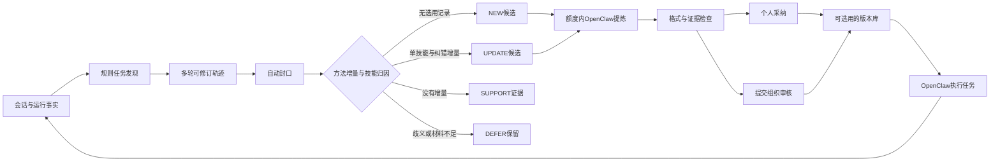

# 019：科研主线重读与独立 Skills Loop 原型

2026-09-23。受众：理解算法、试用原型、准备后续评估的项目团队。

## 本轮决定与保持不变的目标

用户明确改变实现载体：暂不把新链路直接嵌入 InsightWeaver，在 `enginering/demo` 构建独立完整闭环，底层使用开源 OpenClaw。此前018的KM v1集成是历史产物，不再作为当前 demo 的运行依赖。原业务工程本轮没有继续改动。

主线仍是：从企业任务经验中减少无效沉淀、保留有效方法、复用技能，并让使用后的纠错反哺技能。WWW Industry Track 是研究方向；可运行系统不等于已成立的论文贡献。当前交付是算法载体和观测工具，不是论文实验结果。

## 整体算法链路

| 阶段 | 输入与处理 | 输出及边界 |
| --- | --- | --- |
| 1. 采集执行事实 | 用户目标、agent输出、运行终态、所选skill的ID/版本/哈希 | 运行片段；技术失败与业务失败分开 |
| 2. 发现任务 | 规则排除寒暄、纯概念问答；明确目标创建任务；明确续作和纠错归回已有任务 | 可修订任务，而非问答对列表 |
| 3. 整理轨迹 | 保留初稿、失败、修订和反馈；运行结束后的稳定期自动封口 | 封口只是可处理，不自动标成成功；未知结果正常保留 |
| 4. 判断经验增量 | 先查方法信号，再依据实际选用记录分流；精确重复只记证据 | NEW / UPDATE / SUPPORT / DEFER，无全库语义路由调用 |
| 5. 受控提炼 | 冻结任务修订及原版本；先预留额度，再由OpenClaw总结完整技能包 | 每候选最多一次外层派发；模型仍可返回SUPPORT/DEFER |
| 6. 验证与入库 | 检查包路径、格式、来源是否变化、UPDATE是否丢文件；用户采纳或组织提审 | 隔离候选、个人版本、审核后的组织版本 |
| 7. 选用与演化 | 按权限展示技能，按完整文件包注入执行；把后续反馈归回任务 | 无增量不改版，有增量提出UPDATE；版本冲突不覆盖，可回滚 |

## 任务轨迹模块的实际规则

1. 同一请求的开始与完成更新同一个运行片段，保留任务的历史修订；重复requestId不再次执行。
2. “新任务／另外……”明确创建独立目标。
3. 明确引用目标存在且属于本人时，回到被引用任务；无法确认就保留未关联状态。
4. “继续／补充／不对／更正……”优先关联该会话最近的已结束任务片段；多个活跃任务存在歧义时不强并。
5. 对模型单一问题的“可以／不用”等反馈，只在能够匹配该提议时关联；不新增用户任务标记控件。
6. 其余具体请求建立新任务；寒暄、纯概念问答、没有清晰目标的片段保留但不直接生成。
7. 后续明确纠正可以重新打开已封口任务；旧候选标记来源过期，不能继续发布。原来用户接受的判断遇到新纠正撤回为UNKNOWN。

这些是透明启发式，不是通用语义理解器。隐含引用、交错任务和多技能归因仍可能漏判。运行失败片段不会删除；只有报错、没有交付材料的任务暂缓提炼，避免把系统Bug当成可复用经验。失败后有纠正和交付的完整路径仍能进入提炼。

## 自进化不是每次使用都重写

例如，“整理周报→扣除退款方法”生成v1；用v1整理新一期周报，没有新增方法时记录SUPPORT；随后用户纠正“跨期退款必须单列”，该消息归回使用v1的任务，产生以v1为基准的UPDATE。个人接受后形成v2。组织版本必须经过用户提交与组织审核，不能因为跨用户发生过类似任务就自动共享。

本版记录的是选用与上下文注入回执，未把“模型真的遵循了技能”当成已知事实。需要后续从工具调用／任务验收补充更强证据。

## 与原先嵌入路线的区别

| 原018路线 | 当前019载体 |
| --- | --- |
| InsightWeaver会话与原库 | 独立会话入口、JSONL导入、本地版本库 |
| KM v1/creator | 固定版本OpenClaw真实CLI |
| 原企业数据库和权限 | SQLite事务与演示角色；不是生产身份系统 |
| 远端写入后读回，非CAS | 本地事务内检查版本+哈希后发布 |
| 与业务系统联调才能试用 | 无业务服务依赖，可直接启动观测 |

既有零新业务表约束不会被本demo绕开：本轮没有给InsightWeaver加表。独立SQLite自建研究数据结构，不等于已满足未来回接企业系统的数据契约。技能包仍采用SKILL.md与辅助文件，保留市场信息结构；回接时还要验证原项目导入接口。

## 当前能力与尚未成立的结论

实现已覆盖发现、生成、采纳、审核、复用、更新、回滚、记录导出。透明规则无需LLM；重复、无增量、未知归因及超额候选不会不断重派。以上是代码行为，不是无效skills或成本下降的统计结论。

本版价值筛选仅为方法信号门槛与精确去重；**高频／重要任务排序、跨任务语义聚类尚未实现**。中文和英文词法覆盖有限，需要在后续真实任务上观察漏检。可选改进应优先使用局部索引、规则及离线统计，不默认新增模型评审链。

学习额度限制外层调用；OpenClaw内部可能有工具轮次和失败重试，因此不能宣称总LLM调用／tokens至少不增加。运行记录保留usage缺失状态，不把未知成本计为零。长会话超上限明确拒绝或暂缓，不静默裁剪。

没有开展用户研究、真实企业数据评估或论文实验；尚无真实无效率下降、有效能力保留、跨用户收益、成本不增加的证据。当前潜在研究对象仍是“可修订任务证据→有增量才沉淀→预算约束下持续演化”，不是复现Trace2Skill，也不因更换OpenClaw就获得新颖性。

## 产物与来源

- [独立demo及启动说明](../../enginering/demo/README.md)
- [实现约束](../../enginering/demo/SPEC.md)、[软件测试记录](../../enginering/demo/TEST.md)、[待办与限制](../../enginering/demo/TODOLIST.md)
- 研究约束来源：[014规则算法](014_rule_based_trace_and_budget.md)、[015贡献评估](015_industry_contribution_assessment.md)、[018历史记忆](../memory/018_2026-09-20_km_v1_full_loop.md)，以及本轮用户明确的载体改变。
- OpenClaw官方：[agent CLI](https://docs.openclaw.ai/cli/agent)、[Skills](https://docs.openclaw.ai/tools/skills)、[版本](https://github.com/openclaw/openclaw/releases)。文档与实际固定版本有差异，采用真实CLI测试校正配置。
