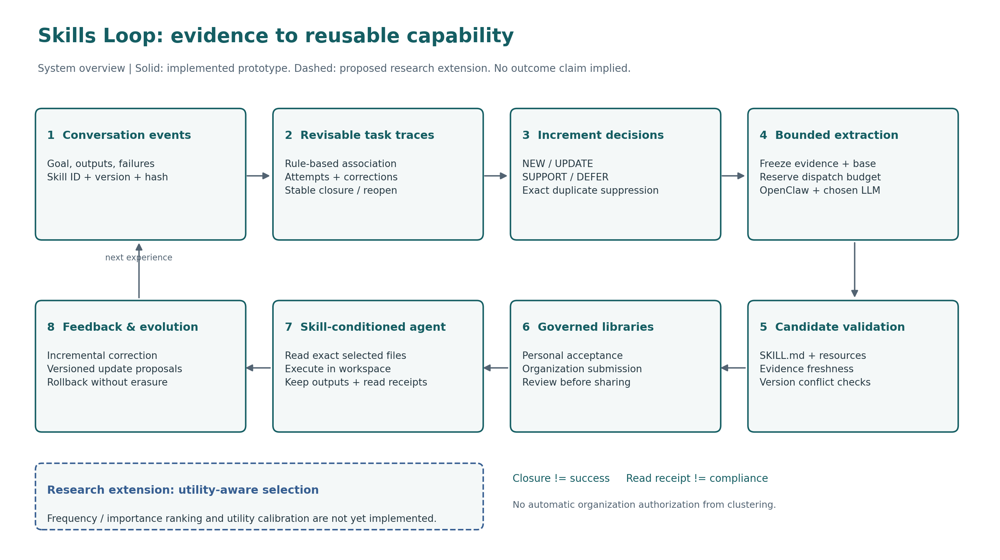
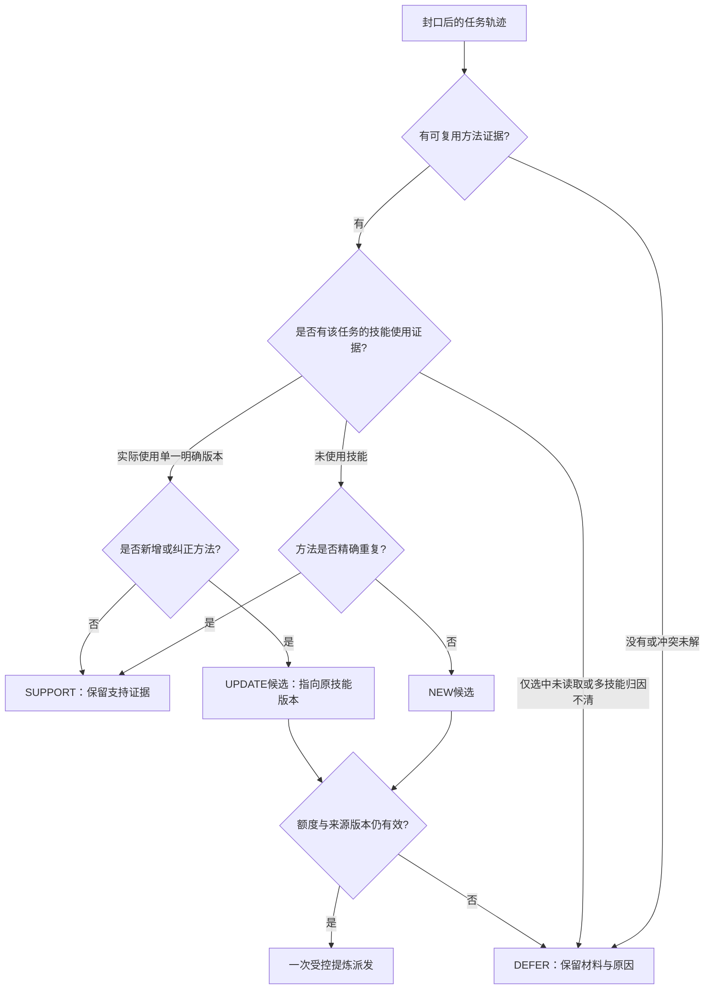
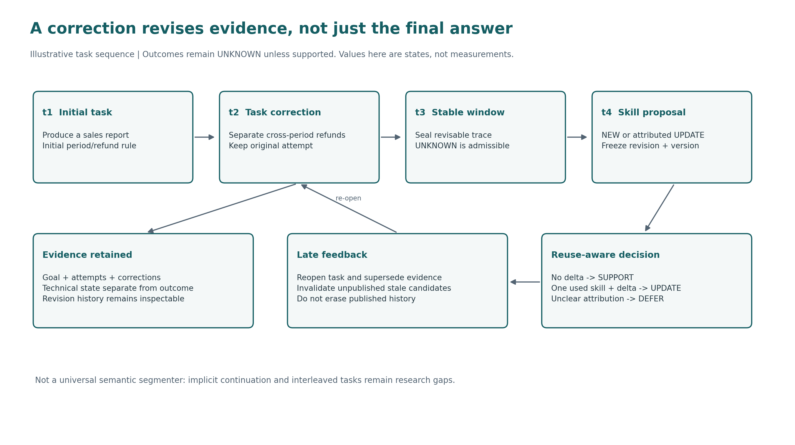
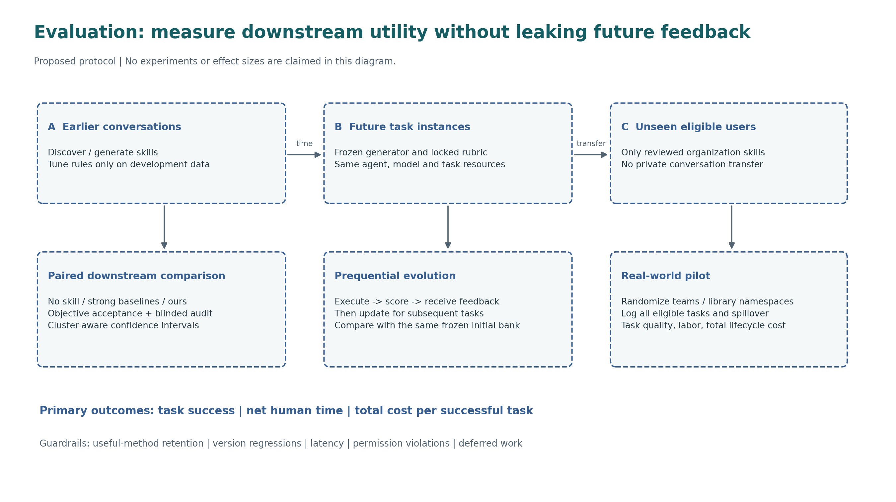

# 从会话修订到可复用能力：面向企业个性化智能体的技能涌现与持续演化

**英文工作题目：From Conversational Revisions to Reusable Skills: Personalized Skill Emergence and Evolution for Enterprise Agents**

**系统暂名：SkillsLoop。**名称用于行文，不声明命名独占。

2026-09-24｜论文概念文档 v1｜面向团队理解、研究讨论与后续写作

本文统一介绍问题、核心思想、完整闭环、潜在创新与差异，文末附E1、E2、E3实验计划和完整论文大纲。当前成果是独立原型与研究方案，尚无企业效果实验；文中“拟验证”不等于已获得结果。用户已有InsightWeaver企业Web应用，本阶段不接入生产。

## 一、这篇论文要讲什么

企业员工与Agent一起完成工作时，常常经历“提出目标—得到初稿—指出问题—补充规则—再次修改”。这些反复解释和纠正不仅产生一份交付物，也暴露了员工的工作方法、业务约束、常见失误和稳定偏好。下一次遇到相近任务时，如果Agent仍需从头理解，前一次协作积累的经验就没有真正转化为能力。

本项目研究如何把这些经历转化为员工可选择、可审查、可重复使用的技能，并在后续使用中持续修订。关键不在于尽可能多地生成技能，而在于判断：**这段会话是否包含可迁移的方法？它是新方法，还是对已有技能的纠正？现有证据是否足够支持沉淀？更新以后，未来任务是否更好？**

我们提出的工作假设是：以可修订的任务轨迹为学习单位，结合实际技能使用证据和经验增量筛选，可以减少半成品、重复内容和无增量更新进入技能库，在保留有效方法的前提下控制模型与人工成本，并改善员工后续任务。

这是一个待检验命题。论文应最终回答“在什么任务和约束下有效，收益来自哪个机制，付出了多少代价”，而不仅展示一个功能完整的系统。

### 概念摘要

企业会话中的多轮修订、失败尝试与缺失验收反馈，使直接按问答对提炼技能容易割裂任务、保留错误中间稿，并产生大量缺乏复用价值的候选。SkillsLoop面向企业内部个性化Agent，将会话组织为包含目标、尝试、纠正关系、结果证据与技能版本的可修订任务轨迹；通过规则与索引完成关联和去噪，再根据方法增量决定新建、更新、仅保留支持证据或延期处理。生成的技能经用户采纳进入个人库，经组织审核后才能跨成员复用。执行时记录实际技能读取、输出及反馈，使后续更新可追溯到具体使用版本。拟通过候选质量、未来任务个性化收益和持续演化三个实验，检验系统能否在保留有效方法的同时降低无效沉淀与生命周期资源负担，并分析其工业适用边界。

以上是概念摘要，未虚构实验数字；正式投稿摘要必须在获得结果后重写。

## 二、解决的具体问题

| 当前问题 | 为什么影响企业使用 | 本方案的处理方向 | 需要证明什么 |
| --- | --- | --- | --- |
| 候选多、有用的少 | 员工需要反复审查，库不断膨胀 | 先判断任务与方法增量，再调用生成模型 | 无效数量下降，同时有效方法不丢失 |
| 问答对割裂任务 | 初稿和纠正版被当作独立成功经验 | 保留同一目标下多次尝试及纠正关系 | 错误中间稿传播减少，而非仅摘要更长 |
| 没有明确“满意/完成” | 系统要么不学习，要么把沉默当成功 | 自动稳定封口，业务结果允许UNKNOWN | 无验收反馈时仍可沉淀，且不伪造成功 |
| 使用技能的对话被忽略 | 最有针对性的修订经验无法进入技能 | 绑定实际使用版本，区分支持与更新 | 新实例改善，旧能力不显著退化 |
| 通用Agent不理解个人方法 | 员工反复说明格式、流程、业务口径 | 抽取条件化工作方法与稳定偏好 | 收益超出简单偏好摘要和原始经验检索 |
| 每次都用模型分析和改写 | 学习成本可能超过后续节省 | 规则关联、精确去重、增量派发与资源记录 | 全生命周期成本可接受，不只外层次数少 |
| 个人经验直接变组织资产 | 容易混淆适用范围与共享授权 | 个人采纳、组织提审和审核分开 | 跨成员有效且边界清晰，而非默认共享 |

“十几个候选才有一个有用”目前来自用户观察，尚未形成抽样统计，不能直接写成论文实测比例。

## 三、核心概念：任务、轨迹、经验与技能

**任务**是员工试图达成的一个相对明确的目标，例如“根据本周销售明细生成按部门汇总的周报”，通常有输入、约束和期望交付物。一个会话可能包含多个任务；一个任务也可能跨多轮修订。只有存在可靠引用时，才把跨会话内容关联到同一任务。

**任务轨迹**记录目标如何被尝试、失败、修正和交付，而非简单拼接全文。它至少包含：目标与约束、按顺序排列的尝试、纠正针对哪个输出、工具及产物引用、使用过的技能版本、技术终态和业务结果。技术运行结束与业务验收成功分开记录。

**可复用经验**是“在某种条件下应采取什么步骤、遵守什么约束、避免什么错误”。它可以来自成功，也可以来自失败后的有效纠正。一次结果数值、个人身份信息或无法解释的Bug不是可迁移方法。

**Skill**是可执行的经验包：适用条件、操作步骤、检查项、失败规避和必要参考资源，以`SKILL.md`及辅助文件保存。它不等于会话摘要；摘要说明发生过什么，技能说明未来在什么条件下如何做。

**个性化**包含员工稳定的工作偏好，也包含角色/流程特定的方法。个人偏好不得覆盖组织强制规则。比如“先给结论”属于表达偏好，“跨期退款不得计入本期净收入”属于有适用范围的业务规则，两者需要分别验收。

### 哪些材料值得进入学习过程

| 材料 | 默认处理 | 原因 |
| --- | --- | --- |
| 有目标的任务及多轮纠正 | 保留并关联为轨迹 | 修订关系可能包含有效方法 |
| 用户没说满意，但已有交付 | 稳定后封口，结果UNKNOWN | 无明确验收不妨碍提炼候选 |
| 有条件、有依据的失败规避经验 | 保留条件与来源 | 失败可能比终稿更有信息 |
| 一般事实问答 | 判断是否形成可复用过程 | 不能把所有问句都当噪声，也不把所有答案都做成skill |
| 寒暄、无目标闲聊、模型自言自语 | 排除于技能生成，保留必要事件 | 缺乏任务与方法证据 |
| 网络超时等偶发基础设施错误 | 记录运行失败，通常不生成方法 | 不能将偶发现象泛化为业务规则；有验证的诊断方法另论 |
| 已用技能且无新方法的赞许 | SUPPORT | 增加支持证据，不为版本数反复改写 |
| 冲突反馈或多技能归因不清 | DEFER | 保留材料，避免把不确定性变成正式规则 |

## 四、完整链路：从员工会话到下一次更好的执行

**图1说明。**已有原型结构从执行事实进入任务整理、增量决策和技能治理，再回到消费。实线表示原型中已有的组件路径，虚线表示待实现的价值排序；不表示所有真实运行已经稳定，更不表示完成了生产部署。[可编辑SVG](../figures/020/01_lifecycle.svg)｜[PDF](../figures/020/01_lifecycle.pdf)

### 1. 采集完整交互事实

输入包括用户与助手消息、工具调用与结果、运行状态、交付物、选定技能及版本。保留原始顺序和稳定ID，避免只存“最后一问＋最后一答”。采集事实与解释分开：工具失败是事实，“任务没有价值”是待判断的解释。

### 2. 通过规则与索引重建任务

优先使用显式任务/请求/产物引用，其次处理明确续作、纠错与新目标表达；歧义不强行关联。首次提出目标建立任务，后续补充和修订形成同任务的新尝试。目标明显改变则创建另一个任务。

当运行终止并经过稳定期，或会话达到空闲条件时，任务可暂时封口。封口仅表示当前材料可以整理，不表示已经成功。迟到纠正重新打开任务，形成新的证据修订，防止旧候选在依据改变后继续被当作当前结论。

当前实现是词法规则与精确关联的原型；对隐含指代、交错任务和跨会话延续的理解仍需真实数据检验。不能称其已解决通用任务识别。

### 3. 判断“有无方法”以及“是否值得现在沉淀”

先排除没有方法信息的材料，再检查精确重复与新增条件。高频应按独立任务发生次数计算，不按同一任务纠正了几轮计算。重要性要结合业务影响和角色优先级，不能由出现频率替代。

重要/高频排序目前是待实现扩展：先从真实数据建立分布与业务标签，再决定是否需要额外排序模型。默认不为每段会话增加一次LLM价值评分。

### 4. 用实际使用关系分流，而非先做全库匹配

**图2：建议统一的候选决策语义。**正常进入提炼后，模型仍可返回SUPPORT/DEFER；四种状态不是四次模型调用。这里“一次派发”不等于一次底层HTTP请求。实际门槛和规则需要由E1检验，不能把状态名本身当算法创新。

### 5. 生成可审查的技能候选

只有通过筛选的NEW/UPDATE进入模型提炼。NEW抽象可复用方法，UPDATE只修订有证据支持的部分，并保留原包未涉及的文件与有效规则。候选应保留来源引用、适用范围、未知结果与版本依据，不能将半成品口吻改写成确定事实。

格式沿用现有`SKILL.md`结构及辅助材料，不把任务JSON当成技能正文。格式检查只能验证包是否可加载；真正有用与否需要后续独立任务评估。

### 6. 经用户选择进入个人或组织库

用户可采纳到个人库，也可提交组织审核。提交不等于发布；组织审核通过的版本才能供其他成员选用。企业内出现相似任务，不代表个人会话自动获得共享许可。

个人修订与组织版本分开管理，更新校验基准版本，保留历史与回滚能力。这些是实现可信闭环的必要工程能力，不宜单独作为学术原创性主张。

### 7. 在后续新任务中真实使用

员工从有权使用的库中选取技能，OpenClaw获得该版本文件包及路径，实际读取`SKILL.md`和必要附件后执行。系统记录“选中—提供文件—实际读取—行为遵循—业务成功”的证据层级。

前三层可从运行记录获得；后两层需要独立业务验收。模型声称“已按技能完成”不足以证明遵循。消费阶段是测量方法有没有价值的必要环节，不能只评生成技能的文本质量。

### 8. 使用后的经验回流

后续会话不再因为使用过技能而被忽略。无增量使用积累支持证据；出现新约束、失误原因或有效纠正时，定位到实际使用版本并形成更新候选。反馈冲突、来源不足或归因不清时暂缓，不能把用户最新一句话无条件当真。

“自进化”在产品中表示自动发现和提出更新，在科研中必须进一步证明更新后的新任务收益。它不等于每次使用都自动发布新版，更不意味着绕过个人采纳和组织审核。

## 五、一个贯穿全链路的例子

以下为说明性案例，不是从企业数据库抽取的实证样本。

| 阶段 | 员工与Agent发生什么 | 系统应学到什么 |
| --- | --- | --- |
| 首次任务 | 员工要求汇总销售周报 | 建立任务目标、输入和交付物 |
| 初稿失误 | Agent把所有退款都扣到本周 | 记录错误尝试，而非成功经验 |
| 用户纠正 | “先核对退款所属期，跨期退款单列” | 保留错误与纠正的关系及适用条件 |
| 再次输出 | Agent给出修正版，用户未明确确认 | 稳定后可封口；业务结果仍UNKNOWN |
| 技能候选 | 提炼核对期间、处理退款、汇总与检查步骤 | 生成方法，而非记住这周具体金额 |
| 下次复用 | 员工选择技能处理新一周明细 | 验证实际读取以及新任务是否正确 |
| 新反馈 | “其中撤销退款要按本部门规则另列” | 核验适用范围，形成有依据的UPDATE |
| 更新后 | 新实例检查新规则，同时检查原退款规则 | 不因新增规则破坏旧能力 |

图3展示的是机制示例而非测量结果。[SVG](../figures/020/02_trace_evolution.svg)｜[PDF](../figures/020/02_trace_evolution.pdf)

前后区别是：旧方式可能把“错误初稿、正确修订、重复解释”分别变成多个候选；新方式尝试将它们组织成一条可修订证据链，形成较少且适用条件清楚的方法。是否真的减少错误并保留能力，由E1而非例子本身证明。

## 六、研究创新性与差异性应如何表述

### 6.1 已有研究覆盖了哪些内容

| 近邻工作 | 已覆盖的主题 | 我们不能再单独称为创新的内容 | 需要具体比较的方向 |
| --- | --- | --- | --- |
| AutoSkill | 从交互经验形成、维护和复用技能，积累个性化能力 | 会话变技能、跨会话个性化、持续更新 | 修订关系、缺失验收和资源约束下，是否仍有增量 |
| Trace2Skill | 从执行轨迹归纳可迁移技能，创建或深化技能 | 轨迹提炼、失败规避、技能更新 | 流式会话修订与批量轨迹归纳在相同资源下的差异 |
| SkillClaw | 利用多用户经验推动共享技能演化 | 多用户学习、共享技能持续演化 | 私有证据与审批边界内的收益、维护负担和使用归因 |

来源：[AutoSkill v2](https://arxiv.org/abs/2603.01145v2)、[Trace2Skill v5](https://arxiv.org/abs/2603.25158v5)、[SkillClaw](https://arxiv.org/abs/2604.08377)。这些近邻已足以否定“自动个性化技能闭环本身是空白”的说法；本表不表示对其所有实现细节已做穷尽排除，也不擅自断言它们没有任何类似修订机制。

### 6.2 最值得检验的三项贡献

**C1：从静态对话片段转向可修订任务证据。**

困难是经验来源会随迟到反馈变化，初稿可能已失效，且没有明确成功标签。拟研究的机制是把目标、尝试、纠正关系和结果证据共同作为沉淀依据，使候选与来源修订保持一致。研究增量应体现为错误方法传播或有效方法丢失减少，而不只是实现一个任务状态机。

验证方式：完整会话强摘要、简单任务分段、不可重开与可重开对照。如果强摘要已同等处理，不能继续宣称复杂任务机制具有独立优势。

**C2：围绕方法增量分配学习资源，而非每段对话都生成。**

困难是冗余候选和无增量更新同时占用模型与人工。拟研究的机制是结合任务方法证据、实际使用版本和已有覆盖，决定新建、更新、支持或延期。资源分配与能力保留共同验收，不能靠全部拒绝或长期排队制造“低成本”。

验证方式：固定流量与固定总预算两套比较，报告无效数量、有效方法保留、后续任务收益和全部成本。规则过滤、去重、预算限额各自都是常见手段；只有具体机制及其可重复收益才可能支持方法贡献。

**C3：在个人适用范围和版本证据下检验持续改善。**

困难是个人习惯、组织规则和单次纠正容易混在一起，盲目更新可能损害原有能力。拟研究的机制是将反馈绑定到任务、适用条件和实际使用版本，以未来任务和旧能力检验更新，而非以“生成了新版本”作为成功。

验证方式：与个人偏好摘要、原始经验、冻结库及定期重写比较。这个贡献最容易与AutoSkill等重叠，当前应作为候选系统/实证贡献，待机制比较后再决定是否有独立算法创新。

### 6.3 本项目的独特定位，而非已证明的排他性

本项目强调的组合是：**真实员工会话中的不完整证据、无需额外完成按钮的轨迹修订、以少生成和少改写为目标的增量沉淀，以及个人采纳和组织审核边界内的持续复用。**这些要求来自同一个企业场景，彼此影响：过滤过严会漏掉方法，更新过勤会增加成本，共享过快会改变授权边界。

潜在独特价值在于给出这一组约束下可运行、可测量的解法与经验，而不是换一个技能格式或复刻Trace2Skill。当前可称“有明确差异化研究定位”，不能称“全网首次”“唯一方案”或“原创性已经成立”。

### 6.4 贡献—证据对应表

| 贡献候选 | 必须出现的可观察证据 | 不足以支持它的证据 |
| --- | --- | --- |
| C1可修订证据 | 相同来源和消费者下，纠正关系改变技能规则并改善新实例 | 流程图更完整、JSON字段更多 |
| C2增量学习 | 同预算/同流量下无效更少、有效方法保留、延期透明 | 只报告生成量和外层调用数下降 |
| C3个人演化 | 同用户未来任务受益，且更新相对冻结库有净收益 | 满意度上升、版本号增加、重复题分数提高 |
| 工业价值 | 真实工作负载、独立验收、审核维护计入后的净收益 | 单次控制技能通过或软件测试数量 |

## 七、为什么适合Industry方向，以及目前到哪一步

论文要把方法嵌入真实企业问题，解释输入噪声、权限、人工审核和成本约束如何影响设计，再展示可量化的任务收益与失败边界。WWW Industry强调实际问题、系统取舍和工业影响；并不意味着闭环做出来就足以投稿。既有要求与案例详见[020论文蓝图](020_paper_blueprint.md)。

| 层面 | 当前状态 | 写作边界 |
| --- | --- | --- |
| 企业场景 | 用户已有InsightWeaver；本阶段独立demo | 可写应用背景，不能写新增算法已上线 |
| 基础闭环 | 规则轨迹、候选分流、个人/组织治理、版本复用原型 | 可以介绍实现；通用关联和重要性排序未证实 |
| 真实模型 | qwen3.7-plus实际读取控制skill并使用其中信息 | 证明控制通路；CLI收尾超时尚待解决 |
| 资源控制 | 外层学习派发额度 | 不能等同内部HTTP/token硬预算 |
| 算法效果 | 尚无真实企业对照实验 | 无效减少、有效保留、成本下降均是目标 |
| 生产价值 | 尚无新增算法的部署试点 | 工时、采用率、跨成员收益不能预填 |

下一阶段的重点是取得真实会话与独立验收，将候选创新变成可被否定的实验。首批材料见[数据交接清单](021_data_handoff.md)；代码工作包与实施顺序见[021执行计划](021_execution_plan.md)。

---

## 附录A：实验计划E1、E2、E3

用户所写“EE2”在本文统一为E2。三个实验分别检验“沉淀质量、未来个性化收益、连续更新收益”，不要用一个综合分数替代三个问题。

图4为拟议评估设计，无实验数值。[SVG](../figures/020/03_evaluation.svg)｜[PDF](../figures/020/03_evaluation.pdf)

### E1：能否少生成无效技能，同时保留有效方法

**研究问题。**任务轨迹与增量筛选是否提供超过完整会话摘要的收益？减少产物是否只是漏掉了有效方法？

**所需输入。**完整真实会话，包含修订、失败、未知结果、无价值问答和未产生技能的流量；独立标注的有用方法参考集；用于消费的新实例。不能只导出已被系统选中的候选来源。

**对照。**G0原问答对链路；G1强完整会话摘要→skill；G2最简单规则任务分段→skill；O本方案。加入AutoSkill作为直接近邻时，区分官方复现与本地适配；Trace2Skill可作为进一步的轨迹归纳对照。

**执行步骤。**

1. 冻结早期生成区间、中间开发区间、后期测试区间；同一任务及衍生实例不跨集合。
2. 在看算法候选前标注方法、条件、纠正关系和未知项；两名业务评审先独立校准部分样本。
3. 各方法使用相同来源机会、生成模型、格式与审核标准；不强制候选数量相同，不截掉强基线纠正内容。
4. 在自然流量下统计真实资源；另做相同总资源上限比较，说明超预算排队与覆盖损失。
5. 对候选盲审，并用未见过的新实例验证方法实际有用；检查skill内容、读取和最终行为，分离错误位置。

**主要指标。**无效候选绝对数及比例；被有效技能覆盖的参考方法数/全部参考方法数；有效、无效和待评候选分别计数；重复率、审核分钟数、请求/tokens、失败重试和延期；后续任务成功率作为效用证据。

**消融。**完整轨迹/仅终稿；不可重开/可重开；同预算有无增量筛选。其他环节固定；联合修改不作单一机制归因。

**决策标准。**候选减少但有效方法丢失超过预设业务容忍范围，则目标未实现；完整摘要已等效，则缩小C1；只有增加预算才改善，则不支持C2资源主张。容忍范围在看正式结果前确定。

**交付。**候选与来源清单、方法覆盖矩阵、资源账本、主对照与消融表、失败案例及可复核运行记录。

### E2：个人技能是否改善员工未来任务

**研究问题。**收益来自可复用工作方法，还是简单记住偏好或增加上下文？

**所需输入。**同一员工较早的学习材料、较晚的独立任务、业务约束与个人偏好标签、输入附件、独立验收规则。只有一段历史对话时可构造受控新实例，但必须标明其不是自然未来流量。

**对照。**C0无技能；C1检索原始经验片段；C2简短个人偏好摘要；C3已批准组织通用技能（存在时）；C4自动个人技能。必要时加入专家技能参考，人工制作时间计成本。

**执行步骤。**

1. 仅用早期材料生成个人技能、偏好摘要和经验索引，不暴露未来答案与纠正。
2. 固定底层模型、工具、任务输入、超时和资源口径，各条件使用独立会话/工作区。
3. 先在明确给定适用技能下比较方法效用，再测真实用户选取流程；后者计入误选、未选和未读。
4. 客观字段/规则用独立程序验收，开放文本匿名盲评；业务正确性和偏好符合度分开。
5. 按用户、角色、任务族和历史稀疏程度报告收益与退化。组织约束不能被个人偏好覆盖。

**主要指标。**全部合格任务上的业务验收成功率；个性偏好遵循、重复说明次数、返工主动时间、全部模型成本；记录选中→读取→遵循→成功漏斗。没有操作计时就不声称客观节省工时。

**决策标准。**若个人偏好摘要已同等有效，不能将个性化收益归因于复杂skill机制；若只在人工选中时有效，应将结论限制在该条件；若平均改善但部分角色受损，必须报告并收窄适用范围。

**交付。**未来任务结果表、角色/用户分层结果、偏好与业务错误分解、成本与人工负担表。

### E3：持续演化是否比冻结技能更有价值

**研究问题。**反馈是否带来新任务收益，还是只让当前题目更熟、版本更多或旧能力退化？

**所需输入。**共同初始库、按时间排列的独立新任务、对应反馈依据与时点、旧能力审计集和适用范围变更信息。

**对照。**冻结库；固定周期重写；O增量更新。各分支从同一初始版本开始，使用隔离库和可比较执行资源。

**执行步骤。**

1. 在时刻t，各分支使用各自当前版本执行新任务。
2. 锁定输出、评分、成本与时间；评分答案不进入生成器。
3. 才释放该时刻允许的反馈并更新；超预算排队，记录等待。
4. 下一时刻使用新实例测试，另用保密旧能力集检查退化；不将审计评分回灌更新。
5. 连续覆盖多个真实更新机会，记录冲突、无增量赞许、错误反馈与拒绝更新。

历史纠正针对旧答案时，不能直接充当对新答案的反馈。共同回放必须限于独立核实的业务事实，并标为离线共同证据；真实交互反馈需评审当前输出。模拟用户必须单列。

**主要指标。**累计新任务成功、累计总成本、更新有效率、旧成功→新失败比例、旧失败→新成功、审核维护时间、延期和冲突。一次更新成功不等于长期演化有效。

**决策标准。**仅在已见修正例改善而新任务不改善，不支持泛化；新版收益被旧能力退化或维护成本抵消，则不支持净改善；若冻结库已等效，应限制更新频率而不是强制不断演化。

**交付。**版本—证据谱系、累计收益/成本曲线、退化矩阵、更新/拒绝/延期事件、典型正负案例。

### 三个实验共用的约束与启动顺序

- 先修复真实CLI收尾并补批次计量，再做数据审计和评分校准，然后E1→E2→E3。首轮可先取少量不同任务族定位机制，不据小样本宣称总体提升。
- 正式规模依基线成功率、最小业务有用效应和用户/任务族相关性确定；不能把一次技能的几十次消费算成几十次独立生成。
- 成本包括生成、消费、验证、更新、失败重试及人工审核；缓存计量单列，缺失费用为UNKNOWN，不能填0。
- 有效方法保留与成功率的非劣容忍度事先确定；不显著下降不等于已经证明不下降。报告合适的配对/聚类置信区间与方法随机性。
- E1—E3即使通过，仍需真实员工使用、净人工时间和运行周期证据才能有力支撑工业价值。组织试点/E4保留在[021计划](021_execution_plan.md)，不因本附录聚焦三实验而取消。

---

## 附录B：完整论文大纲

以下延续上一轮约8页正文的工作分配，**不是对未来投稿年份页数规则的承诺**。参考文献及附录按目标年份官方要求另核对。

### Title

**From Conversational Revisions to Reusable Skills: Personalized Skill Emergence and Evolution for Enterprise Agents**

题目突出材料特点、研究对象与使用场景；不提前承诺资源下降或性能领先。若最终只有离线结果，可在摘要明确prototype/offline evaluation；不在标题写“deployed at scale”。

### Abstract（约0.5页）

写清企业问题、核心机制、真实评估设置、主要收益与代价、适用边界。最终按“问题→方法→证据→结论”组织；当前以本文概念摘要为起点，结果部分保留待补。

### 1. Introduction（约0.8页）

1. 企业员工反复纠正Agent，却无法跨任务积累方法的动机。
2. 一个经去标识且有证据的真实案例：QA原子如何留下错误经验。
3. 缺失验收、持续修订与资源约束共同造成的挑战。
4. SkillsLoop核心思想与C1—C3贡献；仅保留实验能够支持的部分。

需要材料：真实问题发生分布、案例原始依据、人工/资源代价。

### 2. Industrial Setting and Problem Definition（约0.6页）

2.1 InsightWeaver背景、用户角色、任务入口与已有流程；独立研究环境与生产环境的边界。

2.2 定义task、attempt、trace、skill、经验增量、个人与组织范围。

2.3 目标与约束：方法保留、后续成功、总成本、版本退化与审核授权。把它们写成研究目标，不能把启发式描述成已求解最优算法。

### 3. Related Work（约0.5页）

3.1 会话经验与个性化技能：AutoSkill等。

3.2 轨迹归纳与经验记忆：Trace2Skill、AWM、ACE等，正式引用前核对版本。

3.3 技能演化与评估：SkillClaw及相关基准。比较具体机制与评估条件，不写未经证明的“现有工作均不支持”。

### 4. Method: Revisable Evidence and Incremental Skill Learning（约1.6页）

4.1 执行事实采集及来源关联。

4.2 任务关联、尝试/修订关系、UNKNOWN结果、封口与重开。

4.3 方法证据与增量判断，NEW/UPDATE/SUPPORT/DEFER路由。

4.4 受资源约束的提炼、技能包及版本依据，冲突/歧义退化处理。

配图：全链路图、轨迹修订图；算法框给出实际执行步骤和成本组成。未实现的重要性排序只能作为扩展，不能写入已评方法。

### 5. System Implementation and Operational Setting（约0.6页）

5.1 独立OpenClaw消费、完整包、实际读取与产物证据。

5.2 个人采纳、组织审核、版本检查和回滚。

5.3 原型工具范围、存储、延迟/失败/重试、权限与部署边界。未完成生产试点时不把本节写成已上线Deployment。

### 6. Evaluation（约2.5页）

6.1 真实数据与任务族、时间/用户拆分、来源与验收授权。

6.2 基线忠实性、固定消费者、模型版本、资源设置与统计方法。

6.3 **E1**：无效候选、有效方法保留、审核与模型成本。

6.4 **E2**：未来任务、个性化与角色差异、读取到成功漏斗。

6.5 **E3**：持续演化、冻结对照、新旧能力及累计成本。

6.6 机制消融、错误归因；区分生成错误、消费错误和验收问题。

6.7 员工试点与工业影响：如尚未开展，明确缺失，不用问卷或历史估计工时冒充。

结果图表：数据分布表；E1/E2主结果表；质量—总成本图；E3时间曲线与退化矩阵；实际人时/审核维护表。无数据不填模拟提升数字。

### 7. Discussion, Limitations and Lessons（约0.6页）

讨论稀疏反馈、任务歧义、偏好与政策冲突、角色受损、成本转移、授权和可披露性；解释何时应不生成、不更新或选择更简单的摘要方法。给出工业使用的可迁移经验以及未解决问题。

### 8. Conclusion（约0.3页）

只总结实际证据支持的方法与系统价值，不把“越用越好”愿景写成已经证明的普遍规律。

### References and Reproducibility Appendix

包含近邻版本、标注规范、验收rubric、基线提示与改动、数据字段映射、分集manifest、模型/工具配置、计费口径、失败记录和可公开替代材料。核心结论所需证据应留在正文，不能全部移入附录。
