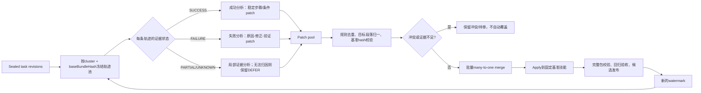

# 026：现有聚类／成功失败埋点与多轨迹 Patch 池的关系

日期：2026-09-24。面向团队核对“当前已有聚类合并和成功失败埋点，是否已经等价于 Trace2Skill 多轨迹 patch 池”的问题。

## 1. 直接结论

**可以加入多轨迹 patch 算法，而且首版不必新增物理表；但当前已有的聚类、成功／失败埋点并不等价于多轨迹 patch 池和层次 patch 合并。**

当前 InsightWeaver 已经具备三个重要前置条件：

1. `SkillEmergenceObservation` 记录单次观察及 `SUCCESS / PARTIAL / FAILURE / UNKNOWN`。
2. `SkillEmergenceAnalysisSnapshot` 保存可修订的 `task_revision`，并通过 `sourceObservationIds` 追溯来源。
3. `SkillEmergenceTaskCluster` 将相同 `methodSignature` 的任务归入任务聚类，`SkillEmergenceEvaluation` 依据频率、深度、价值和单次长任务门禁决定是否产生候选。

但它们当前承担的是“**任务发现、频率／价值门禁和候选调度**”，不是“**从多条轨迹分别提出 patch，再把 patch 合并到同一个基准技能**”。当前 `SkillTraceLearningService.discover()` 仍以一个 sealed `TaskTrace` 构建一个 `TraceLearningInput`，每个候选只携带该任务的 `taskRefs` 和 `workflow.traceEvidence`；这与 Trace2Skill 的逐轨迹 patch 池尚有一层算法缺口。

## 2. 为什么“聚类合并”不等于“Patch 合并”

两者合并的对象不同：

| 层次 | 当前实现 | 多轨迹 Patch 算法 |
| --- | --- | --- |
| 合并对象 | 任务观察／任务轨迹 | 每条轨迹对技能的局部修改建议 |
| 合并目的 | 判断是否属于同一任务族，累计频率和证据水位 | 去重、冲突处理、保留跨轨迹反复出现的可迁移方法 |
| 输入粒度 | `TaskTrace`、`methodSignature`、workflow | `patch_i = {target, change, condition, evidence, baseHash}` |
| 成功／失败作用 | 当前门禁主要只把 `SUCCESS` 计入频率、深度、价值 | 成功轨迹提取稳定方法；失败轨迹分析原因并提出规避 patch |
| 输出 | 一个候选和一次封装任务 | 一个合并后的 patch，再应用到固定基准技能 |
| 冲突语义 | 当前主要通过候选去重、版本水位和基准 hash 防重复 | 明确识别“同一目标的互斥规则”，保留冲突或转人工审核 |

因此，当前的 `TaskCluster` 是“**哪些轨迹可以一起考虑**”；Patch Pool 是“**这些轨迹分别对技能提出了什么可验证修改**”。前者是后者的输入组织层，不能直接替代后者。

## 3. 当前成功／失败埋点覆盖到什么程度

### 已有能力

- 常量层已经定义 `SUCCESS / PARTIAL / FAILURE / UNKNOWN`。
- 观察表保存 outcome、运行状态、工具引用、消息长度和证据引用。
- 任务轨迹保存 `verification`、`executionUnresolved`、修订号和来源观察 ID。
- 技术失败、取消、中断和未知状态可以被保留，不应自动当作业务成功。
- 当前门禁明确只用 `SUCCESS` 进入频率、深度和价值统计，避免把所有日志都当成有效证据。

### 尚不足以直接作为 Trace2Skill 失败分析输入

1. `FAILURE` 目前是结果标签，不是“失败原因已经定位”的因果证据。
2. `UNKNOWN` 和 `PARTIAL` 尚没有统一的局部可学习片段契约。
3. 成功主要说明运行／对话达到记录条件，不自动说明业务结果正确；当前代码测试也明确“技术完成不等于业务成功”。
4. 失败轨迹没有单独经过“检查产物、对照目标、验证修正”的 patch 生成阶段。
5. 当前 `buildTraceLearningInput()` 对一个任务轨迹做整体输入构造和精确方法签名去重，没有生成 `patch_1 … patch_n` 再合并。

所以可以说“已有成功／失败观测层”，不能说“已有 Trace2Skill 式成功／失败 patch 分析层”。

## 4. 现有代码到 Patch Pool 的最小映射

首版可以复用现有对象，不新增物理表：

| 现有对象 | 保留职责 | 增加的逻辑字段／JSON内容 |
| --- | --- | --- |
| `SkillEmergenceObservation` | 单次运行事实和 outcome | 不改成功／失败含义；补充可选的业务验收引用和 failureEvidence 状态 |
| `SkillEmergenceAnalysisSnapshot` | 当前任务修订和冻结证据 | `task_revision` 内继续保存完整轨迹；作为 patch 来源，不直接当 patch |
| `SkillEmergenceTaskCluster` | 任务族和基准范围 | `workflow.patchPoolKey`、基准技能 hash、可参与合并的 evidence watermark |
| `SkillEmergenceCandidate.inputSnapshot` | 候选冻结输入 | `traceRefs[]`、`patches[]`、`mergePolicy`、`conflicts[]`、`baseBundleHash` |
| `SkillEmergencePackagingJob` | 可恢复的封装／合并作业 | 阶段化记录 `PROPOSE → FILTER → MERGE → APPLY → VALIDATE`，并把每阶段结果放入现有作业结果或候选快照 |
| `SkillEmergenceEvaluation` | 门禁和决策审计 | 增加 patch 数量、可解释失败数、冲突数、合并后变更数等 evidenceSnapshot 字段 |
| `SkillEmergenceUserProgress` | 每用户水位 | 记录已合并到哪个 observation watermark，避免同一证据重复进入 patch 池 |

这些是逻辑扩展，不代表可以直接写代码。JSON 快照需要事务锁、幂等键和版本校验，否则并发周期可能覆盖 patch 或重复计费。

## 5. 建议的新增算法链路

每个 patch 至少包含：`targetPath`、`change`、`applicability`、`evidenceRefs`、`outcomeClass`、`baseBundleHash`、`confidence`。失败 patch 只有在能够说明“发生了什么、为什么、怎样修正、如何验证”时才进入可应用池；只有报错日志不能直接写成规避规则。

## 6. 两种实现强度和资源影响

### A. Trace2Skill 机制对齐版

对一个轨迹池中的每条轨迹分别提出 patch，再进行层次 merge，最后 apply 到固定技能。它最接近论文，适合论文方法对照，但会新增分析和 merge 调用；在没有缓存、批处理和预算抵扣时，模型资源大概率增加。

### B. 预算兼容版

先用现有规则筛选和精确去重，把同一 cluster 的多条轨迹一次性批量送入一个受控提炼请求，同时要求模型返回结构化 `patches[]` 和合并结果；本地完成 patch 去重、冲突检查和基准 hash 校验。它可以拥有“逻辑 patch pool”，但不是 Trace2Skill 的严格逐轨迹并行实现，论文中应称“预算约束下的批量轨迹 patch 归纳”。

结合项目“无效 skills 减少、总沉淀减少、模型调用至少不增加”的目标，建议先实现 B，再把 A 作为可选研究开关和对照。不能同时宣称 B 已经等价复现 Trace2Skill。

## 7. 对当前系统的准确定位

- **InsightWeaver 原链路：** 已有“观察 → 可修订任务 → 任务聚类 → 成功门禁 → 候选封装”的前半段；失败和未知被记录，但没有完整失败 patch 归因与多轨迹 patch merge。
- **独立 OpenClaw demo：** 目前没有 InsightWeaver 的任务聚类表和跨任务 patch 池，只有单任务轨迹、NEW/UPDATE/SUPPORT 分流和版本封装；不能把 demo 的单候选流程描述成已有聚类合并。
- **最合理的升级说法：** 将 InsightWeaver 的现有 cluster 作为轨迹池索引，把候选快照升级为 patch pool 和 merge job；这样是在既有闭环上补齐 Trace2Skill 缺失的算法中间层，而不是重新造一套采集和存储系统。

## 8. 尚未成立的结论

加入 patch pool 后，理论上可以减少“每条轨迹各生成一个完整 skill”的重复产物，但实际总调用、token、失败重试和合并成本可能上升。只有在真实数据上同时记录 patch 数、最终技能数、有效保留率和完整模型账单，才能判断是否达到项目承诺。

## 依据

- [Trace2Skill v5](https://arxiv.org/html/2603.25158v5#S2)
- [任务轨迹与学习输入源码](../../enginering/insightweaver/apps/api/src/skill-analytics/skill-task-trace.ts)
- [Trace learning 源码](../../enginering/insightweaver/apps/api/src/skill-emergence/skill-trace-learning.service.ts)
- [Patch 前的现有闭环边界](019_standalone_algorithm_and_demo.md)
