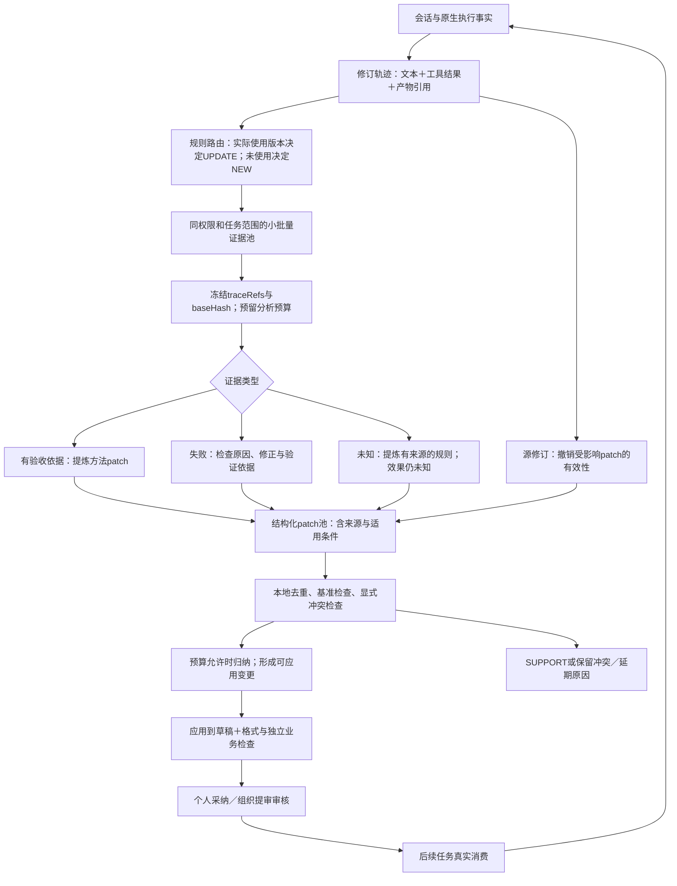

# 030：独立Demo与Trace2Skill的差距、升级价值和实施计划

日期：2026-09-24。性质：源码核查与升级建议，尚未实施。范围：`enginering/demo`，不接入InsightWeaver生产，不改变现有技能入库和组织审批规则。

## 1. 决策

**建议升级，优先补齐“证据完整性→多轨迹方法patch→合并与受控应用”的算法中间层。**现有闭环能够真实生成、封装、注册和使用技能，不必推倒；不足在于一条轨迹直接生成完整包，缺少跨实例归纳和逐条依据。升级对减少重复候选、保存失败修正方法、解释更新内容有直接研究价值。

**不建议默认完整照搬Trace2Skill，也不以更接近它作为验收目标。**本项目处理开放企业会话，结果常未知、证据会被修订、权限和预算受约束。正确目标是：利用更多独立任务证据，形成更少而不丢有效方法的候选，并使方法更新可核查。是否有效仍需对照验证。

对于功能展示，当前demo已具备可运行闭环，这次升级不是“终于能用”；对于研究多轨迹归纳和失败驱动演化，当前缺失的中间层确有补齐必要。它能提供研究载体，但增加patch池不自动成为本项目原创贡献。

## 2. 对026报告的复核和补充

026正确区分了任务聚类和patch合并，也正确指出失败标签不等于失败原因。其表复用方案主要面向InsightWeaver，不能原样用于独立demo。demo使用SQLite的`records / events / runs`，没有026中列举的TaskCluster、PackagingJob等实体表。

本计划作五项补充：

1. **当前学习输入不足。**原生运行记录有工具调用和产物，但`core.py::_record`的compact轨迹未带入完整工具结果与产物依赖；`discover()`主要拼用户/助手文本。必须先让分析器能按引用读取真实证据。
2. **不能只补FAILURE分支。**缺少终稿或只有失败的任务目前容易在NO_DELIVERED_MATERIAL处延期；已经用过技能但用户未明确纠正，也可能进入SUPPORT。要允许有独立失败证据的任务进入诊断，不能把“无纠正词”当成“无学习价值”。
3. **批量一次输出patch和最终包，不等于可执行的patch机制。**若宿主没有实际检查、合并和应用patch，patch JSON只是说明文字。升级必须让最终文件由被接纳的变更产生，并保存对应关系。
4. **不能用一个最大时间水位覆盖全部处理状态。**同一批中的延期、冲突、失败或过期材料不能因为其他材料成功而丢失。按任务修订及patch分别登记已处理/待处理状态。
5. **保留未知和少见但重要的方法。**UNKNOWN正常进入证据整理和候选提炼；没有业务成功证明时，只能提出来源明确的方法候选，不能声称已验证有效。不能把重复次数设为所有候选的硬门槛。

依据：[026报告](026_multitrace_patch_pool_assessment.md)、[core.py](../../enginering/demo/skilldemo/core.py)、[store.py](../../enginering/demo/skilldemo/store.py)、[live.py](../../enginering/demo/skilldemo/live.py)。

## 3. 与论文算法的实际差距

Trace2Skill v5固定模型参数和起始技能，收集带正确性结果的执行轨迹；成功分析和可检查产物的失败分析分别提出局部patch，再层次合并、受保护应用，最后在独立任务上评估。失败分析不能解释的材料不进入可应用patch。它不需要模型微调。[原文§2](https://arxiv.org/html/2603.25158v5#S2)

官方仓库公开了成功/失败分析与并行技能演化入口、技能目录及评测流程。本轮核对论文方法及仓库README，未对全部作者源码逐行审计，因此下面区分“论文机制适配”与“严格复现”。[官方仓库](https://github.com/Qwen-Applications/Trace2Skill)

| 环节 | 当前独立demo | 与论文机制的差距 | 建议 |
| --- | --- | --- | --- |
| 输入集合 | 一条任务轨迹对应一个候选 | 缺少共同基准下的独立任务集合 | 增加有范围约束的轨迹池 |
| 正确性依据 | 技术状态、UNKNOWN、有限用户验收 | 缺独立业务判定 | 增加判定依据和范围；保留未知 |
| 失败利用 | 全轨迹文本进入生成提示 | 无独立诊断和修正验证产物 | 保存失败→原因→修正→验证链 |
| 局部提议 | 模型直接写整个技能包 | 没有可独立审计的patch对象 | 先输出方法变更及来源 |
| 多轨迹合并 | 文本精确签名去重 | 缺跨patch归纳、条件冲突处理 | 小批量合并；必要时再做层次合并 |
| 应用控制 | 旧路径保留、源hash和版本检查 | 缺局部变更的实际应用约束 | 校验patch后应用到冻结草稿 |
| 泛化验证 | 单个构造案例真实功能验收 | 缺独立新实例、旧能力对照 | 接入独立验收夹具和研究回放 |

这张表不表示demo所有方面落后：迟到会话修订、个人采纳、组织审批和实际读取归因是本项目已有的场景能力。它们服务于企业闭环；不能用来代替上表缺失的学习机制。

## 4. 升级目标与保留范围

### 4.1 可交付的能力目标

- 多个独立任务能形成一个候选，而不是每个任务都生成完整技能。不同任务族、适用范围不兼容时仍分开。
- 每条方法修改都可定位到任务修订、消息/工具/产物，以及目标技能基准。
- 成功、失败和UNKNOWN均能被记录和处理；模型的原因猜测与经验证原因分开。
- 无增量时保留SUPPORT；有冲突时保留待处理证据；相同已接纳证据不重复付费分析。
- UPDATE保留不受影响内容；源修订或基准变化时，旧patch不能直接应用。
- 全过程仍产出原格式SKILL.md、附件和`.skill`包；个人采纳、组织提审审核、真实OpenClaw消费继续复用。

### 4.2 待验证的收益目标

**无效skills减少、有效方法保留、同批总候选减少、总模型资源尽量不增加**继续作为验收目标，不能提前写成结果。还要检查延迟、被延期方法、审核时间和旧能力退化，避免靠不处理材料取得表面改善。

收益只有在固定来源流量及时间窗、相同消费者与验收口径下才可比较。不存在“一加patch池就必然更省、更好”的保证。频繁变更且缺少可验证证据的任务，也可能没有升级收益。

## 5. 建议的目标链路



图中均为拟议升级；分析角色不是新增微调模型，也不意味着每个方框单独调用一次LLM。各阶段需要真实中间产物，但可以共享一次必要生成过程。

## 6. 如何冻结轨迹池，避免错误合并

**UPDATE先做。**池键建议为`owner + skillId + baseHash + applicabilityScope`。进入的轨迹必须真实使用该基准版本，来源权限可访问；同一任务多个修订只取当前有效修订，不当作多个独立样本。不把原本用v1跑出的轨迹改标签后称为v2轨迹。基准变动时关闭旧池，未处理材料保留；需要迁移的patch重新核验，不能静默重放。

**NEW后做。**没有使用技能的任务继续NEW。用输入/输出类型、业务对象、工具或流程标识和规范化目标构造保守的taskFamilyKey，不依赖全库语义匹配。主题相同不代表方法相同，无法确认同族就保持分开。NEW池可以直接编译为新技能；它不同于论文的共同初始草稿演化，不称严格对齐。

首版仅合并同一成员有权使用的原始材料。多个人使用同一个组织技能，不意味着可以合并他们的私有会话。跨成员经验先按原流程形成获批准的可共享方法，再考虑后续研究；不以聚类授权。

**建议首轮配置而非固定最优参数：**常规池最少2个独立任务、最多8个任务；同时有输入token上限和24小时最长等待。长材料拆分或明确延期，不静默截掉关键证据。到期单例仍走正常候选处理；明确高影响纠正可提前处理。没有可靠重要性标签时不能凭模型猜测强制优先；先按明确纠错与等待时长排序。批处理换取的等待时间必须展示在研究账本中，不在会话界面增加标记按钮。

## 7. Patch必须是什么，而不只是一个JSON名字

建议首版字段如下；这是本项目拟议契约，不是照录作者schema：

```text
patchId, poolId, action, targetPath, targetAnchor, beforeHash
baseSkillId, baseHash, applicability, proposedChange
evidenceRefs[{taskId, revision, traceHash, eventId, artifactHash}]
evidenceType: OBSERVED | USER_RULE | MODEL_HYPOTHESIS
diagnosis: {symptom, cause, correction, validationRefs, status}
status: PROPOSED | ACCEPTED | CONFLICT | DEFERRED | STALE
```

UNKNOWN轨迹也能提供用户明确业务规则，因此可形成USER_RULE候选，不强制等待用户说满意。没有复核的模型失败解释标为MODEL_HYPOTHESIS，不自动写成“已发生且已证实”的经验。结果状态和方法来源类型是两个维度。

应用应使用明确路径、基准内容hash和可核验锚点；UPDATE首版支持新增文件、精确替换片段和追加指定段落，不默认删除原文件。锚点不唯一或原内容改变，保留冲突。不能把修改范围伪装成整包覆盖后再补一份说明。规则只能检查显式条件/键值冲突，不能宣称检测任意自然语言矛盾。

相同方法精确去重时合并evidenceRefs，不能丢失不同来源；条件不同的规则不能仅按文本相似合并。一次证据修订使依赖它的patch过期；其他独立支持仍有效的条目需重新核对适用范围后保留。已经发布的旧版本保留历史并标记证据过期，不悄悄篡改历史，也不绕过用户自动发布修正版。

## 8. 模型资源怎么控制

设原来有n个实际进入生成的轨迹，每个生成完整包；升级有k个池。理想情况下k<n，但资源账必须比较：

`旧开销 = 所有单轨迹生成与验证开销`

`新开销 = 证据整理 + patch提议 + 必要归纳 + 失败诊断 + 封装验证 + 重试`

新派发少，不代表新开销少。更长上下文、Agent多轮工具循环和额外诊断可能抵消收益。并行主要缩短等待，不会自动减少总tokens。还应将后续消费、人工审核和延期损失计入完整比较。

建议提供三个明确命名的模式：

| 模式 | 用途 | 默认行为 |
| --- | --- | --- |
| `legacy_single_trace` | 保留当前基线、排障回退 | 冻结原算法版本，独立数据目录 |
| `budgeted_patch_pool` | 推荐产品研究原型 | 批内逐轨迹来源记录；尽量一次必要分析；确定性检查/应用；有剩余额度才额外归纳或诊断 |
| `trace2skill_aligned` | 可选论文机制对照 | 独立逐轨迹分析及层次合并；单独实验预算和结果记录，不默认在线开启 |

预算模式的批内分析不具备论文逐轨迹独立分析的同等性质，不能冒称严格复现。对于简单可结构化patch，本地归并即可；需要语义归纳时可以在预算内增加阶段，但不承诺任何情况下只用一次请求。若最终只是一次批量prompt直接重写，仍需与同输入强批量摘要比较，不能据名字认定优势。

**先做内部计量，再做节省承诺。**复用OpenClaw，核实每次provider请求的输入、输出、缓存tokens、失败与重试是否可计量，验证能否限制请求次数与执行步数。只有“看见已花多少”不构成硬预算；不支持请求前限制时明确标为软预算，不在UI或论文宣称硬上限。诊断/合并/封装都从同一窗口预算扣除，不另开隐藏预算。

缓存键至少包含任务修订hash、基准技能hash、模型配置、分析提示版本和工具/验收版本。缓存和水位按项提交，失败不能被标成已消费；恢复时先核对已有运行回执，不自动重新支付同一次分析。

## 9. 独立demo的具体改动范围

首版可复用现有三张物理表。`records`增加逻辑kind或嵌套结构，避免把026的ORM表名照搬到demo。JSON复用不等于不需要契约、并发和恢复设计；规模大后再评估索引与规范化。

| 位置 | 拟改动 | 交付物 |
| --- | --- | --- |
| `live.py` | 导出可见工具调用/结果及产物定位；保留成功/失败/缺失回执 | 受控证据读取接口，不采集隐藏推理 |
| `core.py::_record/tick` | 轨迹携带run/artifact引用；业务结果与技术状态分离 | 可修订EvidenceBundle；失败/UNKNOWN可整理 |
| `core.py::discover` | 从单轨迹候选改为保守聚池；改变“无纠正必SUPPORT”前提 | PoolSnapshot、traceRefs和逐项待处理状态 |
| 新增`evidence.py / patching.py` | 构造证据、patch校验/去重/冲突/应用 | 来源可追溯的实际方法变更 |
| 新增`pooling.py` | owner/版本/范围分池、冻结与缓存失效 | 可重复运行的批次manifest |
| `runtime.py` | 分析/归纳角色与预算计量，继续用OpenClaw | 中间输出、真实请求账本与错误分类 |
| `bootstrap.py`及creator | 继续负责格式、脚本与最终封装 | 原格式完整包，不把诊断替换成creator调用 |
| `core.py::_current/generate/accept` | 校验全部traceRefs；草稿应用与基准并发保护 | 任一关键来源失效均可阻止过期采纳 |
| `store.py` | 复用records保存pool/patch/evaluation；runs记运行，events记阶段 | schemaVersion、幂等和恢复契约 |
| 管理视图/研究导出 | 展示来源、合并前后、冲突和预算 | 不新增会话中满意/失败标记操作 |

原始工具输出不必全文塞进每次提示；先传可审计引用和必要摘要，分析器按需读取，读取成本也入账。涉及企业数据时按既定授权和去标识范围处理。

## 10. 分阶段计划与验收目标

### P0：冻结基线并打通证据与资源账本

保留024真实案例和旧算法配置，在独立数据目录冻结当前模式。补齐run→task revision→tool result/artifact→outcome evidence关系；区分业务通过、业务失败、部分完成、未知以及基础设施故障。预算先验证计量和可限制能力。

验收：同一失败能定位到原始结果和产物；UNKNOWN不被改成成功；每个模型请求可归属阶段，缺失计量明确UNKNOWN。产物为EvidenceBundle契约、成本清单、基线manifest。完成这些再进入多轨迹生成。

### P1：先实现UPDATE轨迹池与确定性patch应用

先处理同一成员、同一实际使用skill及baseHash的轨迹。增加冻结池、逐项来源、patch格式、冲突和本地应用。复用现有skill-creator封装和原采纳流程。不要一开始同时解决开放任务聚类。

验收：至少两个独立任务贡献互补规则到同一候选；相同规则不重复；一个迟到纠正使相关patch失效；不同基准/不同成员材料不误合并；终态包由已接纳patch得到；旧版仍可追溯和回滚。

### P2：补失败诊断和UNKNOWN方法提炼

对可检查的业务失败读取相应产物，记录原因假设、修改依据和可执行验证。有证据的成功提炼稳定步骤；UNKNOWN中的明确用户规则可形成候选，效果仍未知。无可解释方法的基础设施故障只记运行问题。

验收：失败修正方法实际进入候选，并在未见输入上按独立参考检查；无法解释的失败不被包装成确定规避规则；未知来源不会被整批排除。首批诊断只用现有授权案例，不自动回放真实企业系统。

### P3：扩展NEW聚池与小批量归纳

使用保守任务族键，处理重复、互补、条件例外和冲突；任务族不确定时不合并。加入单例到期处理、缓存复用、待处理清单和有额度的语义归纳。所有成员仍先形成个人候选，再走原组织提交审核。

验收：在“同族重复＋互补＋冲突＋单例＋无价值”混合材料中，输出数量符合各组语义而非强制全部合一；被保留/延期/拒绝的每条有效方法都有记录。实际费用和覆盖不达目标时保留旧模式，不宣称完成减量收益。

### P4：研究对照与是否继续的决策

对相同已冻结证据池比较：旧单轨迹流程；同输入强批量摘要→完整skill；预算patch池。仅在有可靠结果标签的子集上增加Trace2Skill机制对齐模式；UNKNOWN企业子集单列，不用伪造标签补齐。

首轮建议4个可独立验收的任务族、每族3-6条来源任务，用于定位机制，不用于估计全企业收益。每族另备未见消费实例和旧能力例子；同一技能的多次消费不是多个独立生成样本。预算上限在执行前按可用额度锁定，本轮不启动付费运行。

继续条件：patch真正影响产物，减少错误/重复规则且未漏掉关键方法，在限定总资源下有相对强批量摘要的额外价值。停止或收缩条件：批量摘要等效；池合并造成范围错误；诊断/归纳开销超过收益；关键方法因筛选丢失。先查具体断点，不通过不断扩样本或加Agent维护原假设。

## 11. 一次应当看到什么变化

用构造销售场景说明目标，不作为预期实验结果：任务A明确跨期退款单列；任务B暴露取消订单应排除；任务C再次提供相同退款规则；任务D提供另一业务范围的相反口径；任务E结果未知但用户明确补充检查项。

当前逐轨迹流程可能分别新建或顺序重写完整包。升级后，兼容范围内A/B/E贡献来源明确的方法，C增加支持而不重复规则，D保留条件差异或冲突；形成一个可审查候选。若A被后续纠正，则重新检查其依赖patch，而不是直接遗忘B。最终仍由真实Agent读取skill并生成交付物，独立检查新输入与旧规则。

这里不能保证原流程必然输出五个、升级必然输出一个；需遵循真实路由和输入。期望变化是方法归纳和变更依据，而非预填漂亮的候选数量。

## 12. 论文价值与最终定位

借鉴多轨迹patch归纳，可以形成更强的系统基础与公平近邻对照；这部分应明确归因Trace2Skill。拟议原创空间是其在本企业场景约束下的处理：迟到修订导致的局部证据撤销、UNKNOWN中的可学习方法、保留有效方法的预算分配与局部更新。单独实现上述常见组件不保证创新，必须通过强对照证明具体机制收益。

建议把升级后的准确名称写为：**受Trace2Skill启发、面向企业可修订会话的预算约束技能归纳原型。**先完成P0-P2，再决定P3的聚类复杂度；P4机制对齐模式是研究工具，不是默认在线运行策略。本轮结论是“有价值、值得分阶段升级”，不是“已证明升级有效或可投稿”。

本轮依据为026、028、027文档、当前独立demo源码、Trace2Skill v5第2节和作者仓库README。没有新增运行或企业效果实证。
