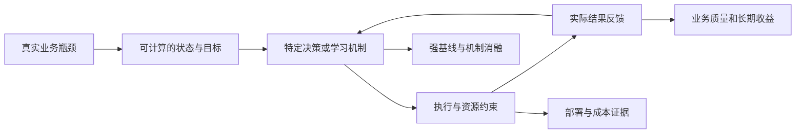
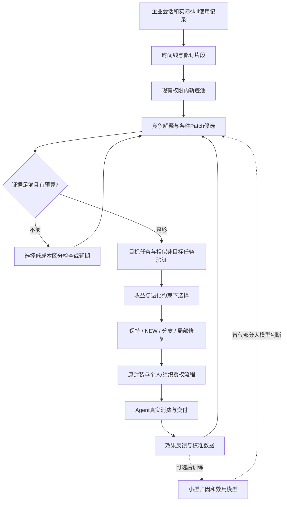

# WWW Industry技术链条与SkillsLoop深化路线

日期：2026-09-24。性质：文献方法分析与研究建议，不是实验结果或实现报告。当前实现依据031实现验收与032方法评估；本轮不修改demo、不执行训练。

## 1. 判断

可以、也值得深入Agent算法层；模型层应作为有条件的第二阶段。当前短板是尚未形成经验证的独立学习机制和工业效果证据，不是“没有修改基础模型参数”本身。

WWW 2026 Industry征稿要求强调真实工业问题、技术洞察、设计取舍、实际收益，并要求说明部署或发布方式及持续时间，没有规定必须微调或提出新网络。[官方征稿](https://www2026.thewebconf.org/calls/industry.html)。以下六篇均在[官方Industry日程](https://archives.iw3c2.org/www2026/program/full-schedule.html)核实身份；这是针对研究问题选择的案例，不能代表全Track技术复杂度的统计分布。方法依据作者公开全文版本，可能与最终ACM版本存在修订差异。

需要同时纠正两种判断：完整产品闭环不自动构成论文；采用现成基础模型也不自动意味着没有算法贡献。关键是明确瓶颈，改变可检验的决策或学习机制，并证明该机制在实际约束下有效。

## 2. 六篇论文的技术链条

### 2.1 When Rules Fall Short：Agent发现算法

工业问题是已有审核规则无法覆盖新问题。技术链：按问题本质召回→已有策略覆盖判断（可调用治理分类器）→流式归入已知簇→未归入样本离线聚类→生成或修订规则→人工审核→用于标注和下游治理训练。核心Agent不依赖新增任务训练数据，但整体系统包含训练过的工具及下游模型。

核读§3–6、表1–2：有无工具、不同聚类工具、SFT基线、阶段指标与在线治理评估；新问题观看占比相对下降14.9%，流程25.8→7.7天。代价是Agent约12.5 H100小时/日，SFT约1.7。它支持Agent机制路线，不能用于证明Agent天然省算力。[原文](https://arxiv.org/html/2601.11634v1)

对本项目的推论：发现、归纳、下游执行效果应闭合；需要检验经验归纳是否改变执行收益，而非只展示生成数量。

### 2.2 Data-Driven Function Calling：数据机制驱动后训练

技术链：专家种子→真实查询去重→强模型复核、分歧人工标注→语义聚类与参数熵定位盲区→定向增广→SFT→GRPO。奖励分解工具、参数名、参数值及格式；推理与直接调用通过不同提示隔离。贡献不能简化成“用了GRPO”。

核读§3–5：增广有盲区、提示、轮数消融；六个离线基准及不同模型规模；系统评估350条端到端问答、近2000个查询—调用列表对，同时检查工具执行和最终答案。该端到端样本评估不能直接等同大规模随机线上A/B。[原文](https://arxiv.org/html/2604.05387v1)

对本项目的推论：最先应改善“什么经验能当监督信号”，再训练模型；把错误修订混入训练集，微调会放大错误。

### 2.3 CardRewriter：下游效用反向监督中间表示

技术链：平台多源检索→知识卡→查询改写；卡生成与改写分别SFT+GRPO。离线搜索系统比较改写结果，形成偏好对，训练Bradley–Terry奖励模型，并结合语义相关性。近线生成、在线缓存控制服务开销。

核读§3–4：比较Prompt/SFT/DPO/GRPO与无知识、直接RAG、卡片RAG的组合，另做奖励消融；10天线上试验约覆盖16%流量，覆盖流量CTR相对+3.729%，全流量+0.342%。原文表1与相邻正文的Hitrate@300数值不一致，本报告不采用该数值。[原文](https://arxiv.org/html/2510.10095v1)

对本项目的推论：skill是中间表示，应由后续执行效果监督；“内容正确、结构完整”只是必要检查，不是收益奖励。

### 2.4 Self-Evolving LLMs：参数层持续学习

MoE-CL冻结基础权重，为各任务设置独立LoRA，同时维护共享LoRA；门控融合两者。任务判别器识别共享表示的任务标签，共享专家通过对抗目标降低任务可辨识性，以减少干扰、保留迁移。

核读§4–5：MTL5、Tencent3，多种任务顺序，ACC/BWT/FWT、延迟与去GAN消融。需要注意：§5.4明确是离线A/B；表4视频业务免人工审核比例13.5%→28.8%，增加15.3个百分点，不能无条件改写为实测人工成本相对下降15.3%。论文也不是所有持续学习指标均最优。[原文v4](https://arxiv.org/html/2509.18133v4)

对本项目的推论：个性化与共享知识冲突可以深入参数层，但文本skill与任务LoRA不是同一种载体；直接照搬专家架构既不自动创新，也不能替代组织授权与删除治理。

### 2.5 BanditLP：预测与受约束决策联合

技术链：神经网络预测奖励和成本→Laplace近似不确定性→Thompson采样→大规模LP满足多层约束→执行→反馈更新。研究重点包含探索与约束的耦合，而非新基础网络。

核读§3–4：比较无探索、无LP等基线；OBD离线实验使用补全奖励矩阵，属于代理仿真。七周线上A/B中两组只用自身数据更新；营收相对+3.08%，95%CI为[+0.17%,+5.99%]，转化率变化不显著。基于预测值满足约束不等于真实随机结果必然不违反约束。[原文](https://arxiv.org/html/2601.15552v1)

对本项目的推论：预算不能只做每日调用计数；可研究哪些候选值得花验证资源。但“加一个Bandit”本身不是原创，且只有被选候选有反馈时存在选择偏差。

### 2.6 Make It Long, Keep It Fast：模型与系统共同优化

技术链：单目标到长历史的堆叠交叉注意力STCA→重排计算减少中间投影→请求级共享历史编码RLB→变长稀疏训练、长序列推理→压紧序列及算子优化。

核读§3–4：比较近似匹配算力的序列编码器、结构消融与计算—质量曲线；RLB训练吞吐2.2倍，结合算子优化达5.1倍，不能解释成两者相乘。这代表基础架构和训练系统路线，直接迁移到skill生成缺少问题对应关系。[原文](https://arxiv.org/html/2511.06077v1)

对本项目的推论：资源约束应影响算法本身；复用轨迹证据、批量归纳和少量关键验证，可能比更长思考链更符合当前成本目标。

### 阅读范围说明

AFE-Master已核实Industry身份，但本轮ACM全文访问失败，不将二手摘要算作完成技术细读。FRiskGPT也未取得足够全文证据，不纳入上述六篇分析。没有把Research、Web4Good或Demo Track论文混入Industry样本。

## 3. 论文共有的证据结构

以下是跨案例综合推论，不是官方统一录用门槛：

技术深度的判断问题是：输入表示是什么；哪些量能被观测；哪些是推断；决策如何产生；参数或记忆如何更新；失败如何定位；怎样识别收益不是更多token、更多数据或更强底座造成的。

Industry更强调实际约束、部署与工业收益；Research往往更强调可推广的方法创新与科学认识。两者重叠很大，不能理解为Industry不需要方法，也不能把Research方法复杂度作为Industry唯一门槛。

## 4. 当前SkillsLoop的准确定位

依据[031实现验收](../../enginering/demo/MULTITRACE_ACCEPTANCE.md)与[032方法评估](032_v3_method_idea_assessment.md)：

| 层次 | 当前已有 | 尚缺 |
| --- | --- | --- |
| 工程闭环 | 轨迹、聚类/版本池、生成、封装、采纳、审核、消费、UPDATE | 企业生产长期运行证据 |
| 确定性算法 | 词法complete-link聚类、来源冻结、引用/hash/patch检查 | 语义聚类和更新收益的独立验证 |
| Agent学习机制 | 一次批量调用内成功/失败/UNKNOWN分析与归纳 | 可检验的修订归因、证据选择、效用决策 |
| 模型学习 | 使用现成模型推理 | 独立训练数据、参数更新、校准与泛化评估 |
| 科研证据 | 软件测试、构造案例真实模型闭环 | 强基线、企业未来任务、跨用户及长期对照 |

当前不是“一句prompt”，但语义学习核心仍主要交给提示驱动的模型归纳；形式合法不等于学到了正确、可迁移的方法。继续加分析角色、字段和页面，难以单独弥补这一缺口。

## 5. 推荐主线：目标变化下的Agent经验归因与选择性学习

研究问题：**在目标不断变化、反馈不完整的企业会话中，Agent如何识别值得学习的行为改变，并在固定预算下更新技能而不伤害已有适用任务？**

这延续032，但比“提示模型判定需求变化”更深入：把归因结果连接到可执行候选操作、验证选择和未来收益。以下均为待实现、待证伪建议。

### 5.1 学习对象从整段对话变为可对齐的修订片段

构造状态：当时有效要求G、旧/新尝试A、工具观察O、产物版本Y、用户反馈F、实际使用skill版本K、证据缺失标记U。规则建立时间和版本关系，模型处理语义指代；缺失关系不能自动补成事实。

先用现有NEW/UPDATE路线和权限池，不恢复此前被否定的全库匹配。池内按任务目标、修订关系组织证据；同主题不代表同方法、同样报错也不代表同一原因。

### 5.2 区分改变目标、方法错误与执行异常

至少保留：目标改变、既有要求未满足、环境或工具异常、证据不足；目标改变和方法错误可能同时发生，不强制互斥。

例：起初要求“包含退款的销售统计”，之后要求“剔除退款”，应增加条件分支。若起初就要求剔除退款而Agent未执行，应修复方法。若规则正确但接口返回缺页，应检查获取和校验机制；不能直接学成“永远删除该类数据”。

可在产物可重放时建立局部检查矩阵：旧产物/新产物分别对旧要求/新要求进行验收。它帮助区分“目标变了”与“旧要求没做对”，但不是自动成立的因果识别：要求可能不完整，产物可能受其他修改影响，检查也可能不可靠。

### 5.3 把UPDATE变成有限动作选择问题

候选操作包括保持旧版、增加适用条件分支、局部修复、先收集证据、延期。NEW则保留“不产出skill”动作。候选按现有可执行Patch契约生成，确定性检查非法修改；权限继续是硬边界。

当多个解释会导致不同更新时，优先执行最能区分它们的低成本检查：已有日志查询、产物差异、规则验收、隔离环境重放。预算不足时保留未知状态；不能为凑成功标签而强行发布。

这里可以形成真正的Agent算法：状态、候选动作、检查选择、停止条件和决策更新都有明确实现，并可逐项消融。只把这些词写进提示或把流程命名为POMDP，不算完成算法深化。

### 5.4 用未来任务的边际收益选择经验

固定消费Agent和基础模型，在独立的开发验证任务上配对运行旧/新skill，覆盖目标任务及相似但不适用任务。观察修复收益、误伤、执行成本，反馈给候选选择器。最终测试集保持隔离；不能不断针对测试结果更新skill。

一个研究目标可写为最大化未来任务预期收益，满足总预算、旧任务退化上限和授权约束：

$$\max_\pi\ \mathbb{E}[\Delta Q_{future}]\quad\text{s.t.}\quad C_{learn}+C_{verify}+C_{serve}\le B,\quad R_{regress}\le\epsilon.$$

这只是目标定义，不是已发明的算法或已成立的保证。实现需要可校准的收益/风险估计、有限候选搜索及验证资源分配；未知风险不能当作零。实测检验目标约束是否满足。

### 5.5 独创性边界

多轨迹归纳本身沿用Trace2Skill；反馈演化与已有AutoSkill/SkillEvo重叠；边际效用选skill与SAPO相关；回归审计与SkillAudit相关。近邻背景见032及历史相关工作，不宣称上述单项首次提出。

可能形成区别的是：**针对自然企业会话中目标漂移造成的错误学习，把修订解释、条件Patch和区分性验证联合起来，并证明能减少错误更新及相似任务误伤。**是否足够原创，需要机制实现、近邻同条件比较和新一轮专门查重；本轮不作“独有”承诺。

## 6. 进入模型层的具体对象

优先训练学习决策所需的小模型，保持消费Agent固定，避免生成器与消费者一起改变导致收益无法归因。

| 对象 | 输入/输出 | 可用监督 | 何时值得做 |
| --- | --- | --- | --- |
| 修订归因模型 | 时间线、反馈、产物差异→归因分布、证据位置、拒判 | 人工双标仲裁；规则/重放核验的解释 | 稳定误归因是主要瓶颈，提示基线仍不足 |
| Patch效用模型 | 片段、候选Patch、适用条件→修复收益/误伤风险 | 同条件配对执行结果 | 验证成本高且有足够可靠结果 |
| 轨迹表示模型 | 修订片段→方法级向量 | 可迁移正对、同主题异要求难负对 | 先证明词法或通用embedding聚类是瓶颈 |
| 技能消费策略模型 | 任务状态、已授权skill→选择、执行、回退 | 可重放环境中的任务验收 | skill正确但不会用是主要损失来源 |

起步可用监督分类、排序或小型开源模型LoRA；不是所有对象都需要生成式LLM。仅有大模型推理API不能视为已有训练能力，仍需可训练权重或服务、数据许可、计算资源和评估集。

推荐训练顺序：可信标签→SFT/分类或排序基线→校准与跨用户测试→有真实执行偏好时再比较DPO；只有回放环境和奖励可靠，且多步探索确有增益，才考虑RL。避免用生成模型自己的“这个skill很好”评分同时当训练奖励和最终验收。

另有更激进路线：将稳定通用流程蒸馏进共享adapter，个性化/易变要求留在外部skill，再研究更新干扰与遗忘。这会扩展到参数化记忆与外部记忆分工，训练与治理负担显著提高；当前不建议作为首篇的必选内容，也不建议一skill一LoRA。

## 7. 下一步以阶段证据决定投入

| 阶段 | 具体产物 | 继续条件或否定条件 |
| --- | --- | --- |
| A 瓶颈普查 | 脱敏真实修订片段、双标归因、错误来源统计、可回放比例 | 若目标变化误归因很少或解释不了错误skill，放弃其作为主贡献 |
| B 固定模型的Agent机制 | 强提示、当前demo、适配近邻、联合归因的同条件对照 | 必须在相同信息与预算下减少错误Patch，同时保留有效经验 |
| C 有条件模型训练 | 归因/效用训练集、轻模型与强模型对照、跨用户和时间泛化 | 若只是记住模板、不能改善下游或成本，无需保留训练模块 |
| D 长期工业验证 | 相同初始库的冻结/演化组；真实试点和成本账本 | 衡量成功率、净人工时间、每成功任务成本及退化；不只报调用率 |

探索标注可先抽取约200–300个修订片段覆盖主要情形，数量只是起点，不是投稿充分样本量。训练样本规模依标签分歧、任务覆盖和学习曲线决定。用户需要提供消息时间、角色、工具调用与结果、产物版本、实际skill版本、后续任务及可用验收信息；只有问答文本时必须明确不可识别部分。

成本口径分开报告研发训练成本、周期更新成本、在线推理与审核成本；训练投资可按后续任务量摊销，但不能从总账删除。通过同一次批量归纳、缓存、确定性检查、小模型替代和有选择的重放控制成本。更深入验证可能增加调用；“不增加”是待测约束而非本报告保证。

所有阶段继续遵守：未验证候选正常处理且标明证据状态，不要求用户说满意；不增加会话标记操作；组织复用仍需用户提交和审核，聚类不构成共享授权。

## 8. 建议论文定位

暂拟：**Learning What to Change: Goal-Aware Skill Evolution from Enterprise Agent Conversations**（从企业Agent会话中学习该改变什么：面向目标变化的技能演化）。标题只表达问题，不宣称已证明因果性或持续收益。

首篇建议围绕一个清晰瓶颈形成Agent学习机制；模型后训练用于强化该机制，而不是另起一个基础模型课题。企业Web任务的实际工具、权限、交付与用户复用证据仍须补齐，独立demo的构造验收不能替代部署证据。若机制未胜过强提示或近邻，应该报告负结果并调整主线，不能靠增加模型层级补足证据。

本轮无新增企业实证发现；新增的是文献方法、实验口径核对和待验证研究路线。
