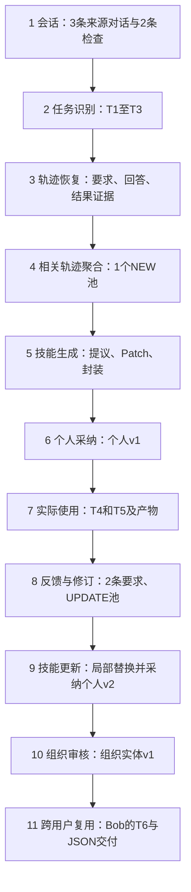

# 任务定义、数据描述与统计、全链路案例

> **轮次040范围说明：** 本报告第3节的11步是031构造案例的历史展示，不再作为项目全链路阶段定义。用户已固定十二阶段及交接契约，含第12阶段“再次反馈”，见[040全链路契约](040_twelve_stage_contract_and_task_detection.md)。原案例数据和当时的观察保留。

日期：2026-09-24。用途：团队共同理解与论文Task Definition / Data / Case Study初稿。

证据边界：下述任务定义为研究定义；数据统计来自031构造输入的真实模型验收，不是企业会话总体统计；样例来自已有执行记录，本轮未新增运行。目标变化归因属于研究解释，不能写成demo已实现的算法。

## 1. 任务定义

### 1.1 研究任务

研究企业会话驱动的可复用技能发现与持续演化。给定按时间记录的用户—Agent交互、工具结果、交付产物、实际技能使用版本及授权状态，系统需要恢复具有明确目标的任务轨迹，从多条相关轨迹中归纳具有适用条件和来源依据的技能，经个人采纳或组织审核后供后续任务使用，并根据使用结果决定保留、扩展或修订技能。

目标是提高未来任务的完成质量与经验复用效率，同时减少无效沉淀、旧能力退化以及生成、验证、执行和维护的总开销。生成数量、版本数量、模型自评分不是目标本身。

### 1.2 基本单位

**任务实例**：围绕一个可识别交付目标展开的工作，包括输入对象、当时有效要求和可观察产物。例如“根据九月订单整理本期销售报告并输出JSON”。主题相同不等于同一任务。

**任务轨迹**：完成一个任务实例所产生的有序事件集合，包括要求、尝试、工具调用、结果、交付版本、反馈与修订关系。一个会话可包含多个任务；一个任务也可能跨回合延续。没有可靠关联证据时，不凭话题相似合并为同一任务。

**修订片段**：一次尝试及其后续反馈、被指向的产物版本和可观察修改；若只有修改要求而无后续产物，记为待执行修订，不能补写为修复成功。

**任务族/轨迹池**：多个独立任务实例在授权范围内形成的学习集合。任务族表示可共享方法的候选关系，不等于组织共享权限或高频价值已经成立。

**技能**：面向一类任务的可复用方法及必要材料，包含适用条件、步骤、输入输出约定、验证方式与来源。使用原项目封装规范；研究数据里的标签、谱系和统计字段不要求全部写入SKILL.md，也不要求增加数据库表。

### 1.3 输入、输出与决策

记交互事件流为E，授权范围为A，当前技能库为K_t，资源预算为B。系统输出任务轨迹集合T、技能候选及其证据、入库/审核事件、实际消费与产物、更新后技能库K_(t+1)。

每条任务轨迹可表示为：

`T_i = (任务目标, 要求时间线, 有序事件, 产物版本, 反馈关系, 实际使用skill版本, 结果证据, 授权范围)`。

新任务未使用已有skill时进入NEW候选流程；实际使用了skill的任务可进入相应版本的UPDATE流程。两者都允许没有学习产出。每次使用后具备学习资格，不等于每次都改写技能。

建议研究的更新决策包括：保持、增加条件分支、局部修复、补充证据、延期。当前demo实际实现以NEW/UPDATE及Patch为主，尚未实现全部语义决策。

### 1.4 “有价值”与“成功”分别定义

有价值的任务候选需要具有具体目标、可识别输入输出、可迁移的方法信息，以及频率或重要性证据。高频来自独立任务实例计数，不能把一次任务的反复重试计成多次需求；重要性来自业务责任人、风险、人工负担等依据，不由模型主观分数代替。

有价值的轨迹能够支持方法提取或修订：成功轨迹提供可复用步骤，失败轨迹可能提供有依据的规避经验，未验证轨迹可以提供明确要求和候选方法。缺少最终确认不自动排除，也不自动判成功。

区分三个层级：运行结束、交付通过验收、技能对未来任务有增益。三者不能互相替代。孤立闲聊、无交付目标的泛问答、重复日志和无依据自述通常不直接沉淀业务skill；执行异常仍可作为诊断事件保留，但是否形成技能要看是否具有稳定、可迁移的修复方法。

## 2. 数据描述

### 2.1 数据组织与关联

建议将研究导出组织为以下逻辑对象，不改变现有物理表设计：

| 对象 | 最小字段 | 关联与用途 |
| --- | --- | --- |
| 会话事件 | event_id、user_alias、org_scope、session_id、时间、role、content、来源类型 | 保留先后关系和授权边界 |
| 任务轨迹 | task_id、目标、成员event_id、边界依据、要求版本 | 防止按问答对切断修订路径 |
| 执行尝试 | run_id、task_id、工具输入输出、运行状态、退出信息 | 区分工具接收成功与命令执行成功 |
| 交付产物 | artifact_id、run_id、相对路径、hash、版本、访问范围 | 对齐反馈和前后差异 |
| 反馈/修订 | feedback_event_id、所指attempt/artifact、要求生效位置、后续修改 | 区分新增要求与既有错误；未知保留 |
| 技能使用 | skill_id、version、hash、run_id、选择/注入/读取证据 | 绑定UPDATE实际基准；读取不等于产生收益 |
| 学习与发布 | pool_id、候选、来源快照、提议、Patch、采纳/审核事件、父版本 | 重建NEW、UPDATE和授权谱系 |
| 验收与资源 | check_id、expected/actual、判断来源、预算、模型请求、usage、审核时间 | 分开真实观察、人工/导入标签与模型推断 |

一条生命周期样本应能沿着`来源轨迹→候选→技能版本→消费run→反馈→更新版本→组织版本→新用户产物`追踪。没有链接的记录可以参与部分分析，但不能计为完整闭环样本。

### 2.2 标签口径

结果分为SUCCESS、FAILURE、UNKNOWN，并携带`provenance`。用户新要求、客观验收、模型诊断分字段记录，允许结果与修订性质不同。例如一次执行成功后用户扩展目标，不应回填为原执行失败。

当前记录存在多层状态：NEW源trace顶层`verification`为UNKNOWN，而其`input.evidence.outcome`根据导入检查分别为SUCCESS/FAILURE/UNKNOWN。本报告的分析分支统计采用后者，不能声称三条任务均获得统一顶层验收。

### 2.3 当前可核验统计

统计范围仅为031成功验收脚本及其回执，不是整个demo数据库，也不是企业总体。计数单位为用户可见交互轮次和任务实例，不包含模型内部消息。

| 项目 | 数量/值 | 说明 |
| --- | --- | --- |
| 场景 | 1 | 销售报告；业务规则由验收设定，不是通用财务准则 |
| 业务用户角色 | 2 | Alice、Bob，均为测试身份 |
| 审核角色/组织范围 | 1 / 1 | 脚本调用reviewer、acme，不代表真人审核或真实组织 |
| 独立任务/会话 | 6 / 6 | 3条导入来源＋2次个人消费＋1次组织消费 |
| 用户—助手轮次 | 8 | 3条导入来源＋3次真实消费＋2条导入反馈 |
| NEW来源轨迹 | 3 | 分析证据结果成功、失败、UNKNOWN各1 |
| NEW源客观检查 | 2 | 导入expected/actual检查；1通过、1失败 |
| NEW池/候选 | 1 / 1 | 3条来源归纳；不推算无效技能减少率 |
| UPDATE来源轨迹 | 2 | 同一实际skill及v1基准；各追加1条反馈 |
| UPDATE池/候选 | 1 / 1 | 2个USER_RULE提议合并为1次局部替换 |
| NEW提议/应用操作 | 3 / 2 | 3条经验提议形成2个replace操作 |
| 技能谱系 | 1 | 个人v1→个人v2→组织发布副本 |
| 个人内容版本 | 2 | 不能算作2种独立能力 |
| 组织发布版本 | 1 | 组织实体version=1，内容hash对应个人v2 |
| 真实skill消费 | 3 | 2次Alice、1次Bob，均有FILE_READ证据 |
| 成功批次外层Agent派发 | 5 | 学习2、消费3 |
| 成功批次模型请求发起 | 24 | 依据完整resource-audit，非5次模型调用 |
| 报告tokens | 306,250 | 含缓存口径，不能直接换算账单 |
| 现金成本/人工时间 | 未知 / 未测 | 不记为0 |

另有前序网络失败学习派发1次、内部请求发起8次，usage缺失。若汇报该验收工作的全部已审计尝试，须并列报告6次外层派发、32次请求发起和缺失usage；306,250不是包含失败尝试的完整token总量。acceptance.json中旧快照的请求计数存在缺失，完整请求统计以resource-audit.json为准。

来源：[验收脚本](../../enginering/demo/scripts/check_multitrace_live.py)、[结果汇总](../../enginering/demo/artifacts/031-multitrace-live-network/acceptance.json)、[资源审计](../../enginering/demo/artifacts/031-multitrace-live-network/resource-audit.json)。

### 2.4 企业数据接入后必须补齐的描述统计

目前未收到并统计真实企业数据库，下列项目全部待测，不提供推测数值：

| 统计维度 | 口径 |
| --- | --- |
| 覆盖规模 | 组织、授权用户、业务角色、观察起止时间、活跃天数 |
| 原始交互 | 会话数、消息数、工具事件数、产物数；脱敏前后保留率 |
| 任务结构 | 每会话任务数、每任务轮次/工具步数的P50/P90、跨回合比例 |
| 噪声与结果 | 无任务目标比例；成功/失败/未知比例及标签来源；无标签不计失败 |
| 修订类型 | 目标扩展、既有错误、环境异常、混合与无法判定；需人工抽样核验 |
| 经验覆盖 | 独立任务频次、业务重要性证据、簇大小、单例和重复候选比例 |
| 闭环覆盖 | 有产物、可回放、有skill实际版本、有使用后反馈、有后续复用的比例 |
| 权限与采纳 | 展示、个人接受、组织提交/批准、跨用户消费；分别统计分母 |
| 资源 | 学习/消费请求、tokens、延迟、重试、审核与维护时间、缺失率 |

企业数据需按时间划分发现、开发验证和未来测试；同一来源、模板变体及组织授权边界需控制泄漏。暂不把单个构造案例视作训练集或独立测试集。

## 3. 一条可追溯的全链路样例

### 3.1 样例性质

案例名：销售报告技能的发现、复用、字段扩展与组织共享。Alice、Bob、reviewer和业务输入是构造数据；OpenClaw/qwen3.7-plus生成、官方skill-creator封装和产物交付是真实执行。采纳、提交和审核由验收脚本模拟角色操作，不能据此报告用户采纳意愿。

### 3.2 全链路总览

下面按11个逻辑环节拆解同一条技能生命周期，编号不意味着工程中存在11个独立服务或11次模型调用。T1—T6是便于阅读的任务别名；来源对话保持独立，不拼成一段虚构的长会话。每一步的输出构成后续步骤的输入。

| 步骤 | 任务描述 | 本案例输入 | 本案例输出 |
| --- | --- | --- | --- |
| 1 会话 | 接收并保留原始工作信息 | 3条Alice构造对话及2条导入检查 | 带身份、会话及来源的交互记录 |
| 2 任务识别 | 确定具体要完成什么 | 原始请求与回答 | 3个独立销售报告任务T1—T3 |
| 3 轨迹恢复 | 关联要求、尝试和证据 | 任务记录、消息和检查 | 3份任务快照，分别携带成功/失败/未知分析证据 |
| 4 相关轨迹聚合 | 把相关经验送入一次学习 | 同一Alice范围内的T1—T3 | 1个含3条来源的NEW池 |
| 5 技能生成 | 把经验形成可封装方法 | NEW池及其来源证据 | 3条提议、2个应用操作、1个可采纳技能包 |
| 6 个人采纳 | 将候选变为个人可用技能 | 技能包及Alice采纳操作 | 个人skill v1 |
| 7 实际使用 | 使用v1完成新的业务任务 | v1及两批新订单数据 | T4、T5的真实执行记录与JSON产物 |
| 8 反馈与修订 | 把后续要求关联到实际使用 | T4/T5及2条新增字段反馈 | 2条关联v1的修订轨迹与同基准UPDATE池 |
| 9 技能更新 | 合并新增要求并形成新版本 | UPDATE池、原v1及反馈证据 | 2条提议、1个局部替换、采纳后的个人v2 |
| 10 组织审核 | 经提交与批准开放组织使用 | v2内容对应候选、提交/批准操作 | 内容来自个人v2的组织技能实体v1 |
| 11 跨用户复用 | 另一成员用共享技能完成新任务 | Bob新任务T6及组织技能 | 五字段JSON、读取证据及独立验收结果 |

### 3.3 步骤1：会话

**任务描述**：收集用户要做的工作、助手的回答及外部检查，保留原始来源，以便后续恢复任务与核验经验。

**输入**：脚本以Alice身份导入3个独立会话，每个会话包含一轮用户—助手交互：

| 会话 | 用户输入 | 助手记录 | 随附检查 |
| --- | --- | --- | --- |
| 031-success | 整理销售报告，必须先按订单号去重再汇总，金额单位为元 | 两条重复订单各100元，按订单号去重后100元 | expected=100，actual=100 |
| 031-failure | 整理销售报告，必须排除取消订单；发生重复计入时先检查状态再汇总 | 已算出120元，但包含20元取消订单，评估失败 | expected=100，actual=120 |
| 031-unknown | 整理销售报告，必须将跨期退款单独列示，不从本期净收入扣除 | 先按期间分组，再分别展示本期净额与跨期退款 | 无 |

**处理过程**：记录用户、会话标识、消息内容、时间与导入检查。来源检查保留`IMPORTED_EVALUATION`，不能冒充由系统对真实企业任务自动获得的标签。

**输出**：3条可追溯的原始交互记录、2条导入检查记录。此时还没有可用skill。

### 3.4 步骤2：任务识别

**任务描述**：从会话中识别具体工作目标，确定后续要恢复哪些任务，而不是只提取“销售”这一话题。

**输入**：步骤1的3条请求、助手回答及会话身份。

**处理过程**：当前demo处理这些明确的任务请求，建立各自任务记录；它们没有已有技能使用记录，因而具备进入NEW流程的条件。

**输出**：3个独立任务实例：

| 别名 | 原任务ID | 可识别目标与要求 |
| --- | --- | --- |
| T1 | task-8c4aa94e7c1c4d8e | 整理销售报告，订单去重后汇总，单位元 |
| T2 | task-931a44e179e641cf | 整理销售报告，排除取消订单 |
| T3 | task-f0f93d3c68d343f9 | 整理销售报告，跨期退款单列 |

**证据边界**：本案例输入已经是清晰的单任务会话，没有验证复杂会话里的多任务切分、重要性判定或真实高频任务发现。3次构造请求不能作为企业高频统计。

### 3.5 步骤3：轨迹恢复

**任务描述**：把任务目标、执行尝试和结果证据关联起来，避免将助手自述直接当作成功结论。

**输入**：T1—T3的任务记录、所属用户/助手消息、导入检查。

**处理过程**：将各任务的关联事件组织为快照，保留任务ID、revision、hash、turns和来源证据。本案例的3条来源都是短轨迹，尚无真实工具重放链。

**输出**：3份可供分析的任务轨迹：

```text
T1：去重要求 → 回答去重后100 → 导入检查100=100
    evidence.outcome=SUCCESS；可用经验：去重步骤
T2：排除取消订单要求 → 回答120且含取消20 → 导入检查120≠100
    evidence.outcome=FAILURE；可用经验：明确的过滤规则
T3：跨期退款单列要求 → 助手提出处理方式 → 没有检查
    evidence.outcome=UNKNOWN；可用经验：用户规则，未验证执行
```

顶层trace的`verification`仍为UNKNOWN，不能与分析层`evidence.outcome`混淆。T2没有修复后的通过检查，不能补写“已经验证取消订单是唯一失败原因”；T3也不会仅因未知而被丢弃。

### 3.6 步骤4：相关轨迹聚合

**任务描述**：将多个相关任务中的互补方法放入同一次归纳，避免逐条对话各生成一个零散skill。

**输入**：步骤3的3份轨迹、Alice的权限边界，以及“未使用已有skill”的记录。

**处理过程**：当前demo通过词法相似度和complete-link聚类，将同一用户范围内的相关NEW轨迹归入同一池，保留每条来源的版本和证据。这里汇聚的是独立任务的经验，不是把3个任务合并成一个任务。

**输出**：1个NEW池，包含T1、T2、T3共3条来源，对应候选`candidate-5878ab1ba0b94135`；后续一次学习同时获得去重、过滤和跨期退款规则。

**证据边界**：聚合没有授予组织共享权限，也没有证明当前聚类算法在真实企业数据上的质量。

### 3.7 步骤5：技能生成

**任务描述**：从池内轨迹提出有来源依据的方法条目，合并成可封装、可复用的技能候选。

**输入**：NEW池、3份任务快照、结果证据及原始要求。

**处理过程**：真实模型在一次学习派发内进行成功/失败/UNKNOWN分析，形成3条经验提议；宿主校验引用、提议覆盖及修改锚点，应用2个局部操作，再通过官方skill-creator封装。

**输出**：1个可采纳技能包，核心方法为：

```text
输入：含订单号、状态、金额等字段的销售数据
步骤：解析字段 → 排除取消订单 → 按订单号去重 → 汇总金额
规则：跨期退款单独列示，不从本期净收入扣除
输出：可检查的销售报告
```

以上为实际SKILL.md的内容摘要。3条提议中保留了用户规则与验证程度的区别；生成并通过封装不等于已证实未来任务收益。

证据：[NEW完整记录](../../enginering/demo/artifacts/031-multitrace-live-network/01-new.json)。

### 3.8 步骤6：个人采纳

**任务描述**：把已生成的候选纳入用户个人库，使后续运行能够引用一个明确的技能版本。

**输入**：步骤5的可采纳候选包，以及Alice身份的采纳操作。

**处理过程**：验收脚本调用Alice的采纳流程，保存技能内容及版本，不自动发布到组织库。

**输出**：个人技能`skill-1e0b4ddc83144a74`，版本v1，内容hash为`a26b6ac77e63c434ef14d63dedd5e2d94d4b3518422f7213803e7b9b2408cadd`，可供Alice后续选用。

**证据边界**：这是脚本模拟用户采纳，不是企业员工实际接受率或满意度证据。上述NEW导出记录最终状态为INSTALLED，记录的是已经采纳后的状态。

### 3.9 步骤7：实际使用

**任务描述**：在新的输入上真实消费个人v1，生成可检查产物，并留下用于后续学习的执行轨迹。

**输入**：Alice选用v1，发起两个独立任务：

| 任务 | 业务输入 | 当时要求的交付 |
| --- | --- | --- |
| T4 / 031-consume | A已完成100、重复A100、B已完成80、C已取消20；本期退款10、跨期退款30 | 用Python计算，将net、cross_period_refund写入outputs/result.json |
| T5 / 031-consume-2 | D已完成200；本期退款20、跨期退款5 | 用Python将net、cross_period_refund写入outputs/result.json |

**处理过程**：Agent实际读取v1的SKILL.md，处理新数据并写文件；运行记录绑定skill ID、v1、hash及FILE_READ证据。T4一次命令因引号问题出现SyntaxError，随后重试成功；失败尝试属于同一任务，不增加任务计数。工具外层SUCCEEDED不能代替命令退出状态。

**输出**：T4和T5的真实执行记录、各自工作区内的JSON文件，以及后续可关联的任务/运行标识。T4的文件经独立读取检查：

```json
{"net":170,"cross_period_refund":30}
```

T4计算依据为去重且过滤后的180减本期退款10；跨期退款30单列。T5存在产物与完成回执，但验收脚本没有对其金额进行与T4相同的独立数值断言，不混成同等验收证据。

### 3.10 步骤8：反馈与修订

**任务描述**：将使用后的新要求关联回具体任务、产物及实际消费版本，为后续更新提供依据。

**输入**：步骤7的两条使用轨迹和两条导入反馈：

| 关联任务 | 后续反馈 | 对旧交付的新增要求 |
| --- | --- | --- |
| T4 | 不对，输出必须同时列出gross和current_refund，保留原net及cross_period_refund | 增加汇总额、本期退款字段 |
| T5 | 不对，输出必须同时列出currency，固定为CNY；保留原有金额字段 | 增加币种字段 |

**处理过程**：导入反馈通过`replyTo`关联原使用轮次，恢复“原要求→v1执行及产物→后续反馈”的修订关系；按同一实际skill及v1基准归入UPDATE池。

**输出**：2条带反馈的修订轨迹、1个同基准UPDATE池，对应候选`candidate-27cd2eccb42c472d`。此时有的是修改要求，还不能把助手“后续会补齐”的回复当成已修复产物。

**当前实现与研究解释**：demo把两条反馈送入failure分析分支；但原请求只要求net和cross_period_refund，从可见时间线看，新增字段属于输出要求扩展。这个解释来自人工核对，demo尚未自动识别，不能据“不对”断言原计算失败。

### 3.11 步骤9：技能更新

**任务描述**：将两次使用中新增的输出约定合并进技能，保留已有计算方法，形成可继续消费的新版本。

**输入**：UPDATE池、原v1内容与hash、T4/T5的反馈及执行证据。

**处理过程**：真实模型提出2条USER_RULE提议，合并为1个针对SKILL.md“列示规则”的replace操作；宿主校验并实际应用Patch，重新封装。随后脚本模拟Alice采纳更新。

**输出**：个人v2，内容hash为`1f79cca474184d17472750ffbfc85dec13c1d8d5b154dce1de7dff2a55e15aa1`。相对v1的具体变化为：

| 项目 | 更新前 | 更新后 |
| --- | --- | --- |
| 计算步骤 | 过滤取消订单、去重、汇总 | 保留 |
| 跨期退款 | 单独列示、不从本期净额扣除 | 保留 |
| 输出约定 | 未列出完整五字段清单 | gross、current_refund、net、cross_period_refund、currency |
| 币种 | 没有固定币种约定 | currency固定为CNY |

这是输出规范扩展的真实实现结果，不是已经证明泛化更好的算法。固定CNY的适用范围偏宽，未验证外币场景，也没有完成全面旧能力回归。

证据：[UPDATE原始提议与Patch](../../enginering/demo/artifacts/031-multitrace-live-network/04-update.json)。

### 3.12 步骤10：组织审核

**任务描述**：将个人经验通过明确的提交与批准流程发布，形成其他获准成员可用的组织技能。

**输入**：个人v2内容对应的更新候选、Alice提交操作、reviewer批准操作。

**处理过程**：脚本模拟Alice提交更新候选，reviewer批准，创建组织技能。此处复用原组织流程；不以轨迹聚类或模型认可代替共享授权。没有记录真人的审查意见，也不补写模型完成了业务审核。

**输出**：组织技能`orgskill-37fcb01ccb514d18`，owner为`org:acme`，组织实体版本为1；内容hash与个人v2一致，Bob可在获准范围内使用。

**版本说明**：个人v2与组织实体v1是不同实体的版本编号；发布副本不是新生成了一种独立能力，也不意味着Bob取得Alice原始会话的访问权限。

### 3.13 步骤11：跨用户复用

**任务描述**：验证另一成员能够读取获准组织技能，在新的业务输入上完成任务并交付可检查文件。

**输入**：Bob选择组织技能，发起任务T6 / 031-shared：

> 整理销售报告，按技能将JSON写入outputs/result.json。已完成订单E=300，F=50，本期退款25，跨期退款15，期间2026-09。

该请求未再次逐项声明五个输出字段。

**处理过程**：Agent实际读取组织SKILL.md，生成并写入JSON；验收脚本独立读取最终文件，核验五个字段和值，并检查FILE_READ记录。本步骤记录的是实际读取与写文件，不补写不存在的Python执行步骤。

**输出**：新任务运行`chat-6eace9f92e88ca27cc3cbb85`、组织技能读取证据、通过检查的最终产物：

```json
{
  "gross": 350,
  "current_refund": 25,
  "net": 325,
  "cross_period_refund": 15,
  "currency": "CNY"
}
```

本案例至此完成一次全链路。Bob此次消费记录可成为后续学习的来源，但本次验收没有继续生成下一版，也没有无skill对照，因此不能据此证明跨用户因果收益。

证据：[组织消费回执](../../enginering/demo/artifacts/031-multitrace-live-network/05-shared.json)、[最终验收结果](../../enginering/demo/artifacts/031-multitrace-live-network/acceptance.json)。全流程采纳/审核操作顺序见[验收脚本](../../enginering/demo/scripts/check_multitrace_live.py)。

### 3.14 全链路图与结构化样例



以下为从原记录整理的研究展示结构，短ID仅为别名，并非现有API原样导出；`research_interpretation`是本轮人工解释，不能作为未经复核的训练真值。

```json
{
  "case_id": "sales-skill-lifecycle-031",
  "provenance": {
    "business_inputs": "CONSTRUCTED",
    "source_turns_and_feedback": "IMPORTED_FIXTURES",
    "generation_and_consumption": "REAL_MODEL_EXECUTION",
    "adoption_and_approval": "SCRIPTED_ROLE_ACTIONS"
  },
  "discovery": {
    "trace_aliases": ["T1", "T2", "T3"],
    "evidence_outcomes": ["SUCCESS", "FAILURE", "UNKNOWN"],
    "candidate_id": "candidate-5878ab1ba0b94135",
    "action": "NEW",
    "skill_id": "skill-1e0b4ddc83144a74",
    "accepted_personal_version": 1
  },
  "first_use": {
    "run_id": "chat-761ef7649a3919bcc545a8db",
    "read_evidence": "FILE_READ",
    "requested_fields_at_execution": ["net", "cross_period_refund"],
    "artifact": {"net": 170, "cross_period_refund": 30},
    "independent_check": "PASSED",
    "later_feedback": "增加gross和current_refund，保留原字段",
    "research_interpretation": "OUTPUT_REQUIREMENT_EXTENSION"
  },
  "evolution": {
    "source_use_count": 2,
    "candidate_id": "candidate-27cd2eccb42c472d",
    "base_personal_version": 1,
    "observed_analyst_routes": ["failure", "failure"],
    "proposal_evidence_types": ["USER_RULE", "USER_RULE"],
    "applied_replace_operations": 1,
    "accepted_personal_version": 2
  },
  "organization_reuse": {
    "approval": "APPROVED_BY_SCRIPTED_REVIEWER",
    "skill_id": "orgskill-37fcb01ccb514d18",
    "organization_entity_version": 1,
    "content_from_personal_version": 2,
    "consumer": "bob",
    "run_id": "chat-6eace9f92e88ca27cc3cbb85",
    "read_evidence": "FILE_READ",
    "artifact": {"gross":350,"current_refund":25,"net":325,"cross_period_refund":15,"currency":"CNY"},
    "independent_check": "PASSED"
  },
  "unmeasured": ["enterprise_utility", "causal_skill_gain", "net_human_time_saved", "cash_cost"]
}
```

## 4. 该样例支持和不支持的结论

支持：当前demo能够把多个任务来源形成一个技能，再把实际使用后的要求合并进新版本，经原授权流程供另一身份使用并生成可检查产物。

不支持：真实企业高频/重要性分布、自动归因已经正确、无效skills比例下降、原能力无退化、成本下降、训练模型带来收益。来源只有短导入轮次，尚未验证复杂长会话边界恢复。

新增洞察：数据中必须分离任务原目标与后续要求、工具封装状态与业务执行结果、读取证据与收益证据，以及个人内容版本与组织实体版本。仅存问答对或单一成功标签会抹去这些区别。
