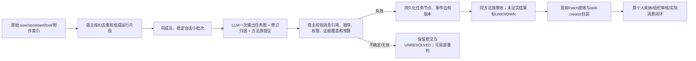

# 从真实合同会话恢复任务：LLM任务图与方法族升级方案

> **轮次040职责更正：** 本报告把任务边界、轨迹修订关系、方法族提议合在一次语义调用中讨论，容易混淆模块职责。项目现已固定十二阶段契约：第2阶段只识别任务实例/边界，第3阶段恢复事件轨迹，第4阶段决定学习与workflow聚合。当前实施与研究定义以[040全链路契约](040_twelve_stage_contract_and_task_detection.md)为准；本报告保留为历史方案及039预检证据。

日期：2026-09-26。性质：基于038真实数据及当前Demo源码的可实施科研设计；本轮没有修改Demo、调用企业数据到外部模型或证明收益。适用对象是独立Demo，后续可移植到企业Agent；不改变个人采纳、组织审核和技能消费权限。

## 结论先行

当前规则链在真实会话上确实不足：它依赖句首词识别请求、显式replyTo或简短续作词关联轨迹，再用原目标词法相似度聚类。合同审查案例同时击穿了这三处。建议让**同一个LLM批处理同时承担三项语义判断**：找出任务边界、解释回合与反馈关系、提出可复用方法族；随后由宿主核验来源ID、时间/顺序、权限、证据和预算，并构建真正的任务图。模型给出的“成功”“已生成文件”不直接变成事实。

“全部用LLM”应限定为**所有需要理解自然语言语义的判断由LLM提出**。原始消息连接、文件存在性、使用技能版本、哈希、授权和业务验收必须由确定性证据处理；把这些事实也交给LLM会降低可追溯性。不能每条消息单独调用模型，首版采用**同一成员的若干稳定会话批量一次解释**，低价值/无可用正文的材料延期而不静默删除。

## 1. 本例暴露的真实断点

来源：[038案例包](../cases/038_contract_multi_review/README.md)、[无模型预检](../cases/038_contract_multi_review/preflight.json)、当前[core.py](../../enginering/demo/skilldemo/core.py)和[learning.py](../../enginering/demo/skilldemo/learning.py)。两条生成会话共8个用户回合，供应商与委托方立场，旧包无原始replyTo。038的“原句导入”保留了用户原文，但测试视图人工增加了replyTo；本轮补测去掉这一辅助字段，现对照如下：

| 输入条件 | 识别出的轨迹 | 关联到轨迹的回合 | 候选 | 具体原因 |
| --- | ---: | ---: | ---: | --- |
| 无人工replyTo，直接按原句导入 | 1 | 1/8 | 1个单来源NEW | 7轮均为UNKNOWN意图、无目标关联 |
| 使用038导入视图的人工replyTo | 1 | 4/8 | 1个单来源NEW | 供应商后续能连回首轮；“从委托方……”未识别为请求 |
| 再仅给委托方首句加“请”诊断 | 2 | 8/8 | 2个单来源NEW | 任务已出现，但NEW聚类未合并 |

这三个条件都没有调用模型。T1/T2原始目标词法相似度0.211，低于当前0.72的聚类门槛。T1后续“6.4条是否被接受”“按折中方案单独改”“不要再输出文件”被标为UNKNOWN意图，虽然人工replyTo能连回任务，也没有表达谈判约束、策略修订、交付纠错的差别。当前`evidence()`还把任意`CORRECT`等同于`FAILURE`；这样会把输出格式纠正误当整项业务失败。历史Word文件和合同附件均缺失，实际结果仍是UNKNOWN。

由此不能只给`classify()`补几个正则。需要改变的是**任务表示**：一个任务是目标与要求在时间中的演变，关联到几次尝试、用户反馈、子问题和产物；同会话还可能另起不相干任务。NEW跨轨迹的相似性应看可迁移的工作方法及其条件，不看原请求措辞是否相像。

## 2. 建议的单一语义推断流程



### 2.1 宿主先组成“可引用事件”，不猜任务

保留原消息ID、session、稳定userId、角色、用户时间来源、原始行序、技术状态、实际附件与工具引用。去重仅依据已核实的双副本关系；用户重复提出相同问题不自动删除。对038旧包，助手时间缺失，所以只呈现“文件行序+用户时间单调+内容承接”的局部顺序证据，给模型`orderingConfidence=PARTIAL`；不允许模型输出臆造的助手时间。缺DOCX时`attachmentAvailable=false`。

真实在线记录如果有requestId、toolCallId、skill读取回执，继续按精确ID组合运行片段。源码中`import_turn()`目前没有保存源消息ID/真实时间，适配时应增加来源字段；导入时间不能冒充历史交互时间。现有原始记录、来源哈希和权限边界始终保留。

### 2.2 LLM一次输出“任务图”，而非逐句分类

输入为同一用户的稳定会话窗口及少量该用户已有任务/方法族卡片。每条用户消息恰好分配一种关系：`START`（新工作任务）、`CONTINUE`、`REVISE_METHOD`、`ADD_OR_CHANGE_REQUIREMENT`、`CHANGE_OUTPUT`、`SUBTASK`、`NEW_UNRELATED`、`CONTEXT_ONLY`、`UNRESOLVED`。模型还须写出指向的**原始消息ID**和一段真实引文；工具或助手自言自语不能独立创建用户任务。

每个任务节点记录：工作目标、交付物、我方立场、合同/对象类型、当时有效的约束、后来变化、可见尝试、输入是否齐全，以及`technicalStatus`、`userAcceptance`、`businessOutcome`三个独立状态。用户没有说满意可以完成“任务片段已稳定”，但不能据此设为`businessOutcome=SUCCESS`。缺合同全文只能给出任务意图和用户明确的方法要求，不能宣称具体条款审查完成。

模型要区分`H_goal_change`（新增约束/事实）、`H_method_error`（旧要求没被遵守）、`H_ambiguous`。038案例中，T2的“两厂区仍使用旧处置商”是晚到的履约事实；T1的“只给这一句，不再出文件”指向交付形式修正。两者不应一律记作原法律分析失败。没有足够的前后产物时可保持`H_ambiguous`，并把具体用户规则作为未验证的证据候选。

### 2.3 同次调用提出“方法族”，由宿主审查可迁移范围

LLM为每个任务给出`operation`、`methodInvariants`、`variableSlots`、`nonApplicableCases`和来源ID。T1/T2可以提出“立场参数化的重大条款审查”为**待验证的同族假设**，共同不变量是明确我方、定位条款与履约事实、按重大性和谈判约束提出最小修订；供应商/委托方、合同类型、特殊事实和交付形式是变量。不能要求模型必然把两条合并：如果共同方法仅剩“阅读合同并给意见”这种通用空话，就应保留两个窄候选或延期。

家族归并以同一owner、相同工作操作、实质方法不变量和明确变量槽为准；`合同起草`、`法规问答`、`法律意见函`虽有“合同/协议”词也不应被并入审查族。同一会话的第6轮原料市价查询要形成独立任务或只作上下文，不进入协议审查的学习池。跨成员数据不自动合并或共享；组织技能仍需用户提交与审核。

## 3. 建议的模型输出契约

单个解释调用的输出是结构化提议，不能直接改正式技能库。最小字段如下；示例只用038中的消息ID，不复制企业正文：

```json
{
  "schemaVersion": "task-graph-v1",
  "sourceHash": "由宿主提供并回显",
  "assignments": [
    {"messageId": "conv_f586a09e7356:c92a694d", "taskKey": "t1", "relation": "START", "targetMessageId": null, "evidenceIds": ["conv_f586a09e7356:c92a694d"]},
    {"messageId": "conv_f586a09e7356:829a6543", "taskKey": "t1", "relation": "CONTINUE", "targetMessageId": "conv_f586a09e7356:c92a694d", "revisionType": "NEGOTIATION_FEEDBACK", "evidenceIds": ["conv_f586a09e7356:829a6543"]},
    {"messageId": "conv_f586a09e7356:3fd7c4e3", "taskKey": "t1", "relation": "CHANGE_OUTPUT", "targetMessageId": "conv_f586a09e7356:9c165cef", "revisionType": "METHOD_ERROR_OR_FORMAT_CHANGE", "evidenceIds": ["conv_f586a09e7356:9c165cef", "conv_f586a09e7356:3fd7c4e3"]}
  ],
  "tasks": [{"taskKey": "t1", "goal": "供应商立场的重大风险审查与最小修订", "partyRole": "供应商", "inputCompleteness": "MISSING_SOURCE_DOC", "businessOutcome": "UNKNOWN", "familyHypothesis": "contract_material_risk_review"}],
  "families": [{"key": "contract_material_risk_review", "taskKeys": ["t1", "t2"], "methodInvariants": ["先确认我方立场", "对照实际履约事实", "只对有依据的重大风险给出最小修订"], "variableSlots": ["partyRole", "contractType", "businessConstraints", "outputForm"], "decision": "PROPOSE_FOR_VALIDATION"}],
  "unresolved": []
}
```

上面只示意必要结构，实际输出须覆盖给模型的**每条用户消息**，包括未用于skill的消息。引文必须是原文中存在的片段；`evidenceIds`不能只指向任务摘要。`familyHypothesis`和`methodInvariants`是模型主张，需要第二条真实任务和未来消费检验，不能因为JSON格式通过就当成真理。

### 3.1 宿主可确定性拒绝的错误

1. `sourceHash`或模型/提示版本与冻结批次不符；消息ID不存在、跨用户、跨未授权组织，或一条用户消息被分给多个任务。
2. 后续关系指向不存在的消息、明显逆时序的用户事件，或将工具/助手进度当作用户目标。
3. 提议引用不存在的原文；输入标注缺附件却声称依据了附件具体条款或已经交付文件。
4. `businessOutcome=SUCCESS`仅依据助手自述、技术`done`或一般肯定词；没有用户针对结果的接受、独立检查或可复核产物时宿主降为UNKNOWN。
5. 不同owner的轨迹被合池；NEW变UPDATE却没有实际读取的技能版本/哈希。当前历史数据按用户已确认的“无skills”只走NEW或延期。

宿主只能核验来源和一些矛盾，不能自动证明模型的任务语义或法律判断正确。模型输出不合法时保存原始批次和失败原因；有限重试仍计入预算。语义不确定可局部人工审阅或保持UNRESOLVED，不能用简单正则强行补成成功。

## 4. 对三条真实轨迹应有的行为

| 来源 | 任务图的预期表现 | 不能做的推断 |
| --- | --- | --- |
| T1供应商质量协议 | 4个用户回合归一项审查；追问接受概率属于谈判反馈，随后明确折中条款和“只给文本”的交付修正。 | 不把AI声称的修订DOCX或法律依据当已核验；不把所有反馈压成失败。 |
| T2委托方危废协议 | 4个用户回合归一项审查；贴条款和“两厂区+旧服务商”是追加事实，后一次重述不是第二项任务。 | 不在原合同缺失时确认完整修订已正确写入文件。 |
| T3受托方生产协议 | 前5轮属于审查→合规子问题→修订/格式交付的任务图；第6轮价格问题另起任务。作为时间较晚留出，只给新agent首轮输入。 | 不把T3历史回答送进技能生成，也不把无文件的首轮任务当可验证法律审查。 |

这是一组**先验案例检查**，不是让模型照着答案填表。T1/T2是否值得合成一个技能仍需审查方法不变量；T3没有附件时的第一项有效行为应是说明缺失的合同输入，不是编造审查结论。

## 5. Demo的具体改造落点

| 现有位置 | 改造建议 | 保留的契约 |
| --- | --- | --- |
| `Loop.import_turn`/`chat`/`_record` | 保存源消息ID、真实时间来源、回合到assistant片段的引用；`_record`先记事实，不立即用`classify()`决定业务任务。 | 幂等requestId、用户隔离、技术状态与原始正文。 |
| `Loop.tick` | 从稳定的**会话/窗口**排队解释，而不是只扫描已经存在的trace；这能发现当前规则遗漏的任务。 | 稳定期、迟到证据重开；过长窗口显式分段。 |
| `OpenClawAgent.run` | 新增解释任务提示与受限JSON输出；历史批次按同owner小池处理，任务边界/方法族同次输出。 | 同一真实模型与运行账本；原文只作数据，不作指令。 |
| `Store.records/events/runs` | 复用现有三表：`interpretation`与`family`记录、源hash/版本/判定日志、实际模型请求与tokens；任务仍为`trace`。 | 无需先增物理表；冻结输入与历史更正保留。 |
| `Loop.discover`/`learning.compatible` | 根据已验证任务图、方法族卡片、实际技能版本分流；替换原始目标0.72词法门槛。模型可建议延期或分成子族。 | 组大小/owner隔离、候选冻结、证据引用、NEW/UPDATE权限。 |
| `learning.evidence` | 把`revisionType`与`businessOutcome`解耦；用户改格式或新增事实不自动等于整项失败。 | SUCCESS/FAILURE/UNKNOWN三路提炼及既有Patch校验。 |

落地顺序建议：先让模型解释**离线会话→结构化任务图**，用038三个会话逐条核验；随后接入现有Store和Demo展示；再替换NEW聚类；最后才让真实生成消费读取这些结果。每次解释绑定`owner × sourceHash × modelVersion × promptVersion`，已有相同解释复用缓存。迟到反馈只重判受影响窗口并留下旧解释与候选失效记录，不整库重跑。

## 6. 资源边界：不能承诺“全LLM且一定不增调用”

当前规则任务识别和聚类的模型调用为0。改成独立LLM解释，即使按会话批量，每个被处理批次也至少增加一次模型派发；本例规则先前只创建一个可学习候选。**所以原样叠加解释服务无法满足用户既有的“模型调用至少不增加”约束。**不能拿候选数下降冒充总模型成本下降。

有两条实用实施模式：

1. **先验证语义质量的探索模式。** 每个同用户小批次一次任务图/方法族调用，然后沿用现有生成调用；逐项记录外层派发、内部模型请求、input/output/cache tokens、失败重试和人工审核。资源可能增加，本模式只用于小样本确认规则断点能否被LLM修复。
2. **预算约束的产品模式。** 把“任务图＋方法族＋Patch提议”并入原有一次`learn`派发，宿主用宽召回的本地索引组成待处理会话池，在模型返回后才建立/延期具体候选；低价值和超预算批次保留待处理。这样可以控制**外层学习派发额度**，但请求上下文更长、内部OpenClaw请求和tokens仍可能增加，需要测量后才可称“不增总资源”。同一批次不能塞入不同owner私有原文。

推荐先做模式1的离线诊断，若语义增益成立再实现模式2。不能声称两者只是切换prompt：模式2要把`discover→generate`的先后关系调整为批次解释后创建候选，并保持skill-creator封装、草稿验证和冻结版本一致。未来在线会话可研究让当前回答模型同时输出任务元数据，减少额外派发；这需要可靠侧信道和模型返回协议，不作为首版假设。

## 7. 最小可验收的研究与交付

先固定038输入，不给模型人工加的replyTo、不把留出回答放进生成。第一轮检查：T1/T2两项任务完整恢复8/8用户回合；T3独立解释时前5轮同目标、第6轮独立；所有缺合同案例`businessOutcome=UNKNOWN`；任务族可提出有条件的共同方法，但允许拒绝过宽合并。再加入同一成员的法规问答、合同起草等近邻负例，检验“凡是合同都并池”的误伤。

这只是机制校准，不是准确率结论。扩到余下81个关键词命中会话时，要以人工核对的任务实例而非227条消息作分母，并记录遗漏、错连、错切、错误合并和有效方法丢失。用相同原始材料、相同模型生成器和总资源上限比较当前规则、强会话摘要/分段基线与新任务图；预先确定合同任务的人工验收。原始DOCX不在导出中，因此首轮只能验证任务和程序性经验，具体法律条款质量须待附件及独立参考意见。

继续这条路线的条件是：语义任务图确实恢复规则漏掉的任务和修订关系，方法族归并不靠泛化空话，在后续新任务产生可检查的更好行为，并有可接受的总资源账本。若强提示的完整会话摘要同预算表现相同，应降低“新算法”主张，把任务图作为工程组件；若LLM也反复错分，应优先补事件顺序与附件证据，而非持续加大模型调用。
