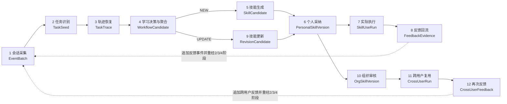
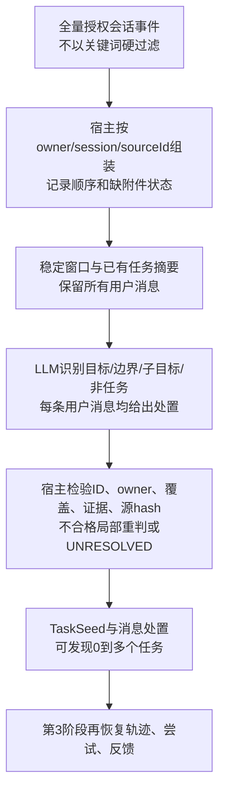

# SkillsLoop 十二阶段全链路契约与任务识别算法边界

> 2026-09-26轮次046版本说明：用户已提供[新版契约](../contracts/046_twelve_stage_contract_user_revision.md)，当前阶段责任以其第5节为准。本文保留040历史依据；逐问答对/多目标标注、阶段1配对、阶段3交错恢复及完成边界的冲突项以[046设计修订](046_revised_contract_stage2_stage3_design_delta.md)更正，不表示Demo已升级。

日期：2026-09-26。性质：项目的**固定逻辑流程与阶段交接契约**，以及基于038真实合同会话的第2阶段升级设计。十二阶段是逻辑责任，不要求十二个服务、十二张表或十二次模型调用。本轮没有修改Demo、调用外部模型或证明新算法效果。原始企业正文不在本报告中复制。

## 0. 先固定对象和贯通原则

**会话事件**是用户、Agent、工具、附件、技能读取与产物的原始可引用事实；**任务实例**是某一用户在特定输入、约束和交付目标下的一次工作；**任务轨迹**是该实例关联的有序尝试、反馈、修订和结果证据；**workflow**是多条任务轨迹中可迁移的工作方法候选；**skill**是按现有规范封装、经采纳或审批后可实际选用的版本化能力。一个会话可有多个任务，一个任务可跨多轮。一个任务的多次修订不算多个独立需求；同一workflow中的多个任务也不合并成一个任务。

所有阶段的交接对象至少携带`owner/orgScope`、稳定对象ID、源事件ID、版本/哈希、证据来源、状态和失败/未知原因。推断应当可以回查原始事件，迟到证据追加新修订，不覆盖历史。`technicalStatus`、`userAcceptance`、`businessOutcome`分开存放；没有确认可以稳定封口，但不能自动写成业务成功。没有产出skill的任务或反馈仍保留证据与决策原因。跨用户共享严格依赖个人提交和组织审核，聚合不授予权限。



图中的线表示常见路径和反馈回路，不表示每个任务必须进入下一阶段：第4阶段可以`DEFER/SUPPORT`，第5阶段可以无可采纳候选，第6阶段可以拒绝或仅选择提交组织，第8/12阶段可以没有有效改进信息。第10阶段也可接收经用户主动提交、但未安装个人库的第5阶段候选；组织版更新必须重新走第10阶段，不能由第9阶段自动覆盖。

## 1. 十二阶段责任与输入输出

| 阶段 | 唯一责任与不得越界的判断 | 输入契约 | 输出契约／下一阶段入口 |
| --- | --- | --- | --- |
| **1 会话采集** | 保存用户/Agent/工具/附件/产物/skill读用事件及原始来源；不因没有关键词而丢消息，不判业务成功。 | 在线事件或授权导出；身份、session、request/消息ID、正文、时间及来源、工具和附件索引。 | `EventBatch`：去重但不删真实重复请求的事件、源ID/哈希、顺序依据、缺失字段、访问范围；第2/3阶段可回查。 |
| **2 任务识别** | 从事件窗口发现**不同的工作目标/任务实例**，辨别新目标、已有目标的后续表达、依附子目标、非任务与不确定项；不重建执行链，不判是否值得生成skill。 | `EventBatch`及同owner少量已有`TaskSeed`摘要；用户消息为主，必要的前后Agent文本用于理解省略/指代。 | `TaskDetection`：零或多个`TaskSeed`（anchor原ID、目标、对象、约束、预期交付、候选相关消息ID、边界依据），以及**每条用户消息**的任务/非任务/待定处置；送第3阶段。 |
| **3 轨迹恢复** | 将原始消息、助手尝试、工具与产物、用户反馈按证据连到第2阶段的任务；形成要求时间线、修订关系和结果证据。可驳回第2阶段不成立的连接并请求局部重识别；不跨任务归纳方法。 | `TaskDetection`、完整`EventBatch`、运行/产物/技能读取回执。 | `TaskTrace`及`UnresolvedEvent`：taskId、各attempt/事件ID、要求版本、反馈指向、产物、实际skill ID/version/hash、技术状态、接受/业务结果及证据来源；送第4阶段。 |
| **4 学习决策与聚合（形成workflow）** | 判断轨迹是否有可迁移方法及其价值/复用机会；依据**实际技能消费回执**把未用技能的任务送NEW候选、实际用技能且有增量的任务送UPDATE、仅增加支持证据的送SUPPORT，其余DEFER。只在同owner授权域内按方法与适用条件聚合独立轨迹，不用主题词合并。 | 一条或多条冻结`TaskTrace`、个人可用技能及精确使用版本、预算、重要性/频次证据。 | `LearningDecision`＋`WorkflowCandidate`/`WorkflowPool`：动作、方法步骤/条件/变量/禁用范围、每条来源引用、缺口与延期原因、冻结源hash、UPDATE基准版本；送第5或第9阶段。workflow尚不是可执行skill。 |
| **5 技能生成** | 对NEW的workflow做有证据的成功/失败/UNKNOWN分析、提议/合并/验证方法增量，经现有skill-creator封装；不把模型说“完成了”当事实。 | NEW `WorkflowCandidate`、冻结轨迹、可用材料、预算及原封装规范。 | `SkillCandidate`：完整`SKILL.md`/辅助文件、适用边界、来源与验证等级、bundle hash、封装/草稿状态或明确DEFER；送第6阶段或提交途径。 |
| **6 个人采纳** | 记录用户对候选的自主选择：安装个人库、提交组织审核、两者都选、拒绝或搁置；只有个人采纳才写个人版本。第9阶段的个人更新也复用此门。 | NEW或UPDATE候选、候选hash、owner、用户选择行为与当前基准版本。 | `AdoptionDecision`及可选的`PersonalSkillVersion`（skillId、version/hash、owner、候选谱系）；个人版可供第7阶段选用，提交事件送第10阶段，拒绝/待定不改变已发布版本。 |
| **7 实际执行** | 在新的具体任务中选取并使用有权访问的技能，交付回答/文件，记录**选中、注入、实际读取、执行及产物**的差别。 | 新任务输入、授权技能版本及其文件、Agent运行环境。 | `SkillUseRun`＋执行事件与产物：task/run ID、skill ID/version/hash、读取回执、尝试、技术状态、交付物和可核验检查；送第8阶段。选中不等于实际使用。 |
| **8 反馈回流** | 把用户后续反馈、客观检查和运行异常关联到第7阶段的任务/产物/技能版本，区分新增要求、既有方法错误、环境失败和不明；不直接改skill。 | `SkillUseRun`、迟到会话事件、用户意见、检查与产物差异。 | `FeedbackEvidence`：来源ID、指向的attempt/产物、要求变化与归因假设、接受/结果证据；追加回第1/3阶段，再由第4阶段决定SUPPORT/UPDATE/DEFER。 |
| **9 技能更新** | 以实际用过的**精确基准版本**和有效反馈生成可审查的局部Patch；检验引用、冲突和旧能力，不无条件增版。 | UPDATE `WorkflowCandidate`、基准skill bundle/hash、相关`TaskTrace/FeedbackEvidence`、预算。 | `RevisionCandidate`：Patch、应用后的完整包、基准及新hash、验证/回退信息；交第6阶段由个人采纳，若是组织技能则交第10阶段审核。SUPPORT/DEFER没有新版本。 |
| **10 组织审核** | 用户主动提交后由授权审核人批准、拒绝或要求修改，决定是否发布组织可用版本；聚类或个人采纳都不替代授权。 | 提交事件、可检查候选/个人版本、来源及脱敏范围、审核身份、组织基准版本。 | `OrgSkillVersion`或审核拒绝：orgSkillId、version/hash、批准人与谱系、访问范围；批准后第11阶段可见。 |
| **11 跨用户复用** | 未参与生成的获准成员在新任务中实际读取组织技能并交付；记录独立任务和该成员的使用证据。 | 新用户/任务、批准的组织版本、权限、运行环境。 | `CrossUserRun`：成员、task/run、组织skill/version/hash、读取/执行/交付/检查；送第12阶段。共享的是审核后的技能包，不是原成员会话。 |
| **12 再次反馈** | 收集跨用户使用后的反馈和差异，识别角色/场景适用性及退化风险；允许无更新结论。 | `CrossUserRun`、新成员反馈、结果检查、组织版本和适用条件。 | `CrossUserFeedback`：版本绑定的反馈证据、适用域/退化线索、SUPPORT/UPDATE/DEFER建议；作为新事件回到第1/3/4阶段，组织版修订仍须第10阶段审核。 |

**两个贯通交接约束。** 第一，阶段2输出的是任务边界候选，不是“轨迹已恢复”：例如8条消息中8条均有任务处置标签，并不等于8条执行/反馈事件已正确串到一条轨迹；第3阶段负责这一核验。第二，阶段4的workflow是技能生成前的**方法中间表示**，不是第2阶段的任务标签，也不是第5阶段的SKILL.md。NEW/UPDATE属于第4阶段：历史案例按用户确认“当前无skills”，只能NEW或DEFER；助手称“技能已创建”与“请使用技能”文本不能代替真实版本读取回执。

### 1.1 最小交接对象示意

```text
EventBatch        = {owner, orgScope, sessionIds, events[{id, role, orderEvidence, contentRef, artifactRefs, skillReceipts}], sourceHash}
TaskDetection     = {sourceHash, detectorVersion, seeds[{taskKey, anchorEventId, goal, object, deliverable, constraints, evidenceIds}],
                     dispositions[{userEventId, kind, proposedTaskKey?, evidenceIds, reason}], unresolved[]}
TaskTrace         = {taskId, seedKey, sourceHash, attempts[], requirementTimeline[], feedbackEdges[], artifacts[], skillUseReceipts[],
                     technicalStatus, userAcceptance, businessOutcome, evidenceLevel, traceHash}
WorkflowCandidate = {owner, action: NEW|UPDATE|SUPPORT|DEFER, familyKey, methodSteps[], applicability, variables,
                     nonApplicableCases, sourceTraceIds[], baseSkillVersion?, sourceHashes[], reason}
SkillCandidate    = {owner, action, workflowId, files[{path, content}], bundleHash, provenance, validation, status}
SkillUseRun       = {taskId, runId, actor, skillId, version, hash, selected, injected, readReceipt, attempts[], artifactRefs[], checks[]}
FeedbackEvidence  = {feedbackEventId, targetRunId, targetArtifactId?, baseSkillHash, changeType, evidenceRefs[], outcomeEvidence}
```

以上展示对象的核心载荷；每个对象外层还必须有统一的`{objectId, owner, orgScope, revision, sourceIds, sourceHash, state, provenance}`封套，适用时加版本/hash与失败或未知原因。这些是逻辑字段契约，并非新增物理表清单。当前独立Demo的`records/events/runs`可以承载相应记录，但实现前需核对查询、版本、去重和敏感字段边界。`contentRef`优先指向受控原文；研究报告不复制正文。

## 2. 第2阶段：把死规则改为证据约束的LLM任务发现

### 2.1 当前问题恰好属于任务识别，而不只是轨迹恢复

当前Demo在`classify()`按句首“请/帮我”等词定REQUEST，`_record()`只有遇到REQUEST才新建任务；`tick()`又只扫描已经存在的trace。038案例的委托方首轮“从委托方角度……”有明确工作目标和交付要求，却未触发REQUEST，于是整项任务没有进入后续链路。去掉测试视图人工`replyTo`后，T1/T2共8轮只有T1首轮进入任务，其余7轮未关联；有`replyTo`时T1变4/8，T2仍漏；再仅给T2首句加“请”才成为2个任务、8/8。这是**规则任务发现门槛导致的漏检**，不能靠第3阶段在不存在的任务上补连线。

另一个边界也必须在第2阶段解决：T3前5轮围绕协议工作，第6轮转为原料市价查询。第6轮可能是新的信息检索任务，不能因为仍在同一会话就归入合同审查；它是否值得沉淀skill是第4阶段问题。T1/T2是两个独立任务实例；是否能形成同一多立场workflow同样由第4阶段判断，不能在任务识别时合并。

### 2.2 可实施的识别流程



1. **候选材料召回不能再靠目标词。** 在线场景对每个结束/稳定的会话窗口排队；离线导出按同owner同session组成小窗口，长会话分段并保留跨段的任务摘要和少量重叠回合。关键词、长度、向量索引可用于排序和成本控制，不能把不命中的会话永久判成“无任务”。仅有227条合同关键词命中的数据不代表全体任务分母。
2. **模型一次阅读窗口，识别零到多个任务实例。** 输入全部用户消息、与其相邻且有来源ID的简要Agent上下文、附件是否实际可用、已有TaskSeed摘要。识别标准是能否从上下文表达“要对什么对象完成什么工作，期待何种回答/决策/产物”，不要求祈使句或“请”。纯寒暄/Agent自言自语不建任务；一般知识问答可记录为信息任务或非沉淀任务，不在此阶段因低skill价值而删除。
3. **逐条用户消息给出处置。** `TASK_ANCHOR`新任务起点，`RELATED_HINT`可能属于某任务，`SUBGOAL_HINT`依附目标，`NON_TASK`无用户工作目标，`UNRESOLVED`证据不足。每个任务有`anchorEventId`、目标/对象/交付/约束、证据ID及新任务边界理由。第2阶段可以提“第3轮可能修订T1”，但不宣称已经恢复工具尝试、反馈指向或业务结果。
4. **宿主只核验可核验的事实。** 源hash/模型及提示版本一致、所有用户事件恰好覆盖一次、ID存在且同owner、anchor先于被引用后续用户事件、证据引用与原文一致、缺失附件不被说成已读。语义上的新/旧任务区分由模型提出；不合格项保留`UNRESOLVED`并局部重判，不能用正则悄悄补成成功。
5. **增量运行与更正。** 识别键为`owner × session/window源hash × detectorVersion`。同输入复用结果；新反馈到达时只重判受影响窗口及有引用的相邻窗口，保留旧判断版本和更正原因。不同owner的原文不在同一次推断中混合；模型输入只走已允许的数据处理范围。

模型判边界时使用可复用的工作标准，而非行业关键词：存在可区别的业务目的或对象时建立新`TaskSeed`；同一对象从审阅到修订、不同文件格式和后续纠正通常是一个任务的阶段，不按每个产物另起任务；在同一目的上增加约束、追问或纠正时给原任务`RELATED_HINT`；为完成原目标所需、没有独立业务交付的许可/事实核查给`SUBGOAL_HINT`；只是系统进度、寒暄或无用户工作意图则不建种子。信息检索若有清晰需求也是任务，后续能否沉淀技能由第4阶段判断。证据不足时`UNRESOLVED`优于猜测。

在038的离线材料上，首版可按三条原会话分别组成4、4、6个用户回合的窗口，每个窗口**一次**识别派发；不按14条用户消息逐条调用。上下文优先保留全部用户原文、附件可用性和相邻助手响应的来源ID；若33条助手片段使窗口超限，显式记录哪些片段未送入识别模型并保留第3阶段可回查的原始引用。长会话用重叠窗口，跨窗口按`anchorEventId`合并或保留冲突待审，不凭相似标题强合并。这里的“三次派发”只是待实施的批次计划，不是已测成本。

最小模型输出契约（示意ID来自038案例，文本为去标识摘要；完整输出必须覆盖输入的每一条用户消息）：

```json
{
  "schemaVersion": "task-detection-v1",
  "sourceHash": "HOST_SUPPLIED_HASH",
  "taskSeeds": [
    {"taskKey": "t1", "anchorEventId": "conv_f586a09e7356:c92a694d", "goal": "从供应商立场审查协议重大风险", "deliverable": "有依据的最小修订建议", "evidenceIds": ["conv_f586a09e7356:c92a694d"]},
    {"taskKey": "t2", "anchorEventId": "conv_011570125174:184a5877", "goal": "从委托方立场审查处置协议重大风险", "deliverable": "必要修订与批注", "evidenceIds": ["conv_011570125174:184a5877"]}
  ],
  "dispositions": [
    {"userEventId": "conv_f586a09e7356:c92a694d", "kind": "TASK_ANCHOR", "proposedTaskKey": "t1", "evidenceIds": ["conv_f586a09e7356:c92a694d"]},
    {"userEventId": "conv_f586a09e7356:829a6543", "kind": "RELATED_HINT", "proposedTaskKey": "t1", "evidenceIds": ["conv_f586a09e7356:829a6543"]},
    {"userEventId": "conv_011570125174:184a5877", "kind": "TASK_ANCHOR", "proposedTaskKey": "t2", "evidenceIds": ["conv_011570125174:184a5877"]}
  ],
  "unresolved": []
}
```

上例只展示结构，不是模型运行结果，且省略了其余用户事件。任务识别**不输出**`businessOutcome`、成功/失败原因、methodFamily、workflow、NEW/UPDATE或SKILL.md；这些分别属于第3、4、5阶段。任务边界的模型自报confidence不能单独决定发布，只用于挑选人工复核或局部重判。

### 2.3 用038案例核对第2阶段的交接，而非提前宣称全链路通过

| 原始会话 | 第2阶段应给第3阶段的任务种子与提示 | 此阶段不能声称 |
| --- | --- | --- |
| T1供应商质量协议，4个用户回合 | 首轮是协议审查`TASK_ANCHOR`；其余3轮均有属于该任务的`RELATED_HINT`，包含谈判约束和交付形式变化的线索。 | 已验证具体条款、已正确输出Word、4轮的所有尝试/反馈边已恢复。 |
| T2委托方危废协议，4个用户回合 | “从委托方角度……”是独立`TASK_ANCHOR`，不要求句首“请”；贴条款、补两厂区事实、重述怎么改是该任务的相关提示。 | 首轮是T1的同一个任务；晚到事实证明最初答案失败。 |
| T3受托方生产协议，6个用户回合 | 首轮是第三个审查任务；许可问题先标依附子目标；最后市价查询是另一个任务种子或待核实的新信息任务。 | 已把T3留出回答用于生成；价格问题是合同审查反馈。 |

本案例缺少原合同DOCX及历史交付文件，所以第2阶段可以识别用户工作目标，不能证明合同审查业务成功。T1/T2同一workflow是第4阶段待验证的假设，不是第2阶段的预置答案。若新识别器只在这三条精挑会话有效而对无关键词会话、合同起草和法规问答大量误判，不能称可复用。

## 3. 当前Demo与固定契约的关系

`core.py`中的`classify()`与`_record()`目前混合了第2/3阶段；`tick()`只扫描已有trace；`discover()`和`learning.compatible()`承担第4阶段却依赖首轮目标词法相似度0.72。此次**先冻结职责契约，只建议替换第2阶段的识别门槛**，不把第3阶段的轨迹关系、第4阶段的方法族判断塞回识别器。下一轮要另行定义第3阶段的具体算法和模型调用复用方式，才能真正解决7条后续消息的精确关联；仅把T2首句识别出来不等于全链条已经通畅。

模型资源方面，历史离线任务识别若使用LLM，就会比当前第2阶段的零模型调用增加成本；没有实测不能承诺“总调用不增”。可复用缓存、同owner窗口批处理、在线回答顺带产出结构化任务种子和有限重判，但都须分别记录外层派发、OpenClaw内部请求与tokens。**不能为节省调用重新把规则关键词设成漏检任务的硬门槛。**

本契约固定十二阶段的责任与交接语义；具体模型、窗口大小、存储映射和预算策略属于可迭代实现。第2阶段首先应以原始无人工`replyTo`的038输入验证：能发现T1/T2两个独立任务，且把8个用户回合全部交给第3阶段作归属核验；不能把“8条有提示”记为“8条已恢复轨迹”。
