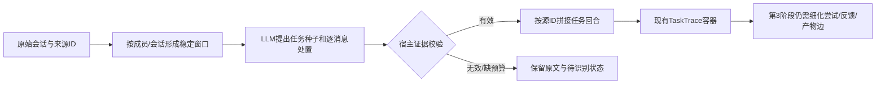

# 任务识别修正及038合同多立场案例验收

> **044数据血缘澄清（2026-09-26）：** 本报告“人工案例标注仅供运行后的核对”准确适用于`task`类别标签；但041验收脚本在导入Demo之前，已经读取`recovered_trajectories.json`里由准备脚本按原始行序预计算的用户—连续AI消息ID分组，并拼接AI正文。该分组没有发给任务识别模型，模型仍只读用户文本；它使041不能作为第3阶段自动恢复助手消息关系的证据。原叙述保留，完整输入链路见[044澄清](044_038_input_lineage_and_semantics.md)。

日期：2026-09-26。范围：独立Demo的第2阶段任务识别，以及把识别结果交给现有trace容器的最小拼接。十二阶段职责仍以[040契约](040_twelve_stage_contract_and_task_detection.md)为准。本报告不评估技能生成或业务交付质量。

## 修正了什么

旧链路先用`classify()`的句首词面规则判断REQUEST，再靠显式`replyTo`和相邻启发式拼接。038原始T1/T2八轮在**不注入人工replyTo**时只有T1首轮进入一条任务，七轮漏关联；把T2首句改成“请”才能建第二条任务。这表明任务发现门槛不能靠死规则。

真实模式现按`owner × session`取稳定用户消息，最多12轮/32000用户字符一窗。模型一次返回零到多个任务种子，并给**每条**消息标`TASK_ANCHOR / RELATED_HINT / SUBGOAL_HINT / NON_TASK / UNRESOLVED`。输入仅含经基础脱敏的用户文本、窗口别名ID和至多六个前窗任务目标，不把历史助手“已完成”声明当成功事实。模型不决定是否NEW/UPDATE、workflow、技能价值或业务结果。

宿主程序逐项核验来源hash、消息恰好覆盖一次、任务锚点、顺序、任务引用和锚点原文引文；合法提议映射回原消息ID，生成稳定task ID，再把同任务的回合拼到现有trace对象。失败、无预算或超长输入保留原始回合和待识别状态，不用规则补判；已验证且来源hash未变的会话前缀直接复用，新增在线回合只提交尾窗，不自动重复付费请求。识别与后续学习共用每日派发额度。真实模式的识别采用当前模型配置的**直接结构化HTTP请求**，每窗口一次，不启动OpenClaw工具循环；真实聊天和技能学习仍由OpenClaw执行。回放模式保留规则基线。

实现位置：[模型契约及核验](../../enginering/demo/skilldemo/detection.py)、[任务拼接与预算](../../enginering/demo/skilldemo/core.py)、[直接模型适配](../../enginering/demo/skilldemo/runtime.py)、[038验收脚本](../../enginering/demo/scripts/check_038_task_detection.py)。复用已有`records/events/runs`存储，没有新增业务表；技术状态`COMPLETED`仍与业务结果`UNKNOWN`分开。

## 038真实案例：精确任务边界

[来源案例包](../cases/038_contract_multi_review/README.md)包含同一成员三段企业会话，共70条原始消息；从已核对的原始行恢复14个用户回合。验收脚本直接读取受控原文和原消息ID，不使用038诊断导入视图中的人工`replyTo`。它只触发`tick()`中的识别与封口，没有运行`discover()`或技能生成。人工案例标注仅供**运行后的核对**，未发送给模型。

| 原会话 | 案例标注 | 最终识别及拼接 |
| --- | --- | --- |
| T1，供应商质量协议 | 1项审查，4轮 | 1任务，4轮 |
| T2，委托方危废协议 | 1项审查，4轮 | 1任务，4轮；“从委托方角度”无需补“请” |
| T3，受托方生产协议 | 审查5轮＋独立市价查询1轮 | 两个任务，5轮＋1轮；许可问题留在合同任务内 |

最终[验收JSON](../../enginering/demo/artifacts/038-detection-1790411117/038-task-detection-result.json)显示3窗`READY`、4个任务、14/14用户回合有归属、无跨会话混并、原案例各任务的**消息ID集合**与人工标注完全一致；所有任务的`verification`仍为`UNKNOWN`。旧诊断基线T1/T2无replyTo时只形成1条单轮任务；本次在选定案例上补回T2且关联了后续回合。该结果是任务**边界/归属**验收，不是合同审阅质量、轨迹事件边或workflow聚合的验收。

最终一次成功运行发起3次结构化模型请求，接口报告8626 tokens；现金费用未知，未发生学习派发。`python -m unittest discover -s tests -q`为39/39通过，覆盖来源引文/全覆盖校验、无replyTo拼接、无效模型输出拒绝、在线尾窗复用及现有回归。脚本现已进一步把验收从“回合数量”加强为原消息ID精确分组；对最终运行结果缓存复验仍一致，模型请求数未增加。

## 负结果和解释边界

迭代没有一次成功即结束。最初让OpenClaw agent循环承担第2阶段，运行发生超时和内部重试，无法维持“一窗一请求”的资源约束；随后改为直接结构化调用。在受限网络环境的直连尝试被系统拒绝，不能当模型语义失败。可用网络下的[v1输出](../../enginering/demo/artifacts/038-detection-1790410719/038-task-detection-result.json)虽覆盖14轮，却把T3许可核查另建任务；[v2输出](../../enginering/demo/artifacts/038-detection-1790410871/038-task-detection-result.json)又把同一协议的修订版另建任务，3请求报告9521 tokens。v1的tokens汇总为0是本地Anthropic usage字段归一化错误，不可作为成本数据。v3补明“依附子问题”和“同一文件审阅→修订→格式交付”的通用边界，得到上述通过结果。这些失败保留，说明单个prompt版本存在边界敏感性。

当前仅一位成员的三段合同会话，且v3规则在查看同一案例的前两轮错误后调整；不能把14/14当作泛化精度，也不能据此宣称比旧规则的**总体**误判率更低。在线尾窗复用避免重复提交已验证前缀，但对很早的任务边界重新解释仍需明确的局部重判机制。识别阶段相比原零模型调用增加3次请求、8626报告tokens；后续是否因更少无效候选抵消总资源，尚无证据。当前识别输入只有用户文本，指代或省略强依赖前一助手答复的会话可能误判；源消息时间虽保留，普通导入的排序仍依赖导入顺序。模型输入只做明显凭据/联系信息/路径/企业名遮盖，仍可能包含敏感条款语义；扩大处理范围前需明确企业数据许可和更强脱敏。附件正文和历史交付物未随导出，真实业务结果无法核验。

下一阶段应对不含合同关键词的随机会话、跨窗口长会话、非任务及多任务会话做独立标注；并在第3阶段实现可追溯的尝试、反馈、产物关系，第4阶段再验证跨任务workflow和技能价值。本轮不把第2阶段通过写作十二阶段全链路通过。
