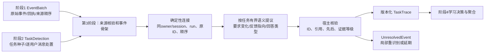

# 第3阶段轨迹恢复：遵循040契约的实现改动设计

> 轮次046更正：用户已更新[十二阶段契约](../contracts/046_twelve_stage_contract_user_revision.md)。问答配对归阶段1，阶段3可接收阶段1生成的问答对，不得把人工任务/反馈标签作为输入；原始70事件仍是端到端来源。任务候选核验、分片、证据精度及完成边界按[046修订](046_revised_contract_stage2_stage3_design_delta.md)执行。本文保留历史设计，相关冲突项不再作为实施要求。

日期：2026-09-26。性质：面向独立 Demo 的**设计稿**，本轮未修改算法代码、调用模型或运行案例验收。依据为[040十二阶段契约](040_twelve_stage_contract_and_task_detection.md)、[042源码与038案例审阅](042_trace_recovery_and_workflow_review_038.md)、[041任务识别验收](041_task_detection_implementation_and_038_validation.md)及所引源码。企业原文不复制到本报告。041实际输入的精确血缘及下述“预分组”的语义已在[044澄清](044_038_input_lineage_and_semantics.md)核对。

## 1. 设计边界和交付定义

本阶段只把第2阶段的`TaskDetection`与第1阶段的完整`EventBatch`恢复成**单个任务实例内部**可追溯的`TaskTrace`，另输出不能安全归属或连边的`UnresolvedEvent`。它回答五个问题：哪些原事件属于这项任务；Agent作过哪些可区分的尝试；用户何时改变了要求或补充了事实；反馈指向哪次尝试、哪项要求或哪份产物；现有回执能够证明什么结果。第2阶段给出的关联是待核假设，不是已经完成的轨迹。

第3阶段**不**判断某任务是否值得学习，不跨T1/T2抽象通用合同方法，不决定`NEW/UPDATE/SUPPORT/DEFER`，不生成`workflow`或`SKILL.md`。这些分别属于第4、5阶段。任务闭合是材料稳定状态；技术运行结束、用户接受和业务成功必须分开。历史AI写“已生成Word”“技能已创建”仅是文本主张。

040规定的输出核心保持不变：`TaskTrace = {taskId, seedKey, sourceHash, attempts[], requirementTimeline[], feedbackEdges[], artifacts[], skillUseReceipts[], technicalStatus, userAcceptance, businessOutcome, evidenceLevel, traceHash}`；每个对象继续携带`{objectId, owner, orgScope, revision, sourceIds, sourceHash, state, provenance}`封套。增加的`sourceEvents`、`episodes`、`recoveryStatus`和`unresolved`仅是使核心字段可审计的内部/扩展字段；不改变十二阶段责任。



## 2. 为什么当前实现不足，以及最小改动落点

| 位置 | 当前观察 | 第3阶段改动 |
| --- | --- | --- |
| `scripts/check_038_task_detection.py:24–35` | 先读取`recovered_trajectories.json`里由准备脚本**按原行序预计算**的用户—连续AI分组，再把AI正文拼成一个字段；其中的任务类别是案例标注，但未发给识别模型。原56个AI ID没有导入Demo。 | 第3阶段**验收输入改为**`private/raw_messages.jsonl`＋`source_index.json`的原事件流，让恢复器自己按源ID/行序构建回合；预整理文件仅作验收参照，不能进入恢复器。不得把预计算分组当成第3阶段自动恢复成果。 |
| `skilldemo/core.py:425–451` | `import_turn`只接一条用户＋合并助手，`started=time.time()`是导入时间。 | 新增/扩展事件级导入适配：保存源ID、角色、来源hash、sourceLine、用户时间、时间是否可信、附件可用性；保留旧`import_turn`接口，其旧数据标`PROVENANCE_LIMITED`。在线数据优先保留run/turn/tool/skill回执。 |
| `skilldemo/core.py:204–252` | `_rebuild_detected_session`按导入时间排序并拼`turns`；`SUBGOAL_HINT`退化为`CONTINUE`；现有`trace.revision`仅是存储版本，没有用户要求版本。 | 改为调用独立`recover_task`：保留原处置种类，建事件/尝试骨架、要求时间线和反馈边；`revision`只管存储修订，另设`requirementVersion`。`turns`只作为旧接口投影。 |
| `skilldemo/detection.py:69–109`及`core.py:311–324` | 第2阶段模型可给`object/deliverable`，但当前宿主只校验目标/anchor/引文，写`detection.seeds`时也丢弃了这两个字段。 | 先补类型、长度及与原证据一致性的核验，再透传种子字段和来源；不让第2阶段承担反馈归因。 |
| `skilldemo/runtime.py:96–147,172–176` | `detect`用一次结构化请求；`learn`走OpenClaw。 | 增加`recover`结构化请求目的、独立提示与输出schema；只提出语义关系。失败/超预算保留骨架和未决项，不用词法规则伪造关系。 |
| `skilldemo/store.py` | `records/events/runs`三表可保存逻辑对象。 | 首版不新增物理表。用`records`保存`source_event`/`trace`/`recovery`逻辑记录，`events`记修订，`runs`记模型调用与usage；须校验owner查询、输入大小、重跑幂等和私有内容保留范围。 |

这些是拟修改位置，不表示文件已经改变。`source_event`是逻辑记录类型，不是第四张表。对于038案例，应该直接从源70条消息建事件，再生成供第2阶段使用的用户回合投影；不能用带人工轨迹答案的视图作为第3阶段输入。

## 3. 输入规范化：先保事实，再做解释

**事件事实结构。** 每个原事件保留`eventId, owner, orgScope, sessionId, role, contentRef/contentHash, sourceLine?, observedAt?, orderBasis, runId?, turnId?, artifactRefs?, skillReceipts?, availability`。`contentRef`指受控原文；报告、普通日志和长期研究记忆只写去标识摘要与ID/hash。模型看到经授权的去敏事件窗；模型引文必须能在**实际发送给模型的文本视图**中逐字定位，宿主再由alias映射到原ID。敏感内容屏蔽不是数据库权限替代品。

**顺序不能编造。** 在线场景优先使用run/turn/message的明确序列及回执；038离线场景的用户时间可以排序用户消息，连续助手片段可按源文件行序形成局部先后，助手时间仍为`UNKNOWN`。`sourceLine`是导出行序证据，不能升级为数据库原生时间戳。若导出缺行或顺序冲突，标`PARTIAL_ORDER`并输出未决关系。`started`导入时钟仅表示何时导入。

**任务成员关系。** 逐条读取第2阶段`TASK_ANCHOR/RELATED_HINT/SUBGOAL_HINT/NON_TASK/UNRESOLVED`；先把用户事件按提议taskId放进相应候选。宿主核验owner/session/sourceHash、anchor先后与唯一归属。助手、工具、产物先依据明确run/turn关联；历史无run时只允许在同session相邻用户消息之间建立“有来源顺序支持的回合归属”，并记录关联依据。多任务交错或证据冲突时不强连。发现某条第2阶段连接与原事件相悖，输出`UnresolvedEvent(reason=TASK_BOUNDARY_CONFLICT)`并请求第2阶段局部重识别；第3阶段不自己跨任务重新命名目标。

**尝试与回合的区别。** `episode`是一次用户输入至下一用户输入之间的事件容器；`attempt`是一项基于当时要求、实际执行/回答而形成的交付尝试，可引用一个或多个episode。多个助手进度消息并非多个attempt；在038可先把每轮连续AI片段归入一个*暂定*尝试，记录`assistantEventIds`和`deliveryStatus=CLAIMED|TEXT_DELIVERED|UNVERIFIED|NONE`，再由可观察的回答内容/回执确认。只有进度无可见答案则不强造已交付attempt。新增事实发生在前一回答尚未完成时，可以仍属于同一次尝试；有新答案/修订后再开下一尝试。`attempt.status`与任务总体`technicalStatus`分开。

## 4. 语义恢复：模型提有限关系，程序拼成时间线

按**同一任务**的有界事件窗运行一次结构化语义提议：输入任务种子、保持源ID映射的用户消息、相关助手响应摘要、已验证的run/产物回执、前一要求版本、上一窗的未决关系。模型只返回源事件间的有限关系，不让它写整条最终trace。单轮任务且只有确定性关系时可不调用；多轮反馈、指代、子目标或修订才触发。长任务按重叠窗增量处理，以`taskId × sourceHash × recoveryVersion`缓存；窗口之外的目标只能指向宿主提供的前序attempt/requirement摘要。缓存不是跨owner共享。

建议的**关系类型**如下。一个用户消息可同时有多种关系，不强制单标签：

| 类型 | 含义 | 是否改变要求版本 |
| --- | --- | --- |
| `ADD_CONTEXT` | 新给条款、事实或材料，指明所涉对象/先前分析。 | 只有改变有效工作条件时才升版；单纯补证可以不升。 |
| `ADD_REQUIREMENT` / `CHANGE_REQUIREMENT` | 增加/替换业务约束、风险取舍、谈判条件。 | 是。 |
| `REFINE_METHOD` | 用户选择/改变此次解题方向；可带`goal_change / method_error / ambiguous`归因**假设**。 | 若约束改变则升；若只是纠正执行错误而原目标不变则不强制升。 |
| `CHANGE_OUTPUT` / `CORRECT_DELIVERY` | 输出格式、文件与文本、留痕方式的变化或交付纠正。 | 改变有效交付要求时是；不自动标业务失败。 |
| `ASK_SUBGOAL` | 依附于主目标的局部问题。 | 仅需记录依附关系时不升。 |
| `ACCEPT_RESULT` / `REJECT_RESULT` | 明确对某次结果的接受/否定。 | 不一定；只能据明确用户语句或检查结果记录。 |
| `UNRESOLVED` | 指向、内容或时间不足。 | 否，保留待核。 |

模型输出最小形式：`{sourceHash, relations:[{sourceEventAlias, kind, targetType, targetAlias?, requirementDelta?, evidenceQuote, attributionHypothesis?, rationale}], unresolved:[...]}`。`targetType`限`requirement|attempt|assistantEvent|artifact|task`；同一消息如“考虑成交可能性，只给修改后的6.4句子”可同时改变谈判约束与输出要求。模型不能输出`NEW/UPDATE`、方法族、skill正文或“任务成功”。不以模型自报confidence直接落事实。

宿主对每条提议逐项核验：源/目标ID存在且同owner、同任务、可见且不晚于来源；引文确在模型视图；目标attempt/产物确有前序证据；关系类型合法；同一源的互斥边不冲突；回执hash与实体一致；`SUBGOAL_HINT`不能被无理由改成独立任务。事实与解释分别保存：`relation.status=VERIFIED_SOURCE|SEMANTIC_PROPOSAL|UNRESOLVED`，`provenance={sourceIds, modelVersion, promptVersion, runId, validatorVersion}`。所谓“验证”只保证**来源和连接约束**成立，不证明法律/业务语义正确；语义仍标模型提议。

通过的`requirementDelta`按事件局部顺序编入`requirementTimeline`：初始`v1`来自任务种子及原用户请求，发生有效约束/交付变化时产生`v2...`，每版记录`effectiveFromEventId`、被替换/新增的字段和来源。材料补充而不改变要求可只登记事实；不确定是否改变要求时保留两种可能，不猜一个版本。反馈边可以指向要求、尝试、助手消息或产物；无法定位具体AI片段时允许指向前序attempt并标`TARGET_COARSE`，不能捏造精确消息ID。

结果证据由宿主合成，模型仅可提示“可能有用户确认”的原句：`technicalStatus`取运行记录；`userAcceptance=ACCEPTED|REJECTED|UNKNOWN`依原用户显式反馈；`businessOutcome=SUCCESS|FAILURE|UNKNOWN`须有定义清楚的验收或可核查业务证据。AI自称完成、导入`COMPLETED`、历史文件名、任务`SEALED`都不把结果升为成功。`artifacts`区分`CLAIMED_IN_TEXT`、`METADATA_ONLY`、`VERIFIED_FILE`、`MISSING`；`skillUseReceipts`只收实际读用版本证据，选中/注入/自称使用不能代替。用户目标更改和模型方法错误可以保留竞争归因，不把整任务强判失败。

## 5. 第3阶段输出和旧链路交接

一条trace的逻辑样例如下；ID与内容均为结构示意，不是已运行输出：

```json
{
  "objectId": "task-…", "owner": "alice", "orgScope": "…", "revision": 2,
  "sourceIds": ["原消息ID…"], "sourceHash": "…", "state": "RECOVERED_PARTIAL",
  "provenance": {"detectionVersion": "task-detection-v3", "recoveryVersion": "trace-recovery-v1"},
  "taskId": "task-…", "seedKey": "…", "traceHash": "…",
  "attempts": [{"attemptId": "…", "requirementVersion": "v1", "userEventIds": ["…"],
    "assistantEventIds": ["…"], "runIds": [], "deliveryStatus": "UNVERIFIED", "technicalStatus": "COMPLETED"}],
  "requirementTimeline": [{"version": "v1", "effectiveFromEventId": "…", "delta": "初始目标与交付", "evidenceIds": ["…"]}],
  "feedbackEdges": [{"sourceEventId": "…", "kind": "CHANGE_OUTPUT", "targetType": "attempt",
    "targetId": "…", "targetPrecision": "COARSE", "evidenceIds": ["…"], "semanticStatus": "PROPOSED"}],
  "artifacts": [{"claimEventId": "…", "availability": "MISSING", "verified": false}],
  "skillUseReceipts": [], "technicalStatus": "COMPLETED", "userAcceptance": "UNKNOWN",
  "businessOutcome": "UNKNOWN", "evidenceLevel": "SOURCE_LINKED_UNVERIFIED",
  "recoveryStatus": "PARTIAL", "unresolved": []
}
```

输出状态建议`READY`（核心关系和来源可回查）、`PARTIAL`（有未决边/缺产物但事实可保存）、`DEFERRED`（关键来源或预算缺失）、`INVALID`（来源冲突）。缺历史合同文件并不必然使整个轨迹`DEFERRED`：要求变化仍可恢复，但文件和业务结果必须未知。`UnresolvedEvent`至少给`eventId, proposedTaskId?, reason, missingEvidence, sourceIds, retryScope`，供局部重识别或后续补证。

为兼容现有Demo，`trace.turns`、`verification`、`hash`可由新证据对象**单向投影**，但`intent=CONTINUE`不能再代表所有反馈，`intent=CORRECT`也不能代表整任务失败。阶段4目前仍依赖这两个旧字段；因此第3阶段完成后必须在交接口加`schemaVersion/recoveryStatus`检查，并在第4阶段升级前**禁止把新trace自动送入旧学习决策产生候选**。这是保护交接的最小门禁，不在本阶段实现新的学习/聚合算法。未来阶段4应直接读`feedbackEdges/requirementTimeline`。已有候选引用旧`traceHash`时，迟到事件产生新trace revision并使候选过期，历史版本保留。

## 6. 038案例的可检查预期

这里列的是**设计验收预期**，不是模型运行结果。T1/T2可用于后续生成；T3是较晚留出，本阶段可诊断其边界，但其历史回答不得进入生成输入。

| 任务 | 应恢复的边与时间线 | 不得写出的结论 |
| --- | --- | --- |
| T1供应商协议，4用户回合 | 首轮审查要求为v1；`829a6543`指向先前6.4意见，提出成交/关系约束；`9c165cef`选择折中方案，形成新的工作约束/尝试；`3fd7c4e3`纠正只需条款文字的交付形式。把原33个AI事件ID保留下来，分到相应episode/attempt。 | 谈判追问≠首稿业务失败；历史Word声明≠文件存在；最后有回答≠用户已验收。 |
| T2委托方协议，4用户回合 | 首轮为v1；`cabf77ef`提供排他条款文本；`60c67d46`提供两厂区和旧服务商事实，改变该条款审查条件；`4f5e3bf2`要求据此明确修改。原7个AI事件ID可回查。 | 晚到事实≠先前答案已被证明错误；同主题≠与T1同一任务。 |
| T3受托方协议，前5用户回合 | `5bb6ece8`保留`SUBGOAL_HINT`的许可问题；后续修订版、Word、留痕版记录为同一任务的要求/交付阶段；原AI事件仍保留ID。 | 不把历史AI回答泄漏给038技能生成；不凭文件名认定交付。 |
| T3末轮`74cd5639` | 独立价格查询任务，可有单回合轨迹；与协议任务间无反馈边。 | 第3阶段不擅自判其`DEFER`或NEW。 |

验收脚本应在**不读取人工轨迹标签作为输入**的情况下核查：70/70原事件可追踪，14/14用户事件各有第2阶段处置，原56个AI ID未丢失且没有被当作56次独立尝试；T1/T2/T3上述关系有可引用来源，价格任务没有跨任务边；缺失DOCX与历史交付物被标缺失，四任务业务结果仍UNKNOWN。再覆盖无回复、明确replyTo、同任务多run、技能只选中未读取、迟到反馈、缺附件、顺序冲突、模型输出越权/缺引文和预算耗尽。软件验收只验证恢复器及证据约束，不等于合同法律质量或论文效果。

## 7. 实施顺序与资源约束

1. **P3a 事件底座。** 从原70事件而非人工轨迹导入；给在线/历史数据统一来源ID、顺序依据、缺失字段和实际回执；确定性建episode/暂定attempt。此步可先用软件测试验证70/70保真，不请求模型。
2. **P3b 语义连边。** 给多轮任务按稳定窗运行有限关系提议，宿主验证ID/引文/时间/同owner后拼要求时间线和反馈边；无效输出或预算不足留`UnresolvedEvent`。不得回退关键词“猜修订”。
3. **P3c 版本与交接。** 持久化trace修订和未决项、缓存相同sourceHash、迟到证据使旧候选失效；旧`turns`作兼容投影，第4阶段接入前设schema门禁；运行038验收脚本输出无正文摘要和真实请求/tokens账本。

资源上，阶段3相对当前零语义恢复调用**可能增加模型请求**，不得先承诺“总调用不增”。先用确定性索引处理run、ID、顺序、回执，只给需要语义判断的多轮任务调用；共享现有`detect/learn`日额度并另记`recover`目的、内部请求与tokens，预算不够保存证据等待处理。若未来考虑把阶段2/3合并成一次物理模型请求，也必须保留两个独立的输出契约、来源核验和失败状态，先比较准确性与总tokens，再决定是否替换；不能因省调用把任务识别与轨迹恢复逻辑混为一层。

**完成标志**是第3阶段给第4阶段一条可核查、能表达目标变化与反馈指向的`TaskTrace`，并诚实标注未知。它本身不会让T1/T2自动聚成workflow，也不会减少无效skills；这要等第4阶段选择性学习与方法聚合及后续验证。
