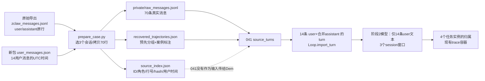

# 038真实案例：原始输入、041实际模型输入与字段语义

日期：2026-09-26。性质：对041任务识别验收和043轨迹恢复设计的数据血缘澄清；仅核对本地文件和代码，未重新运行模型、改动Demo算法或复制企业正文。

## 结论先行

**最初的企业消息源**是`C:/Users/39835/Downloads/zkys-raw-export-20260925/zclaw_messages.jsonl`。038案例从其中逐字节抽出了三个指定会话的70条消息，保存为`research/cases/038_contract_multi_review/private/raw_messages.jsonl`。另一份`C:/Users/39835/Downloads/zkys-skill-mining-20260925/user_messages.json`按相同用户消息ID补足14条用户消息的UTC时间，并辅助筛选；它没有AI回复。[抽取代码](../../research/cases/038_contract_multi_review/prepare_case.py)第54–105行、[manifest](../cases/038_contract_multi_review/package_manifest.json)可核对。

**041验收中Demo实际接收的输入并非70条原事件。** [验收脚本](../../enginering/demo/scripts/check_038_task_detection.py)先从`raw_messages.jsonl`读正文，又从**已经构建好的**`recovered_trajectories.json`读“某用户消息后接哪些助手消息”的ID列表，拼成14条`{user, assistant}`回合，再逐条调用`Loop.import_turn('alice', turn)`。任务识别模型随后只收到这14条回合中的**用户文本**，按三个会话分成3个窗口；AI正文、人工任务标签、生成/留出标签均未作为模型消息发送。这次验收因此证明第2阶段用户任务边界，而不证明第3阶段能从70条原事件自动恢复助手消息关系。

## 文件与变换的精确链路



| 文件 | 来源和当前作用 | 语义边界 |
| --- | --- | --- |
| [原导出`zclaw_messages.jsonl`](C:/Users/39835/Downloads/zkys-raw-export-20260925/zclaw_messages.jsonl) | 企业只读导出，含用户、AI、系统消息；全包46,407行，客户端UUID与`conv_*` trusted副本并存。 | 原数据按消息粒度，不含任务/回合真值。038只选`conv_*`三个会话的行，不能把全包行数当独立任务数。 |
| [新包`user_messages.json`](C:/Users/39835/Downloads/zkys-skill-mining-20260925/user_messages.json) | 含用户侧ID、session、正文、UTC日期；038按ID与旧包对齐。 | 时间只补**用户**事件；不产生AI时间或AI回答。`messages_clean.json`只用于关键词桶筛选，不替代原始短反馈。 |
| [038原消息子集](../cases/038_contract_multi_review/private/raw_messages.jsonl) | 70条原行：供应商会话37条、委托方11条、受托方22条；共14 user、56 assistant。 | 是本案例可回查的最早**选定消息层**输入。正文是真实来源，附件二进制、全量tool/toolResult未随包提供。 |
| [来源索引](../cases/038_contract_multi_review/source_index.json) | 由原行派生ID、角色、原导出行号、原行/正文SHA256、用户时间、payload键。 | 元数据/核验依据；原导出行号支持本案例局部先后，不是AI消息时间戳。041脚本未把它输入Demo。 |
| [预整理轨迹](../cases/038_contract_multi_review/recovered_trajectories.json) | `prepare_case.py`按原行序，把每个用户消息后直到下一用户消息前的连续AI消息ID预先放入一组；另写`task`、`split`、`businessOutcome`等案例标注。 | **混合文件**：助手分组由确定性代码预计算；`contract_review/out_of_scope_market_price`及生成/留出属于研究案例标注。041取它的ID分组构造输入，但没有把`task`标签发给识别模型。 |
| [旧生成导入视图](../cases/038_contract_multi_review/private/demo_generation_import.jsonl) | 仅前两会话8回合，助手文本已合并，后续回合带人工`replyTo`。 | 用于038旧链路诊断，**041验收没有读取这个文件**。兼容视图还给一条原句加过“请”，更不能当原文。 |

## 041到底怎么输入

在[脚本第24–35行](../../enginering/demo/scripts/check_038_task_detection.py:24)，`messages = {原ID: 原始消息}`先读取70行。它接着迭代`recovered_trajectories.json`的14个预分组回合，用`userMessageId`取一条原用户正文，用`assistantMessageIds`取连续AI正文并以空行拼接。传入`import_turn`的每条数据含：

```text
session              原会话ID（三选一）
requestId            原用户消息ID，用于生成稳定的Demo turnId
sourceUserMessageId  原用户消息ID，用于结果回查
sourceTimestamp      新包提供的该用户UTC时间
user                 原用户正文
assistant            本回合若干原AI正文拼接成的一段字符串
status               人为映射的COMPLETED技术状态
```

脚本**没有传`replyTo`**、原AI消息ID、原`sourceLine`、原附件文件或真实runId。`import_turn`把每条记录存为一个Demo `turn`，内部`started/ended`写的是**导入时刻**，不是历史交互时间。[代码](../../enginering/demo/skilldemo/core.py:425)可核对。

随后`loop.tick()`触发`detect_pending()`。[模型输入构造](../../enginering/demo/skilldemo/detection.py:55)只把每个turn的`user`基础脱敏后写成`messages:[{id:u1, user:...}, ...]`，再给至多六个前窗任务目标；本案例三会话各一窗，共3次结构化请求。模型看不到`assistant`字符串。注意`sourceHash`计算包含turn里的assistant文本，用来感知源变化，**这不等于AI正文已发送给模型**。模型输出任务种子及每条用户消息的`TASK_ANCHOR/RELATED_HINT/SUBGOAL_HINT/...`归属，宿主核验后映射回原用户ID。最终14/14归属、4个任务实例；验收脚本运行后才用`recovered_trajectories.json`里的`task`标注比较ID集合。[041报告](041_task_detection_implementation_and_038_validation.md)的结果只在这个范围内成立。

## 源字段分别意味着什么

| 字段/数值 | 可以说明 | 不能说明 |
| --- | --- | --- |
| `id` / `sessionId` / `role` | 原消息身份、所在会话、发言方；可连接同一会话内事件。 | 同会话一定同任务；消息ID后缀一定是可信时间或序号。 |
| `content` | 用户需求、反馈或AI文本声明的原始材料。 | AI声称“已生成文件/技能”就真的完成。 |
| `status=done`（原导出）及导入`COMPLETED` | 消息记录或导入回合技术上结束。 | 用户满意、合同审查正确、文件真实存在、业务成功。 |
| `createdAt/updatedAt={}`（旧包） | 在本次导出中不可用。 | 精确的历史AI时间；不能用导入时间补造。 |
| `created_at`（新包用户侧） | 可按原ID为14条用户消息提供UTC时间。 | AI消息或工具事件的时间。 |
| `sourceLine` | 三个选定会话里原文件行序及局部前后关系；本案例用户行序与用户时间递增一致。 | 全量企业会话都有可靠顺序，或它是正式数据库时间字段。 |
| `rawPayload.files` | 用户提交过附件的文件名/路径等元数据。 | 合同DOCX正文已经可读；历史Word/PDF交付文件已经验真。 |
| `assistantMessageIds`（预整理文件） | 原AI消息的可回查ID与本地行序分组。 | 56次独立尝试或56个最终答案；当前Demo也没有保存这些ID。 |
| `task` / `split`（预整理文件） | 本研究案例的合同/市价标注与前两会话生成、后一会话留出安排。 | 原始数据库的标签；阶段2模型自行读到了这些标签。 |

因此，最准确的说法是：**041用真实企业原文做了任务识别测试，但在进入Demo前，准备脚本已经按行序完成“用户—连续AI消息”的机械分组；其任务类别标注没有给模型。** 043要求的第3阶段独立验收，必须让恢复器从`raw_messages.jsonl`及来源索引读取消息级事件，自己建立这些组并保留56个AI ID，再恢复要求变化、反馈目标和产物证据。缺合同正文/历史交付物只限制产物及业务结果判定，不妨碍记录真实的会话文字和修订线索。
