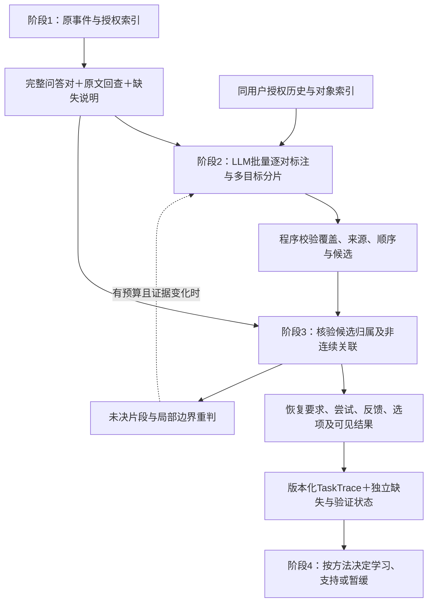

# 新版十二阶段契约下：任务识别与轨迹恢复的设计修订

日期：2026-09-26。范围：新版契约对照、当前源码核对与设计建议。本轮没有修改 Demo、调用企业模型、生成技能或运行新验收。全文不复制企业会话正文。

## 1. 结论与当前依据

需要修改两个阶段的输入、输出和交接，保留“LLM 提出语义判断，程序核验来源并组装”的路线。最重要的调整是：**阶段1正式负责问答整理；阶段2逐对标注候选任务和关联线索；阶段3核验同任务归属并恢复跨回合、非连续的经过。** 问答配对本身不再是阶段3的验收目标。

当前约束以用户提供的[新版契约第5节](../contracts/046_twelve_stage_contract_user_revision.md)为准；[040](040_twelve_stage_contract_and_task_detection.md)与[043](043_trace_recovery_stage3_implementation_design.md)保留为历史设计，本报告明确修正其冲突项。新版十二阶段数目不变，具体字段和算法建议以下述“建议”标识为准，并非用户已经逐字段批准。

来源文件为 `C:/Users/39835/Desktop/SkillsLoop_十二阶段契约_完成与边界改写版.md`。项目内保存逐字快照，SHA256：`8ed46337cdac3e288341fa70f4554dc657bcddbf22e6663e93fa7547e9f5650a`。

新版文档同时包含另外一次审阅的交付叙述。其“已完成D1”“B/C本次无正文”等属于该次审阅的上下文，不能自动变成本地 Demo 的状态。本轮只采纳其契约要求，不将其技能候选交付描述当成已核验的本地运行事实。重新计数本地 `038/private/raw_messages.jsonl`：A有37条正文、B有11条、C有22条，合计70条，均非空；C继续作为留出材料隔离。本轮计数不构成对B/C业务内容的新语义验收。

## 2. 前后对照与改动优先级

| 项目 | 当前实现／043设计 | 新版需要的修改 | 优先级 |
| --- | --- | --- | --- |
| 问答配对的责任 | 043要求阶段3从原始70事件自己构建回合 | 阶段1输出有来源的完整问答对；阶段3接收问答对及可回读的原始事件 | 必改 |
| 阶段2模型输入 | `detection.prepare()`只发送user正文；assistant参与来源hash但未发送 | 发送可读user与assistant上下文、材料缺失说明、必要的授权历史；助手文字用于消歧，不自动成为用户目标或事实 | 必改 |
| 阶段2输出单位 | 每条用户消息恰好一个处置、一个taskId | 每个问答对恰好一份标注，内部允许多个目标片段、多个候选和未决片段 | 必改 |
| 关联类型 | 开始、相关、子目标、非任务、待定 | 显式区分开启、继续、返回、子目标、非任务、待定；保留前文引用依据 | 必改 |
| 任务实例标识 | task ID取owner/session/anchor turn；同一用户回合只能安全创建一个实例 | 同对多目标要有稳定的片段起点ID和实例谱系，避免两个新任务得到同一个ID；保存对象和交付条件 | 必改 |
| 历史上下文 | 最后6个种子的目标摘要；缺前文回答和最近承接位置 | 有界检索同用户可用历史，包含对象、上次承接、必要原文；检索遗漏标待定，不因不在尾窗就新建 | 必改 |
| 阶段2到3 | 宿主按taskId直接组装trace，相关和子目标都压成CONTINUE | 独立保留候选标注，阶段3核验成员关系、歧义与依赖，不能把候选当最终结果 | 必改 |
| 阶段3处理顺序 | 043先按候选taskId分桶，再任务内语义恢复 | 先核验跨片段的候选关联；有歧义时保留相关候选上下文，再分任务恢复；新增目标冲突回阶段2局部重判 | 必改 |
| 要求与反馈 | 043有要求版本，但把Q2描述为提出新约束，未具体表达选项关系 | 区分追问、选方案、增加条件、改变交付；补备选/并用/未决及作用范围；追问不自动升要求版本 | 必改 |
| 证据精度 | 043侧重原始eventId；当前Demo丢原AI ID | 有原JSONL时精确引用消息；只有合并正文时降到pair/span，保留ID列表但不猜句子到ID的对应 | 必改 |
| 阶段3完成条件 | 043把缺产物也列入PARTIAL原因，可能与恢复质量混在一起 | 分开会话覆盖、产物可用、业务验证和恢复进度；缺文件不自动令会话恢复未完成 | 必改 |
| 第4阶段交接 | 043拟用schema门禁阻止新trace进入旧解释器 | 保留版本兼容检查，增加能消费新证据的最小适配；有依据的局部方法可交接，不要求两条trace或业务成功 | 必改的相邻交接 |
| 可保留部分 | LLM抽取、宿主核验、预算、缓存、trace修订、UNKNOWN、权限、原三表 | 继续沿用，扩展覆盖到问答分片和上下文依赖 | 保留 |

源码依据：[detection.py](../../enginering/demo/skilldemo/detection.py)第14—25、55—66、69—109行；[core.py](../../enginering/demo/skilldemo/core.py)第204—245、311—324、425—451行。当前源码没有专门区分RETURN，不等于已经证明它不能关联任何A-B-A；实际问题是缺显式输出、充分历史上下文和相关验收。

## 3. 阶段1需要提供什么，才能让2、3成立

建议新增逻辑对象 `QAPair`，可由现有records保存，不要求新增物理表：

```text
QAPair = {
  pairId, revision, owner, sessionId, purposeSplit,
  userSourceRef,
  assistantSegments[{sourceRef, contentRef, contentHash}],
  orderEvidence, pairingBasis, contentStatus,
  attachmentAvailability, receiptAvailability, sourceHash
}
```

`sourceRef`在原事件可用时指向message ID；只有合并正文时指向pair中的文本块和片段。合并字符串只是显示/模型视图，不能替代原始分段存储。新契约说的“完整”应相对于当前可用会话快照说明，不能推断导出外没有遗失消息。

阶段1通常按“用户一次发言→下次用户发言前连续助手回复”配对；真实run/turn引用发现晚到回复时，要按可靠来源关联，或者保留顺序冲突，不能机械挂最近用户。重复导入用源ID/hash去重，用户真重复的话保留。只有索引无正文或尚无回复的对象显式待补，不能用空答案伪装完整；其他完整问答对继续处理。

**对043的明确更正：** 端到端验收仍从原始70事件出发，但配对在阶段1完成。阶段3的隔离验收可以合法使用阶段1产生的14对，前提是没有人工任务归属、反馈边或旧人工replyTo。`recovered_trajectories.json`混有案例标签，不能整份当运行输入；它可作已有索引的对照，不能未经独立标注就当权威真值。

## 4. 阶段2：逐对识别、候选关联、保留多目标

### 4.1 输入和输出的最小变化

模型需要看到成对的用户与助手内容，以及消歧需要的前文。用户说“照第二个方案做”时，仅发送用户文本和旧任务标题不足以理解“第二个方案”。助手提出了新建议，也不能单凭该建议创建用户尚未要求的新任务；用户采纳、追问或引用才提供相应意图证据。

建议的输出结构：

```text
PairTaskAnnotation = {
  pairId, pairRevision, annotationRevision, sourceHash,
  fragments[{
    fragmentId, sourceSpans, workIntent,
    kind: OPEN | CONTINUE | RETURN | SUBGOAL | NON_TASK | UNRESOLVED,
    candidateTasks[{taskRef, relationHint, evidenceRefs}],
    referenceHints[], uncertainty
  }],
  uncoveredOrUnresolvedSpans[], contextRefs[], taskSeeds[]
}
TaskSeed = {
  seedId, anchorPairId, anchorFragmentId,
  objectRef, goal, expectedDeliverable, constraintHints, evidenceRefs
}
```

这是一份建议的schema，不要求字段名照搬。核心约束是：**4个问答对输出4份标注，一份标注可以有多个片段；片段再关联任务。** 一个片段也可以保留两个待核候选，但不把同一句话自动算作两个完整执行实例。没有正文属于输入缺失，不能输出NON_TASK；有实际工作目标但可能不值得学，也不能因此输出NON_TASK。

例如同一对中“改合同甲的某条；另外写一份通知”，应分成两个目标片段。同一用户回合若新开两个目标，当前只以anchor turn构造task ID会发生碰撞，须以稳定片段身份区分。重分片时保存旧新片段/任务的修订谱系，不能单凭模型改写标题制造新任务。

### 4.2 程序和LLM的分工

1. 程序准备授权范围内的完整问答序列、原文映射和历史候选。对象ID、文档ID、真实显式引用可作索引；词面检索可召回，不能以未命中永久排除任务。
2. LLM在一个有界窗口中批量标注所有问答对，识别具体对象和意图，区分继续与返回，输出引用线索。**逐对标注不等于逐对调用模型。**
3. 程序核对pair覆盖、片段范围、ID、顺序、授权、引文、schema和候选是否存在；保留未决项。校验来源不等于证明语义判断正确。
4. 程序保存候选标注，交给阶段3；不在这里恢复attempt、判成功、决定NEW/UPDATE或生成workflow。

RETURN表示中间有别的任务后回到已有具体任务，不能把普通连续追问都标RETURN。历史召回需记录哪些原文确已读取；指代目标没找到时保留UNRESOLVED，不因缺召回结果另造任务。先覆盖同会话A-B-A；跨会话返回依赖授权的历史和具体对象/续接证据，不靠“都是合同”合并。

## 5. 阶段3：先核验成员，再恢复要求和修订

### 5.1 关联核验必须发生在最终按任务分组之前

阶段2的候选关联保留原样；阶段3基于正文、具体工作对象、明确引用和执行证据决定其是否成立。原043的“每个候选task分桶后独立解释”要调整：有歧义的片段若先硬分桶，相关另一个任务的证据会丢失。

建议先输出成员决议 `CONFIRMED / UNRESOLVED / BOUNDARY_CONFLICT`，其中CONFIRMED仅表示当前证据下采纳的关联解释，仍记录依据和判断来源。明确属于同一任务的非连续片段按来源顺序合并；共同使用一个文档但服务不同目标时，保存依赖关系，不合并任务。新发现独立工作目标或旧边界冲突，反馈到阶段2局部重识别，记录变化原因，避免两阶段循环无上限重跑。

每个目标片段都必须有归属或未决记录；一对含多个目标时按片段进不同trace，保留共同pair来源。助手响应若不能准确分到两个任务，记录共享上下文或未归属内容，不把整段回答复制成两次已完成工作。

### 5.2 恢复的结构及新增内容

| 输出内容 | 设计要求 | 在本案例中的作用 |
| --- | --- | --- |
| 有序成员和引用 | 保存pair/fragment、原事件、来源顺序与关联依据；支持非连续成员 | 同任务回归后续接，其他任务不混入 |
| 要求时间线 | 区分问问题、加事实、选方向、改约束、改当前输出；记录生效位置与作用范围 | Q2追问已有建议不自动变成新约束；Q4只作用于本任务当前交付 |
| 尝试和回答 | 保留实际可见回答；进度、计划、声称执行、真实工具回执分开 | 22条助手进度不等于22次已核验操作，也不机械等于22个attempt |
| 反馈指向 | 可指向任务、前文建议、回答片段、要求或产物；允许粗粒度且标明 | Q2指向Q1的特定建议；Q4指向Q3的交付方式 |
| 选项关系 | 记录备选/并用/未决、用户选择、助手实际采用及二者差异 | Q3引用备选表达，回答却组合两种限制：保留待确认差异 |
| 可见方法内容 | 保存有引用的本次操作顺序、显式工作约束及发生的修订 | 为阶段4提供方法材料，但不在此泛化为通用workflow |
| 文件和文本差异 | 文件有字节/版本时才做真实差分；只有文本则比较可见文本，文件只记声称 | 文档v2、trace revision与skill version各自独立 |
| 局部异常 | 助手说校验失败/已修复分别是报告的异常/修复；独立工具回执另记 | 不把自述修复当作已验证失败规避方法 |

原043的关系类型可保留并扩充 `ASK_ABOUT_PRIOR_ADVICE`、`SELECT_OPTION`、`OPTION_RELATION_UNRESOLVED` 等有限类型；不需要为每种行业单独定标签。用户追问不会自动改要求版本；接受某个方向不会自动验证其中专业事实；只纠正输出形式不会等于接受全部实质内容。

新增要求应带 `scope` 和 `effectiveFrom`，例如“当前任务的当前交付”。旧要求不删除，明确被替代的是哪个维度。系统可以保存“是否属于纠错”的竞争解释，不能强制选择“新需求”或“方法错误”来制造干净标签。

### 5.3 证据精度随实际输入变化

原JSONL可回读时，以消息ID和消息内片段定位；只有045合并正文时，以pair/文本块/片段定位，同时保留原助手ID列表，但不能猜某句话来自其中哪个ID。宿主校验应对实际发送模型的文本视图做逐字定位，再映射回受控来源；脱敏改变字符位置时必须保存映射，不能直接拿脱敏offset定位原文。

因此“必须有56个AI消息的精确语义映射，否则整个恢复失败”不应成为所有输入的普遍门槛。**对本地038原始70事件模式，56个AI ID保真仍是应达到的验收项；对只有合并正文的模式，应允许按真实精度交付。** 时间同理：只有局部顺序就只记录局部顺序，不补造AI时间。

### 5.4 完成与边界：分开四种状态

建议将之前混合的READY/PARTIAL拆成独立维度：

```text
recoveryProgress       已处理 / 部分待判 / 暂缓
conversationCoverage   当前可用快照的覆盖及缺失
artifactAvailability   各附件/产物的可用状态
verification           技术回执、用户接受、业务结果分别记录
```

阶段3做到“可见片段有归属/未决，重要关系有来源，变化和现有结果可说明，缺失明确”即可形成可交接版本。缺历史合同或Word字节只限制相关文件事实；业务UNKNOWN只限制成功主张。它们不会自动令已整理的会话关系失效，也不会要求用户额外点击完成。

任务材料稳定可以封一个快照，不能写成业务完成。后续原文、反馈或文件到来，重判受影响片段/关系、追加trace版本，并标记依赖旧证据的候选需重新核对；保留历史，不无条件重跑所有会话。

## 6. 四回合案例的新预期输出

下表为按新版契约作出的**参考解释**，不是新模型输出或独立标注真值。

| 问答对 | 阶段2应交付 | 阶段3应恢复 | 保留的未知 |
| --- | --- | --- | --- |
| Q1 | OPEN；具体协议审查任务A，明确立场、尺度及文件交付目标 | 建立初始要求；记录可见审查文本，文件操作声称与真实产物分开 | 原合同内容完整性、文件存在与正确性 |
| Q2 | CONTINUE A；引用Q1特定建议，追问适用性与合作影响 | 连到前文建议；记录讨论与备选，不仅因追问就增要求版本或判首稿失败 | 专业判断和接受概率真实性 |
| Q3 | CONTINUE A；选择方案方向并要求局部重拟 | 连到Q2选项，记录局部修改目标；保留“备选表达→组合输出”的待确认差异，以及额外文件处理声称 | 并用是否获用户批准、专业有效性、文件真实性 |
| Q4 | CONTINUE A；明确当前只要文本，关联Q3交付 | 更新当前交付要求，记录对话中可见结果；不改成永久个人偏好 | 用户对实质内容的接受和业务成功 |

这个session没有自然A-B-A，因此最多验证四回合内部关联与修订恢复。增加一段明确标注为构造的任务B，可用于功能测试“Q1(A)→B→Q2(A)”，但不能当真实自然交错效果。跨用户复用、技能使用后更新同样不能从本次历史四回合推出。

## 7. 两阶段与后续学习的贯通



首版可继续复用`records/events/runs`，把pair、片段标注和trace恢复结果作为逻辑类型。第3阶段只整理本次方法内容；将其抽象为可复用步骤、设置适用条件、选择NEW/UPDATE/SUPPORT/DEFER仍由第4阶段完成。

新trace至少向后传递：正文覆盖、具体要求的作用范围、可见文本与助手声称的区别、方法出处、未决选项、真实技能使用或可信历史无技能前提。空`skillUseReceipts`不能单独等于没用技能；本案例有用户确认的历史无skills前提，应带来源传递。合同第二稿不是skill第二版。

当前下游已允许UNKNOWN中的`USER_RULE`提议，不能说完全没有UNKNOWN通路。但[learning.py](../../enginering/demo/skilldemo/learning.py)第41—60行仍从`CORRECT`推整任务失败，第105行用全轨迹UNKNOWN阻止`OBSERVED`提议，且缺“文字行为可观察、业务效果未知”的细粒度表达。需增加按方法证据范围的最小适配；不得把所有助手自述改标OBSERVED来放行。

043的schema保护仍有必要，目标应是接通理解新证据的消费者，而非长期把全部新trace挡住。若暂未适配，可先导出完整可审阅trace并明确阶段4未接通；不能以“阶段3待补附件”为理由掩盖消费者不兼容。

## 8. 建议实施顺序与验收变化

| 次序 | 建议改动 | 应交出的证据 |
| --- | --- | --- |
| P0 | 固定阶段1配对和来源层，补原助手ID、源顺序、用途与缺失 | 038原70事件→14对，56助手ID可回查；没有人工任务答案或replyTo |
| P1 | 升级阶段2输入、逐对分片schema、种子保存和历史召回 | A的4对有4份标注；多目标、返回、对象区分和未知均可表达；关联仍标候选 |
| P2 | 实现阶段3成员核验、有限关系恢复和版本化输出 | 可见要求/反馈/修订链及引用；阶段2错连可被拒绝；缺附件不冒充未发现任务 |
| P3 | 接入第4阶段最小证据适配与按方法处理 | 明确工作约束能进入候选判断，未核专业事实被单列；不要求凑第二条trace或成功标签 |
| P4 | 更新038验收及独立小案例 | 分别报告阶段1、2、3通过项；后续技能包/消费另行验收，不报十二阶段全通过 |

需要的最小验收覆盖：

- 原始038：检查每对标注、原消息覆盖、四回合关联与选项差异，保留缺文件、接受未知与业务未知；B正文从本地回读，C留出不进生成。
- 单对两目标：必须分片、两个任务ID不冲突、助手内容不能无依据全量复制到两任务。
- 同主题不同对象：合同甲和乙分开；共享材料不自动合并任务。
- A-B-A及长间隔返回：恢复A的非连续成员，B单独保留；模型未读到必要历史时诚实待定。
- 只有合并正文：可以给pair级引用，不生成虚假逐消息对应；只有索引无正文时不猜方法。
- 选择和交付：追问不等于否定；选择方向不等于验证专业事实；OR不能默认为AND；本次要文本不永久禁用文件。
- 迟到材料和缓存：更正影响对应关系与候选版本；未变化输入不重复计费，导入时间不替代源顺序。

以上是建议验收条件，未执行。041旧的3会话/4任务/14回合结果保留，但只覆盖旧schema的任务归属，不能直接视为本版全部任务识别契约通过；已有案例曾用于调提示，也不能当通用精度的独立证据。

## 9. 模型资源与预期边界

当前只读用户消息，加入助手正文及必要历史通常会增加输入tokens；逐对输出不要求逐对调用，阶段3也不应为每条进度单独调用模型。优先批窗口、缓存、来源索引和仅受影响关系重判。超限必须标出未处理内容并安排有界处理，不能静默截断后声称整对完成。

逻辑阶段2/3可以未来研究同一次物理调用的两个独立输出，但本轮不把这种优化预设为正确；其错误传播、来源核验和实际tokens需要验证。新预算键必须包含正文视图、pair修订、检索到的历史版本、检测/恢复版本和证据可用性，防止复用过期解释。预算不足保留当前证据与待办，不能无上限自动重试。

这轮修订使职责和可交付内容更清楚，并消除“缺历史文件就无法学任何东西”的误解。是否减少无效skills、保留有效方法，以及总成本是否不增加，仍需后续运行与对照证明，不能由契约修改直接推出。
