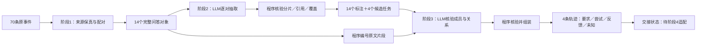

# 047 Demo前三阶段：实现、实际输出与验收边界

本轮按用户明确授权实施046契约。当前结果：**038原始70条消息，经14个问答对象，恢复4个任务；三个阶段均完成端到端验收**。完整工程记录见[验收报告](../../enginering/demo/STAGES_123_ACCEPTANCE.md)，字段及接口见[实现契约](../../enginering/demo/STAGES_123_SPEC.md)。

## 责任与落地变化

| 阶段 | 原来不足 | 当前实现 | 实际证据 |
| --- | --- | --- | --- |
| 会话采集 | 输入预配对turn，助手原ID和配对依据不足 | 保存原事件；明确responseTo／唯一runId优先，其他助手按源行序邻接；无法配对单列 | 70个原ID全保留，56个AI消息归入14问答；无人工replyTo |
| 任务识别 | user-only、单轮单目标，无法表达返回和分片 | 完整问答批量LLM抽取候选；程序验证逐对覆盖、目标片段与来源 | 三真实会话1/1/2任务；构造单轮双目标和RETURN通过 |
| 轨迹恢复 | 只把同taskId回合拼起来 | 候选归属再次核验；原文span引用；要求版本、attempt、反馈、声称与未决分列 | 成员数4/4/5/1；没有把业务成功或文件可用性编造出来 |

A会话得到追问建议、选择方案、改变本次交付三种不同关系；局部失败/修复仍标助手声称。B会话恢复晚到背景形成的要求变更。C会话保留许可核查作为合同任务的子目标，最后市价查询独立成任务。C仍为holdout用途，没有参与workflow/技能生成。

## 本轮新增洞察

**已由运行支持的观察：**

- “让模型逐字引用”仍会出现省略号拼接，不能把格式上像引文的字符串视为证据。编号原文、模型选ID、程序还原是本轮落地修复。
- 任务概览可包含后续交付变化，但不能把概览直接当首轮要求。初始版本必须绑定初始用户片段，后续以有来源的delta记录。
- 选择某个方向与具体选项组合已被正确执行是不同对象。当前模型漏掉了具体组合冲突；程序保留未核验状态，不能把此门禁夸大为冲突检测能力。
- 同一问答多目标时，重复文本不能用字符串包含判定重叠，需要来源位置区间；相同词句在不同原位置不必互斥。

**工程判断，不是效果实证：**通用证据结构更适合后续阶段4区分要求变化、方法错误和材料不足，但无效skills数量下降、有效方法保留和总资源收益仍未验证。

## 验收与成本

56项软件测试、HTTP烟测、浏览器状态检查及真实模型15项验收通过。真实模型为已配置qwen3.7-plus；共12次有响应请求、131,659 tokens，另保留4次沙箱网络失败，现金费用未知。最终有效链8个请求、85,541 tokens，不抹掉调试请求；最后零预算重放无新增请求。

真实案例本身不足以检验自然A-B-A交错，因此另加构造控制，并明确区分两种证据。此处是案例内工程验收，不能当独立测试集精度、法律质量或企业业务成功证明。

完整私有输入输出、逐步案例、失败结果路径统一收录于[验收报告](../../enginering/demo/STAGES_123_ACCEPTANCE.md)，研究记忆不复制企业正文。

## 下一步

本轮授权的前三阶段已交付；下一项适配应是阶段4读取新版TaskTrace，并保留“已观察文本／助手声称／选择未核验／业务未知”的区别。尚需跨窗口增量、自然交错独立样本和学习后的复用收益评估；不擅自扩展本轮为技能生成或发布工作。
