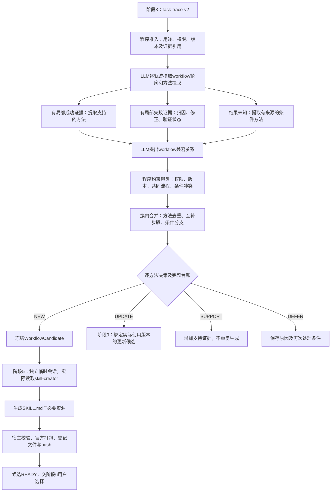

# 阶段4、5契约对齐与修正设计

日期：2026-09-26。状态：**设计完成，尚未实施本轮改动、调用模型或生成新技能。**

依据：[046用户新版十二阶段契约第5节](../contracts/046_twelve_stage_contract_user_revision.md)、[047前三阶段实现与验收](047_stage123_implementation_and_acceptance.md)及本轮源码审阅。本文细化阶段4、5，不改变十二阶段责任。可实现字段见[交接契约](../contracts/048_stage45_handoff_contract.md)，施工与验收顺序见[Demo计划](../../enginering/demo/STAGES_45_PLAN.md)。

## 1. 这次升级要交付什么

阶段3已经回答“这是什么任务、要求如何变化、发生过哪些尝试和反馈”。阶段4要回答“其中哪些做法值得复用，哪些能组合为同一workflow，应新建还是更新”；阶段5负责把获准的方法制作成真实、可检查、可取回的技能包。

**建议路线：新版轨迹 → 分项证据分析 → 带条件的workflow聚类 → 方法合并与学习决策 → 冻结workflow → 独立OpenClaw会话调用官方skill-creator → 宿主校验及封装 → 等待用户采纳。**

四个粒度必须分清：任务实例是一次具体需求；方法提议是其中可复用的做法；workflow是围绕目标组织起来的一套方法；skill是workflow的可消费封装。不能一条trace固定生成一个skill，也不能把“确认输入”“检查输出”等每个微步骤各封装成一个skill。



图中分析角色是逻辑职责，不代表每个框都单独调用一次模型。

## 2. 当前实现有哪些断点

| 位置与现状 | 会造成的问题 | 本轮设计的必要修正 |
| --- | --- | --- |
| `core.py:498`主动跳过`task-trace-v2` | 047真实轨迹尚未进入新阶段4/5 | 先实现新版适配，验收后再解除门禁 |
| `core.py:525`冻结旧字段投影 | 丢失要求时间线、反馈、attempt、用途与初始化证据 | 使用完整的新版本交接视图，保留原始引用 |
| `learning.py:41–62`任意CORRECT使整条失败，任意通过检查可支撑成功 | 新要求误作错误，局部结果污染全任务 | 对具体要求版本、attempt和方法判断证据 |
| NEW按goal词面0.72聚类；UPDATE同版本直接兼容 | 同流程不同措辞难聚合；不同方法可能混合 | LLM提出流程兼容关系，程序执行有约束聚类 |
| 一条trace一个分析角色，UNKNOWN的OBSERVED提议不采纳 | 结果未知时大量可用过程被丢弃 | 一条trace可以同时贡献局部成功、失败及未知方法 |
| 旧learn一次同时分析轨迹、合并提议和改技能文件 | 阶段5可能重新决定阶段4已决定的学习范围 | 新增workflow-to-skill适配，生成只消费冻结workflow |
| creator文件已复制且prompt要求读取 | 不能证明实际读过官方技能 | 登记准确路径、文件hash和成功读取回执 |
| 官方打包检查主要验证frontmatter | 不能证明方法覆盖、资源引用、隐私或业务有效性 | 分开检查结构、覆盖、内容边界、封装和实际消费 |

源码入口：[core.py](../../enginering/demo/skilldemo/core.py)、[learning.py](../../enginering/demo/skilldemo/learning.py)、[runtime.py](../../enginering/demo/skilldemo/runtime.py)、[bootstrap.py](../../enginering/demo/skilldemo/bootstrap.py)。这些是静态源码观察，不是本轮运行结果。

另外有一个上游证据断点必须一并补：在线`front_stages.record_turn()`目前将`toolEvents/attachments`置空，没有传递执行run、产物及检查引用；`recovery.py`聚合使用回执和工具证据，但缺逐attempt关联，`verifiedFiles`固定为空。最小修正是传递`pair → sourceTurn/run → tool/artifact/check`引用，并将其绑定到attempt。**不从助手文字补造真实文件或通过检查；历史缺失仍为未知。**这属于交接元数据补齐，不重做前三阶段算法。

## 3. Trace2Skill借鉴什么、不能混称什么

本轮复核[Trace2Skill论文v5](https://arxiv.org/html/2603.25158v5)和[作者仓库README](https://github.com/Qwen-Applications/Trace2Skill)：其核心是逐轨迹分析形成修改提议，再合并到技能；成功分析提炼可迁移经验，失败分析使用可访问材料进行诊断和验证，不能解释的失败不自动成为修正规则。论文还包含层次化合并及确定性修改约束。

这里借鉴的是**分项分析、成功/失败区别处理、先保留提议再合并、验证失败修正**。企业会话的workflow聚类、需求变化归因、UNKNOWN方法提取和权限边界是本项目适配，不能说论文已替我们解决。默认采用有界批量分析，不等于复现论文的独立分析调用与层次化合并，也不据此宣称原创性成立。

## 4. 阶段4：证据分析、聚类与学习决策

### 4.1 先构造可核查的输入

程序读取当前有效`task-trace-v2`，冻结schema、revision/hash、成员span、要求时间线、反馈边、observations、attempts、未决项、来源用途及使用证据。

- 038只允许A/B生成材料。C在任何摘要、命名、相似性判断、方法提取之前排除；构造控制单独存放。
- 同组织身份不等于允许共享个人会话；首版只在同owner、同授权材料范围中聚合。
- 不要求明确“满意/完成”、真实合同附件齐全或业务SUCCESS才进入。只有具体受影响的方法需要补证，其他方法正常处理。
- 原文span存在只能证明引用存在，不能证明模型推论正确。`sourceMessageIds`若覆盖整对问答，不得冒充每条方法的精确来源。

### 4.2 先提出workflow轮廓，再提出其中的方法

LLM根据全文证据提取`WorkflowFrame`，描述可复用目标、输入对象、处理过程、预期交付、适用条件、变量及方法提议。一个任务可贡献多个轮廓，但只有可独立描述输入输出的子目标才能拆开；不能仅因有多个步骤就拆成多个skill。

`MethodProposal`是workflow中的一项方法或约束，包含：做什么、适用何种条件、前后依赖、输出/检查、变量、来源和未知项。先保持来源独立，不在提取时把不同trace的证据混写成“大家都验证成功”。同一任务的多轮修订只计一个独立任务来源。

例如一套合同处理workflow包含“确认本次立场与修改尺度→审阅→说明修改理由→根据新增事实局部修订→按本次交付要求输出”。这些步骤互补，不必相似；应在一个workflow中有序组织。相似性用于判断不同轨迹是否体现同一套做法，以及其中哪些提议等价。

### 4.3 三类处理器按局部证据工作

| 处理器 | 准入依据 | 允许沉淀 | 必须保留的边界 |
| --- | --- | --- | --- |
| 成功处理 | 对应某项要求、attempt、对象的用户认可或可核验检查 | 在该范围内有支持的步骤和检查方法 | 用户认可、技术检查通过、业务正确分开；不能一项通过代表整体成功 |
| 失败处理 | 可定位的用户否定、工具错误或产物检查失败 | 失败症状、原因候选、修正措施及对应验证状态 | 反馈能支持“不满意”，未必支持原因；assistant自称错误/修复只是声明 |
| UNKNOWN处理 | 明确需求、可见过程、实际文本及其引用 | 可复用的条件流程、输入澄清和交付规则，效果注明未验证 | 不把未知当失败或当成功；专业结论、文件成功声明不直接学习为事实 |

失败归因先比较：要求在原attempt之前是否已存在、后续是否新加事实/改变目标、反馈是否针对同一对象。`ADD_CONTEXT`、`CHANGE_OUTPUT`、`SELECT_OPTION`不自动触发方法错误。

只有修正对应同一失败目标、同一适用要求，且具有相关的验证结果，才可写“该修正已验证有效”。不能拿另一个产物的成功check给本次修正背书。缺少可执行材料时，允许提取有证据的预防性要求；原因和修复效果保持待证。可选的Agent失败诊断仅在有材料、有检查器且预算允许时开启，本轮038缺历史文件，不默认启动。

方法证据分开记录`USER_REQUIREMENT / VISIBLE_PROCESS / USER_ACCEPTANCE / VERIFIED_CHECK / ASSISTANT_CLAIM / DESIGN_POLICY / MODEL_HYPOTHESIS`。这是来源类型，不是一条简单高低分数。通用设计策略可以进入技能，但必须声明为设计策略；模型假设不能伪装成历史验证结果。

### 4.4 必须聚类，但聚类不等于按标题分组

采用两层处理，避免把互补步骤切碎：

1. **workflow轮廓聚类**：判断不同任务是否具有具体、可复用的共同处理过程及兼容交付契约。
2. **簇内方法合并**：等价提议去重；角色差异成为条件变体；互补步骤保持顺序/依赖；冲突和未决提议保留台账。

LLM批量给出轮廓两两关系，不为每一对单独调用：`SHARE_CORE`、`CONDITIONAL`、`INCOMPATIBLE`、`INSUFFICIENT`，同时列共同步骤映射、差异和适用条件。只有“都是合同”或“阅读并提出建议”不构成足够共同过程。

程序执行硬边界及确定性分组：跨owner/未授权来源不合并；NEW与UPDATE分开；UPDATE按实际使用的精确skill版本隔离。组内轮廓须两两有可解释的兼容关系，并通过组级参数/条件一致性检查；不能因A像B、B像C就默认A/C也兼容。`INSUFFICIENT`表示暂不合并，保留单例及后续补证机会，不等于该方法没有价值。

簇内方法关系另用`EQUIVALENT / CONDITIONAL_VARIANT / COMPLEMENTS / REQUIRES / CONFLICT`，不能把这些关系复用成轮廓相似度。没有历史证据的组合顺序只能标为设计建议，不能冒充观测到的成功workflow。共同流程之外的有效少数方法保留为有条件步骤，不按多数票丢弃。归纳时发现目标或条件无法兼容，可以拆簇或延期；“一个最终workflow封装一包”是去重约束，不是要求每个初始簇必须生成一个包。

```text
for each admitted trace:
    frames, proposals = LLM_extract_with_evidence(trace)
relations = LLM_propose_frame_relations(frames)  # 可与上述批量提取同一次请求
groups = constrained_complete_link(frames, relations, permission_and_version_keys)
for each group:
    workflow, ledger = LLM_merge_methods(group) # 各簇可同一次有界请求
    validate_references_conditions_coverage_and_source_versions(workflow, ledger)
    freeze_or_return_for_revision(workflow, ledger)
```

轮廓聚类是限制误合并的方法，不是单独证明技能有用的算法。语义兼容和条件充分性仍可能判断错，须通过案例审阅与后续消费检查；规则校验不能消除这一不确定性。

### 4.5 再明确每项方法的学习归宿

| 决策 | 条件 | 结果 |
| --- | --- | --- |
| NEW | 有可复用方法；实际未使用技能有可信依据，或方法片段可明确归因到无技能处理 | 纳入新workflow，经阶段5生成候选 |
| UPDATE | 方法与实际使用的精确skill版本相关，并存在需要修改/新增的内容 | 形成绑定基准的增量workflow，交阶段9 |
| SUPPORT | 支持既有方法且无增量，或与已冻结候选具有可核验的重复关系 | 记录支持/去重引用，不重复生成 |
| DEFER | 缺关键方法来源、归因/条件不清、预算不足或无可复用方法 | 保存具体原因和重评触发条件；不无限自动重试 |

无需把全库语义搜索作为必经步骤。优先使用实际使用回执、明确的无技能初始化及同owner既有候选缓存。038用户确认原agent无skills，可以据此NEW；未来单纯缺receipt不能推断NEW。使用状态未知与业务结果未知是两件事：后者不阻断方法学习；前者可能使某项方法的目标路由暂缓。

同一trace可贡献NEW与UPDATE等不同方法，但每项必须能归因；不能用一项实际使用记录为整条会话所有方法指定版本。最终台账同时保存学习决策和`INCLUDED / DUPLICATE / EXCLUDED / DEFERRED`处置，所有提议都有归宿，不能静默丢掉。

## 5. 阶段5：通过临时会话制作真实技能包

### 5.1 输入是冻结workflow，不是再次投喂全部轨迹

阶段5只消费`action=NEW`的`WorkflowCandidate`。给creator的视图包括：触发场景、输入、步骤、条件分支、变量、输出及完成检查、依赖、允许的方法、未知项、文件规范和可用验证能力。真实消息ID、企业正文、来源路径和私有证据索引留在宿主侧记。

creator可改进表达、安排文件结构、制作模板或必要脚本；不可重新聚类、改变NEW/UPDATE、补回被排除结论、默默删除方法或扩展技能权限。无法封装时返回`NEEDS_WORKFLOW_REVISION`，保留原因，由阶段4产生新修订后再生成，不能在同一会话中悄悄改契约。

### 5.2 复用现有OpenClaw与官方creator

每个候选建立独立OpenClaw会话、workspace及state；初始化并实际读取本地官方`.foundation/skill-creator/SKILL.md`，记录来源版本、hash、成功工具读取回执。**复制文件、prompt提到技能、assistant声称读过均不算读取证据。**

可复用`bootstrap.initialize()`、真实OpenClaw运行、`draft_files()`和宿主`package()`。新增专用`workflow-to-skill-v1`分支，避免旧`trace-patch-v1`再分析轨迹。该运行标为学习生成用途，不得回流到阶段1当作企业用户会话继续挖掘；不要借普通聊天入口触发一个会被再次采集的`/skill-creator`对话。

当前按run隔离目录与状态不等于操作系统沙箱。阶段5应使用专用工具配置，默认只开放所需读写能力；固定官方校验/打包由宿主运行，不开放正式库变更入口及无关浏览/网络工具。若新增脚本需要运行测试，应明确测试范围及执行约束，不能直接沿用无限制host exec并称已隔离。

### 5.3 格式与原Demo对齐

保持实际目录/`.skill`包、`SKILL.md`、`name/description` frontmatter、必要`references/templates/scripts`等资源；保持现有市场字段“适合人群、核心亮点、典型输入/需求、输入预填模板、预期输出/成果”。不更换个人采纳、组织提交审核、下载和消费接口的语义。

没有必要脚本的程序性技能仍可有效封装。文本交付和Word文件分支分开：本次只需要条款文本就执行文本分支；需要修改文件时必须取得文件并具备实际工具及检查能力。当前无法提供的文件分支标`UNAVAILABLE/NOT_VALIDATED`或要求满足前置条件，不写成“已具备可靠Word修改能力”。

### 5.4 分层验收，不能一个PASS代表全部完成

| 验证 | 检查内容 | 不能据此推出 |
| --- | --- | --- |
| creator读取 | 正确文件、hash、成功read回执 | 生成内容遵循所有要求 |
| 宿主结构 | 路径、大小、frontmatter、市场字段、实际文件可读 | 方法有效、隐私绝无泄漏 |
| workflow覆盖 | 每条获准方法/条件/未知项有落点，资源引用存在 | 语义完全等价；仍需审阅及后续执行 |
| 内容边界 | 不含私有侧记、原会话、被排除结论、伪成功声明 | 自动规则能发现所有语义泄漏 |
| 官方封装 | 真正运行官方打包器、退出码、包存在、可解包且hash对应 | 技能已在新任务中消费 |
| 能力检查 | 新helper测试；文本/文件分支各自的依赖与检查状态 | 历史业务成功或法律正确 |

宿主在新验证目录仅重建获准的公开文件，再打包；私有来源sidecar单独保存。模型如果把企业原文写进声明文件，旧“仅打包声明文件”仍会泄漏，因此生成输入最小化与内容检查都要做。规则扫描不是完备脱敏证明。

阶段5输出真实`DraftSkillPackage`及验证账目；有效时复用候选`READY`，含义是**等待用户选择**。不自动accept、submit或review。至此最多完成D1；实际读取属于阶段7/受控试用D2，行为验证D3，组织及跨用户D4。UPDATE候选走阶段9，可共用封装器，不能混为阶段5已完成自进化。

## 6. 038案例应如何走这两阶段

输入复用047生成的A/B新版轨迹及来源索引；不重用旧人工恢复结果当算法输入，不重跑前三阶段，不向模型提供C。以下是**待验证的目标行为，不是已经生成的workflow**。

| 案例材料 | 阶段4应保留 | 阶段4不能学成什么 |
| --- | --- | --- |
| A的指定立场及修改尺度 | 作为本次参数和审阅边界 | 永久固定某种立场/尺度 |
| A对建议合理性的追问 | 解释、审慎复核这一过程需求 | 自动认定前一答案失败 |
| A选方案及后续文本交付 | 已确定要求与当前交付形式；保留选项实现未核验 | 声称已检测并修复具体逻辑冲突；永久禁用文件输出 |
| B补充业务背景 | 新事实进入要求版本，再做适用范围复核 | 因新增事实而惩罚原版本，声称发现既有错误 |
| 缺合同附件及历史交付文件 | 明示业务UNKNOWN、文件未核验 | 法律结论可靠、Word已正确修改 |

A/B有可能形成一个“按指定立场和修改尺度审阅协议，并按当前要求修订交付”的workflow，角色、修改程度及交付形式为变量，共同过程与各自适用条件分开。**只有实际分析给出充分共同方法才合并**；如果证据不足，两个更窄workflow也比强行一个空泛skill合理。单条A能支持候选时，不等B或显式成功才处理。

第一份技能应优先交付可用的审阅/局部文本修订流程。具体法律规则、金额、案例事实不固化成普遍真理；未核验的专业结论留在受控来源中。是否能正确复用、减少无效技能，必须在新任务上继续验证。

C已参与前三阶段开发验收，不能再称完全未接触的最终论文测试集；它仍严格不进入阶段4/5生成。未来论文独立评估需另划未用于调参的数据。

## 7. 调用与成本：减少重复，不作无依据保证

首版默认将阶段4逻辑批量化：请求A输出逐来源轮廓/方法、局部证据分析与流程兼容关系；程序分组；请求B在各簇内合并workflow和完整台账。阶段5为每个获准NEW workflow启动一次creator会话。可选失败诊断默认关闭，缓存命中不派发。

这是**两次结构化请求＋每个候选一次Agent会话**的设计预算，不是端到端固定三次模型请求。creator内部可能多轮调用。当前日预算主要计外层派发；现有真实验收曾出现5次派发、24次内部请求，见[031验收](../../enginering/demo/MULTITRACE_ACCEPTANCE.md)。timeout、单轮maxTokens都不是累计tokens硬上限。

每批按输入/输出预算限制规模；初始最多8条trace仅是待测默认值。轮廓两两关系成本随轮廓数平方增长，不能全企业无限比较。超限应保留未处理项并记录`DEFER_BUDGET`，不得静默截断；扩大规模时先用权限索引及方法描述召回，再做有限语义比较，同时审计漏召回。词面召回不能重新成为价值的硬门槛。请求B优先读取冻结轮廓、方法和必要引文，避免再次全文传输；若需要拆成多个请求，应如实计量，不能仍声称整个批次固定两次。

复用已完成前三阶段、来源hash缓存、方法去重、同workflow只生成一包、失败不自动无限重试，都是减耗措施。阶段4新增语义分析可能提高单批开销；生成更少是否抵消尚未知。必须记录外层派发、内部请求、输入输出tokens、失败/未知usage、人工审核与候选数量，不能承诺本设计天然满足“至少不增加”。

## 8. 实施顺序与完成标准

1. **证据交接**：补在线run/check/artifact及attempt引用；冻结新版字段、用途/权限过滤和失效检查，继续复用`records/events/runs`。
2. **阶段4**：实现分项方法、流程轮廓关系、约束聚类、合并台账和四种决策；用构造反例验证，不让旧规则回退伪装LLM成功。
3. **阶段5**：增加workflow专用creator分支、真实读取回执、公开生成视图、覆盖与资源校验、官方封装及下载。
4. **受控真实验证**：先复用A单例检验UNKNOWN可学，再用A/B小池检查聚类，冻结一个合格NEW候选做一次真实封装；不以人工workflow替代阶段4输出。逐项额度预留，失败保留证据并停止自动重试。

每一阶段独立验收，不能只展示最终文件：阶段4需展示输入trace引用、聚类原因、方法纳入/延期/排除台账和冻结workflow；阶段5需展示实际creator读取、生成文件、官方封装、hash/下载及验证限制。单例和小池可以共用提取缓存，不能为了“跑完整链”无故重做模型调用。

这轮设计使新版前三阶段可以接到原有封装、采纳与组织治理设施，主要机制集中在**修订归因、带条件聚合、逐方法证据与可追溯交接**。是否减少无效技能、保留有效方法并控制总资源，是后续要验证的研究假设，不是文档完成就成立的结果。
