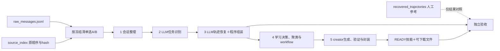

# 前五阶段真实实验开跑前审查

日期：2026-09-26。结论：**材料预检通过，但当前版本不应直接进入“全新目录、前五阶段连续执行、途中不改代码”的正式实验。** 阶段能力已有分段运行证据，统一入口、失败恢复、部分跨阶段契约和配置冻结仍有确定性缺口。

本轮只审查源码、历史证据和本地环境，并运行无网络合成控制；未修改应用代码、未重跑付费模型、未更改原始企业数据或既有运行库。应用59项测试再次通过；下面的控制复现说明该测试集尚未覆盖全部实验运行边界。使用research-experiment-compass约束执行有效性、处理有效性与负结果记录。

## 1. 指定JSON能否用作实验输入

[recovered_trajectories.json](../cases/038_contract_multi_review/recovered_trajectories.json)确实存在，但内容是三个session的人工案例说明、任务标签和14个轮次索引，包含原消息ID列表，**没有完整user/assistant正文，也不是Demo的task-trace-v2**。它可用于人工对照及回查来源，不能直接送入阶段1，更不能把其中人工task标签作为阶段2/3答案输入。

生成代码依据：[prepare_case.py:138](../cases/038_contract_multi_review/prepare_case.py#L138)、[prepare_case.py:202](../cases/038_contract_multi_review/prepare_case.py#L202)。阶段1要求稳定事件id、sessionId、role等字段，见[事件契约](../../enginering/demo/skilldemo/intake.py)。当前原始材料适配已在[check_038_stages123.py](../../enginering/demo/scripts/check_038_stages123.py)的source_events函数（18—27行）。

| 文件 | 在正式实验中的角色 | 本轮核验 |
| --- | --- | --- |
| [private/raw_messages.jsonl](../cases/038_contract_multi_review/private/raw_messages.jsonl) | 原始会话事件及正文，阶段1起点 | 70条，14 user＋56 assistant，ID唯一 |
| [source_index.json](../cases/038_contract_multi_review/source_index.json) | 原行顺序、部分用户时间及来源hash；仅取必要元数据 | 70条原行hash和正文hash均匹配 |
| recovered_trajectories.json | 人工参考索引，保留在模型输入之外 | 不能直接导入当前事件接口 |
| 047、049历史SQLite | 开发验收证据与诊断参考 | 不得作为下一次“从阶段1全新开始”的隐含前置结果 |

全量70消息可确定性整理为14个可读问答，无孤儿事件。A为37消息/4问答，B为11消息/4问答，C为22消息/6问答。**生成来源为A/B的48消息、8问答；C保持留出，不进入阶段4/5。** C曾参加前三阶段开发验收，不再称完全未接触的最终论文测试集。建议这次第一份冻结的1→5生成实验只输入A/B，减少无关调用；如需同时检查留出隔离，可独立导入C并明确止于阶段3。

原文、附件与业务结果边界不变：正文完整可读，历史合同文件与交付文件仍缺失，业务结果UNKNOWN；这种状态可以学习有来源的方法，不构成运行阻断。它也不能支持法律正确或历史文件交付成功的评价。

## 2. 必须先修的运行与复现断点

下表的“合成复现”使用固定响应夹具检查程序控制流，零真实模型调用，不表示模型一定会输出该反例。所有问题按本次新一轮038实验的影响排序。

| 编号/优先级 | 具体问题与源码位置 | 已确认影响 | 开跑前必须达到的结果 |
| --- | --- | --- | --- |
| R1 / P1 | `scripts/check_038_stages45.py:21,37–45`固定复制047旧库；前三阶段脚本77行反而要求没有skills | 两个脚本串行运行也不能证明本轮新产生的stage3结果进入stage4/5；源码确认 | 单一runner从原事件开始，在同一新数据目录连续1→5，禁止隐式复制旧业务库 |
| R2 / P1 | `workflow_bridge.py:38–40,117–123`把预算不足也写入trace的`DEFER/STAGE4_FAILED`，之后不再选中 | 额度0调用discover后加至100，再次调用仍为0次派发、0候选；已合成复现 | 运行等待/失败与学习决策分开；预算恢复或协议允许重试时可继续，历史不丢 |
| R3 / P1 | `front_stages.py:111–132`及`workflow_bridge.py:23,29–31,54–55`在部分语义校验前把输出缓存为READY | 缺标注的stage2输出、缺台账的stage4 merge均可缓存READY；重跑仍读坏结果；已合成复现 | 验证通过才记可复用缓存；失败有明确终态/原因和预定attempt策略，不需现场删库改prompt |
| R4 / P1 | `workflow.py:74`允许任意字符串方法ID；`creator.py:7,17–19`只接受特定字符的marker | `m1.1`通过阶段4，但阶段5忠实使用该ID仍必败；已合成复现 | 宿主统一方法公开别名或统一两阶段ID约束，并验证合法反例 |
| R5 / P1 | `workflow_bridge.py:11–16`缓存键未包含prompt/model/provider；缺统一实验manifest | 改提示或模型可继续命中旧输出；新实验配置与实际材料不一致；源码确认 | 冻结完整配置指纹，并用于缓存命名与run校验；配置变动不得混入同一run |
| R6 / P1 | `server.py:44–49`关闭autoLearn仍调用tick；`core.py:475–477`将tick接到前三阶段 | `auto_learn=False`仍观察到`detect_pairs/recover_trace`派发；已合成复现 | 正式实验目录无活动后台，或提供覆盖全部学习阶段的暂停机制；不能依赖现有开关保证无额外模型调用 |
| R7 / P1 | `check_038_stages45.py:46,54,60–68`只使用本次新建候选或已有READY，遗漏已有QUEUED | 阶段4完成后中断或阶段5无额度时，重跑可能报未形成NEW，虽然库内有候选；源码确认 | 从本run持久化状态恢复QUEUED等阶段，不依赖上一次函数返回值 |
| R8 / P2 | `creator.py:23–27`校验资源链接前未归一化`..` | `references/note.md`合法指向`../SKILL.md`被误拒；已合成复现，049单文件技能未遇到 | 在包根内规范化路径，允许合法相对引用并拒绝真正越界 |

这里的“停止自动重试”本身不是缺陷。缺陷在于：临时运行错误被混作永久学习结论、坏缓存标成有效，以及现有入口不能按预先定义的规则恢复。正式实验可以允许失败，必须能保存并解释失败；不能依赖运行时修改代码得到成功。

## 3. 还需补齐的处理有效性与验收约束

1. **阶段4证据强度仍主要靠提示词。** `workflow.py:73–79`没有将方法声明的证据类型/结果严格绑定来源；合成反例中只有USER_REQUIREMENT来源却声称VERIFIED_CHECK/SUCCESS也通过。`validate_merge`允许空inputs、outputs、limitations。应由宿主约束不可无据提升的证据状态，并检查workflow所需的有效输入/输出与限制；不可仅用数组类型代替内容可用性。`decisionHint`是否允许merge重评应明确，它当前名为hint，不能简单当作最终排除决定。
2. **阶段3→4仍有信息缩减。** `workflow.py:32`逐项最多900字符且无截断标记；54行不传attempt的executionRefs。合成1200字符来源被截成900字符，run/tool/artifact/check未进入模型视图。只读核对本次038 A/B共30项证据、最长135字符，故900截断未影响本案例；不能把合成问题冒充本案例已丢失可用工具证据。历史缺少的验证材料继续UNKNOWN。
3. **阶段5覆盖PASS的口径有限。** 目前主要检查SKILL.md里方法注释ID齐全；只放marker、没有对应流程内容也能通过。它证明结构标记存在，不证明方法和条件被正确封装。实验验收须另给每项方法的文件/章节/内容落点，人工审阅或独立检查结果单独留存，不在生成器中现场修稿后计原运行成功。
4. **环境已安装不等于完整预检。** 本地doctor确认OpenClaw 2026.9.5、Python 3.14.3、模型已配置和creator存在，但不验证官方打包全流程及远程模型可达性。Node/OpenClaw锁与本地脚本hash已经可记录。`README.md:36`的结构化超时90/120秒与`runtime.py:127`实际默认180/上限240秒不一致，应在冻结清单中显式设置并同步说明。

## 4. 对上一轮“通过验收”的精确解释

047证明前三阶段在修正、重跑及缓存重新编译后通过案例检查。049从047库的既有轨迹进入阶段4/5，经历creator超时、显式重试及宿主Windows换行修复后完成封装和消费。**这些是分阶段开发验收，尚未完成一次冻结当前代码后的全新1→5独立运行。** 不能用59项测试、现有包或两个历史数据库证明不存在新一轮断点。

代码具备通路这一观察仍成立；本轮收紧的是“已达到可复现实验开跑标准”这一更强结论。失败历史全部保留，不把开发中的修复算成同一算法实验的自动能力。

## 5. 最小稳定化与开跑标准

下列是**待实施事项**，不是本轮已经修复或运行的实验。完成后才发布一个可开跑的冻结版本。

| 顺序 | 交付 | 必须通过的检查 |
| --- | --- | --- |
| P0-A | 原始数据manifest＋统一前五阶段runner | 只接raw/index及generation清单；同一新目录连续传递本run对象；不读人工任务标签或历史DB |
| P0-B | 统一失败/预算/缓存状态及有界恢复协议 | 预算恢复、无效JSON/无效结构、进程中断、已有QUEUED、重复运行都无需改代码/删缓存；失败完整记账 |
| P0-C | 交接契约校验修正 | 方法ID、相对资源路径、证据类型与workflow必填语义、方法覆盖落点一致 |
| P0-D | 全链路冻结清单 | 输入hash、代码/prompt/validator、模型/API/参数/超时、Node/OpenClaw/Windows补丁、creator及打包器hash、额度与最大attempt数在开始前落盘 |
| P0-E | 免费完整链路预演 | 固定合成provider在全新目录跑1→5并真正打包，覆盖上述反例；同一保存响应可确定性重放，不能只测各模块函数 |
| P1 | 一次独立真实模型实验 | 用冻结版本从A/B原事件到READY技能，期间不改源码/提示/配置；若协议未预定的修复成为必要，则本run结束为失败，新版本另开run |

建议首次正式运行关闭自动补救，任何无效输出或运行失败均保留证据并明确停止；网络重试如需允许，次数和条件必须在启动前写入协议，所有attempt计入成本。资源至少记录外层派发、内部请求发起、tokens和缺失用量，不能以调用次数替代总成本。

“可复现”分两层：保存模型响应的重放应重现相同的程序处理与验收判断；重新调用远端模型的复跑只要求同条件可追溯、可重测，并允许输出差异。`.skill`压缩包受目录名/ZIP时间影响，比较规范化文件内容hash及方法/条件覆盖，不能要求不同运行压缩包逐字相同。

正式结果至少保留：manifest、每阶段输入输出与状态、模型实际prompt/response/usage、方法与workflow台账、creator实际读取回执、原始草稿、打包日志与文件内容hash、验收判断及失败原因。原始企业正文只留受控目录。READY是阶段5终点，不自动个人采纳或组织发布。

## 6. 本轮证据入口

- [输入预检与前三阶段缓存反例](../reviews/050_preflight/input-result.json)；[复现脚本](../reviews/050_preflight/input_probe.py)。
- [阶段4/5七类免费控制](../reviews/050_preflight/stage45-result.json)；[复现脚本](../reviews/050_preflight/stage45_probe.py)。
- [关闭自动学习的调度控制](../reviews/050_preflight/scheduler-result.json)；[复现脚本](../reviews/050_preflight/probe_scheduler.py)。
- [无密钥环境与运行文件hash](../reviews/050_preflight/runtime-result.json)。

复现脚本只在临时目录写合成SQLite；无远程请求。已有59项测试本轮再次运行通过。输入可用与算法收益是不同结论，本轮没有新的技能质量/企业效果结果，也未开展正式五阶段模型实验。
