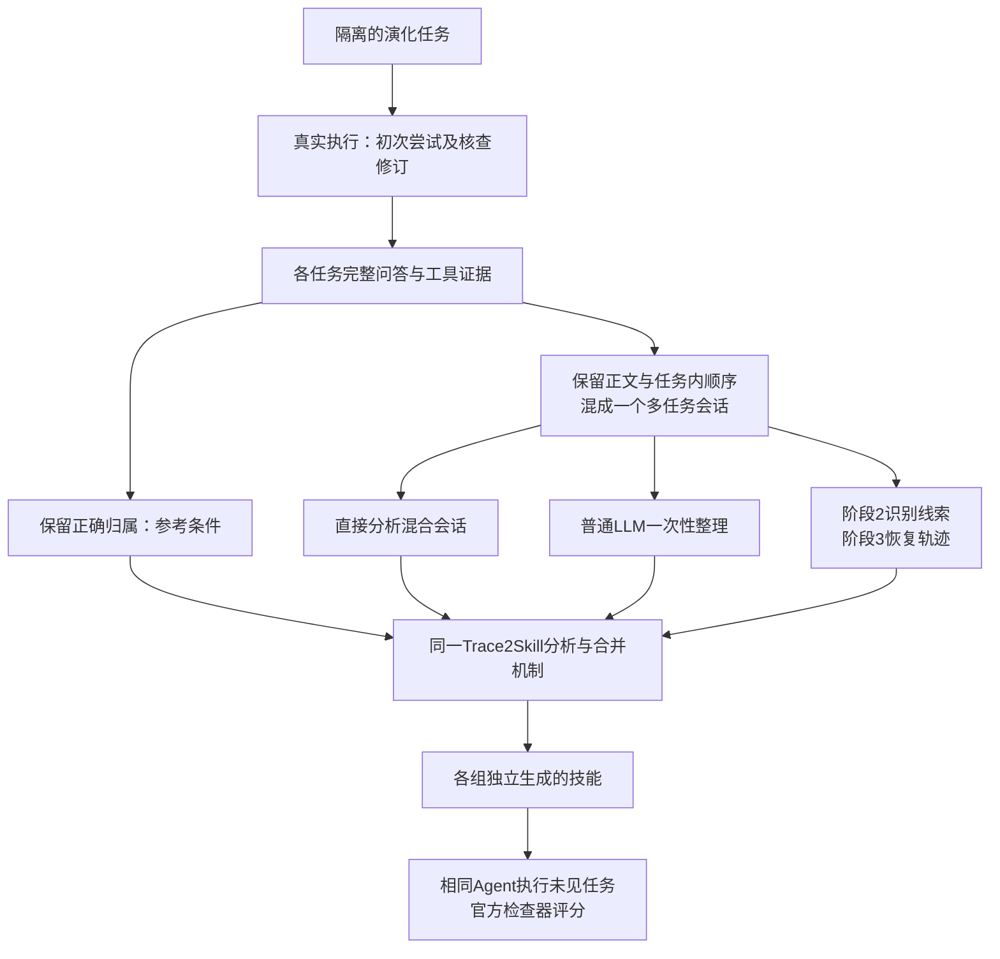

# 073 RQ1：混合会话的任务轨迹恢复，能否改善后续技能学习？

日期：2026-09-30。性质：实验设计和可行性评估，尚未执行。承接[072基准选型](072_public_benchmarks_and_evolution_evaluation_design.md)，本轮收敛到阶段2、3的贡献，不同时评价十二阶段所有机制。

## 1. 研究问题可以成立，但要准确限定

**RQ1：当同一会话中包含多个任务的非连续尝试、反馈与修订时，在相同可用证据、技能生成器和消费Agent下，显式任务识别与轨迹恢复能否提高生成技能在独立新任务上的成功率？**

这是待检验假设，不是预先安排必须得到的正结果。建议论文用“混合会话中的任务轨迹恢复”或“面向技能学习的会话解交织”描述问题，不笼统称为降低rollout质量。

需要分开三类质量：

| 类型 | 例子 | 恢复算法能做什么 |
|---|---|---|
| 组织结构不清 | A做一半插入B，后来继续A；要求与反馈隔得很远 | 根据证据重新关联，是本轮主问题 |
| 内容或覆盖缺失 | 合同附件没有导出；纠正结论被删除；根本没经历某类任务 | 标记未知，不能从不存在的信息恢复事实 |
| 执行质量差 | Agent方法错误，交付未通过 | 可保留失败经验，不能把失败改写为成功 |

主实验**只改变第一类**：任务内容、原始成功失败构成、工具结果和可用证据覆盖保持相同。缺失和无关噪声后续分别作为压力测试，不与主实验混在一起。

## 2. 原论文依据，以及需要纠正的引用

本轮核查Trace2Skill的v1及当前HTML版本，未找到用户提供的“depends on the quality and coverage of sampled rollouts”这句逐字原文，暂不把它作为原论文Limitations直接引语。v1局限讨论补丁因果效果及技能部分效用，当前版侧重补丁选择和验证成本。该句出处待进一步定位；本研究动机不依赖这句引语成立。[v1](https://arxiv.org/html/2603.25158v1)、[当前版本](https://arxiv.org/html/2603.25158)。

可核实的方法前提是：给定任务请求，Agent生成该任务的轨迹和结果，再交成功／失败分析器提炼补丁。原实现按任务定位日志与工作目录；失败分析可读取演化任务的参考文件。因此它的直接输入已具有任务身份与执行材料关联，并非未经整理的企业多任务会话。[官方失败分析入口](https://github.com/Qwen-Applications/Trace2Skill/blob/main/analysis/run_error_analysis.py)、[成功分析入口](https://github.com/Qwen-Applications/Trace2Skill/blob/main/analysis/run_success_analysis_llm.py)。

据此提出的是**输入条件扩展问题**：在缺少现成任务轨迹时，怎样把会话转成强技能学习器能利用的经历。不能声称Trace2Skill从来不会处理噪声或一定失败。

## 3. 最有解释力的比较：恢复前后使用同一个Trace2Skill

本轮不把我们的阶段4聚类、阶段5creator、技能检索或不同消费Agent一起换掉。否则即使分数提高，也无法定位阶段2、3的贡献。临时采用Trace2Skill作共同下游是科研测量设置，不修改十二阶段产品契约。

### 五个核心条件

| 组别 | 输入及处理 | 用途 |
|---|---|---|
| A 初始技能 | 不从此次经历更新，同一初始技能直接消费 | 学习本身有没有帮助 |
| B 正确轨迹＋Trace2Skill | 构造器保存的正确任务归属；正文、工具证据与其他组同源 | 完整组织信息的参考条件，非数学上界 |
| C 混合会话＋Trace2Skill | 不预先恢复，把整个相关会话提供给分析器；允许其自然理解、过滤无关片段 | 无显式恢复的强基线 |
| D 普通LLM整理＋Trace2Skill | 同模型一次性按任务归类，保留原文引用，再交相同下游 | 排除“任何一次额外整理都能解决” |
| E 阶段2＋阶段3＋Trace2Skill | 逐对任务线索、关联复核、要求／尝试／反馈／修订关系，程序回拼原文 | 待测方法 |

不使用“把混合日志随便标成失败并塞进接口”的弱基线。C的格式、附件和分析器必须可正常使用；直接输入仍允许Trace2Skill分析器做隐式归属推理，不能要求它故意忽略上下文。

## 4. 一个必须解决的接口问题：不能为了适配而泄漏正确轨迹

Trace2Skill需要任务请求、结果及相关材料，混合窗口没有天然的单任务结果。把整窗统一判成功／失败，会额外破坏标签，无法解释比较。

**因此公开主实验先采用“目标请求已知，但其经历散落在混合窗口”的保守设置：**

- 为每个源任务提供同一个起始请求，作为本次分析目标。C看到该请求和整份混合窗口，D/E从同一窗口提取它的经历。
- 每个目标同样有原生的初次执行结果，成功／失败分流由共同适配器处理。核查后的结果单独保留，不把“最终成功”贴到所有早期尝试上。
- 演化侧输入文件、实际输出及参考文件按同一权限策略提供给各组下游分析器，保持原失败分析能力。恢复前端只看对话与正常可见回执，不访问评分答案或隐藏归属。
- 文件中正常存在的对象线索可以使用；构造器专用任务编号、归属映射、文件目录中泄漏任务编号的部分必须一致处理。不能仅让E读取真值。
- E输出标准化原文片段和关系；每条被纳入的正文必须回指可见来源，不得重新生成遗漏的尝试或答案。相同适配器将各组材料交给Trace2Skill。
- E没有恢复出某任务时按预先约定产出“无可用经历”，保留初始技能的相应部分并记录漏恢复；不偷偷用正确轨迹补齐。无法解析的系统故障另记。

这项设置刻意给基线较强信息：它知道正在分析哪个请求，还能读取完整窗口。若E仍优于C，证据更有说服力。但它只证明**已知目标下的归属恢复和学习收益**，不能单独证明“无人告诉任务数时，阶段2也能自动发现全部任务”。后一项由第8节企业自然会话评估补充，不包装成同一个已证明结果。

对原始完整单任务rollout可另做官方实现的通路校准；交互扩展和混合日志条件都应标注为本项目适配实验，不把它们叫原论文结果复现。

## 5. 公开数据如何改造：推荐SpreadsheetBench-Verified

理由是它与Trace2Skill原研究任务一致，有实际输入、输出和可执行评分，能把“恢复得像不像”追踪到“技能是否帮新任务做对”。官方复现使用400题中的前200题演化、后200题评测。[作者复现说明](https://github.com/Qwen-Applications/Trace2Skill#4-reproduction-note)。

### 5.1 先切分

- 外层保持200演化／200测试，最终测试材料不进入整理、生成、调参或失败分析。
- 演化侧内部建议160题用于来源经历、40题用于开发评测；这是本项目设计，各方法相同，不声称与原论文全部配置一致。
- 检查同题不同附件、重复模板及近重复任务是否跨边界；若需调整官方划分，保留原ID与理由，并明确另报本项目划分，不静默换题。
- 所有切分、抽样和扰动种子在看方法分数前冻结。不同任务的原文可以在开发阶段审计，但最终测试答案对方法开发侧隔离。

### 5.2 不把工具片段冒充多轮用户会话

原生rollout往往只有一次用户要求，后面是多步工具操作。随便切成A1/A2并虚构用户“继续”，会偏离当前阶段1的问答契约。

建议对每个演化任务采用同样的两轮交互扩展：

1. 第一轮使用官方请求和附件，由固定Agent真实执行，保存完整回复和工具证据。
2. 第二轮由预先冻结的用户脚本提出：“请核查刚才的交付是否满足原要求；如有不符请修正，并说明核查依据。”继续同一任务的实际会话和工作目录，再保存真实执行。
3. 第二轮对所有任务一致触发，不只挑失败或本方法有利的任务；不要求它一定修好。初次与核查后的结果分别由评分器记录。
4. 脚本不能看到标准答案，不能把具体正确值喂给Agent。失败分析阶段是否看演化侧参考文件属于另一权限层，各条件一致。
5. 每轮按用户发言与完整回复组成问答；工具调用—返回作为不可拆证据块保留。已存在合格多轮轨迹时可直接复用，但核实版本、许可与原始出处。

如此得到真正执行过的多轮**构造交互**。它不是自然企业聊天，也不是未经改造的原生benchmark。若只用工具日志交错，只能叫执行日志鲁棒性诊断，不能称已覆盖当前会话契约。

### 5.3 同一内容，只改变组织方式

以四个任务各两轮的同一组材料举例：

| 条件 | 可见排列 | 改变了什么 |
|---|---|---|
| 正确分组参考 | 分别给出A1A2、B1B2、C1C2、D1D2 | 已知正确任务边界 |
| 串行混合窗口 | A1A2B1B2C1C2D1D2，没有构造器任务标签 | 任务窗口边界需要识别 |
| 双任务交错 | A1B1A2B2C1D1C2D2 | 两项任务轮流继续 |
| 四任务交错 | A1B1C1D1A2B2C2D2 | 更长距离返回与更多竞争任务 |

表中A/B/C/D仅供实验方说明，不能写进模型输入。**三个混合条件的正文集合、总长度、任务数和成功失败组成完全相同**，主要变化是交错顺序。每个任务内部顺序不变；跨任务不存在原生全局时序，所构造的窗口须明确标为模拟。

混合前各任务独立运行，文件快照独立；混合阶段只重排日志，不在共享目录乱序执行已有工具命令。任务所需文件语义不变，路径重映射须可审计且各条件一致。不能把gold文件、日志SUCCEED/FAILED标题、原任务专用缓存或隐藏任务目录暴露给恢复前端。

保留同领域相似任务，不能全用“账单对比写诗”这类一眼能区分的任务；相似性按执行前的请求／材料特征分层，不按观察到谁失败来选择。先测完整可辨认的交错，再单独增加无关问答、截断等条件。

## 6. 具体案例：同样的失败信息，能否归到正确任务

以下是协议说明用的构造例子，不是本轮运行结果，也不是官方题目的原话。

| 顺序 | 用户与Agent的完整问答摘要 |
|---|---|
| 1 | 用户要求按业务键清理账单重复记录；Agent提交初稿，操作过程中处理了负金额行 |
| 2 | 用户要求汇总库存；Agent提交库存统计 |
| 3 | 用户要求核查账单交付；Agent检查后发现冲销行不应当作重复，修订文件 |
| 4 | 用户要求核查库存；Agent发现空白分类处理遗漏，修订统计 |

错误的经验绑定可能把库存的“空白分类”写到账单去重方法，或把第1轮删负数的做法归纳成成功经验。

目标输出应恢复为：账单要求→初稿尝试→核查发现→账单修订；库存要求→初稿→分类遗漏→统计修订。两项任务的证据不能混用；即使Agent声称修好，是否成功仍看独立检查。

之后各组都由Trace2Skill产出技能，在新的隔离表格任务上消费。测量对象是实际文件是否通过官方检查，不是模型自评“技能更完整”。可追踪链为：**原文中存在纠正依据→是否归属正确→补丁／技能是否保留该条件→新任务是否避免对应错误**。

## 7. 公平性：需要排除的四个简单解释

### 7.1 只是多调用了模型

先做同下游配置的加模块对比，报告E额外花了多少成本；这只能估计“加整个恢复模块”的收益，不能声称计算效率占优。

再做固定总预算比较：D允许用与E相同的前处理额度反复检查或一次长上下文归类，C可在相同总额度内增加分析检查。技能分析、合并、恢复、重试全部计费；不能只让基线跑一遍，让E无限重试。预算在开发侧测出后固定，至少同时记调用数、输入／输出token及实际耗时。没有计价依据时不编造金额。

### 7.2 只是输入更短或避免了截断

主实验混合窗口应适配所有条件的有效上下文预算，不允许C静默截断而E读全。以四任务窗口为单位逐批处理，不把160题塞进单次输入。若多长轨迹无法适配，应启用共同的分块读取机制，或把超长问题单列，不把它伪装成归属能力差异。

用串行混合窗口与交错窗口做等内容、等长度对照；D还能控制普通压缩／选择的收益。E输送较短且归属准确的材料可以是机制收益，但不能只凭token变少声称语义恢复正确。

### 7.3 只是换了技能生成器或技能使用方式

所有B—E共享成功／失败分析、补丁合并、初始技能、模型版本、消费Agent、工具和测试题。初始化不能偷用已在本批题上演化过的公开成品技能。第一轮只固定一种初始化，建议弱初始技能以对应首次涌现；不要同时扩成多个模型和两种初始化的大矩阵。

同一目标任务的成功／失败分析次数固定，不能因E拆出了更多片段就额外获得更多独立补丁预算。恢复数量变化照实记录，不能通过复制来源提高支持频次。

### 7.4 实际只是任何LLM都能重新分组

D必须提供完整原文、清楚目标和合理的归组提示，不故意做弱。如果D与E效果和成本相当，应结论为普通语义整理已足够，不能宣称阶段2、3的特定机制有独有优势。

定位阶段贡献时，只在一个冻结的交错设置加两项消融：阶段2标签直接拼接、不做阶段3核验；以及保留任务成员分组但去掉要求版本／反馈指向关系。后者保持同一批原文，避免把删证据误称删结构。不是要求一开始跑十几个对照。

## 8. 现有EvoMind怎么用：校准真实问题，而非硬充自动评分集

已有材料入口：[066全量会话](../datasets/evomind/matched_066/README.md)、[071最终回复匹配](../datasets/evomind/accepted_071/README.md)。主集1,466会话；505条曾进入复核流程。505不是505条多任务交错会话，更不代表交错问题发生率。

071解决的是用户／AI回复对应，不是“哪些问答属于同一任务”的独立真值。相同正文组还可能包含多次真实出现；构造任务轨迹参考时必须回查出现位置，不能拿正文组直接当唯一时刻。

建议安排两部分，全部先作为开发／真实性证据：

- **随机概况样本：**从1,466条中固定抽30条，独立阅读任务数、是否有A→B→A、间隔、修订、不可判断情况；不只抽旧505。30是低成本初查建议，不是已充分估计企业总体分布。
- **诊断样本：**再从候选中定向找最多20条确有多任务／返回或修订的会话，用来检查算法是否处理我们声称的问题。允许与随机样本重叠并报告，不能用其发生率代表全库。

人工参考只需补本研究所需内容：任务实例对应的问答片段、跨轮反馈指向、末次有效要求及未知边界。任务识别评估时不给模型任务列表；由不知道模型输出的评审建立参考，争议保留并仲裁。由于旧数据已参与开发，这仍不是全新的未见企业测试集。

真实数据负责回答“这种输入问题是否存在，模拟范围是否合理，开放任务识别能否工作”。公开数据负责回答“恢复后技能是否提升客观新任务表现”。缺少附件和业务标准的企业历史，不能单凭语义顺畅就计算任务成功率。

若自然样本中几乎没有可辨认的A→B→A，或者主要问题其实是导出顺序／回复错配，就缩窄企业动机，先解决数据重建；不能把导出异常包装成普遍真实行为。038原案例已有验收也未证明自然A→B→A恢复有效，见[047边界](047_stage123_implementation_and_acceptance.md)。

## 9. 本问题只需要四个主要读数

| 读数 | 数据／计算 | 能说明什么 |
|---|---|---|
| 新任务通过率及配对增益 | 同一测试任务的官方结果；E−C为恢复模块整体收益，E−D为特定方法增益 | 最关键的技能使用价值 |
| 轨迹归属F1 | 每个目标的原文块选择与隐藏真值比对；报告精确率、召回率及宏平均F1 | 是否把别的任务混入，或漏掉自己的修订 |
| 关键反馈关联准确性 | 独立确认的“反馈→被反馈尝试／要求”关系，计算边F1 | 不止按主题分组，还恢复经验关系；无参考时不计算 |
| 总模型资源及每成功任务成本 | 恢复＋分析＋合并＋消费＋重试；共用源经历采集成本另列，按同一使用周期摊销 | 收益是否值得新增开销 |

补充诊断只看错误来源、遗失证据和无依据新增，不扩成40指标。无依据新增率应抽取可核实主张并逐条审查，不能用原文ID存在代替语义正确。

核心差异建议写为：

`恢复收益 = 同交错输入下E的测试通过率 − C的测试通过率`

`方法特异收益 = 同交错输入下E的测试通过率 − D的测试通过率`

`交错额外收益 = (E−C)交错 − (E−C)串行混合`

第三项帮助区分一般摘要整理收益与专门解决交错的收益。B是正确分组参考，不保证绝对最高；不将(E−C)/(B−C)作为主指标，以免分母接近0时误导。

统计按同一测试题配对，报告差值及置信区间；多次技能生成的种子单独列出。消息数和同一技能的多次消费不能当独立算法重复；来自相同任务家族的题需要聚类处理。三次生成仅反映部分随机性，不证明对任意来源分布泛化。

## 10. 先做一个能决定是否继续的探索，再正式扩展

### 第一步：材料与接口预检，不跑正式测试

锁定论文版本与仓库提交；确认原始Trace2Skill在干净材料上能正常生成、加载和评分。核查强基线能否读取演化文件和参考文件、是否受格式或路径错误影响。同步完成EvoMind小样本真实性检查。

### 第二步：小规模机制探索

- 从160题来源区预先固定24题，从40题开发区固定20题，不碰后200题。
- 每来源题采用两轮真实交互，得到最多48个完整问答；未完成和失败如实记录。四任务一窗，形成6个窗口；任务内原文和状态保真。
- 先选双任务交错一个条件，比较A—E五组；每组一份技能、每题一次消费，**最多100次开发任务执行**。源经历执行、失败分析和技能合并另计，不把100称为总模型调用数。
- 在固定预算内检查是否存在“错误归属→错误经验→新任务出错”的完整链。此规模用于决定方向，不用于宣布论文显著优势。
- 若E只胜C不胜D，优先简化方法；若B也不比A好，先检查经验学习是否有有效信号，不继续扩大恢复实验。

### 第三步：冻结正式实验

探索支持机制后，使用预定160题来源区与后200题测试。先保持一个生成模型、一个消费模型、一种初始化和一个交错等级；A—E可用3次独立技能生成配置复核稳定性。粗略上限为5组×200题×3次＝3,000次消费任务执行，A可共用以减量；这不是3,000次API调用，也不含源采集与分析费用。是否全部开展须先按试运行用量核算。

交错强度曲线与两项消融随后按预先冻结计划添加，不能看到最终测试分数才挑最有利的强度。样本数是否足以检测目标差异，应由开发侧的配对不一致率和方差估计，不能保证200题一定显著。

## 11. 结果表与判断标准

| 条件 | 串行混合通过率 | 双任务交错通过率 | 四任务交错通过率 | 恢复F1 | 总学习token／耗时 |
|---|---:|---:|---:|---:|---:|
| 初始技能A | — | 待测 | — | 不适用 | 不适用 |
| 正确分组B | 同一参考值 | 待测 | 同一参考值 | 已知真值 | 待测 |
| 直接分析C | 待测 | 待测 | 待测 | 无显式输出 | 待测 |
| 普通整理D | 待测 | 待测 | 待测 | 待测 | 待测 |
| 阶段2＋3恢复E | 待测 | 待测 | 待测 | 待测 | 待测 |

A/B在各强度下相同，不反复跑来制造独立样本。正式主表填配对差值和区间，资源按每个条件分别展开，不能将不同强度的成本混成一个不明均值。

| 观察到的结果 | 允许的结论与动作 |
|---|---|
| C较B下降，E改善且在固定预算下优于D；能追踪错误经验消失 | 支持本设置下显式恢复及特定机制有价值，进入更广验证 |
| E优于C，但与D相当 | 支持前处理价值，不支持复杂恢复机制独有性，简化或重新定位 |
| 恢复F1提高，新任务成功不变 | 支持整理能力，暂不支持技能收益；检查相关经验是否进入技能并被消费 |
| C与B相当，E无增益 | 下游分析器已足够鲁棒；不继续增加不真实扰动直到做出差距 |
| E仅在超长截断或极端打乱下获胜 | 可能是上下文容量或不现实压力效应，不作自然会话优势主证据 |
| B和E都没学到有用技能 | 先定位来源、分析器、生成物或消费者，不能把责任自动归给恢复 |
| 缺失证据条件E编出结论 | 恢复可靠性存在缺陷，不能将其猜中答案算恢复成功 |

## 12. 对创新性的评价

**这一实验值得做，且比直接比较两个完整系统更容易形成清楚的因果证据。**它能验证“从没有现成任务边界的经历中学习技能”这个问题的重要性。

但“恢复后比未恢复好”本身只证明步骤有用。算法贡献还需要说明并验证：如何区分同主题的不同任务、如何链接远距离修订、如何在归属不确定时防止错误经验进入技能，并在相同预算下优于普通LLM整理。如果目前只是两次通用提示，结果与D相当，就应承认它是有效工程适配，尚非独有算法贡献。

当前建议优先级：先做公开任务的受控主实验设计与接口预检，同时用EvoMind校准问题；暂不启动PersonaMem、IRC或SkillsBench全套扩展，不执行真实企业全量技能生成。本报告是待落实协议，无新增算法效果实证、无模型付费调用、无Demo代码修改。
