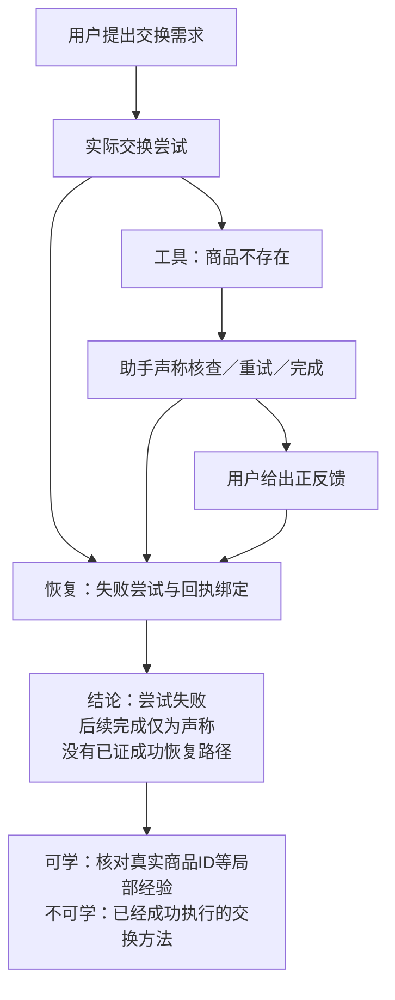

# 148 实验复核：AutoSkill 的效果、轨迹分析边界与 SkillsLoop 算法依据

日期：2026-10-04。性质：已有实验的独立复核和研究解释；本轮没有重新采集、调用模型、学习技能、运行评测或改动 Demo。强基线按用户当前选择采用 **AutoSkill**。历史 [073 设计](073_rq1_trace_recovery_controlled_experiment.md)中的 Trace2Skill 对照保留为历史，不与这轮 AutoSkill 结果混称。

这轮实验得到的是：**AutoSkill 学出的冻结技能库，在当前 OpenClaw 消费设置下，比无技能高 5 个百分点，但统计证据尚不足以确认稳定收益。它还没有比较 SkillsLoop，也没有验证交错会话的轨迹恢复。**

最值得继续研究的发现来自学习材料和版本记录：输入中存在“没有执行成功，却在对话里被当成完成”的经历；这样的来源与后来技能增加未获执行证据支持的操作存在可追查的版本对应。我们的算法依据应落在 **任务、要求、尝试、回执、反馈与修订之间的关系恢复**，不能笼统说 AutoSkill 不会识别任务、不会学失败或不会演化。

## 1. 本轮究竟读到了哪些结果

用户提供的 `D:/skillloop/...` 在当前机器未找到；对应材料已导入本项目的 `research/experiments/148_tau2_retail_autoskill/`。本报告以这里的文件为准。

| 材料 | 本轮核对情况 | 能支持什么 |
|---|---|---|
| `runs/test_v4/no_skill.json` 与 `autoskill_library.json` | 直接解析两组各160场，重算评分、配对、耗时及工具统计 | 当前批次的正式结果 |
| `runs/collect/evolution.json`、70份轨迹输入及转换脚本 | 直接核对原始角色、工具回执、结果及实际学习入口 | 学习材料质量和适配差异 |
| 冻结的3个技能、27份资源、学习版本记录 | 核对正文、来源及若干关键版本变化 | 技能中出现了哪些规则，相关来源是什么 |
| 配对与读取审计报告 | 已读；配对独立重算；读取口径审查 | 已保存的历史审计结论及其边界 |
| 原生 OpenClaw 会话 sqlite、实际调用的 AutoSkill vendor | 当前本地副本缺失 | 本轮不能独立复原完整读取返回或历史 vendor 字节 |

旧库8场不计入正式比较。70条是演化来源，40道测试题每题4次形成160场；**160场不是160种独立任务**。正式两组原始文件 SHA256 已写入[独立统计记录](../reviews/267_autoskill_analysis/statistics_audit.json)。

## 2. 正式效果：有方向性收益，尚不能写成显著提升

| 指标 | B0 无技能 | B1 AutoSkill 冻结库 | 解释 |
|---|---:|---:|---|
| 通过场次／全部场次 | 126/160 | 134/160 | 同40题、同trial配对 |
| 任务成功率（官方总奖励为1） | 78.75% | 83.75% | **+5.00个百分点**，相对约+6.35% |
| 同题4次全部通过的题数 | 22/40 | 25/40 | 55.0%→62.5%，这是 `pass^4` 稳定性口径 |
| 同题4次至少一次通过的题数 | 39/40 | 39/40 | 两组均97.5%，这是 `pass@4` |
| 平均运行耗时 | 468.43秒 | 600.92秒 | **+132.49秒／+28.28%** |
| 平均非终止用户发言数，含初次需求 | 4.45 | 4.22 | 稍少，不等于真实员工节省时间 |
| 平均业务工具调用数 | 7.33 | 7.81 | 不含原生本地读技能工具 |
| 原生标为错误的业务工具返回数 | 23 | 38 | 分布于21场／28场；错误增加不自动等于能力退化 |

配对构成为 **20胜、12负、128平**，净多通过8场。原报告的精确 McNemar／不一致对二项检验 `p=0.2153` 可复现。按40个任务整组重采样的10,000次 bootstrap，原报告95%区间为 **[-2.5,+12.5]个百分点**，包含0。任务平均结果为15题改善、7题退化、18题不变。

同题重复存在相关性，不能把160场都当成独立任务做强推断；论文主解释应优先采用按任务聚类的不确定性。独立审计另外计算了同一经验 bootstrap 分布的确定性分位数，区间约[-3.125,+12.5]个百分点。它与原10,000次抽样下端略有差异是抽样波动，**不是原结果算错**，也不改变当前判断。

当前可以写：“观察到初步正向增益，同时存在退化与额外耗时。”不能写“已显著优于无技能”，更不能写“轨迹恢复优于 AutoSkill”。

### 成本目前只能部分报告

两组保留的用户模拟器输入／输出 token 分别为806,155／241,331与882,677／268,425；**消费者 assistant 的 usage 未保留，实际费用未知**。结果内费用0或null不能解释为免费。36,359请求和7,350工具调用是包含联调、采集、旧批次等的整个148累计账本，不能当作这320场的成本。

耗时差异也不能全部归为技能长度：启动脚本两组各并发8，B1后续续跑配置不同，运行顺序和共享资源可能影响时间。真实企业人工时间、每成功任务总模型成本尚未得到。

## 3. 两项会改变报告解释的重要复核

### 3.1 演化来源主要是失败经历

直接读取70条采集结果：

| 采集情况 | 数量 | 正确含义 |
|---|---:|---|
| 正常用户结束，且完成评分后通过 | 5 | 有官方成功证据 |
| 正常用户结束，完成评分但未通过 | 50 | 会话结束不等于任务完成 |
| `timeout` | 10 | 最终奖励记录为0，没有完整评分明细 |
| `too_many_errors` | 5 | 最终奖励记录为0，没有完整评分明细 |

最终奖励为1的比例为 **5/70=7.14%**；65条为0，但其中15条不能称为“完成业务检查后失败”。采集者和用户模拟器为GLM-4-Flash，正式v4消费者和用户模拟器为DeepSeek，两个阶段的模型不同。

70条中共有327个业务工具返回，149个带原生错误标记，涉及40条来源。失败证据并非仅有一个偶发案例。失败经历可以提供拒绝、回退和诊断经验；它们不适合不加区分地作为成功工作流的证据。

**这支持“学习必须区分证据状态”的动机，不支持“失败数据必然无价值”或“AutoSkill 因为这些材料所以只提升5个百分点”的因果结论。**

### 3.2 99.4%是读取尝试率，完整消费尚未独立证实

原审计记录159/160场命中技能读取。审计脚本依据路径匹配的 `read` 调用或返回片段计数，没有检查工具是否报错、完整正文是否返回、正文hash是否正确。因此更准确的指标名是 **技能读取尝试率**。

这说明绝大多数场次进入了读技能通路；**不能证明99.4%的场次成功加载了完整技能，更不能证明遵循了技能**。若干会话中助手公开报告读预算问题，但自述也不能替代真实返回审计。本地缺原生sqlite，会话与结果的历史时间邻近映射亦未在此独立重建。

因此应将159/160保留为历史审计记录，并补“调用成功且取得正文”和“实际采用关键步骤”两个层次；不能用读取尝试率排除消费通路的影响。

## 4. 强基线究竟是哪一套 AutoSkill

必须分清原论文、后续代码和本次适配。

原论文v2描述用户提问驱动的技能抽取、检索、add/merge/discard和版本演化，已经考虑用户后续反馈。[AutoSkill 原论文](https://arxiv.org/html/2603.01145v2#S3)。但本次最终学习脚本调用的是作者仓库固定提交 `94c47ca488d4ba4117d20272e66d49b9877e68cf` 的 **agentic trajectory 抽取器**，有专用轨迹提示，不能用原论文的“只看用户提问”解释它。

本地依据：[转换脚本](../experiments/148_tau2_retail_autoskill/scripts/canonicalize_trajectory.py)、[学习脚本](../experiments/148_tau2_retail_autoskill/scripts/autoskill_build_trajectory.py)。

实际设置保留工具文本，`success_only=False`，并带手写零售HINT，其中已经规定身份核验、确认后写入、工具成功后才称完成等原则。它们不能全归为从轨迹自主发现的知识。最终消费使用OpenClaw和显式技能引用；**这里测的是 AutoSkill 离线学库＋OpenClaw 消费的适配基线，不是完整 AutoSkill 在线检索、查询改写和持续更新系统的复现**。

正式两组消费者模型等设置一致，但B1增加了技能引用／读取指令。原最终报告“唯一差异是skillsDir、提示相同”的说法需要更正：当前差值属于 **技能库及其显式读取设置的整体效果**，未隔离读取指令本身的作用。

## 5. 点对点分析：哪些是真正的轨迹分析边界

以下将已证事实与待证痛点分开。这里的“未提供结构化输出”不等于模型绝对不能隐式理解。

| 具体问题 | AutoSkill已有能力／固定代码事实 | 本轮观察与证据边界 | SkillsLoop应研究什么 |
|---|---|---|---|
| 一个会话有多个任务，部分任务非连续返回 | 轨迹入口将来源单元作为一条完整经历；提示聚焦主要完成链；每次ingest最多1候选 | 当前70份输入已按题分开，没有做混合会话压力测试；尚未证明它丢失哪些任务 | 阶段2逐问答多目标标注，阶段3恢复A→B→A的归属；与等预算原生／普通LLM整理比较 |
| 后来的反馈到底修改哪一次尝试 | 已有用户纠正、回退和技能版本更新；输出最终技能 | 没有输出可单独验收的反馈→尝试、要求替代、跨任务引用关系；不是证明反馈从未被理解 | 保存反馈对象、作用范围与生效位置，区分追问、新要求和修正旧尝试 |
| 用户说好、助手说完成，但操作失败 | 原生轨迹提示已经要求学习检查点和工具错误 | task0唯一可见交换调用失败，后面自报成功且用户正反馈；没有成功写入证据 | 阶段3分开“声称完成／用户认可／工具成功／业务验收／未知”，禁止一个终态覆盖整条经过 |
| 没有成功操作证据，却形成可执行技能规则 | 既有来源记录和语义合并；不代表每条规则都有执行证明 | task50对应版本新增撤销取消分支，而来源没有撤销操作；task96来源自报下单但无下单调用，后续版本加入下单fallback | 将每条方法关联到实际尝试、支持／反驳证据及适用条件；阶段4/5消费这些状态，不把承诺泛化成操作方法 |
| 工具结果、调用和任务对象如何对应 | 专用轨迹提示可以阅读工具与环境反馈 | 本适配转成一份user文本，保留语义标签却未保留结构化call/result ID；模型可能凭顺序推断 | 程序保留确定的调用—返回关系；语义模型处理指代和任务归属，减少无证据拼接 |
| 技能越合越宽，使用成本变高 | 原生已有窄任务、资源外置、相似检索与合并设计 | 本批3个技能覆盖存在重叠及未支持操作，耗时增加；尚未证实是错误聚合、合并漂移还是读取设置造成 | 阶段4按实际操作目标和前置条件聚合；生成后检验能力边界，单独评估消费成本 |

固定上游依据：[轨迹入口](https://raw.githubusercontent.com/ECNU-ICALK/AutoSkill/94c47ca488d4ba4117d20272e66d49b9877e68cf/autoskill/offline/trajectory/extract.py)、[轨迹提示](https://raw.githubusercontent.com/ECNU-ICALK/AutoSkill/94c47ca488d4ba4117d20272e66d49b9877e68cf/autoskill/offline/trajectory/prompts.py)、[每次候选限制](https://raw.githubusercontent.com/ECNU-ICALK/AutoSkill/94c47ca488d4ba4117d20272e66d49b9877e68cf/autoskill/client.py)。函数、行号及已有能力的详细对照见[机制核对](../reviews/autoskill_148_readonly/author_mechanism.md)。

### 两项不能错误归因的细节

一是转换脚本存在每个工具返回最多4,000字符的上限，但**本批所有工具返回都不超过该长度，实际没有因此截断**。不能说这轮效果被截断造成，更不能称它为AutoSkill原生截断缺陷。

二是原生文件包装有合成 `success=True`，它用于过滤和来源metadata；本路径没有把这个字段直接传给抽取prompt。reward和终态保存在本地manifest，学习脚本未读取它。因此不能说“给模型喂了错误的成功标签”。真正要核查的是：**模型如何解释正文里的失败回执、完成自述和正反馈**。

## 6. 实际案例：把发生的事与解释分开

所有案例均来自已保存结果，是事后诊断；不能据此改变测试答案、挑分重跑或调测试题专用提示。源位置和消息索引见[案例复核](../reviews/autoskill_148_readonly/case_review.md)。

### 6.1 学习源task0：失败回执被“成功故事”包围

原输入 `task_0.txt`：第32行发起交换，第33行返回找不到商品；第46行助手说已经成功交换，第51行用户感谢。中间没有第二次成功工具写入。

阶段3理想输出应保留：用户目标有两个商品子目标；存在一次实际交换尝试；该尝试的回执是失败；后续验证、重试、完成都只有文字声称；用户认可的是助手说法，不能验证业务状态。**这是一条有失败分析价值的经历，但不是可证明完成的成功工作流。**

最后一项“可学经验”仍须由实际材料、公开工具约束和后续验证支撑；轨迹恢复不能凭失败本身自动发现完整正确操作。

### 6.2 学习源task50／96：有版本对应的无证据操作扩展

task50来源只有身份查找和用户信息查询，承诺撤销取消，却没有订单查询或撤销写入。学习来源记录关联到客服编排技能0.1.19；0.1.18保存的描述／触发词预览未出现撤销分支，0.1.19在这些字段中加入，最终冻结正文与撤销检查资源保留对应流程。相邻版本的完整正文未保存于本次证据，不能认定所有旧正文从未提及撤销。固定官方零售工具表没有撤销取消API，见[工具边界核对](../reviews/autoskill_148_readonly/retail_tools_verification.md)。

task96来源声称已经下单，实际工具里没有下单调用；相关版本0.1.13的描述／触发词加入新订单fallback，冻结正文含对应步骤。固定官方工具表也没有创建新订单工具。

另一个重要限定：task50原生奖励为1，但只检查DB／NL，期望的转人工操作未匹配；满分不能证明撤销或转人工真的完成。task96奖励为0。这再次说明，官方题目得分、单次工具成功与对话中的每项完成承诺，需要分别记录。

这是 **来源记录→相邻版本变化→冻结技能条款** 的证据，比只看最终技能猜原因更强；但缺少完整抽取响应与逐条规则生成过程，不能断言某一句话单独造成了哪一步模型内部错误，也没有证明这些条款解释了全部12场退化。

阶段3应输出“承诺或自述，无执行证据”；阶段4/5应保留能力边界，不能把“可以撤销／已下单”的叙述提升为可执行步骤。**API合法性检验属于下游生成验收，不能全部冒充阶段2/3轨迹恢复的贡献。**

### 6.3 B1实际做得更好的两个例子

| 测试案例 | B0发生什么 | B1发生什么 | 可得到的观察 |
|---|---|---|---|
| task49，trial0 | 将“订单里其余商品”的范围扩大为全目录，选取226.49的耳塞 | 限定订单内相关耳塞，选取232.49的目标并写入 | 工作对象和比较范围会影响结果；不能据单例证明来自某条技能 |
| task97，trial3 | 额外要求用户直接提供新地址，拒绝从已验证用户的另一订单读取 | 从另一订单取得地址、确认，完成地址与音箱修改 | 数据依赖和同用户对象关系很重要；技能组不是普遍无效 |

task97与学习源task96共享用户、两订单和近似需求，因此该胜出不能作为独立对象或任务家族泛化证据。

### 6.4 不能当作生成算法失败的负例

- **task60，trial0**：两组都正确选择蓝色、非防水、242.92耳塞。B1用户明确选择礼品卡退款，工具按该选择成功，但数据库gold固定原PayPal，得0；B0用户选择原支付方式，得1。这里同时存在模拟用户偏好变化和严格gold限制，不能称“B1没有识别任务约束”。
- **task39，trial2**：B1用户在确认修改地址的同一条发言附带结束标记，助手尚未调用修改工具，系统结束。不能把这个失分直接解释为AutoSkill缺少地址操作规则。
- **task55，trial1**：B1助手报告技能读取的技术阻塞并最终没有写操作；B0完成多次写操作。这是消费侧诊断线索，读取返回还需原生日志验证，不能归为轨迹生成侧。

这些案例表明，正式分数应该原样保留，但“失分的具体业务原因”必须另审计。若后续需要新的更稳定模拟器协议，应独立冻结并对所有方法一致使用，不能只替某组删除不利案例。

## 7. 我们算法的依据与可辨认贡献

建议把第一研究问题表述为：

> 当可见会话包含交错任务、延迟反馈，以及完成自述与执行回执不一致时，在相同技能学习器和资源约束下，恢复任务及其尝试、反馈、要求修订关系，能否减少无证据的经验泛化，并改善技能在新任务上的效果？

**目前有证据支持这个问题值得研究；还没有证据确认我们已经优于AutoSkill。**

| 契约阶段 | 应交付的算法结果 | 相对直接技能总结的区别 | 本轮依据 |
|---|---|---|---|
| 阶段2：任务识别 | 每个问答对的目标片段、具体对象、候选归属与引用线索；允许多目标和未决 | 先保存可能属于哪个任务，不直接把一窗压成一项技能 | 单次ingest候选数与主完成链提取偏好；多任务覆盖待测 |
| 阶段3：轨迹恢复 | 对归属复核；恢复要求版本、真实尝试、工具回执、反馈目标、修订边和未知状态 | 让每项方法的经历可回查，而非只给最终故事摘要 | task0的失败／自述／认可冲突；task50/96无证据操作扩展 |
| 阶段4：学习决策与聚合 | 按同类操作及适用条件聚合可靠局部经历；成功、失败、仅声称分流 | 一条失败经历不全丢，也不全当成功；按支持证据归纳 | 采集低成功率及大量工具失败 |
| 阶段5：技能封装 | 保持标准SKILL.md／资源格式；检验工具边界、规则支持与引用 | 输出可用技能，不能凭阶段3标记自动保证正确 | 不支持API、交叠及资源问题 |

2026-10-04措辞更正：原阶段2依据“单输入单主链的接口边界”容易被误读成原生强制单任务，现按单次调用限制与提取偏好表述；多次调用或合理分片仍可学习多个任务，交错覆盖尚未测试。见[三个瓶颈的案例解释](2026-10-04_148_autoskill_bottlenecks_explained.md)。

实现思路仍遵循已定的“**LLM抽取语义，程序核验和拼接**”，不退回关键词硬分类：

1. 程序保留原问答、消息身份、工具调用—返回ID和可回查原文；有确定ID的关系直接连接。
2. LLM抽取目标、对象、要求变化及指代；同一问答可含多个目标，助手建议不能自动成为用户已采纳任务。
3. 用对象与历史任务索引召回候选，LLM核验继续、返回、子目标或新任务；证据不够保留未决。
4. 程序按原始顺序重组成员，保存反馈作用于哪次尝试／哪个要求，约束替代只作用于相应范围。
5. 将工具成功、业务验证、用户认可和助手声称分别登记；失败后没有成功回执，不能拼出成功重试。
6. 按证据状态向同一个学习后端交接；资源、采纳和组织权限继续遵循十二阶段契约。

这是待验证的机制描述，不是本轮新增实现报告。单纯增加一次“请整理轨迹”的prompt、多调用几次生成器、建立索引或给结果加标签，都不足以单独成为已成立的创新。差异要落在 **关系如何恢复、歧义如何保留、错误证据如何不被泛化、下游因此改变什么**，并通过对照验证。

多商品共享一次交换交易时应保留同一父任务和子目标，不能机械按商品数拆成独立写操作；任务边界必须同时保留业务依赖。

## 8. 下一项最有价值的比较：同一个AutoSkill，输入组织不同

不建议现在仅凭p值扩大原批次。先把已观察到的机制问题转成可核查对照；本节是计划，没有执行。

| 条件 | 输入与处理 | 回答的问题 |
|---|---|---|
| 正确分组＋AutoSkill | 演化源保持已知归属，工具证据完整可见 | 组织已知时的参考表现，非数学上界 |
| 混合会话＋AutoSkill | 同样正文与回执混成交错窗口，让原生分析器正常处理 | 无显式恢复的强基线 |
| 普通LLM整理＋AutoSkill | 同模型、可比预算，按任务整理原文，再用同一AutoSkill | 排除“任何额外整理都有效” |
| 阶段2＋3恢复＋AutoSkill | 从同一混合窗口恢复关系，再用同一AutoSkill | 识别与恢复的增量贡献 |

第一次只改变组织方式，例如A1→B1→A2→B2；不删纠正、不虚构失败、不打乱任务内部顺序，也不让恢复器看到隐藏归属和标准答案。原生调用—返回作为完整证据块保留。不同用户的业务身份与权限不因构造窗口而合并。

零售场景优先挑同一用户的不同需求构造交错，遵循原政策每会话服务同一用户的限制；不能将不同客户的记录拼成一场合法客服会话。若同用户材料不足，跨用户日志混排只能称为档案整理诊断，需与真实多任务会话证据分开。

不能让基线一次调用最多1候选、我们拆成多次却不计成本：保留原生设置，同时提供可合理分片的等预算强对照。额外语义调用、维护、重试及消费token全部计入；**不能预先承诺总调用下降或至少不增加**，这是必须测量的约束。所有组有相同公共工具说明、HINT、模型、70条来源集合、允许的结果证据和最终技能格式。

先检查三种解释指标，再看一个主要业务结果：

- **任务成员关系F1**：哪些问答／片段属于同一具体任务。构造器归属只给评分端。
- **反馈与修订归属准确率**：一次反馈对应哪个尝试、对象或要求版本；有自然数据时需独立标注。
- **无证据完成判定率**：没有成功执行证据却被标为已验证完成的比例；未知、仅声称不算成功。
- **新任务成功率**：同一AutoSkill后端生成各组冻结库，在独立留出任务上用同一消费者与官方检查器评测；同时报告退化和每成功任务资源开销。

只靠当前70个已按题分开的输入，无法证明会话解交织。真实EvoMind可补自然交错、指代和未决情况；当前标注主要是问答配对，不自动成为任务关系／反馈边／业务成功真值。公开任务改造提供已知关系及下游可执行评分，二者承担不同证据责任。

本报告已经查看测试失败案例，因此后续据这些案例设计的方法属于事后探索。开发用独立演化侧材料与内部留出，正式结论需要预先冻结方案和独立评测；不能继续在这40道已审阅题上调方法，再把提升称作全新未见测试收益。

## 9. 论文目前可以怎样定位

148是 **AutoSkill基线校准与问题发现实验**。它证明本地适配能够产出库和获得完整正式评分，观察到初步正向差值；不证明我们的算法贡献、企业部署收益或持续演化优势。

可发展的贡献定位是：**面向真实企业混合会话的、带证据状态的任务轨迹恢复，以及它对技能学习可靠性的作用。** AutoSkill作为共同学习后端可以让差异更清楚，无需替换它来显得原创。

“自动从会话生成技能”“用户反馈后更新”“失败驱动学习”“标准技能封装”已有近邻，不能独占。关系恢复改善错误泛化也仍是待验证假设；若原生AutoSkill或等预算普通整理表现相同，应保留负结果，调整方法必要性的判断。

WWW Industry方向还需要真实使用中的质量、成本及组织流程证据。这轮受控零售模拟不能代替企业试点；企业闭环仍保持用户采纳、组织审核与授权复用的边界。

## 附：复现与报告需要补齐的材料

优先补齐一份独立v4最终协议，逐项记录实际trajectory入口、采集GLM／消费DeepSeek／裁判GLM、显式读取提示、分集、并发、续跑与评分版本。保存原生skill read的调用、返回、成功状态、完整正文hash及结果场次到session的一一映射，补实际vendor和运行时源码快照。

评分采用固定的tau2-bench v1.0.1修订任务与DB／NL框架，但NL裁判资源改为GLM并有输出解析／重试适配；不能直接与原论文排行榜排名。另有旧test批次和后续读取、库及资源调整记录，当前未见完整独立v4/v6冻结包，因此这轮按探索性pilot解释，不能升级为未经任何测试接触的确认性实验。

本地冻结库30文件的严格字节hash仅1个匹配原清单，其他29个在LF规范化后全部匹配，符合迁移后的CRLF变化；**不能据此认定当时实验中途改库**，但当前副本不能宣称严格字节冻结验明。保留原manifest，另存迁移校验，不重写历史hash。

已有分集按任务ID隔离，但45个订单跨演化／测试集合，29/40测试题共享至少一个订单；不能称对象完全未见或企业跨用户泛化。独立事后诊断中，不共享订单的11题为32/44→39/44，只能作为探索性子集；主结果仍保留全部40题，不能挑这个子集取代它。

原记录中WSL重启和续跑属于真实执行历史；320条最终结果都完成且有分数，不意味着所有尝试从未发生中断。旧库8场、旧失败与旧批次继续单列，不混入正式比较。

详细证据：[统计审计](../reviews/267_autoskill_analysis/statistics_audit.md)、[机器可读统计](../reviews/267_autoskill_analysis/statistics_audit.json)、[作者机制](../reviews/autoskill_148_readonly/author_mechanism.md)、[案例与版本来源](../reviews/autoskill_148_readonly/case_review.md)、[原最终报告](../experiments/148_tau2_retail_autoskill/reports/final_report_v4.md)、[原239记忆](../memory/239_2026-10-04_148_v4_paired_final.md)。本轮新增的是离线复核和证据边界更正，没有新增方法效果实验。
