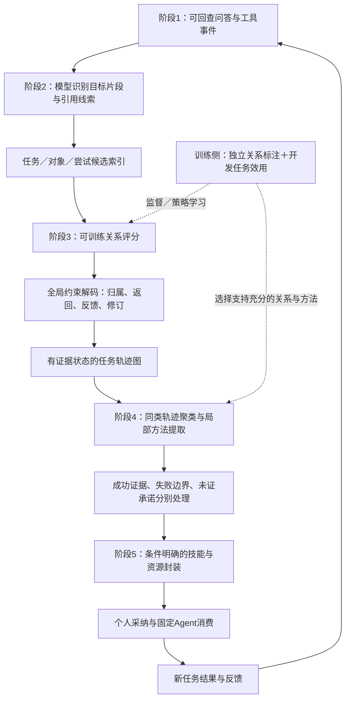

# 从148 AutoSkill基线走向独立的轨迹关系学习方法

日期：2026-10-04。性质：既有结果复算、主源文献调研和优化设计。未启动模型实验、训练或服务，未修改Demo、原实验、原分数或技能库。

**研究问题保持不变：理解真实会话中的任务、对象、要求版本、执行尝试、工具结果、反馈与修订关系，从这些关系中学习可复用技能，并提高后续任务的客观表现。AutoSkill是强基线，不是本项目已选定的采用方案。** 用户本轮明确把显著提高benchmark评分作为研究目标，并允许提出SFT、强化学习和启发式算法路线；这不等于效果已经成立或本轮授权执行全部训练。

## 1．第一个问题能不能归因于用户模型差？

不能把“用户感谢”本身当作模拟错误。固定官方文本协议不把客服的工具调用和回执直接交给用户；用户看到的是客服话语。task0先听到操作出错，后来又听到“已经核验、重新处理、交换成功”，因而相信客服并感谢，是可以理解的。真正明确的冲突是科研记录里没有后续成功执行，而客服宣称完成。[官方用户历史过滤](https://raw.githubusercontent.com/sierra-research/tau2-bench/fc0055dc4e0a316c3f83133267fbd6faaa770992/src/tau2/user/user_simulator_base.py)、[消息路由](https://raw.githubusercontent.com/sierra-research/tau2-bench/fc0055dc4e0a316c3f83133267fbd6faaa770992/src/tau2/orchestrator/orchestrator.py)。

但task0另有可定位的模拟偏离：保存场景没有商品编号，用户却给出KB12345等未获场景或先前核验支持的编号；原场景的键盘备选是无背光款，后续用户改成只交换恒温器。前者属于场景外信息，后者影响官方目标与实际对话要求的一致性。它们支持“此条模拟存在偏离”，不证明用户模型总体质量差。[场景](../experiments/148_tau2_retail_autoskill/inputs/retail_tasks_v1.0.1.json:9)、[原始用户发言](../experiments/148_tau2_retail_autoskill/autoskill_input/trajectories/task_0.txt:4)。

应分清三项责任：模拟用户是否忠实保持场景；客服是否核实标识、执行并如实报告；学习器是否正确连接执行与反馈证据。即使改用更强的用户模型，用户信任客服、任务往返、要求变化和结果不确定仍会存在，关系恢复主线不能因此取消。

采集阶段客服和用户均为GLM-4-Flash，正式v4两者均为DeepSeek Flash，不能用5/70与134/160之差单独估计“用户模型造成多少影响”。若确需因果校准，后续在独立开发题上进行客服模型×用户模型的2×2配对控制；各条件使用相同场景和政策，用户不额外看到gold、评分或客服后台回执。所有模拟偏离按统一规则审计，不因哪组失分就删哪组。完整证据与历史运行时限定见[模拟器核对](../reviews/148_nextplan_simulator.md)。

## 2．本次AutoSkill基线全部可报告指标

以下主结果来自同40题×4次的v4配对，B1是冻结v2库＋显式读取设置。各项原始定义、全精度、分位数算法、技能逐文件大小、历史批次和累计账本拆分见[完整指标表](../reviews/148_nextplan_metrics.md)及[机器可读结果](../reviews/148_nextplan_metrics.json)。原库8场不计入正式比较。

### 2.1 任务质量、稳定性和统计证据

| 指标 | B0无技能 | B1 AutoSkill | 解释 |
|---|---:|---:|---|
| 独立题目数／每题重复 | 40／4 | 40／4 | 不是160种独立任务 |
| 保存场次／有效奖励 | 160／160 | 160／160 | 160对task/trial、seed一致 |
| 成功／失败场次 | 126／34 | 134／26 | 官方总reward=1为成功 |
| 平均总分／成功率 | 78.75% | 83.75% | +5.00个百分点，相对+6.35% |
| 两次均成功估计pass^2 | 67.50% | 74.1667% | 由已观察4次计算 |
| 三次均成功估计pass^3 | 60.625% | 67.50% | 同上 |
| 四次全部成功pass^4 | 55.00%（22/40） | 62.50%（25/40） | 重复稳定性 |
| 至少一次成功pass@4 | 97.50%（39/40） | 97.50%（39/40） | 不等于四次全成功 |
| 四次全失败 | 1/40 | 1/40 | 两组均有完全失败题 |
| 0／1／2／3／4次成功的题数 | 1／5／3／9／22 | 1／2／4／8／25 | 同40题分布 |
| 数据库检查通过 | 126/160 | 135/160 | B1一场数据库过、语言检查不过 |
| 自然语言检查通过 | 156/156 | 154/156 | 各4场仅数据库检查 |
| 配对胜／负／平 | — | 20／12／128 | 两组都成功114，都失败14 |
| 按题均分改善／退化／不变 | — | 15／7／18 | 以题为单位 |
| 原场级精确McNemar双侧p | — | 0.2153 | 同题相关性需限定，未显著 |
| 任务级符号检验双侧p | — | 0.1338 | 未显著 |
| 原任务聚类bootstrap差值95%CI | — | [-2.5,+12.5]个百分点 | 40题整组抽样，含0 |

pass^k按每题成功数c计算C(c,k)/C(4,k)，再平均40题；不是总体成功率的k次方，也不外推k>4。当前点估计正向，但没有显著收益证据。完整审计另保留经验分布确定性分位数下端-3.125个百分点，不改变主判断。

### 2.2 耗时、沟通、工具与费用

| 指标 | B0 | B1 |
|---|---:|---:|
| 平均单场耗时 | 468.43秒 | 600.92秒 |
| 耗时P50／P95 | 446.37／660.80秒 | 597.00／697.01秒 |
| 耗时最小／最大 | 337.42／792.65秒 | 366.39／733.28秒 |
| 单场耗时总和 | 74,948.59秒 | 96,147.28秒 |
| 全部用户消息 | 872 | 835 |
| 非终止用户消息总数，含初始请求 | 712 | 675 |
| 每场非终止用户消息均值／P50／P95 | 4.45／4／7 | 4.21875／4／6 |
| 初始请求后非终止用户消息均值 | 3.45 | 3.21875 |
| 业务工具调用总数 | 1,173 | 1,250 |
| 每场业务工具均值／P50／P95 | 7.33125／7／11.05 | 7.8125／7／12.05 |
| 显式工具错误总数 | 23 | 38 |
| 每场显式工具错误均值／P50／P95 | 0.14375／0／1 | 0.2375／0／2 |
| 工具返回显式错误率 | 1.9608% | 3.0400% |
| 出现显式工具错误的场次 | 21/160（13.125%） | 28/160（17.50%） |
| 用户终止／空奖励场次 | 160／0 | 160／0 |
| 模拟用户输入token | 806,155 | 882,677 |
| 模拟用户输出token | 241,331 | 268,425 |
| 模拟用户token合计 | 1,047,486 | 1,151,102 |
| 消费者非空usage记录 | 0 | 0 |
| 消费者、judge总token及实际费用 | 未知 | 未知 |
| 正式v4每组LLM请求总数／总费用 | 未知 | 未知 |
| 每成功任务完整成本／员工净节省时间 | 未知 | 未知 |

平均耗时+132.49秒／+28.28%，工具+0.48125次／场，用户非终止发言-0.23125条／场。运行并发与时段有差异，不能把耗时增量全部归因技能长度。消息条数不能换算真实员工工时，显式工具错误不覆盖所有语义错误。单场耗时相加也不是并发批次墙钟时间。

### 2.3 演化来源、技能库和消费证据

| 指标 | 观察值 |
|---|---|
| 原划分train／dev／正式演化／test | 74／4／70／40题 |
| 演化成功／保存0分 | 5／65，成功比例7.1429% |
| 正常评分通过／未过 | 5／50 |
| 超时／错误次数过多 | 10／5，15条缺完整评分分项 |
| 采集助手／用户／工具消息 | 1,452／1,117／327；公开非空助手正文1,125 |
| 采集显式工具错误／涉及任务 | 149／40题 |
| 工具返回因4,000字符上限实际截断 | 0条 |
| 学习输入／处理登记 | 70条；processed70／failed0，仅处理状态 |
| 冻结主技能／引用资源／总文件 | 3／27／30，1个引用资源为空 |
| 三份主技能正文大小，规范LF | 84,013字节 |
| 整库大小，规范LF | 106,986字节，约104.48KiB，不是token |
| 持久向量 | 3×1024 float32，12,288字节 |
| 历史技能读取尝试率 | 159/160＝99.375% |
| 三主技能读取尝试会话数 | 159／159／158 |
| 完整正文成功加载／步骤遵循率 | 未知，缺原生sqlite及完整对应审计 |
| 生成有效率、独立技能效用、关系F1／反馈边F1 | 未测，不能填0 |
| 学习专属调用／token／费用／耗时 | 未知，现账本不能完整归属 |
| 用后演化增益、跨用户组织收益 | 本批没有测量 |

主技能exchange／support／product正文分别29,158／46,536／8,319字节，引用资源分别7／19／1。按题号分组无重叠，不代表订单族和语义隔离：准备期审计有45订单跨集等风险。3份技能不是3个独立算法重复，读取尝试不等于加载成功、理解或遵循。

### 2.4 累计历史账本，不能混入v4成本

| 账本路由 | 全历史条数 | 记录completed | transport error | HTTP error |
|---|---:|---:|---:|---:|
| consumer | 20,253 | 20,248 | 4 | 1 |
| user | 14,469 | 14,450 | 19 | 0 |
| judge | 1,037 | 1,037 | 0 | 0 |
| autoskill | 205 | 200 | 0 | 5 |
| embed | 370 | 362 | 0 | 8 |
| plus | 25 | 25 | 0 | 0 |
| 总计 | 36,359 | 36,322 | 23 | 14 |

路由不是阶段：v2技能学习也走user，因此205不能解释为全部v2生成调用。全账本缺组别、题号、trial、会话和usage归属，无法完整拆正式B0/B1；原累计7,350工具调用也不是这320场的工具数。旧GLM读取不通批次11/160→13/160及旧库8场均在[完整表](../reviews/148_nextplan_metrics.md)独立保留，不合并正式成绩。

## 3．还有哪些强基线，哪些现在能用？

“有论文”与“有可核实作者代码”分开；代码可取得也不等于已在本机跑通。完整版本、入口和权限核对见[基线调研](../reviews/148_nextplan_baselines.md)。

| 方法 | 最值得比较的能力 | 当前可用性与建议 |
|---|---|---|
| AutoSkill | 会话／轨迹抽取、合并、版本维护 | 已有本地适配成绩，继续保留强基线身份 |
| [Trace2Skill v5](https://arxiv.org/html/2603.25158v5) | 逐任务成功／失败分析、验证修正、补丁合并 | [作者代码](https://github.com/Qwen-Applications/Trace2Skill)明确，优先新增；按企业观察证据权限适配时单独标注 |
| [EvoSkill v1](https://arxiv.org/html/2603.02766v1) | 失败驱动技能提案、构建及验证集筛选 | [作者代码](https://github.com/sentient-agi/EvoSkill)明确，可用skill_only限制提示等其他变化；优先第二个新增 |
| [WikiSkill v1](https://arxiv.org/html/2608.27454v1) | 原经验→持久知识wiki→技能更新及回退 | 很直接的中间经验表示近邻；官方代码本轮未核实，不拿同名第三方冒充 |
| [SkillEvoReg v1](https://arxiv.org/html/2609.30861v1) | 外部技能演化的复杂度正则、候选反例验证 | 官方可运行代码未核实；用于机制排重，有实现后再加对照 |
| [SAPO v1](https://arxiv.org/html/2606.08755v1) | 匹配rollout估计技能边际效用，训练生成器及actor | 官方链接当前核实仅README，完整复现尚不可承诺；是RL／效用训练的直接近邻 |
| [EMNLP 2021 co-training](https://aclanthology.org/2021.emnlp-main.181/) | 学习交错消息归属，包含RL会话分配 | 作者代码与训练入口可核实，可作关系层训练对照；需扩展业务关系类型 |
| [Revisiting discourse v2](https://arxiv.org/html/2306.03975v2) | 异质关系图、分层排序、easy-first解交织 | 说明“加图做解交织”已有；作者代码本轮未核实 |

扩展反馈对照可用[ACE](https://arxiv.org/html/2510.04618v3)，但第一轮不必同时堆十种方法。[SkillEvolBench](https://skillevolbench.github.io/)是评测载体，有无技能和原经历复用控制，不是替代关系恢复的算法。此前PersonaMem、WildChat、IRC、LifelongAgentBench和SkillsBench的定位仍按[072](072_public_benchmarks_and_evolution_evaluation_design.md)保留：自然会话、回复关系和可执行任务成功分别承担不同证据，不能因有选择题或回复边就宣称全链路技能收益已能评分。

推荐主比较先为：**无技能、原始经历直接复用、AutoSkill、Trace2Skill、我们的独立方法**。若验证预算充足，加入EvoSkill检验带验证的生成方法；不要因某基线表现强就删它，也不要以其原论文不同模型分数作为本地排名。关系层还必须有预算匹配的强LLM整理和可训练解交织对照。

## 4．优化主方案：训练关系解析，约束恢复，再学习工作流

建议主方案称“面向技能学习的任务轨迹关系学习”，名称暂定。它独立实现阶段2—5，**不以给AutoSkill补三条零售规则替代方法**。十二阶段顺序、个人采纳、组织审核、标准SKILL.md与资源格式保持原契约。

### 4.1 阶段2：先识别语义片段，不让主题词决定归属

输入完整问答上下文和可见事件；输出每对内部的目标片段、对象、预期交付、引用及候选任务，区分开启、继续、返回、子目标、非任务和未决。一对可以有多个目标。助手提出方案不自动生成用户任务，用户采纳后才记录目标转向。

程序索引召回同对象、同类目标及明确引用的候选；局部最近上下文只是一个候选来源，不能把离得远的旧任务永久排除。批量处理不是一回合一次LLM。训练目标包括片段识别与候选召回，漏召回单独报告，否则后续解码再强也无法恢复。

### 4.2 阶段3：学习关系，而不只是输出一份JSON

图中的节点包括目标片段、工作对象、要求版本、执行尝试、工具调用与回执、回答／产物、反馈。需要预测的主要关系是：

- 片段属于哪个任务，是否返回此前任务；父任务与子目标是否有事务依赖。
- 某次尝试采用哪版要求，工具回执对应哪次调用。
- 用户反馈指向哪段建议、哪次尝试或哪版产物；是认可、纠正、选择、追问还是改变要求。
- 哪个新要求替代哪个旧要求的哪一维，何时生效；不同维度的要求可以并存。
- 某个完成说法被什么执行／产物证据支持、反驳，或者尚无证据。

用可训练语义解析器／关系评分器估计候选边概率，程序在全局解码时选择相容的关系。可以采用因子图的最大后验推断，以整数规划或有界beam search实现，比较效果和耗时后定型。形式上：

\[
\widehat G=\arg\max_{G\in\mathcal C(X)}
\left[\sum_{e\in\mathcal E_{\mathrm{cand}}}\log p_\phi(r_e\mid X,c_e)
+\sum_j w_j f_j(G)-\lambda U(G)\right].
\]

X是可见正文与事件，c是召回上下文，关系概率由模型学习；每条候选关系都参与评分，r允许“无此关系”和“尚未确定”，而非只给选中边累加分数。每个目标片段须有任务归属或未决记录，防止空图获利；f表达关系一致性，U惩罚无来源的执行与不必要确定化。所有权重和阈值只在训练／开发侧选择。这是拟议算法，不是已运行公式。

约束只处理有证据的结构事实：真实调用与回执ID有绑定时不得错接；没有调用不能生成“实际执行”的节点；反馈不能修改未被引用或无法支持关联的对象；要求替代只作用于对应任务与维度；共享对象不自动意味着同任务。合同同一文档可服务不同目标，同一订单多个商品可属于共享父任务，不能机械拆成独立写事务。

时间方向和对象变更需允许合法例外：原文顺序未知就不补时间，用户改变对象时应建修订而非硬判不同任务；同步作用于多个要求的反馈允许多目标，不能强制每个事件恰好一条边。证据不足可保留未决竞争解释，由下游仅消费共同有支持部分。

**直接得分路径**是防止具体约束、对象范围、有效要求和修正经过在技能里丢失。例如task96用户接受下单是目标转向，不证明下单完成；task0的感谢连接可见答复，不能覆盖那次失败回执。工具能力验收是下游共同条件，不能单独冒充关系算法创新。

### 4.3 阶段4：聚类的是有条件的方法，不是会话标题

先按目标与操作类召回相近轨迹，再比较规范化的关系图、前置条件、对象范围、依赖及分支。研究实现可用图特征／图相似度配合约束聚类，不将“都提到订单”作为足够合并理由。聚类表示和阈值由开发集验证，与普通语义向量聚类比较。

在每簇抽取局部方法：输入条件→实际动作→回执／可见产物→效果。状态分别处理：有支持的成功方法可泛化；失败可提已确认边界和禁忌；只有实际修正并验证后才称成功恢复；承诺和虚报不能补成操作流程。缺附件不删会话，缺结果保留未知；已证局部方法仍可学习。

跨轨迹汇总支持与反例时，按独立任务来源计数，重放、正文重复和同一来源扰动不增加支持次数。高频只影响学习优先级；重要但只出现一次的任务不因最低频次阈值被全部排除，是否封装仍看方法支持与价值。

### 4.4 阶段5：让关系恢复影响实际技能内容

生成前，每条候选方法携带适用条件、依赖、支持／反驳来源和未知项；生成后验证它有没有保留关键条件、引入无支持动作或扩大范围。工具和政策核对各方法共用，技能封装仍可调用creator，不将creator本身当研究贡献。

相同能力内比较局部规则增量，而不是每次重写整份大技能。用户已经使用某技能时，新轨迹与实际技能版本关联，提出局部更新；未使用技能时形成NEW候选，不以全库匹配强制决定UPDATE。独立候选验证只使用开发侧或后续先测后学材料，不能使用正式测试答案。

技能容量按全部正文与资源token控制，不能只限制目录数。可重复核验的对象／范围检查可封装确定性辅助脚本；使用共同OpenClaw消费协议，不更换消费者权重来制造技能收益。最终是否更精简、更便宜必须实测，不能因多了小模型或过滤器就预先认定调用减少。

## 5．怎样深化到模型层？推荐分三步

### 路线A：结构化学习＋全局约束，先建立可定位机制

先用强LLM提出候选、关系评分和竞争解释，约束解码把局部决定连成一致图。对照同预算普通LLM一次整理／分块整理，避免优势只是额外读一遍。此路线能先检验是否真有关系错误以及它是否传到技能，不能仅凭实现了图就宣称原创。

### 路线B：SFT／对比学习训练关系解析器，建议作为主要模型路线

构造监督样本：完整窗口→目标片段及关系图，困难负例为“主题相同但不同任务”“同对象不同目标”“迟到反馈”“要求只改变一维”“口头完成与回执相反”。负例来自同一可见窗口的合理竞争解释，不只用一眼无关的随机任务。

训练损失包含片段识别、成员／有类型关系、要求作用范围、执行证据状态，并对相近对象或相近尝试的候选做对比学习。先训练一个具可训练权重的中小模型或关系编码器，部署时仍由程序拼接来源；API模型可作teacher，但没有权重访问就不能对它直接做LoRA／RL。

拟议材料规模是5,000—20,000个构造窗口，来源任务数量另报，**这些窗口不是5,000—20,000个独立任务**。先按源任务／文件／用户家族分训练、开发、评测，再做扰动；同源变体全部留在同侧。teacher只作候选标注，隐藏构造归属、明确工具绑定和独立人工核验提供真值，不让本模型自动输出充当自己的评分答案。

### 路线C：用技能效用训练关系决策，机制成立后再上RL

如果关系F1改善却不提高开发任务分数，下一步不是无限加标签，而是让关系模型学习哪些决策真正影响方法归纳。

状态为当前窗口、候选图及任务索引；动作为选择归属、反馈对象、要求替代范围、保留未决或读取一段消歧上下文。可用SFT初始化后做DPO／排序学习，再在可训练开源模型上用GRPO或其他策略优化。DPO和RL是候选实现，先比较反馈稳定性与成本，不要求全部同时训练。

拟议奖励：

\[
R=\alpha R_{\text{关系正确}}
+\beta\,\Delta V_{\text{开发任务技能收益}}
-\gamma R_{\text{无依据}}
-\eta R_{\text{关键证据遗漏}}
-\mu C_{\text{调用与容量}}.
\]

图与技能生成仍可能有随机性，开发侧用相同正文、相同下游、相同消费者，对少数合理竞争图产生的技能进行配对消费，估计关系决策的效用。采用重复与对照，不把一次分差当确定因果；不宣称估计到一条边的无偏因果效应。普通关系真值提供密集信号，实际开发任务收益提供稀疏信号。惩罚关键证据遗漏，避免模型靠删除难任务、全部输出未知、生成极短空库刷奖励。

这一部分与[Mem-α](https://arxiv.org/html/2509.25911)的下游奖励训练记忆、[AAAI 2023解交织RL](https://ojs.aaai.org/index.php/AAAI/article/view/26480)的局部／全局关系奖励，以及SAPO的技能效用训练都有联系。单独“用RL”“按效用筛选”已有工作。候选新增机制应是**将任务—尝试—反馈—要求修订的结构决策与后来技能的行为差异连接，学习有用且忠实的关系恢复**，其独有性还需更全面排重与实验检验。

不建议主实验同时训练消费者actor。消费者变强当然可能提分，但会混淆技能学习的作用；如研究技能与执行policy联合训练，应单列，并让无技能／强基线有相同权重训练条件。用户之前希望减少运行调用，训练成本与推理成本应分开记录和摊销，RL不是免费。

## 6．显著提高分数：需要同时检验两种目标

| 输入条件 | AutoSkill | 我们的方法 | 这个比较回答什么 |
|---|---|---|---|
| 当前预分好的70条来源 | 已观察83.75%，40×4、未证显著增益 | 未执行 | 方法能否在干净输入上超越当前适配基线 |
| 同证据、串行混合窗口 | 未执行 | 未执行 | 自动发现边界与一般整理收益 |
| 同证据、A→B→A交错 | 未执行 | 未执行 | 交错导致的损失能否减少 |
| 同证据、迟到反馈／要求变化 | 未执行 | 未执行 | 反馈和要求关系是否影响后续技能行为 |

每行必须是同内容、同权限、同预算、同消费协议的配对比较。不能拿我们在交错条件的分数与AutoSkill旧干净分数直接相减，也不能把“交错恢复有效”自动写成“超过83.75%”。若重启协议使用新的用户模型或读取修正，各组都重跑该新协议，旧结果独立保留。

建议开发验收目标设为相对强基线**至少+5个百分点的有意义增益**，不是已知效果；正式结论需预先指定主比较，按独立任务／任务家族和独立学习库报告差值与CI，要求主差值的95%CI下界大于0。多项主比较需预先处理多重性，不挑哪个p小就发表哪个。同时报告退化、pass^4及推理／学习总开销。

当前83.75%还剩16.25个百分点空间，不能预设关系方法足以消除全部26场失败。先在允许的开发材料识别可恢复约束／对象／反馈错误，以及技能是否真正采用恢复结果。若主要失败是消费不遵循、模拟漂移或评分约定，单纯改善恢复未必提分；这些问题应分层诊断，不能一律改写成关系缺陷。

原40题的正式历史结果保留。现在已审阅结果和若干失败案例，后续据此开发的方法在这40题上只能作已接触集探索与回归，不再次包装成从未接触的最终评测。只增加同40题的重复次数不能增加独立任务覆盖。

## 7．已有数据与公开基准怎么落实

| 数据 | 本轮确认状态 | 下一步可承担什么 |
|---|---|---|
| EvoMind1,466条主集会话及071覆盖层 | 505条复核会话、2,674项回复匹配完成；不是任务关系真值 | 先固定随机概况样本和诊断样本，再独立标任务、尝试、反馈对象与要求版本；不能假定1,466条都多任务 |
| 148的70条来源及原始evolution.json | 已有真实工具与部分评分、预分题号 | 单任务内部关系与证据冲突诊断；去题号的受控边界测试；不从零重采70只是为凑规模 |
| 148的40×4测试 | 已有正式历史成绩，现已被审阅 | 方法开发后的探索复跑与可修复机会审计，不能充新的未见证据 |
| SpreadsheetBench-Verified | 073已定设计，作者200演化／200评测；本轮未启动本地执行 | 保留外层隔离，演化侧内部分160来源／40开发；办公任务可构造交错，两轮核查真正执行而不编造成功故事 |
| IRC | 有公开reply关系，非用户—AI工具任务 | 关系层迁移／解交织诊断，不能代替技能成功评测 |
| SkillsBench／SkillEvolBench | 有执行与技能对照载体，协议不同 | 主机制成立后最多先加一个外部迁移；原经历复用控制区分抽象收益，公开答案／人工成品技能不进本方法学习 |

构造零售交错时先查70条中同用户、可组合独立目标是否足够；不足不能硬把不同客户拼成合法客服窗口。办公场景可以把独立工作目录下真实生成的问答与回执离线交错，保持任务内顺序、文件版本与证据集合。只混工具日志不能冒充多轮会话；脚本化核查请求与自然反馈分开标识。最终评测保持原生任务与评分，不为制造效果降低标准。

## 8．可落实的工作顺序与停止条件

| 顺序 | 具体交付 | 判定继续的依据 |
|---|---|---|
| P0：证据与协议 | 冻结本轮指标、输入来源、读取口径；未来账本补stage／task／trial／session与usage；独立盲标来源关系及随机自然样本 | 能定位真实关系错误和至少一条“错误关系→错误技能内容”的链；只是图更漂亮不够 |
| P1：关系原型 | 阶段2批量语义片段、索引召回；阶段3候选边、约束解码、未决；普通LLM和可训练解交织接口 | 同证据／同预算下关系和关键要求保留改善；原文覆盖完整，不能删除难片段 |
| P2：独立方法生成 | 有类型轨迹聚类、条件方法与失败边界、标准技能封装；公共能力验收与creator接口 | 开发新任务中具体条件确实进入技能并影响行为；与只加普通整理／能力检查区分 |
| P3：关系SFT | 独立来源分组的数据集、困难负例、SFT／对比训练、蒸馏与未决校准 | 不只拟合合成交错；自然样本与未见模板有效，推理成本有合理表现 |
| P4：效用训练 | 少数竞争关系图的开发侧配对、DPO／RL训练、关系与技能效用消融 | 比仅SFT有下游增量；奖励未被空图／删任务利用；训练成本如实记录 |
| P5：正式评测 | 冻结方案／至少3个独立学习随机种子；AutoSkill、Trace2Skill和本方法，预算足够加EvoSkill；200题等独立任务主评测并按开发侧功效分析定最终规模 | 主差值与CI、退化、生成随机性、资源证据齐全；200题不预先保证显著 |
| P6：演化与企业试点 | 冻结库对持续更新库；个人采纳、执行、反馈、局部更新、组织审批与跨成员复用的未来观察 | 更新有增益且退化受控；真实部署工时与组织收益另计，不拿公开分数代替 |

P0—P2先回答机制是否存在；P3—P4深化到可训练模型／策略；P5验证分数，P6形成企业闭环证据。训练侧、开发侧、正式评分侧权限与材料分别冻结。需要更多资源时优先增加独立来源与任务家族，不能只靠重复旧40题获得小p值。

保留073中的同学习器控制作为**机制实验**：用普通整理、我们的恢复及人工关系参考分别喂给同一AutoSkill或Trace2Skill，用来隔离阶段2/3作用；完整方法的主比较则是各自独立阶段2—5，不默认采用AutoSkill。至少保留两项关系消融：同正文去掉全局关联核验；同成员分组去掉反馈对象／要求版本边。效用训练成立后再加“仅SFT”与“仅技能筛选”控制，避免一次展开所有组合。

本轮结论是优化设计与基线选择，不是成功实验。候选路线能提出可检验的提升路径；是否显著超越AutoSkill，仍取决于恢复错误的实际覆盖、下游使用以及独立评测。
