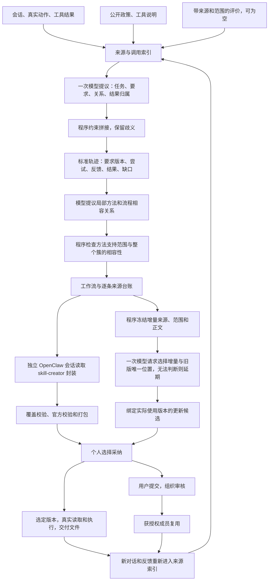

# 关系恢复驱动的启发式 Skills 全管道：实现与验收

本轮从2026-10-04开始，跨日于2026-10-05继续验收；运行目录使用UTC时间编号。

本次把已讨论的方法接入独立 Demo：先恢复“哪些事属于同一任务、哪些要求改变了、反馈针对哪次尝试、结果证明了什么”，再据此归纳技能。没有启动微调、强化学习或大规模 benchmark；AutoSkill 保持强基线身份，没有改写此前实验或已有技能库。

交付状态：启发式原型代码已接通十二阶段，281项测试与十二阶段模拟验收通过。真实模型已完成生成、个人采纳、读取、交付和反馈；保存的真实更新回复经程序回放完成v2打包。新的实时更新验证仍超时，因此不能说已通过一次同版本的真实完整闭环，也不能承诺benchmark提升。

## 现在这套算法怎样运行



十二阶段的责任和顺序保持不变。阶段2和3合用一次模型请求，是减少派发的实现安排；两个阶段仍分别保存任务线索和标准轨迹，阶段4不会代替轨迹恢复。

### 1．先把发生过的事保留下来

输入不再只有用户与助手文字。工具调用的参数、调用编号、真实返回、原始顺序，附件是否可用，以及公开上下文和稀疏评价都进入来源目录。没有材料就写缺失，不补一个想象中的附件或结果。评价必须说明来源、针对什么、按什么标准判断；不能把包含参考答案的整个评测对象直接塞给学习器。

例如，来源里同时出现“退款调用失败”“助手说已处理”“用户谢谢”，恢复器会分别保留实际失败回执、助手完成自述和用户反馈。感谢不能覆盖后台失败，后台技术失败也不能自动证明每项业务要求都失败。真实无参数调用同样保留；未记录参数不会被程序猜成空参数。

### 2．模型理解语义，程序检查能否接起来

模型提出任务片段的归属、要求变化、反馈指向、可见尝试、动作和评价的关联，允许给多个候选。程序检查引用是否真的存在、是否跨错任务、反馈是否错误地指向未来、依赖是否成环、调用和返回是否匹配，并用有界搜索选择相容方案。接近的备选和不能消除的歧义继续保留。

这是有边界的启发式搜索，不是全局最优算法。合法来源和无环检查能约束错误拼接，不能单独证明模型的语义判断正确；搜索分数也不是正确概率。

标准轨迹按要求维度保留变化。比如“改成表格”只替换输出形式，不抹掉此前有效的审查立场；“这次这样做”与“以后每次这样做”分开。可见交付和真实调用才形成执行尝试，计划、自述和进度说明不会自动变成已执行能力。结果保持任务、尝试、步骤或产物的原作用范围。

一个维度可以有多条补充要求。例如“每项说明依据”和“未确认事项单列”可以同时是内容要求，不能因维度同名就拒绝整条轨迹，也不能只保留后一个。新增要求并存，明确替换才覆盖同维度、同范围旧值；程序不靠字面差异判断两项是否相斥，语义冲突仍需识别。未来规则与用户明确指定的本次应用分别记录，不把未来规则误装进过去的尝试。

程序还会补齐可以客观确认的关系：一个动作已经归入某次尝试，若有同一来源、同一调用编号且明确发生在后的唯一返回，就接回该尝试，保留补齐依据。它不会猜其他调用属于哪个任务，也不会把“写文件成功”改成“合同审查正确”。第七保存响应的免费重放补齐两条写入返回，另六条工具来源仍未决，旧数据库不改。

### 3．按方法与关系聚合，不按总分盲目总结

模型提出局部方法、输入输出、触发条件及流程相容关系。程序检查整个簇的两两相容性和依赖约束，避免A可与B合并、B可与C合并就把相互冲突的A和C强行合并。不同实例的参数可以抽象，冲突条件和未决关联不能在抽象时消失。

每条方法分别登记：用户明确的规则、可见但未验证的过程、局部成功经验、有条件的失败规避、满足同一公开检查标准的修订，或仅待验证的假设。任务总分不证明每一步；工具成功不等于业务成功；仅承诺的方法不能进入已执行能力。失败过程可以支持明确的保护条件，但不会直接变成正确工作流。

最终工作流附逐条来源台账，记录步骤依据、适用范围、有效要求、依赖和未知项。恢复出的关系实际影响哪些方法可以入簇、入技能以及更新，不能只停留在供人查看的轨迹图里。

重复材料用无损索引传输：正文和重复结构只存一次，其余位置引用稳定编号。程序展开后须与原输入完全相等，原引用身份和私有来源目录保持不变。第三次真实失败案例的输入由145105缩到92222个JSON字符，少36.4%，落回原110000字符预算；全部8次尝试、23项类型化来源、43条关系、8条要求、6项结果记录保留。这只是字符缩减，不等于token或费用已下降。小输入只有索引后更小时才使用索引。

### 4．按原格式封装，再通过实际使用反馈更新

公开工作流交给独立 OpenClaw 会话读取 skill-creator，生成封装草稿。新范围契约分支由程序根据冻结方法、步骤、条件、依赖和限制组装最终SKILL.md，描述和市场信息按本次要求绑定；原模型稿保留审计。最终文件仍采用原格式，经过宿主覆盖检查和官方校验打包。受控会话、原始评价和私有来源台账保存在研究状态中，不直接成为公开技能正文。

新封装契约同时保护适用范围：历史实例选择作为参数，复用时按本次要求重新绑定；用户明确的未来偏好才进入个人偏好范围。每个方法和每个工作流步骤都有对应范围说明和覆盖清单。同一方法复用到四步时，四步分别检查，不能只检查第一步或放到文末一段免责声明。冻结的实例动作以有条件的来源示例保留，不作为长期默认。程序组装能控制正文结构，不能单独证明原模型语义、辅助资源和专业内容正确；通用描述也可能减少检索区分度。

个人采纳、选版使用、文件读取回执、交付文件和反馈继续走原链路。使用过技能的会话同样恢复成标准轨迹，经聚合进入该技能实际版本的更新候选；更新检查技能ID、基准版本、内容哈希和获准方法，保留旧版。组织共享仍须提交和审核，聚类不会产生共享授权。

反馈回合需要上一稿时，只交接同成员、同会话已登记且哈希一致的文件，放在新工作区的历史输入目录。历史副本不算新交付；agent必须读取再写本次成果。缺失和哈希变化明确记录。

更新不再让模型重新猜来源或自由改正文。程序先按已批准的方法和作用范围冻结增量，绑定其自身来源、完整引文、动作、条件、检查及未知边界。模型只能选择增量和旧技能中唯一的方法/步骤位置，明确说明相容性；实际新增正文由程序拼接，保留原段、市场信息和其他文件。一条方法若混了“以后都这样”和“仅本次这样”的不同要求，或部分来源没有具体范围内的要求值，不能把整段复制到各范围，需延期并保留来源。正常同一规则在未来与本次应用的副本可以分别保留。来源格式标记被转义，不能遮住范围说明。

这仍有边界：模型判断“无冲突”不是独立语义验证；程序的基准范围最低保留也不等于初次封装的完整逐步骤覆盖。不支持的替代或位置关系会延期，不能靠自由追加和整包重写绕过。

新更新契约的选择不再使用代理工具循环。旧技能完整正文、所有获准/延期增量和允许的位置已在输入里，一次结构化模型请求即可比较；来源检查、实际拼接、官方打包和个人采纳仍由程序执行。初次封装和实际任务执行继续用OpenClaw。未知契约、截断回复或工具响应被拒，超时工作文件不能代替最终答案。这是执行路径的工程调整，不是已验证的费用下降或额外算法贡献。

缓存只按实际实现描述：更新选择本身没有使用阶段2—4的结构化结果缓存；运行时源码变化会使已有缓存身份失效。公开路由和提示记录用于复现，不表示本次更新命中了缓存。

## 代码和使用入口

- [实施规格](../../enginering/demo/HEURISTIC_PIPELINE_SPEC.md)、[实施计划](../../enginering/demo/HEURISTIC_PIPELINE_PLAN.md)。
- [输入与证据](../../enginering/demo/skilldemo/evidence.py)、[关系恢复](../../enginering/demo/skilldemo/relational.py)、[方法支持与关系约束](../../enginering/demo/skilldemo/relational_workflow.py)。
- [无损索引](../../enginering/demo/skilldemo/workflow_index.py)、[确定性封装及覆盖检查](../../enginering/demo/skilldemo/creator.py)。
- [独立验收脚本](../../enginering/demo/scripts/check_heuristic_pipeline.py)。默认使用明确披露的模型夹具；带 `--live` 才调用真实模型，两种结果分别保存。

真实模式默认启用 heuristic。旧路径保留 legacy，新旧算法使用不同数据目录；旧库不原地迁移。复用原 SQLite 表与治理状态，没有新增三个业务表。个人技能库和对话入口仍为 `/skills` 与 `/chat`。

```powershell
cd D:\skillsgen-industry_track\enginering\demo
python demo.py serve --mode openclaw --learning-algorithm heuristic --port 8770
```

上述命令读取本机既有模型配置，启动独立服务。不会自动把企业数据全量导入，也不会替换正在运行的旧服务。

## 验收结果

最终冻结后281项回归通过，44.875秒；改动前基线为92项。新增用例检查交错归属、要求继承、动作与结果对应、评价范围、方法支持、簇约束、缓存失效、无损索引、逐步封装、历史文件交接和来源/范围/正文不可改的版本更新。[最终十二阶段夹具](../../enginering/demo/artifacts/heuristic-acceptance/runs/fixture-20261004T192259637816Z-30c0e72e/acceptance.json)通过：13个宿主派发、真实模型请求0，实际校验并打包技能，个人v1→v2与组织使用后再次反馈恢复完成。人工模型答案和组织审核不能冒充真实企业效果；声明的31份源码前后哈希一致。

首轮真实模型调用在输出契约上失败：模型将seeds和memberships返回为字典，且同任务出现多个OPEN；宿主没有补猜或放宽校验，未产生标准轨迹和技能。[原失败](../../enginering/demo/artifacts/heuristic-acceptance/runs/live-20261004T143246915143Z-95fd9e4e/acceptance.json)与完整响应保持。该次共1个宿主派发、1次模型请求，属于功能烟测失败，不是benchmark零分。

补全模板后的[第二次真实run](../../enginering/demo/artifacts/heuristic-acceptance/runs/live-20261004T144118855654Z-5cf30761/acceptance.json)实际完成阶段1—8：恢复与聚合、官方封装、个人采纳、技能读取、非空文件交付和反馈回复。随后恢复器因同一个“内容”维度下两条可并存的ADD要求而拒绝整条反馈轨迹，未到达更新候选。7个宿主派发包含17次真实模型请求；失败和初代技能完整保留，不计成全链成功。

第三次[真实run](../../enginering/demo/artifacts/heuristic-acceptance/runs/live-20261004T153848122242Z-332ccbbe/acceptance.json)完成阶段1—8和反馈恢复：未来规则与本次应用分开，真实读失败与后续写成功分别保留，业务结果仍未知。但聚合输入145105字符超出原预算，系统延期，未产生UPDATE。7个宿主派发共15次真实模型开始；源、响应、初代技能和失败全部保留。最后版本增加无损索引，不提高预算或删除事实。

此前封装还把历史“纯文本”写成无条件默认，消费者答复把用户明确未来偏好缩为当前。最后版本据此采用逐步骤确定性组装、参数绑定元信息，并在消费提示中明确未来偏好和后台候选采纳的区别。历史反馈读取旧工作区文件失败后重建，不称原位修订；最后版本新增同会话文件交接。这些为根据案例发现实施的修正，不算质量增益对照。

第四次[真实run](../../enginering/demo/artifacts/heuristic-acceptance/runs/live-20261004T161518468674Z-9ab23862/acceptance.json)和第五次[真实run](../../enginering/demo/artifacts/heuristic-acceptance/runs/live-20261004T164427858281Z-c9ab0513/acceptance.json)分别4个宿主派发、6次真实模型开始，停在封装审计。第四实际用单一Get-Content读取官方副本，旧审计只识别read工具；第五实际读取安装目录的相同官方文件，旧审计只认可工作区路径。两份官方文件均为2304字节且SHA一致。修正后[独立免费回执复核](../../enginering/demo/artifacts/heuristic-acceptance/creator-read-preflight-20261004T170330-2e744239.json)确认两次均完整读取；原失败和原数据库不改写，不追认真实run通过。

修正只增加严格单一读取命令和限定官方来源：安装源、副本、初始化SHA须一致，保留实际路径；不是允许任意同内容文件。官方收据从未截断原生工具记录形成。第四/第五草稿的免费封装预演也通过，但只验组装和格式，不能替代真实消费与更新。

前五次真实功能调试累计23个宿主派发、45次记录的真实模型开始；runtime记录tokens合计448105，运行墙钟合计约31.02分钟，排除开发间隔与免费预演。缓存及直接API字段混合，供应商传输重试和费用未知，不能由此推总费用或资源改善。

第六次[真实run](../../enginering/demo/artifacts/heuristic-acceptance/runs/live-20261004T170427883275Z-feb3ae06/acceptance.json)完成官方完整读取、最终包校验、个人v1采纳，随后消费审计被拒；原状态1—6/FAILED保留。原生工具实际上按另一种合法参数顺序，用绝对路径完整读取了同一v1，且写出1586字节的审阅文件。审计原来要求Path首项和显式工作目录，因此误拒；修正为严格allowlist参数顺序与绝对精确目标，相对路径仍须明确工作目录。包与消费入口仅Windows换行不同，规范化换行后的内容及技能摘要完全一致，不猜版本、不删除空白。

第六次5个宿主派发、9次真实模型开始；六次累计28个宿主派发、54次模型开始、533174记录runtime tokens，运行墙钟约35.30分钟。旧失败不改写，免费重算不会追认为新真实成功。合成输入与真实provider执行继续分开标注。最终读取修正已经冻结，对全部10个已存原生会话的[免费预演](../../enginering/demo/artifacts/heuristic-acceptance/all-native-read-preflight-20261004T172019-242aa385.json)确认5次官方读取和5次选定v1读取均完整，正文身份一致。

第七次[真实run](../../enginering/demo/artifacts/heuristic-acceptance/runs/live-20261004T172148621668Z-a6baae0c/acceptance.json)完成真实阶段1—8：两回合均完整读取同一v1，正文身份匹配，1610字节的第一稿和2338字节的修订稿均已交付；反馈先读取经哈希核对的上一稿，再写新稿。恢复出两项未来偏好及对应本次应用，均保持业务结果未知。聚合输入索引后60005字符、展开84696字符，均低原110000预算，展开严格相等。

第七更新被证据范围校验正确拒绝：模型把只属于方法二的引用，同时绑定方法一与方法二。还存在范围值夹带说明、共享未来/当前来源只引短句，以及改写原引号导致引文不再逐字匹配等问题。原状态FAILED、v1和响应保留，没有v2。最终版本已经实现上述宿主冻结增量及选择位置，不放松validator。[保存材料的免费预演](../../enginering/demo/artifacts/heuristic-acceptance/preflights/seventh-run-prebound-update-final-d0620aa6/preflight.json)为1个当前任务增量可编译，2个范围增量延期；人工位置选择不是新模型响应，不能追认旧run或未来偏好更新成功。

第七次10派发/20模型开始，366841记录runtime tokens、688.069秒；七次合计38派发/74模型开始、900015记录runtime tokens、约46.77分钟。费用与供应商传输重试未知。夹具验程序约束和十二阶段通路，真实模型案例验个人阶段1—9可执行性；两者都不是算法增益实验。

第八次真实1—8完成，但最终回复带说明及JSON代码块，被原纯JSON接口拒绝，原FAILED保留。其有效分析文件与回复里的唯一JSON块相同，7项获准修改和3项延期通过原编译器；尚未打包/采纳v2，不能追认真实更新成功。31份源码前后与该次夹具相同、163项产物匹配。八次合计48派发/93真实模型开始、1174598记录runtime usage.total、约61.37分钟，金额及供应商传输重试未知。

最终版本接收严格对象或唯一、明确标记json且完整的代码块，保留原回复及解析范围/哈希，仍走相同语义检查，多块、截断和猜内容均拒绝。[新的免费回放](../../enginering/demo/artifacts/heuristic-acceptance/runs/stage9-captured-20261004T190116866877Z-e7cb1128/acceptance.json)在独立副本上继承真实1—8，用原始回复完成官方打包、个人v2入库与v1保留；0新模型请求。随后[新原生阶段9续验](../../enginering/demo/artifacts/heuristic-acceptance/runs/stage9-live-20261004T190145188788Z-4ef5824d/acceptance.json)在约300秒内没有返回最终答案，OpenClaw判定超时，旧版不变。中途分析文件不作为成功答案；1派发/7真实开始、114240记录runtime usage.total单列，不重复算继承的前八阶段。

移除工具循环后的[最后一次结构化选择续验](../../enginering/demo/artifacts/heuristic-acceptance/runs/stage9-live-20261004T192338068556Z-7ace1613/acceptance.json)仍在180秒读响应时限内没有收到完整答案，FAILED保留。只有1新请求开始，没有自动重试、完整响应或usage；旧v1和继承源不变。因此本轮停止新增真实调用，交付功能原型及明确的实时更新未通过项。十次真实尝试累计50宿主派发/101请求开始，已知runtime.total为1288838，最后一次资源未知；不能把缺失资源当0或据此声称成本下降。

## 已实现与仍待证明

已实现的是关系恢复、作用范围检查、整个簇的相容约束、来源台账与更新通路。未验证候选可以正常处理，不要求用户说“满意”；不知道的结果继续保留未知，而不是一律丢弃失败或缺附件会话。

新增贡献候选在于：恢复出的任务、要求、尝试、反馈和结果关系，如何约束技能条款及其推广范围。语义抽取、图结构、聚类或失败学习本身不能单独声称原创。当前仍需在冻结的独立数据上验证关系恢复准确率、有效方法覆盖、技能复用收益、退化和全成本。

恢复的语义覆盖仍待测：第三run中部分可见回复只标了摘要标题，某些助手反向声明仅保留在原问答和请求中；输出修订关系也未全部细化到具体尝试。第七run还把“已完成/已更新”的自述误标为可见过程，只绑定两个write调用，另八项执行绑定未决、没有进入W的类型化来源；它们仍保留在原来源记录中，但不能称完整恢复了工具结果关系。这些自述没有成为已验证业务成功。索引保证既有W输入完整传输，不能补上游缺失语义。不能以结构合法、未知未被伪造或要求恢复正确代替整体恢复准确率。

第八的初始化完成自述已正确保留为未验证声明，但使用轨迹没有绑定目录里的10条工具证据，客观补齐模块因缺少起点而未触发；工作流主要从用户规则及可见回复学习，业务与步骤效果仍未知。阶段9另有一次错根路径的读取失败。功能接通不会消除这些语义覆盖及工具选择局限，需要后续独立评测与模型改进。

本实现把阶段2—3的冷启动语义派发合为一次，并复用缓存与额度门禁；没有因此承诺整个管道总token或费用降低。也没有把生成技能更少、程序测试通过或一次真实模型交付，写成无效技能减少或 benchmark 显著提高的证据。
