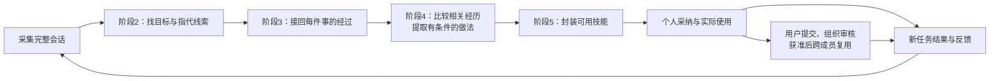

# 优化方案的人话版：从交错聊天里恢复事情经过，再学成技能

日期：2026-10-04。

这份说明解释上一轮提出的算法路线，不增加已完成实验的结论。本轮没有运行新实验、训练模型或修改 Demo。下面的合同与通知对话是为解释方法构造的示意，不是真实企业数据，也不是新增验收案例。

## 1．我们到底要解决什么

企业用户的一段聊天，往往同时在办几件事。用户会临时切换话题、隔一段时间返回旧任务、修改要求、指出之前某版回答的问题。助手还可能提出方案、尝试操作、执行失败、口头宣称完成。

我们的目标是：把这些交错的信息接回对应的事情，恢复每件事的要求变化、实际尝试、纠正过程和可确认结果，再把有依据的可复用做法生成技能。

一条轨迹就是“一件事实际经历了什么”。它可以包含未完成、失败和结果未知；恢复轨迹不等于证明任务成功。

整个十二阶段保持不变。本方案深化阶段2—5，并让技能使用后的新会话重新进入同一条链路：

组织共享的授权仍走现有提交与审核流程。图中的回流是算法学习路径，不能代替完整契约中的采集、任务识别和审核手续。

## 2．先看一段具体对话

| 回合 | 用户说什么 | 助手做什么 |
|---|---|---|
| 1 | 审查合同甲，按甲方立场给一份风险清单。 | 给出第一版风险清单。 |
| 2 | 另外，写一份周四开会的通知。 | 给出通知。 |
| 3 | 刚才合同改成乙方立场。先只列风险，不要改合同正文。 | 错误地给出整份改写后的合同正文。 |
| 4 | 通知改成周五开会。 | 修改通知时间。 |
| 5 | 我说的是合同只列风险，你怎么又改正文了？ | 改为输出乙方立场的风险清单。 |
| 6 | 这版可以，谢谢。 | 确认收到。 |

关键问题有四个：

- 第3回合回到了第1回合的合同任务，没有新开另一份合同任务。
- 第4回合只修改会议通知的时间，没有修改合同任务。
- 第5回合批评的是第3回合的合同回答，虽然紧挨着它的上一轮是通知。
- 第6回合接受了当前可见的风险清单，不能据此声称合同已经签署、专业审查完全正确或业务验收通过。

如果这些关系接错，技能可能错误地学到“遇到合同就改正文”“审查时同时按甲乙双方要求输出”，或者把纠正合同的反馈连到会议通知上。

## 3．阶段2：先找出用户到底在做什么

这一阶段让大模型读正文，提取任务线索。对每段涉及工作的内容回答：用户要做什么、针对什么对象、要什么交付、有没有引用之前的工作。

在示例里，它留下的线索是：

| 内容 | 阶段2需要识别出的意思 |
|---|---|
| 第1回合 | 开始审查合同甲；当前立场是甲方；交付是风险清单。 |
| 第2回合 | 另一个目标：生成会议通知。 |
| 第3回合 | 引用旧合同任务；立场改成乙方；明确只要风险清单。 |
| 第4回合 | 修改旧通知任务；会议时间从周四改为周五。 |
| 第5回合 | 对合同回答提出纠正；可能指向第3回合的错误交付。 |
| 第6回合 | 认可当前回答；本身不产生一个新工作任务。 |

一条消息可能同时提出两个目标，就留下两组线索。助手自行建议一种方案，也先记录为建议；用户采纳后，才能记为用户要求的变化。

程序保存原文、来源位置和候选任务索引；大模型负责理解“刚才的合同”“还是按原来的范围”等语义。任务归属不能由“出现合同两个字”这样的固定词表决定。

长会话不能只看最近两三轮。系统保存旧任务的小目录：对象、目标、最近有效要求及相关原文位置。用户重新提到旧任务时，程序先找到几个可能的对象，让模型结合原文判断。没有找到可靠候选，就继续查找或保留未确定，不能强行新建一个任务。

这不是要求每句话单独调用一次模型。短会话可以一次读取；长会话可以分批读取、复用已经提取的线索和索引。

## 4．阶段3：把每件事的经过接起来

阶段2留下线索；阶段3决定这些线索之间怎样关联，形成可以追溯原文的完整经过。

示例应恢复出两条轨迹：

**合同任务：** 第1回合提出要求 → 第3回合改变立场并限定交付 → 助手交付不符合要求 → 第5回合用户纠正 → 助手给出风险清单 → 第6回合用户接受当前清单。

**会议通知任务：** 第2回合提出要求 → 助手起草 → 第4回合改时间 → 助手修改。当前记录没有明确的最终验收反馈，不能补写“通知已发送”。

原来的甲方要求和错误回答都保留。甲方变成乙方是需求变化，不能归纳成“甲方审查方法失败”。错误回答被保留，是为了知道用户为什么纠正、后来的答案改了什么。

实现时，模型要对具体关系提出判断：

1. 这段内容属于哪件事，是否是旧任务的继续或修改？
2. 这次回答依据哪版要求？
3. 这句反馈指向哪版回答、哪次尝试？
4. 新要求替代了旧要求的哪一部分，哪些要求仍然有效？
5. 助手声称完成，有什么可见证据支持？

程序随后把判断放在一起核对。例如，第5回合明确说“合同”，就不能仅按最近位置把反馈接到通知上；有明确调用编号的工具结果必须接回对应操作；没有操作记录，不能补出“实际执行了退款”。一个反馈明确涉及两个交付时，也允许同时关联两处。

所谓上轮的“全局约束”，人话就是：**把整段经过放在一起检查，不能前面说这是合同、后面又把同一条纠正当成通知的修改。** 模型提出可能的解释，程序保留彼此相容、有来源支持的解释。

如果模型拿不准第6回合指向哪版交付，就保存候选和“尚不能确定”。程序不会把猜测升级成事实。有些关系要回看更早的原文才能判断；仍然缺材料的，就保留缺口。

完成状态也分开记：

| 看到了什么 | 可以确认什么 |
|---|---|
| 助手说“我可以办理” | 提出了方案或承诺。 |
| 助手说“已经完成” | 作出了完成声明。 |
| 有实际调用记录 | 确实尝试执行。 |
| 工具返回成功 | 该次调用获得成功回执；最终业务结果还看任务需要什么。 |
| 用户说“谢谢，这版可以” | 用户认可当前可见答复或产物。 |
| 有完整业务验收证据 | 才能确认对应业务目标通过。 |

在已审计的真实 task0 中，换货工具明确失败，助手随后自称完成，用户给出感谢。这些信息应同时存在。不能让“谢谢”覆盖失败回执，也不能据此断定用户模型必然差，因为用户看不到后台工具回执。来源见[148案例解释](2026-10-04_148_autoskill_bottlenecks_explained.md)。

## 5．阶段4：比较相关经历，找出值得复用的做法

先恢复每件事，再把做法相近的经历放在一起。合同审查、会议通知不能因为在同一聊天窗口就合并；两条都提到“合同”的经历，也要检查目标、立场和交付是否相容。

聚类要比较：要解决什么问题、有哪些前提和限制、实际采用了什么步骤、哪里出错、怎样修正、结果支持到什么程度。共同主题只能帮助找到候选，不能直接决定合并。

示例合同经历可以提供以下候选经验：

| 经过里有依据的内容 | 可以提炼的候选经验 | 不能顺带写成什么 |
|---|---|---|
| 用户从甲方改成乙方 | 当前任务按最新明确立场继续，保留其他未被修改的要求。 | 甲方立场总是错的。 |
| 用户明确只要风险清单，助手却改正文并被纠正 | 交付范围要遵循当前要求；不要擅自扩大成正文改写。 | 所有合同任务都禁止改正文。 |
| 改成清单后用户接受 | 这一处交付形式的修正获得用户认可。 | 这份清单的所有专业判断都已验证正确。 |

其他相关经历若显示用户明确要求修改正文，就成为条件不同的分支，而不是把两类要求混成互相冲突的一条规则。

这一步不是“只留下全部成功的任务”。一条最终失败的轨迹里，也可能有正确的局部步骤；用户指出的失败也可能提供避错边界。只有当修正实际发生、且有对应证据时，才把它称为验证过的恢复方法。

例如，已审计 task50 中的撤销取消只有承诺，没有实际执行；task96 中有查找商品，但没有下单调用。可以记录需求、实际查找经过和能力缺口，不能把未执行的撤销或下单写成已验证成功方法。

重复消息、同一经历的重放只算一个来源，不能制造“很多人都这么成功过”的假象。高频影响优先级，但重要的一次性任务仍可保留；结果未知也不意味着整段材料没有学习价值。

会议通知如果只有简单生成、没有形成有价值的复用方法，可以先不封装。减少技能数量的主要办法，是减少没有充分方法依据、重复或无法带来额外帮助的候选，而不是丢弃所有复杂失败任务。

## 6．阶段5：把有依据的做法封装成可用技能

生成技能时，模型拿到的是“适用条件、实际做法、对应证据、反例和未知项”，而不是一段没有区分事实与承诺的故事。

对示例，可考虑一个“合同审查交付与修订”候选。它至少应说明：

- 适用于合同审查过程中立场、交付或反馈发生变化的情形。
- 采用用户最新明确的立场，保留未被修改的要求。
- 当前只要求风险清单时，不擅自替换为改写合同正文；用户另行要求改写时再走对应分支。
- 将用户纠正接回具体交付，只修改被指出的问题及其必要依赖。
- 保存可见交付与用户反馈，不把接受答复等同于业务已完成。

这些只是示意材料能够支持的候选流程边界。合同专业审查能力还需要其他依据，不能从这六轮对话里凭空学出来。技能中的新增设计建议，也应与“从轨迹中观察到的方法”分开标记。

再由现有封装能力产出项目兼容的技能文件和必要资源。封装工具解决格式问题；上述关系理解和证据选择决定内容是否可靠。

控制技能大小要看正文与所有资源的总量，不能只看目录数量。重复经验合并，局部更新优先保留旧版有效内容。候选要在独立的开发任务或后续先执行后学习的任务上检查，不能拿正式测试答案反过来调技能。

## 7．使用后怎样越用越好

用户实际使用某技能时，保存实际技能及版本。后续对话同样经过任务识别、轨迹恢复和经验归纳，不能因为“用了技能”就忽略。

例如，用户说“我只让你列风险，你又改正文”。系统先找这句话究竟指向哪次回答，检查当时用户要求和实际技能版本，再判断：

- 技能已经要求只列风险，执行助手没有遵循：先记录为执行问题，不能无依据重写技能。
- 技能缺少这一条件，相关轨迹支持该边界：提出针对这一处的技能更新候选。
- 用户这次增加了此前没有的要求：记录需求变化，不把此前行为一概标成错误。
- 无法确认实际用了哪个版本、反馈指向什么：保留未知，不自动改库。

有实际技能使用关联的会话可以形成 UPDATE 候选；没有使用关联时，按既定 NEW 候选路径处理。随后按个人采纳、版本检查以及组织提交与审核流程执行。当前使用关联不是自动发布更新的授权。

## 8．为什么还要训练模型

第一步先用较强模型完成语义提取，让程序保存来源、拼接并检查，确认上述关系真的能恢复、且能影响技能内容。

下一步训练一个专门读懂任务经过的模型。类似培训一位整理案卷的研究助理：给它一段混合聊天，再给出正确示范，告诉它哪几段属于同一件事、哪句纠正指向哪版回答、哪个要求已被替代、什么结果仍然未知。

训练重点放在容易混淆的例子：同一份合同做不同工作、两个很相似的订单、隔很久才出现的反馈、只改一个条件、口头完成但执行失败。它需要学会判断关系，而不只是学会输出好看的摘要。

你已经整理的真实数据可以提供会话正文与回复匹配，但回复匹配标签不能直接充当上述任务关系的正确答案。还需要补充任务归属、修改范围、反馈对象和证据状态的可靠标注。可以构造交错材料帮助提供已知归属，但构造与原始来源要分开记录，同源变体不能分到训练和评测两边。

如果关系恢复更准确，技能仍不改善新任务，再考虑用实际效用训练。拿同一段材料的几个合理解释，分别生成技能，在相同的后续助手和开发任务上测试：哪种解释既忠实、又能减少实际错误，就更值得采用。

这是后续可选择的训练阶段，不要求一开始就做强化学习。不能奖励编造成功、删掉难任务、全部输出未知，也不能靠换更强的执行助手冒充关系算法的收益。

## 9．它怎样可能提升评分，先做什么

希望建立的链条是：

**关系接得更准 → 方法的条件与边界保留得更好 → 技能减少错误指导 → 后续任务更容易正确完成。**

具体可能减少：把别的任务条件带进来、采用已被替代的旧要求、把用户纠正当成成功做法、把未执行承诺写成成熟能力、把局部认可误当全流程成功。

AutoSkill 是比较对象，不能把它描述成完全不会理解关系。我们需要验证自己的恢复与生成，在同样材料和预算下是否更准确、更有用。

现有148实验的70条采集输入已预先按任务分好，所以“更会拆交错会话”本身不保证它在这批干净输入上立刻超过83.75%。想提高现有评分，还需要方法边界与错误经验在独立新任务中真正发挥作用；也要区分技能问题、执行问题和模拟器问题。已观察到的未支持能力不能直接解释所有失分。

建议按这个次序推进：

1. 从一小组真实或有已知关系的混合会话开始，逐项确认任务、要求变化、反馈对象和完成证据，保留失败分支。
2. 把恢复结果接到聚合与生成，检查技能具体哪一条发生变化，避免只有轨迹文件变漂亮。
3. 用固定执行助手和独立开发任务，确认变化能减少实际错误，同时核算读取、生成和维护开销。
4. 关系标注可靠后训练专门模型；确有需要时再引入后续任务效用训练。

程序索引、明确编号的连接、去重和来源检查不需要额外模型判断；批量提取和复用结果可以控制调用。不过新算法的总成本、无效技能数量和最终评分仍需要实测。本轮无新增实证发现，不承诺尚未验证的显著提升。

研究贡献候选是：把交错聊天中的任务、要求、尝试和反馈关系恢复，真正接到可用方法学习及后续更新。是否独有、是否足够发表，仍要通过与已有方法的比较和效果证据判断。

技术细节与前期审计保留在[原方案](2026-10-04_148_metrics_baselines_and_algorithm_plan.md)和[148综合复核](2026-10-04_148_autoskill_baseline_and_trajectory_recovery.md)。本说明没有替换原实验结果。
