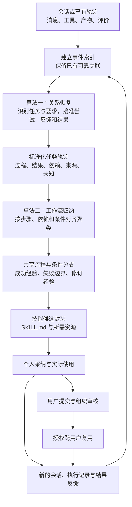

# SkillsLoop 方法设计：面向技能学习的轨迹关系恢复与工作流归纳

日期：2026-10-04。状态：算法设计稿，未实施本稿算法、未训练模型、未开展新效果实验。本文承接[过程与结果联合输入](2026-10-04_process_outcome_input_and_credit_assignment.md)和[两个核心算法](2026-10-04_two_core_algorithms_trace_and_skill.md)，不覆盖已有实验及负结果。

**建议论文方法名称：面向技能学习的证据约束轨迹恢复与工作流归纳。** 英文可写为 *Evidence-Grounded Trajectory Reconstruction and Workflow Induction for Skill Learning*。名称是工作性表述，不主张已有名称检索完毕或原创性已被证明。

本文解决的具体问题是：原始会话里的任务、要求变化、执行尝试、反馈和交付评价并没有天然接好；如果直接归纳，就可能把不同任务拼在一起、把后来的要求套到过去、把承诺当执行、把用户感谢当成功。算法先恢复这些关系，再让关系约束工作流聚合和技能条款。

## 1. 固定研究问题与适用边界

研究问题可以写成：

> 给定含任务交错、要求修订、失败重试及稀疏结果反馈的会话，如何恢复忠实、可追溯的任务轨迹，并从中归纳具有明确适用条件的可复用技能？

高质量的已分任务轨迹也进入同一方法：保留其可靠结构，补充尚缺的关系，不强行拆散重建。低质量输入则恢复尚可判断的关联。对于确实没有记录的附件内容、工具结果或交付结局，算法标记缺口，不能补写成事实。

本方法主要深化既定十二阶段中的阶段2、3、4、5。阶段2提出任务和关联线索，阶段3恢复并核验关系，阶段4形成工作流与经验，阶段5封装技能。个人采纳、实际使用、组织审核和共享权限继续遵守[046契约](../contracts/046_twelve_stage_contract_user_revision.md)。逻辑阶段数不等于模型调用次数。

## 2. “高质量标准化轨迹”的科学定义

### 2.1 先分开三个问题

| 问题 | 判断对象 | 示例 |
|---|---|---|
| 轨迹记录质量 | 是否忠实记录并正确关联了可观察的过程与结果 | 调用失败、错误回执、后续修订和检查结果都接得清楚，可以是高质量记录。 |
| 任务完成情况 | 在哪版要求、哪个验收范围内满足了目标 | 工具执行成功，但没有告知用户要求的信息，可能整体未通过。 |
| 经验的学习价值 | 这段记录能支持什么可复用方法，以及能推广多远 | 失败回执可能支持一条适用边界；只有失败总分不能支持具体修复办法。 |

因此，失败任务不等于低质量轨迹，成功任务不等于高质量轨迹。把材料转成统一格式，也不等于正确理解了材料。

### 2.2 标准化表示

定义一个任务轨迹为：

\[
\tau_i=(g_i,\mathcal R_i,\mathcal A_i,\mathcal L_i,\mathcal V_i,\mathcal U_i).
\]

| 组成 | 用人话解释 |
|---|---|
| 任务目标 \(g_i\) | 用户要改变或交付什么，涉及哪个对象，与其他任务是否有父子或共享依赖关系。 |
| 要求版本 \(\mathcal R_i\) | 哪些要求一直有效，哪些被用户修改、补充或撤回；按维度更新，不能一改时间就丢掉其他要求。 |
| 执行尝试 \(\mathcal A_i\) | 每一次实际尝试的输入、动作、可见产物和结果；失败尝试、重做及仅提出的计划分开。 |
| 关系 \(\mathcal L_i\) | 事件属于哪个任务，反馈针对哪次尝试，工具返回对应哪个调用，哪些步骤依赖哪些产物。 |
| 结果证据 \(\mathcal V_i\) | 用户反馈、程序检查、业务回执及允许使用的评测反馈；保存来源、对象、维度和作用范围。 |
| 缺口与未决项 \(\mathcal U_i\) | 缺少文件、结果未知、关联存在多种解释、事件顺序无法确认等。 |

每个元素和推断关系均保留原始事件引用；结构化轨迹和供人阅读的文字视图来自同一份记录。轨迹可以包含分支和部分顺序，不要求捏造成一条连续成功故事。纯文字分析、合同审查等没有工具调用的任务，也可用实际生成的文本或文件版本表示行动与交付；不把“有工具”设为高质量必要条件。

### 2.3 高质量是可审查的记录属性，不是模型给自己打一个高分

本文将高质量标准化轨迹定义为：**在给定可见材料与允许信息范围内，忠实保留有关事件，正确恢复可判定的关键关系，明确无法判定的部分，并使过程与结果能够在对应要求、尝试和产物上被联合审查的任务记录。**“高质量”不要求任务成功，也不要求缺失信息被补齐；但必须同时披露证据完备性，不能把局部清楚的记录称为整任务已验证。

| 属性 | 具体检验问题 | 不合格例子 |
|---|---|---|
| 来源忠实 | 每个事实能否定位原文或实际回执，是否保留自述与观测的区别？ | 助手说“已下单”就补出一次不存在的下单调用。 |
| 关系正确 | 任务、要求、尝试、产物和反馈是否接到正确对象？ | 合同的纠正被接到中间插入的会议通知。 |
| 条件一致 | 每次尝试是否使用当时有效的要求与上下文？ | 用后来才增加的要求判定原先答复错误。 |
| 依赖可追溯 | 操作所用参数、文件或对象来自哪里，必要先后关系是否保留？ | 把不同订单的查询结果和修改动作拼成同一流程。 |
| 评价有作用范围 | 哪个维度通过、哪个未通过、检查是否执行，能否区分？ | 总分为1就给所有中间步骤记成功。 |
| 可恢复内容覆盖与未知诚实 | 原文能判断的关系是否尽量恢复；不能判断的是否明确留下？ | 将所有难例标未知，或为了故事完整而编造缺失结局。 |

上述属性描述轨迹质量 \(Q(\tau)\)，不在当前阶段强行加权成一个总分。结构检查只能确认引用存在、类型相容等条件；语义关系是否正确，需要相应的关系标注或人工抽样核验。模型置信度不是正确性证明。

另外定义 \(\operatorname{Support}(\tau,\ell)\)：轨迹对某条拟学习经验 \(\ell\) 提供了哪些证据、还缺什么。**记录质量与声明支持范围分开计算。**不能通过把学习目标缩成一句无关紧要的话，就把混乱轨迹称为高质量。

例如，缺少最终业务验收的记录可以忠实标准化，局部操作也可能有依据，但它的结果完备性仍然不足，不能包装成“已验证成功轨迹”。相反，完整记录的失败可以支持明确的失败边界。

为防止以大量弃权换取虚假高准确率，恢复评估须同时看关系正确性与可恢复关系覆盖：参考标注中能够确定、系统却输出未知的关系算漏恢复；原材料真正无法确定的关系允许未知。正确关系是否进入候选集合还需单独抽查。

## 3. 输入：可见事件、公开上下文、稀疏评价

\[
X=(E,C,V).
\]

- \(E\)：真实用户／助手消息、实际工具调用及返回、可见交付物及版本，保留事件ID与可用时序。问答回合是浏览视图，不再是不可拆的学习原子。
- \(C\)：当时可获得的任务上下文、工具说明、业务规则、权限和已使用技能版本。
- \(V\)：零条或多条评价，可延迟到达，不要求每个回合都有分数。评价记录对象、维度、结果、来源、依据和可用时间；指向不明时作为恢复对象。

结果反馈是输入接口的一部分，但不能把全部评测内部对象直接注入。演化任务已允许公开的总分和分项结果，与参考动作、隐藏断言、目标数据库等更强监督信息须分开。测试结果不得参与当轮技能学习。148原协议与原结果保留；反馈增强应另设可比较条件，强基线获得相同允许信息。

## 4. 总体 pipeline：两个核心算法



两种输入不对应两套独立算法。可靠关系直接成为约束；混乱部分产生待解问题；缺失材料进入未决项。两者最后使用同一标准化表示和同一工作流归纳器。

## 5. 算法一：证据约束的轨迹关系恢复

### 5.1 建立事件索引，保存硬依据

程序先按源记录建立索引：消息引用、调用与返回ID、文件版本、对象ID、已知先后关系、技能使用记录。已确认的导出重复可折叠为一个视图节点，但保留全部源ID和重复原因。真实重试即使文本相同，也不能只因相似就删除；它可能有新的调用和结果。

可信的显式调用ID可直接连边。两个系统字段相互冲突时记录冲突，不能因为它来自元数据就假定永远正确。任务成功与失败、没有回复与导出遗漏、技术错误与业务拒绝都保留区别。

### 5.2 模型抽取最小语义片段，并提出候选关系

一次消息可能同时包含“合同按乙方重做”和“再写一条通知”，因此按语义片段定位，片段仍引用原消息的范围。模型识别目标、对象、要求补充／替代、操作计划、实际交付、反馈和结果陈述。一个片段可以成为明确的共享上下文，不能强迫整条消息只属于一个任务。

对每个待解片段，先用明确引用、对象和文件版本、最近上下文、任务摘要索引召回少量候选，再由模型判断语义关系。候选必须包含“新任务”和“无法确定”，不能只能从已有任务中强选。长距离返回旧任务通过对象与任务索引找回，不能只搜索相邻两轮。

模型每次输出关系类型、候选对象、支持原句，以及区分“明确记录／语义推断／未决”的标记。关系分数仅用于候选排序；未校准的分数不得称为真实概率。

### 5.3 程序联合拼接，不逐条贪心决定

单看“这个不对”可能有两个指向，但结合后面的“把第三条改成乙方承担”，候选任务可以被进一步排除。因此不能每条消息只接最近对象后立即锁死。

把任务归属、要求替代、尝试归属、反馈目标、评价目标和步骤依赖视为待决变量集合 \(\mathcal D\)，寻找语义评分较高且满足约束的组合：

\[
\hat Z\approx\arg\max_{Z\in\mathcal F(E,C,V)}
\sum_{d\in\mathcal D}s_\theta(d,z_d\mid E,C,V).
\]

这里 \(\mathcal F\) 是允许的关系组合，\(s_\theta\) 是语义候选分数。每个需要处理的片段必须获得一个有依据的归属、明确共享关系、客观噪声说明或未决状态，不能为了提高平均分直接遗漏难例。

初版选定的可落地求解方式是**有界候选搜索**：先固定可信的显式关联；把相互影响的模糊关系组成小块；每步只保留若干得分较高且不冲突的组合，后续证据可推翻前面的语义猜测。它近似求解，不宣称全局最优。候选规模、搜索宽度及弃权规则由开发集确定并冻结；不为每条边单独开一次模型调用。

约束至少包括：

1. 原事件和引用必须真实存在；计划、自报完成与可观察执行使用不同类型，不能互相升级。
2. 实际调用和返回按明确标识一致绑定；文件或业务对象不能在缺少对应关系时随意换绑。
3. 要求替代只影响对应维度和后续适用范围；没有明确变化的要求继续保留。时序不明则不能武断套用“最后一句”。
4. 步骤依赖和版本先后不能自相矛盾；只对这些有方向的关系检查无环，不要求含反馈回指的整个关系图无环。
5. 一个评价只能在其对象、要求版本和检查维度内产生支持；整体验收不自动传播为每一步的标签。
6. 反馈可指向较早尝试或多个明确对象；一个会话中途切换任务不能自动关闭原任务。

程序能够硬检查引用和结构，对“这句话指谁”这类语义只能核对证据与约束，不能伪装成确定性规则。保留多个仍合理的解释时，下游只把它们共同支持的事实作为确定输入；有争议的部分连同候选依据保留，不能在摘要中偷偷确定化。这只表示对保留候选的保守处理，不证明候选集合包含全部真实可能。

特别地，“未观察到执行”不能一律写成“现实中没有执行”。只有确认日志覆盖完整时，才可在该日志范围内判断没有相应调用；其他情况记录为执行证据缺失。无论哪种情况，都不足以支持“该方法已经成功执行”的经验声明。

### 5.4 恢复为可阅读的尝试链

每次尝试整理为：

> **当时的有效要求 → 已有输入 → 实际做了什么 → 得到了什么 → 谁对哪部分反馈 → 后续改了什么。**

要求发生变化时，保留旧要求和旧尝试；相同要求下的重新执行才可作为修订对比。真正发生的重试有新的尝试记录，导出重复没有。只有话语承诺但没有可见执行，则记录为计划／自述，不能补成执行轨迹。

没有用户“完成”表态也能结束当前处理窗口：根据任务转移、显式终止、运行结束或既定观察窗口关闭当前片段；关闭只意味着本次观察到此为止，结果可以仍未知。迟到评价或重返任务可增量续接，不重新制造一个无关任务。

### 5.5 如何兼容各种输入

| 输入情况 | 恢复器做什么 | 必须留下的边界 |
|---|---|---|
| 已有清楚的任务、调用、要求和评价引用 | 复用可靠关系，检查缺口，仅补需要的语义解释 | 格式正确不能代替语义正确；仍需抽样审查。 |
| 多任务交错或中途返回 | 用目标、对象、引用和依赖恢复各任务的非连续片段 | 不靠标题或相邻位置强行拼接。 |
| 多次纠正、要求改变、失败重试 | 保留版本与尝试链，关联每次反馈 | 需求变化与同要求修复分开。 |
| 用户说满意但工具失败 | 两项证据各自绑定对象和维度 | 主观认可不覆盖执行失败。 |
| 缺文件或没有结局 | 形成带缺口的标准化轨迹，保留有依据局部经验 | 不称完整验证，也不整条删除。 |
| 连目标或关键指向都无法判断 | 保存片段及未决解释，等待后续证据 | 本次不能强制产出一个技能。 |

## 6. 算法二：关系约束的工作流聚合与经验归纳

### 6.1 先提炼可对齐的步骤，不立即生成技能

每条轨迹产生零个或多个工作流片段。一个步骤至少描述：**适用条件、实际操作、输入来自哪里、可见输出、与其他步骤的依赖、证据状态**。大任务可以提供可复用子流程；不强迫整条任务只能进一个主题簇。

同时从过程和评价形成不同类型的经验：

| 经验类型 | 需要什么依据 | 可以进入技能的内容 |
|---|---|---|
| 有支持的执行经验 | 确实执行过的动作及对应观测 | 在已知条件下使用过的步骤；没有验收时标明未验证。 |
| 指定范围内的成功经验 | 执行及相关维度通过的结果关联 | 该范围内可借鉴的方法，不能推为所有步骤必要或因果有效。 |
| 失败边界 | 明确错误回执、已公开规则或可定位的验收缺陷 | 哪种条件下哪种做法不成立，如何检查该条件。 |
| 验证过的修订经验 | 相同有效目标／标准下发生修改，修改后相关检查通过 | 修改后的处理方式及已验证范围；不等于证明修改具有因果作用。 |
| 待验证的改进假设 | 有合理建议但无执行或缺少后验检查 | 正常保留为候选建议，与实证经验明确分开。 |

仅有总分0，只能记为整体未通过；不能据此虚构失败根因。最终成功也不意味着把所有曾失败的步骤列为推荐流程。

### 6.2 聚类按“方法能否对齐”，不是只按主题相近

初版采用**候选召回＋带约束的步骤对齐＋簇内重新核验**：

1. 利用已有索引和缓存表示召回候选工作流簇，避免全库两两模型比较。
2. 模型为可能对应的步骤提出语义匹配；程序核验对象绑定、前置条件、输入输出依赖及必要顺序，构成允许的步骤映射。
3. 可对应的公共步骤成为共享主干；差异必须能解释为参数替换或明确条件分支。条件冲突且不能解释时不合并；只共享局部步骤时提取子流程。
4. 新成员入簇后重新检查公共主干和成员适用条件，不能因为A像B、B像C，就把互不兼容的A和C强行连成一簇。处理顺序固定、成员变化留痕；不宣称初版增量聚类与输入顺序无关。

参数化可以把某个订单号替换为“目标订单”，但必须保留查询结果和修改动作指向同一订单这一绑定。政策门槛、授权条件、确认要求等不是随便可删除的实例细节。

跨领域共享高层流程并不意味着底层操作通用。领域政策和工具映射作为适用范围保留；先区分新实例迁移、同领域新任务和未见领域迁移，不预设一套技能可无条件跨域执行。

### 6.3 恢复关系必须真正改变聚类和规则

| 恢复出的关系 | 对下游产生的具体约束 |
|---|---|
| 用户把“周六”改为“周日也可以” | 后来成功只支持放宽后条件，不能证明原周六要求也能完成。 |
| 失败来自第一次导出，最终验收针对第二次 | 第一次不能冒充成功示例；第二次的通过不能被错误归到第一次。 |
| 同一任务做了五次重试 | 可以贡献修订信息，但不能当作五个独立用户案例增加经验可信度。 |
| 工具确实改签成功，但没有告知航班号 | 操作子流程与交付遗漏分开；技能需保留执行步骤并修订交付检查。 |
| “这个还是不对”指向尚未确定 | 不能据此删除某个确定流程或给另一技能记失败；共同支持部分仍能学习。 |

每一条候选经验保留“触发条件—操作／限制—预期目标—已验证范围—原始来源—依赖关系”。对于拟发布的条款，程序检查其所依赖的关系和证据是否仍成立。模型写作不能把“尚待验证”改写成“已成功解决”。

删除一个关系或改变评价归属后，相关条款的支持记录必须同步失效或降为未决。否则关系只留在中间文件、实际生成仍是自由摘要，无法体现本算法的主贡献。

### 6.4 封装与候选数量控制

封装器读取工作流主干、条件分支、经验状态及来源清单，生成原项目兼容的 `SKILL.md` 和必要资源。运行时正文保留适用条件、步骤和失败边界；详细来源与验证状态可放入研究侧清单或资源，不要求每次使用加载整份历史。

一个簇不必对应一个新技能：重复方法合并；新条件可成为已有方法的分支；没有足够任务或方法信息时暂不封装。单次但重要的明确经验也能成为候选，不用统一的高频门槛剔除。

未验证候选按既定要求正常处理、展示和采纳，只是不计作已验证有效技能。已执行的失败、未执行的建议和缺结果的操作不混成同一证据状态。减少技能数量本身不是收益；需要同时保留有价值的方法覆盖。

## 7. 一个完整示例：关系怎样改变最终学到的内容

**以下为构造的航空改签示例，用来解释算法，不是148或267的真实样本。** 假定输入上下文包含相应工具和公开规则；此处省略常规字段，仅展示关系问题。

| 事件 | 原始材料摘要 |
|---|---|
| 1 | 用户：改到周六下午，成功后把新航班号告诉我。 |
| 2 | 实际查询结果：周六下午没有可选航班。 |
| 3 | 用户：另外帮我写条周五复盘会议通知。 |
| 4 | 助手：输出会议通知文本。 |
| 5 | 用户：回到改签，周日上午也可以，仍然需要航班号。 |
| 6 | 实际查询返回一个周日上午的可选航班。 |
| 7 | 用户确认该航班及已展示的改签条件。 |
| 8 | 实际改签调用返回成功，并给出新航班号。 |
| 9 | 助手：已经改好了。 |
| 10 | 用户：谢谢。 |
| 11 | 允许使用的交付验收反馈：改签状态检查通过，航班号告知检查未通过。该反馈关联事件8—9的交付。 |
| 12 | 用户：改签后的航班号还没告诉我。 |
| 13 | 助手从事件8的实际回执取出航班号并告知。 |
| 14 | 信息告知检查再次执行并通过；未提供新的整任务总体验收。 |

### 7.1 恢复后的两条任务轨迹

**任务A：改签并告知信息。** 第一次尝试受“周六下午”约束，查询无可选项；第二次尝试使用放宽后的时间要求，实际改签成功，但告知缺项；第三次是补充交付，完成航班号告知并通过该项检查。第二次的“谢谢”是用户认可，不覆盖事件11的缺项。

**任务B：会议通知。** 对应事件3—4，存在文本交付，没有独立业务验收。任务B不继承任务A的失败或感谢。

关键关系为：事件5修改事件1的时间维度，并保留告知要求；事件7确认新选择；事件11评价第二次交付；事件12反馈同一交付缺项；事件14仅验证补充告知，不自动代表新做了一次完整业务验收。

### 7.2 归纳出的工作流与经验

可支持的工作流片段为：按有效约束查询 → 展示可选项与条件 → 用户确认 → 实际执行 → 从回执交付必要信息。

可以归纳“用户明确放宽时间条件后重新查询”的条件分支；不能归纳“找不到周六就自行改到周日”。查询无可选项也不是工具系统失败。

可以保留实际执行成功的局部经验，同时记录“完成操作后遗漏必需信息”的交付缺陷。补充告知经过同一信息要求的检查，可以称为该范围内验证过的修订；不能据此声称已证明所有改签失败都由漏报航班号造成。

### 7.3 与第二条独立轨迹聚合

假设另有一条独立记录，用户确认周一航班后成功改签并收到完整信息。两条经历可对齐查询、确认、执行、交付的主干。日期成为输入参数；第一条特有的条件放宽成为适用分支；完整交付与遗漏后补充共同支持交付检查的重要性，但不构成严格因果效果估计。

最终候选技能可写为“有约束的改签与交付确认”，包含适用前提、查询与确认、真实执行回执、必要信息交付、无可用方案时需重新获得用户选择的分支。业务政策和工具范围必须保留；会议通知另行处理，不能并入该技能。

## 8. 算法摘要与实现边界

```text
输入：事件 E、公开上下文 C、允许使用的稀疏评价 V
输出：标准化轨迹、工作流经验、可追溯技能候选

1. 建立源事件索引，保留明确的调用、版本和引用关系。
2. 抽取语义片段；对尚不明确的关系召回少量候选。
3. 模型判断候选语义，程序在证据和一致性约束下联合拼接。
4. 将确定与未决关联分别投影为任务、要求版本和尝试链。
5. 提取实际步骤及其结果范围，区分执行、成功、失败边界、修订和假设。
6. 对候选工作流做步骤／依赖／条件对齐，归簇或保留独立分支。
7. 归纳经验条款，同时保留来源及关系依赖，检查是否越出证据范围。
8. 对有方法内容的候选去重、封装；保留未验证状态及正常采纳通路。
9. 实际使用后的新事件与评价重新进入步骤1，增量更新相关关系和条款。
```

初版选择“模型语义抽取与关系判断＋程序索引、约束拼接与工作流对齐”，不同时叠加一串尚无必要证据的训练方法。关系预测器未来可以训练，但训练不改变定义和接口；是否需要专门模型取决于关系错误分析及成本。

成本控制依靠一次语义抽取结果复用、可信关联直接使用、候选召回、局部修订、缓存以及聚合后再封装。阶段2和阶段3可以共用一次结构化语义输出，程序在中间完成不同职责。新反馈只重算受影响关系及条款。调用数、token、延迟和验证成本仍须实测，不能预先保证额外恢复成本必被节省的封装成本抵消。

对使用已有技能的会话，记录实际技能与版本，将相关经验送回对应候选更新；没有使用证据的走新候选路径，不把全库语义查重作为每次NEW／UPDATE必经判定。使用失败还需区分技能未被实际遵循、适用条件不符与技能内容不足，不能把所有失败直接归咎于技能。组织共享继续由用户提交和组织审核。

## 9. 借鉴、创新候选与证据要求

从经验形成技能、成功失败学习和工作流聚类都已有相关工作：[AutoSkill](https://arxiv.org/html/2603.01145v2)研究经验驱动技能演化；[Trace2Skill v5 §2.2—2.4](https://arxiv.org/html/2603.25158v5#S2)用带结果的任务轨迹进行成功／失败分析和补丁聚合；[LifeMem §4.2](https://arxiv.org/html/2609.12655v1#S4.SS2)使用工作流对齐聚类；[SkillGLoW §3](https://arxiv.org/html/2609.02217v1#S3)利用执行差异及流程家族合并。不能把增加评分、关系图、聚类或成功／失败处理本身称为新贡献，也不能说这些方法完全不理解关系。

本项目更明确的贡献候选是：

> **在交错、修订且评价稀疏的会话中恢复任务—要求—尝试—结果关系，并把关系的有效范围与未决状态传递到工作流聚合和技能条款，限制误合并与无依据推广。**

它有两个必须能够观察的机制：恢复改变“哪些经历可以一起学”；恢复改变“某条方法究竟由哪些条件与结果支持”。如果中间关系很丰富，但聚类和技能文本不受它们约束，主张就不成立。

后续最必要的证明链是：**关系恢复更准确且覆盖可恢复内容 → 聚类及经验条款减少误归因 → 相同消费Agent在独立新任务上受益。**三段不能互相替代，技能变少或中间文档更漂亮不能替代任务效果。

研究比较至少需要：同信息同预算的强模型直接归纳；公平获得相同反馈的AutoSkill／Trace2Skill适配对照；保持标准化输入但关闭关系对下游约束的消融；少量人工确认关系用于判断恢复上限。真实无序输入与已有干净轨迹均应测试，避免只会修复而破坏干净输入。验证过的旧测试题用于探索时应声明，正式效用结论保留独立评测。

本轮未运行上述比较。148已核实的“评价不进入学习正文”和自述／实际操作不一致，支持研究动机，但不证明本方法已经解决问题；预先按任务分好的148输入也不能单独证明多任务恢复优势。现有EvoMind回复匹配标注仍不能直接当作全部任务、要求版本和反馈关系真值。

## 10. 可用于论文方法概述的文字

本文研究从非标准化交互记录中学习可复用技能的问题。输入既包括任务边界清晰的执行轨迹，也包括多任务交错、要求发生修订且结果反馈不完整的真实会话。方法首先以可观察事件、公开上下文和稀疏评价为输入，利用语义关系预测与一致性约束恢复任务归属、要求版本、执行尝试和评价作用域，形成保留来源及未决信息的标准化轨迹。随后，基于步骤依赖与适用条件对齐轨迹片段，聚合共享工作流及条件分支，并分别归纳有支持的执行方法、成功经验、失败边界和验证过的修订。各经验条款继承其来源关系与验证范围，避免将任务整体结果错误扩散到全部步骤，或将未执行建议表述为成功方法。最终产物保持普通技能目录格式，使用后的过程与结果继续进入同一恢复和归纳过程。其有效性需要通过关系恢复、经验支持性及独立任务复用三个层面的实验检验。
