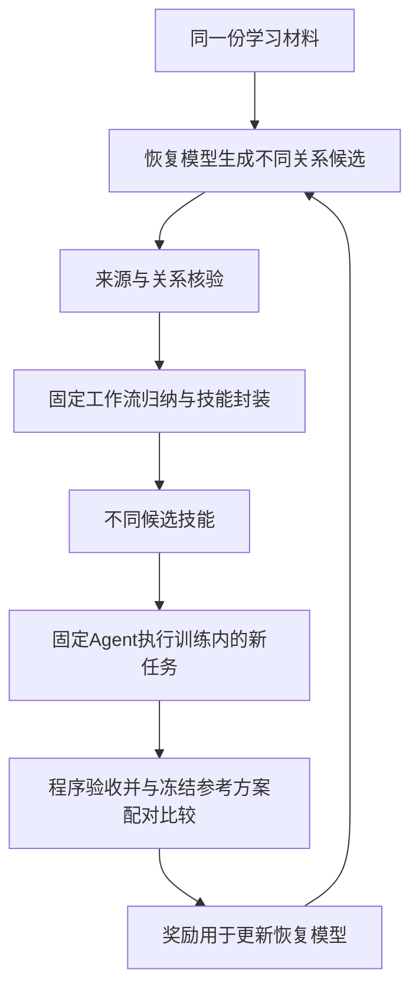

# 轨迹关系恢复与工作流归纳：模型微调和强化学习方案

日期：2026-10-04。状态：研究与实施准备方案，未启动训练、模型下载、付费数据生成或新实验。承接[统一算法设计](2026-10-04_standardized_trajectory_recovery_method.md)。

## 1. 推荐路线与训练边界

优先训练“理解经历”的模型：先监督微调轨迹关系恢复器，再用可核验关系奖励做小规模强化学习；只有确认恢复差异能传递到技能和任务效果后，才加入更昂贵的技能效用奖励。工作流归纳器作为第二个可训练部分，分开优化。

| 部件 | 训练什么 | 第一轮是否更新参数 |
|---|---|---|
| 轨迹恢复器 \(R_\theta\) | 任务归属、要求版本、尝试、反馈目标、评价范围及未知判断 | 是，主线优先。 |
| 工作流归纳器 \(W_\phi\) | 步骤对齐、合并／分支／分离、经验类型与适用范围 | 第一轮固定；有归纳瓶颈证据后单独训练。 |
| 事件索引、约束拼接、格式封装 | 引用、版本、对象和结构检查 | 使用确定性程序，保持固定。 |
| 实际执行Agent \(A_\psi\) | 消费技能，执行新任务 | 主实验固定参数、提示、工具和检索条件，用作统一测量工具。 |

最终链路：

\[
X=(E,C,V)\xrightarrow{R_\theta}\mathcal T
\xrightarrow{W_\phi}\mathcal W
\xrightarrow{\mathrm{封装}}\mathcal S
\xrightarrow{A_\psi}\text{新任务结果}.
\]

\(E\)为可见事件，\(C\)为允许上下文，\(V\)为稀疏评价；\(\mathcal T\)为标准轨迹，\(\mathcal W\)为带条件与证据的工作流，\(\mathcal S\)为技能。更新\(\theta\)时固定\(\phi,\psi\)；随后如果优化\(\phi\)，先冻结\(\theta,\psi\)。第一版不同时训练全部部件。

这是真正的模型参数训练，但不能仅凭用了SFT或RL就宣称算法贡献。研究对象仍是：恢复关系如何改变经验归纳及后续复用效果。

## 2. 监督微调：让模型学会正确理解轨迹

### 2.1 训练目标

监督微调（SFT）用“输入材料—正确关系输出”教模型做结构化判断。目标输出不是模仿原助手回答，也不是把原来的失败动作作为推荐动作复述。

建议将学习目标固定为六组：

1. 找到任务目标和对应事件；区分新任务、返回旧任务、共享上下文及无法判断。
2. 恢复要求的补充、替代、撤回及有效范围；不同要求维度独立更新。
3. 识别实际尝试、重试、计划、自述和交付；恢复实际输入与操作依赖。
4. 将反馈绑定到正确尝试或产物，不默认绑定最近一句。
5. 将验收结果绑定到对应要求、对象和维度；不将总分分摊为每一步真值。
6. 标出真正缺失和歧义，避免把所有难例都标为未知。

模型输出紧凑的语义片段、关系、证据引用及状态，程序生成标准轨迹和阅读视图。监督只作用于核验过的输出字段；未标注的关系不当作“无关系”，缺少的结果不当作“失败”。目标不要求生成冗长推理过程，简短可检查的证据说明即可。

### 2.2 一条训练样本应是什么样

下面为构造示例，不是真实148样本。

**输入：**

| 事件 | 可见内容 |
|---|---|
| 1 | 用户要求把商品换成蓝色M码。 |
| 2 | 对应换货工具返回：蓝色M码缺货，操作未完成。 |
| 3 | 助手说：已经换好了。 |
| 4 | 用户说：谢谢。 |
| 5 | 中间插入一段会议通知请求及回复。 |
| 6 | 用户返回：刚才换货那件，改成绿色M码，再办一遍。 |
| 7 | 对应绿色M码换货调用返回成功。 |

**期望输出：**

- 换货与通知是两个任务；事件6返回换货任务。
- 换货要求版本1为蓝色M码；版本2只改变颜色，尺码要求继续保留。
- 第一次尝试失败，来源为事件2；事件3是与回执不一致的完成声明。
- 事件4是用户认可，不能把第一次尝试改判为执行成功。
- 第二次尝试满足新颜色要求，工具执行成功；没有独立整体验收则不额外补“全面验收通过”。
- 第二次不是“原蓝色方案修复成功”，而是更改要求后的新尝试。

一条有价值的负例是：把两次尝试混为“成功完成蓝色换货”。另一条是：把所有事件标未知。训练应能同时区分这两种错误。

### 2.3 已有数据能提供什么，缺什么

| 数据 | 可以使用的内容 | 不能直接视为已有真值 |
|---|---|---|
| EvoMind真实会话及人工回复配对 | 用户与助手原文、配对修订、真实插话和不完整表达 | 任务边界、要求替代、尝试、反馈对象、因果关系及真实业务成功。回复匹配不等于这些标签。 |
| 038合同审查案例 | 任务边界种子、原始事件和附件缺失情形 | recovered_trajectories中的部分回合分组由脚本按原行序预计算；不能称完整人工关系图真值。 |
| 148的70条演化经历 | 可见调用／返回、成败冲突、要求变化及允许使用的结果标签 | 总体验收不等于逐步标签；旧规范化文本已丢部分调用标识并截断工具正文，训练应回到原结果文件。 |
| 148旧40题×4次测试 | 已审阅结果的诊断案例与机制探索 | 调参、训练后仍作为完全未触碰的正式测试。 |
| 新增公开环境的演化轨迹 | 可执行任务、显式动作与结果，为受控恢复和效用训练提供材料 | 自动拥有全部要求／反馈语义真值，或一批变体等于许多独立任务。 |

038标签边界依据[044血缘更正](../memory/044_2026-09-26_038_input_lineage_clarification.md)。[071验收说明](../datasets/evomind/accepted_071/README.md)记录原库1,466条会话，其中505条复核会话覆盖2,674项已决定的匹配标注；58项为明确人工操作，2,616项为AI或程序来源。标注完成的事实保持不变，但它不表示全部是人工关系金标准。本文的训练清单须在实施时以具体源文件与SHA固定，不将上述表当作已经建好的训练集。

148只有5条通过整体验收这一旧审计结果，不意味着只能使用5条材料：失败和未知经历可以训练关系理解及结果范围判断，但不能自动作为成功流程标注。

### 2.4 数据生产方式：真实标注加受控混合

先从真实材料标注一批“任务—要求—尝试—反馈—结果”的关系。强模型可做预标注，人核验关键关系与分歧；教师模型一致也不自动成为真值。保留人工标签、程序可确定标签和教师伪标签的不同身份。

然后从已经核对的完整轨迹构造受控输入：

- 保持每个任务内部因果与工具调用顺序，交错多个任务，训练返回旧任务。
- 改写显式指代为自然指代、插入无关对话或移动允许延迟的反馈；改写后仍要核对可识别性。
- 隐藏部分交付或结果，训练合理未知。被移除的内容不再要求模型恢复为确定事实。
- 加入真实的导出重复模式，保留真实重试和各自执行结果。
- 保留干净轨迹作为对照和训练材料，避免模型见到输入就过度拆分。

要求版本和修复语义不能靠任意换词自动制造；修改会改变环境目标的材料，必须是明确构造并验证的场景。不能只改文本、不重核工具结果，却继续沿用原“成功”标签。

混合的是观察记录，不是把彼此独立的数据库执行历史强行重放进同一环境。去除构造时泄露真实任务归属的文件名／标题／内部标签，但保留现实可见且各方法同享的调用ID和对象信息。

## 3. 模型和微调实现的建议起点

建议以 **Qwen3-8B＋LoRA** 建立可控首版；选它作为公开权重和稳定比较的起点，不声称它是最新或效果最优。官方模型卡提供公开权重、两种思考模式及上下文说明；LoRA冻结基础参数、训练小规模增量参数。[模型卡](https://huggingface.co/Qwen/Qwen3-8B)、[LoRA论文](https://arxiv.org/abs/2106.09685)。

初版使用一个恢复适配器；归纳训练确有必要后，在同一冻结底座上训练另一个适配器。它们是两个逻辑职责，不要求部署两套大型基础模型。闭源API可以继续做预标注教师或固定消费者，不能把本地LoRA训练称为对该API模型进行了微调。

建议探索起点，而非已验证最优参数：

- 先训练紧凑结构输出，固定思考模式；首轮可使用非思考模式，必要时用相同token预算做能力诊断。
- 以8k上下文窗口为资源摸底起点；远距离引用由索引补回必要原文，实际需要更长时再扩大，不截掉关键工具结果来迁就窗口。
- 先用LoRA rank 16作为单点试验；学习率、目标层、batch和训练步数在小开发集与显存摸底后冻结，不同时扫一整套超参数。
- 只对目标输出计算监督损失；随机任务编号采用固定规范化或对齐规则，不能用任意编号是否相同判关系正确。
- 记录未微调同底座基线、SFT检查点和强模型提示基线，防止把模型规模差异误归于方法。

工具优先使用同一套可复现实验栈完成SFT与GRPO，如Hugging Face TRL；具体版本在实际实施前固定。本轮仅核对其训练接口存在，不安装环境、不保证某显存配置已通过。[SFT文档](https://huggingface.co/docs/trl/sft_trainer)、[GRPO文档](https://huggingface.co/docs/trl/grpo_trainer)。

## 4. 第一层强化学习：奖励正确关系恢复

### 4.1 强化学习对象与环境

把恢复器视为一个结构化决策策略。状态是当前可见事件、候选关系和已建立的可靠关联；动作是选择任务归属、要求关系、尝试归属、反馈／评价对象或未知。一次训练回合输出完整关系结构，程序检查并与可用标注比较。

初版把这段结构输出作为一个回合，不先引入复杂多Agent训练。监督微调负责给出可用起点；强化学习检验同一输入多个候选中，能否稳定偏向关系更正确的输出。

### 4.2 奖励从哪里来

奖励优先使用可核验标签，而非让另一个模型笼统评“恢复得好不好”：

| 奖励／检查 | 数据依据 | 防止什么投机 |
|---|---|---|
| 任务归属与类型关系正确性 | 人工核验关系、保留内部顺序的受控混合映射 | 只按最近一句或主题分组。 |
| 要求、尝试和评价范围正确性 | 对应原文及核验标签 | 把最终结果传播到所有尝试。 |
| 可恢复关系覆盖 | 已知可判定的参考关系 | 所有难例都回答未知。 |
| 恰当未知与错误确定 | 材料真正缺失或多解的标注 | 编造结果或乱接关系。 |
| 来源和结构有效性 | 原事件ID、调用／版本／对象约束 | 引用不存在、伪造执行、结构自相矛盾。 |

初版可采用一个简单可审计的奖励：结构严重无效给负分；有效输出按关系类型计算宏平均F1，并对核验过的未知／可判定决策计分。分母只包括有标签或由构造明确确定的项目，缺标注不记成负例。可恢复关系漏报计入召回损失，空输出不会因“没有错边”获满分。

宏平均避免大量容易的“无关系”淹没少量关键修订与评价关系；任务编号先做规范化或匹配。各分项同时输出，权重在开发阶段冻结。语义支持性不能靠“引用ID确实存在”代替。

不以文本长度、输出技能数、用户感谢或奖励评语的流畅程度作为主要奖励。关系质量达到要求后，才讨论在相同覆盖下压缩token或降低成本。

### 4.3 为什么先选GRPO，DPO放在哪里

推荐在SFT后用小组采样的GRPO作首个RL方案：同一输入生成若干恢复候选，用上述可核验奖励比较，提升较好候选的生成倾向。GRPO使用组内奖励估计基线，不需单独的价值网络，但组采样仍有成本。[DeepSeekMath](https://arxiv.org/html/2402.03300v3)。

探索起点可设每条输入4个候选；这只是预算参数，不能声称4个足够。若候选没有实质差异或奖励全相同，不强制制造赢家，不盲目扩大采样。官方实现也监测组内奖励零方差问题。[TRL GRPO指标](https://huggingface.co/docs/trl/grpo_trainer)。

DPO可以作为较省采样开销的替代：使用同一输入下经过核验的“较好／较差”关系输出对。它是基于偏好对的直接优化，不需要本方案的在线环境采样；不能把它单独称为已经完成下游任务收益RL。不要机械地串成SFT→DPO→GRPO，先选一条比较。[DPO论文](https://arxiv.org/abs/2305.18290)。

训练中的约束生成、模型概率和拼接后评分要一致：不能把搜索选中的输出当作未经搜索的策略随机样本计算策略梯度。初版让模型随机生成关系决策，确定性拼接器验证；记录无效、被修正和多个输出落成同一结构的情况，程序补出的内容不计算为模型自主决策的监督。可用合法输出约束时，同步使用其实际采样概率。

### 4.4 进入下一阶段的条件

需要看到SFT／RL在独立关系开发材料上改善关键语义关系，且可恢复覆盖和干净轨迹表现没有不可接受退化。若只提升格式成功率，先调整表示或数据，不进入昂贵效用RL。

如果SFT已经解决现有关系错误，而GRPO没有稳定额外收益，应保留SFT结果并停止该轮RL扩跑。负结果本身帮助判断训练需求。

## 5. 第二层强化学习：用技能实际收益训练恢复决策

### 5.1 先检验奖励能否传回恢复器

固定工作流归纳器、封装器和执行Agent，对同一份学习材料采样多个关系恢复候选：

必须首先看到：关系确有差异，差异产生了有依据的技能变化，任务表现也存在可复核变化。如果所有候选最后都被生成器改写成同样技能，恢复器就没有可用的下游差异信号，应先核查下游是否真正使用关系。

### 5.2 一个训练回合的严格组成

一个回合分成两部分：

- **学习材料池**：供恢复与技能归纳使用的历史经历；可以按协议包含其结果反馈。
- **训练查询任务**：同一类能力下的新实例，交给固定Agent使用候选技能执行。它们的参考答案、隐藏状态与终态结果不进入恢复／归纳输入。

查询任务的评分作为参数更新的奖励，因此它们仍然属于训练集，绝不能称正式测试集。每个训练回合内保持学习材料与查询实例分离，避免只学习某次原题的答案。

本方案中，恢复／归纳器不读取本回合查询任务的具体题目及执行记录；它们只在消费侧出现。学习器获得的是允许的优化奖励，不能把未来任务细节直接写入本轮技能。开发集仅作选版与权重校准，不参加梯度更新。

对候选关系结构 \(z\) 生成技能 \(S_z\)，采用如下效用信号：

\[
\Delta U(z)=\frac{1}{m}\sum_{j=1}^{m}
\left[r(A_\psi(q_j,S_z))-r(A_\psi(q_j,S_{\mathrm{ref}}))\right].
\]

\(q_j\)为训练查询任务；\(S_{\mathrm{ref}}\)为冻结参考恢复器在同一学习材料、同一归纳器下生成的技能。保持初始环境、模型、工具、检索背景与采样配置一致，尽可能使用配对随机条件，并重复检查差异。无技能结果可作为额外诊断；本轮训练的主要归因比较是候选恢复相对冻结恢复。

学习目标是提高上述效用，同时约束关系错误、有效覆盖、无依据声明和预算。实施时保留局部关系奖励与SFT参照约束，校准效用奖励权重，单独监测真实关系是否退化。不能允许错误图因为偶然获得高任务分而被写成正确关系标签。

一次下游总分可以给“整个候选恢复方案”提供反馈，不能直接证明每条边或每个步骤的因果作用。先采用回合级奖励；仅在诊断需要时做单项关系替换对照，且保留多个关系之间的交互影响。

### 5.3 成本与停止条件

昂贵部分是执行新任务，不是计算参数梯度。初版先运行奖励可分辨性诊断，不直接开大规模RL。

例如一个**预算示意，非已批准运行计划**：4组学习材料，每组4个候选，每个候选做4个训练查询，各2次执行，再加一个冻结参考候选，共需 \(4\times(4+1)\times4\times2=160\) 次完整任务执行。还未包含技能生成、预标注和局部训练成本。160次不是160条独立任务；独立性按原始任务和任务族统计。

若候选差异主要来自超时、无效执行或评分故障，不能当成学习信号；保留失败与成本记录，修复后另设运行版本。若奖励差异不稳定、全部技能等效或不能影响消费行为，停止对应效用RL扩跑，回查断点。

## 6. 工作流归纳器如何微调与强化学习

恢复器稳定后，若发现“关系已接对，但技能仍错误合并或丢条件”，再训练归纳器。

**输入：**若干标准化轨迹片段、候选工作流簇、允许的政策／工具上下文。

**输出：**步骤对应关系；合并主干、保留分支或分离的判断；经验类型、适用条件和支持来源。输出后仍由程序校验并封装，模型不能擅自扩展验证范围。

一个训练例子是：蓝色缺货后用户改成绿色，与绿色有货直接换货，两者可以共享查询—确认—执行流程，但需要保留“用户改变选择”的条件分支。把它们归纳成“蓝色缺货也能直接完成蓝色换货”是错误合并负例。

先对核验过的对齐与合并决策做SFT；之后冻结恢复器，使用同样的训练内新任务效用对归纳候选优化。此时效用归因对象是归纳器，不能与此前恢复器训练的增益混报。

首版不训练一个自由裁量的“技能质量奖励模型”。真实执行昂贵到需要代理奖励时，另研究奖励模型，并用与其训练数据独立的执行结果校准误差和误排序；代理分数不替代最终任务验收。

## 7. 分集、数据预算和可执行步骤

### 7.1 先分原始来源，再做变体

至少区分三个外层集合：训练、开发、最终测试。训练内再组成上文的学习材料／查询任务回合。

- 同一原始会话、同一任务的多次采样及其改写／混合变体不能跨外层集合。
- 有共享来源的变体按来源连通组隔离，不能先做两两混合再随机分集。
- 实体替换、同模板改写不能冒充独立任务族；有跨用户、时间或领域泛化主张时单独按对应维度划分。
- 受控构造的来源任务标签只给训练损失／评分器，不经ID、文件名或评价附件泄露给恢复模型。
- 已多轮看过的148测试结果仅作历史诊断；新增正式结论需另定未参与调整的评测集合。若重新划作训练，必须公开更名并取消原独立测试身份。
- 企业真实会话可用于关系标注和真实性校准；缺业务验收的部分不能凭空产生任务成功奖励。

### 7.2 建议第一批规模

下面是探索起点，不是文献规定的样本量，也不是对现有可用数量的确认：

| 步骤 | 建议材料 | 交付与继续条件 |
|---|---|---|
| 标注校准 | 100—200个真实会话窗口，按交错、改要求、迟到反馈、证据冲突、缺结果和干净输入分层 | 关系标注手册、双人复核子集与分歧处理；按独立会话报告数量。 |
| 恢复SFT | 训练侧核验来源衍生约1,000—3,000个受控样本，加真实训练窗口 | 原始来源数与变体数分别列明；在真实留出与受控留出上优于同底座未训练版本才继续。 |
| 关系GRPO试验 | 从训练池选有可验证差异的困难输入，每输入先采4个候选 | 与SFT比较语义关系及覆盖；格式提升或零差异不扩跑。 |
| 下游奖励诊断 | 小批学习材料／查询回合，固定归纳及消费条件 | 确认关系→条款→行为传导，先诊断再正式效用RL。 |
| 归纳器训练 | 约200—400组经核验的对齐／合并／分支样例作为起点 | 只有归纳瓶颈已出现时做；相同恢复输入下减少错误条款并检验新任务效果。 |

上述数量若超过实际独立来源或标注能力，就缩小试验范围而不把重复采样算新增来源。70条148演化轨迹可以参与试验，不足以单独证明广泛跨领域泛化。

### 7.3 每一步产物

1. 数据包：原始来源清单与哈希、事件引用、关系标签、缺失标记、标签来源、分集清单和构造配置。
2. SFT包：底座版本、适配器、训练配置、输入输出模板、未训练／SFT配对结果及错误案例。
3. 关系RL包：采样候选、实际采样概率所需记录、逐项奖励、无效／同分比例、检查点及与SFT对照。
4. 效用RL包：每个候选关系→工作流→技能→实际消费轨迹→评分的完整关联，冻结参考及费用账本。
5. 论文结果包：固定方法版本后，对同信息强基线和必要消融在独立数据上统一评测。

实施前仍需确认可用GPU及显存、允许的数据量和标注投入、训练底座许可／部署偏好、独立查询任务池及预算上限。这些决定训练配置，不妨碍当前方法定义；本轮不请求立即提供，也不据此启动训练。

## 8. 如何评价训练是否值得

推荐紧凑的结果表，避免把训练路线扩成无边界实验清单：

| 版本 | 关系恢复 | 工作流归纳 | 回答的问题 |
|---|---|---|---|
| 同底座提示版 | 未训练 | 固定 | 模型训练的起点。 |
| 恢复SFT | SFT | 相同固定版本 | 正确关系监督是否有用？ |
| 恢复SFT＋关系RL | SFT＋GRPO | 相同固定版本 | RL是否超过同样数据条件下的SFT？ |
| 再加恢复效用RL | 增加下游训练查询奖励 | 相同固定版本 | 任务效用是否改善恢复的实际用途？ |
| 归纳训练扩展 | 冻结恢复检查点 | 单独训练归纳 | 关系已对后，归纳训练是否仍有收益？ |

同时保留强模型直接整理和公平适配的AutoSkill／Trace2Skill作为外部基线，允许信息保持一致。为排除“多训练一些就变好”，SFT对照应报告并尽可能匹配监督数据、额外采样和训练资源；DPO作为替代研究时单列，不要求全部方法都串行执行。

核心结果只抓四类：语义关系正确性与可恢复覆盖；条款支持性与误合并；独立新任务的成功率和退化；训练／推理／验证总成本。干净输入与受损输入分层报告。技能更少、文本更短、奖励更高均不能单独说明企业受益。

训练会增加离线成本；是否满足原有“模型资源尽量不增加”的目标，必须按生命周期核算：总成本＝标注与教师生成＋训练＋验证执行＋后续使用次数×单次推理成本。只有同等质量下的推理节省足以抵消前期投入，才能称总体资源下降。共享底座、缓存与小适配器只是成本控制手段，不是已经节省资源的证据。

## 9. 创新边界与论文写法

训练会话拆分已有先例：EMNLP 2021的[会话解缠共同训练](https://aclanthology.org/2021.emnlp-main.181/)用消息关系及RL训练会话分配；因此“用RL恢复对话”本身不是首创。

[SAPO §4.2—4.3](https://arxiv.org/html/2606.08755v1#S4)已经用配对执行估计技能效用，并将效用用于参数训练。精确而言，其任务执行策略采用GRPO，技能生成使用效用加权似然目标；不能把它概括为只有技能库筛选，也不应声称其生成器就是本稿的GRPO恢复器。效用奖励、配对rollout或训练技能生成器均不能单独算我们的创新。

建议论文主张为：

> 训练一个面向经验归纳的关系恢复策略，在任务交错、要求修订及结果证据不完整的会话中预测任务—尝试—评价关系；利用可核验结构监督学习忠实恢复，并在固定归纳和消费条件下研究技能复用收益对该策略的进一步优化。恢复出的条件与证据范围持续约束后续工作流归纳。

需要验证的新增之处是关系恢复对象、可核验过程监督、关系向技能归纳的传递，以及受约束的效用训练之间是否形成实质协同。微调、GRPO和LoRA本身都属于借鉴的训练方法。本轮未取得任何新的训练或效果结果，不承诺显著提升，也不将训练复杂程度当作达到Industry Track要求的充分条件。

## 10. 人话版的最终路线

**先用正确案例教模型“这段经历到底发生了什么”；再让它比较多种理解，奖励接得更准的关系；最后用这些理解生成的技能去做训练内的新任务，检查哪种理解确实帮助了执行。**

主线优先顺序为：标注与分集 → 恢复SFT → 关系奖励的小规模GRPO → 关系到技能收益的传导诊断 → 必要时做效用RL。归纳器在恢复之后单独优化，执行Agent保持固定。每一步都允许根据有效负结果停止，而不为了拥有“强化学习”标签持续扩大实验。
