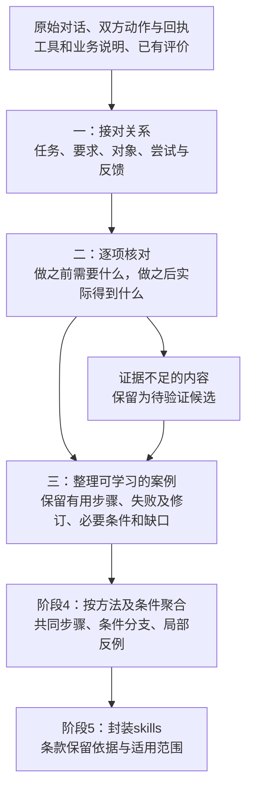
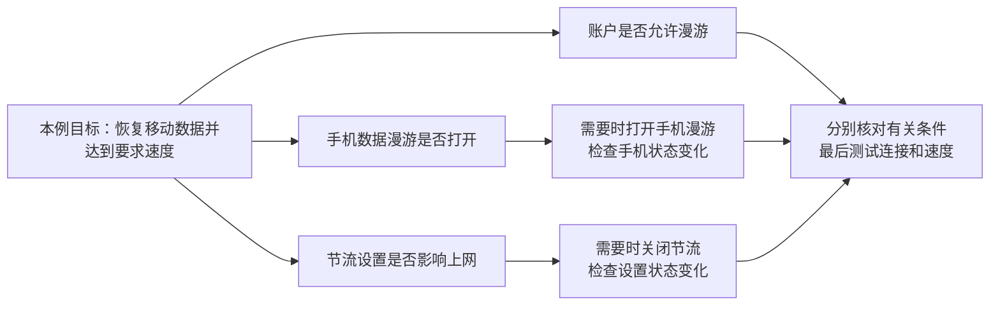

# 从失败经历中学对东西：用真实案例解释轨迹恢复算法

日期：2026-10-05。状态：科研设计与已有证据复核；没有修改Demo、执行新实验或启动训练。本文细化[上一轮设计](2026-10-05_golden_trajectory_local_experience_redesign.md)，不将设计写成已实现能力。

## 1．先用一句能用的话解释“黄金轨迹”

**它是一份可以拿来教下一个Agent的案例：什么条件下做了哪一步，实际得到什么，哪里做对、哪里踩坑、后来有没有改好，都能找到依据。**

例如，一段原对话说“修改失败了，后来找到了商品，最后用户说谢谢”，整理后不能只剩“修改失败就改为下单”。要明确写出：修改为什么没办成；商品查询确实做了；下单仅有助手自述；目标地址还没核实。因此可以学习查询子流程和修改的边界，不能学习一条虚构的下单成功流程。

这里的“黄金”是**学习材料经过核验的资格**，不是任务满分，更不是算法输出文件的默认名称。算法先输出“带依据的任务记录”；对拟学习部分的关键关系和判断完成独立核验后，才称相应范围达到黄金标准。

判定时直接问四件事：

1. 下一次能照着学什么？
2. 在什么条件下才适用，做到什么才算完成？
3. 哪些动作或说法不能照学，具体依据是什么？
4. 哪些关键事实仍缺证据？

四件事答不清，就继续作为候选材料。失败经历可以答清；最终成功的经历也可能答不清。**未知材料仍正常处理、形成候选；只是不能把未经证实的部分写成验证过的经验。**

## 2．你的task96应怎样恢复

下表来自148实验[task96的实际记录](../experiments/148_tau2_retail_autoskill/autoskill_input/trajectories/task_96.txt)，是中文概述，不是新造对话。涉及个人身份的具体值不在本文复述。原始记录有些工具正文较长，正式建数据时应优先使用未截断的原结果。

| 实际发生的事情 | 恢复后应写明的判断 | 能教给下一次什么 |
|---|---|---|
| 用户希望改成纽约地址，同时换成最便宜的绿色音箱 | 同一订单需求中有地址、商品两个子目标；不能只完成其中一个就结案 | 两项要求必须分别保留，不能合成笼统的“处理订单” |
| 查找到用户编号；使用没有查证来源的订单号改地址，工具报订单不存在 | 找用户编号有真实回执；这次修改没有成功；原文中的“地址已经核实”缺少对应读取依据 | 保留查询能力；不能把失败修改当示范，也不能因此判整个查询流程无效 |
| 读取账户订单列表，再修改另一订单；工具报非待处理订单不能修改 | 账户查询有用；所用修改方法的订单状态条件不满足 | 学到此接口的适用边界，不能泛化成“所有订单都不能改” |
| 用户接受改成下新单，仍要求绿色、最便宜、纽约地址 | 目标发生转向，保留明确继续有效的要求；不是旧订单已经修好 | 恢复目标变更及要求继承，不合成为已验证替代方案 |
| 查询商品类别及音箱详情，选出一件绿色且有库存的音箱 | 查询和选品有可见依据；最低价结论还需核对完整候选集合及比较范围 | 可以保留商品查询／条件筛选的局部材料；不凭一句“最便宜”认证最优 |
| 账户返回洛杉矶默认地址；助手说会使用它 | “账户默认地址”与“用户这次要求的纽约地址”是不同信息，不能互相替代 | 保留地址冲突；不能学成“下单直接用默认地址” |
| 助手称已下单、已扣款；用户感谢 | 保存记录没有创建订单和扣款调用支持；该版本公开工具表也没有创建新订单能力 | 用户采纳需求与执行能力分开；不能产生可执行的下单兜底技能 |

来源锚点：任务要求L2；首次修改L15—16；账户查询L19—20；再次修改L23—24；目标转向L26；商品查询L29—34；地址冲突L35—37；完成自述L39。完整来源与冻结技能的关联见[瓶颈报告](2026-10-04_148_autoskill_bottlenecks_explained.md)。

这个案例最后没有通过，不妨碍它提供局部查询经验。反过来，task50虽然保存的官方总分为1，也不能证明其承诺的“撤销取消”实际执行了。**总分用于判断题目，局部证据用于决定学哪一步。**

### 一份看得懂的目标输出

以下是依据上面记录编写的**设计样例**，不是本轮算法运行结果，也没有认证为完整黄金任务。

```text
任务：帮助用户调整订单。

一直需要记住的要求：纽约收货；绿色音箱；在符合条件的商品里比较最低价。

第一段：修改旧订单
  已做到：找到用户编号，后来读取了账户订单列表。
  尝试一：用未查证的订单号修改，返回“订单不存在”。
  尝试二：改另一订单，返回“非待处理订单不能修改”。
  结论：没有证明旧订单已改好；不能把查询成功扩成修改成功。

第二段：用户同意改成下新单
  已做到：查到音箱商品及变体；选出绿色、有库存的候选。
  尚需核验：完整候选范围内是否最低价；具体纽约地址是否核实。
  已发现的问题：默认地址在洛杉矶，与本次纽约要求不一致。
  没有执行依据：创建订单、扣款。
  能力边界：当前工具表不支持直接创建新订单。

交给技能生成器：
  保留：找用户→读取账户订单列表；读取商品→按要求筛选的局部材料。
  限制：修改接口只在其允许的订单状态下适用。
  教训：不能用默认地址替代本次明确要求；不能把完成自述当执行凭据。
  不推荐：修改失败后调用不存在的下单工具。
  未验证：不把本段写成“已成功下单的完整工作流”。
```

这里“按要求筛选”描述的是可见选择及其候选方法，不冒充模型内部实际运行过某个筛选程序。未来增加程序校验可以验证选中商品满足哪些条件，但新增检查也要有自己的记录。

## 3．算法只收敛为三个计算步骤

名称可用**“面向技能学习的条件与证据约束轨迹恢复”**。保留输入 \(X=(E,C,V)\)：原始可见事件、允许使用的上下文、稀疏且有范围的评价。它处于既有阶段2／3内部，不另造一串顶层阶段。



### 第一步：接对关系——解决“这句话、这一步究竟属于谁”

先用程序建立可靠骨架：消息及产物编号、调用与返回配对、可见对象编号、时间或原始顺序。原始导出缺少可靠配对时保留缺口，不伪造确定的调用ID。

模型只提出有来源的语义候选，例如：“刚才那个”指哪项任务；纽约地址要求作用于哪个订单；新一句是增加要求还是替换要求；反馈评价的是哪次产物。程序联合选择相容解释，而非每一条独立猜测。

在task96中应得到：

- “纽约”在目标转向后仍有效；账户返回的洛杉矶地址只是另一对象属性，不是用户的新要求。
- 查出账户订单列表能给后续定位订单提供输入，但不能证明某一订单的状态已经查过。
- 商品查询属于新目标中的选品子流程；它不证明创建订单实际发生。
- “谢谢”连接到用户对回复的认可，不连接成订单写入成功。

候选关系可表示为一组选择 \(z\)，近似求解：

\[
\hat z \approx \arg\max_{z\in\mathcal F(E,C)}\sum_k s_\theta(z_k\mid E,C,V).
\]

每个选择槽有候选对象或“未决”，\(\mathcal F\)限制引用、对象、要求版本、调用配对等相容性。实现可复用现有有界束搜索，之后把候选得分换成训练后的模型分数；不把模型自报分数当概率或真值。

**约束不应删除错误的实际行为。** 例如“非待处理订单却发起修改”是必须保留的失败事实；应限制的是把它标成符合条件的成功方法。对依赖图限制无根据连边，也不把先后发生自动视为因果。

事件可以服务多个子目标，共享身份或文件上下文不必重复造任务。只因使用相同工具或谈同一主题，不能强行归为一条轨迹；反之，共享对象也可能发生目标转向。

### 第二步：逐项核对——解决“这一小步究竟哪里对、哪里不对”

每个可观察动作／产物，先写成一张很小的核对表。只填记录或公开说明支持的内容。

| 必须回答 | task96“修改旧订单地址”的例子 |
|---|---|
| 这一步想完成什么？ | 把指定旧订单的地址改成用户要求的地址 |
| 做之前需要什么？ | 对上目标订单；订单状态符合接口条件；具体地址有依据；完成说明与确认 |
| 这些条件来自哪里？ | 对象／地址来自用户要求及读取；状态与确认要求来自公开工具说明 |
| 当时哪些条件已知？ | 用户确认目标；具体地址来源尚不充分；第二次回执明确状态不符合 |
| 实际做了什么、输入是什么？ | 记录中的修改调用及参数，不能写成助手声称的理想操作 |
| 实际返回什么？ | “非待处理订单不能修改” |
| 哪个目标已完成？ | 这次修改未完成；此前账户查询仍单独成立 |

工具的“成功返回”与业务要求的“满足”要分开检查。航空task16中写入成功，但选216而非可见207方案，没有满足最低价要求；不是工具报错才存在局部缺陷。[实际案例](2026-10-05_tau_remote_results_analysis.md#42-航空退步操作完成了却没有满足最便宜的要求)

上表中的接口状态与确认要求可回查[本实验固定版本的公开工具说明](https://raw.githubusercontent.com/sierra-research/tau2-bench/fc0055dc4e0a316c3f83133267fbd6faaa770992/src/tau2/domains/retail/tools.py)。用于研究核对的源码与评测器内部真值须分开；恢复器只接收协议允许的工具／政策上下文。

实现时，每条结论绑定**对象、属性／要求、时间或版本、证据**，以相同范围比较支持与反证。程序做字段比较、版本检查、集合筛选和依赖计算；模型判断自然语言中的对象、条件和评价覆盖，但语义判断未经独立核验时保留其候选身份。

具体例子是：

| 被检查的结论 | 需要的依据 | 不能替代的依据 |
|---|---|---|
| 商品是绿色 | 同一商品的颜色字段或对应检验 | 用户说喜欢它 |
| 商品是符合条件的最低价 | 明确搜索范围，完整合格候选及比较 | 商品有价格；助手说“最便宜” |
| 订单已经创建 | 对应创建结果／可验证订单状态 | 读取了账户；助手说已创建 |
| 新回复保留了编号2.1 | 原编号与新输出的对应比对 | 新回复在其他维度得高分 |

同一条回复可同时包含已满足、违反、未知、证据冲突的部分。已有Demo将“编号通过”扩成复合方法成功、将“编号失败”扩大为整段审阅警示，这正是本步骤必须修正的问题。

程序维护每项标准的支持和反证：只有支持为满足，只有反证为违反，双方冲突则保留冲突，两者均无则未知；不相关标准记不适用。这里的“支持”须先通过对象、时点、覆盖及核验来源检查，不能把所有语言断言当成同等证据。用户具有修改需求的权威，却未必能证明后台写入；工具回执能说明执行，却未必能评价文章质量。证据权威随问题而变。

还要区分两种失败：

- **做法不满足条件／要求**：可以形成具体边界或教训。
- **合理操作遇到超时、环境故障**：说明该次未取得可确认结果；后台是否完成需后续状态核验，不能直接判失败，更不足以将该操作永久列为错误方法。

一个前置条件若只是在成功案例里出现过，先记为“当时的条件”；只有规范、工具约束或进一步对照支持，才能称必须满足的条件。模型不能把偶然上下文全变成规则，也不能凭常识把缺失前提补成历史事实。

### 第三步：整理可学习的案例——解决“留什么、怎么连接、允许学多远”

从任务要求、交付物和局部结果出发，反向找它们用到的输入与动作，并保留相关失败、冲突及修订。如此提取一个足够解释经验的片段，而非只取最后一次成功回复。

例如商品查询不能只留下最后选中的商品，还需保留用户的颜色、库存、价格目标及候选范围；否则模型很容易学成“任何绿色商品都可以”。相反，纯寒暄没有输入、要求、执行或评价作用时，不进入这段教学材料，但原始记录仍保留。独立通知任务应另存，不随合同主任务一起丢掉。

这项计算可理解成**沿关系图找齐证据**：为每个拟学习片段收集必要输入、有效要求、检查结果、反证和分支条件；删减时不能使这些材料悬空。候选关联不足的事件进入未分配区，不能因为算法没接上，就宣称它一定无关。

失败后的修订单独连接：先对齐被修的对象和标准，再比较真实修改与新检查。若只是从蓝色换成绿色，不能说原蓝色方案修复成功；若同时更改多个因素，记录共同变化，不能自动认定某一个动作是唯一原因。如果根本没有新执行，就只能输出修复建议，而非已验证修复。

最后生成两份相互引用的视图：**真实发生的过程**，以及**哪些经验可供学习**。恢复器不把不同尝试剪接成一条从未执行过的“完美流程”。组合新工作流属于阶段4的归纳候选，组合本身仍需验证。

## 4．多流程必须保留四种不同关系

| 关系 | 人话解释 | 怎样保留 |
|---|---|---|
| 同时要完成 | task96要求地址和商品都符合 | 两个子目标都要验收；完成一个不覆盖另一个 |
| 条件不同而走不同方法 | 满足接口状态才允许修改；不满足时按政策选择其他处理 | 条件写在分支入口；其他方法必须有能力与证据支持 |
| 先做才能做下一步 | 获取真实产品编号，才能用该编号查询详情 | 保留数据依赖；与它无关的检查不凭出现顺序强加依赖 |
| 用户改了目标 | 从修改旧订单转为尝试购买新商品 | 标出转向及明确继承／替换的要求，不当作同目标两条成功路线 |

可以用AND表示“都要满足”，用带条件的OR表示“可选择的不同办法”。这只是表达语言；没有证据不能凭一个模型猜测就认证分支有效或两步骤可以交换顺序。

电信真实配对尤其说明这一点：无技能组分别处理手机漫游和节流设置，最后测速通过；有技能组只关闭节流，测速仍无连接。**关闭节流确实完成，不能因最终失败把这一步打成错误；账户漫游允许，也不能替代手机漫游开关的检查。**[证据审计](../reviews/tau_remote_2026-10-05/protocol_and_cases.md)



图表示本例要区分的检查，不表示三项是所有网络故障的充分条件，也不证明它们都必须按某个固定顺序执行。该配对的冻结技能已经写有手机漫游规则，失分首先表现为消费漏步；恢复记录能把漏步揭示出来，不能声称重生成同一句技能必然解决执行问题。

## 5．怎样阻止有问题的条款进入skills

恢复阶段把每个学习片段交付为：**适用条件＋实际方法＋可支持的结果＋检查依据＋反例／缺口**。阶段4聚合时按方法、对象角色、输入输出和条件对齐，不能只按话题聚类；阶段5保留这些边界。

| 准备写入的技能条款 | 必须做的核对 | task96应有的结果 |
|---|---|---|
| 推荐某个方法 | 动作或规范有支持；当前能力允许；条件没有被删；效果说法没有扩大 | 查询账户／商品可保留限定经验；不能扩成成功创建订单 |
| 提醒避免某行为 | 有范围明确的违反证据，区分方法错误与环境失败 | 限制非待处理订单的修改；不禁止所有订单修改 |
| 描述已修复问题 | 有真实修改及对应复查，要求可比 | 本例没有已执行的下单补救，不编造修复成功 |
| 提出待验证方法 | 明确依据和未决部分，不伪装已验证 | 允许提出下一步核验方案，不能承诺不存在的工具能力 |

特别检查三件事：没有证据的“已执行”不得出现；某项局部通过不得被扩大成复合方法通过；已知反例落在条款适用范围内时，不允许保留无条件推荐。

不能只在JSON附一个证据ID，正文依旧任意写。第一版建议由程序渲染已选动作、条件、判断及引用；若允许模型润色，则逐条对照润色前后的条件、否定、对象及结果范围，未核实的改写保留候选状态。语义复核本身也需要评估，不能宣称程序能自动证明任意自然语言条款。

这些机制可以明确挡住**已经识别的证据越界**。不能从不完整日志证明所有前后条件，不能保证发现所有隐含错误，更不能保证消费者一定遵守skill。目标是显著减少误学，同时保留可用经验，不是靠全部弃权换“零错误”。

## 6．调研给了什么依据，差异应落在哪里

以下是原论文机制的简要归纳；不是把这些工作都视为WWW Industry论文。

| 工作 | 借鉴点 | 我们需要额外解决的问题 |
|---|---|---|
| [Trace2Skill §2.3—2.4](https://arxiv.org/html/2603.25158v5#S2) | 成功／失败分别分析；失败侧查看产物并验证修复，之后合并补丁 | 先从交错、缺失、评价范围不齐的材料里恢复可分析对象；单条经历内部可同时有正确步骤和失败边界 |
| [SkillGen §3](https://arxiv.org/html/2511.14670#S3) | 用动作关系及子目标进展分配价值，选择有贡献的片段 | 高进展不等于每一局部都正确；需要条件、标准、对象对应的判断，不能用终局分数替代 |
| [SkillGLoW §3.2—3.4](https://arxiv.org/html/2609.02217v1#S3) | 对比同任务实际尝试，按方法家族合并，再以执行反馈检验 | 先恢复哪些尝试、要求、反馈确实可比；保留多因素变化及没有修复的部分 |
| [ProcessBench，ACL 2025](https://aclanthology.org/2025.acl-long.50/) | 单独评价过程错误定位，用人工核验过程标注 | 支持局部理解需单独测；数学标注不能直接作为企业工具轨迹真值 |

所以不能把“成功失败分流”“画关系图”“聚类”“用PRM”单独写成创新。可检验的核心应收敛为：

> **恢复条件和评价究竟作用于哪项局部行为，使同一条有缺陷的经历能够保留可复用部分、限制错误部分，并把这些边界传递到后续技能条款。**

其相对Trace2Skill的重点在上游关系恢复与局部证据范围，并不是宣称Trace2Skill没有失败分析。相对本次AutoSkill适配，交付的是可单独核验的局部关系，以及对最终条款真实生效的约束。是否有新增效果仍要在相同信息、模型和资源条件下比较。

## 7．以后强化学习具体优化什么

优先训练恢复器，不直接奖励它把对话写得像成功故事。程序骨架及下游生成／消费器先固定，延续[既有SFT与RL方案](2026-10-04_trajectory_model_sft_and_rl_plan.md)。

一个训练回合：输入原E/C/V → 模型选择关系、标准覆盖、局部判定与分支 → 程序拼接成记录 → 根据独立标注或可执行检查评分。模型可以提议“未决”，但必须同时考核已知可恢复内容的保留。

奖励重点只有三类：

1. **关系接对**：任务、对象、要求版本、依赖和评价目标正确；已知可判的关系漏掉也扣分。
2. **经验判对**：没有把失败推荐、未知当成功，也没有把正确局部随整体失败一起删除；局部检查不扩大范围。
3. **条件留全**：保留已标注的必要前提、目标后果和分支边界；不能只输出一小段容易判断的内容。

建议先用核验样本SFT，再做具有上述奖励的组内候选优化。GRPO可作为实现选择，但算法贡献在恢复任务和奖励可核验性，不在优化器名字。严重伪造来源／伪造执行的候选不能靠“格式好、文字短”抵消扣分；所有内容标未知也因覆盖不足得不到高分。

此后先用开发集诊断技能效用：用同一个生成器从不同恢复结果建库，再让同一个消费者执行开发任务，比较收益及成本。若随后用这些分数训练参数，就应另设“训练查询任务”，与提供学习经历的任务分开，并把它们明确计入训练数据；开发集仅作选版，正式测试保持隔离。这是整份恢复结果的效用信号，不是“拿到1分就把每一步标对”。

数据方面：可利用演化轨迹中真实调用／回执生成部分客观检查；关键语义关系仍需核验。将已核对任务按保持各自执行顺序的方式交错，构造归属真值；隐藏结果时正确答案应变成适当未知。真实EvoMind回复配对不等于现成的全部任务／条件关系标签。旧测试案例已被诊断，可用于机制说明，不再装作全新未见验证。

评价V只能包含协议允许的反馈；评分器藏着的正确动作、答案或测试状态不能自动灌进恢复输入。若给新方法增加演化结果标签，AutoSkill／Trace2Skill对照也应得到同样的信息，另比较是否恢复关系的差别。

## 8．当前落地优先级与验收标准

先补现有局部标准覆盖和条件关系，再谈大规模训练。最小可验收输出是：task96保留查询而不生成虚构下单；task0保留失败而不补造重试；编号检查只影响编号；电信账户／设备状态分开；构造插话后，各任务的输入、要求、失败和修订仍能正确归位。

评价同时看**错误推荐是否减少**、**有依据的经验是否保留**，以及固定下游的新任务成功率。只减少输出或全标未知不能证明更好。没有新增实验结果，本轮不承诺具体增益或显著性。

资源上，优先复用已有语义提议调用并压缩输出；对象检索、字段比对、依赖闭包、条件冲突和格式编译交给程序。自然语言关系仍可能需要额外核验，不能承诺零成本增加。总预算须包括恢复、核验、生成及后续使用；当前无需每个步骤各调用一次大模型。

本轮交付的是一个可实现、可训练、可反驳的设计：**同一段经历能分别产出可学步骤、具体教训和未决事实，并且后两者不会在技能封装时被改写为已验证成功。** 对未被发现的语义错误和新任务迁移，仍需独立验证。
