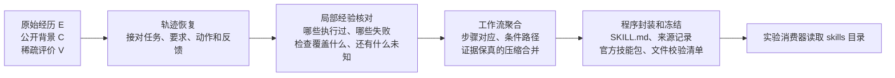

# 原始经历到技能库：直接实验管道实现与验收

日期：2026-10-05。**已完成可直接接入实验的离线生成入口：读取原始经历，恢复轨迹，归纳局部方法，聚合工作流，输出冻结技能库。**本次范围到技能库交付为止，不要求账号、用户采纳、组织流程或后续自进化。

这是功能实现与小样例验收报告，不是下游效果实验报告。真实材料已生成两个可读取、可封装的候选技能；尚未证明它们能提高τ²得分，也没有把它们认证为“黄金经验”。

## 1．现在怎么运行

入口是 [trace_to_skills.py](../../enginering/demo/trace_to_skills.py)，完整命令和产物说明见 [使用说明](../../enginering/demo/DIRECT_PIPELINE_README.md)。默认使用新算法；原十二阶段Demo和旧算法入口保留。



算法仍然只有两个核心：**轨迹恢复包含局部经验核对；工作流聚合把这些经验归纳成有条件的方法。**封装只负责忠实输出，不再要求模型重写一遍方法。

在 `enginering/demo` 目录执行：

```powershell
# 从已有演化文件中选择会话，保留原消息与双方工具调用。
python -X utf8 import_experiment_traces.py --input ../../research/experiments/148_tau2_retail_autoskill/runs/collect/evolution.json --task-ids 0 50 96 --output artifacts/my-source/input.json

# 免费检查分批、输入和预算；不调用模型。
python -X utf8 trace_to_skills.py --input artifacts/my-source/input.json --output artifacts/my-tau-library --preflight-only

# 该三会话样例按默认大小分成两批，最多需要四次模型请求。
python -X utf8 trace_to_skills.py --input artifacts/my-source/input.json --output artifacts/my-tau-library --max-calls 4
```

模型配置沿用本机已有配置。每批通常两次请求：关系恢复一次、局部方法抽取一次；未发现任务时省去第二次。**聚合、技能正文生成和官方打包都是程序处理，不调用模型。**冷启动预算不足在付费前报错；运行失败不自动重试、不临时扩预算。输入、代码或模型配置改变时须使用新输出目录。

## 2．轨迹恢复具体落实了什么

模型负责读懂语义，提出任务、要求变化、尝试和反馈的对应关系；程序用有界关系搜索核对来源、对象、任务边界及时间依赖。独立会话先形成各自的任务实例，后续由聚合器比较方法，不在恢复阶段把不同人的任务拼成一次执行。

接着将任务拆成有子目标、条件、动作、输入输出、依赖和检查依据的局部方法。此次补上了以下实质处理：

| 容易错学的情况 | 现在如何处理 |
|---|---|
| 助手说“完成了”，但没有对应操作 | 真实工具调用决定操作身份；已识别的计划或完成自述不能经消息别名变成实际动作。纯计划方法暂不封装。 |
| 整场失败，却有正确查询步骤 | 整任务、整次尝试的评价留在原范围，不能广播成每一步都失败；成功总评也不能广播成每一步成功。 |
| 工具调用正常返回，但正文明确报错 | 分开保存传输状态和业务错误观察；可识别的明确错误步骤不进入正向操作建议。超时保持结果未知。 |
| 只检查了编号，模型却说格式和内容都正确 | 原评价标准及目标保持不变，检查维度由程序绑定原标准；模型另起维度名也不能扩大认证范围。 |
| 前置查询失败，后面仍建议根据查询结果修改 | 保存后续历史动作，但将依赖未满足的后继移出可连续执行的参考方法，不把后继自身的原检查改写成失败。 |
| 只挑支持证据，漏掉相同标准的反例 | 汇入同目标、同检查标准的已知反证；冲突保留，不能靠多数成功覆盖。 |
| 抽取器没使用某些材料 | 留在未分配清单，原文和来源仍能回查，不称为已确认的无价值噪音。 |

条件分为公开规则、用户要求、当时观察和待验证假设。例如“这次订单恰好处于某状态”与“政策要求必须处于该状态”不会因为文字相似就变成同一条普遍前提。

为控制输入体积，重复材料改用字符串／记录索引传给模型，原完整输入另外保存。索引可精确展开回原内容，不靠截掉失败尾部或摘要遗漏条件来压缩。

**仍有语义边界：**程序不能保证模型发现了全部隐含要求；若上游漏识别完成自述，仍可能出现文本产物与外部操作的混淆。来源与结构核对不是独立语义真值，当前不承诺“所有错误条款都已拦截”。

## 3．工作流聚合具体落实了什么

这一步已改为程序归纳，不再让模型只回答“这两条兼容”。

1. **找可能相同的方法。**根据局部目标、对象类型、输出类型和动作索引生成候选。操作由谁执行、作用于什么角色、产生什么效果、输入输出是什么，都参与比较。
2. **对齐步骤和依赖。**同一个动作名称不够；还要判断它在方法中的输入输出和先后依赖是否对应。
3. **保留共同主干及各自条件。**每个来源方法都必须能映射回聚合结果，原路径中的同时满足条件、分支、未知、失败和检查依据不能被压掉。
4. **计算合并是否值得。**先满足上述保真要求，再按预先固定的结构编码计算压缩收益，贪心选择正收益最大的合并。不预设技能数，也不为了少几个技能删除独特单例。
5. **限制反例所命中的局部。**同条件下的局部成功／失败冲突影响该步骤的推荐用途，不能因此否定无关查询，也不能把分别观察到的边拼成“整条已成功”的新路径。

所有批次的局部方法先汇入同一个池，再统一聚合。来源增加命名空间，避免不同批次都叫“步骤1”而错接证据。正文相同的路径不重复列操作，但完整来源见证仍保存。

当前是启发式方法：使用模型提出的统一语义标签，跨批次同义标签不一致时可能漏合并；不是全局最优图匹配，也没有证明结构压缩等于业务效用。结构编码长度是固定符号计数，不冒充精确字节压缩或完整的概率MDL模型。

## 4．怎样交给实验

每次运行保存原输入、整理回合、恢复结果、局部方法、聚合结果、暂不封装的工作流、模型请求、预算及代码快照。最终交付标准 `skills/<技能目录>/SKILL.md`，配套来源结构，并调用现有OpenClaw官方 skill-creator 脚本校验和生成 `.skill` 包。

冻结清单保存全部技能文件的SHA及生成配置；失败运行撤销可消费状态。再次进入同一运行时，只有输入、源码、配置和文件校验一致才能零调用复用。

现有τ²消费器的接入方式：

```powershell
$env:TAU2_RETAIL_SKILLS_DIR = 'D:\skillsgen-industry_track\enginering\demo\artifacts\my-tau-library\skills'
python -X utf8 -c "from skilldemo.library_export import verify_frozen; print(verify_frozen('artifacts/my-tau-library'))"
```

随后按实验原协议启动消费器。只挂载 `skills` 子目录，不把整份原会话或请求日志目录挂给Agent。本轮未启动新的benchmark，没有替换旧AutoSkill库。

导入器默认只取可见消息与实际工具记录，`C`和`V`为空；允许显式另传公开背景及合法的稀疏评价。不会自动导入隐藏用户目标、金标动作、期望数据库终态或完整 `reward_info`。如果后续增加结果监督，对照方法需要获得相同信息。

## 5．本轮实际验收结果

| 验收材料 | 结果 | 能说明什么 |
|---|---|---|
| 全部免费测试 | **416项通过，32.409秒** | 输入适配、局部边界、聚合、导出及旧路径回归通过；不证明语义准确率。 |
| 148零售task0／50／96输入审计 | 3会话、86事件、33回合；10/10助手调用进入恢复输入 | 没有因规范化丢掉这些实际操作。 |
| 268电信单会话输入审计 | 61事件、25回合；16/16用户调用及4/4助手调用进入恢复输入 | 双方操作均保留，不再只展开助手动作。 |
| 构造的跨批聚合样例 | 3独立任务、3方法、2批次 → **1技能、2次程序合并**；官方封装、冻结、零调用复入通过 | 聚合机制确实执行；语义响应为人工构造，不是模型聚类效果实验。 |
| **真实τ²零售task50** | 20事件、2实际调用 → 1恢复任务、2局部方法、**2候选技能**；官方封装及冻结校验通过 | 真材料到可消费文件链路跑通；该例**0次工作流合并**。 |
| 最终真实运行再次进入 | **0新增模型调用**，校验通过 | 精确冻结复入有效，不重新学习。 |

真实task50产出：

- [通过用户ID获取用户详情及订单列表](../../enginering/demo/artifacts/direct-pipeline-review/live148-task50-final/skills/workflow-1507f3a706d2eca8/SKILL.md)。
- [通过姓名和邮编查找用户ID](../../enginering/demo/artifacts/direct-pipeline-review/live148-task50-final/skills/workflow-ce6aaa2c7e8f6820/SKILL.md)。

没有执行凭据的“撤销取消”没有成为技能能力。两个实际调用均进入局部方法；来源目录中的46个视图有40个未分配，这是消息／片段／调用等重复视图的计数，**不是丢了40条原消息**。原材料仍保留。

也必须直说：这两个产物都是基础查询候选，目前粒度较细，不能据此宣称已生成高价值多步骤工作流。缺少独立业务核验的效果保持未知。此例证明了接入和边界处理，尚不能证明保留所有有用经验、减少无效技能或优于AutoSkill。

主要验收文件：[真实结果](../../enginering/demo/artifacts/direct-pipeline-review/live148-task50-final/acceptance_summary.json)、[构造聚合运行](../../enginering/demo/artifacts/direct-pipeline-review/fixture-final/run.json)、[局部理解独立审查](../../enginering/demo/artifacts/direct-pipeline-review/independent_review_r.md)、[管道独立审查](../../enginering/demo/artifacts/direct-pipeline-review/independent_review_pipeline.md)。独立审查保留修复前负例和修复后复验。

## 6．失败、复用和资源必须完整披露

真实模型为本机配置的 `qwen3.7-plus`，通过Anthropic消息兼容接口；最终运行超时配置为240秒。原失败目录均保留：

| 运行 | 实际情况 | 本次新增真实请求 | 已知tokens |
|---|---|---:|---:|
| `live148-v2` | 三会话首个关系请求读取超时；FAILED | 1 | 未知 |
| `live148-task50` | 关系恢复成功；局部回复类型不合契约被拒绝；FAILED | 2 | 68,988 |
| `live148-task50-final` | 精确复用前次真实关系回复；新请求完成局部抽取、聚合与封装 | 1 | 31,561 |
| **全轮合计** | 原失败没有追认为成功 | **4** | **100,549，另有1次用量未知** |

因此最终案例是**保存的真实关系回复重验＋一次新的真实局部请求**，不是最终版本从零开始的两次新请求独立复跑。其所用两份响应合计50,591 tokens，其中19,030来自先前调用。费用未知。[完整请求汇总](../../enginering/demo/artifacts/direct-pipeline-review/model_attempts_summary.json)。

本例局部材料无损索引由91,001字符变为65,236字符，减少28.31%。两次局部调用的输入tokens分别为42,307和26,072，但提示及输出版本也有变化，不能将其当成受控成本收益实验。两次请求上限、缓存复用或字符下降都不等于已证明总成本低于基线。

## 7．当前交付边界

**可以开始接实验的技能生成阶段。**先固定演化输入与信息条件，运行本入口，再把生成的 `skills` 目录交给原消费者；所有运行使用独立目录、保留失败和完整账本。

后续效果实验仍需回答：真实多轨迹是否能合理合并、局部失败是否误学、有效经验是否遗漏、基础技能是否过碎，以及相同消费者下任务评分与总成本如何变化。这些没有被本轮功能验收代替。本轮没有训练、主动重跑修复、正式benchmark扩跑或生产接入。

本版的候选贡献是：**恢复出的任务关系、局部证据和条件边界真正约束工作流合并与最终技能条款。**关系图、成败分析、聚类、压缩和技能包装本身不单独宣称首次提出；原创性和优势仍由后续对照证据建立。
