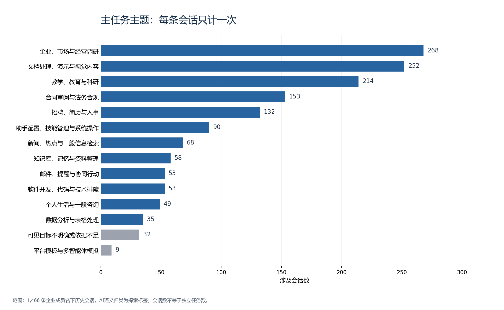
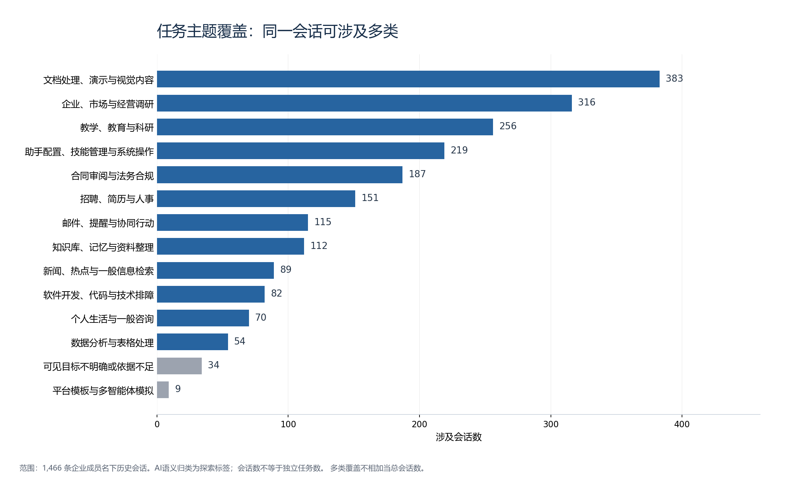

# EvoMind全量会话：任务分布、数据缺口与补交方案

日期：2026-10-05。本轮完成现有全量会话的主题分析、逐会话归类、柱形图及源码支持的数据补交清单。没有重新运行技能生成、连接生产或修改原会话数据。

**已处理1,466条会话，来自34名实际出现的用户；归纳为12类任务主题，另保留32条目标不明确的会话和9条以平台模板、多智能体模拟为主的会话。** 最多的是企业/市场调研、文档与视觉内容、教学教育科研，三类合计734条，占50.07%。

这些是**会话主题分布，不是独立任务条数或已经认证的工作流簇**。一条会话可以做几件事；主题相近也不代表方法相同。本轮结果用于看清数据构成和选择案例，不能直接变成技能库。

## 一、这次到底用了哪些数据

- 主输入：[066全量会话正文](../datasets/evomind/matched_066/private/evomind_conversations.json)，共1,466条。对应JSONL是同一份内容的另一种表示，不能再次合并计数。
- 关联核对：[071最终回复匹配](../datasets/evomind/accepted_071/private/accepted_annotations.json)。它覆盖505条曾需标注的会话、2,674项决定，其中58项为明确人工选择，其余为AI或程序来源。它解决语义对应问题，不是任务真值或历史时间真值。
- 缺口依据：用户提供的两份2026-09-25下载导出、本轮逐字段统计及`enginering/insightweaver`中的消息、文件、技能、计费源码。

主集共有8,202组去重用户输入、19,734组去重AI正文。原始重复出现和删除的重试来源仍可追溯；本轮不重新清理或删除会话。原导出按当时企业成员名单取会话，并不是逐条按企业业务认证，所以仍含个人咨询、测试及模拟材料。

## 二、任务主要有哪几大块

主类表示“该会话最主要的可见目标”，每条只计一次。覆盖数还计入其他独立主题，同一会话可同时出现在多类，因此覆盖列不能相加当总会话数。

| 主题 | 主类会话数 | 占全部会话 | 含其他主题的覆盖会话数 | 归类所指的目标 |
|---|---:|---:|---:|---|
| 企业、市场与经营调研 | 268 | 18.28% | 316 | 查企业、产品、市场、竞争及经营资料 |
| 文档处理、演示与视觉内容 | 252 | 17.19% | 383 | 文件处理、文案、PPT、图片或视觉交付 |
| 教学、教育与科研 | 214 | 14.60% | 256 | 教学设计、教育分析、学术研究与写作 |
| 合同审阅与法务合规 | 153 | 10.44% | 187 | 协议审查、不同立场的风险与条款修改 |
| 招聘、简历与人事 | 132 | 9.00% | 151 | 岗位需求、简历筛选、候选人及人事材料 |
| 助手配置、技能管理与系统操作 | 90 | 6.14% | 219 | 调整助手设置、安装意图及操作系统能力 |
| 新闻、热点与一般信息检索 | 68 | 4.64% | 89 | 获取事件、新闻及一般信息 |
| 知识库、记忆与资料整理 | 58 | 3.96% | 112 | 整理、存取、查找资料及记忆 |
| 软件开发、代码与技术排障 | 53 | 3.62% | 82 | 代码、技术实现、发布和已明确的技术故障 |
| 邮件、提醒与协同行动 | 53 | 3.62% | 115 | 发信、提醒、协调和外部行动 |
| 个人生活与一般咨询 | 49 | 3.34% | 70 | 非明确企业业务的生活咨询 |
| 数据分析与表格处理 | 35 | 2.39% | 54 | 数据计算、分析和表格处理 |
| 可见目标不明确或依据不足 | 32 | 2.18% | 34 | 只有短反馈、指代或缺少足够任务目标 |
| 平台模板与多智能体模拟 | 9 | 0.61% | 9 | 可见内容主要是平台包装或模拟角色 |
| **主类合计** | **1,466** | **100%（四舍五入前）** | — | — |

**443条会话有不止一个可辨识主题，占30.22%。** 这支持我们继续研究从混合会话恢复任务关系，但尚未量出交错次数、独立轨迹数或恢复效果；同一类内的多个任务也不会被本表揭示。

有32组跨会话的清洁用户正文完全相同，涉及118条会话。暂不删除：相同提问可能对应不同文件、时间和AI结果。后续按用户、时间或任务划分时，应检查这些重复输入及模板，避免把它们当独立泛化证据；频次本身也不代表业务价值。

## 三、如何归类，可信边界在哪里

先对全部用户正文做本地字符词面聚类，以发现主题线索；再逐会话AI语义审阅，按用户可见目标归类。平台开头的已确认回复语言、时间及助手包装不用于定主题，原文保留，分类不依赖标题。合同审阅归法务，不因它输出Word就归泛文档。

每个用户正文组均进入摘要，长正文保留首尾并标明截断；歧义案例选择性回读全文，不能声称所有长正文逐字读完。保留初始判读、来源编号和修订记录。主代理核对107条边界会话，另一审阅者抽查28条代表；据全文纠正了汇报PPT的主类和不可见故障图片的次类。细节见[归类核对记录](../datasets/evomind/analysis_20261005/semantic_review_notes.md)。

最终标签有1,370条高、65条中、31条低置信度。**它们是AI主观判读标记，不是准确率。** 没有独立人工金标准，不能报告分类准确率，也不能由“高置信度”认证真实业务完成。只有指代或缺文件内容时不猜领域；同一目标的背景、子步骤和交付格式不另算独立主题。

## 四、数据究竟缺了什么，数据方去哪里取

已导出的文件字段只能告诉我们“哪个文件被引用”，不能还原文件内容。主要缺口如下；更完整的表名、关联和交付包结构见[给数据方的补交清单](2026-10-05_evomind_data_supplement_request.md)。

| 缺口 | 现有范围 | 数据方具体查哪里 | 应交什么 |
|---|---|---|---|
| 用户原文件 | 442条会话带元数据，1,656次引用 | 平台PostgreSQL `insight_weaver_prod`的`zclaw_messages.rawPayload.files`；按用户和实例到KM工作区取字节 | 原文件、会话/消息对应、hash、大小、当时版本或当前快照说明；找不到也逐项列原因 |
| AI产物和修改版本 | 14条会话带输出文件元数据，111次引用；另71条正文中有文件位置候选 | `generated_artifacts`及消息/原生manifest；按会话查，再按用户＋路径和核实的企业补查；文件在KM工作区/备份 | 每次生成和修订的实际文件、对应请求和版本；不能只交最后被覆盖的文件 |
| 完整工具调用与结果 | 57条会话有2,388次载荷内快照 | `zclaw_messages`全部角色；不足时取KM原生history | 调用名称、参数、输出/错误、真实调用编号、请求/重试关联；原包约9.3万行全量工具记录未导，具体本批数量补查后才能知道 |
| 时序与回复归属 | 全部AI正文缺独立可用消息时间 | `zclaw_chat_bindings`连到原生会话键；会话/agent实例表定位KM，企业实例表给路由 | 原生连续历史、顺序、事件时间及可取得的真实回复/尝试关系；不要补造不存在的`replyTo` |
| 技能与消费证据 | 技能声明、选择前缀和路径文本 | 如实际有技能：库存/使用事件、个人与组织配置/审批版本表；KM bundle/revisions和原生读取/执行日志 | 当时技能全包、版本/hash，以及选择、注入、读取、执行分层凭据；按用户已确认，本批历史agent无实际skills，不用凭文字伪造 |
| 业务结果和成本 | 目前主要是对话内自述及反馈 | 真实业务验收系统由数据方定位；计费表及上游usage，人工时间需业务方记录 | 评价针对哪个任务/尝试/文件、标准和依据；逐请求token/费用/时间。`done`及固定估算节省工时不能当真实收益 |

KM内部数据库和对象存储桶名称没有源码证据，不能编造。我们已核实平台表名和客户端GET接口，但线上schema与本地存在差异，数据方应先执行字段核对；本轮未实际查询生产。

### 最先补哪些数据

按主类统计，以下文件依赖尤为集中。这些数量只表示已出现输入文件元数据，并不是拿到了文件。

| 主类 | 全部会话 | 带用户文件元数据的会话 | 带AI输出文件元数据的会话 |
|---|---:|---:|---:|
| 文档、演示与视觉内容 | 252 | 106 | 4 |
| 合同与法务 | 153 | 92 | 1 |
| 企业与市场调研 | 268 | 86 | 4 |
| 招聘与人事 | 132 | 59 | 0 |
| 教育与科研 | 214 | 43 | 2 |

建议先把这442条已明确引用文件的会话补齐原文件、AI产物和完整工具历史，优先回补合同、招聘和文件编辑案例。原038合同群可以复查要求变化，但没有原合同和修订稿时不能认证修改正确。正文自足的任务仍可学有依据的局部经验；缺文件会话保留，不冒充完整成功轨迹。

原导出事实上还存在错误、中止和流式状态，更正此前“导出已经完全排除失败回复”的假定。清理失败重试控件不等于删除所有失败经验。071的语义匹配也没有增加AI真实时间，不能写成“原始顺序已全部证明正确”。

## 五、交付与核验

入口：[全量会话检索页](../datasets/evomind/analysis_20261005/private/index.html)。可按类别、置信度或正文检索，查看归类依据，并打开完整原会话。完整正文和文件路径仅保留在本地私有目录。

- [主类/多类统计CSV](../datasets/evomind/analysis_20261005/task_distribution.csv)、[逐会话标签CSV](../datasets/evomind/analysis_20261005/private/session_task_categories.csv)，图表同时提供PNG和可编辑SVG。
- [逐文件补交定位CSV](../datasets/evomind/analysis_20261005/private/requested_file_references.csv)，共1,767条输入/输出原引用；它们不是1,767个独立文件。
- [固定1,466会话编号](../datasets/evomind/analysis_20261005/private/session_ids.csv)、[用户＋路径补查表](../datasets/evomind/analysis_20261005/private/artifact_path_lookup.csv)、[数据方SQL模板](../datasets/evomind/analysis_20261005/provider_export.sql)。SQL先核对实际字段，仍需数据方用授权只读账号执行。
- [统计与覆盖核验](../datasets/evomind/analysis_20261005/delivery_validation.json)、[输入冻结信息](../datasets/evomind/analysis_20261005/manifest.json)、[分析方法与复算说明](../datasets/evomind/analysis_20261005/README.md)。

核验已确认：全部原会话编号覆盖且无重复；主类数量相加为1,466；引用的用户正文组均存在；输入数据与071标注SHA256不变；主图和覆盖图可正常显示。上述是结构、来源与统计核验，不是语义准确性或技能收益验收。

本轮分析脚本未调用外部模型API；AI语义审阅使用本次会话的助手资源，耗量未单独计量。未上传数据、未触发生产接入、未改Demo技能生成算法，也未声称已经得到1,466条标准任务或高价值skills。
