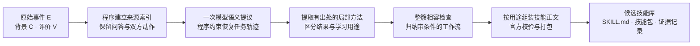

# 从原始经历到技能库：轻量管道实现与验收

2026-10-05。按用户本轮授权完成代码与限定案例验收。本入口专门服务两个研究核心：**恢复轨迹关系，再归纳技能库**。运行不依赖成员账号、组织、网页后台或数据库；原十二阶段 Demo 继续保留。

已经可以读取一份 `X=(E,C,V)` 文件，输出恢复轨迹、局部方法、聚类与工作流、`SKILL.md` 候选库及官方技能包。最终版本通过 343 项免费回归；一个构造的交错案例完成生成，得到三个官方校验通过的候选技能。**这是功能验收，尚未证明技能质量、复用收益或 benchmark 提升。**

## 一、输入和输出

| 输入 | 实际含义 | 可以没有什么 |
|---|---|---|
| E：原始经历 | 用户和助手原话、双方实际工具调用、工具返回；保留原会话、消息编号及导出位置 | 不要求预先按任务分好，不要求人工提供完整 trace |
| C：背景 | 学习时可见的政策、工具说明及其他背景，并保留来源 | 可以是空数组 |
| V：评价 | 谁评价了哪个对象、按什么标准、评价范围和结果，以及核验依据 | 可以是空数组；没有评价不代表失败，也不自动代表成功 |

兼容现有 `events/context/evaluations` 输入。消息编号缺失时生成导入编号；时间缺失时使用导出位置，不把它伪装成已核实的真实时间。原文件与统一格式文件均保存。

输入接口不接收完整 `reward_info`、隐藏标准答案或金标动作。公开学习反馈可以作为 V，但应只提供学习阶段允许看到的结果、标准、对象和来源。程序不能鉴别任意正文里是否偷偷包含测试答案，分集纪律仍由数据准备负责。

输出是一个文件目录：包含恢复轨迹、方法处置记录、技能索引、每个技能的 `SKILL.md`、官方 `.skill` 包和请求记录。技能格式复用现有项目规范；候选生成不自动等于个人采纳、组织发布或业务效果验证。

## 二、现在实际运行的链路



语义环节使用现有运行时适配器的直接结构化模型接口，本次实际是 `qwen3.7-plus`。封装环节由程序组装正文，调用 OpenClaw bundled skill-creator 的官方校验和打包脚本，不再启动一个 creator 模型会话。这里没有声称底层模型能力已被微调。

### 核心算法一：关系轨迹恢复

先为原话、调用、返回和评价建立稳定来源目录。模型一次提出任务片段、可能的任务归属、前后引用、要求变化、尝试和反馈关联；程序再用有界候选搜索检查来源、时序和关系约束，编译成标准轨迹。语义候选不是词表命中，也不以两个问题挨得近就归为同一任务。

恢复出的轨迹回答：**做什么、针对什么对象、当时有哪些有效要求、实际做了什么、后来在纠正什么、评价究竟证明了什么**。要求变化保留历史版本。同一用户消息中属于同一任务的多个要求一起生效，再绑定后面的交付；不会因拆片顺序把“保留编号，同时改成表格”分配到两个不完整版本。

用户侧调用与助手侧调用都保留行动方。只有动作、没有正文的消息不被编造为用户提问；实际原位置和模型推断的任务绑定分开保存。孤立工具消息不能直接挂到第一条任务。引用不明、要求未结构化或关系不能消歧时保留缺口。

### 核心算法二：关系约束的工作流聚类与归纳

从每条恢复轨迹提取局部流程方法，记录目标、输入、输出、对象、要求、适用条件、依赖、完成检查和来源。模型提出不同局部流程是否有共同步骤、是否可作为条件变体，程序控制实际合并。

合并两个簇时，**所有跨簇配对都必须相容**，整个簇也必须通过要求差异和依赖无环检查。共同主题不是共同方法；缺少兼容依据就分开。之后模型仅在合法簇内归纳工作流，所有方法都有保留、排除、延期或重复处置，不能悄悄丢掉。

每批最多八条恢复任务。跨批没有做全局语义聚类，仅合并完全相同的编译技能并保留多份来源；因此当前不声称全局最优聚类。语义兼容判断仍依赖模型，贪心合并也受顺序影响。

## 三、成功、失败与未知怎样进入技能

采用 [Trace2Skill 方法部分](https://arxiv.org/html/2603.25158v5#S2) 已有的成功／失败经验分析思路；其成功側从轨迹提取方法，失败側还有主动检查和验证修订。我们的当前入口实现已有经历上的分析，没有实现它的通用环境重跑及主动修复验证。官方 [失败分析提示](https://github.com/Qwen-Applications/Trace2Skill/blob/main/analysis/error_analysis_system.txt) 是对照来源之一。

| 可见信息 | 本入口怎样处理 | 不可作出的推断 |
|---|---|---|
| 有范围验证的成功方法 | 按实际支持范围保留 | 整题成功不证明每一步都正确 |
| 已知局部失败或明确违反要求 | 作为失败警示，不编入推荐步骤 | 失败动作有出处不等于可以照搬 |
| 旧失败、修订关系和同标准下的新方法验证齐全 | 可保留限定范围的已验证修订 | 仍不等于已证明失败的因果根源 |
| 实际出现但结果未知的方法 | 正常处理为候选，并保留未验证标记 | 不要求用户说满意，不把未知叫成功 |
| 只承诺做、只声称完成，或未执行的新修复假设 | 不升级成已执行能力；假设延期 | 不能凭语言补出不存在的调用或交付 |

最终正文分为推荐流程、失败警示和待验证假设。混合用途的步骤由程序拆开。警示可能描述错误行为，也可能描述“避免擅自重新编号”这样的防范规则，所以固定文案不在防范规则前再加“不要”，避免双重否定。模型给出的处置理由保存在来源记录中，明确标记为模型解释，不能冒充独立评价。

本版已补上逐方法和最终条款的用途保护。不过，这首先是**防止已标失败的方法被升级为执行条款的机制**，不是对自然语言警示含义的完美验证。实际案例仍暴露了过宽方法被保守归为警示的缺口，见下文。

## 四、本次案例实际走了什么

材料见 [构造输入](../../enginering/demo/examples/ecv_contract_mixed.json)：六条用户／助手消息，构成三个回合。

1. 用户要求站在采购方立场审阅协议，保留原编号，先给文本；助手却将条款 2.1 写成第 1 条。
2. 用户转而要求编写内部培训通知，助手给出通知。
3. 用户回到协议，纠正编号，同时改成表格，无法确认的内容单列；助手给出使用 2.1 的表格。

另有背景说明和两条明确评价，分别指出旧回复编号失败、新回复编号通过。这些评价仅检查编号，不能证明法律质量或协议审阅整体成功。

| 处理环节 | 本次实际结果 |
|---|---|
| 来源整理 | 保留六条事件，形成三个回合；不事先给任务标签 |
| 任务识别与恢复 | 得到协议任务和通知任务；协议连接第一个及第三个回合，通知独立 |
| 要求版本 | 协议两个版本、两次交付分别绑定版本 1 和 2；采购立场、编号要求仍保留，输出格式按新要求更新 |
| 评价绑定 | 旧助手回复绑定编号失败，新回复绑定编号成功；整体业务和用户验收仍未知 |
| 方法分析与聚类 | 四个方法，两个警示用途、两个流程用途；三个簇 |
| 封装 | 三个候选技能，全部通过结构检查和官方包校验 |

生成结果位于 [候选库索引](../../enginering/demo/artifacts/light-pipeline/2026-10-05_live03/skills/index.json)：

- [协议编号警示技能](../../enginering/demo/artifacts/light-pipeline/2026-10-05_live03/skills/skill-cf0f9dd84cacca0f/SKILL.md)：两个警示条款，**没有推荐执行步骤**。
- [审阅结果格式调整技能](../../enginering/demo/artifacts/light-pipeline/2026-10-05_live03/skills/skill-4de633fb4050faab/SKILL.md)：一个可按当前要求采用的流程条款，效果未独立验证。
- [通知编写技能](../../enginering/demo/artifacts/light-pipeline/2026-10-05_live03/skills/skill-dee240675c10bcbf/SKILL.md)：一个流程条款，效果未独立验证。

### 验收中的负结果与质量缺口

首个实时尝试在恢复校验处失败，原因为模型把同一用户回合的同一任务拆出多个起点。旧失败保留，后来仅在同一回合、同一明确任务且真实种子起点存在时规范化多余起点，不做跨回合猜测。中间版本虽完成生成，复核仍发现同回合要求版本绑定问题和警示双重否定问题；修正后另开最终运行，不改旧结果。

最终运行还保留以下未解决项：

- 协议轨迹有两个未决关系；通知的时间和地点保留在原文，但没有全部转成结构化要求维度。不能称恢复了所有语义。
- “提取原条款编号并生成审阅意见”这个过宽方法引用了失败尝试，被保守归为警示。它没有准确点出“擅自改编号”才是错误；这说明失败方法仍需更细的动作—标准定位，避免把本来可用的部分一并降级。
- 格式调整和通知方法未被独立新任务验证；本次也没有提炼出已范围验证的修订方法。正文没有宣称整体业务或专业质量已通过，但内部支持标签还有下述缺口。
- 格式调整方法的内部支持标签为 `SCOPED_SUCCESS`，但所关联的评价只检查编号，没有覆盖整个格式转换动作；正文仍标整体未知。**内部支持标签仍存在范围偏宽的风险，不能把这个标签当成格式转换已验证的证据。** 后续需核对评价标准到底覆盖哪些子动作和要求维度。
- 本例三个局部流程形成三个单例簇，模型没有提供跨流程兼容关系，因而没有发生实际跨流程合并。它验收了聚类接口能运行，不能证明聚类效果；需要另外构造多条可合并的方法及冲突分支作机制检查。
- 旧版本两个技能、最终版本三个技能不是同条件效果对照；不能据此断言无效技能减少。当前条款重复和技能粒度仍需后续质量核验。

## 五、验收与模型资源记录

免费最终回归 [343 项检查](../../enginering/demo/artifacts/lightpipeline-review/full-regression-20261005T014000Z/gate.json) 全部通过，耗时 27.958 秒，真实模型调用为零，检查前后源码未变。涵盖双方动作、空正文动作、同回合要求生效、失败用途、无方法、九任务批处理、请求预算、缓存篡改和封装等。本地构造检查不冒充语义 benchmark。

| 运行目录 | 实际状态 | 新真实请求 | 新请求记录的 token 总量 | 说明 |
|---|---|---:|---:|---|
| `2026-10-05_live01` | 失败 | 1 | 11,367 | 起点校验失败，完整回复与负结果保存 |
| `2026-10-05_live02` | 完成，中间版本 | 3 | 53,970 | 两个技能；后来发现上述绑定与文案问题 |
| `2026-10-05_live03` | 完成，最终版本 | 2 | 39,562 | 重验 live02 的真实恢复回复，新提取与归纳；三个技能 |
| 同目录零预算复入 | 完成 | 0 | 0 | 三阶段成功请求重新校验、复用缓存；技能包复查通过 |
| **本轮合计** | 分版本记录 | **6** | **104,899** | 保存回复重验的历史用量不重复计入 |

最终运行是**保存真实恢复回复重验＋两次新下游模型请求**的分段验收，不能叫最终版本的三请求全新独立实时复跑。它的两次新请求分别为方法提取 27,456 tokens、归纳 12,106 tokens；所复用恢复请求的 12,037 tokens 计在 live02 中。每个版本都有请求、输入、提示、模型配置、源码指纹和调用历史。最终产物与当前源码指纹一致。

普通小输入的管道设计是三次结构化请求，封装不增加模型请求；多个批次上界为 `1 + 2 × 批数`。默认不自动重试，达到预算即停并保留材料。成功缓存只有请求和响应校验一致才复用，失败不偷偷重发。

这次六条消息的提取请求仍有 22,022 输入 tokens，表明类型化恢复上下文及提示存在明显体积开销。请求次数可控不等于资源总量低；真实费用未知，本轮未证明相对基线总资源不增加。后续应先分析来源索引、重复元数据和最小必要投影，而不是直接扩跑。

## 六、怎么使用与研究定位

```powershell
cd D:\skillsgen-industry_track\enginering\demo
python -X utf8 trace_to_skills.py --input examples/ecv_contract_mixed.json --output artifacts/light-pipeline/my-first-run --max-calls 3
```

沿用本机已有模型配置；不要把密钥放进输入和研究报告。完整接口、输出目录和缓存规则见 [使用说明](../../enginering/demo/LIGHT_PIPELINE_README.md)，代码入口见 [trace_to_skills.py](../../enginering/demo/trace_to_skills.py)，编排见 [pipeline.py](../../enginering/demo/skilldemo/pipeline.py)。

与 Trace2Skill 的共同点是成功／失败经验分析与归纳技能库；候选区别在于**先从交错、不完整的原始会话恢复任务、要求、尝试、反馈和结果关联，再让这些关系决定哪些方法可合并、哪些条款可推荐、作用范围有多大**。这是一项已实现的机制，不是已证明的原创性或性能结论。

当前不执行通用主动修复，不训练模型，不自动接生产或改写原 AutoSkill 实验；不要求多用户只是此次离线研究入口的范围调整，长期个人／组织闭环目标与审批要求没有撤销。下一步优先验失败动作定位与评价标准对动作的覆盖，再检查关系恢复对条款的实际影响，最后在固定信息条件下做独立新任务评测。当前不建议将本次候选库当作已经语义验收通过的正式实验冻结库。
