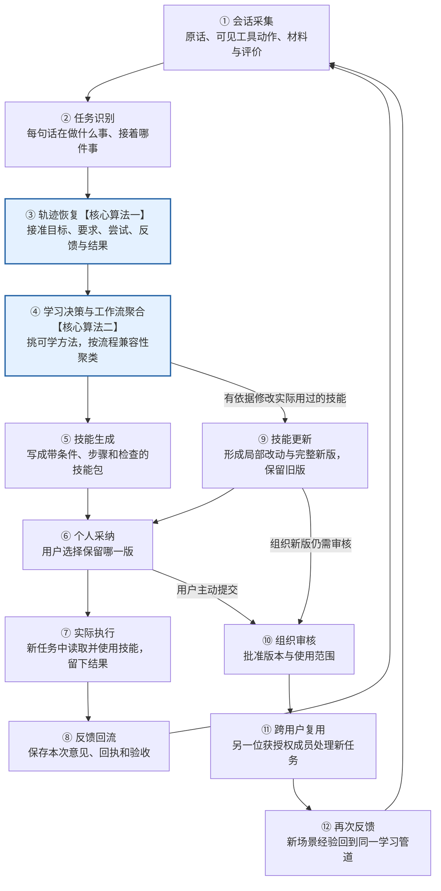

# 我们的算法怎样从会话学到可复用技能

日期：2026-10-05。面向团队的算法说明，结合最新 τ²-bench 审计；本轮没有改代码或运行新实验。

**我们的主线是：先把分散在会话里的每件事接起来，弄清要求、操作、反馈和结果之间的关系；再把可以共用的做法合起来，保留适用条件和完成检查，封装成技能。使用后的新经历，继续走同一条学习链路。**

两个核心算法分别解决两件事：**轨迹恢复负责把一件事理解清楚；工作流聚合负责从多件事中学出可复用的办法。** 十二阶段仍按既定契约运行，不把每个工程环节都包装成独立算法贡献。

## 一、这次实验和新洞察给我们的启发

最新结果来自 **AutoSkill 强基线，不是我们算法的成绩**：零售、航空各提高5个百分点，电信下降5个百分点，三域变化都尚未达到统计显著。我们应根据具体过程定位问题，不能只看到失败就推断“技能生成错了”。[实验报告](2026-10-05_tau_remote_results_analysis.md)

| 实际发现 | 对我们算法设计的启发 |
| --- | --- |
| 电信学习输入省略了866次用户侧工具调用的结构，部分返回却仍然存在。 | 保留“客服指导—用户实际操作—设备返回”的对应关系。不能把用户操作手机写成客服已经操作，也不能只凭一句“好了”补造动作。这个损失属于本实验的输入适配，不能归为AutoSkill作者算法的固有缺陷。 |
| 账户允许漫游，手机漫游却没打开；技能已经写了正确规则，Agent仍然漏做。 | 恢复时区分操作对象和状态层级，聚合时保留依赖与复查；使用时另查有没有实际执行。重复生成相同规则未必解决消费者漏步。 |
| 航空改票工具成功，用户也认可，但选了216的方案，漏掉可见的207方案。 | 把“完成改票”与“满足最便宜要求”分开。要求必须连接到候选比较和实际选择，不能被工具成功或用户感谢替代。不能把207这个实例价格记成通用规则。 |
| 转人工在部分电信题是必要动作，在恢复上网题却不自动满足目标。 | 成功、失败都要说明针对什么目标、什么标准。聚合时保留有条件的结束分支，不能写成“转人工就算成功”。 |
| 用户进一步指出：失败轨迹里的不当步骤可能被原样总结成推荐流程。 | 保存“发生过什么”还不够，必须决定“应该推荐、需要条件、只能警示，还是仍待验证”。推荐方向要传到最终技能，不能只给整条轨迹贴失败标签。 |
| 电信每题4次都成功的任务从22道降到17道，尽管至少成功一次的覆盖提高。 | 同一类任务的成功与失败经历都要保留并比较。一次成功不能抹去其他失败；比较差异可以提出检查建议，但不能直接证明失败原因。 |

这些启发落在现有的采集、恢复、聚合、使用和反馈中。**不需要为每个现象再增加一套独立算法。** 用户补充的失败经验误学问题，在第四部分单独说明。

## 二、整条管道，一张图看懂

编号沿用十二阶段契约。实际运行有回路：反馈回到前段后，第4阶段决定“新建、更新、支持已有做法或暂缓”；不是每次使用都必须产生新版。没有修改依据时，可以只增加支持记录。[当前契约](../contracts/046_twelve_stage_contract_user_revision.md)

| 阶段 | 输入什么 | 做什么，交出什么 |
| --- | --- | --- |
| 1 会话采集 | 获准会话正文、可见材料、工具记录和评价。 | 整理可回查的用户—助手回合；保留原始位置、工具线索和缺失项。问答对只是整理单位，不代表一条完整任务。 |
| 2 任务识别 | 整理后的回合及背景资料。 | 判断具体目标、继续或返回哪个任务、是否包含多个目标；无任务和不确定内容也有标记。交出任务线索。 |
| 3 轨迹恢复 | 任务线索、原文及可见证据。 | 确认关系，串起跨回合的要求、尝试、反馈、修订与结果。交出每件事的标准轨迹和未决信息。 |
| 4 学习决策与聚合 | 一条或多条轨迹、实际用过的技能版本及学习边界。 | 判断哪些方法可学、哪些可共用，聚类并形成工作流；逐项说明新建、更新、支持或暂缓的理由。 |
| 5 技能生成 | 受支持的工作流与封装规范。 | 交出真实技能包，写明适用条件、输入、步骤、输出、检查、工具依赖及验证状态。 |
| 6 个人采纳 | 完整候选及用户真实选择。 | 记录采纳、拒绝或搁置；采纳后交接可以取回和使用的精确版本。 |
| 7 实际执行 | 新任务、当前要求、获准技能及工具。 | 记录提供和读取的版本、实际动作、交付物和检查；区分读取、遵循与成功。 |
| 8 反馈回流 | 本次执行后出现的新意见和证据。 | 连同已知任务、产物及技能版本线索交回前段；仍需识别反馈针对什么。 |
| 9 技能更新 | 第4阶段选出的增量方法与实际使用的旧版本。 | 交出有依据的局部改动和完整新版候选，保留旧版；由用户重新采纳或提交组织审核。 |
| 10 组织审核 | 用户主动提交的候选及审核权限。 | 留下真实审核决定；批准时明确发布版本和访问范围。聚类不能代替共享授权。 |
| 11 跨用户复用 | 另一获授权成员的新任务与组织版本。 | 独立执行并记录适用性、行为及结果，不能用原成员重复使用冒充。 |
| 12 再次反馈 | 新成员使用后的意见、检查和差异。 | 回到同一恢复与学习管道；组织更新继续经过审核。 |

## 三、算法一：把一件事接准，而不是重新排一遍聊天

### 1. 恢复器要回答六个问题

1. **做什么事？** 目标是什么，处理哪个对象？一句话可能包含两个任务，同一任务也可能隔很多轮才回来。
2. **按什么要求做？** 哪些要求仍有效，哪些被替换？“改成表格”不能抹掉此前“保留编号”的要求。
3. **谁实际做了什么？** 分清助手的计划、自称完成、可见回答和真实工具动作；用户操作与助手操作也要分开。
4. **这次反馈针对什么？** 指向哪次回答、操作或交付物？不是所有后续消息都在评价最近一次回复。
5. **结果证明了什么？** 写入成功、用户喜欢、任务验收通过是不同证据，必须保留各自覆盖的对象和标准。
6. **还缺什么？** 原件未提供、回执没记录、反馈归属不清，都如实留下。恢复关系不能补出不存在的事实。

标准轨迹就是这六个问题的整理结果。失败任务也能得到好的标准化表达；附件缺失或没有验收，不应让整个任务无法学习。所谓高质量整理，是**关系清楚、要求不丢、证据可查、缺口明确**，不是把每条经历都写成成功故事。对准备学习的具体结论，依据还必须足够且可定位；全部标成未知或删除难处理内容，不能算恢复质量提高。完整度、关系正确性和结论支持程度要分别看。

### 2. 模型负责理解，程序负责把关系接稳

**先保留来源。** 程序建立原文和工具证据索引，已有调用编号用于连接调用与返回，不靠“离得最近”硬配。没有编号或存在冲突时，保留未决。

**再让模型提出关系候选。** 模型结合上下文判断任务归属、要求变化、指代、反馈对象与步骤依赖。当前启发式Demo把第2、3阶段的语义提议放在一次结构化请求中；两阶段的责任和输出仍分开，不用固定关键词替代理解。

**程序检查并选出相容的组合。** 当前保留最多8条候选组合，逐步检查真实引用、任务范围、先后顺序和依赖。不能用不存在的工具证明执行，也不能让反馈指向未来结果。接近的候选仍有分歧时，只确认稳定关系，其余保留不确定。模型给的分数只是排序依据，不是可靠概率。

**最后按要求版本、尝试和结果输出轨迹。** 修改交付形式只影响对应维度；本次要求与未来偏好分开。实际尝试及其回执分别保存，不让“谢谢”覆盖工具失败，不让任务总分给每一步自动记成功。

程序能拦住一部分错引用和越范围推断，**不能保证模型所有理解都正确，也不是全局最优搜索**。[已实现算法说明](2026-10-05_two_implemented_algorithms_and_trace2skill.md)

### 3. 真实电信案例：恢复后应该看到什么

以下是上一轮审计的可见过程摘要，不是逐字转录，也不是声称我们算法已经重跑该题。

**任务目标：用户在国外，需要手机恢复上网，并达到本题明确要求的速度／质量。**

| 记录中的信息 | 恢复后的含义 |
| --- | --- |
| 查询发现账户允许漫游。 | 证明账户侧权限已开通，不证明手机侧开关已开启。 |
| 无技能组发现手机漫游关闭，指导用户打开；用户实际操作后有状态证据。 | 串成“客服指引→用户动作→设备状态”的关系；明确这一步由用户完成。 |
| 无技能组继续关闭省流量模式，测速约275Mbps、Excellent，最终通过。 | 保存各步动作及后续验收；整题通过不能证明每一步都是唯一必要原因。 |
| 有技能组没有检查并打开手机漫游，只关闭省流量模式，测速仍无连接，最后转人工。 | 保留漏步与未达目标的过程。不能因账户开通、某次设置成功或已转人工，就认定上网任务完成。 |

这里的关键是恢复出**两种不同对象的状态，以及操作与后续检查之间的关系**。这是理解过程，不是仅在末尾贴一个0或1。

但现有冻结技能本来就有账户／手机漫游区分规则。所以这条案例同时提醒我们：恢复得到正确经验以后，还要检查消费者是否真的遵循；不能把失分一概归因于生成端。

### 4. 为什么这还能处理一个窗口里的多任务

用一个**构造示例**说明：用户先说“站采购方立场审阅协议，保留编号”，中间要求“写一份培训通知”，随后说“回到协议，改成表格”。

恢复器应形成两条任务：协议任务连接前后两段，通知单独成一条。协议的立场、编号要求延续，交付形式改成表格。它不能把培训通知当成协议步骤，也不能因任务中断就忘掉前面的约束。

这正是我们的独立恢复模块要证明的价值。**当前τ²来源已经按任务分好，本身还没有检验自然会话交错恢复。** 电信对象关系和真实企业交错会话是互补问题，不能用前者冒充后者的证据。

## 四、算法二：按“办法能不能共用”聚类，再形成工作流

### 1. 聚类的是局部办法，不是聊天话题

恢复完一条轨迹，模型先找出其中的局部方法：解决什么目标、操作什么对象、按什么顺序做、需要什么条件、输出什么、怎样检查，以及哪些尝试支持它。一条轨迹可以提出多个方法。

例如，“检查手机漫游并复测”是一种局部方法；“比较合规航班组合总价”是另一种。不能因为都属于客服就合并，也不能把所有失败经历聚成一个笼统的失败技能。

### 2. 成功和失败都学，但学法不同

| 原始经历中的内容 | 可以怎样沉淀 |
| --- | --- |
| 有对应验收的成功方法 | 学习其流程与条件，成功结论只覆盖验收实际检查的范围。 |
| 已执行，但没有验收的方法 | 正常形成候选，保留未验证状态；不能强称有效，也不整体删除。 |
| 有具体依据的失败或未达目标 | 保留失败现象和有支持的检查／防范条件；原因不明时不能写成确定根因。 |
| 失败后明确修订，并按同一可比较标准通过 | 学习修订经验；依然不把前后变化直接当作严格因果证明。 |
| 用户明确提出的规则或长期偏好 | 按用户及适用范围保留，不自动成为全组织默认。 |
| 只有承诺、自报操作，没有执行依据 | 作为设想或待确认内容，不扩充已执行能力。 |

因此，一条整体失败的轨迹仍可能贡献可复用方法；一条整体成功的轨迹也可能含不能推广的猜测。**处理单位应细到方法及其支持范围，不能只用整条轨迹的好坏做筛选。**

### 3. 关键补强：不能把失败步骤学成推荐步骤

**用户指出的风险成立：某个动作只是“在历史里出现过”，并不表示“以后应该这样做”。** 特别是工具正常返回、助手声称完成、用户表示感谢，却没有满足政策或任务要求时，按时间顺序照抄动作，会把错误推广到后续任务。

以真实航空任务29的无技能组为例：工具允许直接把目的地改掉，操作确实发生，但公开政策禁止直接改票改变目的地，整题未通过。

| 学习方式 | 会写出什么 | 应怎样处理 |
| --- | --- | --- |
| 只照搬动作 | “目的地改变时，直接调用改票工具替换航段。” | 这是把已观察到的不当做法写成推荐步骤，应拒绝纳入主流程。 |
| 结合目标、政策和结果 | “涉及目的地改变时，不使用政策禁止的直接改票路径。” | 写成有条件的禁止做法／失败警示，保留政策依据。 |
| 提出替代方案 | “可考虑取消后重订。” | 还要核对取消政策、用户确认及当前工具能力；有合法规则或实际修订证据才支持相应流程，不能从失败自动推出通用成功替代方案。 |

因此，要在两个核心算法里接力做三件事：

1. **恢复时，把动作与要求、政策、反馈和结果接到一起。** 分清“动作真实发生”“技术执行成功”“违反明确要求”“业务目标未达到”。整题0分不能把所有步骤都标错；但工具成功也不能把明显违规的步骤洗成正确方法。
2. **聚合时，明确每个学习单元的用途。** 有依据的方法可推荐；仅在特定条件下合适的方法保留条件；明确不当的动作转成警示；疑似根因和未经执行的替代办法保留为待验证内容。未验证但已执行、没有已知冲突的方法仍正常形成候选，不能冒称成功经验，也不能因此全部删除。
3. **封装时，让用途约束最终步骤。** 推荐动作写入操作流程；失败动作只能在“避免的做法／触发条件／依据”中说明，不能换个说法重新回到编号步骤。同一动作在某条件下失败、另一条件下有效时，必须分条件保留，不能机械地一律禁止。

推荐方向和证据强弱是两件事：一个明确违反公开政策的动作，即使没有独立业务评分，也不能当作未验证好方法照搬；一个没有评分但确实执行、没有已知冲突的方法，仍可保留为候选。不能只等到拿到局部验收标签，才检查是否把错误学反。

**不是每个失败都能找到确定根因。** 一次最终不通过，只能证明当前目标没达成；只有明确政策违反、对应局部验收或足够的修订证据，才支持更具体的判断。不能简单把失败步骤反过来就认定成功，也不能因为错误做法重复出现就把它当高频好经验。

这里建议增加的是阶段3→4→5内部的用途标记和检查，不是新增阶段。**源码核对确认当前确实存在这条风险路径**：只有已绑定、被标为已验证的局部失败才触发强制失败边界检查；这道检查要求方法属于失败保护且条件非空，却不证明保护条件有效。最后封装仍把方法动作和合并后的动作写进操作步骤，没有按推荐、警示或假设分开渲染。因此，错误动作即使带一条条件，仍可能被输出成可采用的步骤。[失败检查](../../enginering/demo/skilldemo/relational_workflow.py)／[技能组装](../../enginering/demo/skilldemo/creator.py)

这说明**现有保护还不够，下一轮应优先修正**；它不是本轮新运行发现某个技能已经发生污染的实证。原文有出处、条件不为空、封装能通过，都不能证明学习方向正确。

### 4. 具体怎样合并

模型对流程两两提出判断：能共用核心、有条件才能共用、不兼容或信息不足。程序从单个流程开始，逐步合并，必须同时满足：

- **学习边界相容。** 来源用途、所有者及权限边界一致；更新同一技能时，还必须对应实际使用的同一精确版本。
- **整个组都相容。** 甲与乙能合并、乙与丙能合并，不代表三者能合并；甲与丙也必须检查。没有明确兼容依据，就不合并。
- **要求和依赖不冲突。** 文本与表格等差异，只有明确作为可选参数或有条件分支时才能共存；步骤不能形成相互等待的循环。

这就是当前实现的“带整组约束的完全链接式贪心聚类”。简单说，**不能只因为两段很像就凑在一起，必须检查凑完以后有没有相互矛盾。** 当前不是词向量相似度聚类，也没有自动学出所有参数；兼容性和参数含义仍依赖模型提议，程序检查不是语义正确性的证明。

### 5. 合并后，如何变成可用办法

同类流程的共用步骤成为主流程；对象、输出要求等可变部分成为明确参数；不同条件下的操作成为分支。重复方法合并，未支持部分排除或暂缓，并保留处置原因。

每个最终步骤都能在私有记录中追溯：从哪条经历来，支持什么范围，依赖什么条件，怎样检查，哪里还不确定。技能包保留可执行的流程与边界，不携带私人会话全文。

例如，根据上面的漫游观察，可以提出一份**待验证的工作流表达**：

> 先确认当前目标是恢复上网；账户漫游权限与手机漫游开关分别检查。需要用户操作的步骤，明确请求用户操作并根据可见回执复查，不能把指导当作已执行。操作后检查网络状态，并按当前任务要求验收。转人工可以是受政策允许的处理分支，但不能自动算作恢复上网成功。

这不是固定“所有电信题都要求Excellent”，也不是写死某个工具名、电话号码或275Mbps。**当前目标、对象状态和完成标准在新任务中重新绑定。** 彩信任务可以复用某些网络检查方法，但不能因此把“恢复上网”与“彩信成功发送”的验收混成同一件事。

单条有价值的方法也能形成候选，不要求出现两次，更不要求用户明确说“满意”。减少重复和无依据能力是我们的目标；不能靠丢掉有效方法来凑更少的技能数量。

## 五、技能生成与自进化怎样承接这两个算法

**封装时不再从原聊天自由写一遍。** 第5阶段接收已筛选的工作流，使用现有skill-creator通路生成草稿；当前Demo再由程序按冻结的方法、步骤、条件和范围组装最终 `SKILL.md`，完成相应检查及打包。每一步要保留适用说明，不能只在文末放一句泛泛的免责声明。文件检查和打包通过不等于业务能力已验证。

**使用后的对话继续恢复成轨迹。** 例如用户说“这次只要表格，不要生成文件”，先识别这是当前交付要求；不能自动改成“以后永远禁止文件”。若用户明确说“以后我的同类任务都这样做”，才有长期个人偏好的依据。新反馈必须接到本次实际使用的技能版本和结果，不能仅凭提示词提到了技能就认定确实使用。

**只有有效增量才更新。** 第4阶段判断这次经历是否带来新方法、适用边界或有依据的修订；只是再次支持已有规则，就不强行出新版。确需更新时，第9阶段基于实际用过的旧版本形成局部改动，保留旧内容与回退依据，再交用户采纳。组织版本继续审核，个人偏好不自动扩散给其他成员。

## 六、当前已经做到哪里，哪些仍需要补强

| 能力 | 当前状态 |
| --- | --- |
| 原文来源、工具证据和可缺失评价进入统一输入 | 独立Demo已实现接口及来源检查；不表示所有外部日志已适配。 |
| 模型提出任务／关系，程序约束拼接；按维度和范围维护要求 | 已实现启发式原型及功能检查；语义准确率、恢复完整度与泛化尚未独立证明。 |
| 方法支持判断、两两兼容及整组检查、工作流来源传递 | 已实现原型；合并质量、有效技能保留和无效技能减少尚未证明。 |
| 防止失败动作变成推荐动作 | 已有方法级失败边界与非空条件检查；最终动作仍进入执行步骤，缺逐条款用途保护。源码确认存在风险路径，尚未修改；不能宣称风险已全部消除。 |
| 正式技能封装、个人使用与精确版本更新 | 通路已有实现；最近真实验收完成1—8，保存的真实回复回放得到新版，实时更新续验仍超时。不能写成全新真实1—9已全部通过；组织后段目前是模拟功能验收。 |
| 用户与助手双方工具动作完整保存、明确行动方 | **仍需补强。** 当前采集自动展开助手工具调用，用户调用尚未完整进入后续工具证据目录；不能声称已经保真恢复双方动作。 |
| 根据实际动作检查消费者有没有遵循关键条件 | 已有读取访问证据及记录，但完整执行语义检查尚不能保证。漫游漏步应作为优先诊断案例。 |
| 接入τ²并证明涨分、稳定性和资源优势 | **尚未完成。** 本次拉取的三域仍是AutoSkill基线，没有加入我们的恢复与聚合算法；也没有启动微调或强化学习。 |

这轮发现对应的下一步，建议按顺序做三件事：

1. **先把输入保真补齐。** 接入用户侧调用、行动方、完整返回及获准评价，逐条核对来源；真实缺失仍保持未知。
2. **再核对关系及学习方向。** 优先看账户／设备对象、任务要求与实际选择、反馈对象和验收范围；明确不当动作必须成为警示，不能进入推荐步骤。对交错会话另验任务返回与要求延续；不能以文件格式通过代替理解正确。
3. **最后判断技能是否改变行为和成绩。** 每个对照只改变一个因素：检验恢复时固定聚合和消费者，检验聚合时固定恢复和消费者；补全输入的收益单独比较。已经看过的测试题只用于诊断，不拿来反复选新版后宣称独立测试提升。

资源上继续优先来源索引、缓存、批量语义提议和程序检查，避免重复读同一份材料。但更多证据可能增加输入长度，生成和实际使用也需要模型；**总调用不增加、总成本下降目前是目标，不是已测结论。**

## 七、论文里我们真正要主张什么

我们的贡献候选应是：**面向可复用技能学习的轨迹关系恢复，并让恢复出的目标、要求、动作、反馈与结果范围约束后续工作流聚合和技能条款。**

这比“给聊天加一个成败标签”更具体：反馈必须接到正确任务和尝试，账户与设备不能混，临时要求不能变成永久规则，失败路径不能被包装成成功能力；这些关系还必须影响哪些方法合并、哪些条款纳入以及如何检查完成。

Trace2Skill已有成功／失败分析、修订验证和多来源归纳，不能把这些单独说成我们的首次创新。我们重点处理混合会话的上游恢复，以及不完整、冲突证据怎样带着范围进入技能学习。[Trace2Skill原文](https://arxiv.org/html/2603.25158v5#S2)

**补全输入带来的收益与关系算法带来的收益要分开。** 新方法若获得额外评价或完整用户工具日志，比较方法也应获得相同信息；否则只能证明“信息更多有帮助”。最终需要证明的是：在相同可见信息下，关系理解更准确，形成的技能更适合新任务，并且没有用显著增加资源或牺牲有效能力换取表面精简。

本轮无新增效果实证；以上案例来自已完成审计，新增源码核对只说明实现边界，补强方向属于研究建议。完整闭环、原型检查和论文效果是三个不同层面的证据。
