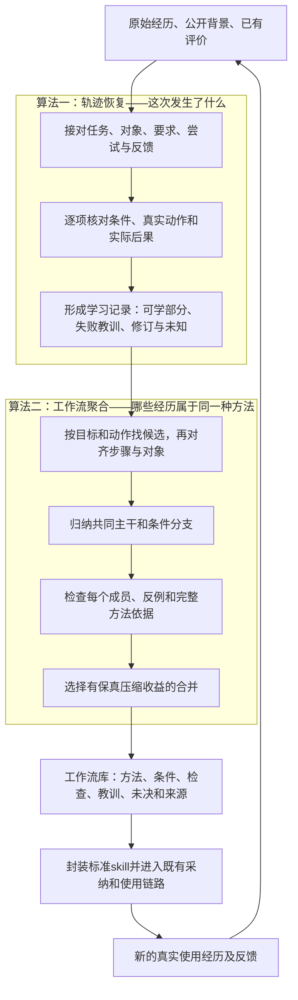

# SkillsLoop研究报告：实验结果、AutoSkill瓶颈与我们的算法路线

日期：2026-10-05。用途：供团队统一理解当前证据、研究问题和技术方案。

本文汇总已经保存并复核的实验，不是新一轮实验结果。正式成绩来自远端提交 `14f5b59ab29351973429777fb013afafd15297ce` 的本地快照，包含零售148 v4、航空267 v1、电信268 v1。**这些是AutoSkill基线成绩，尚未加入我们最新的轨迹恢复和工作流聚合算法。** 实现状态纳入同日新增的直接实验管道验收，详见第9节；文中的“拟采用”“应当”表示目标或待验证行为，案例的建议输出不冒充实际算法运行结果。

## 1．先看结论

当前研究已经有了明确的问题依据，但还没有证明我们的算法能提高基准分数。

- **使用AutoSkill有收益，也有退步。** 零售和航空的成功率各提高5个百分点，电信下降5个百分点；三个领域的统计区间都包含零，目前不能认定存在稳定提升或稳定退步。
- **有缺陷的经历不能整条照学，也不能整条丢掉。** 同一条经历里，可以同时存在有效查询、错误操作、用户改变目标和没有执行依据的完成自述。最终得0分或1分，都不足以决定每一步该怎么学。
- **最直接的生成侧风险已经有产物证据。** 零售来源没有实际完成“撤销取消”“创建新订单”，冻结技能却出现对应能力分支，而固定工具版本不支持这些操作。
- **不是所有失分都由技能生成造成。** 电信某个失败案例中，技能已经写对“账户漫游”和“手机漫游”的区别，Agent执行时仍漏掉手机侧操作。
- **我们的主线应固定为两个算法。** 先恢复“谁在什么条件下做了什么、局部结果怎样”，再跨经历归纳“哪些属于同一种方法、哪些条件必须保留”。最后封装成skill属于输出工程。

最值得检验的研究主张是：**面对交错、不完整、成败混杂的经历，恢复局部关系和评价范围，能否让技能少学错、保留有用经验，并最终改善新任务表现。**

## 2．目前实验到底测了什么

### 2.1 两组比较和评分含义

无技能组由Agent直接处理任务；有技能组使用AutoSkill从演化经历中学得的冻结库，并增加相应技能引用与读取引导。二者比较的是这套技能使用方案的整体效果，不能把全部差异只归因于生成算法。

三域都使用固定的τ²-bench v1.0.1。航空、电信协议明确消费者与模拟用户为deepseek-flash，运行底座为OpenClaw 2026.9.7；各域完整配置保存在原实验协议中。本报告比较各域内部配对结果，不把绝对成绩与其他模型、其他运行配置的排行榜直接比较。

这里“成功”指保存的官方评分为1：

| 领域 | 主要验收什么 | 不足以证明成功的现象 |
|---|---|---|
| 零售 | 最终订单等数据库状态；适用题另有自然语言要求 | 客服宣布办好了，用户说谢谢 |
| 航空 | 最终预订状态及规定需要告知的信息 | 工具接受了写入，但违反业务政策或未满足最低价要求 |
| 电信 | 网络、设备等环境状态；本测试40题中12题另要求指定动作 | 成功关闭一个设置，但网络仍未恢复 |

共100道测试任务：零售40、航空20、电信40。每题每组运行4次，两组总计800场。**这是100道题的重复运行，不是800道相互独立的题。** 本批学习文件来自演化集，正式测试编号与学习输入分开；零售仍有旧批次测试接触和适配历史，不能扩大成整个研究从未接触测试。[协议与案例审计](../reviews/tau_remote_2026-10-05/protocol_and_cases.md)；[三域报告的实验边界](2026-10-05_tau_remote_results_analysis.md)

### 2.2 最重要的结果

| 指标 | 零售 | 航空 | 电信 |
|---|---:|---:|---:|
| 每组运行数 | 160 | 80 | 160 |
| 无技能成功数 | 126 | 54 | 127 |
| AutoSkill成功数 | 134 | 58 | 119 |
| 无技能成功率 | 78.75% | 67.50% | 79.375% |
| AutoSkill成功率 | 83.75% | 72.50% | 74.375% |
| 成功率变化 | **+5个百分点** | **+5个百分点** | **−5个百分点** |
| 同题同轮：有技能胜／负／平 | 20／12／128 | 12／8／60 | 23／31／106 |
| 按任务重采样的95%区间 | −2.50至+12.50个百分点 | −5.00至+13.75个百分点 | −16.25至+5.63个百分点 |

例如零售不是“有技能只多做好8场”：它把20场原先失败变成成功，同时把12场原先成功变成失败，净增8场。后面这12场同样需要解释。

区间跨过零，说明当前样本与波动不足以确认收益方向；这既不等于“已经显著提高”，也不等于“技能没有作用”。区间以每题4次的平均配对差值为单位，进行10,000次任务重采样；相近题目共享实体或模板仍会限制泛化解释。完整复算及辅助检验见[统计审计](../reviews/tau_remote_2026-10-05/statistics_audit.md)，全部指标见[指标CSV](2026-10-05_tau_main_metrics.csv)。

### 2.3 稳定性、时间和学习来源

| 指标 | 零售：无技能→有技能 | 航空：无技能→有技能 | 电信：无技能→有技能 |
|---|---:|---:|---:|
| 同一题4次全部成功 | 22→25题／40题 | 8→10题／20题 | 22→17题／40题 |
| 同一题至少1次成功 | 39→39题／40题 | 17→19题／20题 | 39→40题／40题 |
| 平均每场耗时 | 468.43→600.92秒 | 835.61→848.33秒 | 749.37→776.23秒 |
| 耗时变化 | +28.3% | +1.5% | +3.6% |

电信尤其值得注意：至少能做成一次的题多了一道，但每次都能做成的题少了五道。**覆盖到更多题，不等于执行更稳定。** 耗时包含模型、模拟用户及服务等待，不能直接换算为企业员工工时。

| 学习和使用情况 | 零售 | 航空 | 电信 |
|---|---:|---:|---:|
| 演化采集经历 | 70条 | 26条 | 70条 |
| 采集时通过官方评分 | 5条 | 19条 | 53条 |
| 冻结技能数 | 3 | 1 | 1 |
| 配套参考文件数 | 27 | 0 | 29 |
| 原正式报告的技能读取触发率 | 159/160 | 80/80 | 160/160 |

零售其余65条中，50条正常结束但未通过，15条为超时或错误过多等异常结束，缺少正常评分分解。不能把这15条都解释成同一种业务失败。采集发生在AutoSkill学习之前，低采集成功率也不是AutoSkill造成的。

读取触发只表示日志中命中读取路径、调用或相关返回，**不代表全文已交付、全部参考文件已读完，更不代表执行时遵循了规则**。航空、电信快照缺少可独立复核的原生读取数据库。全流程模型用量和费用也未齐全，因此目前不能报告总成本下降或每成功任务成本。[资源与读取审计](../reviews/tau_remote_2026-10-05/resources_and_read_audit.md)

## 3．用真实案例看清楚瓶颈

### 3.1 task0：工具失败，助手却宣布完成，用户表示感谢

用户想在同一订单中更换两件商品。保存记录中唯一的换货调用返回“商品不存在”；后面助手声称核查、重试并完成，用户表示感谢，但没有后续查询或换货调用支持。最终官方评分为0。

这说明**执行结果、助手自述、用户态度是三种不同证据**。用户认可可能只是信任了回复，没有看到后台状态。因此不能仅归因为“用户模型太差”，也不能把感谢当成业务验收。

这个案例证明了学习来源存在冲突，尚不能证明AutoSkill把该错误学进了技能。事实上，冻结库里已有“工具成功后再报告完成”的要求。恢复器应保存失败尝试及其回执，把完成自述另列，并标记没有后续执行证据；不能替它补出一段成功重试。[task0原始学习文本](../experiments/148_tau2_retail_autoskill/autoskill_input/trajectories/task_0.txt)

### 3.2 task50和task96：没有执行的方法，进入了技能能力范围

| 案例 | 原经历实际提供了什么 | 生成产物出现了什么 | 为什么构成问题 |
|---|---|---|---|
| task50：撤销取消 | 查询身份和账户；助手承诺撤销；没有订单状态读取、撤销调用或回执 | 关联版本新增撤销处理分支，冻结条款要求执行撤销写入 | 固定工具表不支持撤销取消；有需求和承诺，不等于已有可执行经验 |
| task96：修改失败后转向新单 | 两次地址修改失败；随后实际查询商品；最后自报下单、扣款，没有相应调用 | 关联版本和冻结条款加入新单兜底分支 | 固定工具表不支持创建新订单；查询成功不能支持“已完成新单流程” |

这两例比“原对话看起来有问题”更进一步：有来源关联、版本预览和冻结条款可以对照。但中间完整抽取响应与全部版本正文不齐，不能声称已经还原每句条款的唯一生成原因，更不能直接归因某个测试失分。

task50还有一个重要反例：其保存总分为1，仍不足以证明“撤销取消”实际执行。**只给整条经历加一个成功标签，不能解决局部误学。** 能力核验应作为各基线共同的基本门禁；我们的研究重点在它之外的局部关系和经验范围。[来源—版本—冻结条款审计](../reviews/autoskill_148_readonly/case_review.md)；[详细瓶颈报告](2026-10-04_148_autoskill_bottlenecks_explained.md)

### 3.3 航空正例：技能可能帮助Agent选择合规方法

同一任务、同一轮种子，用户要求把目的地从LGA换成JFK。无技能组直接修改航段，工具虽然接受写入，但政策不允许直接改变目的地，最终失败；有技能组解释限制，取得确认后实际取消旧票并创建新票，最终通过。

这与冻结技能中的取消重订建议一致，说明技能可能承载有用流程。但两组都能看到政策，单个配对不能证明就是某句技能导致差异。[航空task29配对证据](../reviews/tau_remote_2026-10-05/protocol_and_cases.md)

### 3.4 航空反例：操作执行成功，仍未满足用户目标

另一道任务要求选择最便宜的普通经济舱。有技能组看到了207和216两个可选方案，却选择216并称其最便宜；写入成功，用户也表示满意，最终仍未通过。无技能组选择207并通过。

这里不能只判断“有没有调用、工具是否成功”。还要判断**实际选择是否满足这次要求**。对最低价，应核对符合约束的候选集合及比较范围；对合同任务，则可能要逐项核对立场、保留条款和交付格式。具体检查随任务变化，评价必须绑定对应要求。[航空task16配对证据](../reviews/tau_remote_2026-10-05/protocol_and_cases.md)

### 3.5 电信反例：技能已有正确规则，消费者仍漏执行

用户在国外无法上网。无技能组区分“账户已允许漫游”和“手机未打开漫游”，指导用户实际打开手机漫游、关闭节流，最后测速275Mbps并通过。有技能组只处理节流，测速仍无连接，随后转人工，未通过本题验收。

冻结技能已经明确写了手机漫游需要单独核对。因此本例首先支持**使用阶段漏检查、漏执行**，不能说“生成器没有学到漫游规则”。关闭节流本身也确实做到了，不能因为整体失败就把这一步列为错误方法。

另外，旧数据转换器遗漏了70条电信采集中866次用户侧工具调用的结构信息，虽然相关返回和部分文字还在。这属于我们的实验适配缺口，会削弱“谁做了什么”的明确关系；尚无单项对照证明它造成了上述失败或整体−5个百分点。[电信配对及适配审计](../reviews/tau_remote_2026-10-05/protocol_and_cases.md)

## 4．我们真正需要解决哪几个问题

AutoSkill已有提取、维护、合并、版本管理和复用能力。其论文主要讨论从用户交互提炼稳定要求；本次实验使用的是代码中的离线轨迹学习入口，不能把两种输入设置混为一谈。[AutoSkill论文](https://arxiv.org/html/2603.01145v2)

固定版本的离线提示也要求检查工具错误、重试及可复用性，并允许不提取候选。因此“AutoSkill完全不看失败”“见到谢谢就学习”都不准确。更有证据支持的问题是：**本次链路仍未可靠地把局部条件、实际执行与评价范围，一直保留到最终技能条款。**[固定版本轨迹提示](https://raw.githubusercontent.com/ECNU-ICALK/AutoSkill/94c47ca488d4ba4117d20272e66d49b9877e68cf/autoskill/offline/trajectory/prompts.py)

| 问题 | 现有证据及归属 | 对我们方法的要求 |
|---|---|---|
| 评价信号不同，容易混成一个“成功” | task0为来源冲突；验收总分未进入当前学习文本 | 区分需求确认、满意、工具结果、交付检查，并恢复各自评价对象 |
| 整条成败不能代表每个局部 | task50总分1但无撤销执行；task96总分0但查询真实有效 | 局部判断，既不全盘鼓励，也不全盘丢弃 |
| 承诺或未核实方法进入能力范围 | task50/96有版本与冻结条款证据 | 推荐方法须有能力、动作／规范及适用条件支持 |
| 同一对话中的目标和要求会变化 | task96从修改旧单转向新目标，纽约要求仍有效 | 恢复目标变化、要求继承、对象身份及失败修订关系 |
| 跨经历合并可能扩大规则 | 撤销／新单分支提示范围扩张；聚合误差的总体比例尚未统计 | 合并时保留条件、反例和完整方法依据，不能按主题直接总结 |
| 有技能仍可能做错 | 电信已有规则却漏执行；航空最低价未满足 | 单独核验消费者，不能把生成改好等同于得分必涨 |

当前基准输入已经按任务分好，未检验一个窗口中“任务甲→任务乙→回到甲”的独立任务交错。因此，**已有结果能支撑局部关系和误学问题的研究动机，尚不能证明我们的多任务恢复能力。** 航空仅生成一个技能也不是质量差的充分证据；技能少可能是有效聚合，也可能遗漏方法，要看内容及实际复用。

## 5．我们的总体方法：先理解经历，再归纳方法

建议方法描述为：**面向技能学习的条件与证据约束轨迹恢复，以及工作流聚合。** 暂不把名称当作已验证创新。

输入仍是 \(X=(E,C,V)\)，用人话解释如下：

| 输入 | 装什么 | 例子 |
|---|---|---|
| 原始经历E | 用户和助手消息、双方实际动作、工具回执、可见产物及顺序 | 用户要求纽约地址；修改工具返回不允许；助手声称已下单 |
| 允许使用的背景C | 工具能力、业务政策、任务上下文和已有技能版本 | 哪些订单状态允许修改；当前没有创建订单工具 |
| 有范围的评价V | 对具体任务、尝试、产物或要求的检查，允许稀疏、缺失、冲突 | 某次修改失败；某份文档编号检查通过；整题最终未通过 |

V不是给每句话塞一个分数。整题得分不能自动传播成每一步正确与否；隐藏标准答案、期望动作和测试状态也不能自动进入学习输入。若给我们增加演化反馈，对照方法应获得同样的信息。



这两个算法对应原十二阶段中的任务识别／轨迹恢复、学习决策与聚合；不改变个人采纳、组织审核和跨用户复用的授权边界。当前轻量入口可只输入E/C/V并输出技能候选，不依赖多用户系统。

## 6．算法一：轨迹恢复具体怎么做

以下解释目标算法及当前实现。新离线入口已落实关系候选、约束拼接、局部标准范围保护，以及程序步骤映射和压缩聚合。程序验证来源、范围和结构约束；模型提出的语义标签、隐含条件及局部覆盖仍需独立核验，**当前不把输出认证为黄金轨迹**。第9节区分构造检查、真实样例和正式效果。

### 6.1 接对关系

程序先利用消息编号、调用与返回、对象编号、产物版本形成可靠骨架；模型提出“刚才那个指谁”“这条评价针对哪个版本”等语义候选，程序通过有界搜索选择相容解释。当前原型使用宽度8的束搜索，随后核对局部方法中的真实调用、行动方、原评价目标和标准。

例如task96，纽约地址要求在用户转向新目标后仍然有效；账户里的洛杉矶默认地址不是用户的新指令。两次失败修改是两个真实尝试，不能压成一次成功操作。程序检查引用和一致性，但不删除实际发生的错误行为来制造整齐轨迹。

### 6.2 逐项核对，避免“局部对了，所以整段都对”

每个有学习意义的局部都回答：**想做什么，做之前需要什么，实际输入了什么，返回了什么，满足哪项要求，还缺什么依据。**

| task96中的局部 | 应有判断 | 学习用途 |
|---|---|---|
| 找到用户并读取账户 | 有实际调用与回执 | 保留查询方法 |
| 对非待处理订单修改地址 | 回执明确拒绝本次修改 | 保留接口状态限制和本次失败，不推广成所有订单不可改 |
| 查询并选出绿色、有库存商品 | 颜色、库存有局部依据；最低价仍需完整范围核对 | 保留查询与筛选材料，不认证全部选品目标已满足 |
| 助手声称将使用默认洛杉矶地址 | 这项意向与仍有效的纽约要求冲突；没有实际下单支持 | 形成范围明确的教训，不虚构已经写入的地址 |
| 声称已下单、已扣款 | 没有对应执行证据，当前工具也不支持新单 | 保留自述事实，禁止当作已执行成功方法 |

判断至少区分满足、违反、未知、证据冲突、不适用。反馈必须对应同一对象、要求和版本。程序能做字段、集合、版本和依赖检查；自然语言覆盖仍需模型提议及独立核验，不能声称“带了证据ID就保证正确”。

### 6.3 留下能解释经验的完整片段

从拟学习的目标和结果向前追溯，找齐相关输入、要求、动作、失败与修订；无关寒暄不进入该片段，独立任务另存，关系尚未接上的事件保留未决。

输出两份互相引用的视图：**真实发生的历史**和**可供学习的经验**。不能把第一次的前半段、第二次的后半段拼成一条从未执行过的“完美成功”。如果后面真的修复，要有新动作和对应复查；没有新执行就仍是建议。

所谓“黄金轨迹”，就是：**一份经过核验、可以拿来教下一个Agent的案例，能说清哪一步可以学、什么条件下可以学、哪里不能照学、哪些还不知道。** 资格须相对于预先声明的学习目标、范围和核验协议，由独立依据核验关键关系与局部判断；局部通过不能让其余部分继承资格。它不是任务满分的别名，也不是算法输出文件的默认资格。失败经历可以提供黄金局部；未知经历也照常进入候选处理，不因没有用户说“完成”就被丢弃。[完整恢复设计](2026-10-05_case_driven_trajectory_recovery_design.md)

## 7．算法二：工作流如何聚合、如何聚类

聚类单位是**有明确子目标、必要输入和动作依赖的局部方法**。不是一条会话，也不是孤立的“查询”“确认”。task96能分别贡献账户查询、商品查询材料和修改失败边界，无须整条只归到一个簇。

### 7.1 先对齐做法，再决定能否合并

用目标、动作和输入输出索引找到候选。当前版本由模型抽取局部方法及语义标签，程序基于标签和结构精确匹配动作、角色、效果，再核对依赖；跨批次同义标签不一致时仍可能漏合并，不能称已解决任意语义对齐，也不是一般图匹配的全局最优解。

“读订单甲→修改订单甲地址”与“读订单乙→修改订单乙地址”可以考虑抽象成同一方法；“读账户默认地址”与“读目标订单地址”不能因都包含“地址”就视作同一步。订单号可以成为参数，允许修改的状态、权限和政策条件不能作为无关细节删掉。

### 7.2 合并成共同主干和条件分支

下面是**设计示例，不是已经运行的聚合结果**。A、B、D为构造材料，C来自task96的局部事实。

| 输入材料 | 合并时应怎样处理 |
|---|---|
| A：订单甲满足条件，确认后修改并核验成功 | 提供正向路径 |
| B：订单乙同样处理，只有订单号和地址不同 | 与A对齐，参数化实例值 |
| C：修改非待处理订单被拒绝 | 附到相应方法的失败边界，不另造一个“失败技能” |
| D：查到订单后日志结束 | 保留已知查询部分；不能继承A、B的修改成功 |

期望形成一个“按条件修改订单地址”的方法家族：共同入口是定位同一目标订单并核对条件；允许时确认、修改、核验；不允许时保留限制，不编造没有能力支持的替代下单；D的后续仍未知。

当前程序提取共有步骤，同时完整保留各成员的条件和原路径，未对应的步骤作为成员差异保存。它没有自动证明条件是必要的，也没有把不同成员重新组合成已经成功的新路径；上面更自然的业务分支是否归纳正确，仍需语义核验。

### 7.3 合并必须经得起每个成员和反例检查

每条成员都要能忠实对应到合并后的流程，条件、依赖、结果范围和缺口不能消失。不能因为A像B、B像C，就把三条随意合成一个宽泛技能；也不机械要求不同合法分支两两完全相同。

失败和成功可以在同一家族中，但不能相互改变身份。同条件下出现可信反例时，应限制对应推荐或保留冲突，不能多数投票抹掉失败。多个局部步骤分别出现过，也不等于它们拼出的整条路径已经执行成功。

### 7.4 用保真压缩选择合并，而不是规定必须生成几个技能

先通过上述检查，再比较：

> 合并收益＝分别保存两组方法所需的结构量−保存共同主干、分支和各成员差异所需的结构量。

每轮选择收益最大的正收益合并，没有收益就停止。计算结构量时固定动作、条件、分支、依赖和残余的编码，不能以模型润色后少了多少字判断；不能通过删掉反例、未知或稀有方法获得高分。这是借鉴最小描述长度思想的启发式，新离线入口已实现固定符号计数和正收益合并；它不是完整概率MDL模型，也尚无真实多轨迹效果证明。[MDL研究依据](https://arxiv.org/abs/math/0406077)；[当前聚合实现说明](2026-10-05_direct_experiment_pipeline_implementation.md)

**减少的应该是重复方法和无依据推荐，不是所有低频经验。** 一次出现但有明确价值的方法可以独立保留。新实例复用原有家族，新失败限制对应分支；已经使用过某个skill的经历，仍按实际使用记录回到对应版本更新。[完整聚合设计](2026-10-05_workflow_aggregation_heuristic_design.md)

## 8．与已有方法的区别和创新边界

| 方法 | 已有机制 | 我们拟检验的差异 |
|---|---|---|
| [AutoSkill](https://arxiv.org/html/2603.01145v2) | 提取可复用技能，检索、维护和版本合并 | 显式恢复局部关系与评价范围，并让它们约束最终条款；本次对照须以实际离线入口为准 |
| [Trace2Skill](https://arxiv.org/html/2603.25158v5#S2) | 成功／失败分别分析，失败侧检查产物、验证修复，再层次合并经验补丁 | 面向更早一层：混合经历先恢复出可靠的分析对象；单条经历内部按条件和证据决定什么可学 |
| [SkillGLoW](https://arxiv.org/html/2609.02217v1#S3) | 对比真实尝试，按做法聚为方法家族，压缩后通过执行反馈筛选 | 用恢复出的对象、依赖、评价范围和反例直接限制步骤对齐、分支和完整方法的推广 |

因此，成功失败分析、方法聚类、图表示、压缩以及生成SKILL.md，都不能单独宣布原创。也不能把Trace2Skill描述成只会总结成功轨迹。

我们可能形成的贡献是两者连接的具体机制：**恢复出来的关系不是一份附加解释，而是会改变哪些步骤被推荐、哪些条件必须留下、哪些经历可以合并、哪些分支必须降为待验证。**

这个主张可以直接被检验：改正一条评价的归属，应改变直接覆盖局部及有依据的相关依赖，不误伤无关局部，影响范围应可追溯；加入可信反例，应限制相应推荐；加入同方法的新实例，应增强原方法而非机械多生一个技能。当前已有局部保护和构造合并检查，真实材料上的准确率与覆盖仍待评估，最后还要看同一个消费者能否在新任务上获益；尚未完成足以宣称独有性的全面检索。

## 9．当前Demo实现到哪里，哪些仍是方案

写作期间共享目录新增了直接实验管道的实现和验收记录，本节已据此更新。**现在可以交付实验可读取的冻结技能库，但尚无新算法的下游评分结果。**

| 项目 | 已有状态 | 尚未证明或未实现 |
|---|---|---|
| 原始经历到技能库 | E/C/V→恢复与局部核对→跨批方法池聚合→标准封装→冻结清单已接通 | 文件可接入不等于技能有业务价值 |
| 局部理解保护 | 保留真实双方动作、原评价目标与标准；整题评价不广播；已知反证和失败依赖影响相关推荐 | 模型仍可能漏掉自述、隐含要求或语义关系，不能保证所有错误都已拦截 |
| 工作流聚合 | 程序计算步骤／角色／效果／依赖映射，保留全成员条件路径，按正压缩收益合并；所有批次统一归池 | 依赖上游语义标签，可能漏合并；不是全局最优，也未证明真实聚类质量 |
| 构造验收 | 最新实现报告记录416项免费检查通过；保存的聚合账本显示3方法跨2批合成1技能，发生2次程序合并 | 语义响应人工构造，共有步骤只有一个，不代表模型已在真实材料上正确归纳复杂流程 |
| 真实task50 | 20事件、2实际调用→1任务、2局部方法、2查询候选技能；官方封装及冻结通过 | 本例0次合并；两个基础查询技能粒度较细，价值和完整经验保留率未测 |
| 资源与复用 | 每批通常2次语义请求，聚合／封装零模型请求；冻结复入0新调用 | 该轮共4次真实请求，其中1次超时用量未知，其余已知合计100,549 tokens；费用和总成本收益未证 |
| 正式效果和训练 | AutoSkill三域基线已具备 | 新R/W无对应τ²成绩，无SFT或强化学习结果 |

真实task50只生成了“按姓名和邮编查用户ID”“按用户ID读取详情和订单列表”两个候选，**没有把无执行凭据的撤销承诺变成撤销能力**。这是与研究问题直接相关的样例进展；但不能由一个案例推断错误技能已普遍减少。最终使用保存的真实恢复回复加一次新的局部抽取请求，不是最终版本从零开始的独立复跑；失败目录和完整请求账保留。[最新实现与验收报告](2026-10-05_direct_experiment_pipeline_implementation.md)；[直接使用说明](../../enginering/demo/DIRECT_PIPELINE_README.md)

旧轻量案例的343项检查、三个单例簇及局部范围偏宽等负结果仍保留。新实现对相关保护补了反例检查，不等于一般语义问题已全部解决；旧轮6次请求／104,899个已知tokens与本次4请求属于不同验收轮次，不能相互替换。[历史轻量验收](2026-10-05_light_ecv_skill_pipeline.md)

整个十二阶段系统的既有验收也应单独看待：早前真实运行完成过阶段1—8，使用保存回复完成过免费回放更新；全新同版本真实1—9仍未通过，组织后段是构造数据验收。不能用这些功能产物替代算法效果证据。[全管道实现与边界](2026-10-04_heuristic_pipeline_implementation.md)

## 10．下一步最值得做的三件事

**第一，先验证“确实学对”，再扩大实验。** 用少量可逐项核验的材料检查：task96保留查询但不学虚构下单；编号检查只影响编号；账户与设备状态不混淆；插入其他任务后要求和反馈仍能归位。旧测试案例已经看过，只作为诊断材料，不冒充新测试。

**第二，让聚合在真实多轨迹上发生并做对。** 输入同方法的不同实例、条件不同的合法分支、相关失败和缺失记录，检查共同步骤是否合并、条件与未知是否保留。当前构造材料已完成合并，真实task50仍是两个未合并的基础查询候选，还不足以证明聚类价值。

**第三，在公平条件下检验新任务收益。** 固定消费Agent、公开背景、演化反馈和可比资源，分别加入恢复、聚合及二者组合，与AutoSkill等强基线比较。额外给结果标签或修复数据适配带来的收益应单列；不能混称算法收益。新的正式测试需与机制开发隔离。

最小证据链只需围绕三件事组织：**误学是否减少且正确经验保留 → 重复是否减少且方法边界保留 → 新任务成功率、稳定性和总成本怎样变化。** 不靠生成技能数量或读取率证明优势。

之后再训练模型：先用核验样本微调关系恢复，再以“接对关系、判对局部经验、保留条件与覆盖”为奖励优化。下游生成和消费先固定；不能奖励全标未知，也不能用整题1分把所有步骤标对。工作流对齐与合并可随后单独训练。[已有微调与强化学习方案](2026-10-04_trajectory_model_sft_and_rl_plan.md)

## 11．结论与证据入口

当前实验给出的主要启示是：**技能学习不能只学习发生过的流程，还要理解流程中的条件、局部结果和失败边界。** 同时，正确技能是否被执行，是另一层必须测量的问题。

我们的技术目标已经收敛：恢复可核验的局部经历，再聚合有条件、有依据的可复用方法。减少无效技能、保留有效经验、提高新任务表现并控制成本，仍是待验证目标，不能写成已有成果。

本轮无新增效果实验；完成的是已有结果、案例和方法的统一梳理。复核入口如下：

- [三域结果详细报告](2026-10-05_tau_remote_results_analysis.md)、[统计审计](../reviews/tau_remote_2026-10-05/statistics_audit.md)、[指标定义](2026-10-05_tau_metrics_dictionary.md)。
- [task0／50／96来源与版本审计](../reviews/autoskill_148_readonly/case_review.md)、[航空／电信配对审计](../reviews/tau_remote_2026-10-05/protocol_and_cases.md)、[读取与资源审计](../reviews/tau_remote_2026-10-05/resources_and_read_audit.md)。
- [轨迹恢复细化设计](2026-10-05_case_driven_trajectory_recovery_design.md)、[聚合细化设计](2026-10-05_workflow_aggregation_heuristic_design.md)、[最新直接管道实现验收](2026-10-05_direct_experiment_pipeline_implementation.md)、[历史轻量实现验收](2026-10-05_light_ecv_skill_pipeline.md)。
- [固定远端快照中的原实验目录](../imports/2026-10-05_tau_remote/repository_complete/research/experiments/)：正式文件为148的`runs/test_v4/`以及267、268的`runs/test/`下各两组结果；历史旧库和部分批次不并入本报告正式成绩。


1、实验管道搭建

CoGym 多轮协作式表格数据分析，agent与agent模拟用户 慢 暂时情况是负面
RecreationBench 250评测题 agent写可运行代码，不同的操作系统复现github应用，视觉评测和代码评测综合分数
τ²-bench Airline Retail telecom

基线选择 autoskills 输入输出和本实验高度契合 论文时间2026年3月 没有验证生成技能有效性

WildChat-1M 

已有结果：

| 指标 | 零售148 v4 | 航空267 v1 | 电信268 v1 |
| --- | ---: | ---: | ---: |
| 每组测试规模 | 40题×4次＝160场 | 20题×4次＝80场 | 40题×4次＝160场 |
| 无技能成功 | 126/160，78.75% | 54/80，67.50% | 127/160，79.375% |
| 有技能成功 | 134/160，83.75% | 58/80，72.50% | 119/160，74.375% |
| 单次成功率变化 | **+5个百分点** | **+5个百分点** | **−5个百分点** |
| 同题同次：改善／退步／持平 | 20／12／128 | 12／8／60 | 23／31／106 |
| 按每题4次均分：改善／退步／持平 | 15／7／18题 | 7／3／10题 | 10／13／17题 |
| 任务级95%收益区间 | −2.50到+12.50个百分点 | −5.00到+13.75个百分点 | −16.25到+5.63个百分点 |
| 辅助配对检验p值 | 0.215 | 0.503 | 0.341 |

问题：
1、skills归并太狠，单个skills太长，貌似触发openclaw对于skills正文的block
2、skills质量上，没有对交付内容的评价，导致经常用户回复结束或者谢谢，直接写出skill（当成成功经验鼓励），实际上是失败的交付

例子：助手说已经下单、扣款，用户感谢。skills直接沉淀，但是记录中没有相应执行调用；该版本工具也不支持创建新订单

用户要求纽约地址，助手却准备使用洛杉矶默认地址默认地址与本次要求发生冲突应成为教训，不能成为默认处理步骤


2、针对性提出“黄金轨迹”，管道pipeline已搭建

输入继续保持：

\[X=(E,C,V)\]

其中，\(E\) 是原始事件，\(C\) 是当时可用的工具、政策和背景，\(V\) 是有明确评价对象的验收信息。

恢复后的轨迹（黄金轨迹）定义为：

\[ \boxed{\mathcal T=(g,\mathcal N,\mathcal R,\mathcal J,\mathcal L,\mathcal U)} \]

| 部分           | 含义           | 具体内容                                   |
| -------------- | -------------- | ------------------------------------------ |
| \(g\)          | 任务及要求     | 目标、对象、要求以及要求的生效版本         |
| \(\mathcal N\) | 局部步骤       | 实际动作、实际产物、计划、完成自述         |
| \(\mathcal R\) | 步骤之间的关系 | 输入依赖、重试、修订、反馈对象、要求替代   |
| \(\mathcal J\) | 局部检查       | 哪个标准检查了哪个步骤，依据和结论是什么   |
| \(\mathcal L\) | 可学习经验     | 可参考做法、失败边界、修订经验、待验证建议 |
| \(\mathcal U\) | 缺口           | 缺失信息、冲突、未决关系，以及阻塞什么结论 |

局部步骤可以表示为：
\[ n_i= (\underbrace{o_i,P_i,x_i}_{\text{对象、前提、输入}}, \underbrace{a_i,y_i,Q_i}_{\text{动作、实际输出、后置事实}}, \underbrace{\tau_i,\rho_i,\sigma_i}_{\text{尝试版本、行动方、来源}}) \]

例如：
步骤：修改订单地址

对象：订单A
所属尝试：第一次修改
有效要求：改为用户指定的新地址
行动方：Agent

前置条件：订单状态必须为 pending
条件依据：当时版本的工具说明

实际输入：订单A、新地址
实际动作：调用修改接口
实际输出：状态不允许，操作被拒绝

来源：原调用记录、对应返回记录


给步骤 \(n_i\) 的某一项检查定义为：

\[ j_{ik}= (\text{检查对象},\text{检查标准},\text{适用版本}, \text{支持证据},\text{反对证据},\text{核验方法},\text{结论}) \]

\[ \operatorname{verdict}(j)\in \{\text{支持},\text{否定},\text{冲突},\text{未知}\} \]


**什么条件下，这份结构才算“黄金”**泛化性的依据

必须先固定两个东西：

- **学习范围 \(\Omega\)**：这份经历要教会什么，例如“查询用户订单”，或者“识别修改接口的状态限制”。
- **核验协议 \(P\)**：用什么判断记录可信，例如调用日志、对应回执、公开规则、产物检查或独立人工核验。

学习范围包含一组事先确定的**必答问题**：

\[ \Omega=(\text{任务或子目标},\text{对象与版本},\mathcal Q_\Omega) \]

例如，学习“本次修改为什么被拒绝”，必答问题包括：

1. 修改的是哪个订单？
2. 当时适用什么状态规则？
3. 实际提交了什么操作？
4. 返回结果是什么？
5. 返回结果是否支持这个拒绝原因？

据此定义：

\[ \boxed{ \operatorname{Gold}_{P}(\mathcal T;\Omega) = \mathbf 1[H\land A\land D\land B\land W] } \]

五个条件必须同时成立：

| 条件                | 判定要求                                             |
| ------------------- | ---------------------------------------------------- |
| \(H\)：历史忠实     | 使用的历史事实都有依据，没有把生成内容写成已发生事件 |
| \(A\)：关联正确     | 对象、任务、要求版本、尝试、动作与反馈接对了         |
| \(D\)：依赖完整     | 支持学习结论的前提、输入、结果、反证及修订没有缺失   |
| \(B\)：必答问题覆盖 | 学习范围内每个必答问题都有经过核验的答案             |
| \(W\)：经验用途正确 | 失败没有变成成功示范，局部证据没有扩大成通用保证     |

其中，最关键的覆盖条件是：

\[ B= \bigwedge_{q\in\mathcal Q_\Omega} \mathbf1[ \operatorname{Verify}_{P}(q,\operatorname{answer}_{\mathcal T}(q),X) =\text{通过} ] \]


\[ z_t=(X_{\le t},\widehat{\mathcal T}_t,\mathcal U_t,\text{剩余预算}) \]

策略为：

\[ a_t\sim\pi_\theta(\cdot\mid z_t) \]

它可以采取的动作包括：

| 动作           | 例子                                             |
| -------------- | ------------------------------------------------ |
| 拆分、关联     | 把插入的通知任务分出去；把迟到反馈接回第一次审查 |
| 判断           | 将修改结果标为未知；将明确拒绝标到对应操作       |
| 检索证据       | 按调用编号找回原回执                             |
| 新增验证       | 在可复现环境里检验一个修复方案，记录成新尝试     |
| 保留未知、结束 | 找不到证据时停止，而不是继续编补                 |

第一版如果只读固定输入，可以让策略一次输出整份结构；不必先建立复杂的多步交互环境。

奖励应当围绕：

\[ \boxed{ R= \alpha F_{\text{关系}} +\beta F_{\text{局部判断}} +\gamma C_{\text{可答覆盖}} +\eta U_{\text{恰当未知}} -\lambda H_{\text{无依据断言}} -\mu D_{\text{关键遗漏}} -\nu\,\text{成本} } \]

人话解释：

- 接对任务、要求、反馈，奖励。
- 正确区分局部成功、失败和未知，奖励。
- 找回确实可以恢复的关键内容，奖励。
- 信息真的不足时如实保留未知，奖励。
- 编造操作、漏掉反证、把总分扩大到每一步，惩罚。
- 所有内容都回答未知，会损失“可答覆盖”得分，不能投机。
- 补证据有成本，避免无限检索和重复验证。

这些分数必须来自独立核验的标签或实际检查，不能让恢复器自己说“我恢复得很好”就获得奖励。过程错误判断需要单独评价，相关思路可参考 [ProcessBench](https://arxiv.org/abs/2412.06559)，但企业轨迹仍需要我们自己的关系和局部标准标签。

训练可从监督微调起步，再用 GRPO 对同一输入采样几份恢复结果，通过上述奖励比较：

\[ A_i= \frac{R_i-\overline R} {\operatorname{std}(R_1,\ldots,R_K)+\epsilon} \]

奖励较高的恢复决策获得更高生成倾向。GRPO机制来自 [DeepSeekMath](https://arxiv.org/html/2402.03300v3#S4)；我们需要研究的部分是**恢复表示、可核验奖励，以及恢复质量如何影响最终技能**。

------

**6．一个具体的“不完整→黄金”过程**

假设原材料缺少修改回执：

```
查到订单 → 发起修改 → [回执缺失] → 助手说成功 → 用户感谢
```

恢复器应当这样处理：

1. **首次整理**：查询有证据；修改确实调用过；修改结果未知；完成自述单列。
2. **识别关键缺口**：学习修改方法必须知道结果，因此不能直接认证。
3. **选择补证据**：按调用编号查询原日志。
4. **获得真实回执**：发现“订单状态不允许，修改被拒绝”。
5. **重新判断**：查询经验保留；本次修改失败；结合当时规则记录状态边界。
6. **核验必答问题**：对象、操作、规则、返回和判断都能回查后，该范围可以认证为黄金经验。

如果第3步查不到回执，就保持修改结果未知。查询片段仍可以单独核验，但不能把整条修改流程认证为黄金。

**训练时也遵循这个区别：隐藏任务标签但保留足够线索，应奖励恢复；删除唯一结果证据且不允许补查，应奖励正确表达未知，不能奖励碰巧猜中隐藏答案。**


| 要求               | 人话解释                                                     |
| ------------------ | ------------------------------------------------------------ |
| **目标清楚**       | 要完成什么？有哪些必须满足的要求？                           |
| **过程真实**       | 实际执行了哪些动作，输入和返回是什么？承诺与自述单独标记。   |
| **关系正确**       | 每一步属于哪个任务？用了哪个前置结果？反馈针对哪次尝试？     |
| **局部判断有依据** | 哪部分做对、哪部分失败、哪部分未知，分别有对应检查；总分不能替代逐步判断。 |
| **条件和修订完整** | 方法什么时候适用？失败后改了什么？有没有证据证明改好了？     |
| **学习边界明确**   | 推荐做法、失败教训、未验证建议分清楚，每条经验能回查依据，不能扩大适用范围。 |
