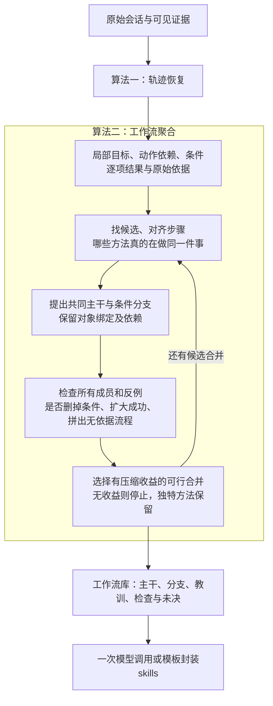

# 第二个核心算法：从恢复后的经历归纳少量可复用工作流

日期：2026-10-05。状态：科研算法设计、文献复核及源码只读审阅；未修改Demo、执行新模型或开展效果实验。

## 1．研究主线固定为两个算法

**轨迹恢复回答：这次究竟发生了什么，哪些局部有用、哪些失败、依据是什么。**

**工作流聚合回答：这些不同经历，哪些可以用同一种方法解决；共同方法是什么，条件不同又该怎样分支。**

Skills封装是上述工作流的输出形式，可以由一次受约束模型调用或模板完成，不作为第三个核心算法贡献。方法选择、分支、经验正误和适用范围必须在聚合阶段已经确定，不能把真正的归纳偷偷留给最后一次写作。现轻量入口实际由程序封装，未额外调用creator模型，亦不影响这个研究定位。

这仍对应既有十二阶段：阶段2／3完成恢复，阶段4完成聚合，阶段5封装。不增加顶层阶段。

建议第二个算法采用：**条件与证据约束的工作流凝聚归纳**。通俗目标是：**把真正相同的方法合起来，把决定成败的不同条件留下来。**

## 2．先说明现代码做到了哪里

本轮核对了源码，不能把下面的加强设计当作已经实现。

| 内容 | 当前实际实现 | 尚需补强 |
|---|---|---|
| 局部方法 | 模型从恢复轨迹提出方法、条件、来源与流程轮廓 | 更细的局部标准覆盖和可对齐动作单元 |
| 兼容判断 | 模型声明共享核心／有条件兼容等关系 | 明确输出步骤与对象角色的对应映射，不能只说相似 |
| 聚类 | 所有跨簇方法对明确兼容才合并，程序再查整簇要求和依赖 | 让有不同合法分支的成员可以通过同一个条件流程表示；不机械要求两两完整相同 |
| 合并次序 | 按遍历顺序选择可合并簇 | 选择有实际去重收益且不丢证据的合并 |
| 输出 | 模型归纳，程序检查方法处置与来源 | 逐分支的支持、反证、未知，以及完整方法的支持依据 |

源码定位：[workflow.py:185](../../enginering/demo/skilldemo/workflow.py#L185)、[relational_workflow.py:478](../../enginering/demo/skilldemo/relational_workflow.py#L478)。当前`sharedSteps`主要检查非空；条件文本非空也不足以证明冲突确已消解。

最新轻量案例三个局部流程形成三个单例簇，没有发生跨流程合并；343项功能检查不能证明聚类有效。[已有验收边界](2026-10-05_light_ecv_skill_pipeline.md#验收中的负结果与质量缺口)

## 3．输入是什么，聚类的到底是什么

接收恢复器的局部记录：**局部目标、对象角色、实际步骤、输入输出、条件与依赖、逐项结果、来源和未知**。不重新从整段聊天猜一遍任务，也不把一段聊天直接当一个聚类样本。

例如task96虽然整任务失败，仍能提供“查用户→读取账户订单列表”和“查产品→获得可选变体”等局部材料；修改失败提供边界；没有调用支持的下单自述不成为实际下单方法。[真实案例与恢复设计](2026-10-05_case_driven_trajectory_recovery_design.md)

一段较长任务可以贡献多个局部方法；每个方法须有明确子目标或中间输出，并带齐必要输入依赖。不能拆成“读取”“确认”“回答”三个泛泛动作后，各自生成技能。共享子流程可被多个方法引用，但不把同一条经历的多次引用计为多份独立支持。

失败片段、已验证片段、未知片段都进入经验池，但用途不同。未知可参与结构对齐，不贡献“验证成功”的票数；同一任务多次重试和导出重复不能膨胀独立支持次数。

## 4．四个具体计算动作



### 动作一：召回候选，然后真正对齐步骤

先用局部目标、工具／动作类型、输入输出类型做索引，找到值得比较的方法。可复用已有向量表示做语义召回；召回只是减少比较量，不决定最终合并。没有同名工具也可提出语义候选，但工具能力差异未经核对时不能合并成同一可执行动作。

对候选方法，模型提出“哪个步骤对应哪个步骤”，程序据以下信息选择相容映射：

- 动作作用于同类对象，执行角色相容。
- 输入／输出以及要改变或核对的属性相容。
- 参数替换前后保持同一对象的身份关系。
- 已确认的前置依赖、要求作用范围和结果范围不被破坏。

例如，“读取订单甲→修改订单甲地址”和“读取订单乙→修改订单乙地址”可以对齐成“读取目标订单→修改同一目标订单地址”。不能把“读取账户默认地址”和“读取目标订单地址”仅因都叫“读取地址”而当成同一步。

实现可先匹配相同工具与明确参数角色，再对剩余步骤用批量语义候选和有界搜索做近似图对齐；不声称求解最大公共子图的全局最优。多处相同动作按对象、尝试及依赖区分，不把真实重试压成一次调用。

程序核验的是给定映射后的结构、对象绑定及可计算约束；“这两段语义等价”“某条件足以消解差异”仍可能只是模型提议。有来源且结构相容不等于语义已认证，独立核验不足时保留合并候选资格，不能由同一模型提议和自评取得可靠推荐资格。

### 动作二：对齐之后提出“主干＋分支”，差异分四类处理

| 差异 | 处理方式 | 例子 |
|---|---|---|
| 只是实例值不同 | 替换为参数，保留绑定 | 两个订单号变成“目标订单”；本次确认的地址变成输入 |
| 条件不同导致处理不同 | 保留带条件的分支 | 允许修改的状态进入修改流程；不允许的状态保留限制 |
| 某方法还有独立子流程 | 保留子流程／局部扩展，核对依赖 | 某些任务额外需要文件交付，不给全部任务强加写文件 |
| 核心目的、操作效果或政策不相容 | 分开；必要时只共用确有价值的子流程 | 修改当前订单地址与修改账户默认地址不能当成同一效果 |

这里的参数化要有依据。订单编号作为接口参数与对象引用，可以合理抽象；政策门槛、状态条件、用户权限不能被当作无关实例信息删掉。只观察到“甲条件＋乙步骤”和“丙条件＋丁步骤”，不能据此允许所有条件与步骤自由交叉组合。

共同主干必须包含与局部目标直接相关的方法或信息转换；只共同包含“问候→确认→回复”不够。相同目标也可能存在不同操作方法，先分别保留；只有入口条件、输出及适用范围能被明确表达，才形成可选路线。

### 动作三：用所有成员、反例和缺口检查这个合并

本轮对旧设计的核心修正是：**检查每个成员能否忠实映射到合并后的条件流程，而不是要求每两条经历都完整匹配。**

这不意味着可以因A像B、B像C就随意合并。合并后的表示仍须逐个解释A、B、C的对象、步骤、依赖、条件和结果；任何一个解释不了，就不接受这个合并。

至少检查以下内容：

| 检查 | 具体阻止的问题 |
|---|---|
| 成员覆盖 | 合并时悄悄删除独特但有用的方法，或把未知材料扔掉 |
| 条件与依赖保留 | 省掉订单状态／用户确认；把两件必须完成的事变成二选一 |
| 结果范围保留 | 某条轨迹的成功把另一条未知补成成功，或编号通过变成整份审阅通过 |
| 反例覆盖 | 明明有非待处理订单修改失败，却写“订单都可以修改” |
| 完整推荐方法有依据 | 前半来自A、后半来自B，未经核验就称整个新组合已成功 |

失败经验以其实际对象、条件和评价维度限制推荐，而非另起一个“失败技能”。有明确工具／政策边界时，可将边界写成入口条件；只有一次失败、原因不明时，只附失败观察和未决原因，不能让模型找一个碰巧区分成败的词充当根因。

若条件看起来相同却同时有成功和失败，保留冲突，检查是否遗漏状态或环境差别；不能让多数成功直接投票抹掉反例。未解决冲突可以留在同一方法家族的研究记录里，但相关分支不能被无条件认证为可靠推荐。

**同一簇可以同时包含成功、失败和未知；三者的身份不能因进簇而改变。**

对完整方法另保留来源见证：它是某条已观察路径的参数化，还是由公开规则／另行核验支持的组合，还是仅有局部依据的新组合候选。图中每条边分别出现过，不等于拼成的整条路径执行过；反过来，只因尚未整段执行过，也不删除具有局部支持的组合候选。

原路径执行过、规则支持某种组合、更换参数后的新实例实际有效，是三个不同判断，不能合并成一个验证标签。

### 动作四：每次选择真正减少重复的合并，不能只求簇少

可行性检查先于精简。通过检查后，计算：

\[
\Delta=\text{分别保存两组方法及成员差异的长度}
-\text{保存共同主干、分支及成员差异的长度}.
\]

每轮接受压缩收益最大的正收益合并，更新受影响候选；没有正收益就停止。这样不必预设最终有几个簇，也不按输入遍历顺序碰到谁就合并。

这是借鉴[最小描述长度原则](https://arxiv.org/abs/math/0406077)的**启发式压缩准则**，不是已实现的严格MDL推断，更不是“越短就越有用”的证明。实现前固定结构编码方式：计算动作、条件、依赖、分支、成员映射和无法共享的残余；相同来源引用在合并前后采用同一计数方法，不按模型润色后的字数评分。编码选择需在开发阶段检查敏感性。

两个相同流程换了订单号，合并通常能省大量重复说明；两个只共享问候、其余全部不同的流程，分支和残余会很大，也不满足有意义核心的要求。不能通过删教训、删未知、删独特方法取得压缩收益。

这一步减少重复候选；不按低频直接删除单例。一次出现但明确有用的特殊方法可以单独保留。尚无适用依据的零散材料继续留在候选池，不伪装成已经验证有效的skill。

## 5．一个完整聚合例子

下表中A、B、D、E是**构造说明材料**；C取自你的task96真实失败片段。它们用于解释计算，不表示已经完成这组聚合实验。

| 材料 | 恢复后交付给聚合器的内容 | 应有处置 |
|---|---|---|
| A：订单甲修改成功 | 定位订单→读状态→确认地址→修改→回执与目标地址核对；状态允许 | 提供一条有条件的正向方法 |
| B：订单乙修改成功 | 方法与A相同，订单号、地址不同 | 和A做实例参数对齐，不另造一个地址修改技能 |
| C：真实task96局部 | 账户查到订单列表→直接尝试修改→非待处理订单不能修改；没有先读取订单状态的调用 | 作为同一方法家族的失败边界；不能补写“已经查了状态” |
| D：日志不完整 | 查到订单后记录结束 | 可以归组其可对齐部分；修改是否发生及结果均未知 |
| E：通知撰写 | 收集通知要素→输出通知 | 方法及产物不同，单独处理 |

一个可接受的示意输出是“订单地址调整”方法家族，另保留通知方法，避免把A—D机械地各生成一个技能。尚未固定编码并计算压缩收益，不保证贪心算法必然得到该分组；D也可以作为关联的未完整成员保留，不要求补齐动作。对于C，这一归组只使用其地址调整局部；商品查询或后面的新目标可以贡献别的方法，不能把整条task96吸进同一个簇。

合并后的方法概要可以这样写：

```text
方法：在当前工具与政策允许的条件下调整目标订单地址。

输入：目标订单、用户这次明确要求的地址、有效确认。

共同可归纳的处理方法：
  定位目标订单，并核对修改条件。

条件允许的分支：
  明确修改内容并确认 → 调用修改 → 核对同一订单的结果是否符合目标地址。
  来源：A、B；不同订单号和地址为输入参数。

条件不允许的边界：
  不能继续推荐该修改接口，也不能声称已经修改完成。
  来源：C的失败回执＋允许使用的工具说明。
  本例没有已验证替代办法，不补造“取消后重新下单”。

未知：
  D只能支持它实际记录到的查询部分，不继承A、B的成功。

保持：
  目标订单始终是同一个对象；默认地址不能自动替代本次要求。
```

“核对修改条件”由A／B的实际方法和工具说明支持；不能反过来改写C的历史，说C已经做过它。C从失败回执提供了适用边界，不证明某个新增补救方案成功。

若另一个领域的接口确实允许其他状态修改，应按工具／政策版本分支或拆开，不能把本例限制传播成所有系统通用规律。

## 6．为什么这是算法，而不是换一个总结提示

程序必须真正计算四个对象：**步骤映射、带条件的方法图、成员／反例能否被忠实容纳、合并压缩收益。** 模型负责提出语义对应和条件候选，不独自决定最后的簇。

```text
输入：恢复后的局部记录集合，以及允许使用的上下文

给每个局部方法建立初始表示；保留经验类型和来源
用目标、动作和输入输出索引产生候选比较

重复：
  对候选簇提出步骤映射和“共同主干＋条件分支”
  逐个检查成员、依赖、条件、局部结果与相关反例
  记录完整路径的观察／组合依据；无依据的组合不得升级验证状态
  对可行合并计算结构描述的节省量
  若无正收益合并：停止
  否则接受收益最大的一个，更新相关候选

输出：方法家族、公共步骤、条件分支、教训、检查、未知和来源映射
```

算法为启发式：候选召回可能漏项，步骤对齐采用有限搜索，合并是贪心，语义候选也可能错误。固定输入、缓存候选、编码和同分处理可复现一次运行，但不宣称对所有批次划分／随机语义输出都不敏感。当前限制在小批次的实现也需跨批次方法索引，否则同一方法可能在多个批次重复产生。

一条记录加入后，只有相关家族需要重新比较；新增失败先影响其命中的方法与条件，不重写整库。已有技能消费经历的更新归属沿用实际使用证据与原授权边界，不另设全库匹配为必经步骤。

## 7．研究依据与候选贡献

| 近邻工作 | 已经做了什么 | 本设计拟检验的进一步机制 |
|---|---|---|
| [AWM §2.3](https://arxiv.org/html/2409.07429v1#S2.SS3) | 归纳可复用子流程，抽象实例参数 | 保留对象身份、条件和局部评价范围，处理失败及未知成员 |
| [Trace2Skill §2.4](https://arxiv.org/html/2603.25158v5#S2) | 从多轨迹补丁分层去重、消解冲突、保留互补经验 | 显式步骤／条件映射决定方法归组，再检查成员与反例怎样限制推广范围 |
| [SkillGLoW §3.3—3.4](https://arxiv.org/html/2609.02217v1#S3) | 多视图表示、共识聚类形成方法家族，压缩适用条件与核心流程，再做执行验收 | 从恢复出的局部依赖和结果范围构建可审查归纳，限制错误分支及未验证组合 |

因此“按方法聚类”“共用核心＋分支”“减少库规模”已有近邻，不能单独宣布创新。候选贡献在两算法的连接：**恢复器发现的对象、条件、评价范围和反例，实际改变工作流的对齐、合并与条款边界。** 图或压缩准则本身也不是全球首次。

最直接的可反驳现象是：只改变一条局部评价的正确归属，某项经验应相应改变用途，其他可靠方法仍保留；加入一个同条件的可信反例，应限制对应推荐；增加真正相同的新实例，应增强同一方法的材料，而非机械增加一个技能。随后再看固定消费者的新任务成功率，不能仅以簇变少宣称有用。

## 8．资源、后续训练与本轮边界

优先复用恢复输出，W每批集中提出方法别名和步骤对应，不逐对调用模型；索引召回、对象匹配、图依赖检查、条件约束、合并排序和出处整理交给程序。语义覆盖不足时保留候选状态，不无限追加调用。包装最多一次受约束调用或模板即可；总token和后续消费成本仍要测，不能用调用次数替代资源账。

以后若训练W模型，应学习“步骤是否对应、参数还是条件、合并还是拆分、分支应保留何种证据”；R与消费者先固定。不能只用技能数量减少作奖励，否则模型会合成一个空泛大技能。压缩只有在方法／条件／反例覆盖满足时才有奖励，并通过独立新任务检查效用。

本轮交付为设计。没有新聚合实验，没有证明无效skills或资源已经减少；特别保留现实现只有单例簇验收的限制。下一步最有价值的是让同一批材料同时包含可合并的独立实例、条件不同的成员、相关失败与未知，检查实际合并发生且边界保留，再讨论规模化运行。
