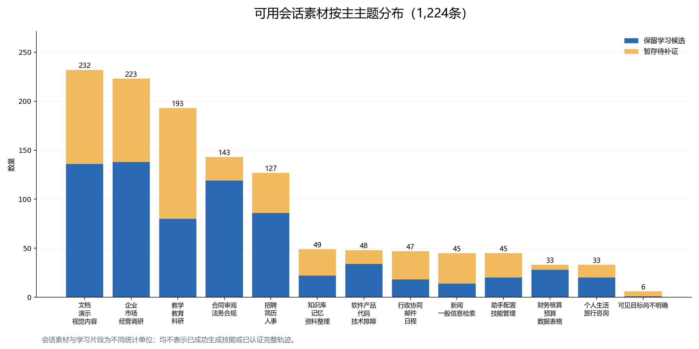
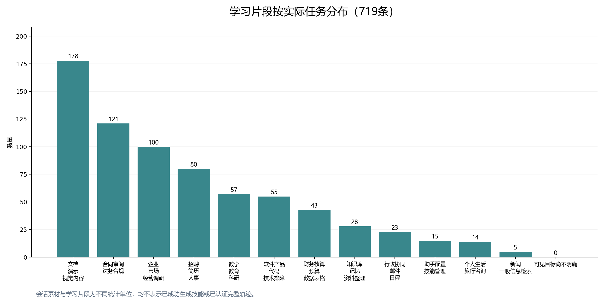

# EvoMind按任务主题组织学习材料：复查与统计

本版纳入 **1,224条真实会话素材**：716条已有学习候选、508条暂存待进一步判断。242条“排除本轮提炼”的会话不进入这个版本，冻结原始归档保留。716条保留会话已有719条局部学习片段，分别按具体任务重新归类。

回答“多少可用轨迹”：现有可供恢复算法处理的会话素材为1,224条，已有可学习线索的局部片段为719条。**完整任务轨迹数量尚未认证，不能用1,224或719代替。** 本版按主题组织的是生成前的学习材料池，没有执行新一轮skills生成。

## 每类多少

|任务主题|可用会话素材|其中保留|其中暂存|具体任务学习片段|
|---|---:|---:|---:|---:|
|文档、演示与视觉内容|232|136|96|178|
|合同审阅与法务合规|143|119|24|121|
|企业、市场与经营调研|223|138|85|100|
|招聘、简历与人事|127|86|41|80|
|教学、教育与科研|193|80|113|57|
|软件产品、代码与技术排障|48|34|14|55|
|财务核算、预算与数据表格|33|28|5|43|
|知识库、记忆与资料整理|49|22|27|28|
|行政协同、邮件与日程|47|18|29|23|
|助手配置与技能管理|45|20|25|15|
|个人生活与旅行咨询|33|20|13|14|
|新闻与一般信息检索|45|14|31|5|
|可见目标尚不明确|6|1|5|0|
|合计|1,224|716|508|719|

两套分类各自计数守恒：一场会话只按一个主主题计入左边；一个学习片段只按一个具体任务主题计入右边。多任务会话的其他主题另存为次主题，不能累加到会话总数。右边可能超过对应主题的保留会话数，因为学习片段可以来自主主题不同的会话，例如招聘会话里也有文档生成故障。

## 复查发现与改动

1. 逐条阅读1,224条会话复查卡：原分类理由、作为依据的用户正文摘录、已有候选任务；会话标题不作为任务真值。另对7条有疑问的会话扩展读取全部有效用户正文。
2. 逐条阅读719条学习片段复查卡：任务描述、方法摘要和来源用户正文摘录。结合上一轮逐条质量画像保存边界；本轮不是全719条全文、专业正确性或时序的独立金标准验收。
3. 调整4条会话主主题，将明确的记账、会计分录及财务税务处理从经营调研转入财务数据类。其余1,220条在本轮可见依据上维持原主主题；保留低确定性及目标不明确状态。
4. 调整129条学习片段主题，解除“学习片段直接继承整场会话主主题”的问题。修改前标签、修改后标签、具体任务及复查范围均写入数据，可逐条回查。余下590条维持原主题。

例子：

|可回查材料|原归类|本次归类|依据与边界|
|---|---|---|---|
|conv_31676d431fb8 会话|经营调研|财务核算|用户明确在记账系统录入股权转让凭证；这不是一般公司研究。PPT、文件查询等保留次主题。|
|学习片段第1条：差旅规则文档核查|技术类会话的主主题|行政协同|局部需求是核查报销规则；没有制度正文时不得把常识费用标准冒充制度原文。|
|学习片段第6条：Python低版本语法兼容|教育类会话的主主题|技术排障|局部方法是检查执行版本与类型注解兼容性。|
|学习片段第85条：PDF水印迭代|教育类会话的主主题|文档处理|可复用的是水印尺寸、角度、遮挡检查；不需要继承论文领域。|
|学习片段第318条：投资TS与激励方案联审|泛文档审查|合同与法务|已有片段围绕资金、控制权及激励约束。但缺原协议，协议性质仅依赖可见对话及既有片段归纳，法律结论仍需核验。|

标签是研究整理判断，不是人审金标准。本轮未产生新增任务成功或skill有效性证据。特别是用户只说“美化一下”的会话仍标目标不明确；助手上下文能提示局部PPT操作，不能反向把原用户需求补造为明确任务。

## 分类规则的人话说明

会话主题用于找材料，片段主题用于找能复用的方法。文档格式转换、图片修复、PPT版式和水印处理归文档类；即使素材是论文或BP，也不自动归科研或经营。论文评审、课程设计、作业评价归教育科研；金融计算、预算、会计凭证及表格核验归财务数据；判断法律权义、合同修订及合规依据归法务。浏览器交互、软件需求、代码、版本或运行依赖排障归技术；技能发现、安装规范、注册配置归助手配置。邮件发送、提醒及差旅行政规则归协同。税务口径咨询与日常财务处理在多任务会话中可同时出现，保留次主题，不能靠一个标签表达全部工作。

主题边界仍有相邻情况，例如生成文档时发生运行依赖错误。这里只给本片段主要学习对象一个主标签，同时保留所在会话的主题及来源。后续workflow聚合不能仅凭标签相同合并：还需比较任务目的、输入、约束、方法和可验收产物。

## 后续每个主题可以生成什么skills

以下是按已见材料提出的候选方向，**不是已经完成的细粒度聚类，也不是生成数量承诺**：

|主题|可先检验的细任务方向|
|---|---|
|法务|多立场保密协议审改；股权与融资文件联审；履约、付款和交割条件同步修订|
|招聘|岗位硬条件筛选；多批简历边界与去重；带证据的面试问题及单人报告|
|文档与视觉|原文保真格式转换；PPT局部修订与可编辑化；图片中文纠错；PDF字体及水印检查|
|经营调研|主体与同名人物核验；投前项目证据核查；售前需求与能力差异；经营材料缺口管理|
|财务数据|三表勾稽；银行流水到凭证；预算多表同步；表格公式及截图数据核验|
|教育科研|论文证据一致性审查；课堂和课程设计；项目评审排名与建议同步|
|技术|HTML原型还原与验收；运行依赖及版本故障隔离；软件需求与发布检查|
|知识整理|知识库增量编译与索引；来源与派生资料分开；个人画像保真与更新|
|行政协同|周期提醒生命周期；邮件账号及附件核查；行政制度缺证处理|
|助手配置|技能包完整性；发现与运行就绪区分；第三方包适配规范|
|生活旅行|固定时间、交通与人员约束下排程；行程修订与视觉交付|
|新闻检索|时效、来源及日期核验；材料量较少，先评估是否值得独立生成|

暂存的508条继续作为恢复、关联核验与补充聚合材料，不能强制为每条产生skill。目标不明确的6条暂不作为独立生成种子，保留用于真实输入和噪声判断。下一步应先在各主题内部恢复具体任务，再按共同方法形成多个workflow，并把无可靠方法支持的材料留在暂存池。

## 数据在哪、如何使用

- [全量检索页](../datasets/evomind/task_topics_20261006/private/index.html)：1,224条，可搜主题、任务和依据，点击编号看全部用户与AI文字。
- [带标注会话正文](../datasets/evomind/task_topics_20261006/private/conversations.jsonl)：一行一条会话，以会话编号为key，保留全部清理后的正文和来源编号；标注实际写入数据，而非只在报告中描述。
- [719条学习片段正文与标注](../datasets/evomind/task_topics_20261006/private/learning_candidates.jsonl)：包含任务、方法、消息正文、实际任务主题及既有质量画像。
- [无研究答案的模型输入](../datasets/evomind/task_topics_20261006/private/model_inputs.jsonl)：同1,224条正文，不含本轮主题、学习方法或人工/AI对应标注，便于后续盲输入算法。
- 按主题目录在 `private/topics/`：每类分别有会话素材与具体任务学习片段。两种文件的划分轴不同，不能假设同目录的片段全部来自该目录会话文件。
- [数值CSV](../datasets/evomind/task_topics_20261006/topic_statistics.csv)、[修改清单](../datasets/evomind/task_topics_20261006/private/annotation_changes.json)、[交付核对](../datasets/evomind/task_topics_20261006/verification.json)。

所有来源正文未改写；保留会话的已接受内容对应和未核候选分开保存。工具、文件、skill证据延用原来源记录和关联编号，没有补造遗失附件或重新认证工具执行。原始展示次序不等于已恢复时序，导出的文字视图不强行配成一问一答。

数据核对通过：数量与主题分区守恒；719片段全部归属于保留会话；1,224条正文与冻结输入逐字一致；新工作集不含排除会话；4项冻结来源哈希保持；片段证据消息编号均存在。柱状图已渲染检查。检索页提供本地静态交互，未完成浏览器逐项实点击验收。没有新模型API调用、技能生成、主动rollout、Demo修改或Git上传。
