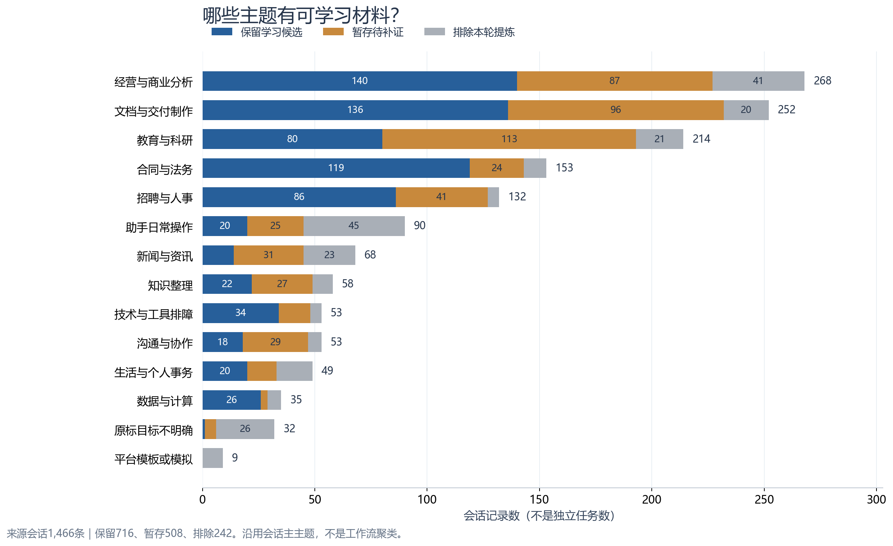
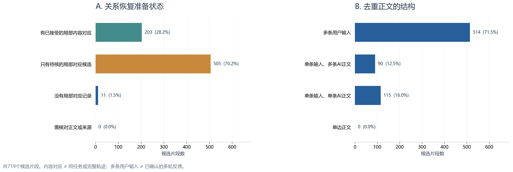
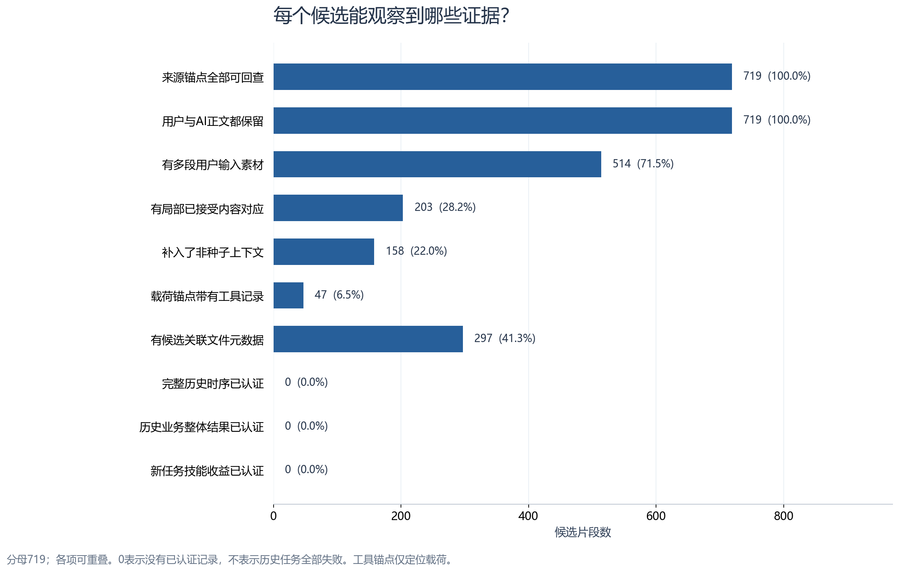

# EvoMind候选轨迹质量与整体数据评估

日期：2026-10-06。承接[证据富化版](2026-10-06_evomind_dataset_enrichment_and_evolution.md)。本轮交付柱状图、719份逐条质量卡和可下载清单。

**整体判断：这批数据已经可以作为真实会话驱动的轨迹恢复、局部方法归纳的研究素材；还不能作为完整成功轨迹集，也不能直接拿来计算技能收益。** 当前主要瓶颈是内容如何关联、哪些要求替代了旧要求、哪些结果对应哪些尝试，而不是缺少可读的对话文字。

入口：[719条逐条质量总览](../datasets/evomind/quality_20261006/private/index.html)／[中文逐条清单](../datasets/evomind/quality_20261006/private/逐条质量清单.csv)／[机器可读画像](../datasets/evomind/quality_20261006/private/quality_assessments.jsonl)。原来1,466条来源会话、暂存和排除内容继续保留，旧筛选与标注没有覆盖。

## 1. 先把“质量”说清楚

现在的719项是从716条会话中选出的**候选片段**，不是719条已经恢复好的完整轨迹。本轮全量盘点来源、对应、结构和执行／文件线索；局部学习判断沿用原筛选，其中37项本轮完整复读候选正文。逐条卡片保留任务、可学习点、原文、限制和复核状态。

| 看什么 | 怎样判断 | 对后续学习有什么用 |
| --- | --- | --- |
| 来源质量 | 所选消息是否能回到原会话、原出现位置；证据引用能否在正文找到 | 避免依据摘要或不存在的内容学习 |
| 关联准备 | 用户与AI正文是否都在；当前窗口有没有已接受的内容对应，还是只有待核候选 | 判断该先核对回复对应，还是继续恢复同任务、反馈和修订关系 |
| 过程材料 | 有多少条不同用户输入、多少条AI正文，是否补入上下文 | 定位可能有要求变化、尝试或修订的材料；数量本身不等于有用 |
| 执行与文件线索 | 工具记录能定位到候选来源消息，还是只在同会话；文件是元数据还是真实字节 | 明确能核查哪里，以及哪些执行／文件结论不能下 |
| 学习与结果范围 | 正文支持哪一个局部方法；哪里仍缺依据；有没有独立结果核验 | 防止把计划、AI保证或局部修复写成完整成功经验 |

没有给任意百分制总分。多轮不一定比单轮好，有工具不一定比没工具好；失败也可能留下可靠的纠错方法。**逐条质量卡回答“可以学哪一部分、目前证据到哪里、还不能证明什么”，不把未知硬判为成功或失败。** 审阅建议见[口径审阅](../datasets/evomind/quality_20261006/rubric_audit.md)，实际分组以本报告3.1节为准；基础计数见[字段说明](../datasets/evomind/quality_20261006/evidence_profile_schema.json)。

任务和学习点沿用已有逐会话AI筛选；本轮对全部719项做客观证据盘点，另外固定抽取37项完整阅读候选正文，复核语义支持。全量结构检查不是对719项专业结论的重新独立认证。

## 2. 哪些主题留下了学习材料

图统计1,466条来源会话的**原主主题**，不是独立任务数，也不是方法聚类结果。一场合同会话可以混有报价或文档制作；候选自己的任务文字会保留这些差异，不强行服从会话主主题。

| 会话主主题 | 原会话 | 保留会话 | 暂存 | 排除 | 候选片段 |
| --- | ---: | ---: | ---: | ---: | ---: |
| 经营与商业分析 | 268 | 140 | 87 | 41 | 141 |
| 文档与交付制作 | 252 | 136 | 96 | 20 | 136 |
| 教育与科研 | 214 | 80 | 113 | 21 | 80 |
| 合同与法务 | 153 | 119 | 24 | 10 | 120 |
| 招聘与人事 | 132 | 86 | 41 | 5 | 86 |
| 助手日常操作 | 90 | 20 | 25 | 45 | 20 |
| 新闻与资讯 | 68 | 14 | 31 | 23 | 15 |
| 知识整理 | 58 | 22 | 27 | 9 | 22 |
| 技术与工具排障 | 53 | 34 | 14 | 5 | 34 |
| 沟通与协作 | 53 | 18 | 29 | 6 | 18 |
| 生活与个人事务 | 49 | 20 | 13 | 16 | 20 |
| 数据与计算 | 35 | 26 | 3 | 6 | 26 |
| 原标目标不明确 | 32 | 1 | 5 | 26 | 1 |
| 平台模板或模拟 | 9 | 0 | 0 | 9 | 0 |
| **合计** | **1,466** | **716** | **508** | **242** | **719** |

经营、文档、合同和招聘四类共有483个候选，占候选池67.2%，可作为首批恢复与归纳的主要材料。合同119/153、数据26/35、招聘86/132的会话进入了保留池；这些比例只说明发现了学习候选，**不是技能有效率，也不是领域成功率**。生活类仍保留具体方法，没有因主题一刀切。

图的[原始统计CSV](../datasets/evomind/quality_20261006/figures/topic_distribution.csv)和[SVG](../datasets/evomind/quality_20261006/figures/01_topic_distribution.svg)／[PDF](../datasets/evomind/quality_20261006/figures/01_topic_distribution.pdf)可下载。

## 3. 719个候选当前处于什么状态

可下载此图的[SVG](../datasets/evomind/quality_20261006/figures/02_quality_preparation.svg)／[PDF](../datasets/evomind/quality_20261006/figures/02_quality_preparation.pdf)。

### 3.1 回复对应还需要多少核对

| 当前窗口的状态 | 候选数 | 占719项 | 下一步处理 |
| --- | ---: | ---: | --- |
| 有至少一条已接受的局部内容对应 | **203** | **28.2%** | 先检查对应覆盖，再恢复同任务、要求替换、反馈对象和步骤依赖 |
| 没有已接受对应，只有待核对应候选 | **505** | **70.2%** | 用正文做语义关联，不能把既有推荐直接当真值 |
| 当前窗口没有局部对应记录 | **11** | **1.5%** | 回原会话查上下文，允许算法重新发现关联；不自动丢弃 |
| 用户／AI正文或来源定位存在缺口 | **0** | **0.0%** | 本次候选包未发现这一结构缺口；不代表缺少附件、结果等问题都已解决 |

这里的203只要求**至少一个**局部对应，不代表每条输入、每次尝试都已关联正确。已有显式标注中混有人工、AI和程序来源；只有5个候选涉及此前明确人工选择项，也不能据此把这5个升级为人工完整轨迹。

按去重后的全部用户与AI正文进一步核算：**78项的每条正文都有至少一个已接受对应，125项只覆盖部分正文，516项没有已接受对应覆盖**。这只是内容关系记录的覆盖，78项也不是78条完整正确轨迹；不能把没有标注覆盖解释为没有真实回复。

**这次的505是候选片段的关系准备统计，不是此前“505条待标注会话”那一批名单，也不代表用户已完成的标注丢失。** 071针对部分会话和消息完成过标注；现在从全量会话提取719个局部片段，只统计两端都落在该片段内的关系。未覆盖会话、窗口外关系及未覆盖消息仍可能只有066推荐关系。

### 3.2 过程材料是否足够看见变化

| 正文结构 | 候选数 | 占719项 | 能说明什么 |
| --- | ---: | ---: | --- |
| 多条用户输入 | **514** | **71.5%** | 有进一步检查要求变化、纠错和追加约束的材料；不证明属于同任务或真实多轮反馈 |
| 单条用户输入、多条AI正文 | **90** | **12.5%** | 有多段回应或过程自述可查；不能假定所有AI都在回答这一个输入 |
| 单条用户输入、单条AI正文 | **115** | **16.0%** | 可保留局部方法；不需要用户明确说“满意”，也不自动是已确认问答对 |
| 单边正文 | **0** | **0.0%** | 本轮候选不存在只保留一方正文的结构情况 |

每个候选正文条数中位数为5条，90%分位数为10条；正文字符数中位数2,033，90%分位数5,670。它们是候选材料大小，**不是token量、真实回合数或质量分**。不同候选仍可共用来源。

本轮富化曾给162个原候选补入来源组上下文；按去重阅读正文计，有158个候选真正增加了新的独立阅读正文，共530条。差异是3个候选新增组与已有同文别名合并，另1个新增纯进度组继续归噪声审计。两种计数分母不同，不是丢了4条轨迹。[差异记录](../datasets/evomind/quality_20261006/evidence_summary.json)

## 4. 执行证据有多少，缺口到底在哪

可下载此图的[SVG](../datasets/evomind/quality_20261006/figures/03_evidence_coverage.svg)／[PDF](../datasets/evomind/quality_20261006/figures/03_evidence_coverage.pdf)。

各项可以重叠，分母均为719，不能相加。

| 证据项目 | 候选数 | 当前解释 |
| --- | ---: | --- |
| 来源锚点全部可回查 | **719** | 所选来源组与原出现位置保留，不认证历史先后 |
| 原筛选引用在正文可找到 | **719** | 引用不是编造的；引用命中不等于支持摘要的每一条主张 |
| 同会话有工具记录 | **666** | 只能证明该会话保存了工具线索 |
| 工具载荷可以定位到候选消息 | **47** | 可从这47项进一步核查参数、对象和返回；载荷可能是累积快照，不直接认定服务于该任务 |
| 候选消息有关联文件元数据 | **297** | 文件名、路径和来源线索可查；不能替代真实文件字节 |
| 同会话有分级技能证据 | **237** | 含读取、管理、失败或尝试等；不是237项已正确使用skills |
| 技能证据载荷可定位到候选消息 | **15** | 只是定位加强，仍需确认实际用途、版本与结果 |
| 完整轨迹／业务成功／技能收益的独立认证记录 | **0** | 尚未建立相应核验记录；不能据此说历史任务全部失败或技能全部无效 |

当前包没有补回遗失文件字节。297之外的候选也不能简单判为“不依赖文件”，因为有的输入文件只有文本提及、没有元数据。本轮不把所有候选都列为必须补附件：例如用户明确修正单价，正文足以支持“确认值优先于推测”的局部经验；若声称合同内容、PPT显示或计算结果正确，就需要其对应证据。

624个候选至少带有一条用户消息的时间记录，但全部候选的完整历史时序仍未认证。部分用户有时间，不足以把没有独立时间的AI正文排成精确顺序。恢复算法应输出有依据的关系和未知，而不是把阅读排列当成真实时间。

## 5. 看过正文以后，哪些经验值得保留

本轮语义复核的固定名单为：候选编号排序后每24项取首项，共30项；再加入全部8个补漏候选，去重后为**37项**。名单先固定，再完整读每项候选正文，共有来源范围记录。补漏样本是定向加入，不能把样本比例当作全量筛选准确率。[固定样本](../datasets/evomind/quality_20261006/private/sample_selection.json)／[逐项语义复核](../datasets/evomind/quality_20261006/private/semantic_audit.jsonl)。

语义复核结果和收窄建议以本轮审阅说明为准：[语义审阅说明](../datasets/evomind/quality_20261006/semantic_audit.md)。每条质量卡区分本轮已复核和仅沿用旧筛选，不给未复核的682项填入新语义认证。其中8个补漏候选与上轮为同一审阅者，本轮完整复读不是两名标注员一致性测试；37项也不是独立专家认证。

实际完整读取这37个候选的209条正文，共76,685个字符。样本结果如下，**只适用于这37项，不推算719项的准确率**：

| 本轮正文复核判断 | 样本数 | 意义 |
| --- | ---: | --- |
| 正文支持所述局部方法 | **21** | 可以作为局部方法候选，执行成效仍未知 |
| 只支持部分归纳，需要收窄 | **16** | 把未核验保证、附件事实或未展开步骤与有依据的方法分开 |
| 目标与处理点相符 | **31** | 内容层面的相符，不认证真实先后 |
| 目标与处理点只部分相符 | **6** | 限制到已回应的子目标，不把整场任务当完成 |

前两项合计37，后两项另一个维度也合计37，不能四行相加。样本中没有整段判为完全无依据的候选；这不是对未审阅682项的保证，也不是专业内容正确率。

本轮查到一个能直接复算的**计数口径风险**：某申报文字要求不超过200字，AI把推荐正文标为“199字，含标点”。只对推荐正文计数，Unicode字符数为232，去空白后230；进一步排除ASCII字母和数字后恰好是199。**因此不能仅凭232就断言AI造假或历史任务失败：不同计数规则确实给出不同结果。** 原业务平台如何计英文、数字和空白未知，也没有对应校验回执。本次可确认的是计数口径差异。结构压缩方法可以保留；若以后有字符上限，应说明统一口径并实际计数，不直接从“199字”迁移出“已通过所有表单上限”的保证。这一复算更正保留在本轮审阅和记忆中。

以下例子说明质量应看具体学习范围，不能看“最后成功了吗”一个标签。

| 案例 | 可以保留的经验 | 不能从当前材料得出的结论 |
| --- | --- | --- |
| 报价修订 | 用户确认的单价替代AI推测；工作量上限变化后重新核对分配与总价 | 新文件已经算对、驻场费用单位已确认、报价已被采用 |
| PPT图表为空 | 把文件结构检查与实际显示检查分开；局部替代绘图后再次验证 | AI声称的像素数已经独立测过；一个查看器通过就适用于所有查看器 |
| Excel照片对应 | 行高遮挡与人物归属分别核查；身份依据不足时保留未知 | AI根据地区关系猜测的照片对应必然正确 |
| 最终失败的视频制作 | 从JSX扩展名、导入和编译错误中留下局部诊断线索 | 视频最终交付成功；退出137足以认证某个具体根因 |
| 没有基础材料的周报 | 先列上期基线和资料缺口，避免编造变化 | 周报或竞品差异已经真实生成 |

前三项的正文审阅和来源见[质量口径反例](../datasets/evomind/quality_20261006/rubric_audit.md)，后两项属于本轮37项复核。失败轨迹不是天然低质量，AI自述成功也不是天然高质量。

## 6. 对研究与下一步使用的整体判断

| 用途 | 当前能否使用 | 必须保留的边界 |
| --- | --- | --- |
| 研究真实会话任务发现 | **可以** | 使用不含研究答案的全量原文输入，不只给算法精选的719项 |
| 研究交错任务和修订轨迹恢复 | **可以作为开发与探索材料** | 目前缺独立的同任务／替换／反馈／依赖关系真值，不能直接报告恢复准确率 |
| 从正文学习局部方法与失败规避 | **可以做候选归纳** | 逐条限制到正文支持范围，不把缺失结果和外部文件内容补造成历史事实 |
| 比较我方恢复与Trace2Skill | **可以准备公平实验，尚不能据本轮得出效果差异** | 两方获得相同可见历史及相同清理版本；同样保留未知结果；研究标签留在审阅侧 |
| 做完整历史任务成功率评测 | **不可以直接做** | 本轮没有独立业务结果真值，工具完成不替代成功 |
| 证明生成技能在新任务上的增益 | **不能仅靠这些历史材料** | 需要独立的新任务、可用输入与环境、明确验收；生成材料不当消费评测答案 |

接下来建议先使用“有局部对应＋确有要求修订”的少量候选做关系核验，再处理待核对应池。给每项局部学习主张补上“适用条件—支持消息—反证—未知”，形成可审阅的恢复产物，再做方法聚合。203项不是直接全部进库；505项也不是直接清掉，这正是阶段2、3应解决的问题。

508条暂存会话继续作为待补漏材料，242条排除会话继续保留在原始研究视图，可用于检查任务发现的噪声边界。719是代表性候选数，不是已经穷尽全部任务的证明。32组相同输入序列跨118会话的来源家族线索、所有数据已参与探索的事实继续保留，不能重新随机分组后宣称盲测。

## 7. 本轮交付与核对

- **719份逐条质量卡**：任务、局部学习点、关系准备状态与证据画像、对应覆盖、缺口、候选全部文字与完整会话入口。
- **中文CSV与JSONL**：全量覆盖719个稳定候选编号，可筛选、排序和回查；37项新语义复核单列，其余保留未独立复核状态。
- **3张柱状图**：每张提供PNG／SVG／PDF，附原始计数CSV和可复算脚本。
- **口径、冻结来源和核验记录**：[构建画像核对12/12](../datasets/evomind/quality_20261006/evidence_validation.json)与[交付核对19/19](../datasets/evomind/quality_20261006/release_validation.json)。两组有重叠，不合计成31项独立科研验证；检查验证覆盖、计数、来源和产物，不证明语义准确率或技能收益。

三张PNG已实际查看，中文和计数可读，页面脚本语法与静态链接已核对。浏览器控制工具初始化失败，尚未完成页面实点击；打开请求已交给Codex，不把排队请求称为浏览器验收。首次链接检查误把脚本模板变量当成静态链接，修正检查边界后重验；[初次失败记录](../datasets/evomind/quality_20261006/release_attempts.json)保留。

绘图脚本为[build_quality_release.py](../datasets/evomind/quality_20261006/build_quality_release.py)，客观画像脚本为[build_evidence_profiles.py](../datasets/evomind/quality_20261006/build_evidence_profiles.py)。重建复用冻结原文和标注，不重新让模型评分。

本轮没有新建企业历史、运行历史工具命令、补造附件或产物、调用外部模型API、生成／执行skills、启动训练或修改Demo。AI审阅使用本轮助手资源。本报告给出的质量结论是当前证据范围内的数据评估，未宣称算法收益已证。
