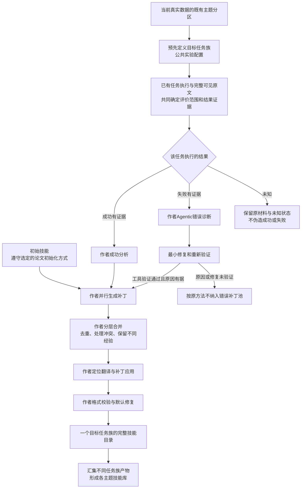

# 当前真实数据各主题的 Trace2Skill 强基线方案

日期：2026-10-06。状态：本地来源清单与原方法核查完成，尚未启动模型生成。用户要求以当前真实数据及既有柱状图分类为范围，各任务主题生成多个技能，完整使用Trace2Skill作为强基线。

同日进一步逐项核查见[基线缺项、配置差异与验收计划](2026-10-06_trace2skill_baseline_gap_and_acceptance_audit.md)：下文是完整机制方案，不代表当前已接通。论文合并批32与发布命令默认5须区分；实际请求参数、消费首skill、检查器缺失和学习验证均需单独验收。

## 先纠正上轮的安排

两个合同会话并非图外数据。`conv_011570125174`和`conv_f586a09e7356`都在当前工作集中，均是“合同审阅与法务合规”的保留会话。当前类别中，它们各有一条局部学习片段，合计10条消息；051案例是同源会话的后续恢复版本，覆盖48条消息。原数据、局部片段和恢复结果是三个产物层。上轮没有说明这层对应，也不应该拿两个案例代替整个主题的基线安排。

还有一处口径应纠正：**不要求整个企业会话最终成功。** Trace2Skill学习的单位是一个明确任务的一次执行。边界清楚、结果可核验的局部子任务也能使用；某个操作通过、用户提出新需求或助手声称完成，都不能自动变成整个任务的成败认证。旧结论“43条未找到整候选成功证据”不等于“这43条里找不到任何可以判定的局部任务”。

## 1．固定范围就是当前主题数据，不再另挑数据

唯一数据版本为[task_topics_20261006](../datasets/evomind/task_topics_20261006/README.md)。保留716场会话和暂存508场会话都在范围内，共1224场；此前排除的242场不纳入本版。现有719条是局部学习材料，尚不能统一称为719条完整轨迹。

| 原柱状图主题 | 会话素材 | 现有学习片段 |
|---|---:|---:|
| 合同审阅与法务合规 | 143 | 121 |
| 招聘、简历与人事 | 127 | 80 |
| 文档、演示与视觉内容 | 232 | 178 |
| 财务核算、预算与数据表格 | 33 | 43 |
| 企业、市场与经营调研 | 223 | 100 |
| 教学、教育与科研 | 193 | 57 |
| 软件产品、代码与技术排障 | 48 | 55 |
| 新闻与一般信息检索 | 45 | 5 |
| 助手配置与技能管理 | 45 | 15 |
| 知识库、记忆与资料整理 | 49 | 28 |
| 行政协同、邮件与日程 | 47 | 23 |
| 个人生活与旅行咨询 | 33 | 14 |
| 可见目标尚不明确 | 6 | 0 |
| **合计** | **1224** | **719** |

会话按主主题统计，学习片段按具体任务主题统计，两列不是相同的统计轴。例如财务类43片段并不表示来自这33场主主题会话；混合会话的某个具体任务可以属于另一主题。数量和现有柱状图一致，不重新标注或重画分类。

本轮已建立[逐主题准备清单](../experiments/20261006_trace2skill_topic_library_preparation/README.md)：全部719条来源编号、消息成员及分区行号均可回查。只登记来源，不裁定结果，不运行任务恢复、聚类或模型。

## 2．每类多个技能怎样保持 Trace2Skill 路线

原方法将一个目标技能的多条轨迹合并成一个目录；一次作业不是“自动发现任意数量技能”的算法。[论文§2.1—2.4](https://arxiv.org/html/2603.25158v5#S2)、[作者源码](https://github.com/Qwen-Applications/Trace2Skill)。

因此，正确组织方式是：**同一主题预先定义不同的目标任务族，每个任务族分别完整运行Trace2Skill，最后将这些独立产物组成主题技能库。** 比如财务主题中，发票去重汇总与新旧成果表对比有不同目标；可以调查是否具备两套可复用经验，而不把43片段合成一个万能财务技能，也不把43片段直接各包装成一个技能。

这里的任务族定义属于实验配置，不冒充Trace2Skill的自动聚类能力。它需要在正式运行前写明目标、适用输入、交付要求和来源范围，不能看生成结果后改分组。强基线不采用我方新提出的workflow聚类、我方UNKNOWN经验总结器或skill-creator替代作者的分析与补丁合并；多个不同能力不能用同一个技能的随机重复或Error/Success/Combined三个版本凑数。

下面是当前元数据确实已有的不同任务例子。**它们只用来说明主题里有哪些不同工作，未被判定为24个技能，更没有证明各例子可以独立形成一个有效技能。** 定义任务族还需检查目标、方法和复用边界，不是按题目名称机械切分。

| 原主题 | 当前真实任务例子一 | 当前真实任务例子二 |
|---|---|---|
| 合同法务 | 课程委托合同立场修正 | 股东名册填报 |
| 招聘人事 | 季度绩效改为360评价 | 提取两份PDF简历并对比 |
| 文档演示 | 文章向党报文风修订 | 批量页面生成及PDF水印 |
| 财务表格 | 发票去重汇总 | 比较新旧成果表 |
| 经营调研 | 地区企业政府申报机会筛选 | 判断投资项目价值 |
| 教育科研 | 生成并检查五线谱互动教学页面 | 分析教师数字素养问卷 |
| 技术排障 | 测试浏览器自动化的元素交互及导航结果 | Python低版本语法兼容排障 |
| 新闻检索 | 盘中市场数据日期核验 | 事故传闻权威核查 |
| 助手技能管理 | 水印技能注册 | 第三方技能安装完整性修复 |
| 知识资料 | 导入全部IMA笔记 | Wiki目录与索引一致性修复 |
| 行政协同 | 创建运营会议提醒 | 邮箱收件人确认 |
| 生活咨询 | 亲子自驾行程规划 | 合伙人沟通脚本修订 |

只有5片段的新闻类也有不同任务标签，但这不能证明其经验已足够生成多个技能。“目标尚不明确”类没有现有候选，保留在统计里；不强制初始化和生成。其他类别也以实际可学习的方法决定有效产物数量，不承诺每类至少两个必然成功。

## 3．完整保留的生成机制

使用已提供的历史轨迹，不要求重新采样旧任务。保留作者成功分析、主Agentic失败诊断和修复验真、并行补丁、分层合并、定位翻译、程序应用、格式校验，以及原默认的续写、JSON修复和验证配置。作者正常失败退出或未形成补丁也必须保存，不人工重写最终SKILL后冒称原生成。

初始化不能再用手写三步。表格Creation按论文采用模型参数知识生成弱初稿，生成时不给学习轨迹和经验结论；当前未核得作者准确初始提示，重建时必须公开本地提示与来源差异。论文数学和DocVQA的Creation表中初始条件为No Skill，并非所有领域都强制相同xlsx-basic草稿；作者人工技能深化是另一种初始化，不能静默切换。初始方法应在每个领域运行协议中固定。[论文§2.4、§3.4—3.5及附录A](https://arxiv.org/html/2603.25158v5)。

原方法最终交付补丁应用后的目录，包含SKILL.md及确实生成或保留的辅助材料。额外压缩归档只是分发包装，不调用另一个creator重写生成结果；能通过格式检查不等于已证明任务收益。

## 4．“完整算法”与“表格脚本零修改”需要区分

作者论文跨领域使用不同任务和验证器；发布仓库主要是表格实现。本地[失败入口](../baselines/Trace2Skill/analysis/run_error_analysis.py:89)固定寻找XLSX gold，[分析代理](../baselines/Trace2Skill/analysis/error_analysis_agent.py:30)绑定表格评测路径。因此合同、人事、代码、教学等全部主题不能直接用同一个表格判分接口。

推荐的强基线定义为：**保留完整Trace2Skill机制，公开最小领域适配。** 只适配历史格式、任务领域说明、实际可取得的输入输出、可信判据及外部验证器；不改变补丁产生、合并和应用方法，不移除失败修复PASS要求，不把LLM-only错误对照冒充主方法。

例如，一条任务如果实际要求就是文字表格，那么可以评价已保存的文字输出，诊断器也可以检验针对该文字的最小修复；若它要求验证真实Word修订痕迹，就不能用文字点评通过代替文件验收。缺附件时只评价预先明确且有证据的局部范围，不造出历史文件、专业真值或工具结果。不能把一个新需求倒推成上一轮失败，也不以“模型看起来认为对”默认为业务真值。

这可以在论文中写为“Trace2Skill迁移至企业任务”，并披露历史由原平台异构agent产生、不是作者主实验的同模型自采样设置。它是方法层面的忠实迁移，不是作者原表格实验的逐字、同数据、同模型复现。若用户要求连表格提示和判分脚本也零修改，则无法覆盖当前全部主题；这一技术边界不能靠换名称解决。

已向用户提出一个范围澄清：完整保留算法且允许领域接口配置，还是表格脚本和提示零修改。**答案未到之前，只完成独立的本地清单，不执行依赖该选择的付费生成。** 这一问题来自公开实现固定的表格加载、gold和评价路径，不来自额外的开发skill审批规则。

## 5．使它成为强基线的实验约束

- 原版主体固定在已核commit `3d0b52a140f002a512930252b613c49048f7d5ac`；领域适配放在独立层，逐项列出，不暗改核心。
- 正式运行前固定任务族与评价范围、历史来源、初稿、模型和生成参数、缓存、预算、停止规则。每个任务族独立保存原文、成败依据、分析、补丁、合并、应用日志和完整最终目录。
- 比较轨迹恢复作用时，两组共享主题/任务族、同一原始来源、同一评价证据、同一初稿与作者下游；只改变是否经过轨迹恢复。不只给我方来源补充或正确答案，也不事后删除基线失败。
- 不能把“输入未满足原处理器前提”“未知结果无法判定”记成Trace2Skill算法能力失败，更不能把0条可路由材料当成它的任务成功率为0。
- 后续用独立任务验证技能收益；学习会话不兼作盲测。覆盖、生成成本、失败/未知、可消费性与任务效果分开报告。现在还没有这些结果。

当前已完成：当前主题计数、719条来源登记、32个源指纹、24个真实任务名称例子及原方法边界核对。清单按当前 `research_annotations.task_topic` 分区；旧质量画像的主题有129处与当前复查标签不同，不能误读旧字段重分组。首次免费探针曾误用旧字段并在数量断言处停止，修正读取字段后通过；没有模型费用、没有修改数据标签。

下一步依次是：固定忠实迁移范围 → 定义各主题目标任务族及可判定任务执行 → 准备初稿和领域验证接口 → 免费通路检查、冻结协议 → 先验收一个目标任务族的完整原链 → 在同一协议下扩展其余主题。不是再次换一个图外样例，也不是重新把整会话当已恢复轨迹。

## 附：24个例子的确切来源

以下任务字符串和候选编号均独立核对到当前主题分区，24/24匹配；没有读取或复制企业对话正文来写本表。

| 主题 | 候选编号一 | 候选编号二 |
|---|---|---|
| LEGAL | conv_23bffc5f1e1b:learn01 | conv_956c87eca622:learn01 |
| HR | conv_245a7b03a18b:learn01 | conv_e17409b249a6:learn01 |
| OFFICE | conv_bcae4fd64969:learn01 | conv_61034c4c6675:learn01 |
| DATA | conv_80e86b5805f5:learn01 | conv_ee979d0d59fb:learn01 |
| BIZ | conv_c952411dbdfe:learn01 | conv_7c90fd36e5bf:learn01 |
| EDU | conv_71629b81db24:learn01 | conv_e1394bb92ca8:learn01 |
| TECH | conv_9f975ffa392f:supp01 | conv_567a2331adcf:learn01 |
| NEWS | conv_9bfd4928da60:learn01 | conv_fa8adda38d0c:learn01 |
| ASSIST | conv_f34d1eb4b810:learn01 | conv_5d1d5410135d:learn01 |
| KNOW | conv_24bc635473a8:learn01 | conv_83820ac2bbbe:learn01 |
| COMM | conv_3475f26df3d6:learn01 | conv_2c2d2c4d0df1:learn01 |
| LIFE | conv_d3b35bbaf6ed:learn01 | conv_23a12ab71383:learn01 |

来源：[原统计CSV](../datasets/evomind/task_topics_20261006/topic_statistics.csv)、[现有候选正文与元数据](../datasets/evomind/task_topics_20261006/private/learning_candidates.jsonl)。本轮0新增模型调用、0新rollout、0新技能；旧实验和旧结论保留并通过本轮记录更正适用范围。
