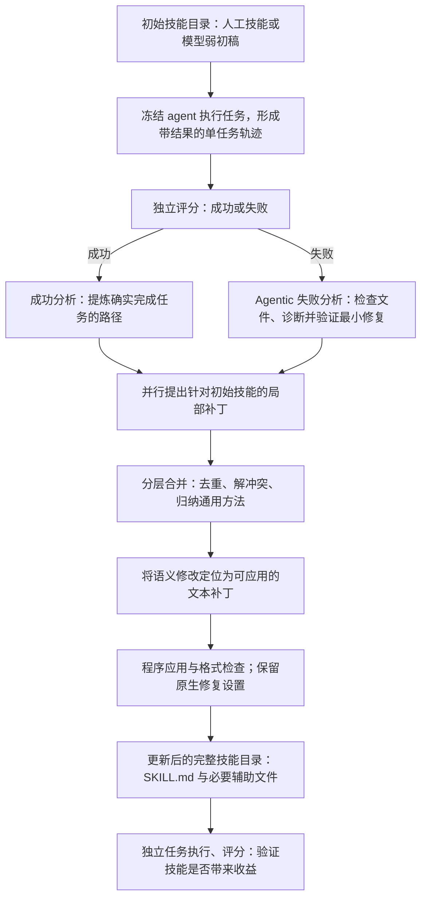

# Trace2Skill 原版初稿与完整运行核查

日期：2026-10-06。本轮回应“完整执行 Trace2Skill，不自行替换初稿或链路”的要求。**本轮未启动新模型请求，完整运行尚未完成。**

后续澄清：**用户已有的执行轨迹不必来自使用初始技能后的运行。**初始技能是后续修改对象，轨迹是独立的经验来源；原离线入口没有同一技能使用证明要求。下面“初稿→采样”的图说明论文主实验设置，不应升格为企业历史必须重跑的门槛。已有固定历史主线继续，具体成败与材料证据另行核对；见[更正记忆](../memory/2026-10-06_existing_traces_do_not_require_prior_skill_use.md)。

## 1．原方法有初稿来源，之前没有忠实执行

原论文明确给出两种起点：已有人工技能；模型仅凭参数知识生成的弱技能。表格创建实验的弱起点叫 `xlsx-basic`，由 Qwen3.5-122B-A10B 生成，不使用轨迹。证据是[论文 §2.1、§2.4、附录 A](https://arxiv.org/html/2603.25158v5#A)。

因此，不能说原 Trace2Skill 没有初稿环节。之前实验中的[22 行初稿](../experiments/20261006_trace2skill_ecnu/initial_skill.md)由我们手写，名称和泛三步均事先指定；这不是忠实复现该模型初始化步骤。

须区分论文方法与公开执行入口：当前固定版本源码的演化 CLI 要求事先存在 `技能目录/SKILL.md`，不会自动从空目录生成初稿。公开源码核查尚未找到作者的 `xlsx-basic` 原稿、准确生成提示或初始化脚本。缺少公开实现不能推出论文没有此步骤，也不能由我们补写后称作者原始产物。

核查范围：论文 v5 附录 I 只有执行、分析与合并提示；远端仅发现 main，HEAD仍为本地固定版本；[main历史页](https://github.com/Qwen-Applications/Trace2Skill/commits/main/)列9次提交，本轮读到其中8个官方patch，包括初始发布和裁剪提交。另1个patch访问403，未反复重试。因此准确表述是“在已核查公开材料中未找到”，不是断言作者从未发布。

作者提供的 [xlsx 初始目录](../baselines/Trace2Skill/spreadsheet_agent/skills/xlsx/SKILL.md)可用于原生“深化已有技能”路线，包含说明、重算脚本和许可；它不能冒充模型弱初稿。发布的 `xlsx-35B/122B` 是演化成品，也不能倒用作初稿。采用深化路线需要明确变更，不自动代替用户要求的创建实验。

## 2．完整链路及真正的封装方式

以上是论文链路及[官方 README](../baselines/Trace2Skill/README.md)公开执行顺序的对应，不表示本轮已执行。官方生成交付物是更新后的目录；`.skill` ZIP 只是额外归档，不是算法必需的生成阶段。skill-creator 智能体在[论文附录 H](https://arxiv.org/html/2603.25158v5#H)属于外部比较基线，不是 Trace2Skill 的原生最终重写器；本地格式检查脚本名称相同也不代表调用了该智能体。

## 3．这次不再替换的部分

- 不沿用上次的手写初稿、自定义 UNKNOWN 经验提示或改写的补丁提示。
- 不关闭原生定位翻译、格式自修复和最多 3 轮校验修复，再将结果称为默认完整流程。
- 不将分批提议补丁称为轨迹语义聚类，不把 ZIP 打包称为技能效用验收。
- 旧实验、失败、费用和原包保留；新完整运行另开记录，不能覆盖旧结果。

## 4．启动前具体缺什么

| 当前缺口 | 对运行的具体影响 | 不能采用的替代 |
|---|---|---|
| 模型弱初稿的原文／准确提示未在当前公开材料找到 | 无法逐字复现论文创建路线的初始化 | 手写三步、使用已演化成品或暗中改成深化 |
| 既定 6 条企业整会话的任务最终成败未知 | 原成功／失败提示不能直接接收整会话 UNKNOWN | 用助手“完成”自述充当评分，改文件名伪造成功／失败 |
| 部分输入、输出和标准答案文件缺失 | Agentic 失败分析无法完成文件对比与最小修复验证 | 虚构文件或把日志推测称已验证因果 |
| CLI 固定相对路径的格式检查器未随作者 checkout 提供 | 正式入口还需补齐运行依赖 | 静默修改作者核心程序 |

免费入口核验：原版任务执行、Agentic失败分析、单文件评分与批量评分四个 `--help` 均退出0。这只证明命令入口可达，不代表真实任务已经通过。Windows下名为bash的工具实际使用系统默认命令壳；xlsx重算脚本还依赖本机未检出的soffice。评分器读取已有公式缓存，本身不调用soffice，因此不能把重算依赖扩大成所有生成或评分分支的必要条件。原生可执行文件任务链仍需专门核验运行环境。

评分入口还有原生回退：`evaluate_with_official.py` 导入外部 `evaluation_official` 失败时会改用仓库自身的表格比较器。当前未确认外部模块可用；新运行须记录实际比较器，不能仅凭脚本名称声称已使用论文官方完整评分实现。

成功分析与作者另提供的 LLM-only 失败分析可以不依赖文件实体，但依然预设对应任务已成功或失败。LLM-only 是论文比较分支，不能暗中代替主方法的 Agentic 失败分析。`--all` 只取消日志筛选，不提供 UNKNOWN 语义入口。

模型继续使用用户提供的 `ecnu-plus`；这与论文 Qwen3.5 作者配置不同，必须单独披露，不能承诺精确复现论文数值。当前仅确认方法和源码要求，没有确认新完整运行的样本规模与费用。

## 5．当前执行状态

用户已要求重新进行完整运行；旧批次的停止规则不禁止另立新运行。但是，用户同时要求不得自行变更方法。已向用户确认：继续既定企业历史并核实任务结果与材料，还是明确改用作者可执行、可评分的公开表格任务。回答前不擅自切数据源，不付费启动依赖该选择的步骤。

同时确认初始化复现尺度：是否按论文明确描述，由用户提供的模型仅凭自身知识生成弱初稿，完整保存并披露我们拟定的提示；还是必须取得作者原稿／准确提示后再运行。前者可复现初始化机制，但不能声称提示、初稿和权重与论文逐字一致。当前尚未收到选择，未自定新提示或生成新初稿。

本轮新增证据是论文初始化来源及公开入口缺项的核对，不是新生成结果。既有累计请求仍为 19 次，已报告 265,639 tokens，另 1 次超时实际用量未知。

源码定位：初始目录要求见 [combined CLI](../baselines/Trace2Skill/skill_evolver/run_parallel_combined_skill_evolution.py:215)；原生默认配置见 [ParallelSkillEvolver](../baselines/Trace2Skill/skill_evolver/parallel_evolving_agent.py:374)；失败验证要求见 [原失败提示](../baselines/Trace2Skill/analysis/error_analysis_system.txt:6)；成功前提见 [原成功提示](../baselines/Trace2Skill/analysis/success_analysis_system_llm.txt:6)。
