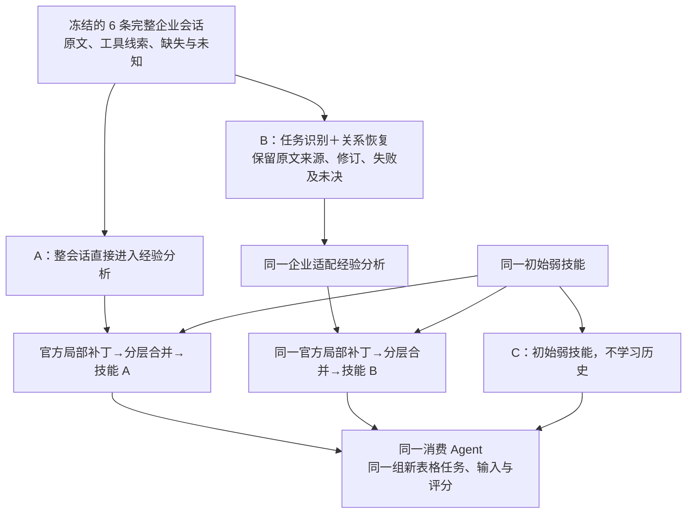

# Trace2Skill 官方源码与单主题试跑方案

日期：2026-10-06。状态：**方案，尚未执行**。本轮只核对项目记忆、官方代码和现有数据，不克隆、不安装、不调用生成模型、不修改 Demo，也没有产生新技能或效果分数。

同日依赖澄清：**可以先只做生成侧验收，不以历史附件／交付文件实体、KM历史环境或完整skills库为前置。**原始会话正文仍必需；生成器需要自身代码依赖、模型接口、共同初始弱技能草稿与格式检查。历史缺内容的附件／技能实现保持未知，不补造流程或成功结论。下文新任务消费是独立的后续验收，才需要可用的新输入、执行工具与评分；不阻塞先生成候选技能。[澄清记忆](../memory/2026-10-06_skill_generation_dependency_boundary.md)

## 1．结论与首轮目标

**有作者官方源码，可以复用其核心生成算法。建议先跑“表格生成与核验”，使用 6 条完整的真实来源会话。**不是把 43 个 DATA 候选摘要直接交给模型，也不是重跑过去的企业任务来制造新轨迹。

首轮回答两个具体问题：

1. 固定企业历史材料能否经过官方 Trace2Skill 的经验分析、局部补丁与分层合并，产出可以读取和执行的技能？
2. 同一批材料先恢复任务关系，是否比整会话直接学习少一些错学，并在新任务上产生收益？

这是小规模可行性探索。6 条会话和少量新任务不能证明论文层面的普遍优势；若直接学习与恢复后学习一样好，也必须保留这个结果。

## 2．官方代码已开放到什么程度

作者仓库为 [Qwen-Applications/Trace2Skill](https://github.com/Qwen-Applications/Trace2Skill)，对应 [Trace2Skill 论文](https://arxiv.org/abs/2603.25158)。仓库目前重点开放电子表格运行通路、经验分析器、补丁生成与合并，以及已学习的表格技能。README 声明 Apache 2.0；本轮未独立核验根许可证文件。公开的已学习技能不拿来冒充本实验的初始弱技能。[官方说明](https://github.com/Qwen-Applications/Trace2Skill)

| 部分 | 已核实的入口与能力 | 本实验怎样使用 |
|---|---|---|
| 表格任务运行与评分 | 仓库中的表格运行器与评分入口 | 后续完整原论文复现可用；首轮企业实验使用固定消费器，不混报原论文分数 |
| 成功经验分析 | [成功日志分析器](https://github.com/Qwen-Applications/Trace2Skill/blob/main/analysis/run_success_analysis_llm.py) | 读取已有日志；其成功假设不适用于所有企业会话 |
| 失败经验分析 | [单次模型分析器](https://github.com/Qwen-Applications/Trace2Skill/blob/main/analysis/run_error_analysis_llm.py)和[验证型分析器](https://github.com/Qwen-Applications/Trace2Skill/blob/main/analysis/run_error_analysis.py) | 前者可分析已知失败日志而不重放文件；后者依赖执行与验证条件，两者不能当成同等证据 |
| 补丁生成、分层合并、写入技能 | [组合入口](https://github.com/Qwen-Applications/Trace2Skill/blob/main/skill_evolver/run_parallel_combined_skill_evolution.py)、[核心合并实现](https://github.com/Qwen-Applications/Trace2Skill/blob/main/skill_evolver/parallel_evolving_agent.py) | 保留作者实现，接入已存的经验记录；组合入口不强制提供新的任务数据路径 |

核心可以从分析记录开始运行，因此**不必为了使用 Trace2Skill，先给每个历史任务主动采样多条新 rollout**。这与当前固定真实历史的研究条件一致。[组合入口源码](https://github.com/Qwen-Applications/Trace2Skill/blob/main/skill_evolver/run_parallel_combined_skill_evolution.py)

但“有源码”不等于现有企业文件能原样直接运行：

- [成功分析提示](https://github.com/Qwen-Applications/Trace2Skill/blob/main/analysis/success_analysis_system_llm.txt)将首条用户消息当作单一任务，并假设最后结果正确；真实会话可能交错多个目标，最终业务结果未知。
- 成功分析器的文件发现只识别成功／失败命名日志；开启其全量开关也不提供“未知结果”的原生语义支持。不能通过改文件名给未知任务伪造成败。[日志分析器](https://github.com/Qwen-Applications/Trace2Skill/blob/main/analysis/run_success_analysis_llm.py)
- 官方应用入口要求一个固定位置的技能格式检查脚本。在线读取该路径未成功；执行前必须在固定源码版本中核查并补齐路径。[检查器常量](https://github.com/Qwen-Applications/Trace2Skill/blob/main/skill_evolver/skill_evolving_agent.py)／[入口检查](https://github.com/Qwen-Applications/Trace2Skill/blob/main/skill_evolver/run_parallel_combined_skill_evolution.py)。本机已有 OpenClaw 的同名检查器，但兼容性和版本仍须核对，不能未经比较就称为相同实现。
- 官方组合归一化不会自动保留我们的全部来源与未知信息，需要单独保存证据台账。[归一化源码](https://github.com/Qwen-Applications/Trace2Skill/blob/main/skill_evolver/parallel_success_evolving_agent.py)
- 官方入口的“只看修改、不写最终文件”模式仍会运行模型，不能当作免费预检。[入口源码](https://github.com/Qwen-Applications/Trace2Skill/blob/main/skill_evolver/run_parallel_combined_skill_evolution.py)

因此首轮应准确称为：**官方 Trace2Skill 核心＋企业历史输入适配**。不能称为原论文配置与数据的完整复现，也不能用我们自己重写的聚合器冒充官方算法。

## 3．为什么选这一类，实际用哪些数据

最新材料池有 1,224 条保留／暂存会话、719 个局部学习候选。DATA 的 43 个候选来自 43 个不同会话，但这一大类混有财务判断、宣传数字核对和其他工作；不能全部当成电子表格轨迹。[版本统计](../datasets/evomind/task_topics_20261006/summary.json)／[上轮复查](2026-10-06_evomind_task_topic_release.md)

本轮盘点出 8 条“表格生成与核验”探索种子。其中两条极长会话共 552 条消息、247,439 个正文字符，当前恢复入口会拒绝超出预算的完整会话，不能直接承诺处理。因此首轮建议以下 6 条：

| 来源会话 | 待学习的任务范围，非已验证结论 | 清洗后消息数 | 正文字符数 |
|---|---|---:|---:|
| conv_9b78a49bd169 | 将源报表填入模板：科目与期别对应、公式保留、重算检查 | 13 | 2,608 |
| conv_7f5a1845d742 | 评分预算表：公式起始行、引用范围与百分制口径 | 2 | 3,199 |
| conv_d2c84054d91a | 模板填入实际数据，处理合并表头和连续用户修订 | 63 | 16,601 |
| conv_e6fdd2e394f4 | 合并学校表并检查数量守恒；无法确认的归属保持未知 | 34 | 3,860 |
| conv_ee979d0d59fb | 先处理项目更名映射，再比较新旧表差异 | 2 | 2,325 |
| conv_b5e6f3d3bab9 | 表格脱敏修订，避免损坏金额和样式 | 15 | 2,010 |
| **合计** | **6 条完整来源会话** | **129** | **30,603** |

这 6 条关联 20 个文件元数据引用、11 个工具记录 ID。这些计数不证明文件字节、完整调用序列或本机依赖可用。6 条均未认证完整真实时序，整任务成功均为未知。缺失附件不妨碍从可见正文学习有限经验，但不允许验证过去的文件交付质量。

保留给第二批的两条：

- conv_6f4fad2b911f：354 条消息、133,300 字符，包含 Excel 示例／公式及其他任务。
- conv_9f52e89fe262：198 条消息、114,139 字符，包含多版本表格修订与核查。

两条不因太长被判无价值；后续需要共同的窗口、上下文传递与来源覆盖协议。若为了预算截掉尾部失败信息，不能再声称在公平比较轨迹恢复。

**实际输入来源**是 [完整无研究答案模型输入](../datasets/evomind/task_topics_20261006/private/model_inputs.jsonl)，按上述会话编号抽取全正文及可见证据。候选表只帮助研究人员选样，不把其中的方法摘要、任务答案、人工匹配、审核结论喂给模型。

另一个重要区别：8 个种子的会话主主题为 5 DATA、2 BIZ、1 EDU。任务类别与会话主主题不是同一轴；不能只读 DATA 的会话分区来组装本实验。首批 6 条从全量来源按编号提取。

## 4．两条生成通路与一个消费对照

| 组别 | 使用什么 | 回答什么 |
|---|---|---|
| A：直接学习 | 完整会话＋共同企业适配分析器＋官方补丁合并 | Trace2Skill 在这类自然历史上的起点效果 |
| B：恢复后学习 | 相同证据经过任务／关系恢复，再用同一分析器和官方合并 | 新增恢复环节是否减少混淆、改善复用 |
| C：不学习历史 | 同一初始弱技能，使用同一消费器 | A／B 的新技能是否比原有基础能力有用 |

首轮只研究恢复干预：**B 不额外使用我方工作流聚合器，不输入我们已整理的方法摘要或候选技能**。否则同时更换上游恢复、聚合与封装，无法归因给恢复。

A 仍允许分析模型自己理解上下文，不故意要求它忽略修订或只看第一条用户输入。我们比较的是显式恢复机制的增量，不是人为削弱基线。

初始弱技能只说明表格任务的通用定位与基础流程，A、B、C 同源冻结。不放入这次研究人员从真实会话盘点出的具体改进规则；也不使用官方已训练完成的 released skills 作为“从零”起点。

消费侧建议沿用现有 OpenClaw，A、B、C 固定同一模型、工具、提示和工作目录重置规则。若换成作者原生表格消费器，三组一起换并另立协议，不能只给某一组额外能力。首先固定技能加载方式，确认读取的是对应版本的实际正文，而不只是提示中出现技能名称。

## 5．未知结果怎样适配，才能保住强基线含义

这部分必须在执行前做好，并保存代码／提示差异：

1. **只转换载体。**保留用户、助手、工具记录及原消息来源；没有可确认时间时继续标未知，不把展示顺序变成已证实时间顺序。工具累计快照不能重播成多次实际动作。
2. **修改共同分析入口的任务与结果假设。**允许多任务，区分明确要求、可见操作、用户纠正、局部错误和整任务结果未知。两组使用同一入口，不能仅 B 获得更谨慎的成功定义。
3. **已有局部成功／失败按原范围处理。**用户反复改要求不自动等于旧方案失败，文件写入成功也不等于内容验收。
4. **未知经验不塞入成功／失败数组。**需要一条结果中立的经验入口和相应的补丁提议提示，将“未验证参考方法”与“已验证成功方法”区分。可以复用作者补丁结构、分层合并与程序应用，但新增第三类入口／提示必须列为企业适配改动。若原结构不能忠实承载未知，就先完成这个适配，不能靠字段改名绕过。
5. **来源与边界同时进入提示和台账。**仅旁路保存未知不够，补丁生成器也须看到适用条件、观察范围与未验证性质；最终技能不能把它们删掉。记录新条款从哪段原文而来，未分配内容继续保留。
6. **保留实际学习差异。**B 只改变关系组织形式；两组可见的原文、文件缺失、工具、反馈与目标范围相同。恢复新增的模型请求与 token 单独计入总成本。

这一适配允许把未知方法正常作为候选处理，但不承诺其有效。称为历史输入适配版的原因，正是官方原版并不直接承担上述未知／多任务责任。

## 6．怎样看“效果”，不只看文件生成了没有

建议先准备 **6 个独立的新表格任务**。以下均为拟构造的小规模测试，不是已取得的企业附件或已有评测结果；冻结输入和可编程检查后才能正式消费。

| 新任务示例 | 明确输入 | 应交付什么，以及怎样检查 |
|---|---|---|
| 期别与科目填表 | 新源报表、空模板、明确科目对应和两期数据 | 填写后的 xlsx；数值落到正确位置，非目标公式保持，汇总数正确 |
| 评分公式修订 | 新评分表、有效数据行、百分制口径 | 修改后的 xlsx；引用不漏首行／末行，分值范围与已声明口径相符 |
| 合并表头模板 | 新的合并表头模板和实际数据表 | 完成文件；目标格有实际数值，合并区域与非目标样式保持 |
| 数量守恒与未知归属 | 两张新学校表、已知对应表，另有一条无对应记录 | 合并结果和未决清单；总量守恒，未知记录未擅自归属或丢弃 |
| 更名与新旧差异 | 两期项目表和显式更名映射 | 差异表；更名项目不被误判为新增，真实新增／删除正确 |
| 脱敏与格式保护 | 新含姓名／账号的表格、脱敏规则、金额／样式保留要求 | 脱敏后的 xlsx；敏感格按规则处理，金额与约定样式不损坏 |

任务目标必须明确给 Agent；隐藏正确结果只给评分器。检查不要求生成器猜未提供的业务映射。评测文件、答案和评分代码不能进入学习侧。

首轮计划 6 任务 × A／B／C 三组＝18 次任务执行。每次执行可能含多次模型请求，不能把 18 次执行写成 18 次 API 调用。每任务独立重置目录，同一输入文件复制后使用；技能生成冻结后不再看测试结果修改。

只保留四类探索结果：

- **技能可消费性：**能否通过格式与资源路径检查，是否被 Agent 实际读取，并交付要求的文件。
- **新增条款的来源与错学：**逐条回查本次修改；记录无依据的成功断言、跨任务条件串用、固定实例数值等。初始通用规则与新学修改分开；同一研究人员复查不是独立黄金认证。
- **新任务成功数：**A、B、C 各完成几项、哪些同题改善／退化；小样本只做描述，不报普遍显著优越。
- **实际资源：**恢复、分析、补丁、合并、生成失败与消费全部记录请求数、输入／输出 token 和耗时。费用只有单价核实后才算，不能预设恢复后总成本下降。

如果只能生成技能而尚没有可执行新文件任务，就交付生成质量探索，暂不声称技能增益；不必等所有企业旧附件找回来，但独立消费任务确实需要真实可用的输入与检查。

## 7．执行次序、冻结规则与停止条件

| 顺序 | 要做的事 | 通过条件 |
|---|---|---|
| P0：免费预检 | 固定官方 commit；核查导入、协议、检查器、路径、依赖、原文覆盖；测试数据解析／补丁格式，不运行模型 | 明确记录所有适配；没有假成功标签、隐含答案、正文截尾或悬空资源 |
| P1：固定材料与配置 | 提取 6 条全文，生成来源清单与校验值；冻结共同分析提示、弱技能、模型／参数、评分任务与预算 | 原始材料两组一致，测试独立，所有新增改动在正式运行前完成 |
| P2：生成 A 与 B | 一轮历史学习，保存经验、补丁、每层合并、拒绝／失败、最终目录 | 官方核心实际执行，技能包和来源可查；失败不换提示偷偷补跑 |
| P3：实际消费 | 同一 OpenClaw 对 6 个新任务分别使用 A、B、C，保存读取与产物记录 | 不只声明使用技能；文件可读取，独立检查给出结果 |
| P4：复盘 | 并列技能变化、逐任务结果和全成本 | 分开报告接口失败、信息不足、算法错学与消费漏步，决定是否扩到两条长混合会话 |

建议只做一个冻结种子、一轮生成、最多两个并行工作线程；模型步数、输出上限与总请求／token 上限在免费预检后写入清单，付费前确定。不得靠偷偷删证据、追加重试或挑最佳种子来满足预算；若预算不足，正式运行前缩小批次并另冻结协议。当前材料大小是字符数，尚不能据此承诺精确 token／费用。

本机已有 [OpenClaw 技能检查脚本](../../enginering/demo/.runtime/node_modules/openclaw/skills/skill-creator/scripts/quick_validate.py)和[直接管道使用说明](../../enginering/demo/DIRECT_PIPELINE_README.md)。这是可复用资源的定位，**不是 Trace2Skill 已安装、企业导入已接通、或表格重算环境已验收**。尤其只写公式不等于重算：如测试要求公式计算结果，必须准备可用的重算程序并先验证。

继续／停止判据：

- 路径、协议、格式检查器等失败：先作为准备问题解决，原运行保留；不归因于算法差。
- 生成文件可读但存在大量无据成功经验：停在生成侧，检查共同输入／未知适配，不能扩大消费掩盖问题。
- A 和 B 同样有效，或恢复组更差：保留负结果，不宣称恢复必需；用具体任务解释是否有关系瓶颈。
- B 减少错学且在配对任务有可追溯改善：再引入两条自然长混合会话，准备窗口公平协议与独立关系标注。之后才考虑扩大任务、增加种子或完整论文实验。
- 三组都完成所有简单任务：说明任务区分力不足，下一轮提高真实约束与难度；不能据此宣称技能算法已优越。

## 8．本轮新增观察与尚未知道的事

**观察：**官方代码的离线合并入口存在，日志只读失败分析也存在；不能把缺文件等同于完全不能学习。未知结果仍需要适配，格式检查路径是运行前必须处理的实际问题。6 个首轮种子存在于盲输入，规模 129 条消息／30,603 字符；另外两条长会话需独立输入策略。

**研究假设：**显式恢复任务、要求、反馈和失败关系会减少错学；尚无本轮效果数据支持。

**工作建议：**先用 6 条短会话跑官方核心及固定消费，后续再用两条长混合会话检验研究问题；主题下不机械要求产生固定数量技能。

**未知：**官方固定 commit、本机完整运行条件、结果中立适配的最终实现、模型协议兼容、独立新任务文件／评分器、消费收益与成本。本轮仅规划，并未认证这些已就绪。

此前已知官方仓库与企业适配限制见 [10 月 5 日评测准备方案](2026-10-05_local_evaluation_readiness_and_trace2skill.md)；本轮是按最新任务主题池收敛出首轮批次并补核源码，不抹去旧报告或旧负结果。
